# 第六章. Web 应用程序漏洞评估

在本章中，我们将涵盖以下内容：

+   在 Docker 中运行易受攻击的 Web 应用程序

+   使用 w3af 进行漏洞评估

+   使用 Nikto 进行 Web 服务器评估

+   使用 Skipfish 进行漏洞评估

+   使用 Burp Proxy 拦截 HTTP 流量

+   使用 Burp Intruder 进行定制攻击自动化

+   使用 Burp Sequencer 检查会话随机性

# 介绍

漏洞评估阶段是在目标机器上查找漏洞的过程。

同时在 Web 应用程序和网络上执行漏洞评估可能更有用，因为您将能够将来自网络基础设施和其他协议（如 SSH、telnet、数据库、SNMP、SMB 和 FTP）的不同漏洞和信息相关起来。这将让您更好地了解特定 Web 应用程序的目的及其在组织内的用途。

然而，为了让观众更容易理解，我们将专门介绍在 Web 应用程序上执行漏洞评估所需的工具和技术。本章的配方结构旨在使您能够在一个地方找到扫描和定位 Web 应用程序中所需的所有工具和技术。

漏洞评估阶段就像一个准备阶段，在这个阶段我们将找到漏洞。为了确保我们找到应用程序中所有可能的漏洞，必须进行全面的测试。然而，有时使用自动化扫描工具会产生误报。为了成功进行渗透测试，非常重要的是我们使用手动漏洞评估方法去除所有误报。

### 注意

不要对不是您自己的公共网站或不在您自己服务器上的网站运行本章演示的工具。在这种情况下，我们在云上设置了三个易受攻击的 Web 应用程序，以演示本章中的工具/技术。*小心！*

这些 Web 应用程序是 OWASP 砖块、Damn Vulnerable Web Application (DVWA)和 WordPress Version 2.2 (易受攻击!)。

这些应用程序是有意设计成易受攻击的，因此我们不建议您直接在服务器上甚至在本地桌面/笔记本电脑上安装这些 Web 应用程序。为了演示目的，我们已经在一个 Docker 容器中安装了这三个易受攻击的 Web 应用程序，并将其托管在 Docker hub 上供您拉取和使用。查看下一个配方。

# 在 Docker 中运行易受攻击的 Web 应用程序

在上一个配方中，我们下载了 Docker 并运行了一个 hello-world 示例容器。在这个配方中，我们将下载一个我们为您准备好的 Docker 容器，供您下载和使用。这是一个已经配置好并准备好使用的容器，其中包含三个易受攻击的 Web 应用程序：

+   OWASP 砖块

+   Damn Vulnerable Web Applications

+   WordPress 2.2 (易受攻击!)

## 准备工作

要完成此配方，您需要在 Oracle Virtualbox 或 VMware 上运行 Kali Linux 并连接到互联网。这个配方与前一个配方密切相关；强烈建议您在继续本配方之前先遵循前一个配方。如果您的 Kali 上已经安装了 Docker，您可以直接开始本配方。

## 操作步骤...

对于这个配方，您需要执行以下步骤：

1.  打开终端并拉取 Docker 容器镜像，如下命令所示：

```
    $ docker pull intrusionexploitation/dvwa-wordpress2.2-bricks

    ```

1.  您将看到不同的层被下载，如下截图所示：

1.  成功下载容器镜像后，您将看到类似于以下截图的屏幕：

1.  现在，使用以下命令运行已下载的 Docker 容器镜像：

```
    docker run --name intrusionexploitation       intrusionexploitation/dvwa-wordpress2.2-bricks

    ```

1.  运行上述命令后，您将看到以下输出：

1.  如果您看到相同的输出，这意味着您的 Docker 容器正在运行。保持此终端运行，不要关闭它，也不要按*Ctrl* + *C*。按*Ctrl* + *C*将停止运行的容器；现在，保持它运行并最小化终端，以免意外关闭它。

1.  要查看安装在此容器上的易受攻击的 Web 应用程序，您首先需要找出正在运行的容器的当前 IP 地址。

1.  要找出正在运行的容器的当前 IP 地址，您首先需要在新的终端窗口中使用以下命令列出正在运行的容器：

```
    docker ps -a

    ```

此命令的输出将如下面的屏幕截图所示：


1.  然后，复制容器 ID 并输入以下命令（请记住，您的容器 ID 将与此输出中显示的不同），使用输出中显示的容器 ID：

```
    docker inspect 01bf653a92f4

    ```

1.  输出将如下面的屏幕截图所示：

1.  这将是一个非常长的输出；为了快速找到 IP 地址，您也可以使用以下命令：

```
    docker inspect 01bf653a92f4 | grep IPAddress

    ```

1.  输出如下面的屏幕截图所示：

1.  如图所示，`172.17.0.2`（请注意，您的 IP 地址可能与此处显示的不同。）是容器正在运行的 IP 地址；要查看安装在此容器上的易受攻击的 Web 应用程序，请复制此 IP 地址并在浏览器中打开，如下面的屏幕截图所示：

1.  如前面的屏幕截图所示，您将看到 Apache 服务器正在运行，并且您可以看到每个不同 Web 应用程序的三个不同文件夹。

1.  从下一个教程开始，我们将使用这些应用程序进行 Web 应用程序漏洞评估。

## 工作原理...

在本教程中，我们从 Docker hub 中拉取了一个预配置的 Docker 镜像，然后运行了下载的镜像，列出了正在运行的容器，并尝试使用容器 ID 找出正在运行的容器的 IP 地址，以便在浏览器上查看安装的易受攻击的 Web 应用程序。

# 使用 W3af 进行漏洞评估

在本教程中，我们将学习如何使用 W3af 在目标 Web 应用程序中查找漏洞。W3af 是一个 Web 应用程序攻击和审计框架。该项目的目标是创建一个框架，通过查找和利用所有 Web 应用程序漏洞来帮助您保护您的 Web 应用程序。

## 准备就绪

要完成本教程，您需要在 Oracle Virtualbox 上运行 Kali Linux 并连接到互联网。不需要其他先决条件。

## 操作步骤...

对于此教程，您需要执行以下步骤：

1.  打开终端并输入`w3af_gui`；w3af 窗口将如下面的屏幕截图所示：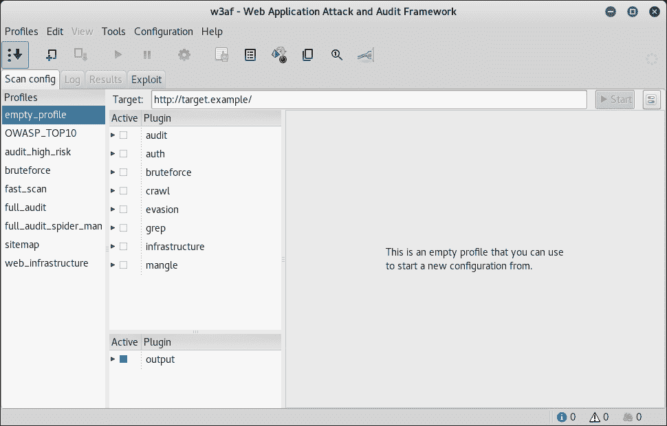

1.  在左侧面板的配置选择器中选择**OWASP_TOP10**选项。输入目标 URL，如下面的屏幕截图所示：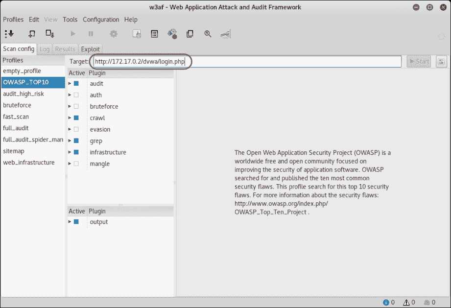

1.  展开**auth**菜单，单击**详细**插件，并输入用户名和密码（仅适用于 HTTP 表单凭据）和所有其他必需的参数，然后单击**保存**，如下面的屏幕截图所示：

1.  选择**output**并展开它并选择所有输出格式；在我们的情况下，出于演示目的，我们将检查所有内容，如下面的屏幕截图所示：

1.  之后，单击开始按钮旁边的按钮；单击后，将打开以下窗口，并询问您是否知道**target_os**和**target_framework**，然后保存详细信息，如下面的屏幕截图所示：

1.  完成所有这些步骤后，只需单击**开始**按钮，扫描将开始，如下面的屏幕截图所示：

1.  一旦扫描开始，您可以遍历选项卡并单击**结果**，随着漏洞的发现，漏洞将会出现，如下面的屏幕截图所示：

1.  接下来，单击**URL**子选项卡，在那里您可以看到以漂亮站点地图形式发现和绘制的所有 URL，如下面的屏幕截图所示：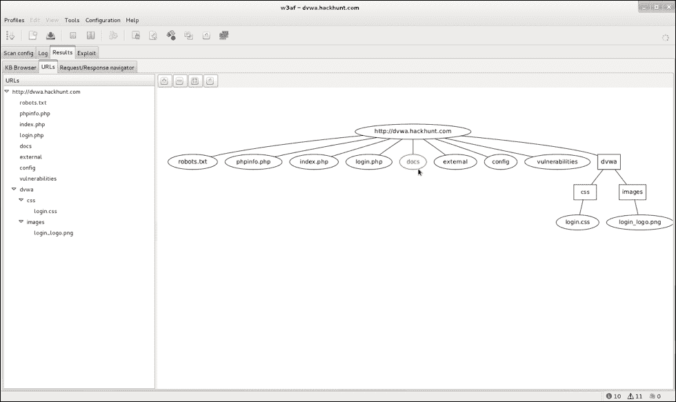

1.  在扫描运行时，您仍然可以在日志窗口中看到最新的插件运行和发现的漏洞，如下面的屏幕截图所示：

扫描完成后，结果将保存在运行 w3af 的目录中。在我们的情况下，我们从默认路径`/root/`调用，如下面的屏幕截图所示：


## 工作原理...

在这个示例中，我们使用了`w3af_gui`并配置了各种插件，在 Docker 容器中托管的易受攻击的 Web 应用程序上进行了经过身份验证的扫描，IP 为`http://172.17.0.2/dvwa/login.php`，并演示了 w3af 在执行真实漏洞评估时的工作。W3af 的能力不仅限于漏洞评估。它还可以利用类似 sqlmap、RFI 和 Metasploit 的工具，并且也可以用于执行利用。

# 使用 Nikto 进行 Web 服务器评估

在这个示例中，我们将学习 Nikto 及其 Web 服务器扫描功能。Nikto 是一个开源（GPL）的 Web 服务器扫描程序，可以针对多个项目对 Web 服务器执行全面测试，包括超过 6700 个潜在危险的文件/程序，检查超过 1250 个服务器的过时版本，并检查超过 270 个服务器的特定版本问题。

## 准备工作

要完成这个示例，您需要在 Oracle Virtualbox 上运行 Kali Linux 并连接到互联网。不需要其他先决条件。

## 操作步骤...

对于这个示例，您需要执行以下步骤：

1.  打开终端并输入`Nikto`，Nikto 将显示其可用于使用的帮助和开关（您还可以使用主要的 Nikto 来获取每个开关的详细描述），如下面的屏幕截图所示：

1.  要开始扫描，请输入以下命令：

```
    nikto -host http://172.17.0.2/wordpress/ -nossl -o wordpress-      nikto-scan.xml

    ```

1.  让 Nikto 完成它的工作，并等待它完成；完成后，控制台将显示以下输出：

## 工作原理...

在这个示例中，我们让 Nikto 对托管在 Docker 容器中的 Web 服务器和 Web 应用程序进行扫描，URL 为`http://172.17.0.2/wordpress/`。`-host`开关用于指定 URL。

有时，就像其他工具一样，Nikto 也会显示一些需要通过访问工具和 URL 检测到的链接手动验证的误报。但请放心；运行 Nikto 是值得的，因为它总是会通过找到一些独特和新的东西来给您惊喜。

# 使用 Skipfish 进行漏洞评估

在这个示例中，我们将学习如何使用 Skipfish。Skipfish 完全用 C 编写。它经过高度优化以处理 HTTP 请求。Skipfish 可以处理每秒 2000 个请求，如[`tools.kali.org/web-applications/skipfish`](http://tools.kali.org/web-applications/skipfish)所述。

## 准备工作

要完成这个示例，您需要在 Oracle Virtualbox 上运行 Kali Linux 并连接到互联网。不需要其他先决条件。

## 操作步骤...

对于这个示例，您需要执行以下步骤：

1.  打开终端。要启动`Skipfish`，您必须提到输出目录名称。如果输出目录不存在，它将自动创建目录并保存结果。要启动 Skipfish，请在终端中输入以下命令：

```
    skipfish -o /root/dvwa-skipfish-results http://172.17.0.2      /dvwa/login.php

    ```

1.  在 Skipfish 开始扫描之前，它会显示屏幕上的提示列表，这有助于您了解 Skipfish 将如何针对此特定扫描进行操作：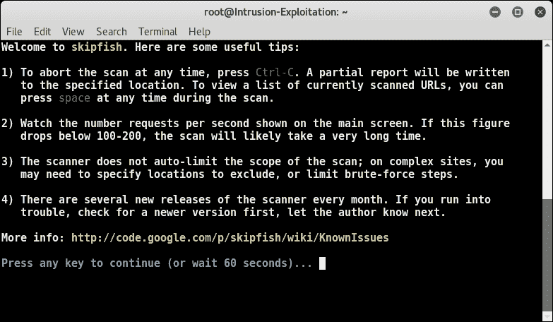

1.  一旦 Skipfish 开始，它将开始显示扫描详细信息，发送的请求数量以及屏幕上的其他详细信息，如下面的屏幕截图所示：

1.  扫描完成后，编译所有内容并在该文件夹中创建 HTML 报告。这将在屏幕上显示以下输出：

1.  转到指定的输出目录，并在浏览器中打开 HTML，如下面的屏幕截图所示：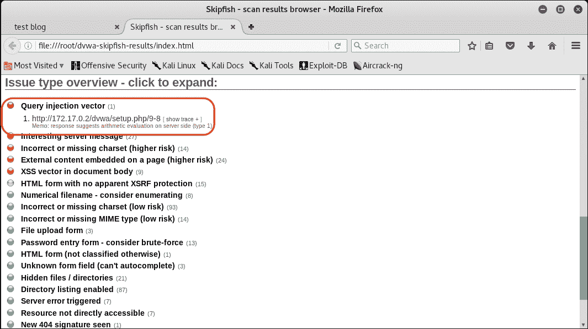

## 工作原理...

由于 Skipfish 是用 C 语言编写的，它是处理 HTTP 流量方面最有效的工具之一。Skipfish 能够使用`--auth-form`、`--auth-user`和`-auth-password`开关来运行经过身份验证的扫描。

默认情况下，Skipfish 将所有 URL 视为范围；如果有任何页面或 URL 不在您的测试范围内，您将明确使用`-X`开关来告诉 Skipfish 不需要扫描它。

在进行经过身份验证的扫描时，您可以使用`-X`开关指定注销链接，以确保 Skipfish 不会意外地爬取它，并最终扫描带有已注销会话的主机。

# 使用 Burp 代理拦截 HTTP 流量

在本教程中，我们将使用 Burp 代理拦截我们的浏览器流量，并在路上操纵参数。

## 准备工作

要完成本教程，您需要在 Oracle Virtualbox 上运行 Kali Linux 并连接到互联网。不需要其他先决条件。

## 操作步骤...

对于此教程，您需要执行以下步骤：

1.  要启动 Burp，请转到**菜单** | **Kali Linux** | **应用程序** | **burpsuite**并单击**启动 burpsuite**，如下面的屏幕截图所示：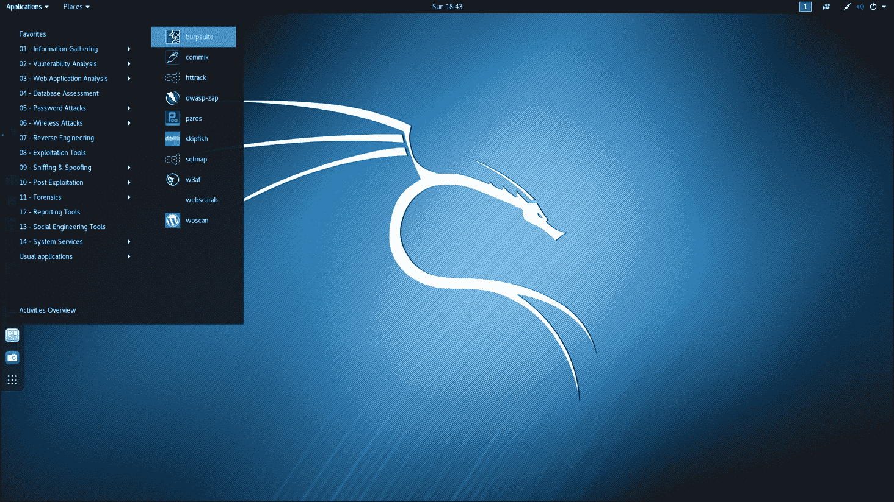

1.  同时打开 Firefox，并导航到**编辑菜单** | **首选项** | **高级选项卡** | **网络** | **设置**，将代理设置为`127.0.0.1`，端口设置为`8080`，如下面的屏幕截图所示：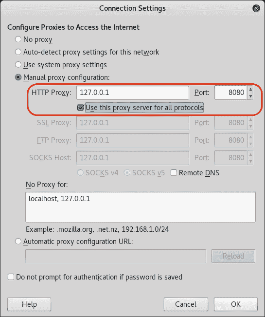

1.  单击**确定**，然后转到**Burp** | **代理**，如下面的屏幕截图所示：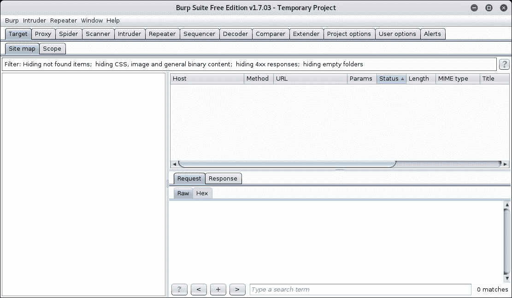

1.  现在，回到 Firefox 窗口，打开`http://172.17.0.2/dvwa/login.php`并按下*Enter*；当你按下*Enter*时，请求将被 Burp 拦截，如下面的屏幕截图所示：

1.  单击**转发**，放弃任何被拦截的请求，并让登录页面加载。在字段中输入用户名和密码，然后单击**提交**，如下面的屏幕截图所示：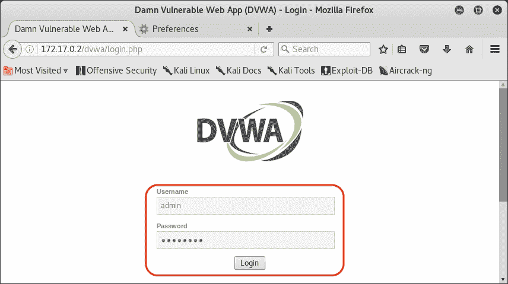

1.  打开**Burp**窗口。如您所见，提交请求在这里被拦截，并且可以以原始形式或参数形式进行操纵：

## 工作原理...

在本教程中，我们只需将 Web 浏览器配置为在连接到互联网之前在我们自己的本地机器上的端口`8080`上运行的代理。当我们在浏览器中打开任何 URL 时，它会将所有流量重定向到在端口`8080`上运行的 Burp，您可以在流离开系统之前操纵任何请求。

代理应用程序通常用于在浏览器中绕过 Web 应用程序的客户端限制。

# 使用 Burp Intruder 进行定制的攻击自动化

在这个教程中，我们将学习如何使用 Burp Intruder 执行应用程序登录暴力破解和目录暴力破解。Intruder 可以在需要进行暴力破解的任何场景中使用，并且可以根据您的要求进行定制。

## 准备工作

要完成本教程，您需要在 Oracle Virtualbox 上运行 Kali Linux 并连接到互联网。不需要其他先决条件。

## 操作步骤...

对于这个教程，您需要执行以下步骤：

1.  在浏览器中打开**Damn Vulnerable Web Application**页面，并转到**Brute Force**部分，如下截图所示：

1.  拦截 Burp 的请求，如下截图所示：

1.  如前所示，将此请求发送给 Burp 内的入侵者，选择**Intruder**选项卡，然后选择**Positions**子选项卡，如下截图所示：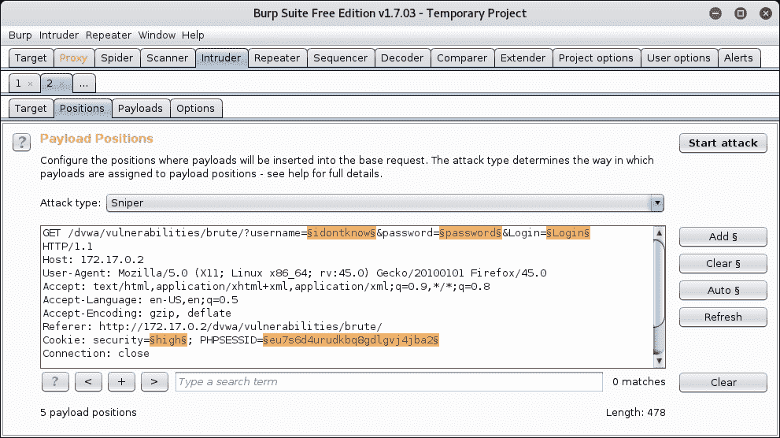

1.  要使用入侵者暴力破解常见的用户名和密码，我们需要仅选择用户名和密码；其余的突出显示的参数可以通过选择它们并单击**Clear $**按钮来清除，这将确保暴力破解只会发生在选定的参数上，而不是默认情况下选择的所有参数上。

Burp Intruder 有四种攻击类型，分别是 sniper、battering ram、pitchfork 和 cluster bomb。它默认设置为 sniper。将其更改为 battering ram。

1.  现在，当我们选择了暴力破解的参数时，我们需要设置有效负载；为此，我们将遍历有效负载选项卡，并从下拉菜单中设置有效负载集合为**1**。为了演示其工作原理，我们将输入一个小的用户名列表，如下截图所示：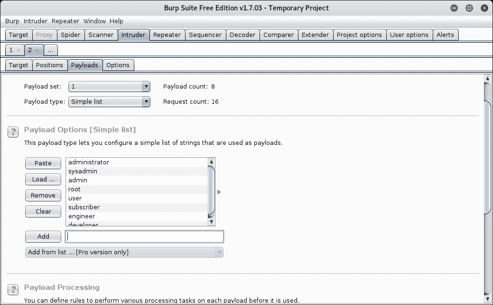

1.  现在选择有效负载集合为**2**，并设置第二个参数的有效负载，如下截图所示：

1.  现在转到**选项**选项卡；这很重要，因为我们需要某种证据证明暴力破解程序已经能够检测到有效的尝试，因此，为此，我们需要在凭证错误的情况下看到错误消息，并在凭证正确的情况下看到消息。打开浏览器，输入错误的密码，如下截图所示：

1.  在凭证不正确的情况下，它会显示以下消息：

```
            Username and/or password incorrect.
    ```


1.  转到**选项** | **Grep Match Section**，删除所有字符串模式，并添加**Welcome to the password protected area admin**模式，这将表明凭证是有效的，如下截图所示：

1.  最后，在左上角的**Intruder**选项卡上单击**Start attack**，如下截图所示：

1.  一旦启动，入侵者将尝试从这两个有效负载列表中尝试所有可能的组合，并且当响应中有任何与之匹配时，grep 匹配将显示出来，如下截图所示：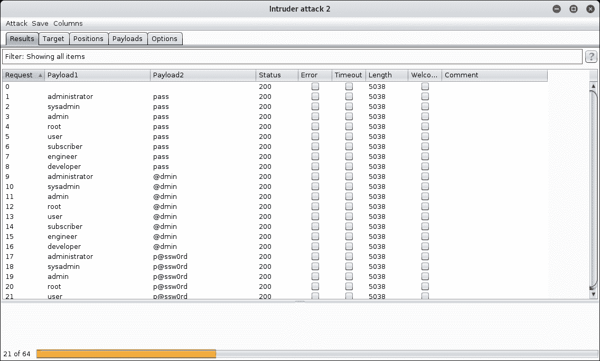

## 工作原理...

在这个教程中，我们使用了 Burp Intruder，并对其进行了高度定制，以进行特定的暴力攻击。入侵者的能力不仅限于此。您也可以在发现 SQL 注入时使用它。

# 使用 Burp Sequencer 测试会话的随机性

在这个教程中，我们将学习如何使用 Burp Sequencer 工具来检查 Web 应用程序中会话令牌的随机性。

## 准备就绪

要按照这个教程，您需要在 Oracle Virtualbox 上运行 Kali Linux 并连接到互联网。不需要其他先决条件。

## 操作步骤...

对于这个教程，您需要执行以下步骤：

1.  在浏览器中打开应用程序，并使用 Burp 拦截请求，如下截图所示：

1.  我们需要分析请求的响应，转发此请求，并捕获服务器的响应，如下截图所示：

1.  由于服务器设置了`Set-Cookie PHPSESSIONID`，为了分析这个会话令牌，我们需要将其发送到 Sequencer，如下截图所示：

1.  现在打开 Burp Sequencer。为了检查随机性，Burp 需要知道请求中的位置 cookie，然后我们将开始实时捕获，如下面的屏幕截图所示：

1.  为了执行会话随机性分析，Burp 至少需要 100 个 PHP 会话 ID。至少需要 100 个 PHP 会话 ID 来开始分析：

1.  正如我们所看到的，**总体结果**部分显示了在 462 个请求样本中`PHPSESSID`的随机性信息。您可以将`PHPSESSID`的值保存到一个文件中，如下面的屏幕截图所示：

## 它是如何工作的...

如果会话令牌容易猜测并且不够随机，攻击者可以轻松模拟用户在应用程序上的会话。在这个示例中，我们使用 Burp Sequencer 工具从 Burp 代理导入会话 ID 并对其进行分析。这个 Sequencer 也可以用于其他情况，比如处理 CSRF 等令牌。Sequencer 也可以用类似的方式来检查 CSRF 令牌的随机性。
