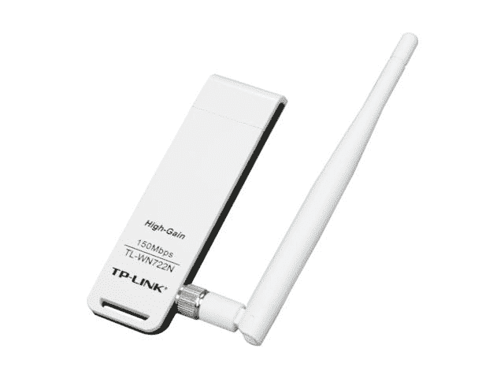
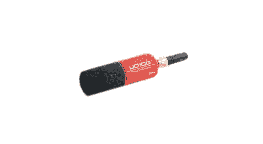

# Kali Linux 和无线网络

在本章中，我们将涵盖以下内容：

+   安装 Kali Linux

+   在 PC 上安装 Kali Linux

+   在虚拟环境中安装 Kali Linux

+   更新 Kali Linux

+   准备进行无线渗透测试

# 介绍

在当今世界，分享信息的最常见方式之一是通过无线通信。Wi-Fi 被用于许多地方，包括家庭、工作场所、机场、咖啡店、零售店，以及其他太多的地方无法一一列举。

由于这种通信方式的流行，可以断定这些网络中有很多有价值的信息。正是由于这些信息和这些网络固有的弱点，它们成为那些希望窃取访问权限、信息或两者兼而有之的人的常见目标。

在本书中，我们的目的是双重的，一方面是向你介绍 Kali Linux 中设计用于审计无线网络的工具，另一方面是展示一些可能的不同攻击。这种方法将不仅为你提供关于攻击及其工作原理的信息，还将为你提供有价值的见解，以减少这些攻击的可能性或有效性。

# 开始使用 Kali

Kali Linux 旨在为那些进行渗透测试和取证的人提供帮助；然而，在本书中，我们将更多地关注前者而不是后者。事实上，在渗透测试的主题上，我们将专注于使用仅用于测试和侵入无线网络或设备安全性的工具。

为了充分利用本书并了解如何用它来渗透无线网络，你应该具备一些基本的技能，以使事情变得更容易。预期如果你要开始这段旅程进入审计无线网络，你至少应该具备以下技能：

+   对 TCP/IP 协议和 IPv4 的理解

+   对**开放系统互联**（**OSI**）模型的了解

+   对网络帧类型的理解（即 IEEE 802.3、802.11 等）

+   了解无线电频率和技术是有帮助的，但是可选的

+   有设置和使用无线设备和网络的经验

+   有 Kali Linux 的实际操作经验是有帮助的，但我们将在学习过程中填补你的知识空白

+   有使用虚拟化的经验是可选的，如果你打算用它来托管你的设置

+   解决网络故障的经验

+   熟练使用命令行

再次强调，这些最后几点中的缺失不会伤害你，但拥有它们将在本书中和你的渗透测试职业中大有帮助。

# 安装 Kali Linux

准备在计算机系统上安装 Kali Linux 与你可能遇到的其他操作系统类似，首先要确保你具备正确的系统要求。

# 准备工作

为了开始，让我们看看你需要具备的最低硬件要求，以便安装产品：

+   至少需要 10GB 的硬盘空间来安装 Kali 操作系统

+   对于 i386 和 amd64 系统，需要 512MB 的 RAM

+   CD/DVD 驱动器或 USB 启动支持

+   有一个活跃的互联网连接是可取的

再次，请记住这里列出的内容代表最低限度，你会希望尽可能超过这些要求，以确保良好至卓越的性能。我个人建议至少拥有 4GB 的 RAM，如果可能的话（我个人分别在我使用的系统中拥有 8GB 或 16GB 的内存，但我过去使用 4GB 的内存也没问题）。

你还应该注意 Kali 的要求非常低，这将使你能够在几年前的计算机上运行产品得很好。

# 如何做...

一旦您确认或升级了系统所需的硬件，现在您需要选择如何安装 Kali。Kali 提供了几种不同的安装和运行产品的方式，每种方式都有其自身的好处，但也有其自身的缺点。然而，在本书中，我们将假设两种选择，即在 PC 上进行物理安装和在虚拟环境中进行安装。

# 虚拟化与物理

使用虚拟化而不是直接安装在系统上的问题是您应该考虑的一个问题。虚拟化是一个常见的选择，多年来被大大小小的组织所采用，许多组织在各种需求上都大量使用它。对许多人来说，转向虚拟化的推动力可能是许多因素，包括系统整合、节省电力、优化硬件使用、应用程序和系统的隔离、易于管理以及测试等等。

然而，对于渗透测试人员来说，使用虚拟化的方式可能会有所不同。

渗透测试人员的动机之一是能够在主机上以不同的配置运行测试环境。例如，在 Microsoft Windows 作为主机的情况下，在系统的虚拟化环境中运行一个或多个 Kali 环境作为客户端，可以实现整合，以及根据需要拥有专门的配置。

转向虚拟化的另一个原因是利用所谓的**隔离**或**沙盒**。基本上，这意味着客户系统与主机系统分开，允许两者都可以访问网络和互联网，而不让它们可能相互干扰。在工具和技能可能会对主机或其他系统造成伤害或威胁的情况下，这将是至关重要的。

当然，没有免费的午餐，也不是每种情况下都是理想的，虚拟化也不例外。可能会出现问题的一个领域是硬件支持。在某些情况下，由于虚拟化技术的原因，物理设备可能无法按照您的需求进行功能。一个例子是无线网络和蓝牙；这些技术可能要求 Kali 直接在硬件上运行，而不是在虚拟环境中运行。虽然这种限制并不常见，但可能会令人沮丧。当然，如果我不提到有解决方法，并且可能使一些硬件选项在虚拟化环境中工作，否则不会工作，但这些解决方法可能非常复杂和专业化，超出了本工作的范围。

我必须指出，在一些虚拟化平台上，可以使用 USB 透传来启用外部 USB 适配器的使用。然而，这个选项在支持和功能上有所不同，取决于实际使用的软件平台。请咨询您的软件，了解如何在您的环境中完成此任务的详细信息。

# 预安装检查清单

与许多可用的操作系统一样，Kali 有一些独特和特定的要点需要考虑，以便使安装顺利进行。幸运的是，Kali 保持其安装要求相当简单，但肯定有一些因素可能会影响您的体验，并使 Kali 的运行方式不太理想。

为了确保我们获得最佳的安装和性能，这里是一个需要考虑的清单示例：

+   您会将 Kali 安装到硬盘上，还是从可移动介质上运行？

+   系统当前有多少内存？更多的内存可以带来更好的体验和更好的性能。在我自己的个人系统上，我使用 8GB 运行 Kali 非常流畅。如果你使用的是硬盘以外的设备运行 Kali，更多的内存可能会带来更好的性能，因为更多的 Kali 可以保存在内存中。

+   你将运行什么应用程序？如果你将在 Kali 中安装其他应用程序，你可能需要调整你的配置以适应它们的包含。一些实用程序需要特殊的硬件（如无线设备）才能正常运行。如果你依赖这些功能或将来会使用它们，请确保你的所有硬件兼容或可以升级。

+   你有什么类型的硬盘？我曾经在传统硬盘和固态硬盘上运行过 Kali，其中固态硬盘的运行效果更好，性能更令人满意。

+   Kali 对你喜爱的应用程序和设备的软件支持非常广泛，并且随着时间的推移而不断增加。Kali 已经包含了许多用途和情况的应用程序，但你可以根据需要添加。

# 选择安装选项

在我们评估了我们的系统是否适合安装 Kali 之后，现在我们需要考虑如何安装它。阅读本书的很多人可能在 Windows 环境中有丰富的经验，因此几乎总是直接将操作系统安装到硬盘上。然而，正如我们刚刚了解到的，Kali 提供了额外的安装选项。我们现在需要确定关于安装位置的路径。

让我们看看主要的选项以及每个选项的优缺点：

+   **安装到没有持久性的闪存驱动器**：如果你希望使用 Kali 进行取证，这是一种合适的安装方法，因为它不会改变主机，因此不会影响系统上的潜在证据。如果你希望 Kali 帮助你进行网络或主机故障排除，这也是一种非常合适的安装方法。如果你想要一个便携式环境，可以在任何系统上运行而不必担心对主机或闪存驱动器本身的更改，这也是一个理想的选择。

+   **安装到带持久性的闪存驱动器**：这种安装方法适用于你希望能够携带 Kali 进行故障排除、取证或拥有便携式渗透测试工具包的情况，但你希望能够保存文件并对系统进行更改而不会在每次关闭系统时丢失这些更改。

+   **安装到硬盘**：这是非常受欢迎和有用的，因为它提供了最佳的性能，因为文件不需要在每次启动时加载到内存中。这种安装还提供了保存文件和进行更改而不会在重新启动时丢失的能力。如果你想要一个保留更改的系统，特别是如果你倾向于根据自己的需求调整系统，这是理想的选择。

+   **安装为虚拟化环境**：这个选项就像安装到硬盘一样，只是操作系统被安装到允许对 Kali 客户进行更改的虚拟化环境中。

+   **从 CD 或 DVD 运行**：我在这里包括这个选项，因为这是另一种类似于将 Kali 安装到非持久性闪存驱动器的选项。这种方法的操作速度通常比这里介绍的任何其他方法都要慢。


Kali Linux 在 VM Ware 上虚拟运行

如果将使用非常特定的硬件，例如高性能图形卡用于破解密码，建议将 Kali Linux 安装在台式电脑上。如果需要从客户现场携带操作系统到客户现场，或者希望测试无线设备，则建议使用笔记本电脑。笔记本电脑和台式电脑的操作系统安装方式相同。

就我个人而言，我在虚拟环境和专用笔记本上运行 Kali，Kali 是唯一安装的操作系统。我选择的系统是一台老式的联想笔记本，带有触摸屏、2.4 GHz CPU、8 GB RAM、250 GB SSD、蓝牙、Wi-Fi，除此之外没有太多其他功能。它绝对不是最先进的，但它有足够的性能和功能，我可以做我需要做的事情，还有多余的性能。

我的笔记本选择主要基于两个主要问题，即硬件支持和性能。通过选择一个稍微老一点的系统，我不必担心 Kali 是否支持硬件，也不必担心需要寻找解决方案来使系统工作，它就可以正常运行。至于性能，我指的是 Linux 传统上不需要最强大的硬件就能获得良好的性能。事实上，Linux 传统上以在旧硬件上运行而闻名，而其他操作系统可能会遇到问题。但是，我确保没有选择太老的硬件，以至于会受到我需要使用的工具的限制。我发现，在过去五年或更短时间内制造的硬件通常可以在大多数情况下正常运行 Kali。

# 硬盘选择

在选择用于 Kali 的系统时，不要在硬盘上偷工减料。通常最好选择至少有 150GB 空间的硬盘，但如果可能的话，应考虑更大的硬盘，因为您无疑会安装 Kali 中未包含的其他工具（更不用说您生成的数据也会占用空间）。

请记住，作为渗透测试人员，您不仅会被要求，而且需要保持您的发现机密，对于许多测试来说，这意味着擦除硬盘以确保安全。虽然可能清除已安装的操作系统，使其返回到基本或原始未更改的状态，但您仍可能希望擦除硬盘。建议是设置系统的方式，然后对其进行镜像，以便您可以有效地擦除硬盘，然后随时恢复原始镜像。请始终记住，失去对信息的控制或泄露信息不仅会让您的客户感到不满，还会让您面临诉讼、声誉损失、职业损失和不好的业力。基本上，在测试期间和之后，对您收集的数据采取适当的预防措施。

当我获得当前的 Kali 系统时，我做的第一件事之一就是用更大的 SSD 硬盘替换硬盘。我觉得这项投资出于许多原因都是明智的，我会在这里尽量解释。

首先，使用 SSD 固态硬盘通常会在一定程度上减少系统的电池消耗。电池消耗的减少会导致在无法插入墙壁时更长时间的移动使用。

其次，SSD 固态硬盘比传统硬盘快得多。SSD 固态硬盘的读写速度比传统硬盘快。能够更快地检索和操作数据对于渗透测试人员（或任何人）来说都是巨大的好处。

最后，SSD 固态硬盘比较老式的传统硬盘更耐用。计算机内部没有旋转的磁盘意味着移动和携带硬盘加系统不太可能导致硬盘故障。

这些是我在转向固态硬盘时考虑的事情，我觉得自己没有做出错误的选择。

# 网络卡和无线

在考虑 Kali 时，您需要考虑如何连接到网络以及您可能进行的测试类型。换句话说，我们在本节考虑的是您的网络接口选择，即有线或无线。无线是如今几乎任何类型的设备都常见的一种包含（或者在过去 10 年内制造的设备）。另一方面，随着许多笔记本电脑和便携式电脑完全放弃有线网络连接，有线网络连接在设备上变得不太常见。

在无线网络方面，您可能会发现许多无线网卡，无论是包含在您的设备中还是通过其他方式添加的，都可以在 Kali 上正常工作，或者可以通过从制造商处获取正确的驱动程序来进行修正。下图显示了一个常见的 USB 无线网络适配器的示例：


USB 无线适配器

在考虑购买外部 Wi-Fi 适配器时，我想指出的一件事是，您是否将在某个时候运行 Kali NetHunter。Kali NetHunter 在本书的其他地方有所讨论，但简而言之，它是 Kali 的基于 Android 的版本，适用于移动设备，如智能手机和平板电脑。如果您计划在测试中使用这个平台，您应该确保您在此处购买的 Wi-Fi 适配器与 Kali 的两种形式兼容，这样您就不必购买比您需要的更多的适配器。

您可能还会进行一些蓝牙测试，这种情况下，您可能需要为此目的获取额外的适配器。购买另一个适配器的原因是，蓝牙默认只能延伸到 30 英尺或 10 米的范围。如果您需要更大的范围来扫描更大的区域，您可以获取一个工业蓝牙适配器，它将扫描范围延伸到 1000 英尺或更远。

# 在 PC 上安装 Kali Linux

因此，考虑到我们的系统要求和考虑因素，再加上大约半小时的时间，我们现在准备安装 Kali。首先，您需要从[`www.kali.org/`](https://www.kali.org/)获取适用于您的硬件的 Kali Linux 副本。目前，Kali 支持 i386、amd64 以及 ARM（armel 和 armhf）平台。

# 准备工作

在安装之前，您需要下载适合您的硬件的版本，例如 64 位系统的 amd64。

因此，让我们开始安装过程，创建我们的 Kali 系统。

# 如何做...

1.  开始安装过程需要从您用 Kali 准备的 DVD 或闪存驱动器引导系统，可以通过将 ISO 文件刻录到媒体或准备一个带有文件的 USB 驱动器来实现。

1.  您可以通过从您选择的媒体引导来启动安装。实际的从可移动媒体（如 DVD 或 USB）引导的过程将取决于您的硬件，因此请向您的供应商查询如何在您的系统上执行此操作。

1.  一旦从您选择的媒体引导，您将被提示选择要执行的安装类型。您可以选择图形模式或文本模式安装。为了更好地展示过程，我们将在这里使用图形模式。

1.  选择安装模式后，选择您所在地区的语言、位置和键盘布局。

1.  一旦选择了这些选项，安装脚本将把镜像复制到系统的硬盘，并对硬件进行简要扫描，寻找网络接口。

1.  一旦提示，选择系统的主机名。

1.  接下来，为系统的非根用户提供一个全名。

1.  将根据您提供的全名创建一个默认用户 ID。如果名称不可接受，您可以选择一个新名称。

1.  在提示时，选择一个时区。

1.  接下来，安装程序将探测您的磁盘并为您提供两个选择。您可以选择使用整个驱动器专用于 Kali，或者使用**逻辑卷管理器**（LVM）来自定义安装。如果您对 LVM 不熟悉，建议选择使用整个驱动器。

1.  根据您的需求，您可以选择将所有文件保存在单个分区中（默认设置），或者为一个或多个顶级目录设置单独的分区。

1.  点击继续后，安装程序将继续进行安装。

1.  配置网络镜像。Kali 使用一个中央仓库来分发应用程序。您需要根据需要输入任何适当的代理信息。

1.  接下来，安装 GRUB。GRUB 是 Linux 的引导加载程序。如果没有，您需要安装 GRUB。

1.  最后，点击继续重新启动到新的 Kali 安装中。

软件安装完成后，您可以使用安装过程中设置的凭据登录。

# 在虚拟环境中安装 Kali

在虚拟环境中安装 Kali 是另一个选择，也不比在硬盘上安装困难得多。在这个步骤中，我们将创建我们自己的带有 Kali 的虚拟机。在这个步骤结束时，我们的目标是拥有我们自己的完全配置、运行和定制的虚拟机，该虚拟机将运行 Kali 发行版。

需要记住的一件事是，在[kali.org](https://www.kali.org/)网站上可以下载可用于 Oracle 的 VirtualBox 和 VMware 的虚拟机。如果您不想从头开始创建自己的虚拟机，您可以简单地下载其中一个虚拟机映像，加载到您选择的虚拟化软件中，然后准备好使用。但是，请记住，您可能更愿意从头开始创建自己的虚拟机，以便您可以自定义和设置它的方式。

# 准备工作

如果您选择虚拟化 Kali 并将其用于无线网络测试，需要注意的是，您将需要配置虚拟环境以与主机系统上的外部适配器配合使用。在大多数情况下，您将需要使用外部 USB 无线适配器，并找出如何配置您的虚拟化软件以使用一种常称为 USB Passthrough 的技术。由于这是虚拟化软件包特有的，我们将不在这里涵盖这个过程。

# 如何操作...

这里记录的步骤是在 VMware Player 上执行的，但在其他虚拟化平台（如 VirtualBox）上也是相似的。但是，无论虚拟化平台如何，您都需要从 Kali 网站下载 32 位或 64 位 ISO 文件。

1.  在您的软件中，您需要创建一个新的虚拟机。

1.  在提示时选择您下载的 ISO 文件。

1.  选择许多虚拟化软件包将自动检测的客户操作系统，但在某些情况下，您可能需要调整设置。

1.  设置新虚拟机的名称和位置。

1.  设置磁盘空间（20 GB 足够，但更多更好）。

1.  查看硬件配置并启动虚拟机。

1.  选择图形安装，按照正常选择语言、时区、主机名等。

1.  在提示进行磁盘分区时，选择硬盘并选择全包。

1.  点击完成分区并将更改写入磁盘，选择是以进行写入。

1.  设置网络镜像和引导加载程序。

1.  等待安装完成。

# 更新 Kali Linux

安装 Kali Linux 后，更新发行版并不是一个坏主意，以确保您拥有所有工具的最新版本，并应用可能已发布的任何补丁和其他修复。您不仅应该在安装系统后对系统进行更新，而且应该出于同样的原因定期进行更新。事实上，更新和补丁会相当经常地发布，因此最好养成定期检查这些内容的习惯，这样您就不会错过任何内容，也不会让自己处于不安全的状态。

重要的是要认识到，安装完成后应立即运行更新，以及定期运行更新。这是出于许多原因，主要是因为自安装镜像或 ISO 文件发布以来，可能已经发布了新工具或应用程序数据库的新更新。更不用说定期更新软件是保护自己免受安全问题和担忧的关键因素。

# 如何操作...

为了保持 Kali 系统的最新状态，这个过程非常简单。要快速检查更新，运行以下命令。

1.  打开命令提示符。

1.  输入以下命令：`apt-get update`

1.  按下*Enter*

1.  命令完成后，输入以下命令：`apt-get dist-upgrade`

1.  按下*Enter*

这个过程将需要几分钟（或更长时间），具体取决于您的互联网连接和需要下载的更新数量。如果您保持系统最新并定期检查，您可以期望这个过程不会像第一次进行时那么长。

# 准备进行无线渗透测试

在安装了 Kali 之后，我们需要做一些准备工作，以便在无线世界中进行适当的渗透测试。我们必须做的第一件事之一是准备好我们的系统，获取有关我们的无线设备的信息，以及获取我们可能需要执行测试的适配器或天线。

让我们学习一些关于连接到系统的无线设备（或网络适配器）的基础知识。

# 如何操作...

首先，让我们看看如何识别无线适配器：

1.  您手头应该有的第一条信息之一是您的网络连接的名称和类型。当您使用各种实用工具和脚本以及确保您拥有适当和最佳的适配器以获得最佳测试结果时，这些信息将在以后非常有帮助。

1.  因此，让我们来看看如何定位和识别当前的网络适配器，以及这些信息在我们进行渗透测试时将来会有多大用处。

使用 ifconfig 来识别网络适配器。

在 Linux 中存在一个命令，可以轻松帮助我们识别无线连接及其状态，这个命令是`ifconfig`。这个命令可以通过命令行访问，显示系统上每个适配器的网络连接信息及其相关名称。

要运行命令，只需在 Kali 命令行中输入以下内容：

```
Ifconfig
```

1.  按下*Enter*

1.  您将从命令中获得的结果看起来有点像下面这样：


如前面的截图所示，我们有很多信息。所以，让我们来分解一下。

您应该注意的第一条信息是网络连接的名称，在这种情况下，它们被命名为`eth0`和`lo`。您可以在这些位置上有诸如`eth1`或其他标签的名称，具体取决于网络类型。对于我们的目的，我们应该看到一个标记为`wlan0`或`wlan1`或以`wlan`前缀开头的适配器，表示无线连接。对于我们的分析目的，我们将使用`eth0`适配器；lo 适配器是环回虚拟适配器，在这里对我们没有用处。

您还应该注意到这一行中的`UP`或`DOWN`，这将告诉您适配器是在线还是离线。

第二个重要信息是以`inet`标签开头的行。这一行为我们提供了有关当前配置的 IPv4 地址和相关子网掩码等详细信息。直接在其下方的行提供了相同类型的信息，但是针对 IPv6。

下一行为我们提供了一个以`ether`标记的信息，即网络适配器的**媒体访问控制**（**MAC**）地址，也称为适配器的**物理地址**。

其余的行提供了有关网络配置和数据传输的详细信息。我们现在将忽略这些。

你应该始终熟悉至少每个适配器的前三行的内容（对于我们的目的，只需你的无线适配器即可）。当你使用各种工具和脚本攻击无线网络时，所有这些信息都会派上用场：

1.  选择网络适配器。

1.  你需要采取的下一步行动之一是选择一个无线网络适配器或你需要执行测试的物品。虽然你可以使用内置在笔记本或其他设备中的适配器，但在某些情况下它们确实缺乏一些功能。

1.  一些可能不存在于内部适配器中，但可能需要的功能是：

+   支持外部天线

+   能够执行数据包注入（对于某些攻击是必需的）

+   某些卡上不兼容的芯片组可能无法与某些特定实用程序一起工作

+   对新无线标准的支持不足

+   不支持不同频率

这是一个缺乏支持或功能的功能列表，可能会限制你准确和完整地执行测试的能力。

考虑到这一点，我将展示一个相当常见且工作良好的适配器的示例。以下图片是 TP-Link 的一个支持这里列出的许多功能的适配器的示例：



外部 USB 无线适配器

从上面的照片中可以看出，该适配器最显著的特点是其使用外部天线，旨在提供更好的性能。你甚至可以更换该适配器上的天线，以提供不同范围和性能。

那么，你如何知道哪个适配器适合你呢？在大多数情况下，你可以使用内部无线网络适配器，但并非总是如此。如果你打算对无线网络进行高级攻击，增加测试的范围和功率。

# 还有更多...

为了加深理解，你可以参考以下部分。

# 蓝牙适配器

如果你将使用蓝牙进行测试，你将需要获取一个适配器来有效地执行这种类型的测试。虽然大多数设备，如笔记本电脑、平板电脑、台式机和其他计算平台都包括蓝牙支持，但这些都倾向于是短距离的（平均 10 米或 30 英尺），并且不支持重要功能，比如数据包注入（我们稍后会了解）。

一些在渗透测试中可能非常有用的蓝牙适配器的例子是 Sena UD100 和 Ubertooth One。

第一个是 Sena UD100，是一个支持数据包注入和外部（可更换）天线的 USB 蓝牙适配器。默认情况下，该适配器支持最高达 1000 英尺的范围（意味着它可以通过天线升级捕捉到达或超过该限制的设备）。



UD100 工业蓝牙适配器

另一个被称为 Ubertooth One 的适配器更像是一个开发板，而不是一个标准的适配器，但它也可以用于我们的测试。基本上，该适配器不仅是一个网络卡，而且是一个开源（硬件和软件都是）系统，可以用来开发和实现你自己的功能。以下是 Ubertooth One 的图片。


Ubertooth One

那么，你如何决定是否需要蓝牙适配器呢？在大多数情况下，如果你打算进行长距离扫描、执行数据包注入，或者做除了仅仅检测蓝牙设备之外的任何事情，你可能需要获取一个适配器。
