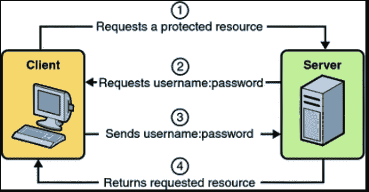
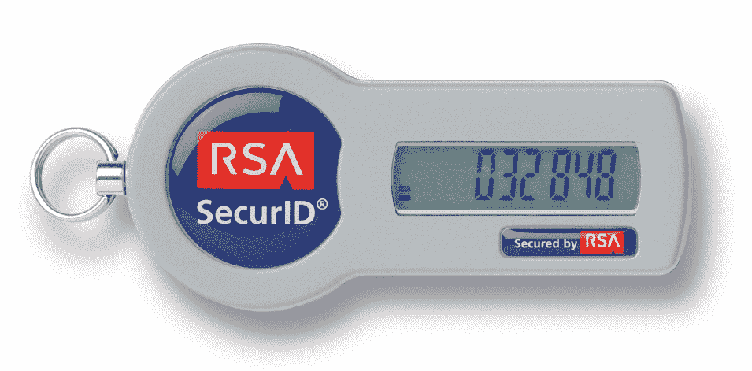
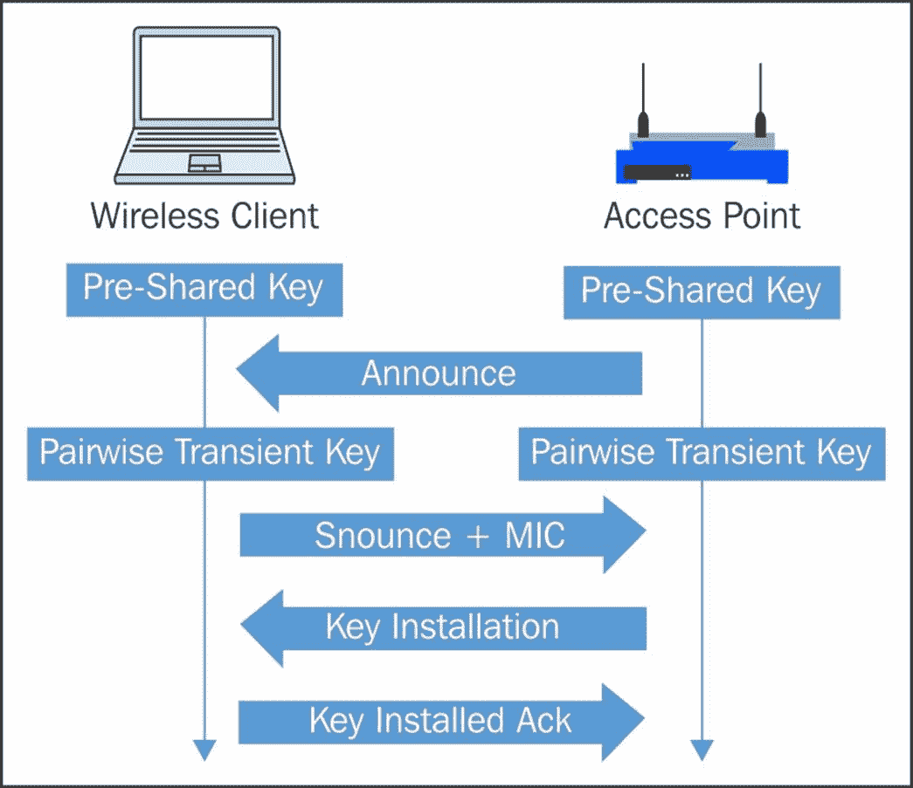
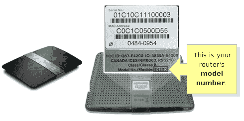

# 身份验证攻击

在本章中，我们将涵盖以下内容：

+   WEP 攻击

+   WPA 攻击和 WPA2 攻击

+   攻击 WPS

# 针对身份验证的攻击

在本章中，我们将探讨另一种形式的攻击：针对身份验证机制及其周围系统的组件的攻击。对无线网络上的身份验证机制进行攻击可以使攻击者能够非常轻松地或几乎毫无阻力地访问系统的部分和其中托管的资源。实际上，设置身份验证机制的原因是为了能够验证用户或主机的身份，如果这种验证被颠覆或绕过，那么我们最终会面临各种访问和操作。然而，在进入本章之前，让我们先看看身份验证是什么，它的设计目的是什么，以及它如何以非常抽象的形式工作，然后我们可以利用这些知识更好地理解本章中的攻击。

首先让我们开始谈论当用户尝试登录系统时会发生什么，实际上任何系统都是如此。当用户登录系统时，他们将经历一系列事件。他们首先要做的是提供一个身份，这是关于他们声称自己是谁的陈述。现在，身份本身并不能用来允许访问系统，因为它只是对某人的声明或断言；它并没有任何明确的意义。这意味着我可以声称自己是电影明星、政客，甚至是美国总统，但如果没有提供一些东西来验证身份，那么这只是一个没有任何价值或权重的声明，因此不足以进入后续授予对受信任信息资源访问的步骤。为了做到这一点，我们需要转向身份验证步骤。以下图表显示了身份验证过程：



身份验证过程

当我们说身份验证时，我们正在执行一些行动，证明用户关于自己是谁的声明实际上是有效的。最常见的方法是通过使用密码；我们中的许多人都遇到过这样的情况，我们提供用户名（即我们的身份），然后提供密码，这是只有我们知道的秘密信息，可以用来证明我们是我们所说的那个人，你可以信任我们。因此，可以看到，仅仅以用户名的形式的身份本身是不足以证明任何事情的；它必须经过身份验证，以验证该方可以通过提供只有具有该身份的人才会知道的答案来证明可以信任。他们正在进行身份验证的系统将有某种方式来比较他们提供的答案（或在这种情况下是密码）与他们已经本地存储的东西，以确保提供的答案是正确的。以下屏幕截图是 Windows 登录框的一个示例：


登录框

实际上，有三种公认的身份验证方式，应该被视为对资源进行身份验证的一般类别。为了完善你对这些不同方式的了解，让我们简要地看一下每种方式：

+   因素 1 身份验证涵盖了任何需要提供信息（如密码、口令或 PIN 码）以验证身份的情况。身份验证的第一个因素的重要细节或要素是，这是你知道并存储在大脑中的东西，并在请求时提供。这是计算机网络和软件以及我们的无线网络中最常用的身份验证形式，正如我们将看到的那样。

+   双因素认证涵盖了任何需要提供物理物品来验证个人或系统的情况。例如，门的钥匙、ATM 卡或者令牌都可以用来呈现给系统或生成一个特殊代码，用于验证用户的身份，就像之前一样。这种形式的认证有时也被称为你所拥有的东西，就像你拥有汽车门钥匙一样。这种类型的认证在无线网络中并不常见，但也有一些例外情况，比如在需要生成特殊代码登录企业网络或访客网络的情况下。

以下照片显示了双因素认证技术的一个例子：



RSA 实验室的双因素认证令牌

+   第三因素认证是一种依赖于所谓的生物识别的认证形式。简单来说，生物识别是一种通过测量生物体的特征或特质并将其用作验证身份的方法，就像你在前两个因素中所做的那样。诸如指纹、眼球、手掌纹甚至面部识别等特征都被用来提供这种认证因素。虽然这种认证形式可能非常准确和可靠，但它与其他因素相比有一个缺点，这使得它不太常见，因为在设置这种系统时涉及的费用和复杂性更大。值得注意的是，在无线网络中很少见到这种类型的认证因素。这并不意味着你不能使用这些认证机制来连接无线网络；这只是意味着它们在大多数情况下不用于连接无线网络的认证。这种认证类型只是包含在这里供你参考。这不是我们在本书中要试图颠覆或规避的内容。以下图片显示了第三因素认证技术的一个例子：


第三因素指纹识别器

现在我们已经讨论了认证，接下来要讨论的是系统在验证了你所声称的身份后会发生什么。请记住，认证所做的只是验证你向系统提供的身份不仅仅是一个声明，它实际上是真实和正确的，并且可以被信任为准确。这绝不意味着你已经被授予了对系统的访问权限。可以把它想象成向官员提供驾驶执照或其他一些信息。仅仅因为那些文件核实并且说你是你所声称的人，并不意味着你将被允许，例如，进入受限区域或执行其他一些操作，因为它只是证明你是你所声称的人，仅此而已。要想进入下一步，你必须经历一个称为授权的过程。

那么，什么是授权？授权实际上非常简单。授权将你的验证身份与系统上配置的一组规则进行比较。这些规则用于确定你与系统的具体访问和交互级别，并由系统所有者管理员根据他们的指导和希望制定的标准进行配置和实施。

一旦授权完成，用户将以系统所有者希望他们拥有的任何能力或级别访问系统。因此，他们可以继续进行被授予的任何交互。

在认证中需要记住的一点是，认证并不局限于无线。它在控制对不同应用程序、设备、网络和其他项目的访问中起着作用。没有认证，系统和设备的安全性将会变得更加具有挑战性，因此它必须存在于各种各样的项目中。在本章中，我们讨论了无线设备和技术的认证，但不要忘记，它不仅存在于无线中，还存在于通过无线访问的网络应用程序以及通过传统有线方式访问的应用程序中。

在无线网络中，有许多可以针对认证的攻击，我们只能在这本书中覆盖其中的一部分。但我们将覆盖的这些攻击是一些比较常见的，你可能会遇到的，它们可能会影响无线网络和性能。无线网络上的认证包括多种技术和机制，其中许多我们在之前的章节中已经涵盖了，但为了完整起见，让我们在这里谈谈其中的一些不同项目：

+   **加密**：加密的使用在几乎所有可用的认证机制中都是至关重要的，因为它提供了一种方式来确保凭据的机密性以及存储这些凭据的系统的完整性。没有加密，保护凭据在存储和传输时将会非常困难。同样，要确保这些凭据在网络上传输时是准确的，或者它们是否已经被改变，也将会非常困难。可以说，没有密码学，我们现在许多形式的认证将不会存在。

+   **预共享密钥**（**PSK**）**系统**：这涉及使用在每台工作站或设备上输入一个共同密钥，以允许其对无线接入点进行认证的系统。这种保护通常以非企业 WEP、WPA 或 WPA2 的形式出现。值得注意的是，预共享密钥系统在家庭和小型企业环境中非常常见，但当你开始将环境扩展到中型、大型和企业规模的环境时，预共享密钥系统往往会被避免，而更倾向于使用企业认证系统。

+   **企业认证**：在大型环境中，使用重型认证系统形式的企业认证机制并不罕见。这些机制允许认证的扩展以及认证的集中控制和管理。这意味着这些认证系统不仅可以为在这种情况下认证无线客户端提供强大的认证方式，还可以用于为授权设置统一的规则，甚至可以针对每个站点对这些规则进行微调。

虽然这只是企业认证中的三个部分的列表，但还有许多其他可能被部署的部分。然而，我们将避免深入研究一些更为奇特和复杂的形式，只专注于你在探索中最有可能遇到的基本形式。

# 攻击类型

针对无线网络上的认证的攻击是多种多样的，每种攻击都有其自身的优势和劣势，使它们在特定情况下有用或无用。

在我们开始探索每一种攻击之前，让我们先列出本章将涵盖的攻击。

+   WEP 攻击

+   WPA 攻击

+   WPA2 攻击

+   WPS 攻击

请记住，这些只是可以用来颠覆无线网络认证的攻击类型中的一部分；它们不应被视为唯一的攻击类型。

# WEP 攻击

我们将在本章中重新审视对有线等效隐私（WEP）协议的攻击。在我们阅读本书的过程中，我们已经几次遇到过这个协议，我们将在这里再次对其进行审视，并添加一些之前没有的内容，并努力扩展这次攻击，以讨论这个协议中真正的弱点，使其容易受到攻击。

请记住，WEP 协议是在无线安全被认为是一个问题的时候实施和设计的，但设计无线技术的人并没有真正理解如何正确实施安全，也没有咨询可能帮助他们更好地做到这一点的外部团体。在所有实际意义上，WEP 不应再在任何活跃的网络中使用，因为它对于希望通过窃取您的数据或在传输过程中修改您的网络上的数据来对您造成伤害的人来说，它太容易成为一个机会目标。几年前，对这个协议的成功攻击要比现在更难以成功进行，因为所需的工具需要更高程度的知识和经验才能操作。如今，专门针对这个协议的工具更加精细和易于使用，并且可以被更广泛的受众所接触；他们只需要了解这些工具，并愿意遵循一些烹饪书式的指导来使它们以一种实现成功结果的方式工作。

让我们在 WEP 协议上填补一些更多的背景故事，以充分阐明我们所探讨事物的角度。这个协议早在 1997 年设计，作为最初的无线标准的一部分。它旨在使用一个相当强大的加密协议，称为 RC4，旨在保护流量免受意外泄露，并使用 CRC 32 进行完整性保护。这些保护措施都不是一个坏决定。然而，在 WEP 的设计和实施中却被错误地使用了。

要理解 WEP 的问题之一，我们需要了解在这个协议中如何生成密钥。实际上，标准的 64 位 WEP 协议使用了一个 40 位密钥加上一个 24 位的初始化向量或 IV，它们一起形成了所谓的 RC4 密钥。这个密钥是用来在传输过程中加密和保护流量的。

敏锐的读者很快就会注意到，我们使用 40 位密钥加上 24 位初始化向量是一个问题 - 具体来说，40 位密钥是一个我们需要关注的大问题。在当时决定这个 40 位数字时，技术已经可以很容易地在合理的时间内破解短版本的密钥。如今，破解这种密钥是极其容易的，几乎不需要任何时间。因此，不可避免地会出现一个问题，即为什么这个协议的开发人员决定在大多数情况下更长的加密密钥更强大更好时使用如此短的密钥。最大的原因是，在 WEP 设计时，美国政府对加密技术和任何实施或使用这种加密工具的技术或设备实施了严格的出口管制。正是由于这些限制，密钥大小被限制到了这样的程度。之后，在这些限制解除后，密钥长度增加到了 104 位加上 24 位的初始化向量。还有一些更长的链接可用，但即使使用这个 128 位的密钥大小，该协议仍然存在漏洞，因此不应使用。

在大多数使用 WEP 的接入点中，密钥是以十六进制值输入的，或者被转换为十六进制值，这意味着它使用了包括`0`到`9`和`A`到`F`的值的密钥。使用 WEP 的消费者或系统管理员将直接在接入点上输入他们的密钥，然后在所有希望连接的客户端上输入相同的密钥，一切都会按预期工作。

在 WEP 加密系统中可以利用的一些内容是我们关心的，这些内容是用于识别客户端而不是用户的不同类型的认证。两种认证方法是**开放系统认证**（**OSA**）和**共享密钥认证**（**SKA**）。这两种方法都在不同程度上得到了使用，大多数人选择后者而不是前者，尽管前者在一些情况下也有所见。

在 OSA 的情况下，客户端能够连接到无线接入点而无需提供任何凭据或任何标识自己的东西。实际上，任何客户端都能够直接认证到接入点并关联。这实际上意味着，即使系统的名称中有这样的说法，实际上根本没有进行任何认证。然而，客户端随后可以通过拥有 WEP 密钥来加密他们的流量。这意味着必须向客户端提供密钥才能实现这一点。

在我们的第二种认证机制中，即共享密钥，客户端将不得不提供 WEP 密钥来认证网络，以便正确关联和在该网络上进行通信。实际上，这可以分解为一个四步过程，我们应该谈谈以了解我们正在处理的过程以恢复我们的密钥：

1.  客户端将发送一个请求来认证无线网络，或者特别是一个接入点。

1.  接入点将对关联请求做出回应，发送一个明文消息或挑战。

1.  然后，客户端将获取这个明文消息，并使用预先配置的 WEP 密钥对其进行加密，然后将结果传回接入点作为另一个认证请求。

1.  此时，接入点将获取 WEP 密钥的副本，用它来解密它收到的加密密钥，然后将得到的结果与其原始明文响应进行比较；如果结果匹配，则将进行关联。如果不匹配，则将被拒绝。下图显示了 WEP 过程的过程：


WEP 认证过程

解密过程完成后，WEP 密钥不会被推到后台等待另一个认证的发生；相反，它现在用于加密客户端与网络或接入点上的任何其他点之间传输的流量。

真的很重要的一点是，尽管共享密钥认证更安全是一个明显的观点，因为在允许客户端关联到网络之前进行了认证，但实际上并不是这样。事实上，情况恰恰相反，因为在共享密钥系统中，数据在加密之前进行交换，如果密钥很短，就有可能从认证客户端到网络的序列中提取密钥。

这个协议的构造方式以及提供的密钥链接导致了一些明显的问题，使我们的攻击机会和成功率相当高。您应该研究为什么这是可能的，这样我们就能理解我们使用的攻击为什么如此有效。首先，让我们了解 RC4 是一种对称和流密码，如果在相同的数据传输过程中使用相同的密钥两次，它会迅速失去效力。如果密钥被重复使用，就会打开一个门，允许我们比较流量并寻找可能揭示密钥的模式。设计者决定打败这种情况的方式是使用一个 24 位的初始化向量，当与 40 位密钥结合使用时，旨在防止在相同的传输过程中重复使用密钥。然而，初始化向量的短 24 位长度意味着在足够繁忙的网络上，相同的密钥被重复使用的机会会大大增加。事实上，仅仅举个例子，大约传输 5000 个数据包后，相同密钥被重复使用的机会就会增加到约 50%。因此，可以想象在足够繁忙的网络上，您可以很快地收集到这么多数据包。事实上，我们的攻击依赖于我们能够捕获数千甚至数十万个数据包，并使用它们成功地恢复密钥。

为了让您了解成功并快速破解该协议有多容易，可以考虑一些已有记录的案例。2005 年，有人展示了可以在大约三分钟内从无线网络中恢复使用该协议的 WEP 密钥，甚至在环境允许的情况下可能更短。随后几年出现的攻击进一步缩短了这个时间，有些人甚至声称他们能够使用不到 40,000 个数据包就成功地恢复密钥，每次成功的概率超过 50%。这应该让人明白为什么这不是一个好的协议，仍在使用它的人应该受到鼓励并远离这项技术，以免陷入困境。

# 准备工作

要开始，您需要准备以下物品：

+   一个能够进入监视模式的无线网卡

+   Kali Linux

+   第二个有线或无线适配器连接到互联网

# 如何操作...

为了破解运行该协议的接入点的 WEP 密钥，需要一个过程，其中需要收集所谓的**初始化向量**（**IVs**）。这个过程的问题在于，在正常情况下，网络在短时间内不会生成大量的这些项目。在正常情况下，这意味着我们需要等待很长时间才能获得足够的 IVs 来检索网络密钥。然而，我们可以通过利用前面教程中的信息以及一些新技能来加快这个过程，以检索密钥。简而言之，我们将试图向网络注入数据包，以促使接入点在较短的时间内生成大量数据包，从而增加捕获具有弱 IVs 的数据包的能力。

完成这个过程后，我们可以使用捕获的流量来检索密钥。

简而言之，在这个教程中，我们将要学习的步骤是：

1.  在特定的 AP 频道上启动无线接口的监视模式。

1.  测试无线设备对接入点的注入能力。

1.  使用`aireplay-ng`与接入点进行虚假认证。

1.  在 AP 频道上使用`bssid`过滤器启动`airodump-ng`以收集新的唯一 IVs。

1.  使用`aireplay-ng`以 ARP 请求重放模式注入数据包。

1.  运行`aircrack-ng`使用收集的 IVs 来破解密钥。

我们打破 WEP 的第一步是像之前一样将我们的卡切换到监视模式。在大多数情况下，安装在你的系统中的卡，如果你的系统配备了内置无线网络适配器，将很容易地能够切换到监视模式。如果不行，那么你可以随时选择第三方适配器，比如 USB 适配器或直接安装到系统中以支持这种功能的适配器卡。我们需要这种模式来允许网络接口检测附近网络发送的每个数据包，而不与这些网络关联。要在名为`wlan0`的网络接口上执行此操作：

1.  `airodump-ng start wlan0 9`（`9`将锁定卡监听频道`9`，但这可以更改为你想要观察的接入点的频道。你可以通过在没有频道指示符的情况下运行命令来发现你想要定位的接入点的频道）。

1.  按`Enter`键。

记住的一个重要细节是，大多数无线网络往往在`1`、`6`或`11`中的一个频道上运行。原因是这是在这个范围内唯一不完全重叠的三个频道，因此如果你使用其中一个，干扰的风险会降低。你可以使用这里没有指定的其他频道，但可能会遇到一定程度的干扰，可能会比你想要的更高。在这个示例中，我只使用了频道`9`。当你扫描你所在区域的目标时，检查你想要使用的目标的频道，并使用该频道。

一旦卡响应说它处于监视模式，我们现在可以继续下一步，即准备好对目标网络执行数据包注入。所以，验证你在屏幕上收到的任何提示是否验证了你确实已经切换到了指定频道的监视模式，然后你可以继续。如果你没有得到一个表明你已经切换到监视模式的响应，那么请重试命令，看看也许你输入了错误的东西或者你遇到了其他问题。

我们的下一步是确保我们处于一个可以正确执行我们对目标网络的数据包注入的情况。所以我们要验证我们是否足够接近或者信号足够强，能够执行这个数据包注入并得到我们想要的结果。幸运的是，我们有一个旨在帮助我们应对这种情况并确保我们在需要的位置的工具：

```
aireplay-ng -9 -e ganon -a 00:28:6C:E4:40:80 wlan0
```

`-e ganon`是无线网络的名称，`-a 00:28:6C:E4:40:80`是接入点的 MAC 地址。

系统应该会响应一个等待信标帧的提示，很快它也应该会响应说注入过程正在进行，并且它已经找到了你定义的接入点。如果你没有得到这个响应以及指示频道、速度甚至功率的信息，那么你可以尝试靠近你的目标或改变位置，甚至考虑使用天线或不同的适配器来获得更好的信号。

理想情况下，此时你应该得到的响应应该表明你接收到了接入点或目标网络近乎 100%的信号。如果你得到任何表明你接收到的信号少于 100%的东西，这不一定是坏事，但当你下降到 90%，然后 80%，然后 70%以下时，你会得到一个不太可靠的信号，这可能会影响这次攻击成功的机会。不要总是期望得到 100%的信号或响应，但你希望得到尽可能接近的东西。较小的值可能会成功，你不一定要让一个较低的值阻止你尝试攻击，但要意识到你可能会得到不太理想的结果。

现在，通过上述步骤，我们可以继续进行实际捕获初始化向量或 IVs 的步骤。如果您还记得这次攻击的介绍，这是确保相同密钥不会一次又一次地在流量中重复使用的关键项目。我们还了解到，初始化向量的短长度导致在高容量网络上的流量可能在仅传输了 5000 个数据包后就重复使用相同的密钥。因此，我们需要准备好捕获这些流量。

为了做到这一点，您将打开第二个控制台会话。因此，在 Kali 界面中打开第二个控制台会话来运行以下命令（不要关闭第一个控制台）：

```
airodump-ng -c 9 --bssid 00:14:6C:7E:40:80 -w output wlan0 
```

“-bssid 00:14:6C:7E:40:80”是接入点的 MAC 地址。这可以消除多余的流量。`-w`捕获是包含 IVs 的文件的文件名前缀。

一旦执行了这个命令，您将开始看到流量被捕获——尽管与我们接下来要做的生成更多流量的步骤相比，速度非常慢。请记住，WEP 在生成 5,000 个数据包后有超过 50%的机会重用密钥。因此，我们想要制造一种情况，即在很短的时间内生成大量数据包。如果您只是等待并观察屏幕上生成的内容，就像您现在所处的阶段一样，您会看到数据包或信息的数量以渐进且不稳定的速度增加。

理论上，您可以以网络的正常速度收集流量，但请记住，如果我们必须生成或收集数千个数据包才能成功增加我们的成功机会，您可能需要等待一段时间。网络越不活跃，您 passively sitting by and in a short period of time collected enough trafficking to be able to recover the key. In fact, it is possible you could find yourself waiting and listening for two or three days just for enough traffic to successfully recover the key. That can be a little challenging and also dramatically increases your chances of being detected.

现在我们将对接入点执行身份验证。我们需要这样做是因为我们将要向无线网络注入数据包，为了能够做到这一点，我们需要创建一个身份验证。如果我们没有经过身份验证和关联网络，那么我们会遇到一个情况，我们的连接尝试将被直接拒绝并失败。我们正在进行的是伪身份验证，并尝试连接到网络。我们这样做的方式是通过获取已成功关联到该无线网络的客户端的 MAC 地址。

为了将客户端与接入点关联，我们将使用伪身份验证：

```
 aireplay-ng -1 0 -e ganon -a 00:14:6C:7E:40:80 -h 00:0F:B5:88:AC:82 wlan0 

-1 means fake authentication 
0 reassociation timing in seconds 
-e ganon is the wireless network name 
-a 00:14:6C:7E:40:80 is the access point MAC address 
-h 00:0F:B5:88:AC:82 is our card MAC address 
```

或者对于挑剔的接入点的另一种变体：

```
aireplay-ng -1 6000 -o 1 -q 10 -e ganon -a 00:14:6C:7E:40:80 -h 00:0F:B5:88:AC:82 wlan0 

6000 - Reauthenticate every 6000 seconds. The long period also causes keep alive packets to be sent. 
-o 1 - Send only one set of packets at a time. Default is multiple and this confuses some APs. 
-q 10 - Send keep alive packets every 10 seconds. 
```

如果一切顺利，您应该会收到一条消息，表示您已成功关联。如果没有，您将收到一条消息，指示您未能成功关联到无线网络，那么您需要在那时再次尝试，但通常情况下，如果您遵循这里的步骤，您应该更有可能关联到您的目标。如果您通过欺骗受害者的 MAC 地址成功关联和身份验证到无线网络，那么您将无法继续进行下一步。

现在让我们进入决定性时刻，我们将生成或诱导我们的目标网络生成流量，以便恢复密钥。这个过程的工作原理是使用一种称为 ARP 请求或广播的东西。我们试图做的是发送一个 ARP 请求，就像任何正常的网络客户端一样。然而，当这个广播寻找客户端时，访问点会按设计原理将其重新广播到网络中，每次我们发送一个广播时都会这样。因此，它会产生大量流量，这些流量又被 WEP 密钥加密和保护。由于我们将监听和捕获这些流量到一个文件，如果一切顺利，我们将记录使用密钥的大量流量（如果我们有耐心），并且我们可以对其进行破解或恢复操作。

要执行注入，我们需要打开另一个控制台并输入：

```
 aireplay-ng -3 -b 00:14:6C:7E:40:80 -h 00:0F:B5:88:AC:82 wlan0 
```

它将开始监听 ARP 请求，当它听到一个请求时，`aireplay-ng`将立即开始注入它。

您可以通过检查您的`airodump-ng`屏幕来确认您正在注入。数据包应该在迅速增加。`#/s`应该是一个相当不错的数字。然而，“相当不错”取决于许多因素。典型范围是每秒 300 到 400 个数据包。它可能低至每秒 100 个，高至每秒 500 个。

现在我们已经将流量捕获到一个`.cap`文件中，我们现在将尝试从捕获的数据包中检索密钥。为此，我们执行以下操作：

打开另一个新的控制台会话并输入：

```
 aircrack-ng -b 00:14:6C:7E:40:80 output*.cap 

-b 00:14:6C:7E:40:80 selects the one access point we are interested in.  

*.cap selects all files starting with "output" and ending in ".cap". 
```

您可以在生成数据包的同时运行此操作。在短时间内，WEP 密钥将被计算并呈现。对于 64 位密钥，您大约需要 250,000 个 IV，对于 128 位密钥，您需要 1,500,000 个 IV。请注意，这些值只是粗略指导，其他变量可能会影响您实际需要收集多少流量和 IV。

如果过程成功完成，您应该会看到类似以下的内容：


请注意，密钥不会像您期望的那样显示。在`Key Found`旁边的字符，方括号之间，是十六进制的通行证。如果您删除冒号，然后将剩余的字符粘贴到无线客户端提示与网络关联时，它仍然可以工作。

# WPA 和 WPA2 攻击

我们的下一个攻击目标是一种称为 WPA 或 Wi-Fi 保护访问的技术。正如我们在之前的教程中所看到的，WEP 有很多缺点和漏洞，可以很简单地利用这些漏洞来访问并暴露使用该协议保护的网络上的信息。由于 WEP 的漏洞和问题，人们寻求了一种替代方案，而 WPA 就是一个立即可用的替代方案。WPA 旨在成为 WEP 的更新或升级，可以严格通过无线网络卡和能够支持新标准的无线访问点的固件升级来实现。当引入这项新技术时，它解决了 WEP 带来的许多问题，并让系统管理员和消费者稍微放心了一些。

需要注意的是，虽然大多数无线网卡可以通过简单的固件更新来包含 WPA 的新功能和能力，但并非每个无线网卡都可以通过固件升级来支持新技术。在某些情况下，无线网络卡必须直接更换，以便利用新技术。另一方面，用于锚定无线网络的接入点需要进行比标准固件更新更广泛的升级和工作。因此，大多数在 2003 年之前可用的接入点无法升级以支持 WPA，这意味着用户必须替换这些接入点而不是升级它们。在大多数情况下，这是因为旧硬件没有足够的处理能力来支持新标准中看到的更强大的要求。

WPA 建立在一个称为 IEEE 802.11i 的标准上。该标准定义了许多内容，其中并非所有内容都会立即在 WPA 中实施；一些内容需要等待更新的 WPA2 标准协议才能实施。然而，从这个标准中，我们看到了所谓的暂时密钥完整性协议（TKIP）的实施。这项技术旨在取代 WEP 使用的 64 位或 128 位密钥。通过这种新协议，密钥会动态地基于每个数据包生成，每个数据包都有一个新的 128 位密钥，这意味着我们在 WEP 中看到的攻击在 WPA 中不再可能。以下图片显示了 WPA 的过程：



WPA 的过程

WPA 还更新和简化了 WEP 中存在的完整性检查。WPA 使用所谓的消息完整性检查，旨在执行与先前技术相同的目的，这意味着它旨在阻止攻击者更改或重新发送数据包，即所谓的数据重放攻击。替换旧 CRC 协议的原因是，旧协议实际上并不足以保护所有类型的数据完整性检查和重放攻击。因此，决定应该在 WPA 中实施新的消息完整性检查，这实际上在许多形式上已经使用了一段时间。值得一提的是，一些旧的网络卡和接入点无法升级到新的 WPA 协议的原因之一是，消息完整性检查实际上比 WEP 中使用的旧 CRC 检查更需要计算能力。

需要注意的是，自从实施了带有消息完整性检查的更新的 WPA 协议以来，发现了与该技术相关的一些缺陷。同样重要的是，总体上在 WPA 中使用的加密技术也被发现存在缺陷。然而，同样重要的是，尽管 WPA 存在缺陷，但它们并不像 WEP 中存在的那些缺陷那样引人注目和明显。然而，归根结底，如果有升级到 WPA2 的选项，应该选择这个选项，而不是停留在 WPA 甚至 WEP 上。

WPA 协议中有一些与认证相关的术语，你应该知道：

+   **WPA 个人**：这种认证机制，也称为 WPA-PSK，主要针对不需要或没有集中认证系统的家庭和小型办公网络。在这种设置中，每个无线设备将从共享的 256 位密钥派生出独特的 128 位加密密钥。这个密钥将分别输入到接入点和连接到这个接入点或无线网络的每个个体客户端中。这个密钥可以按照需要以 64 个十六进制数字或 8 至 63 个字符的密码短语输入。

+   **WPA 企业**：这是一种有时也被称为 WPA-802.1x 的认证模式。这种设置适用于企业级网络，并依赖于存在并可以配置支持这种部署的集中式认证服务器或系统的事实。在企业级网络中，预期会存在一个集中式认证系统，因为它非常适合这些环境。它也有一个缺点，就是比 WPA 个人有着更复杂的设置，然而，通过这种额外的设置和复杂性，我们也得到了与共享密钥系统相比更多的安全性的好处。以下图片展示了 WPA 企业认证过程的概念：


WPA 企业过程

+   **Wi-Fi 保护设置**：这项技术，也称为 WPS，是另一种已经在 WPA 和 WPA2 中实施的认证机制。它旨在用于消费者希望简化与密钥相关的配置过程的情况。使用这项技术，消费者可以简单地在访问点和他们的无线设备上点击几个按钮（如果支持 WPS），设备将执行握手类型的操作并交换密钥，以允许与无线网络的通信进行。这项技术的好处是方便，但也有开放无线网络环境中的一个重大漏洞。因为这是我们在关于 Wi-Fi 时的一个重要关注点，我们将在本章的后续配方中介绍这项技术以及如何打败它。

# 准备工作

为了开始，你需要准备好以下物品：

+   一个能够进入监视模式的无线网卡。

+   Kali Linux

+   第二个有线或无线适配器连接到互联网。

# 如何做...

在这个特定的配方中，我们将通过一些步骤来破解使用弱密码短语的 WPA：

1.  打开一个终端窗口，找到无线适配器的名称。很可能这个适配器的名称会是`wlan0`之类的东西。你应该使用`ifconfig`或`iwconfig`来查找。

1.  现在我们使用`airmon-ng`在步骤一中注意到的接口上启用监视模式：

```
airmon-ng start wlan0 
```

对于一些无线网卡，当你尝试在它们上启用监视模式时，你可能会收到一个错误消息。如果发生这种情况，使用`airmon-ng`check kill 命令。

1.  接下来，使用以下命令查看目标接入点的列表以及连接到这些接入点的客户端：

```
 airodump-ng wlan0 
```

1.  现在，保持这个终端打开，因为它将帮助我们知道我们的攻击是否成功。我们将为以下步骤打开一个新的终端窗口。

1.  现在，在下一步中，我们将尝试从被攻击的无线网络中捕获空中数据包：

```
 airodump-ng -c channel -bssid [bssid of wifi] -w [path to 
    write the data of packets]   wlan0mon[interface]. 
```

1.  接下来，我们想要取消连接到 Wi-Fi 的连接的客户端：

```
 aireplay-ng -deauth 10 -a [router bssid] interface 
```

在上述命令中，给出客户端 MAC 地址是可选的；它由`-c <client mac>`给出。

将客户端从网络中踢出，以便客户端再次尝试连接 Wi-Fi。在那时，我们将捕获从客户端发送的数据包。从这个结果，我们将得到一个 WPA 握手。

现在我们应该开始破解 Wi-Fi。用于捕获数据包的命令是：

```
 aircrack-ng -b [bssid of router] -w [path to word list] 
    [path to capture packets] 
```

`-w`是单词列表的路径。在我的情况下，它是`/root/Desktop/wordlist.txt`。

如果你没有单词列表，你可以通过下载一个或使用 Kali Linux 内置的一个来获得一个。

现在按*Enter*。`aircrack`将开始破解 Wi-Fi 并找到一个密钥。

# 攻击 WPS

本章中我们下一个攻击的目标是被称为 WPS 或 Wi-Fi 保护设置的技术。这项技术在十多年前被引入，旨在简化客户端连接到无线网络的配置。这些功能实际上是针对消费者和那些没有 IT 背景的人，或者那些有 IT 背景但只是希望购买一台计算机或其他设备，按几个按钮就能连接到无线网络的人。如果我们只考虑这种能力或功能，那么 WPS 实际上已经相当有效地完成了它的工作。然而，存在安全风险，这就是为什么我们在这个特定的教程中谈论它并学习如何利用它的原因。但在我们深入讨论之前，让我们再深入了解一下 WPS 的机制，以便更好地准备这个教程。

只有当路由器和 Wi-Fi 客户端都支持该技术时，WPS 才能起作用。在讨论 WPS 时，还要记住的一点是，尽管 Wi-Fi 联盟已经尽最大努力确保 WPS 在各个供应商及其各自的设备上都是标准化的，但也有一些情况是两个不同供应商的设备上的技术不兼容。然而，重要的是要记住，现代设备不仅包括接入点，还包括智能手机、平板电脑和笔记本电脑，以及支持这一功能的操作系统，几乎没有互操作性问题。

为了讨论 WPS，让我们首先设想一个场景，在这个场景中我们希望使用 WPS。想象一下一个网络，它在个人配置中使用 WPA 或 WPA2，而不是企业配置。在这种情况下，我们会在接入点中输入一个密钥，然后与希望连接到该接入点的任何客户端分享，以便他们可以进行身份验证并加密其流量。正如我们在之前的教程中讨论的那样，如果您想使用这种设置，或者在您的环境中已经设置了这种设置，这意味着您在接入点上输入的密钥现在必须手动传输到每个客户端，然后他们就能连接到无线网络并进行业务。这就是 WPS 试图解决的场景。WPS 技术试图简化这个过程，以便通过简单按下一个按钮来配置密钥。

要记住的一点是，WPS 不适用于已废弃的技术，只适用于 WPA 或其后继者。具体来说，这意味着 WPS 在任何情况下都不会与 WEP 一起使用，因此如果您的路由器不支持比 WEP 更新的任何功能，它就不会具有这个功能。如果您的路由器支持 WPA 或其后继者，但是在 WPS 刚刚被引入的时期就推出，那么它也可能不支持 WPS。这些路由器可能仍然存在，或者存在于您的环境中。

在这种设置中，试图共享密钥的用户需要执行一些任务才能输入密钥。首先，他们将进入接入点，并根据所选择的协议的规则输入密钥。然后他们将去每个设备，并打开他们的无线客户端，并选择他们希望连接的无线网络；在这种情况下，是他们用密钥配置的那个。一旦他们通过点击选择了网络，客户端将发送一个请求连接到无线网络，然后无线网络将发出一个挑战，并提示用户输入密钥，然后用户将输入密钥。对于那些技术不熟练或稍微不适应这个过程的人来说，问题很多。最大的问题之一是他们可能输入错误的密钥，必须重新进行整个过程，无疑，他们会检查接入点以确保他们实际上得到了正确的密钥，这将导致一些人感到沮丧和冗长的配置过程。

根据 Wi-Fi 联盟提出的规范，WPS 以多种不同的方式工作。让我们来看看一些可以使用的方法。

+   我们可以使用 WPS 的第一种方法是简单地按下路由器上的 WPS 按钮，这将启动新设备的发现。在这一点上，您将转到您的设备，然后从您的无线客户端中选择您希望连接到的网络。在这一点上，设备将自动连接到无线网络，而无需输入密码或密钥。下面的照片显示了路由器上的 WPS 按钮：


路由器上的 WPS 按钮。

+   下一种方法是当您有无线设备，如打印机或范围扩展器，它们有自己的 WPS 按钮，用于快速连接到这些设备。当您需要将这些设备连接到无线网络时，您将按下路由器上的 WPS 按钮，然后按下您希望连接到无线网络的每个设备上的 WPS 按钮。在这个过程中，您不需要输入任何数据或其他内容，因为设备将自行完成握手并进行信息通信。一旦过程完成，除非您更改密码或以某种方式重新配置网络，否则您将不必再使用 WPS，因为设备将自行记住 WPS 凭据。下面的图像显示了一个带有 WPS 按钮的 Wi-Fi 范围扩展器。


带有 WPS 的 Wi-Fi 范围扩展器

+   使用 WPS 的另一种方法是通过使用八位数的 PIN 码。任何具有或使用 WPS 的路由器都将自动生成并且用户无法更改的 PIN 码。这个 PIN 码通常在手册的配置页面上或路由器本身上，并且应该被记录下来。在某些情况下，仍然具有 WPS 支持的 WPS 按钮设备将要求输入 PIN 码，因此记录这一信息非常重要。在这些情况下，当您尝试连接到无线网络时，系统将提示您输入代码，当您输入代码后，设备将连接到无线网络并执行交换适当的密钥的过程。

+   最后，还有一种方法可以使用，也是使用八位数的 PIN 码在 WPS 配置过程中验证客户端。对于没有 WPS 按钮但是支持 WPS 的设备，将生成一个特定的客户端 PIN 码。在这种情况下，您将把这个 PIN 码输入到路由器的无线配置选项中。路由器将使用它来识别正在添加的设备，然后将其添加到网络并像以前一样交换密钥。

就性能而言，列表中的前两种方法非常迅速，最具吸引力，更有可能受到不熟悉技术的消费者的青睐。最后两种方法最慢，最后一种选项是所有四种可用选项中最慢的，因为在设备中的任何过程得到验证之前，需要登录路由器并进行一些配置。还值得注意的是，并不需要供应商在其技术中实现 WPS 来实现所有四种方法。他们可以选择启用这些方法中的任何一种。

作为对这次讨论的一个注解，可能会遇到另一种与路由器同步或共享 WPS PIN 码的方法。这种方法使用 NFC 或近场通信。在这种情况下，希望连接到无线网络的客户端将拿起他们的平板电脑或智能手机，在路由器上挥动一下，路由器将读取代码并允许设备与网络同步。所使用的方法类似于您使用 Apple Pay 或 Android Pay 等技术时使用的技术，只需在收银台上挥动设备，付款就完成了。

几乎所有现代路由器都支持 WPS，因为这是绝大多数无线网络的核心组件，特别是在家庭或小型企业等消费者空间。由于这些是核心组件，支持这种网络安全标准是必不可少的。在许多路由器上，您甚至会发现 WPS 技术默认启用，并且在路由器上电并加入网络后即可使用。在某些情况下，您必须通过直接进入无线路由器并使用界面中的选项来手动启用 WPS，但在大多数情况下，您必须手动关闭该功能，因为通常默认情况下是开启的。

关于路由器中 WPS 支持的一个小注解是，许多路由器不仅启用了 WPS 支持，而且要想关闭它几乎是不可能的，除非非常困难。在一些路由器上，您可能需要禁用路由器上可用的其他功能，才能仅仅禁用 WPS 本身。例如，在一些无线接入点上，您可能需要禁用主要无线网络，而选择访客网络作为您的主要网络。在其他无线网络中，如果关闭网络的 SSID 广播等操作，访问点将允许启用 WPS。然而，在后一种情况下，这可能不是您想要做的事情。如果选择这样做，始终查看您的接入点以了解如何禁用 WPS。

就操作系统中的 WPS 支持而言，几乎所有操作系统都几乎普遍支持和包含该功能。在微软的情况下，自 2007 年以来，Windows WPS 在每个操作系统发布版本中都得到支持，基本上从 Windows Vista 开始。在安卓方面，自 2011 年以来，安卓 4.0 冰淇淋三明治版本就完全支持 WPS。自那个版本以来，每个安卓版本都完全支持 WPS。在诸如 Linux 之类的操作系统中，几乎所有版本都支持 WPS，但也有一些版本由于开发人员的原因而不支持或被禁用，但总体上在大多数情况下操作系统中都支持该功能。这让我们来看看苹果家族的操作系统，无论是他们的计算机还是使用 iOS 的任何设备，在这种情况下，我们没有 WPS 的本地支持；它只能通过第三方的附加组件或其他增强功能来使用。

以下截图显示了 Windows 7 中的 WPS 对话框：


Windows 7 中的 WPS 对话框

现在我们知道了 WPS 是什么，让我们讨论一下它的问题，然后再进入专门设计来打败这项技术的具体方法。WPS 标准存在一些问题，我们将看看这些问题对我们作为评估这项技术的人意味着什么：

+   WPS 的一个最大问题是，如果有人可以物理接触路由器，他们可以简单地把路由器翻过来拍照；在许多情况下，路由器上的标签上会有一个代码，允许对 WPA2 密码进行覆盖。以下图表显示了一个带有标签的路由器：



包括 PIN 码的标签

+   在许多路由器中，WPS 协议的使用不能轻易地被禁用，如果你将来不打算使用它，你无法采取基本的安全措施来关闭它。

+   另一个大问题是 WPS 的实现方式，由于协议交换了一个八位字符的 PIN 码，并且它的存储方式存在一些问题。不去深究所有的细节，基本上这个八位数字的 PIN 码被分成两个四位数字块，它们在客户端和接入点之间进行交换。由于这个代码在客户端和接入点之间的检查方式，没有一个强大的系统来验证这个代码。由于这个代码被分成两个块以及之后这个过程的行为方式，攻击者可以很容易地使用软件来猜测正确的 PIN 码。事实上，为了简化事情并且远离整个过程的数学，由于 PIN 码的验证方式，我们发现有可能只用 5500 次猜测就能得到正确的代码，这对现代计算机来说很容易。在 Kali 中，我们发现有软件可以让我们很快、高效地进行 11,000 次猜测，而我们几乎不需要付出努力。

如果你是一个正在计算这个问题并试图弄清楚可能的 PIN 码组合数量的人，你可能得到的数字比这个文本中所述的要大得多。事实上，如果你考虑到 PIN 码只允许在 PIN 码的八个槽中使用零到九这些数字，你可能会得出大约 1 亿个可能的代码组合。然而，事实并非如此。

首先，我们甚至没有八位数字的 PIN 码，因为最后一位数字被用作校验和或验证代码是否已正确传输且没有缺陷。所以我们只剩下七位数字。然而，问题在于，尽管七位数字不被视为一个连续的数字；实际上它被分成两部分。Wi-Fi 设备将发送路由器前四位数字进行验证，然后单独发送最后三位进行验证。如果我们在这个级别进行计算，我们会发现四位数字有 1 万种不同的组合，而三位数字有 1,000 种不同的组合；如果我们把这两个数字加在一起，我们有 11,000 种可能的代码组合。如果我们再多做一点数学和使用一点逻辑，我们会发现更有可能的是攻击者可能需要猜测大约一半的代码，然后才能成功解决问题。这就是我们得到前面提到的 5,500 次猜测的原因。然而，如果我们想要进行穷举搜索所有可能的代码，这将是 11,000 种不同的组合，这仍然不是任何现代计算机无法克服的重大任务。

# 准备工作

为了开始工作，你需要准备以下物品：

+   能够进入监视模式的无线网卡

+   Kali Linux

这里列出的项目是基本要求，如果需要，您可以轻松地使用更多（或不同的）组件。例如，如果您想要增强范围，您可以使用一个带有外部天线连接的基于 USB 的无线网卡，这样可以获得更好的接收效果。

# 如何做...

在这个特定的步骤中，我们将通过一些步骤来破解使用弱密码的 WPA。

我们对 WPS 发动攻击的方式是使用一个熟悉的命令`airmon-ng`：

```
airmon-ng start wlan0 
```

再次将我们的卡置于监视模式以侦测该地区的无线网络。我们可以像对待 WEP 和 WPA/WPA2 一样跟进这个命令，使用`airodump-ng`，但我们将转而使用`reaver`套件并使用其内置命令。在这种情况下，我们将发出以下命令：

```
wash -i mon0 
```

这个命令是专门用来寻找使用 WPA 的网络的。运行命令后，您会得到类似以下的输出：


wash 命令的结果

结果应该能够找到该地区的网络。显示的网络将包括周围的所有内容。其中可能有一些是易受攻击的。在结果中，您会注意到一个 WPS 锁定列；这远非一个确定的指标，但一般来说，您会发现列为未锁定的 AP 更有可能受到我们尝试的暴力攻击。您仍然可以尝试对 WPS 锁定的网络发动攻击，但成功的机会会大大减少。

一旦找到要对其发动攻击的网络，操作`reaver`非常简单。基本命令只需要指定本地接口、信道和 ESSID。

例如，对 mordred 网络发动`reaver`的命令将如下所示：

```
reaver -i mon0 -c 6 -b 00:23:69:48:33:95 -vv 
```

上述命令中唯一可能不太明显的部分是`-vv`；这将启用详细输出，这在尝试评估`reaver`的功能时非常有帮助。

一旦启动了`reaver`，您会开始看到类似这样的输出：


这个输出显示 WPS PIN 已成功地针对目标进行了尝试（这里我们看到`12345670`和`00005678`正在被测试），并且`reaver`正常运行。

这个过程可能需要很长的时间，但您会看到反馈告诉您攻击正在进行并且正常运行。可能会减慢攻击的是许多供应商一直在尝试实施防御 WPS 攻击的保护措施，可能需要额外的选项来推动攻击。

幸运的是，`reaver`会自动保留一个进度日志文件，因此您可以随时停止攻击并在方便的时候恢复。每天花几个小时运行`reaver`对同一个网络进行攻击，应该能够找到它的 PIN 码，从而找到 WPA 密码。
