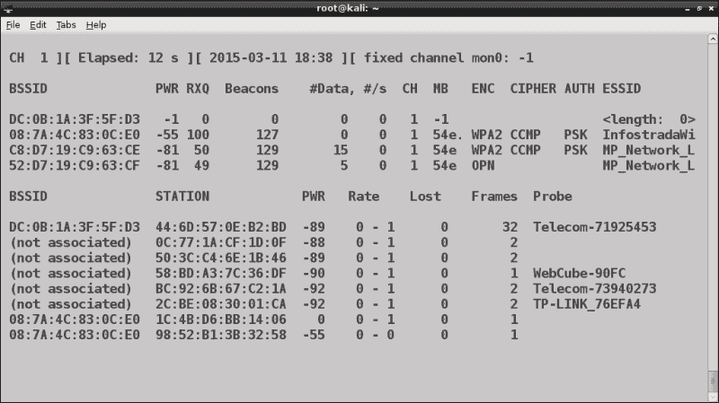
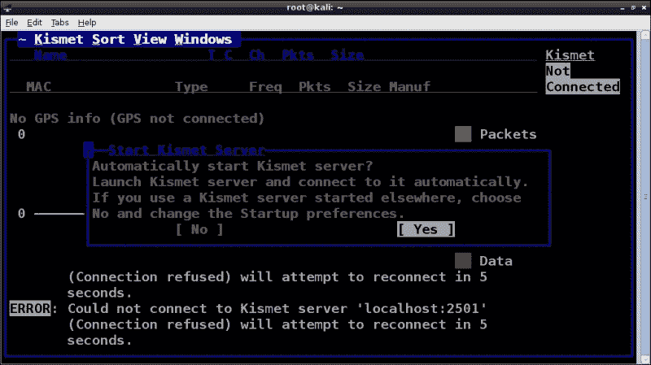
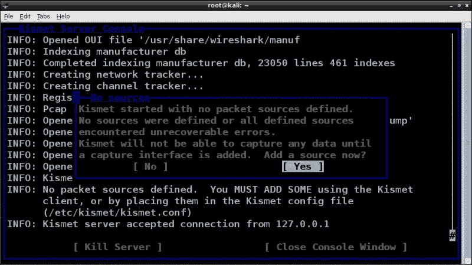
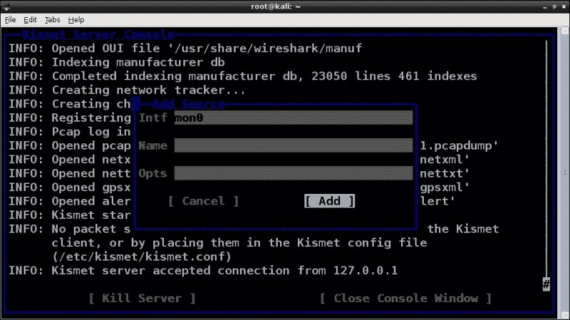
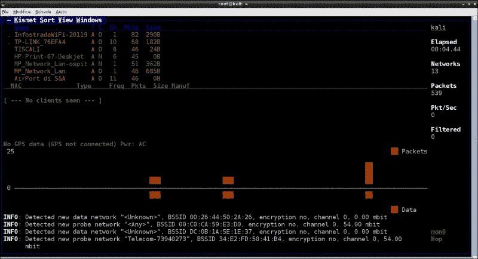
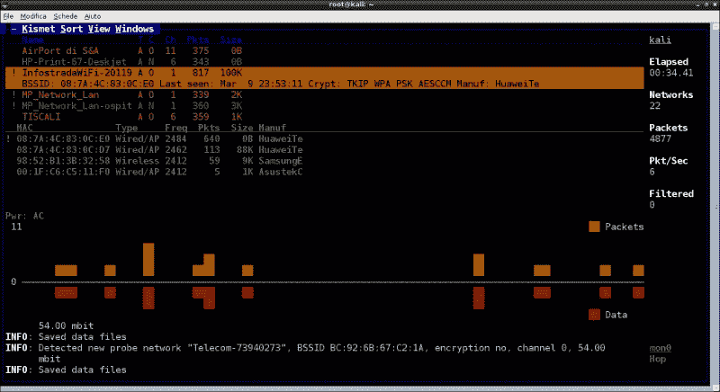

# 第三章 无线局域网侦察

在本章中，我们将介绍无线局域网（**LANs**）的基本概念，并了解如何进行渗透测试的侦察和信息收集阶段。

本章涉及无线网络扫描和信息收集，列举可见和隐藏的网络，识别使用的安全协议、可能的漏洞以及连接的客户端。涵盖的主题如下：

+   802.11 标准和无线局域网简介

+   无线扫描简介

+   使用`airodump-ng`进行无线扫描

+   使用 Kismet 进行无线扫描

# 802.11 标准和无线局域网简介

在进行实际操作之前，值得回顾一下 802.11 标准的基本概念，无线局域网就是基于这些概念的。

802.11 是由 IEEE 制定的用于实现无线局域网的第二层（链路层）标准。使用 802.11 标准的设备和网络通常被称为**Wi-Fi**，这是**Wi-Fi 联盟**的商标。

随着时间的推移，标准还有后续的规范，主要的有 802.11a、802.11b、802.11g 和 802.11n。

802.11a 在 5 GHz 频段上运行，而 802.11b/g 在 2.4 GHz 频段上运行，这是目前 Wi-Fi 网络中最常用的频段。802.11n 支持这两个频段，并且向后兼容其他 802.11 规范。

Wi-Fi 信号的范围取决于使用的标准、传输设备的功率以及物理障碍和无线干扰的存在。

对于普通的 Wi-Fi 设备，室内的最大覆盖范围通常从 20-25 米不等，而室外则可达 100 米甚至更远。

802.11 标准的最大吞吐量，即最大数据速率，从 802.11a/b 标准的 11 Mbps 到 802.11n 标准的 600 Mbps 不等。

每个频段被细分为多个信道，这些信道是包含较小频率范围的子集。2.4 GHz 频段被细分为 14 个不同的信道，但并非所有信道都总是被使用。大多数国家通常只允许使用这些信道的一个子集，而一些国家则允许使用所有信道。

例如，美国允许使用 1 到 11 号信道，而日本允许使用所有 14 个信道。事实上，每个国家都建立了自己的*监管领域*（*regdomain*），这是一套定义无线传输的无线电频谱分配规则。监管领域还定义了允许的最大发射功率。

### 注意

**关于 Wi-Fi 信道**

要获取有关 Wi-Fi 信道和监管领域的更多信息，请参考维基百科上的资源[`en.wikipedia.org/wiki/List_of_WLAN_channels`](https://en.wikipedia.org/wiki/List_of_WLAN_channels)。

## 802.11 帧、类型和子类型

802.11 帧由**MAC 头部**、**有效载荷**和**帧检查序列**（**FCS**）部分组成，如下图所示：


MAC 头部部分被分成各种字段，其中包括**类型**和**子类型**字段。802.11 标准定义了三种不同类型的帧：

+   管理帧：这些帧协调无线局域网上的接入点和客户端之间的通信。管理帧包括以下子类型：

+   **信标帧**：用于宣布接入点（AP）的存在和基本配置。

+   **探测请求帧**：这些是由客户端发送的，用于测试接入点的存在或特定接入点的连接。

+   **探测响应帧**：这些是由接入点响应探测请求发送的，包含有关网络的信息。

+   认证请求帧：这些是由客户端发送的，用于在连接到接入点之前开始认证阶段。

+   认证响应帧：这些是由接入点发送的，用于接受或拒绝客户端的认证。

+   **关联请求帧**：客户端用于与 AP 关联的帧。它必须包含 SSID。

+   **关联响应帧**：这些由 AP 发送以接受或拒绝与客户端的关联。

+   **控制帧**：它们用于控制网络上的数据流量。控制帧的子类型包括**请求发送**（**RTS**）帧和**清除发送**（**CTS**）帧，它们提供了一个可选的机制来减少帧碰撞，以及由接收站发送的**确认**（**ACK**）帧，用于确认数据帧的正确接收。

+   **数据帧**：这些包含在网络上传输的数据，其中包含高层协议的数据包封装在 802.11 帧中。

在下一节中，我们将回顾无线网络的结构和构建模块。

## 基础设施模式和无线接入点

Wi-Fi 网络在基础设施模式下使用 802.11 标准。在这种模式下，称为**接入点**（**APs**）的设备用于将无线客户端站与有线局域网或互联网连接起来。接入点可以被视为有线网络的交换机的类比，但它们提供更多功能，如网络层路由、DHCP、NAT 以及通过远程控制台或 Web 管理面板的高级管理功能。

由单个 AP 组成的无线网络称为**基本服务集**（**BSS**），而具有多个 AP 的网络称为**扩展服务集**（**ESS**）。每个 AP 由**基本服务集 ID**（**BSSID**）标识，通常对应于 AP 上的无线接口的 MAC 地址。相反，无线局域网由**服务集 ID**（**SSID**）或**扩展服务集 ID**（**ESSID**）标识，通常是一个可读的字符串，用作网络的名称。


接入点定期发送广播信标帧来宣布它们的存在。通常，信标还包含 AP 的 SSID，以便客户端可以轻松识别，并向 AP 发送认证和关联请求，以连接到无线网络。

## 无线安全

与有线网络相比，无线网络上的数据传输在物理媒介方面本质上不太安全，因为附近的任何人都可以轻松地嗅探到流量。无线局域网可以使用开放式认证，例如免费的 Wi-Fi 热点，此时客户端不需要进行认证，流量也不加密，使得开放网络完全不安全。

随着时间的推移，已经开发了两种为无线局域网提供认证和加密的安全协议：**有线等效隐私**（**WEP**）和**Wi-Fi 保护访问**（**WPA**/**WPA2**）。

WEP 和 WPA/WPA2 认证协议及其相关破解技术将在第四章 *WEP 破解*和第五章 *WPA/WPA2 破解*中进行讨论。

# 无线局域网扫描

彻底检查无线电波以找到无线网络的过程称为*无线扫描*。

无线网络扫描已经变得非常流行，即使在非技术人员中也是如此，这也部分归因于所谓的*wardriving*现象。Wardriving 是在户外定位无线网络的活动，通常是驾驶汽车并配备笔记本电脑、高增益天线和 GPS 接收器。

扫描有两种主要类型：**主动**和**被动**。

+   主动扫描涉及发送广播探测请求数据包，并等待来自接入点的探测响应数据包，记录已发现的接入点。这是客户端用来识别附近可用无线网络的标准方法。这种方法的缺点是，接入点可以配置为忽略广播探测请求数据包，并从发送的信标中排除其 SSID（**隐藏 AP**），因此在这种情况下，主动扫描无法识别网络。

+   被动扫描在无线侦察方面提供了更好的结果，并且是无线扫描器采用的方法。在被动扫描中，我们不发送广播探测请求。相反，无线适配器被置于监视模式，以便它可以嗅探 Wi-Fi 频率范围内特定信道上的所有流量。捕获的数据包被分析，以确定哪些接入点正在传输，从信标中包含的 BSSID，以及哪些客户端已连接。这样，即使在主动扫描中隐藏的接入点也可以被揭示。

Kali Linux 中包含的用于扫描无线网络的工具属于被动扫描器的范畴。在本章中，我们将介绍其中两种最流行的工具，`airodump-ng`和`Kismet`，但也可以使用 Fern Wi-Fi Cracker 和 Wifite 等工具来实现这一目的。在接下来的小节中，我们将看到如何将无线适配器配置为监视模式。

## 配置无线适配器为监视模式

在上一章中，我们已经看到了如何将无线接口置于监视模式，以验证其是否与数据包嗅探兼容。现在，我们来分析这个过程的细节。

回想一下，我们发出了`airmon-ng start wlan0`命令，如下面的截图所示：


`airmon-ng`工具还会指示我们适配器使用的芯片组和驱动程序。请注意，`mon0`接口是以监视模式创建的，而`wlan0`接口处于托管模式（这是无线适配器的默认模式），如`iwconfig`命令的以下输出所示：


`mon0`接口正在监听所有信道。如果我们想监听特定信道，我们可以发出`airmon-ng start wlan0 <channel>`命令：


我们看到另一个名为`mon1`的接口已经以监视模式创建。我们可以为一个物理无线接口创建多个监视模式接口。在运行`airmon-ng`时，我们注意到一个警告，告诉我们一些进程可能会干扰`Aircrack-ng`套件的其他工具。要停止这些进程，我们可以执行`airmon-ng check kill`。

如果我们想要停止`mon0`接口，我们运行`airmon-ng stop mon0`命令：


现在接口已经处于监视模式，我们可以进行无线扫描了。

## 使用 airodump-ng 进行无线扫描

`airodump-ng`工具是`Aircrack-ng`套件中包含的众多工具之一。除了记录有关发现的接入点和客户端的信息外，它还能够嗅探和捕获 802.11 帧。`Airodump-ng`扫描 Wi-Fi 频段，从一个信道跳到另一个信道。要使用它，我们需要先将无线接口置于监视模式，就像我们之前看到的那样，然后运行`airodump-ng mon0`命令。下面的截图显示了它的输出：


第一行显示了 AP 和客户端之间的最后一次关联，当前信道，经过的运行时间以及使用的安全协议。正如我们在前面的截图中所注意到的，屏幕的上半部分显示了 AP，而下半部分显示了客户端。

对于找到的每个 AP，显示以下信息：

+   BSSID（MAC 地址）

+   信号的功率级别（PWR）和接收质量（RXQ）

+   发送的信标数量和捕获的数据包数量

+   信道（CH）

+   支持的最大速度（MB）

+   加密算法（ENC）、密码（CIPHER）和使用的认证协议（AUTH）

+   无线网络名称或 SSID（ESSID）

如果 ESSID 字段中出现`<length: number>`，这意味着 SSID 是隐藏的，AP 只会透露其长度（字符数）。如果数字是 0 或 1，则意味着 AP 不会透露 SSID 的实际长度。

在底部的`STATION`字段是关于客户端的 MAC 地址，它可以与 AP 关联。如果关联，则 AP 的 BSSID 显示在相关字段中；否则，显示`not associated`状态。

`Probes`字段指示客户端正在尝试连接的 AP 的 SSID，如果它当前没有关联。当它对来自客户端的探测请求或关联请求做出响应时，这可以揭示一个隐藏的 AP。

有其他方法可以获取隐藏的 SSID。我们可以通过向连接的客户端发送去认证数据包来强制它们重新关联到 AP，就像我们将在第七章中看到的那样，*无线客户端攻击*。我们还可以使用 Wireshark 分析捕获的关联和探测请求/响应数据包来恢复 SSID。我们将在第四章和第五章中涵盖数据包转储和分析，关于 WEP 和 WPA/WPA2 的破解。

我们可以使用`-w`或`--write`选项后跟文件名将输出写入文件。`Airodump-ng`可以以各种格式（`pcap`、`ivs`、`csv`、`gps`、`kismet`和`netxml`）保存输出，与 Kismet 和 Wireshark 等数据包分析工具兼容。

`Airodump-ng`还允许通过`--channel`或`-c <ch_nr1,ch_nr2…..ch_nrN>`选项选择特定的信道：

```
airodump-ng -c 1 -w output mon0

```



# 使用 Kismet 进行无线扫描

Kismet 是一个功能强大的被动扫描程序，可用于不同的平台，并且默认安装在 Kali 上。它不仅仅是一个扫描程序，还是一个无线帧分析和入侵检测工具。

Kismet 由两个主要进程组成：`kismet_server`和`kismet_client`。`kismet_server`组件负责捕获、记录和解码无线帧。它的配置文件是`kismet.conf`，位于 Kali Linux 的`/etc/kismet/`目录下。`kismet_client`前端是一个基于 ncurses 的界面，显示检测到的 AP、统计信息和网络详细信息。要运行它，我们在命令行上键入`kismet`，或者从**应用程序**菜单中导航到**Kali Linux** | **无线攻击** | **802.11 无线工具** | **Kismet**：



正如我们所看到的，Kismet 提示我们启动服务器，我们选择`Yes`，然后在随后的提示中选择`Start`。然后可能会出现一条消息，说没有定义数据包源，并要求我们添加一个数据包源：



数据包源是我们的监视模式接口`mon0`，我们将其插入到随后的提示中的`Intf`字段中：



数据包源也可以在`kismet.conf`文件中的`ncsource`指令中设置，如下截图所示：


这是配置数据包源的推荐方法，避免每次启动 Kismet 时手动配置。

我们关闭服务器控制台，客户端界面显示出来。要访问窗口顶部的菜单，我们按下*~*键，并用箭头键移动到条目上。可以通过导航到**Kismet** | **Preferences**来自定义 Kismet 界面和行为：


屏幕从上到下分为以下主要部分：网络列表、客户端列表、数据包图、状态以及右侧的一般信息侧栏。您可以在**View**菜单中选择要可视化的部分：



网络列表以默认的自适应模式显示检测到的网络。

要选择一个网络并查看其详细信息以及连接的客户端，我们需要将排序方法更改为另一个，例如在**Sort**菜单中使用**Type**或**Channel**。然后我们可以通过鼠标点击列表中的网络来选择一个网络：



转到**Windows** | **网络详细信息**以获取更详细的信息，例如 BSSID、信道、制造商、信号级别、数据包速率等：


如果选择**Clients**选项，我们可以看到连接到网络的客户端，以及有用的信息，如 MAC 地址、交换的数据包和客户端设备制造商。


对于隐藏 SSID 的网络，Kismet 在网络名称的位置显示字符串`<Hidden SSID>`。当客户端尝试连接到网络时，AP 会在响应数据包中清楚地发送 SSID，允许 Kismet 揭示它，就像我们已经在`Airodump-ng`中看到的那样。

Kismet 默认在启动的目录中生成以下日志文件（但我们可以在`kismet.conf`中的`logtemplate`指令中更改这一点）：

+   数据包捕获文件

+   以文本格式（`.nettxt`）的网络

+   以 XML 格式（`.netxml`）的网络

+   以 XML 格式（`.gpsxml`）的 GPS 数据

然后可以使用 Wireshark 检查数据包捕获文件，其中可能包含频谱数据、信号和噪声水平以及 GPS 数据。

实际上，Kismet 以及`Airodump-ng`可以通过`gpsd`守护进程与 GPS 接收器集成，以确定网络的坐标，这也可以用于使用适当的工具（如 GISKismet）实现图形地图。

### 注意

**GISKismet**

GISKismet 是 Kismet 的可视化工具，它默认包含在 Kali Linux 中，允许将`.netxml`文件导入 SQLite 数据库，以便我们可以对其执行 SQL 查询，并构建网络的图表和地图。当扫描具有许多接入点的大型网络时，此工具可能非常有用。有关更多信息，请参阅 GISKismet 网站[`trac.assembla.com/giskismet/wiki`](http://trac.assembla.com/giskismet/wiki)。

# 总结

在本章中，我们介绍了 IEEE 802.11 标准和基础设施模式下的典型无线局域网部署。然后我们介绍了无线扫描的基本概念，并看到如何使用 Kali Linux 中包含的两种最有效的工具`airodump-ng`和 Kismet 来实际发现和收集关于无线网络的信息。

在下一章中，我们将介绍 WEP 协议，解释为什么它是不安全的，并看看如何使用 Kali Linux 提供的工具来破解它。
