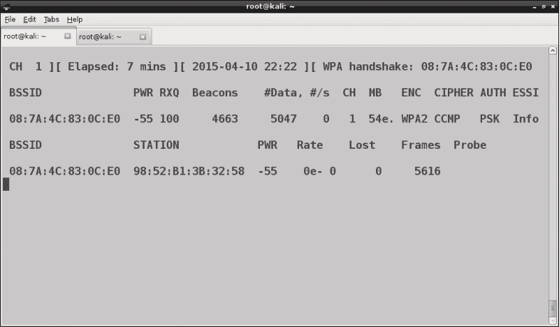
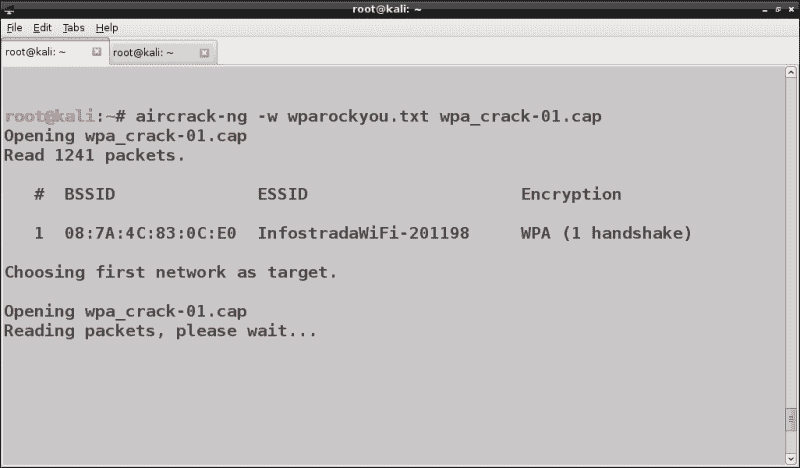
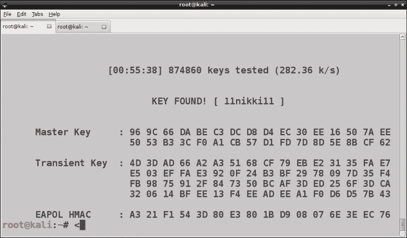
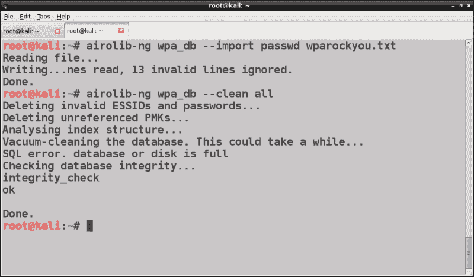
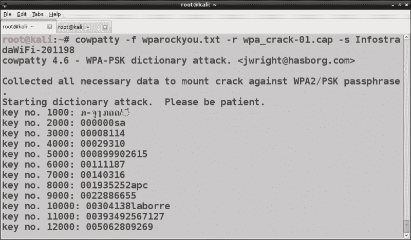
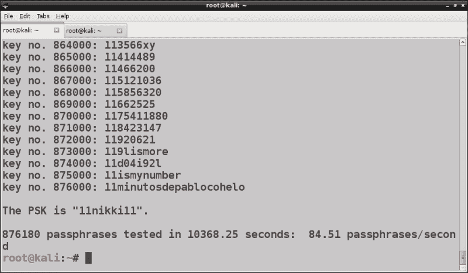
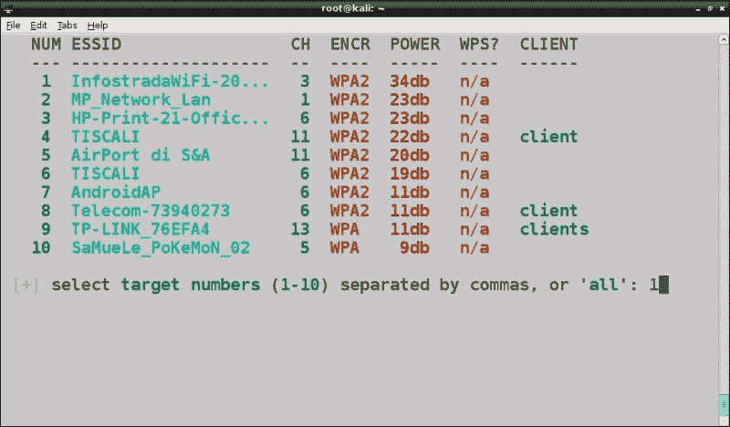
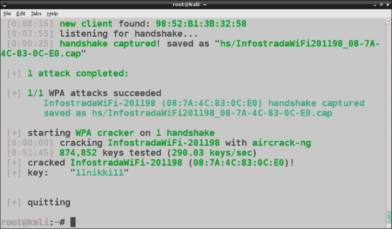

# 第五章。WPA/WPA2 破解

在这一章中，我们将研究**Wi-Fi 保护访问**（**WPA/WPA2**）协议，并了解恢复加密密钥的技术和工具。

涵盖的主题如下：

+   WPA/WPA2 简介

+   使用 Aircrack-ng 破解 WPA

+   使用 Cowpatty 破解 WPA

+   使用 GPU 破解 WPA

+   使用自动化工具破解 WPA

# WPA/WPA2 简介

WPA/WPA2 是由 Wi-Fi 联盟开发的安全协议的两个不同版本，用于替代 WEP 作为 802.11 协议的安全标准。WPA 协议首次发布于 2003 年，随后在 2004 年作为 IEEE 802.11i 标准的一部分被其后继者 WPA2 取代。WPA 和 WPA2 都支持两种认证模式：**WPA-Personal**和**WPA-Enterprise**。在 WPA-Personal 模式中，使用**预共享密钥**（**PSK**）进行认证，无需认证服务器。PSK 可以是 8 到 63 个可打印 ASCII 字符的密码。而 WPA-Enterprise 模式需要一个认证服务器，该服务器使用 RADIUS 协议与接入点（AP）通信，并使用**可扩展认证协议**（**EAP**）对客户端进行认证。我们将在第六章中详细介绍对 WPA-Enterprise 的攻击，*攻击接入点和基础设施*。

在这一章中，我们将专注于攻击 WPA-Personal 认证。WPA-Personal 和 WPA-Enterprise 在 AP 和客户端（下图中的 STA）之间共享认证过程，这被称为**四路握手**。


认证过程的四个阶段如下：

+   在第一阶段，双方独立建立了一个 256 位的**对等主密钥**（**PMK**）。它是从 PSK 和网络 SSID 生成的。然后 AP 向客户端发送一个随机数，**A-Nonce**。

+   客户端向 AP 发送一个随机的**S-Nonce**，加上一个**消息完整性代码**（**MIC**）。同时，客户端计算一个将用于加密流量的**对等瞬态密钥**（**PTK**）。 PTK 是从 PMK、A-Nonce、S-Nonce 以及客户端和 AP 的 MAC 地址派生出来的。

+   AP 自己派生 PTK，然后发送**组临时密钥**（**GTK**）给客户端，用于解密多播和广播流量，以及一个 MIC。

+   客户端向 AP 发送确认。

分析四路握手，我们可以注意到，与 WEP 不同，加密密钥（PTK）是唯一的，因为它是与握手过程相关的参数的函数，从不在 AP 和客户端之间交换。WPA 使用由 Wi-Fi 联盟开发的**临时密钥完整性协议**（**TKIP**）加密协议，用于临时替代 WEP 加密，但也发现了一些漏洞，并在 802.11 标准的最新版本中已被弃用。

WPA2 默认使用**CCMP**（**计数器密码模式协议**），这是一种基于**高级加密标准**（**AES**）的协议，AES 是事实上的标准对称加密算法。

要了解 WPA/WPA2 实施的细节和我们将在下一节中涵盖的攻击，请参考附录中的链接，*参考资料*。

## 攻击 WPA

WPA/WPA2 协议（以下简称 WPA）被认为是安全的，因为它依赖于强大的认证和加密协议，特别是使用 AES-CCMP 的 WPA2。接下来，我们将展示只有在使用弱 PSK 时才会有漏洞。

TKIP 已被证明容易受到攻击，可能导致数据包解密和注入，但不能恢复 PSK。对于 PSK 破解，我们需要捕获四次握手帧，这些帧给出了计算 PTK 所需的所有参数，包括用于检查我们的候选密钥是否正确的 MIC。

一旦我们有了捕获的数据包文件，我们可以尝试通过对其进行离线*暴力破解攻击*或*字典攻击*来破解密钥。暴力破解攻击意味着检查整个密钥空间，即可能形成密钥的所有可能字符组合。要可行，PSK 必须很短。否则，一个强大的 PSK 将需要很长时间才能被破解。

要有一个大致的时间估计，我们需要通过在线可用的暴力破解计算器之一来估算，例如[`calc.opensecurityresearch.com/`](http://calc.opensecurityresearch.com/)上的计算器。假设我们可以每秒测试 100,000 个密钥，这是一个相当高的速率，密钥的字符集是字母数字组合，我们可能会惊讶地发现破解一个 8 个字符长的密钥所需的时间：


对于一个 63 个字符长的密钥，这是相当令人泄气的：


在字典攻击中，我们需要测试字典文件或单词列表中包含的所有单词。要成功，密钥必须包含在使用的单词列表中。

有一些技术可以加快破解过程。对于字典攻击，一种技术是使用预先计算的哈希列表（或表），也称为*彩虹表*，而不是使用单词列表。通过这种方式，我们可以从字典文件的单词预先计算 PMK 并将其存储在彩虹表中。缺点是每个网络 ESSID 都需要其彩虹表，因为 PMK 也取决于 ESSID，并且需要大量的磁盘空间。

加速这个过程的另一种技术是利用最近视频卡的**图形处理单元**（**GPU**）的计算能力。

我们将在本章后面看到如何利用 GPU 破解 WPA 密钥。

### 注意

**使用 Amazon Linux AMI 破解 WPA**

破解 WPA 密钥的一个有趣且相对新的方法是使用启用了 NVIDIA GRID GPU 驱动程序的 Amazon Linux AMI，由 Amazon EC2 提供。AMI（Amazon Machine Image）允许利用 NVIDIA GPU 的处理能力，具有 1,536 个 CUDA 核心和 4GB 视频内存。有关更多信息，请阅读[`docs.aws.amazon.com/AWSEC2/latest/UserGuide/using_cluster_computing.html`](http://docs.aws.amazon.com/AWSEC2/latest/UserGuide/using_cluster_computing.html)上提供的指南。

还有在线的基于云的服务，可以在支付费用后，只需提供四次握手文件和网络 SSID 即可破解 WPA/WPA2 密钥。

这种服务的一个例子是 CloudCracker - [`www.cloudcracker.com/`](https://www.cloudcracker.com/)。

在接下来的章节中，我们将介绍使用 Aircrack-ng 套件和 Cowpatty 破解 WPA PSK 的过程。

## 使用 Aircrack-ng 破解 WPA

在前一节中，我们提到要破解 WPA 密钥，我们必须首先捕获与目标 AP 和客户端之间的 WPA 握手相关的四个帧。为此，我们可以被动地等待客户端成功进行身份验证，完成握手，并捕获相关的帧。在某些情况下，我们需要等待更长的时间，因此我们可以通过对已连接的客户端进行去认证，诱使其重新与 AP 进行身份验证（*去认证攻击*）来加快这个过程。

我们首先使用`airmon-ng start wlan0`命令将无线接口设置为监视模式，然后使用目标 AP 的 BSSID 和信道作为参数运行`airodump-ng`：

```
airodump-ng --channel 1 --bssid 08:7A:4C:83:0C:E0 --write wpa_crack mon0

```



当客户端向 AP 进行身份验证时，airodump-ng 输出的第一行显示发生的 WPA 握手。在这种情况下，airodump-ng 将捕获的握手保存在`wpa_crack`文件中。

如果没有发生握手，但是客户端已经连接，并且我们离它不太远，我们可以使用以下命令从 AP 中去认证它： 

```
aireplay-ng --deauth 1 -c 98:52:B1:3B:32:58 -a 08:7A:4C:83:0C:E0 mon0

```

在这里，`--deauth`（或-0）是用于去认证攻击的，`1`代表要发送的一组帧，`-c`是客户端的 MAC 地址，`-a`是 AP 的 MAC 地址。


如果攻击成功，我们应该在短时间内看到客户端重新连接，然后我们可以捕获 WPA 握手。

一旦我们捕获了握手，我们就可以使用 aircrack-ng 来破解密钥，指定要使用的字典文件或单词列表。只有在字典文件中存在时，aircrack-ng 才能找到 WPA PSK。

在网上有很多单词列表可用，其中一些列在[`www.aircrack-ng.org/doku.php?id=faq#where_can_i_find_good_wordlists`](http://www.aircrack-ng.org/doku.php?id=faq#where_can_i_find_good_wordlists)上。

Wordlists 也默认包含在 Kali Linux 中，位于`/usr/share/wordlists`下，`rockyou.txt.gz`文件提供了一个大型压缩的单词列表供使用。

可以使用**crunch**工具创建自定义单词列表（键入`man crunch`查看手册页）。

对于我们的示例，我们使用`rockyou.txt.gz`单词列表，因此我们首先解压缩它：

```
gunzip rockyou.txt.gz

```

为了减少尝试的单词数量，我们必须考虑 PSK 由最少 8 个字符和最多 63 个字符组成。因此，我们可以从`rockyou.txt`中创建一个符合这些要求的新单词列表。一个允许您过滤和减少单词列表的工具是**pw-inspector**。

我们通过将`rockyou.txt`作为输入传递给 pw-inspector 来创建新的单词列表`wparockyou.txt`：

```
cat rockyou.txt | sort | uniq | pw-inspector -m 8 -M 63 > wparockyou.txt

```

然后我们执行使用`aircrack-ng`的字典攻击：

```
aircrack-ng -w wparockyou.txt wpa_crack-01.cap

```



经过一段时间后，如果在使用的单词列表中找到了密钥，aircrack-ng 会在输出中返回它，以及经过的时间，测试的密钥数量和测试速度，如我们在下面的截图中所看到的：



如果我们想使用彩虹表进行字典攻击，我们可以使用`airolib-ng`工具创建网络 ESSIDs 的数据库和相关的预先计算的 PMKs。

为了创建我们目标网络的数据库`wpa_db`，我们运行以下命令：

```
airolib-ng wpa_db --import essid InfostradaWiFi-201198

```

然后导入我们之前使用的字典文件：

```
airolib-ng wpa_db --import passwd wparockyou.txt

```

在继续计算 PMK 之前，建议清理和优化数据库：

```
airolib-ng wpa_db --clean all

```



接下来，我们使用以下命令计算 PMKs：

```
airolib-ng wpa_db -batch

```

最后，我们可以在数据库上执行`aircrack-ng`：

```
aircrack-ng -r wpa_db wpa_crack-01.cap

```

## 使用 Cowpatty 破解 WPA

作为 aircrack-ng 的替代品，Cowpatty 是一种易于使用且有效的 WPA PSK 破解工具，由**Joshua Wright**开发。

它的使用方式与 aircrack-ng 非常相似，因为它接受包含四次握手和单词列表的数据包捕获，以及网络 ESSID：

```
cowpatty -f wparockyou.txt -r wpa_crack-01.cap -s InfostradaWiFi-201198

```



正如我们在下面的截图中所看到的，破解的 PSK 显示在输出中。Cowpatty 像 aircrack-ng 一样，还显示了经过的时间，测试的密码数量和速率：



Cowpatty 也可以将彩虹表作为输入。要从我们的单词列表中构建它，我们使用`genpmk`工具，执行以下命令：

```
genpmk -f wparockyou.txt -d hash_table -s InfostradaWiFi-201198

```


然后，我们启动程序，指定彩虹表而不是单词列表的`-d`选项：

```
cowpatty -d hash_table -r wpa_crack-01.cap -s InfostradaWiFi-201198

```

# 使用 GPU 破解 WPA

最近视频卡的 GPU 通常包括大量的核心，可以同时执行线程，从而比 CPU 更快地执行复杂的计算。

要适用于**通用目的计算**（**GPGPU**），GPU 必须支持 NVIDIA **Compute Unified Device Architecture**（**CUDA**）或**Open Computing Language**（**OpenCL**）平台，这允许普通程序在执行指定代码部分时访问和利用 GPU 的硬件。

Kali Linux 中包含的两个最受欢迎的程序，可以利用 GPU 来破解密码，分别是**Pyrit**和**oclHashcat**。

### 注意

**准备进行 GPU 破解**

首先值得指出的是，基于 GPU 的破解工具无法在虚拟机中运行，因为它们需要直接访问物理视频卡。因此，我们需要在 Kali Linux 的本机安装中运行它们。

要进行 GPU 破解，我们首先需要检查视频卡的正确驱动程序是否已安装。如果要使用 CUDA 或 OpenCL，我们必须安装相应的专有驱动程序（NVIDIA 或 AMD/ATI）。

NVIDIA 卡的有用参考资料是[`docs.kali.org/general-use/install-nvidia-drivers-on-kali-linux`](http://docs.kali.org/general-use/install-nvidia-drivers-on-kali-linux)，而对于 AMD/ATI 卡，以下帖子可能有所帮助[`forums.kali.org/showthread.php?17681-Install-AMD-ATI-Driver-in-Kali-Linux-1-x`](https://forums.kali.org/showthread.php?17681-Install-AMD-ATI-Driver-in-Kali-Linux-1-x)。

我们还需要安装 NVIDIA CUDA 工具包或 AMD APP SDK（参见附录，*参考资料*）。

## Pyrit

Pyrit 是用 Python 编写的工具，支持 CPU 和 GPU 破解，后者通过 CUDA 和 OpenCL 模块。使用最新的视频卡，Pyrit 能够每秒计算高达 100,000 个**PMKs**（**Pairwise Master Keys**），与仅依靠 CPU 相比，大大加快了破解过程。

Pyrit 的工作方式是通过使用字典文件作为输入，就像 aircrack-ng 一样，或者使用预先计算的 PMKs 数据库来破解我们目标 ESSID 的密码。

后一种方法速度更快，但需要您事先创建数据库或使用预先构建的数据库。

在第一种情况下，启动的命令如下：

```
pyrit -r wpa_crack-01.cap -i wparockyou.txt attack_passthrough

```


这里，`attack_passthrough`指定了使用字典文件的攻击，`-r`指定了数据包捕获，`-i`指定了要使用的单词列表。

在第二种情况下，当使用数据库时，我们首先将 ESSID 添加到数据库中：

```
pyrit -e InfostradaWiFi-201198 create_essid

```

现在，我们将字典文件导入数据库：

```
pyrit -i wparockyou.txt import_passwords

```


然后，我们使用以下命令从相关密码计算 PMKs：

```
pyrit batch

```

最后，我们可以运行破解过程：

```
pyrit -r wpa_crack-01.cap attack_db

```

## oclHashcat

oclHashcat 工具是一个强大的基于 GPGPU 的多哈希破解工具，支持 CUDA 和 OpenCL API。

OclHashcat 是流行的**Hashcat**工具的 GPGPU 版本，它是以前版本*oclHashcat-plus*和*oclHashcat-lite*的融合。它支持许多哈希算法攻击，其中包括字典和暴力攻击。

OclHashcat 不接受以`.cap`格式的数据包捕获，而必须将其转换为自己的格式`.hccap`。为此，我们可以使用 aircrack-ng：

```
aircrack-ng wpa_crack-01.cap -J wpa_crack-01.hccap

```

要对捕获的握手进行字典攻击，使用以下命令：

```
oclHashcat -m 2500 wpa_crack-01.hccap wparockyou.txt

```

这里，`-m 2500`指定了 WPA 攻击模式。

例如，要对由四个小写字母和四个数字组成的八个字符 PSK 进行暴力破解攻击，我们需要运行以下命令：

```
oclHashcat -m 2500 -a 3 wpa_crack-01.hccap ?l?l?l?l?d?d?d?d

```

实际上，oclHashcat 有自己内置的字符集，我们可以用它来定义掩码，即配置我们想要破解的密码的密钥空间的字符串。

# 使用自动化工具进行 WPA 破解

在最后一章中，我们介绍了两个自动化工具来破解 WEP（以及 WPA）密钥：Wifite 和 Fern WiFi Cracker。

在上一章中，我们展示了使用 Fern WiFi Cracker 进行 WEP 破解的实际示例；在本章中，我们将看到如何使用 Wifite 破解 WPA 密钥。

## Wifite

正如我们已经看到的，Wifite 是基于 Aircrack-ng 套件的工具。默认情况下，它依赖于 aircrack-ng 进行 WPA 破解，但也支持 Cowpatty、Pyrit 和 oclHashcat。

要破解 WPA 密钥，我们将运行以下命令：

```
wifite -wpa -dict wparockyou.txt

```


程序扫描 WPA 无线网络并显示结果：


当我们确定了目标网络后，我们按下*Ctrl* + *C*并选择网络（在本例中是数字`1`）：



Wifite 开始监听以捕获 WPA 握手。

之后，程序开始使用先前提供的字典文件进行破解过程：


最后，它返回破解的密钥并显示其他相关信息，就像 aircrack-ng 一样（经过的时间，测试的密钥数量和速率）：



如果没有捕获到握手，Wifite 会尝试取消连接的客户端，自动执行 aireplay-ng 执行的取消认证攻击。

我们还可以选择使用其他工具来破解密钥，而不是 aircrack-ng，指定相关选项（例如，Pyrit 或 Cowpatty）。

# 摘要

在本章中，我们已经介绍了 WPA/WPA2 安全协议，并分析了如何捕获 WPA 四路握手并使用 Kali Linux 上可用的许多工具来破解 PSK。

还有一种针对**Wi-Fi Protected Setup**（**WPS**）部署的攻击，可以在相对较短的时间内导致 WPA PSK 恢复。我们将在第六章中涵盖这种攻击和其他针对接入点的攻击，*攻击接入点和基础设施*。
