# 安装和配置 Kali Linux

本章将指导您了解专门用于渗透测试目的的 Kali Linux 2018.2 的精彩世界。在本章中，我们将涵盖以下主题：

+   Kali 的简要历史

+   Kali 的几个常见用途

+   下载和安装 Kali

+   配置和更新 Kali

# 技术要求

在本章和整本书中，读者将需要一台配备 6GB 或更多 RAM 的笔记本电脑或台式机，以及 100GB 硬盘空间，如果要将 Kali Linux 和测试实验室环境安装为虚拟机。如果要在闪存驱动器或 SD/micro-SD 卡上安装 Kali，最小存储空间应为 8GB（建议为 16GB 或更多）。读者还需要下载以下内容：

+   VirtualBox ([`www.virtualbox.org/wiki/Downloads`](https://www.virtualbox.org/wiki/Downloads))

+   Vmware Player ([`my.vmware.com/en/web/vmware/free#desktop_end_user_computing/vmware_workstation_player/14_0`](https://my.vmware.com/en/web/vmware/free#desktop_end_user_computing/vmware_workstation_player/14_0))

+   Kali Linux ([`www.kali.org/downloads/`](https://www.kali.org/downloads/))

# Kali Linux 工具类别

截至目前，Kali Linux 的最新版本是 2018.2 版，发布于。正如官方网站[`bugs.kali.org/changelog_page.php`](https://bugs.kali.org/changelog_page.php)上所列出的，这个版本包括：

+   对 AMD GPU 的更好支持

+   针对 Spectre 和 Meltdown 漏洞的 x86 和 x64 架构修复

+   更容易访问 Metasploit，使用`metasploit-framework-4.16.34-0Kali2`和更新版本

+   更新工具，包括 Bloodhound v1.51、Reaver 1.6.4、PixieWPS 1.42、BurpSuite 1.7.32、Hashcat 4.0 等

+   Wpscan、Openvas、Xplico、Responder 和 Dradis 的改进

Kali Linux 包含许多工具，可在渗透测试过程中使用。Kali Linux 中包含的渗透测试工具可以分为以下几类：

+   信息收集：这个类别包含几个工具，可用于收集有关 DNS、IDS/IPS、网络扫描、操作系统、路由、SSL、SMB、VPN、VoIP、SNMP、电子邮件地址和 VPN 的信息。

+   漏洞评估：在这个类别中，您可以找到用于一般漏洞扫描的工具。它还包含用于评估 Cisco 网络的工具，以及用于评估几个数据库服务器中的漏洞的工具。这个类别还包括几个模糊测试工具。

+   Web 应用程序：这个类别包含与 Web 应用程序相关的工具，如内容管理系统扫描器、数据库利用、Web 应用程序模糊器、Web 应用程序代理、Web 爬虫和 Web 漏洞扫描器。

+   数据库评估：这个类别中的工具测试各种数据库的安全性。有许多专门设计用于测试 SQL 数据库的工具。

+   密码攻击：在这个类别中，您将找到几个工具，可以用来执行在线或离线密码攻击。

+   无线攻击：测试无线安全性变得越来越普遍。这个类别包括攻击蓝牙、RFID/NFC 和无线设备的工具。

+   利用工具：这个类别包含可以用来利用目标环境中发现的漏洞的工具。您可以找到用于网络、Web 和数据库的利用工具。还有用于进行社会工程攻击和查找利用信息的工具。

+   嗅探和欺骗：这个类别中的工具可用于嗅探网络和 Web 流量。这个类别还包括网络欺骗工具，如 Ettercap 和 Yersinia。

+   **后期利用**：这个类别中的工具将能够帮助您保持对目标机器的访问。在安装这个类别中的工具之前，您可能需要在机器中获得最高的特权级别。在这里，您可以找到用于在操作系统和 Web 应用程序中设置后门的工具。您还可以找到用于隧道的工具。

+   **取证**：这个类别包含执行数字取证获取、数据恢复、事件响应和文件切割的工具。

+   **报告工具**：在这个类别中，您将找到帮助您记录渗透测试过程和结果的工具。

+   **社会工程工具**：这个类别包含非常强大的 Maltego 和**社会工程工具包**（**SET**），等等，这些在渗透测试的侦察和利用阶段非常有用。

+   **系统服务**：这个类别包含在渗透测试任务中可能有用的几个服务，比如 Apache 服务、MySQL 服务、SSH 服务和 Metasploit 服务。

为了简化渗透测试人员的生活，Kali Linux 为我们提供了一个名为**前 10 安全工具**的类别。顾名思义，这些是渗透测试人员最常用的前 10 个安全工具。这个类别中包含的工具有`aircrack-ng`、`burp-suite`、`hydra`、`john`、`maltego`、`metasploit`、`nmap`、`sqlmap`、`wireshark`和`zaproxy`。

除了包含用于渗透测试任务的工具之外，Kali Linux 还提供了一些工具，您可以用于以下目的：

+   **逆向工程**：这个类别包含可以用来调试程序或反汇编可执行文件的工具。

+   **压力测试**：这个类别包含可以用于帮助您对网络、无线、Web 和 VOIP 环境进行压力测试的工具。

+   **硬件黑客**：这个类别中的工具可以用于处理 Android 和 Arduino 应用程序。

+   **取证**：这个类别中的工具可以用于各种数字取证任务。这包括对磁盘进行成像、分析内存映像和文件切割。Kali Linux 提供的最好的取证工具之一是 Volatility。这个命令行工具有许多功能用于分析内存映像。还有一些可用的 GUI 工具，比如 Autopsy 和 Guymager，还有已经修复的 Xplico。

为了本书的目的，我们只关注 Kali Linux 的渗透测试工具。

# 下载 Kali Linux

在安装和使用 Kali Linux 之前，首先要做的事情是下载它。您可以从 Kali Linux 网站([`www.kali.org/downloads/`](http://www.kali.org/downloads/))获取 Kali Linux。

在下载页面上，您可以根据以下项目选择官方的 Kali Linux 镜像：


机器架构：i386、x64 和 armhf

VMware、VirtualBox 和 Hyper-V 的镜像也可以从 Offensive Security 下载页面[`www.offensive-security.com/kali-linux-vm-vmware-virtualbox-hyperv-image-download/`](https://www.offensive-security.com/kali-linux-vm-vmware-virtualbox-hyperv-image-download/)下载，如下面的截图所示：


这些镜像文件可以直接下载或者通过种子作为 OVA、ZIP 和 7-Zip 文件下载

Kali Linux 自定义 ARM 下载可以从[`www.offensive-security.com/kali-linux-arm-images/`](https://www.offensive-security.com/kali-linux-arm-images/)下载。可以通过点击设备名称右侧的箭头下载 Chromebook、Raspberry Pi 等设备的镜像。

Kali NetHunter v3.o 可以从 Offensive Security 网站[`www.offensive-security.com/kali-linux-nethunter-download/`](https://www.offensive-security.com/kali-linux-nethunter-download/)下载。

有关选择、安装和使用适当版本的 NetHunter 的更多信息将在后面的章节中讨论：

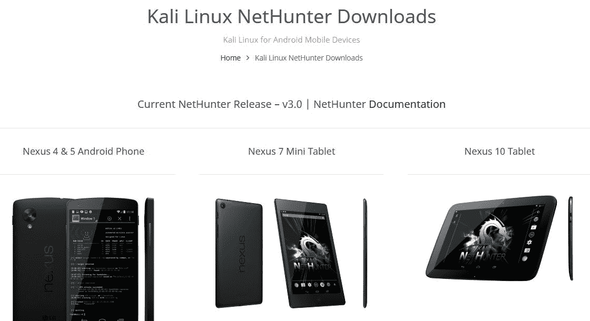

Kali Linux Nethunter 下载页面

如果您想要将图像刻录到 DVD 上或在您的机器上安装 Kali Linux，您可能需要下载 ISO 图像版本。但是，如果您想要在虚拟环境中使用 Kali Linux，如 VirtualBox、VMWare 或 Hyper-V，您可以使用相关的图像文件来加快虚拟环境的安装和配置，可在[`www.offensive-security.com/kali-linux-vm-vmware-virtualbox-hyperv-image-download/`](https://www.offensive-security.com/kali-linux-vm-vmware-virtualbox-hyperv-image-download/.)上找到。

成功下载图像文件后，您需要将下载的图像的 SHA 哈希值与下载页面上提供的`sha256sum`哈希值进行比较。检查 SHA-256 值的目的是确保下载的图像的完整性得到保留。这可以防止用户安装损坏的图像或被恶意篡改的图像文件。

在 UNIX/Linux/BSD 操作系统中，您可以使用`sha256sum`命令来检查已下载图像文件的 SHA-256 哈希值。请记住，由于其大小，计算 Kali Linux 图像文件的哈希值可能需要一些时间。例如，要生成`kali-linux-2018.2-amd64.iso`文件的哈希值，使用以下命令：

```
sha256sum kali-linux-2018.2-amd64.iso
```

对于 Windows 用户，Raymond Lin 创建的一个小型免费工具，称为 MD5 和 SHA 校验工具，可以使用。此工具计算文件的 MD5、SHA-1、SHA-256 甚至 SHA-512 哈希，并允许比较和验证哈希。

MD5 和 SHA 校验工具可在以下网址下载：[`download.cnet.com/MD5-SHA-Checksum-Utility/3000-2092_4-10911445.html`](https://download.cnet.com/MD5-SHA-Checksum-Utility/3000-2092_4-10911445.html)。下载并运行后，单击“浏览”按钮，浏览到下载文件的路径。在这种情况下，我将使用我的`kali-linux-2018.2-amd64.iso`文件，如下图所示：


在上述截图中，`kali-linux-2018.2-amd64.iso`文件的哈希也是从 Kali Linux 下载页面复制并粘贴到哈希字段进行验证。单击“验证”按钮以比较和验证 SHA-256 哈希：

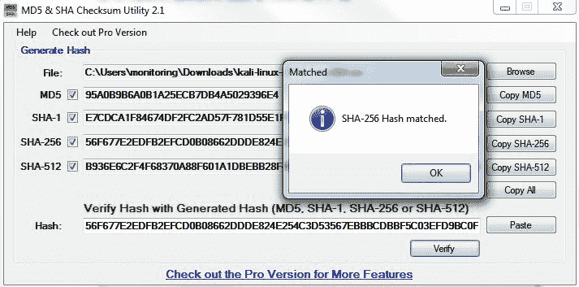

SHA-256 哈希匹配

如果两个值匹配，您可以直接转到*使用 Kali Linux*部分。但是，如果它们不匹配，这意味着您的图像文件损坏了；您可能需要从官方下载镜像再次下载文件。当我们运行我们下载的文件的哈希并将其与网站上的哈希进行比较时，我们看到它们匹配，表明软件包已完全下载并且完整。

# 使用 Kali Linux

您可以以以下方式之一使用 Kali Linux：

+   您可以直接从 Live DVD 上运行 Kali Linux

+   您可以在硬盘上安装 Kali Linux，然后运行它

+   您可以在 USB 磁盘上安装 Kali Linux（作为便携式 Kali Linux）

在接下来的章节中，我们将简要描述每种方法。

# 使用 Live DVD 运行 Kali

如果您想要在不先安装的情况下使用 Kali Linux，可以将 ISO 图像文件刻录到 DVD 上。刻录过程成功完成后，使用该 DVD 启动您的机器。您需要确保已将机器设置为从 DVD 启动。

使用 Kali Linux 作为 Live DVD 的优势在于设置非常快速，使用非常简单。

不幸的是，Live DVD 有一些缺点；例如，任何文件或配置更改在重新启动后将不会被保存。此外，与从硬盘上运行 Kali Linux 相比，从 DVD 上运行 Kali Linux 速度较慢，因为 DVD 的读取速度比硬盘的读取速度慢。

这种运行 Kali 的方法只建议用于测试 Kali。但是，如果您想广泛使用 Kali Linux，我们建议您安装 Kali Linux。

# 在硬盘上安装

要在硬盘上安装 Kali Linux，您可以选择以下方法之一：

+   在物理/真实机器上安装（常规安装）

+   在虚拟机上安装

您可以选择适合您的任何方法，但我们个人更喜欢在虚拟机上安装 Kali Linux。

# 在物理机器上安装 Kali

在您在物理/真实机器上安装 Kali Linux 之前，请确保您将其安装在空的硬盘上。如果您的硬盘上已经有一些数据，那么在安装过程中这些数据将会丢失，因为安装程序将格式化硬盘。为了最简单的安装，建议您使用整个硬盘。对于更高级的设置，有在单个逻辑驱动器的分区上安装 Kali Linux 的选项。要做到这一点，您将需要一个引导操作系统的主分区和另一个用于 Kali Linux 的分区。在这样做时要小心，因为引导操作系统很容易变得损坏。

有关如何在 Windows 操作系统上安装 Kali Linux 的官方 Kali Linux 文档可以在[`docs.kali.org/installation/dual-boot-kali-with-windows`](https://docs.kali.org/installation/dual-boot-kali-with-windows)找到。

有几种工具可用于帮助您执行磁盘分区。在开源领域，以下 Linux Live CD 可用：

+   SystemRescueCD ([`www.sysresccd.org/`](http://www.system-rescue-cd.org/))

+   GParted Live ([`gparted.sourceforge.net/livecd.php`](https://gparted.sourceforge.io/livecd.php))

+   Kali Linux ([`www.kali.org`](https://www.kali.org/))

要使用 Linux Live CD，您只需要启动它，然后您就可以进行磁盘分区了。在使用 Linux Live CD 磁盘分区工具之前，请确保备份您的数据。尽管根据我们的经验它们是安全的，但谨慎起见也没什么不对，特别是如果您的硬盘上有重要数据。

在完成磁盘分区后（或者您只想使用整个硬盘空间），您可以使用 Kali Linux Live DVD 启动您的机器，并在 Kali Linux Live CD 菜单提示您选择安装或图形安装选项时选择它：

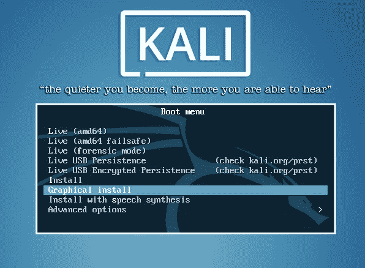

Kali Linux 启动画面-选择图形安装

之后，您将看到一个安装窗口。在安装过程中，您需要设置几个事项：

1.  设置语言：默认是英语。

1.  选择位置：使用下拉菜单选择您的国家。

1.  配置键盘：选择最适合您需求的键盘。

1.  系统的主机名：默认是 Kali。对于初学者，您可以保留默认设置。主机名通常在企业环境中使用，需要对连接到网络的所有系统进行核算。

1.  设置域：对于初学者，这应该留空。只有在安装要成为网络域的一部分时才会使用。

1.  设置密码：这将是 ROOT 帐户的密码。选择一个强密码，不要分享它，也不要忘记它。

1.  配置时钟：选择您的时区。

1.  分区磁盘：安装程序将指导您完成磁盘分区过程。如果您使用空的硬盘，只需选择默认的 Guided - use entire disk 选项以方便起见。如果您的机器上已安装了其他操作系统，您可能首先想为 Kali Linux 创建一个单独的分区，然后在此菜单中选择手动。选择适当的菜单后，安装程序将创建分区。

1.  安装程序将询问您有关分区方案；默认方案是所有文件在一个分区中。请记住，如果要将文件存储在主目录中，应选择单独的/home 分区，以便在重新安装系统时不会删除这些文件。/home 分区的大小确实取决于您的需求。如果要将所有数据放在该目录中，可能需要一个较大的分区大小（超过 50GB）。对于一般使用，您可以选择 10 到 20GB。

1.  对于初学者，建议选择“引导-使用整个磁盘”选项。然后，选择要安装 Kali Linux 的磁盘。选择所有文件在一个分区。 

1.  安装程序将显示当前配置的分区概述，如下截图所示：

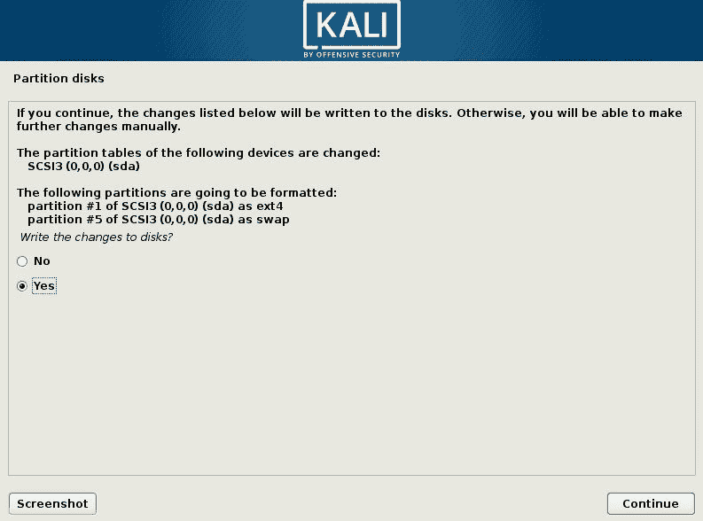

1.  确保选择“完成分区并将更改写入磁盘”，然后单击“继续”。最后，单击“是”单选按钮，然后单击“继续”以将更改写入磁盘。

1.  网络镜像：对于初学者，选择否。我们将介绍如何更新 Kali Linux。

1.  接下来，安装程序将安装 Kali Linux 系统。安装将在几分钟内完成，然后您将在硬盘上安装了 Kali Linux。在我们的测试机器上，安装大约需要 20 分钟。

1.  安装完成后，安装程序将要求您配置软件包管理器。接下来，它将要求您将 GRUB 安装到主引导记录（MBR）。您可以只选择这两个问题的默认值。注意：如果在同一台机器上有其他操作系统，则不应选择将 GRUB 安装到 MBR。

1.  如果看到以下消息，表示您的 Kali 安装已完成：


1.  您可以通过选择“继续”按钮重新启动机器以测试新的 Kali 安装。重新启动后，您将看到以下 Kali 登录屏幕。您可以使用在安装过程中配置的凭据登录。默认用户名是`root`：

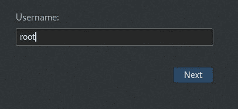

默认密码是`toor`：


# 在虚拟机上安装 Kali

您还可以将 Kali Linux 安装在虚拟机环境中作为客户操作系统。这种安装类型的优点是您无需为 Kali Linux 镜像准备单独的物理硬盘分区，并且可以直接使用现有的操作系统。

我们将使用**VirtualBox**（[`www.virtualbox.org`](http://www.virtualbox.org)）作为虚拟机软件。VirtualBox 是一款开源虚拟化软件，适用于 Windows、Linux、OS X 和 Solaris 操作系统。

不幸的是，在虚拟机上运行 Kali Linux 也有一个缺点；它比在物理机器上运行 Kali Linux 要慢。

有两种选项可用于在虚拟机上安装 Kali Linux。第一种选项是将 Kali Linux ISO 镜像安装到虚拟机中。与 VMware 镜像安装相比，这种选项需要更多时间。这种方法的优点是可以自定义 Kali 的安装。

# 从 ISO 镜像在虚拟机上安装 Kali

要在虚拟机上安装 Kali Linux ISO 镜像，可以按照以下步骤进行：

1.  通过从 VirtualBox 工具栏菜单中选择“新建”来创建新的虚拟机：


1.  之后，您需要定义虚拟机的名称和操作系统类型。在这里，我们将 VM 的名称设置为`Kali Linux`，并选择 Linux 作为操作系统类型，Debian 作为版本。

1.  然后，您需要定义 VM 的基本内存大小。您提供的内存越多，虚拟机就越好。在这里，我们为 Kali Linux 虚拟机分配了 2,048 MB 的内存。请记住，您不能将所有物理内存都分配给 VM，因为您仍然需要内存来运行主机操作系统：


1.  接下来，您将被要求创建一个虚拟硬盘。您可以选择 VDI 作为硬盘类型，以及一个动态分配的虚拟磁盘文件。我们建议至少创建一个 32 GB 的虚拟硬盘。如果您想以后安装一些软件包，您可能需要创建一个更大的虚拟硬盘。选择现在创建虚拟硬盘并点击创建：


1.  现在选择文件位置和大小。点击创建：

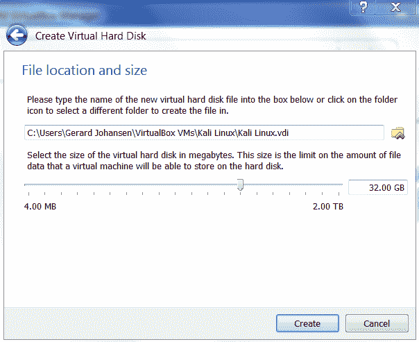

1.  阅读对话框，然后点击继续。

1.  之后，您新创建的 VM 将在 VirtualBox 菜单中列出：


1.  双击新的 Kali Linux VM：

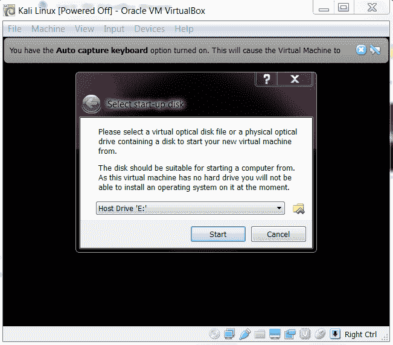

1.  使用文件图标，导航到您选择的 Kali Linux 2018.2 ISO 的位置。选择后，点击开始。

1.  一旦安装开始，请按照之前安装 Kali Linux 2.0 的部分中定义的指示进行操作。

# 使用提供的 Kali Linux VM 镜像在虚拟机上安装 Kali Linux

第二个选项是使用 Kali Linux 提供的 VMware 镜像。

通过这个选项，您可以轻松地在虚拟机上安装 Kali Linux；它位于 Kali Linux 下载页面上：[`www.offensive-security.com/kali-linux-vm-vmware-virtualbox-image-download/`](https://www.offensive-security.com/kali-linux-vm-vmware-virtualbox-image-download/)

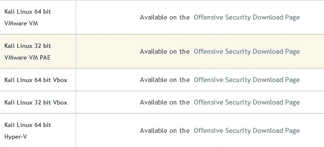

虚拟平台上可用的 Kali 镜像列表

点击 Kali 虚拟镜像后，我们将被带到另一页，列出了 Offensive Security 页面上软件包及其相关的`sha256sum`值：


下载 Kali Linux VMware 镜像（`kali-linux-2018.2-vm-amd64.zip`）后，您需要验证已下载文件的 SHA256 哈希值与下载页面上提供的哈希值是否相同。如果哈希值相同，您可以将镜像文件提取到适当的文件夹中。

由于 VMware 镜像以 ZIP 格式压缩，您可以使用任何可以提取`.gz`文件的软件，如`gzip`，或者如果您使用 Windows 操作系统，可以使用`7-Zip`。如果您成功提取，您将在目录中找到 13 个文件：

1.  要使用此 VM 镜像文件创建新的虚拟机，请从 VirtualBox 图标工具栏中选择新建。

1.  我们将使用 Kali Linux VM 作为 VM 名称，并选择 Linux 作为操作系统，Debian 作为版本。

1.  我们将 Kali Linux 虚拟机的内存大小配置为 2,048 MB。

1.  接下来，我们定义虚拟硬盘为使用现有的虚拟硬盘文件。然后，我们选择`kali-linux-2018.2-vm-amd64.vmdk`文件作为硬盘。之后，我们选择创建以创建虚拟机，如下截图所示：


以下是 Kali Linux VMware 镜像的默认配置：

+   硬盘大小：30 GB

+   网络类型：NAT

+   用户名：`root`

+   密码：`toor`

为了渗透的目的，我们应该避免使用 NAT 作为网络类型。推荐的网络类型是桥接。在配置 Kali VM 时更改 Kali 的默认密码。

如果成功，您将在 Virtual Box 的虚拟管理器列表中看到新的虚拟机。

要运行 Kali Linux 虚拟机，请点击 VirtualBox 菜单栏顶部的启动图标。启动过程后，Kali Linux 将显示其登录提示。

如果有任何错误消息，请安装 VirtualBox 扩展包。您可以从[`www.virtualbox.org/wiki/Downloads.`](http://www.virtualbox.org/wiki/Downloads)获取。

单击“确定”将带您到以下对话框：


请继续点击“安装”，然后点击“确定”。

# 保存或移动虚拟机

使用 Kali Linux 作为虚拟机的另外两个优点是，首先是虚拟机可以被暂停的便利性。暂停虚拟机允许您暂停活动而不会丢失任何工作。例如，如果您必须关闭主机系统而虚拟机仍在处理某个操作，暂停它将允许您在离开的地方继续。要暂停虚拟机，请单击位于虚拟机窗口左上角的“暂停”按钮。

虚拟机的另一个功能是能够将其从一个主机移动到另一个主机。如果您需要更改主机系统，例如从笔记本电脑运行然后移动到更新更强大的笔记本电脑，这将非常方便。这可以确保您所做的任何配置或修改保持不变，这样您就不必再次进行整个过程。

要导出虚拟机，转到“文件”并单击“导出虚拟机”。然后将引导您导出 Kali Linux 虚拟机。选择要导出的位置并保持应用程序设置不变。最后，单击“导出”，虚拟机将被导出到该位置。这可能需要一些时间，具体取决于虚拟机的大小。

导出完成后，您可以使用任何存储设备并将虚拟机转移到另一个主机系统。请记住，如果您使用 Oracle VirtualBox 创建虚拟机，请在新主机计算机上使用相同的版本。转移后，您可以通过转到“文件”、“导入虚拟机”并按照说明操作来导入虚拟机。

# 在 USB 磁盘上安装 Kali

使用 Kali Linux 的第三种选择是将其安装在 USB 闪存盘上；我们称这种方法为**便携式 Kali Linux**。根据官方 Kali 文档，这是 Kali 开发人员最喜欢和最快的引导和安装 Kali 的方法。与硬盘安装相比，使用此方法可以在支持从 USB 闪存盘引导的任何计算机上运行 Kali Linux。

USB 闪存盘的安装过程也适用于安装存储卡（SSD、SDHC、SDXC 等）。

有几种工具可用于创建便携式 Kali Linux。其中之一是**Rufus** ([`rufus.akeo.ie/`](http://rufus.akeo.ie/))。此工具仅可在 Windows 操作系统上运行。

您可以使用其他工具从 ISO 镜像创建可引导磁盘，例如：

+   Win32DiskImager ([`launchpad.net/win32-image-writer`](https://launchpad.net/win32-image-writer))

+   Universal USB Installer ([`www.pendrivelinux.com/universal-usb-installer-easy-as-1-2-3/`](http://www.pendrivelinux.com/universal-usb-installer-easy-as-1-2-3/))

+   LinuxLive USB Creator ([`www.linuxliveusb.com`](http://www.linuxliveusb.com/))

在创建便携式 Kali Linux 之前，您需要准备一些东西：

+   **Kali Linux ISO 镜像**：尽管您可以使用便携式创建工具在制作 Kali Linux 便携式时直接下载镜像，但我们认为最好先下载 ISO，然后配置 Rufus 使用镜像文件。

+   **USB 闪存盘**：您需要一个空的 USB 闪存盘，并且有足够的空间。我们建议使用至少 16GB 的 USB 闪存盘。

下载 Rufus 后，您可以通过双击`rufus.exe`文件在 Windows 计算机上运行它。然后您会看到 Rufus 窗口。

如果您使用基于 UNIX 的操作系统，可以使用`dd`命令创建镜像。以下是一个成像的例子：

```
    dd if=kali-linux-2.0-i386.iso of=/dev/sdb bs=512k

```

在这里，`/dev/sdb`是您的 USB 闪存盘。

要创建可引导的 Kali USB 闪存盘，我们需要填写以下选项：

1.  对于**设备**，我们选择 USB 闪存盘的位置。在我的情况下，这是我 Windows 系统中的 E 驱动器。

1.  对于分区方案和目标系统类型，请将其设置为 MBR 分区方案，适用于 BIOS 或 UEFI 计算机。

1.  在“使用 ISO 映像创建可引导磁盘”选项中，将值设置为 ISO 映像，并使用磁盘图标选择 ISO 映像：


1.  单击“开始”创建可引导映像。

进程完成后，首先保存所有工作，然后重新启动系统，如果要立即尝试 USB 闪存盘。您可能需要配置您的**基本输入输出系统**（**BIOS**）以从 USB 磁盘引导。如果没有错误，您可以从 USB 闪存盘启动 Kali Linux。

Rufus 也可以用于在 SD 卡上安装 Kali Linux。请务必使用 Class 10 SD 卡以获得最佳效果。

如果您想要为 USB 闪存盘添加持久性功能，可以按照文档部分*向您的 Kali Live USB 添加持久性*中描述的步骤进行操作，位于[`docs.kali.org/installation/kali-linux-live-usb-install`](http://docs.kali.org/installation/kali-linux-live-usb-install)。

# 配置虚拟机

安装后，Kali Linux 虚拟机需要进行几个配置步骤。这些步骤可以提供更大的功能和可用性。

# VirtualBox 增强功能

建议在使用 VirtualBox 成功创建 Kali Linux 虚拟机后，安装`VirtualBox 增强功能`。此附加组件将为您提供以下附加功能：

+   它将使虚拟机可以全屏查看

+   这将使鼠标在虚拟机中移动更快

+   它将使您能够在主机和客户机之间复制和粘贴文本

+   它将使客户机和主机机器可以共享文件夹

要安装增强功能，执行以下步骤：

1.  从 VirtualBox 菜单导航到设备|安装增强功能。然后，您将看到 VirtualBox 增强功能文件被挂载为磁盘。

1.  VirtualBox 随后将显示以下消息。单击“取消”关闭窗口：


1.  打开终端控制台并更改 VirtualBox 增强功能 CD ROM 挂载点（`/media/cdrom0`）：


1.  执行`VBoxLinuxAdditions.run`来运行 VirtualBox 增强功能安装程序，输入`sh ./VBoxLinuxAdditions.run`，如下所示：


您可能需要等待几分钟，直到所有所需的模块都成功构建和安装。按照以下步骤将 VM 切换到全屏模式：

1.  切换到`root`主目录。

1.  通过右键单击图标并从菜单中选择“弹出”来弹出 VBoxAdditions CD 映像。如果成功，VBoxAdditions 图标将从桌面消失。

1.  在终端控制台中键入`reboot`命令重新启动虚拟机。

1.  重新启动后，您可以从 VirtualBox 菜单中切换到全屏（查看|切换到全屏）。

# 设置网络

在接下来的部分中，我们将讨论如何为 Kali Linux 设置有线和无线网络。

# 设置有线连接

在默认的 Kali Linux VMware 映像或 ISO 配置中，Kali Linux 使用**网络地址转换**（**NAT**）作为网络连接类型。在此连接模式下，Kali Linux 机器将能够通过主机操作系统连接到外部世界，而外部世界，包括主机操作系统，将无法连接到 Kali Linux 虚拟机。

对于渗透测试任务，您可能需要将此网络方法更改为**桥接适配器**。以下是更改它的步骤：

1.  首先确保您已经关闭了虚拟机。

1.  然后，打开 VirtualBox 管理器，选择适当的虚拟机——在本例中我们使用 Kali Linux 虚拟机——然后单击右侧的网络图标，并在适配器 1 中的附加到下拉框中从 NAT 更改为桥接适配器。在名称字段中，您可以选择连接到要测试的网络的网络接口，如下图所示：


要能够使用桥接网络连接，主机机器需要连接到可以通过 DHCP 为您提供 IP 地址的网络设备，例如路由器或交换机。

正如您可能知道的那样，DHCP IP 地址不是永久 IP 地址；它只是一个租约 IP 地址。在几次之后（在 DHCP 租约时间中定义），Kali Linux 虚拟机将需要再次获取租约 IP 地址。此 IP 地址可能与以前的相同，也可能是不同的。

如果要使 IP 地址永久，可以将 IP 地址保存在`/etc/network/interfaces`文件中。

以下是 Kali Linux 中此文件的默认内容：

+   `auto lo`

+   `iface lo inet loopback`

在默认配置中，所有网络卡都设置为使用 DHCP 获取 IP 地址。要使网络卡永久绑定到 IP 地址，我们必须编辑该文件并更改内容如下：

+   `auto eth0`

+   `iface eth0 inet static`

+   `address 10.0.2.15`

+   `netmask 255.255.255.0`

+   `network 10.0.2.0`

+   `broadcast 10.0.2.255`

+   `gateway 10.0.2.2`

在这里，我们将第一个网络卡（`eth0`）设置为绑定到`10.0.2.15`的 IP 地址。您可能需要根据要测试的网络环境调整此配置。

# 建立无线连接

通过将 Kali Linux 作为虚拟机运行，您无法使用嵌入在主机操作系统中的无线网卡。幸运的是，您可以使用外部基于 USB 的无线网卡。

在此演示中，我们使用 USB Ralink 无线网卡/外置天线（稍后将在关于无线渗透测试的部分进行无线天线选择的深入讨论）：

1.  要在 Kali 虚拟机中激活您的基于 USB 的无线网卡，将无线网卡插入 USB 端口，导航到设备| USB 设备，并从 VirtualBox 菜单中选择您的无线网卡：


在此截图中，我们可以看到列出的 USB 设备。

1.  如果您的 USB 无线网卡已成功被 Kali 识别，您可以使用`dmesg`程序查看无线网卡的信息。确定您的无线设备是否正确连接的另一种选择是打开终端并运行以下命令：

```
 ifconfig
```

如果无线连接已正确配置，您应该在输出下看到`WLAN0`或`WLAN1`的列表：

1.  输出应包括 WLAN 的列表。这是无线网络连接。

1.  在 Kali 菜单的右上部分，您将看到网络连接图标。您可以单击它以显示您的网络信息。

1.  您将看到几个网络的名称，有线或无线，可供您的设备使用：


1.  要连接到无线网络，只需通过双击其名称选择要连接的特定 SSID。如果无线网络需要身份验证，您将被提示输入密码。只有在您输入正确的密码后，才能连接到该无线网络。

# 更新 Kali Linux

Kali Linux 由数百个应用软件和操作系统内核组成。如果要获取最新功能，可能需要更新软件。我们建议您只从 Kali Linux 软件包存储库更新软件和内核。

成功安装和配置 Kali Linux 后，首先要做的是更新它。由于 Kali 基于 Debian，您可以使用 Debian 命令（`apt-get`）进行更新。

`apt-get`命令将查阅`/etc/apt/sources.list`文件以获取更新服务器。您需要确保已在该文件中放入正确的服务器。

要更新`sources.list`文件，请打开终端并键入以下命令：

```
leafpad /etc/apt/sources.list
```

从官方网站[`docs.kali.org/general-use/kali-linux-sources-list-repositories`](https://docs.kali.org/general-use/kali-linux-sources-list-repositories)复制存储库，粘贴到 leafpad 中，并保存：

```
 deb http://http.kali.org/kali kali-rolling main contrib non-free
 # For source package access, uncomment the following line
 # deb-src http://http.kali.org/kali kali-rolling main contrib non-free 
```

在执行更新过程之前，您需要从`/etc/apt/sources.list`文件中指定的存储库同步软件包的索引文件。以下是此同步的命令：

```
    apt-get update  
```

确保在 Kali 中执行软件更新或安装之前始终运行`apt-get`更新。在软件包索引已同步后，您可以执行软件更新。

有两个命令选项可用于执行升级：

+   `apt-get upgrade`：此命令将把机器上当前安装的所有软件包升级到最新版本。如果在升级软件包时出现问题，该软件包将保持当前版本不变。

+   `apt-get dist-upgrade`：此命令将升级整个 Kali Linux 发行版；例如，如果要从 Kali Linux 1.0.2 升级到 Kali Linux 2.0，可以使用此命令。此命令将升级当前安装的所有软件包，并在升级过程中处理任何冲突；但是，可能需要执行一些特定操作才能执行升级。

在选择适当的命令选项以更新 Kali Linux 之后，`apt-get`程序将列出将要安装、升级或删除的所有软件包。`apt-get`命令将等待您的确认。

如果您确认，升级过程将开始。注意：升级过程可能需要很长时间才能完成，这取决于您的互联网连接速度。

# 在亚马逊 AWS 云上设置 Kali Linux AMI

Kali Linux 也可以作为亚马逊网络服务平台上的**亚马逊机器映像**（**AMI**）在云中设置，作为云计算服务。尽管列为每小时 0.046 美元的费用，但如果特别配置为基本服务且用户未超出某些设定限制，则可以免费使用。虽然注册和配置需要信用卡，但如果超出设定限制，您将在被收费之前收到通知。

在开始在云中设置 Kali Linux 之前，您可以首先访问亚马逊市场，查看此链接中 AMI 的详细信息：[`aws.amazon.com/marketplace/pp/B01M26MMTT`](https://aws.amazon.com/marketplace/pp/B01M26MMTT)。请注意，它被列为免费使用。

要开始设置和配置云中的 Kali Linux，我们必须执行以下步骤：

1.  首先，在亚马逊的 AWS 门户网站上创建一个帐户。访问[`aws.amazon.com/`](https://aws.amazon.com/)，然后单击“创建新帐户”。一定要记住使用的凭据以及您创建的 AWA 名称，如屏幕截图所示：

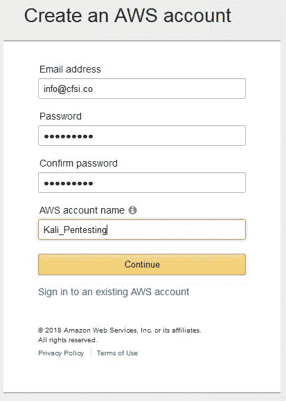

1.  单击“继续”后，完成其他所需的详细信息。在输入信用卡详细信息时，您可能会提示亚马逊给您打电话，并要求您输入验证码以进行验证和安全目的。完成后，您将进入 AWS 控制台。

1.  您还应该收到一封电子邮件通知，告知您的帐户已成功创建。您现在可以登录到 AWS 控制台，在那里您将能够完成配置。在“构建解决方案”部分，单击“启动虚拟机”：

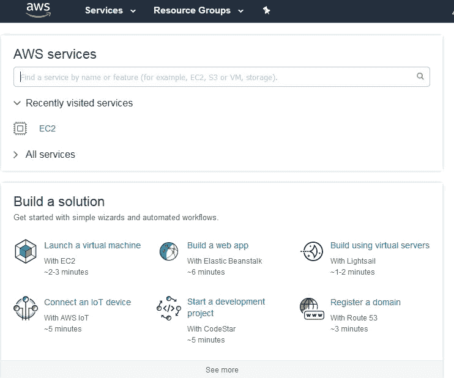

1.  在 AWS 控制台的 EC2 仪表板中，在左侧窗格中，点击网络和安全类别下的密钥对：

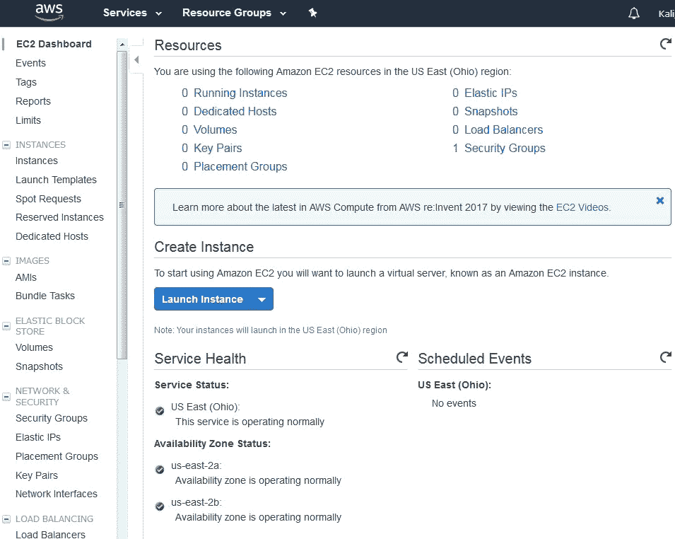

接下来，点击创建密钥对。

当提示时，输入密钥对的名称。建议您选择一个易于记住的名称和位置，因为您将需要此密钥对进行身份验证和验证：

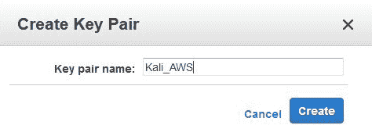

将密钥对保存到您选择的目的地。请注意，密钥对扩展名列为`.pem`，并且还以十六进制格式显示数字指纹，如下所示：


保存密钥对后，返回 AWS 控制台，点击控制台顶部的资源组，然后选择启动虚拟机。在控制台左侧的菜单中，点击 AWS Marketplace，并在搜索栏中输入 Kali Linux，如下所示：


目前市场上只有一个 Kali Linux AMI 实例。请注意，它在 Kali 标志下列为免费使用资格。点击选择以使用此 AMI：

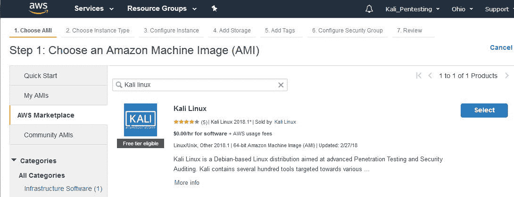

这将带我们进入 AMI 的各种实例类型的定价细节，这些实例类型包括 AMI 可用的内存和处理器使用等规格，T2 Nano 的每小时费率最低为$0.006/小时。查看完实例类型后，滚动到页面底部，然后点击继续：


对于免费版本，请选择**t2 微型**类型，因为这是用于一般用途，并且符合免费使用范围：

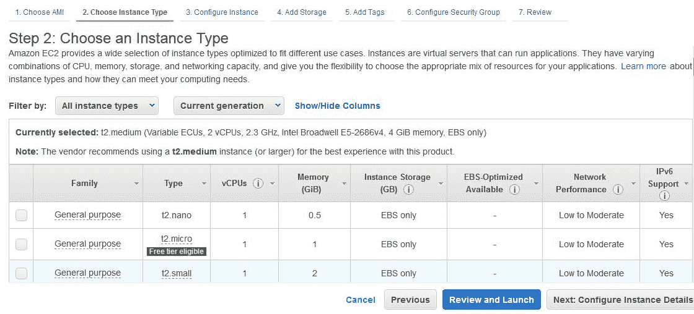

点击“审阅并启动”按钮。确认所选择的实例类型为**t2.micro**，然后点击启动：


现在应提示您使用之前保存的密钥对。在第一个下拉菜单中，选择选择现有的密钥对。在选择密钥对的菜单中，浏览到保存的密钥对的位置。点击复选框以确认条款，然后最后点击启动实例。

现在您将收到 Kali Linux AMI 的启动状态通知。如果您超出了 AWS 的免费使用范围，您还可以创建计费警报：


向下滚动并点击查看使用说明：


返回启动状态页面，点击在 AWS Marketplace 上打开您的软件。在软件订阅和 AMI 选项卡中，点击查看实例。

这将弹出一个框，显示实例的详细信息，包括 ID、操作系统信息和状态。在 AWS 控制台中点击管理：


点击连接按钮：


然后我们将看到连接到我们实例的可用选项，以及如何使用 SSH 客户端（如 PuTTY）进行连接的说明。请注意，在列出的示例中，密钥对的名称是`Kali_AWS.pem`。在通过 SSH 客户端连接时，请确保使用您在之前步骤中选择的密钥对名称：


现在我们需要一个独立的**安全外壳**（**SSH**）客户端，以便能够连接到我们在云中的 Kali Linux 实例。我们将使用 Putty 作为我们的独立客户端，我们还需要 Puttygen，以便能够使用之前下载的密钥对对我们的云实例进行身份验证。Putty 和 Puttygen 都有 32 位和 64 位版本，可以从以下链接下载：[`www.chiark.greenend.org.uk/~sgtatham/putty/latest.html?`](https://www.chiark.greenend.org.uk/~sgtatham/putty/latest.html?)。

确保下载`putty.exe`和`puttygen.exe`，它们是 Windows 可执行文件。我使用的机器是 64 位架构，因此我将使用 64 位版本。

下载完成后，首先运行`puttygen.exe`。单击“文件”，然后单击“加载私钥”。现在，浏览到您之前下载的密钥对文件。您可能需要将文件类型从**PFF**更改为**所有文件**，因为密钥文件是以较旧的`.pem`格式。

选择后，应提示您保存私钥以便以 Putty 的格式保存它。

定位到密钥后，单击“保存私钥”按钮：

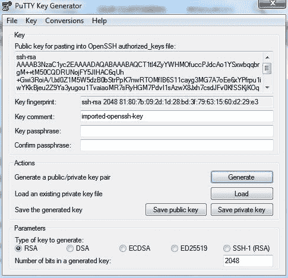

现在，我们可以运行和配置`Putty.exe`，以便使用必要的设置连接到 AWS 云中的 Kali 实例。

在 Putty 的左窗格中的“会话”类别中，输入仪表板中“实例”类别中显示的公共 DNS URL。它应该看起来像屏幕截图中的 URL：


在 Putty 中的主机名区域输入公共 DNS 地址，如屏幕截图中所示：


接下来，向下滚动到 Putty 的左窗格中的**SSH**类别，并单击**Auth**子类别。单击右窗格上的**浏览**按钮，浏览到保存的`.ppk`私钥。

对于用户名，我们将使用**Ec2-user**：


单击“打开”按钮，现在您应该能够登录到云中的 Kali 实例。连接后，请记得更新 Kali。

# 摘要

当查看最新版本的 Kali Linux 中的各种工具时，我们可以看到有各种安全任务的功能。这些包括数字取证、无线安全评估、软件逆向工程、黑客硬件和渗透测试。

还讨论了 Kali Linux 可以部署的各种方式。可以使用光盘、USB 或 SD 卡部署 Kali Linux，将其安装为虚拟机，也可以将其用作独立系统或云中的主操作系统。

与任何其他软件一样，Kali Linux 也需要更新，无论是仅更新软件应用程序还是更新发行版中包含的 Linux 内核。

在下一章中，我们将介绍如何设置我们的渗透测试实验室。

# 问题

1.  Kali Linux 的移动版本的名称是什么？

1.  可以用什么 Windows 工具来验证已下载的 Kali Linux 镜像文件的完整性？

1.  验证已下载的 Kali Linux 镜像文件的 Linux 命令是什么？

1.  可以用什么工具在闪存驱动器或 SD/micro-SD 卡上安装 Kali Linux 和其他 Linux 发行版的名称是什么？

1.  使用 Kali Linux 的各种实时模式是什么？

1.  用于更新 Kali Linux 的命令是什么？

1.  在亚马逊云中安装 Kali Linux 时，哪种通用实例符合免费套餐的使用条件？

# 进一步阅读

有关 Kali Linux 安装的其他信息，请访问：[`docs.kali.org/category/installation`](https://docs.kali.org/category/installation)。 [](https://docs.kali.org/category/installation)

有关在 Windows 上双启动 Kali Linux 的其他信息，请访问：[`docs.kali.org/installation/dual-boot-kali-with-windows`](https://docs.kali.org/installation/dual-boot-kali-with-windows)。
