# 建立您的测试实验室

在这一章中，我们将看看为我们的渗透测试建立实验室环境。在尝试在生产环境中进行测试之前，许多测试应该首先在这个有限的实验室环境中进行。请记住，在进行网络渗透测试的任何阶段时，您必须在实时环境中获得书面许可，并遵守所有当地法律。在开始之前，最好让律师审查任何合同和参与细节，以避免在练习期间或之后可能出现的任何问题。一些保险公司也会为渗透测试人员提供意外损害的保险。

为了避免由于渗透测试而遇到法律问题和不必要的支出，强烈建议您建立一个测试环境，无论是物理的还是虚拟的，以便熟悉测试及其结果，并了解测试对硬件、软件和带宽的影响，因为这些测试对设备和组织都具有破坏性。

我们将详细介绍以下主题：

+   在虚拟机中设置 Windows 环境

+   安装易受攻击的服务器

+   在 Kali Linux 中安装额外的工具

+   Kali Linux 中的网络服务

+   额外的实验室和资源

# 技术要求

+   最低硬件要求：6 GB RAM，四核 2.4 GHz 处理器，500 GB 硬盘

+   VirtualBox：[`www.virtualbox.org/wiki/Downloads`](https://www.virtualbox.org/wiki/Downloads)

+   Metasploitable 2: [`sourceforge.net/projects/metasploitable/files/Metasploitable2/`](https://sourceforge.net/projects/metasploitable/files/Metasploitable2/)

+   Packer：[`www.packer.io/downloads.html`](https://www.packer.io/downloads.html)

+   Vagrant：[`www.vagrantup.com/downloads.html`](https://www.vagrantup.com/downloads.html)

+   Metasploitble 3（300 MB 文件）

+   Metasploitable 3（适用于 VirtualBox 的 6 GB`.ova`文件）：[`mega.nz/#!XQxEAABQ!frdh5DgZE-tSb_1ajPwLZrV4EZuj1lsS3WlWoLPvBjI`](https://mega.nz/#!XQxEAABQ!frdh5DgZE-tSb_1ajPwLZrV4EZuj1lsS3WlWoLPvBjI)

+   BadStore 易受攻击的 Web 服务器：[`d396qusza40orc.cloudfront.net/softwaresec/virtual_machine/BadStore_212.iso`](https://d396qusza40orc.cloudfront.net/softwaresec/virtual_machine/BadStore_212.iso.)

# 物理还是虚拟？

决定是建立物理实验室还是虚拟实验室（或两者兼而有之）取决于您的预算和可用资源。渗透测试可以根据所使用的工具而变得非常昂贵，特别是如果选择商业工具，但考虑到 Kali Linux 中许多可用的开源工具以及 GitHub 和 GitLab 上可用的工具，它并不一定非常昂贵。

作为专业的渗透测试人员，我使用两台物理机器。一台是配备 1 TB 硬盘、16 GB DDR4 RAM、i7 处理器和 NVIDIA GeForce GTX 1050 显卡的笔记本电脑，配备了三台虚拟机，包括主操作系统（Kali Linux 2018.2）。第二台机器是一台较旧的塔式工作站，配备 2 TB 硬盘、24 GB DDR3 RAM 和 Intel Xeon 3500 处理器，带有几个虚拟机，包括作为我的虚拟实验室环境的一部分使用的虚拟机。

在创建实验室环境时，至关重要的是您了解每个操作系统所需的最低和推荐资源，包括主机和所有虚拟机。虽然许多基于 Linux 的操作系统只需要 2 GB 的 RAM，但将超过指定的推荐 RAM 分配给您的工具总是一个明智的选择，以确保您的工具能够运行而不会出现延迟或内存不足的错误。不过，这将取决于您手头的预算或资源。

# 在虚拟机中设置 Windows 环境

对于 Windows 环境测试实验室，我选择安装微软 Windows 10，因为它目前是微软的最新版本。许多拥有更新 PC 和笔记本电脑的用户可能已经在运行 Windows 10，但是为了测试目的，Windows 10 也应该安装为虚拟机，从而保持主机操作系统不受影响。这也建议给那些使用较旧版本 Windows 的读者，以及 Mac 和 Linux 用户，这样他们就能够在实验室环境中使用最新版本的 Windows 进行渗透测试。在现实世界中，我们将看到更少的 Windows 7 机器，因为它的支持已经结束（使这些系统极易受到攻击），尽管也会有一些忠实的用户暂时不愿意升级。

在这次安装中，我们将使用微软网站上直接下载的 Windows 10 企业版评估副本。您可以通过访问[`www.microsoft.com/en-us/evalcenter/evaluate-windows-10-enterprise`](https://www.microsoft.com/en-us/evalcenter/evaluate-windows-10-enterprise)来下载 Windows 10 企业版的评估副本。请记住，除非您有或购买了许可证，否则此版本有 90 天的评估期。

一旦到达下载页面，您应该注意到有两个可用版本，ISO 和**长期服务分支**（**LSTB**）。选择 ISO-企业版，然后点击继续。

填写评估表格的详细信息，然后点击继续。请记住输入的详细信息，因为在安装过程中稍后您将需要通过电话或短信进行身份验证。

选择您的平台（32 位或 64 位）以及您的语言，然后点击下载以继续。

现在您可以开始创建 Windows 10 虚拟机。可以使用 VirtualBox 或 VMware 进行此操作，但在这种情况下，我将使用 VirtualBox。

打开 VirtualBox，然后点击左上角的新建图标。为您的 VM 命名，并根据您之前下载的版本选择适当的版本（32 位或 64 位）。点击下一步继续。

为虚拟机分配可用的 RAM。推荐的内存为 2 GB，但是我分配了略多于 6 GB，因为我的机器上有 24 GB 的 RAM。记得考虑主机的使用情况，以及其他可能同时运行的 VM，比如 Kali Linux：


通过单击立即创建虚拟硬盘，然后单击创建来添加新的虚拟硬盘。

对于硬盘文件类型，选择**VirtualBox 磁盘映像**（**VDI**），然后点击下一步。

在物理磁盘的存储选项下选择动态分配。这个选项通过仅在使用时使用物理磁盘上的空间来节省硬盘空间，而不是创建一个可能不会被使用的固定大小空间。点击下一步继续。

在选择虚拟磁盘大小时，考虑推荐的硬盘空间以及您可能希望在 VM 中安装的应用程序的空间（如 Metasploitable）。在这种情况下，我分配了 64 GB 的硬盘空间。点击创建继续：


此时，我们现在必须将 ISO 映像指向 VM。在 VirtualBox 管理器中，点击您新创建的 Windows 10 VM 实例，然后点击启动箭头。在选择启动磁盘框中，点击文件夹图标，浏览下载的 Windows 10 评估副本。点击开始继续：

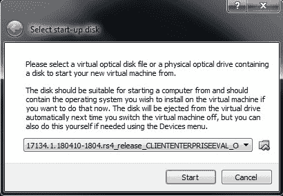

这将带我们到 Windows 设置启动画面。输入您设置的相关信息，然后点击下一步继续。

点击立即安装以开始安装过程。

接受微软的许可条款，然后点击下一步继续。选择自定义安装选项，然后点击新建，然后点击应用以格式化 VM 硬盘：

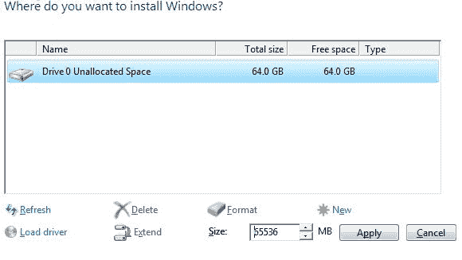

格式化后，确保选择了之前指定大小的分区，然后单击“下一步”继续：


安装过程将开始，并且也需要一些时间来完成。与此同时，您可以查看一些关于渗透测试的其他精彩标题，网址为[`www.packtpub.com/tech/Penetration-Testing`](https://www.packtpub.com/tech/Penetration-Testing)。

安装完成后，如下截图所示，允许操作系统自动重新启动。

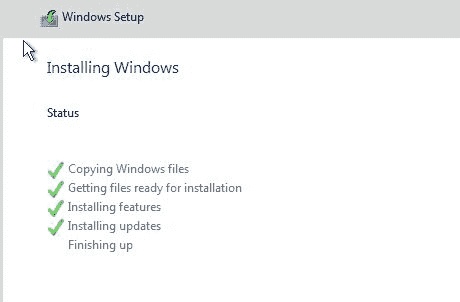

然后，您将被提示选择语言和键盘布局，然后继续设置，在此之后，您将被提示输入工作或学生电子邮件，然后选择隐私设置。

要设置安全登录，点击“设置 PIN”。您可能首先需要通过电话或短信验证您的身份。验证完成后，您将能够设置 PIN。请务必记住此 PIN（至少六位数），因为您将需要使用 PIN 进行登录。

设置完成后，您现在可以配置网络并安装应用程序。在屏幕右下角，您应该看到评估副本的详细信息：


如果需要快速恢复虚拟机到工作状态，您可能需要保存虚拟机状态。

# 安装易受攻击的服务器

在本节中，我们将安装一个易受攻击的虚拟机作为目标虚拟机。在书的几个章节中，我们将使用此目标，解释特定主题。我们选择在我们的机器上设置易受攻击的服务器，而不是使用互联网上可用的易受攻击的服务器的原因是因为我们不希望您违反任何法律。我们应强调，您绝不应在没有书面许可的情况下对其他服务器进行渗透测试。安装另一个虚拟机的另一个目的是以受控的方式提高您的技能。这样，很容易修复问题，并了解在攻击不起作用时目标机器上发生了什么。

在一些国家，甚至对不是您拥有的机器进行端口扫描都可能被视为犯罪行为。此外，如果使用虚拟机的操作系统出现问题，我们可以很容易地修复它。

在接下来的章节中，我们将设置 Metasploitable 2 和 Metasploitable 3 虚拟机作为易受攻击的服务器。Metasploitable 2 较旧，但更容易安装和配置。Metasploitable 3 更新一些漏洞，但安装方式有些不同，对新用户来说有时会有问题。因此，我们为读者提供了 Metasploitable 2 和 3 的选择，尽管我们建议您尝试两者，如果您有可用资源的话。

# 在虚拟机中设置 Metasploitable 2

我们将要使用的易受攻击的虚拟机是 Metasploitable 2。Rapid7 的著名 H.D. Moore 创建了这个易受攻击的系统。

除了 Metasploitable 2 之外，还有其他故意易受攻击的系统，您可以用于渗透测试学习过程，可以在以下网站找到：[`www.vulnhub.com`](https://www.vulnhub.com)。

Metasploitable 2 在操作系统、网络和 Web 应用程序层面有许多漏洞。

有关 Metasploitable 2 中包含的漏洞的信息可以在 Rapid7 网站上找到，网址为[`community.rapid7.com/docs/DOC-1875`](https://community.rapid7.com/docs/DOC-1875)。

要在 VirtualBox 中安装 Metasploitable 2，您可以执行以下步骤：

1.  从[`sourceforge.net/projects/metasploitable/files/Metasploitable2/`](http://sourceforge.net/projects/metasploitable/files/Metasploitable2/)下载 Metasploitable 2 文件。

1.  解压 Metasploitable 2 ZIP 文件。成功完成解压过程后，您将找到五个文件：

```
Metasploitable.nvram 
Metasploitable.vmdk 
Metasploitable.vmsd 
Metasploitable.vmx 
Metasploitable.vmxf 
```

1.  在 VirtualBox 中创建一个新的虚拟机。将名称设置为`Metasploitable2`，操作系统设置为`Linux`，版本设置为`Ubuntu`。

1.  将内存设置为`1024MB`。

1.  在虚拟硬盘设置中，选择使用现有的硬盘。选择我们在上一步中已经提取的`Metasploitable`文件。

1.  将网络设置更改为仅主机适配器，以确保此服务器仅从主机机器和 Kali Linux 虚拟机访问。Kali Linux 虚拟机的网络设置也应设置为仅主机适配器，以便对本地 VM 进行渗透测试。

1.  启动`Metasploitable2`虚拟机。启动过程完成后，你可以使用以下凭据登录`Metasploitable2`控制台：

+   用户名：`msfadmin`

+   密码：`msfadmin`

在你成功登录后，以下是 Metasploitable 2 控制台：

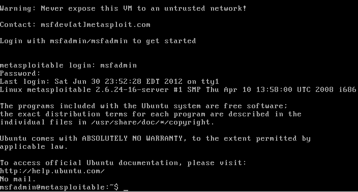

# 在 VM 中设置 Metasploitable 3

由 Rapid7 于 2016 年发布，Metasploitable 3 是最新更新的版本，比其前身具有更多的漏洞。然而，Metasploitable 3 并不是作为可下载的虚拟机提供的，而是需要安装和配置多个组件，用户需要自己构建虚拟机。

在这个例子中，我将在 Windows 10 主机上构建 Metasploitable 3 VM。为此，我们首先需要下载以下内容：

+   VirtualBox 或 VMware（VirtualBox 用户报告了版本 5.2 的问题，但使用版本 5.1.14 则取得了良好的结果，该版本可在 VirtualBox 页面上找到）

+   Packer

+   Vagrant

# 安装 Packer

Hashicorp 的 Packer 用于轻松构建自动化镜像，如 Metasploitable 3。访问[`www.packer.io/downloads.html`](https://www.packer.io/downloads.html)并下载适用于你的操作系统的 Packer 版本。在这个例子中，我下载了 Windows 64 位版本：


下载完成后，提取文件的内容。应该有一个文件，这里是`packer.exe`。

然后，在任何你喜欢的地方创建一个文件夹，并将其命名为 packer。我把它放在了我的系统的`C:`驱动器上：

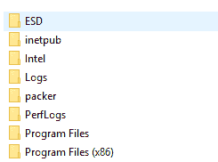

在这一点上，你需要添加此文件夹的路径，以便在命令提示符中调用 Packer 应用程序。只需编辑你的环境变量并将其粘贴到`packer.exe`的路径中。

打开控制面板，点击高级系统设置：

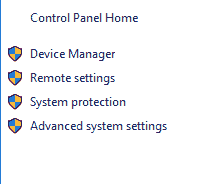

在系统属性窗口中，在高级选项卡下，点击环境变量：

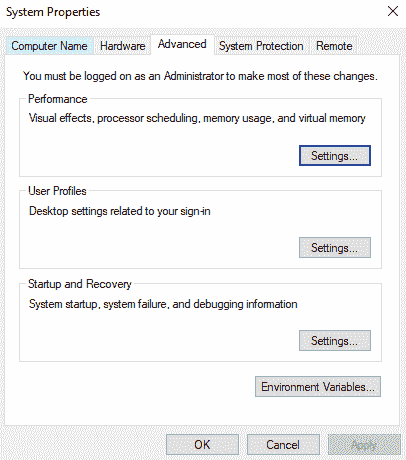

你应该在用户变量中看到路径条目。在系统变量框中，你还应该看到路径变量，其中包含一个条目`C:\Program Files (x86)\Common Files\Oracle|Java\javapath:..`

点击“编辑”按钮继续：

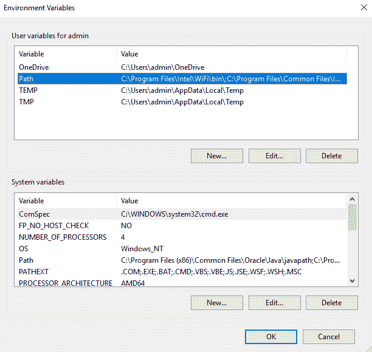

在编辑环境变量中，点击右上角的“新建”按钮，并从主窗口的列表中选择`C:\packer`。然后点击“确定”。

为了测试更改是否成功，启动命令提示符并输入`packer`。如果一切顺利，你应该返回使用参数和可用命令：

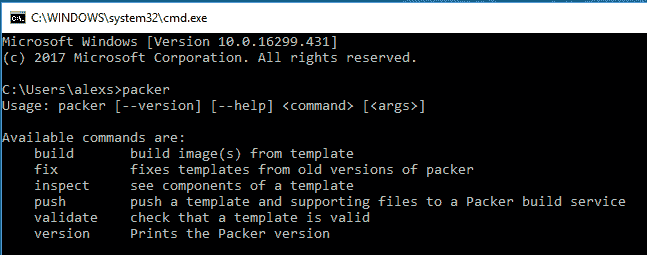

# 安装 Vagrant

Hashicorp 的 Vagrant 也是开源的，用于简化虚拟环境中的工作流程和配置。访问[`www.vagrantup.com/downloads.html`](https://www.vagrantup.com/downloads.html)并下载 Windows 版本。

一旦相关的下载程序安装完成（在这种情况下是 Windows），安装 Vagrant。

假设你已经安装了 VirtualBox，从 GitHub 存储库[`github.com/rapid7/metasploitable3`](https://github.com/rapid7/metasploitable3)下载 Metasploitable 3 源文件：


一旦源文件已下载，将文件提取到您选择的位置。在 Windows 10 中启动 PowerShell，更改目录直到到达包含下载的 Metasploitable 文件的文件夹，并输入`./build_win2008`命令。

这应该足以让您开始构建您的 Metasploit 3 服务器。对于初学者来说，这是一个非常复杂的构建，但绝对值得一试。

# 预构建的 Metasploit 3

对于那些在构建自己的 Metasploitable 3 服务器时遇到困难的人，可以在 GitHub 上找到并下载预构建版本：[`github.com/brimstone/metasploitable3/releases`](https://github.com/brimstone/metasploitable3/releases)。

这个版本的 Metasploitable 3 是由 Brimstone（Matt Robinson）构建的，可以作为`.ova`文件（Metasploitable3-0.1.4.ova）下载，大小仅为 211 MB。下载后，可以通过单击“文件”和“导入虚拟设备”在 VirtualBox 中打开.ova 文件。如果可用，您可能希望将预设的 RAM 量更改为 1 GB 以上。

尽管设置过程很长，但安装程序会自动完成所有操作，并最终为您呈现完整版本的 Metasploitable 3 Windows 2008 服务器。

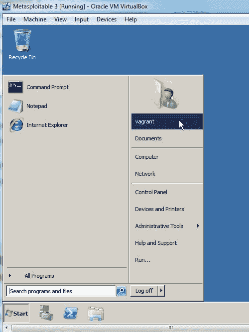

另外，还可以在此处下载另一个完全配置好的预构建 Metasploitable 3 服务器：[`mega.nz/#!XQxEAABQ!frdh5DgZE-tSb_1ajPwLZrV4EZuj1lsS3WlWoLPvBjI`](https://mega.nz/#!XQxEAABQ!frdh5DgZE-tSb_1ajPwLZrV4EZuj1lsS3WlWoLPvBjI)。

# 在 VM 中设置 BadStore

与 Metasploitable 3 相比，BadStore ISO 已经过时；但是，与 Metasploitable 3 不同，它非常容易安装和使用。知识和资源非常有限的读者可以使用此 ISO 镜像作为起点，因为它包含众所周知的漏洞，并且大小不到 15 MB。

截至撰写本书时，BadStore ISO 镜像不再在官方商店中提供，但可以使用几个信誉良好的链接。如 GitHub 文章所述，BadStore ISO 可以从此处下载：[`d396qusza40orc.cloudfront.net/softwaresec/virtual_machine/BadStore_212.iso`](https://d396qusza40orc.cloudfront.net/softwaresec/virtual_machine/BadStore_212.iso)。

BadStore ISO 的手册也应下载，因为它包含有关 IP 连接和操作系统中的漏洞的重要信息。

从上述链接下载文件后，打开 VirtualBox，单击“文件”和“新建”。输入屏幕截图中显示的详细信息。完成后，单击“下一步”：

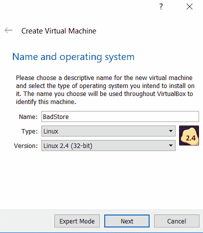

BadStore 使用的 RAM 很少。可以使用默认分配，但我已分配了 640 MB 的 RAM。单击“下一步”继续：

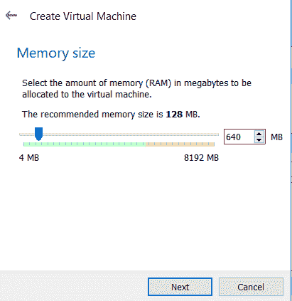

完成以下步骤：

+   单击“现在创建虚拟硬盘”，然后单击“创建”按钮

+   选择**VirtualBox 磁盘映像**（**VDI**）作为硬盘文件类型，然后单击“下一步”

+   在提示选择物理存储选项时选择动态分配，并单击“下一步”

+   对于文件位置和大小，保留默认的 4 GB 文件大小，因为 BadStore 也需要非常少的磁盘空间

在启动 BadStore VM 之前，单击 Oracle VM VirtualBox Manager 中的“设置”按钮。单击左窗格中的“网络”类别，将适配器设置更改为“桥接适配器”，然后单击“确定”。这将使 VM 能够通过 DHCP 接收 IP 地址（如果在您的网络上启用了 DHCP），从而简化后续步骤中的连接过程：


在 Oracle VM VirtualBox Manager 中，单击 BadStore 条目，然后单击“启动”按钮：

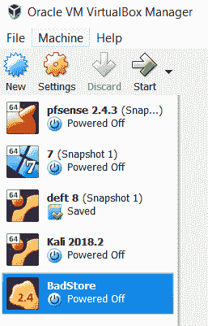

在提示选择启动磁盘时，单击打开文件夹图标，浏览到之前下载的`BadStore.iso`文件。单击“启动”以运行 VM。

加载 BadStore 后，按 Enter 键激活控制台：


按下*Enter*后，输入`ifconfig`命令并按*Enter*查看你的接口配置。请注意，在下面的屏幕截图中，在`eth0`接口中，IP 地址（`inet addr`）设置为`192.168.3.136`。在你的机器上，根据你使用的 IP 方案，它应该是不同的。记下这个 IP，因为连接到 BadStore VM 需要用到它：

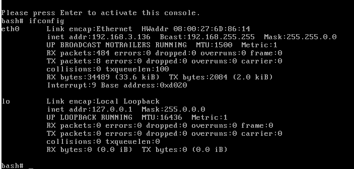

打开你选择的浏览器，在地址栏中输入 BadStore VM 的 IP 地址，然后输入以下语法：`cgi-bin/badstore.cgi`。

在这种情况下，我已经在浏览器的地址栏中输入了以下 URL，以访问 BadStore VM：`http://192.168.3.136/cgi-bin/badstore.cgi`。

一旦你输入了 BadStore VM 的 IP 并附加了前面的路径，按 Enter 键，你将看到 BadStore 前端，就像在这个屏幕截图中看到的那样：

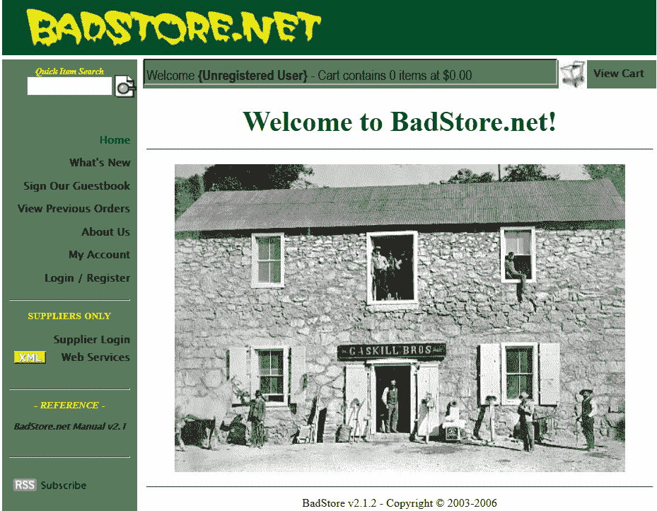

如前所述，BadStore VM 在界面设计上非常古老；然而，对于初学者来说，它包含了 Kali Linux 中在后续章节中介绍的各种常见漏洞，可以很容易地找到并利用。

你可以尝试的另一个类似且易于设置的 VM 是**Damn Vulnerable Linux**（**DVL**）ISO。它可以从以下网址下载：[`sourceforge.net/projects/virtualhacking/files/os/dvl/DVL_1.5_Infectious_Disease.iso/download`](https://sourceforge.net/projects/virtualhacking/files/os/dvl/DVL_1.5_Infectious_Disease.iso/download)。

# 在 Kali Linux 中安装额外的工具

在渗透测试之前或期间，可能需要包含 Kali Linux 中常见的其他工具。渗透测试的艺术有很多人不断创造可以包含的工具。因此，在你的 Kali Linux 设置中安装这些工具可能是必要的。在其他情况下，通常最好在开始任何渗透测试之前确保你的工具是最新的。

在包含额外的渗透测试工具时，建议首先查看 Kali Linux 存储库。如果软件包在那里可用，你可以使用该软件包，并使用下面详细说明的命令进行安装。另一个选择是，如果该工具在存储库中不可用，创建者通常会在他们的网站上或通过软件共享和聚合站点[`github.com/`](https://github.com/)上提供下载选项。

虽然 Kali Linux 存储库外有许多可用工具，但你不应该依赖它们，因为很容易将它们添加到你的 Kali Linux 安装中。此外，许多不在存储库中的软件包有其他软件的依赖关系，可能会导致稳定性问题。

有几种软件包管理工具可用于帮助你管理系统中的软件包，如`dpkg`、`apt`和`aptitude`。Kali Linux 默认安装了`dpkg`和`apt`。

如果你想了解更多关于 apt 和`dpkg`命令的信息，你可以查看以下参考资料：[`help.ubuntu.com/community/AptGet/Howto/`](https://help.ubuntu.com/community/AptGet/Howto/)和[`www.debian.org/doc/manuals/debian-reference/ch02.en.html`](http://www.debian.org/doc/manuals/debian-reference/ch02.en.html)。

在本节中，我们将简要讨论 apt 命令，这与软件包安装过程有关。

要在存储库中搜索软件包名称，你可以使用以下命令：

```
    apt-cache search <package_name>
```

这个命令将显示整个软件包，其名称为`package_name`。要搜索特定软件包，请使用以下命令：

```
    apt-cache search <package_name>
```

如果您已经找到软件包但想要更详细的信息，请使用以下命令：

```
    apt-cache show <package_name>
```

要安装新软件包或更新现有软件包，请使用`apt-get`命令。以下是命令：

```
    apt-get install <package_name>
```

如果软件包在存储库中不可用，您可以从开发者网站或通过[www.github.com](http://www.github.com)搜索并下载。请务必只包括来自可信来源的软件。对于需要 Debian 软件包格式（软件包将具有文件扩展名`.deb`）的开发人员，可以使用`dpkg`命令。对于其他软件包，您通常会发现它们使用诸如 7-Zip 之类的压缩程序进行压缩，并且通常具有扩展名`.zip`或`.tar`。

# Kali Linux 中的网络服务

Kali Linux 中有几种网络服务；在本节中，我们只描述其中一些：HTTP、MySQL 和 SSH 服务。您可以通过导航到 Kali Linux | 系统服务来找到其他服务。

# HTTP

如果您的渗透测试有效，您可能希望有一个 Web 服务器，出于各种原因，例如提供恶意 Web 应用程序脚本。在 Kali Linux 中，已经安装了 Apache Web 服务器；您只需要启动服务。

以下是在 Kali Linux 中激活 HTTP 服务器所需的步骤：

1.  要启动 Apache HTTP 服务，请打开命令行终端并输入以下命令以启动 Apache 服务器：

```
   service apache2 start
```

1.  之后，您可以浏览到`127.0.0.1`的网页；默认情况下，它将显示 It works!页面：


要停止 Apache HTTP 服务，请执行以下步骤：

1.  打开命令行终端并输入以下命令以停止 Apache 服务器：

```
    service apache2 stop
```

请记住，上一个命令不会在启动后生效。启动后，您需要再次输入命令。幸运的是，可以通过提供`update-rc.d apache2 defaults`命令在 Kali Linux 启动后自动启动 Apache HTTP 服务。

1.  该命令将添加`apache2`服务以在启动时启动。

# MySQL

我们将讨论的第二个服务是 MySQL。它是一个关系型数据库系统。MySQL 通常与 PHP 编程语言和 Apache Web 服务器一起使用，以创建动态的基于 Web 的应用程序。对于渗透测试过程，您可以使用 MySQL 来存储您的渗透测试结果，例如漏洞信息和网络映射结果。当然，您需要使用应用程序来存储这些结果。

要在 Kali Linux 中启动 MySQL 服务，可以执行以下步骤：

1.  在终端窗口中，输入以下内容：

```
    service mysql start
```

1.  要测试您的 MySQL 是否已经启动，您可以使用 MySQL 客户端连接到服务器。我们定义用户名（`root`）和密码以登录到 MySQL 服务器：

```
    mysql -u root
```

系统将回复以下内容：

```
    Enter password:
    Welcome to the MySQL monitor. Commands end with ; or g.
    Your MySQL connection id is 39
    Server version: 5.5.44-1 (Debian)
    Copyright (c) 2000, 2015, Oracle and/or its affiliates. All rights reserved.

    Oracle is a registered trademark of Oracle Corporation and/or its
    affiliates. Other names may be trademarks of their respective
    owners.

    Type ''help;'' or ''h'' for help. Type ''c'' to clear the current input statement.
    mysql>

```

1.  在此 MySQL 提示之后，您可以提供任何 SQL 命令。要退出 MySQL，只需输入`quit`。

出于安全原因，默认情况下，Kali Linux 中的 MySQL 服务只能从本地机器访问。您可以通过编辑位于`/etc/mysql/my.cnf`中的 MySQL 配置文件中的 bind-address 段来更改此配置。我们不建议您更改此行为，除非您希望从其他地方访问您的 MySQL。

要停止 MySQL 服务，您可以执行以下步骤：

1.  在终端窗口中，输入以下内容：

```
    service mysql stop
```

1.  要在 Kali Linux 启动后自动启动 MySQL 服务，可以使用以下命令：

```
    update-rc.d mysql defaults
```

此命令将使 MySQL 服务在启动后启动。

# SSH

在下一个服务中，我们将研究**安全外壳**（**SSH**）。SSH 可用于安全地登录到远程计算机；除此之外，SSH 还有其他几种用途，如在两台计算机之间安全传输文件，执行远程计算机中的命令以及 X11 会话转发。

要在 Kali Linux 中管理您的 SSH 服务，请执行以下步骤：

1.  要从命令行启动 SSHD 服务，请输入以下内容：

```
    service ssh start
```

1.  要测试您的 SSH，您可以使用 SSH 客户端（如 Putty ([`www.chiark.greenend.org.uk/~sgtatham/putty/`](http://www.chiark.greenend.org.uk/~sgtatham/putty/)））从另一台服务器登录到 Kali Linux 服务器，如果您使用的是 Microsoft Windows 操作系统。

1.  要停止 SSHD 服务，请从命令行输入以下内容：

```
    service ssh stop
```

1.  要在 Kali Linux 启动后自动启动 SSH 服务，可以使用以下命令：

```
    update-rc.d ssh defaults
```

此命令将添加 SSH 服务以在启动时启动。

# 其他实验室和资源

虽然我们的主要重点是 Windows 10、Metasploitable 2 和 Metasploitable 3，但还有其他几个类似的项目可用于探索漏洞并测试您的技能。经验丰富的安全专家和渗透测试人员可能还记得一个名为 BadStore 的微小易受攻击的 Web 服务器。这个易受攻击的服务器不超过 15MB（是的，兆字节），包含了从跨站脚本到 SQL 注入的几个漏洞。虽然官方网站上不再提供直接下载，但仍然可以在网络上找到。

[`www.vulnhub.com/`](https://www.vulnhub.com/) 正是其域名所指示的：一个漏洞项目的中心。该网站列出了几个易受攻击的虚拟机供下载，可用于练习和**夺旗赛**（**CTF**）场景和比赛，包括 Damn Vulnerable Linux，Kioptrix 等。

还有一些网站专门为那些有兴趣在受控环境中练习技能或学习的人而存在：

+   **战争游戏**：位于[`overthewire.org/wargames/`](http://overthewire.org/wargames/)，有基本到高级级别，可免费练习：

********

+   **Hack this site**：[Hackthissite.org](http://www.hackthissite.org)也有许多挑战（左下角），并为初学者和程序员提供任务。这些挑战是免费的，但需要注册：


+   **Hellbound Hackers**：与 Hack This Site 一样，Hellbound Hackers ([`www.hellboundhackers.org/`](https://www.hellboundhackers.org/))也提供许多免费挑战，包括渗透测试挑战。还需要注册才能访问这些挑战：

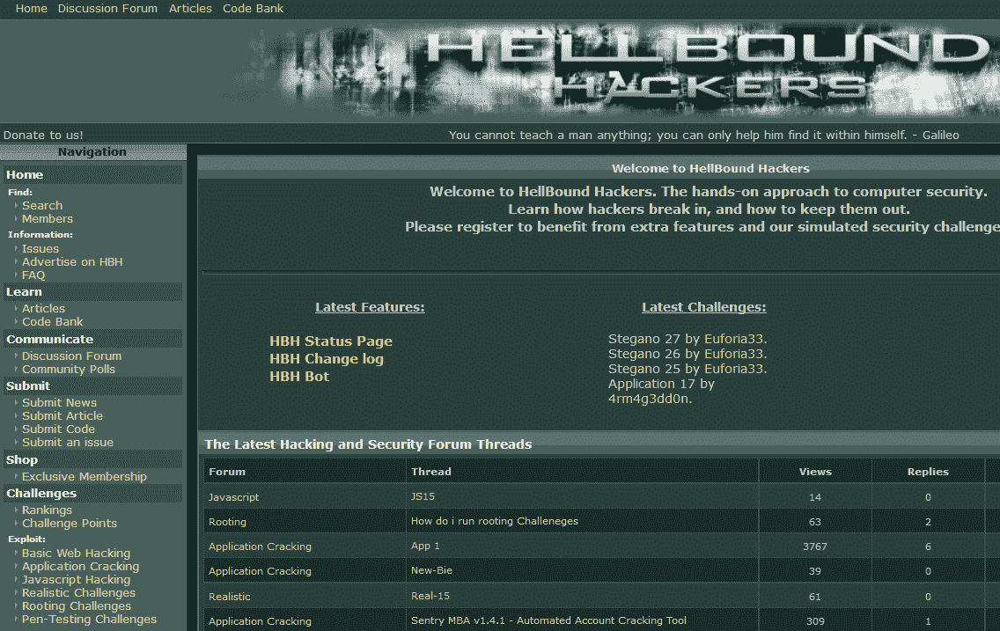

# 总结

在本章中，我们讨论了为渗透测试创建实验室环境。正如所解释的，您的实验室设置将完全取决于您可用的资源，如 CPU、RAM 和 HDD 空间。最好尝试尽可能多地使用不同的操作系统，包括 Windows、Linux、Mac、Android，甚至 ARM 操作系统（可在[`www.vulnhub.com/`](https://www.vulnhub.com/)上找到），以便在一个受控环境中获得一些经验，您可以在其中合法地进行测试。

如果使用 Metasploitable 服务器，我们建议初学者，包括时间有限的专业人士，使用 Metasploitable 2 OS，因为 Metasploitable 3 OS 的设置非常复杂——构建可以针对特定的主机操作系统。

资源有限的用户也可以使用较小的易受攻击的操作系统，如 BadStore 和 DVL，这些操作系统与 Metasploitable 2 一样，以 ISO 格式提供，并且只需进行少量设置即可安装。

建议您的实验室至少有一个 Windows 和一个 Linux 操作系统用于测试和学习。接下来，我们将看看渗透测试可用的各种方法。

# 问题

让我们尝试根据你从本章中获取的知识来回答一些问题：

1.  有哪两个虚拟化平台可以用来创建和托管虚拟机？

1.  `.vmdk`代表什么？

1.  Metasploitable 2 的默认登录凭据是什么？

1.  如果从头开始构建 Metasploitable 3 服务器，还需要哪些额外的软件？

1.  在 Kali Linux 中用于安装新软件包或更新现有软件包的命令是什么？

1.  用于启动 MySQL 服务的命令是什么？

1.  用于启动 SSH 服务的命令是什么？

# 进一步阅读

+   **安装 Metasploitable 2**：[`metasploit.help.rapid7.com/docs/metasploitable-2`](https://metasploit.help.rapid7.com/docs/metasploitable-2)

+   **构建 Metasploitable 3**：[`github.com/rapid7/metasploitable3`](https://github.com/rapid7/metasploitable3)

+   **完整的 Metasploitable 3 下载（6 GB 文件）**：[`mega.nz/#!XQxEAABQ!frdh5DgZE-tSb_1ajPwLZrV4EZuj1lsS3WlWoLPvBjI`](https://mega.nz/#!XQxEAABQ!frdh5DgZE-tSb_1ajPwLZrV4EZuj1lsS3WlWoLPvBjI)
