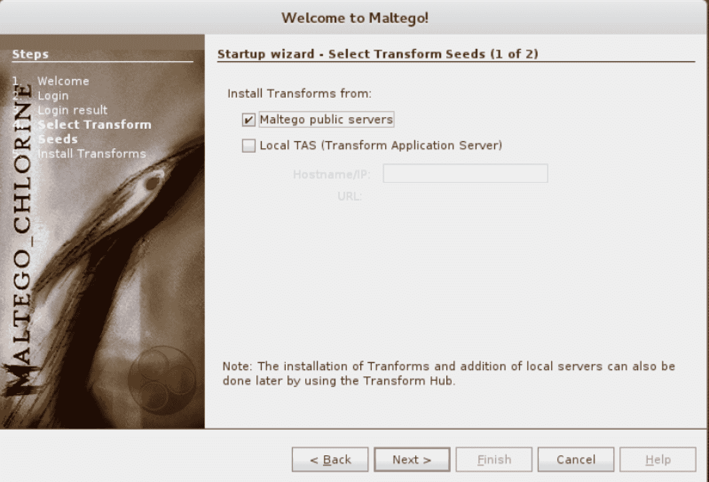
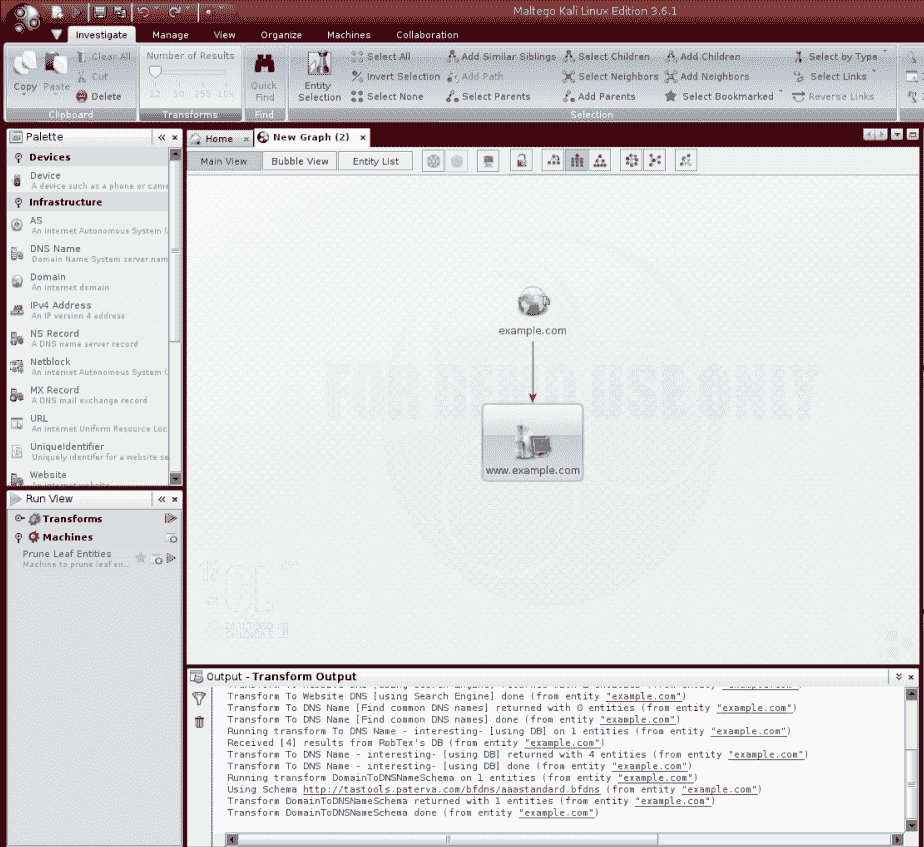
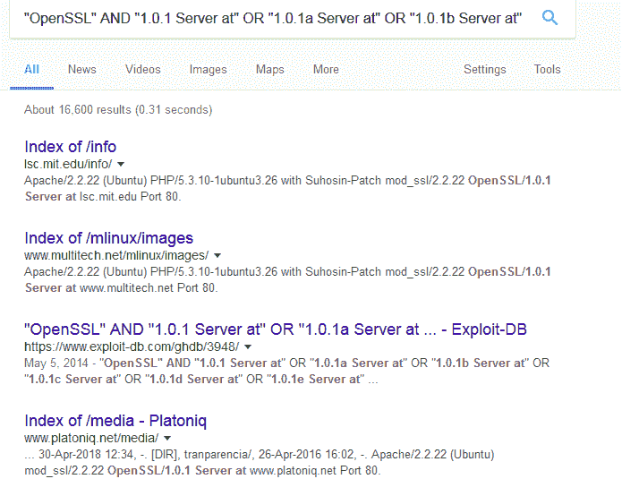
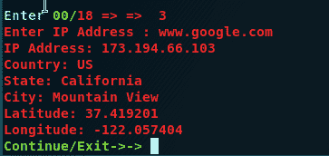
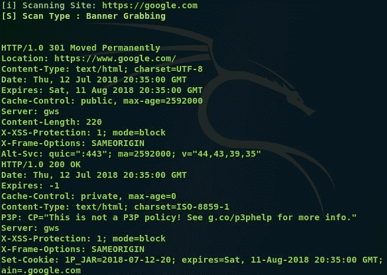
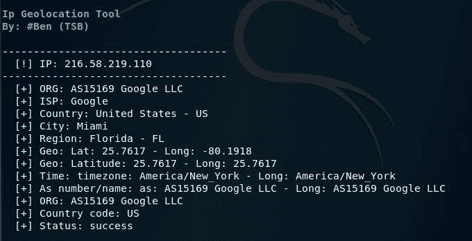

# 足迹和信息收集

在本章中，我们将讨论渗透测试的信息收集阶段。我们将描述信息收集的定义和目的。我们还将描述 Kali Linux 中可以用于信息收集的几种工具。阅读完本章后，我们希望读者能更好地理解信息收集阶段，并能够在渗透测试期间进行信息收集。

信息收集是我们渗透测试过程（Kali Linux 测试过程）中的第二阶段，如第三章中的 Kali Linux 测试方法论部分所述，*渗透测试方法论*。在这个阶段，我们试图收集尽可能多的关于目标的信息，例如**域名系统**（**DNS**）主机名、IP 地址、使用的技术和配置、用户名的组织、文档、应用程序代码、密码重置信息、联系信息等等。在信息收集期间，收集到的每一条信息都被认为是重要的。

根据使用的方法，信息收集可以分为两种方式：主动信息收集和被动信息收集。在主动信息收集方法中，我们通过向目标网络引入网络流量来收集信息，而在被动信息收集方法中，我们通过利用第三方服务（如谷歌搜索引擎）来收集有关目标网络的信息。我们将在后面进行介绍。

请记住，这两种方法都没有比另一种更好；每种方法都有其自身的优势。在被动扫描中，您收集的信息较少，但您的行动将是隐秘的，而在主动扫描中，您可以获得更多信息，但某些设备可能会察觉到您的行动。在渗透测试项目中，这个阶段可能会多次进行，以确保收集到的信息完整。您还可以与您的渗透测试客户讨论他们想要哪种方法。

在本章中，我们将利用被动和主动的信息收集方法来更好地了解目标。

在本章中，我们将讨论以下主题：

+   可用于收集有关目标域的信息的公共网站

+   域名注册信息

+   DNS 分析

+   路线信息

+   搜索引擎利用

# 开源情报

与信息收集经常相关的一个关键术语是**开源情报**（**OSINT**）。军事和情报组织将他们的情报来源分为各种类型。真正的间谍活动，涉及间谍之间的互动，通常被称为**人类情报**（**HUMINT**）。以破解加密为目的捕获无线电信号被称为**信号情报**（**SIGINT**）。虽然渗透测试人员不太可能与这两者中的任何一种进行接触，但信息收集阶段是 OSINT。OSINT 是从没有安全控制阻止其披露的来源获取的信息。它们通常是公共记录或目标组织作为其日常运营的一部分分享的信息。

对于渗透测试人员来说，要利用这些信息，他们需要特定的知识和工具来找到这些信息。信息收集阶段在很大程度上依赖于这些信息。此外，简单地向组织展示他们泄露的 OSINT 信息可能会让他们了解到需要增加安全性的领域。正如我们将在本章中看到的，对于那些知道在哪里寻找的人来说，有大量信息是可见的。

# 使用公共资源

在互联网上，有几个可以用于收集有关目标域的信息的公共资源。使用这些资源的好处是，您的网络流量不会直接发送到目标域，因此您的活动不会记录在目标域日志文件中。

以下是可以使用的资源：

| No. | 资源 URL | 描述 |
| --- | --- | --- |
| 1 | [`www.archive.org`](http://www.archive.org) | 这包含网站的存档。 |
| 2 | [`www.domaintools.com/`](http://www.domaintools.com/) | 这包含域名情报。 |
| 3 | [`www.alexa.com/`](http://www.alexa.com/) | 这包含有关网站的信息数据库。 |
| 4 | [`serversniff.net/`](http://serversniff.net/) | 这是用于网络、服务器检查和路由的免费**瑞士军刀**。 |
| 5 | [`centralops.net/`](http://centralops.net/) | 这包含免费的在线网络实用工具，如域名、电子邮件、浏览器、ping、traceroute 和 Whois。 |
| 6 | [`www.robtex.com`](http://www.robtex.com) | 这允许您搜索域和网络信息。 |
| 7 | [`www.pipl.com/`](http://www.pipl.com/) | 这允许您通过他们的名字、姓氏、城市、州和国家在互联网上搜索人。 |
| 8 | [`wink.com/`](http://wink.com/) | 这是一个免费的搜索引擎，允许您通过姓名、电话号码、电子邮件、网站、照片等查找人。 |
| 9 | [`www.isearch.com/`](http://www.isearch.com/) | 这是一个免费的搜索引擎，允许您通过姓名、电话号码和电子邮件地址查找人。 |
| 10 | [`www.tineye.com`](http://www.tineye.com) | TinEye 是一个反向图像搜索引擎。我们可以使用 TinEye 找出图像来自何处，如何使用它，是否存在修改版本的图像，或者找到更高分辨率的版本。 |
| 11 | [`www.sec.gov/edgar.shtml`](http://www.sec.gov/edgar.shtml) | 这可用于搜索证券交易委员会中公开上市公司的信息。 |

由于易于使用——您只需要互联网连接和网络浏览器——我们建议您在使用 Kali Linux 提供的工具之前首先使用这些公共资源。

为了保护域名不被滥用，我们已经更改了我们在示例中使用的域名。我们将使用一些域名，例如来自 IANA 的`example.com`和免费的黑客测试网站[`www.hackthissite.org/`](https://www.hackthissite.org/)，以进行说明。

# 查询域名注册信息

在了解目标域名后，您首先要做的是查询`Whois`数据库有关该域名的信息，以查找域名注册信息。`Whois`数据库将提供有关域名的 DNS 服务器和联系信息的信息。

`Whois`是一种用于搜索互联网注册、已注册域名、IP 和自治系统的协议。该协议在 RFC 3912 中指定（[`www.ietf.org/rfc/rfc3912.txt`](https://www.ietf.org/rfc/rfc3912.txt)）。

默认情况下，Kali Linux 已经配备了`whois`客户端。要查找域的`Whois`信息，只需输入以下命令：

```
    # whois example.com

```

以下是`Whois`信息的结果：

```
    Domain Name: EXAMPLE.COM
       Registrar: RESERVED-INTERNET ASSIGNED NUMBERS AUTHORITY
    Sponsoring Registrar IANA ID: 376
       Whois Server: whois.iana.org
       Referral URL: http://res-dom.iana.org
       Name Server: A.IANA-SERVERS.NET
       Name Server: B.IANA-SERVERS.NET
       Updated Date: 14-aug-2015
       Creation Date: 14-aug-1995
       Expiration Date: 13-aug-2016
    >>> Last update of whois database: Wed, 03 Feb 2016 01:29:37 GMT <<<

```

从前面的`Whois`结果中，我们可以获得域名的 DNS 服务器和联系人的信息。这些信息将在渗透测试的后期阶段非常有用。

除了使用命令行`Whois`客户端，`Whois`信息也可以通过以下网站收集，这些网站提供了`whois`客户端：

+   [www.whois.net](http://www.whois.net)

+   [www.internic.net/whois.html](http://www.internic.net/whois.html)

您还可以转到相应域名的顶级域名注册商：

+   **美国**：[www.arin.net/whois/](http://www.arin.net/whois/)

+   **欧洲**：[www.db.ripe.net/whois](http://www.db.ripe.net/whois)

+   **亚太地区**：[www.apnic.net/apnic-info/whois_search2](http://www.apnic.net/apnic-info/whois_search2)

注意：要使用顶级域名注册商的`whois`，域名需要通过其自己的系统注册。例如，如果您使用`ARIN WHOIS`，它只在`ARIN WHOIS`数据库中搜索，而不会在`RIPE`和`APNIC Whois`数据库中搜索。

从`Whois`数据库获取信息后，接下来我们想收集有关目标域的 DNS 条目的信息。

# 分析 DNS 记录

使用 DNS 记录类别中的工具的目标是收集有关目标域的 DNS 服务器和相应记录的信息。

以下是几种常见的 DNS 记录类型：

| No. | 记录类型 | 描述 |
| --- | --- | --- |
| 1 | SOA | 这是权威记录的开始。 |
| 2 | NS | 这是名称服务器记录。 |
| 3 | A | 这是 IPv4 地址记录。 |
| 4 | MX | 这是邮件交换记录。 |
| 5 | PTR | 这是指针记录。 |
| 6 | AAAA | 这是 IPv6 地址记录。 |
| 7 | CNAME | 这是规范名称的缩写。它用作另一个规范域名的别名。 |

例如，在渗透测试中，客户可能会要求您查找其域名下所有可用的主机和 IP 地址。您唯一拥有的信息是组织的域名。我们将看一些常见的工具，如果您遇到这种情况，可以帮助您。

# 主机

在获取 DNS 服务器信息之后，下一步是查找主机名的 IP 地址。为了帮助我们解决这个问题，我们可以使用以下主机命令行工具来从 DNS 服务器查找主机的 IP 地址：

```
    # host hackthissite.org 
```

默认情况下，`host`命令将查找域的`A`、`AAAA`和`MX`记录。要查询任何记录，只需将`-a`选项提供给命令：

```
    # host -a hackthissite.org
    Trying "hackthissite.org"
    ;; ->>HEADER<<- opcode: QUERY, status: NOERROR, id: 32115
    ;; flags: qr rd ra; QUERY: 1, ANSWER: 12, AUTHORITY: 0, ADDITIONAL: 0
    ;; QUESTION SECTION:
    ;hackthissite.org.    IN  ANY
    ;; ANSWER SECTION:
    hackthissite.org.  5  IN  A  198.148.81.135
    hackthissite.org.  5  IN  A  198.148.81.139
    hackthissite.org.  5  IN  A  198.148.81.137
    hackthissite.org.  5  IN  A  198.148.81.136
    hackthissite.org.  5  IN  A  198.148.81.138
    hackthissite.org.  5  IN  NS  ns1.hackthissite.org.
    hackthissite.org.  5  IN  NS  c.ns.buddyns.com.
    hackthissite.org.  5  IN  NS  f.ns.buddyns.com.
    hackthissite.org.  5  IN  NS  e.ns.buddyns.com.
    hackthissite.org.  5  IN  NS  ns2.hackthissite.org.
    hackthissite.org.  5  IN  NS  b.ns.buddyns.com.
    hackthissite.org.  5  IN  NS  d.ns.buddyns.com.
    Received 244 bytes from 172.16.43.2#53 in 34 ms  
```

`host`命令通过查询 Kali Linux 系统的`/etc/resolv.conf`文件中列出的 DNS 服务器来查找这些记录。如果要使用其他 DNS 服务器，只需将 DNS 服务器地址提供为最后一个命令行选项。

如果您将域名作为`host`命令行选项，该方法称为正向查找，但如果您将 IP 地址作为`host`命令的命令行选项，则该方法称为反向查找。

尝试对以下 IP 地址进行反向查找：

```
    host 23.23.144.81 
```

您可以从这个命令中获得什么信息？

`host`工具也可以用于进行 DNS 区域传输。通过这种机制，我们可以收集有关域中可用主机名的信息。

DNS 区域传输是一种机制，用于将主 DNS 服务器上的 DNS 数据库复制到另一个 DNS 服务器，通常称为从属 DNS 服务器。如果没有这种机制，管理员必须单独更新每个 DNS 服务器。必须向域的权威 DNS 服务器发出 DNS 区域传输查询。

由于 DNS 区域传输可以收集的信息的性质，现在很少能找到允许向任意区域传输请求的 DNS 服务器。

如果您找到一个允许区域传输而不限制谁能够执行它的 DNS 服务器，这意味着 DNS 服务器配置不正确。

# dig

除了`host`命令，您还可以使用`dig`命令进行 DNS 查询。与`host`相比，`dig`的优势在于其灵活性和输出的清晰度。使用`dig`，您可以要求系统从文件中处理一系列查找请求。

让我们使用`dig`来查询[`hackthissite.org`](http://hackthissite.org)域。

除了域名之外，如果没有提供任何选项，`dig`命令将只返回域的 A 记录。要请求任何其他 DNS 记录类型，可以在命令行中提供类型选项：

```
    # dig hackthissite.org
    ; <<>> DiG 9.9.5-9+deb8u5-Debian <<>> hackthissite.org
    ;; global options: +cmd
    ;; Got answer:
    ;; ->>HEADER<<- opcode: QUERY, status: NOERROR, id: 44321
    ;; flags: qr rd ra; QUERY: 1, ANSWER: 5, AUTHORITY: 0, ADDITIONAL: 1
    ;; OPT PSEUDOSECTION:
    ; EDNS: version: 0, flags:; MBZ: 0005 , udp: 4096
    ;; QUESTION SECTION:
    ;hackthissite.org.    IN  A
    ;; ANSWER SECTION:
    hackthissite.org.  5  IN  A  198.148.81.139
    hackthissite.org.  5  IN  A  198.148.81.137
    hackthissite.org.  5  IN  A  198.148.81.138
    hackthissite.org.  5  IN  A  198.148.81.135
    hackthissite.org.  5  IN  A  198.148.81.136
    ;; Query time: 80 msec
    ;; SERVER: 172.16.43.2#53(172.16.43.2)
    ;; WHEN: Tue Feb 02 18:16:06 PST 2016
    ;; MSG SIZE  rcvd: 125

```

从结果中，我们可以看到`dig`输出现在返回了`A`的 DNS 记录。

# DMitry

**Deepmagic 信息收集工具**（**DMitry**）是一款多合一信息收集工具。它可用于收集以下信息：

+   使用 IP 地址或域名查询主机的`Whois`记录

+   从[`www.netcraft.com/`](https://www.netcraft.com/)获取主机信息

+   目标域中的子域

+   目标域的电子邮件地址

+   在目标机器上执行端口扫描，打开、过滤或关闭端口列表

尽管可以使用几个 Kali Linux 工具获取这些信息，但使用单个工具收集所有信息并将报告保存到一个文件非常方便。

我们认为这个工具更适合归类为 DNS 分析，而不是*路由分析*部分，因为其功能更多地涉及 DNS 分析而不是路由分析。

要从 Kali Linux 菜单访问`DMitry`，请导航到应用程序|信息收集|dmitry，或者您可以使用控制台并输入以下命令：

```
    # dmitry
```

例如，让我们对目标主机执行以下操作：

+   执行`Whois`查找

+   从[`www.netcraft.com/`](https://www.netcraft.com/)获取信息

+   搜索所有可能的子域

+   搜索所有可能的电子邮件地址

执行上述操作的命令如下：

```
    # dmitry -iwnse hackthissite.org 
```

前述命令的结果摘要如下：

```
    Deepmagic Information Gathering Tool
    "There be some deep magic going on"
    HostIP:198.148.81.138
    HostName:hackthissite.org
    Gathered Inet-whois information for 198.148.81.138
    ---------------------------------
    inetnum:        198.147.161.0 - 198.148.176.255
    netname:        NON-RIPE-NCC-MANAGED-ADDRESS-BLOCK
    descr:          IPv4 address block not managed by the RIPE NCC

    remarks:        http://www.iana.org/assignments/ipv4-recovered-address-space/ipv4-recovered-address-space.xhtml
    remarks:
    remarks:        -----------------------------------------------------
    country:        EU # Country is really world wide
    admin-c:        IANA1-RIPE
    tech-c:         IANA1-RIPE
    status:         ALLOCATED UNSPECIFIED
    mnt-by:         RIPE-NCC-HM-MNT
    mnt-lower:      RIPE-NCC-HM-MNT
    mnt-routes:     RIPE-NCC-RPSL-MNT
    created:        2011-07-11T12:36:59Z
    last-modified:  2015-10-29T15:18:41Z
    source:         RIPE
    role:           Internet Assigned Numbers Authority
    address:        see http://www.iana.org.
    admin-c:        IANA1-RIPE
    tech-c:         IANA1-RIPE
    nic-hdl:        IANA1-RIPE
    remarks:        For more information on IANA services
    remarks:        go to IANA web site at http://www.iana.org.
    mnt-by:         RIPE-NCC-MNT
    created:        1970-01-01T00:00:00Z
    last-modified:  2001-09-22T09:31:27Z
    source:         RIPE # Filtered
    % This query was served by the RIPE Database Query Service version 1.85.1 (DB-2)

```

我们还可以使用`dmitry`通过提供以下命令执行简单的端口扫描：

```
    # dmitry -p hackthissite.org -f -b
```

前述命令的结果如下：

```
    Deepmagic Information Gathering Tool
    "There be some deep magic going on"
    HostIP:198.148.81.135
    HostName:hackthissite.org
    Gathered TCP Port information for 198.148.81.135
    ---------------------------------
     Port    State
    ...
    14/tcp    filtered
    15/tcp    filtered
    16/tcp    filtered
    17/tcp    filtered
    18/tcp    filtered
    19/tcp    filtered
    20/tcp    filtered
    21/tcp    filtered
    22/tcp    open
    >> SSH-2.0-OpenSSH_5.8p1_hpn13v10 FreeBSD-20110102
    23/tcp    filtered
    24/tcp    filtered
    25/tcp    filtered
    26/tcp    filtered
    ...
    79/tcp    filtered
    80/tcp    open
    Portscan Finished: Scanned 150 ports, 69 ports were in state closed
    All scans completed, exiting

```

从前述命令中，我们发现目标主机正在使用设备进行数据包过滤。它只允许端口`22`用于 SSH 的传入连接和端口`80`，这通常用于 Web 服务器。有趣的是，SSH 安装的类型被指出，允许进一步研究对 OpenSSH 安装的可能漏洞。

# Maltego

Maltego 是一款开源情报和取证应用程序。它允许您挖掘和收集信息，并以有意义的方式表示信息。Maltego 中的开源短语意味着它从开源资源中收集信息。在收集信息后，Maltego 允许您确定所收集信息之间的关键关系。

Maltego 是一种可以以图形方式显示数据之间联系的工具，因此将更容易看到信息之间的共同点。

Maltego 允许您枚举以下互联网基础设施信息：

+   域名

+   DNS 名称

+   `Whois`信息

+   网络块

+   IP 地址

它还可以用于收集有关人的以下信息：

+   与该人相关的公司和组织

+   与该人相关的电子邮件地址

+   与该人相关的网站

+   与该人相关的社交网络

+   与该人相关的电话号码

+   社交媒体信息

Kali Linux 默认配备了 Maltego 3.6.1 Kali Linux 版。社区版的限制如下：

+   不得用于商业用途

+   每个变换最多 12 个结果

+   您需要在我们的网站上注册才能使用客户端

+   API 密钥每隔几天就会过期

+   在与所有社区用户共享的（较慢的）服务器上运行

+   客户端和服务器之间的通信未加密

+   直到下一个主要版本才会更新

+   没有最终用户支持

+   服务器端的变换不会更新

Maltego 中有 70 多种变换可用。变换一词指的是 Maltego 的信息收集阶段。一个变换意味着 Maltego 只会执行一个信息收集阶段。

要从 Kali Linux 菜单访问 Maltego，请导航到应用程序|信息收集|Maltego。桌面上也有一个启动图标，或者您可以使用控制台并输入以下命令：

```
    # maltego
```

您将看到 Maltego 欢迎屏幕。几秒钟后，您将看到以下 Maltego 启动向导，它将帮助您首次设置 Maltego 客户端。

单击“下一步”继续到下一个窗口，并输入您的登录详细信息。（如果您没有登录详细信息，请单击此处注册以创建帐户。）

登录后，输入您的个人详细信息（姓名和电子邮件地址）。

然后，您需要选择转换种子，如下图所示：



Maltego 客户端将连接到 Maltego 服务器以获取转换。如果 Maltego 已成功初始化，您将看到以下截图：


这意味着您的 Maltego 客户端初始化已成功完成。现在您可以使用 Maltego 客户端了。

在使用 Maltego 客户端之前，让我们先看一下 Maltego 界面：


Maltego 界面

在前面截图的左上方，您将看到 Palette 窗口。在**Palette**窗口中，您可以选择要收集信息的实体类型。Maltego 将实体分为六组，如下所示：

+   **设备**，如手机或相机

+   **基础设施**，如 AS、DNS 名称、域、IPv4 地址、MX 记录、NS 记录、网络块、URL 和网站

+   地球上的**位置**

+   **渗透测试**

+   个人信息，如别名、文件、电子邮件地址、图像、人员、电话号码和短语

+   社交网络，如 Facebook 对象、Twitter 实体、Facebook 从属关系和 Twitter 从属关系

在前面截图的中上部，您将看到不同的视图：

+   主视图

+   气泡视图

+   实体列表

视图用于提取大型图中不明显的信息，分析师无法通过手动检查数据来清晰地看到关系。主视图是您大部分时间工作的地方。在气泡视图中，节点显示为气泡，而在实体列表选项卡中，节点以纯文本格式列出。

在视图旁边，您将看到不同的布局算法。Maltego 支持以下四种布局算法：

+   块布局：这是默认布局，在挖掘过程中使用。

+   层次布局：层次布局与根和后续主机分支一起工作。这提供了一个分支结构，以便可视化父/子关系。

+   中心布局：中心布局获取最中心的节点，然后以图形方式表示节点周围的传入链接。在检查与一个中心节点相连的多个节点时，这是很有用的。

+   有机布局：有机布局以最小化距离的方式显示节点，使查看者能够更好地了解节点及其关系的整体情况。

对 Maltego 客户端用户界面进行简要描述后，现在是行动的时候了。

假设您想收集有关域的信息。我们将使用`example.com`域作为示例。我们将在以下部分中探讨如何做到这一点：

1.  创建一个新图形（*Ctrl* + *T*）并转到 Palette 选项卡。

1.  选择基础设施，然后单击域。

1.  将其拖到主窗口。如果成功，您将在主窗口中看到一个名为`paterva.com`的域。

1.  双击名称并将其更改为您的目标域，例如`example.com`，如下图所示：


Maltego Kali Linux

1.  如果您右键单击“域”名称，您将看到可以对域名执行的所有转换：

+   来自域的 DNS

+   域所有者的详细信息

+   来自域的电子邮件地址

+   来自域的文件和文档

+   其他转换，如转换为个人、电话号码和网站

+   所有转换

1.  让我们从域转换中选择 DomainToDNSNameSchema（运行转换|其他转换|DomainToDNSNameSchema）。以下截图显示了结果：



Maltego Kali Linux

在域转换的 DNS 之后，我们得到了与`example.com`域相关的网站地址（[www.example.com](http://www.example.com)）的信息。

您可以对目标域运行其他转换。

如果要更改域，需要先保存当前图。要保存图，请按照以下步骤操作：

1.  单击 Maltego 图标，然后选择保存。

1.  图将以 Maltego 图文件格式（`.mtgx`）保存。要更改域，只需双击现有域并更改域名。

接下来，我们将描述几种可用于获取路由信息的工具。

# 获取网络路由信息

网络路由信息对于渗透测试人员有多种用途。首先，他们可以识别渗透测试人员的机器和目标之间的不同设备。渗透测试人员还可以获取有关网络操作方式以及流量在目标和测试人员机器之间的路由方式的信息。最后，渗透测试人员还可以确定是否有中间障碍物，如防火墙或代理服务器，位于测试人员和目标之间。

Kali Linux 有许多提供网络路由信息的工具。

# tcptraceroute

在 Linux 发行版中找到的`traceroute`命令的补充是`tcptraceroute`工具。普通的`traceroute`命令向目标主机发送 UDP 或 ICMP 回显请求数据包，**生存时间**（**TTL**）设置为一。该 TTL 每到达一个主机就增加一，直到数据包到达目标主机。`traceroute`和`tcptraceroute`工具之间的主要区别在于`tcptraceroute`工具使用 TCP SYN 数据包到目标主机。

使用`tcptraceroute`的主要优势在于当您有可能在测试机器和目标之间遇到防火墙时。防火墙通常配置为过滤与`traceroute`命令相关的 ICMP 和 UDP 流量。因此，`traceroute`信息对您将没有用处。使用`tcptraceroute`可以使用特定端口上的 TCP 连接，防火墙将允许您通过，从而允许您枚举通过防火墙的网络路由路径。

`tcptraceroute`命令利用 TCP 三次握手来确定防火墙是否允许通过。如果端口打开，您将收到一个 SYN/ACK 数据包。如果端口关闭，您将收到一个 RST 数据包。要启动`tcptraceroute`，在命令行中输入以下内容：

```
    # tcptraceroute
```

该命令将显示与该命令相关的不同功能。

最简单的用法是针对一个域运行该命令。在本演示中，我们将运行`traceroute`命令以跟踪到达域`example.com`的网络路由：

```
    # traceroute www.example.com  
```

`traceroute`的已编辑输出如下：

```
    traceroute to www.example.com (192.168.10.100), 30 hops max, 40 byte packets
     1  192.168.1.1 (192.168.1.1)  8.382 ms  12.681 ms  24.169 ms
     2  1.static.192.168.xx.xx.isp (192.168.2.1)  47.276 ms  61.215 ms  61.057 ms
     3  * * *
     4  74.subnet192.168.xx.xx.isp (192.168.4.1)  68.794 ms  76.895 ms  94.154 ms
     5  isp2 (192.168.5.1)  122.919 ms  124.968 ms  132.380 ms
    ...
    15  * * *
    ...
    30  * * *

```

如您所见，有几个步骤被指示，其他步骤显示为`***`。如果我们查看输出，到第 15 跳，我们看到没有可用的信息。这表明测试机器和主机之间有一个过滤设备，即`example.com`域。

为了对抗这种过滤，我们将尝试使用`tcptraceroute`命令确定路由。由于我们知道`example.com`有一个 Web 服务器，我们将设置命令尝试 TCP 端口`80`，即 HTTP 端口。以下是命令：

```
    # tcptraceroute www.example.com  
```

输出如下：

```
    Selected device eth0, address 192.168.1.107, port 41884 for outgoing packets
    Tracing the path to www.example.com (192.168.10.100) on TCP port 80 (www),                 30 hops max
     1  192.168.1.1  55.332 ms  6.087 ms  3.256 ms
     2  1.static.192.168.xx.xx.isp (192.168.2.1)    66.497 ms  50.436                 ms  85.326 ms
     3  * * *
     4  74.subnet192.168.xx.xx.isp (192.168.4.1)  56.252 ms  28.041 ms  34.607 ms
     5  isp2 (192.168.5.1)  51.160 ms  54.382 ms  150.168 ms
     6  192.168.6.1  106.216 ms  105.319 ms  130.462 ms
     7  192.168.7.1  140.752 ms  254.555 ms  106.610 ms
    ...
    14  192.168.14.1  453.829 ms  404.907 ms  420.745 ms
    15  192.168.15.1 615.886 ms  474.649 ms  432.609 ms
    16  192.168.16.1 [open]  521.673 ms  474.778 ms  820.607 ms

```

从`tcptraceroute`输出中可以看出，请求已到达我们的目标系统，并为我们提供了请求到达目标的跳数。

# tctrace

另一个利用 TCP 握手的工具是`tctrace`。与`tcptraceroute`类似，`tctrace`向特定主机发送一个 SYN 数据包，如果回复是一个 SYN/ACK，端口是打开的。一个 RST 数据包表示一个关闭的端口。

要启动`tctrace`，请输入以下命令：

```
    # tctrace -i<device> -d<targethost> 
```

`-i <device>`是目标上的网络接口，`-d <target host>`是目标。

在本例中，我们将对`www.example.com`域运行`tctrace`：

```
    # tctrace -i eth0 -d www.example.com

```

获得以下输出：

```
     1(1)   [172.16.43.1]
     2(1)   [172.16.44.1]
     3(all)  Timeout
     4(3)   [172.16.46.1]
     5(1)   [172.16.47.1]
     6(1)   [172.16.48.1]
     7(1)   []
    ...
    14(1)   [172.16.56.1]
    15(1)   [172.16.57.1]
    16(1)   [198.148.81.137] (reached; open)

```

# 利用搜索引擎

除了路由和域信息外，Kali Linux 还有其他工具，可以为渗透测试员提供大量的 OSINT。这些工具充当搜索引擎，可以从 Google 或社交网络站点等各种资源中获取电子邮件地址、文档和域信息。使用这些工具的优势之一是它们不直接搜索网站，而是使用其他搜索引擎提供 OSINT。这限制了渗透测试员对目标系统的指纹。

这些工具中有一些是内置在 Kali Linux 中的，而其他一些则需要安装。以下部分介绍了一些工具的子集，这些工具将帮助您在绝大多数信息收集中。

# SimplyEmail

`SimplyEmail`不仅可以获取电子邮件地址和其他信息，还可以清理文档，如文本、Word 或 Excel 电子表格的域。此外，还有各种不同的网站和搜索引擎可供使用。这些包括 Reddit、Pastebin 和 CanaryBin。其中最好的功能之一是该工具可以生成 HTML 格式的报告，在您准备报告时非常方便。

`theharvester`也是一个方便的工具，可以聚合目标可能泄漏的电子邮件地址和其他信息。

`SimplyEmail`是一个具有多个模块的 Python 脚本。安装它相当容易。

使用以下步骤安装`SimplyEmail`：

1.  转到 GitHub 网站[`github.com/killswitch-GUI/SimplyEmail`](https://github.com/killswitch-GUI/SimplyEmail)

1.  输入以下代码：

```
curl -s https://raw.githubusercontent.com/killswitch-GUI/SimplyEmail/master/setup/oneline-setup.sh | bash
```

1.  启动脚本完成后，您可以执行脚本。

通过输入以下内容可以访问帮助菜单：

```
      #./SimplyEmail.py -h

    Current Version: v1.0 | Website: CyberSyndicates.com
     ============================================================
     Twitter: @real_slacker007 |  Twitter: @Killswitch_gui
     ============================================================
    [-s] [-v] 

```

电子邮件枚举是渗透测试员或红队成员进行的许多操作中的重要阶段。有大量的应用程序可以进行电子邮件枚举，但我想要一种简单而有效的方式来获取`Recon-Ng`和`theharvester`提供的内容（您可能想要运行`-h`）：

```
    optional arguments:
      -all                 Use all non API methods to obtain Emails
      -e company.com       Set required email addr user, ex ale@email.com
      -l                   List the current Modules Loaded
      -t           html / flickr / google
                           Test individual module (For Linting)
      -s                   Set this to enable 'No-Scope' of the email parsing
      -v                    Set this switch for verbose output of modules

```

要开始搜索，请输入以下内容：

```
    #./SimplyEmail -all -e example.com

```

然后运行脚本。请注意，如果没有信息，返回将会出现错误。这并不意味着您犯了错误，而是表示搜索没有结果。在工具运行时，您将在屏幕上看到以下输出：

```
    [*] Starting: PasteBin Search for Emails
    [*] Starting: Google PDF Search for Emails
    [*] Starting: Exalead DOCX Search for Emails
    [*] Starting: Exalead XLSX Search for Emails
    [*] Starting: HTML Scrape of Taget Website
    [*] Starting: Exalead Search for Emails
    [*] Starting: Searching PGP
    [*] Starting: OnionStagram Search For Instagram Users
    [*] HTML Scrape of Taget Website has completed with no Email(s)
    [*] Starting: RedditPost Search for Emails
    [*] OnionStagram Search For Instagram Users: Gathered 23 Email(s)!
    [*] Starting: Ask Search for Emails

```

在进行搜索后，您将收到验证电子邮件地址的请求。这个验证过程可能需要一些时间，但在您想要社会工程或钓鱼特定个人的有针对性攻击中，这可能是明智的。一个简单的`Y/N`就足够了：

```
    [*] Email reconnaissance has been completed:
        Email verification will allow you to use common methods
        to attempt to enumerate if the email is valid.
        This grabs the MX records, sorts and attempts to check
        if the SMTP server sends a code other than 250 for known bad addresses

     [>] Would you like to verify email(s)?:

```

在验证问题之后，最后一个问题是报告生成阶段：

```
    [*] Email reconnaissance has been completed:
       File Location:     /root/Desktop/SimplyEmail
       Unique Emails Found:    246
       Raw Email File:    Email_List.txt
       HTML Email File:    Email_List.html
       Domain Performed:    example.com
    [>] Would you like to launch the HTML report?: 

```

报告输出是一个 HTML 文件，其中包含已进行的搜索类型和已找到的数据。如果您擅长 HTML，甚至可以在最终的渗透测试报告中加入您自己的标志。

# Google Hacking Database（GHDB）

**Google Hacking Database**（**GHDB**）可以在[`www.exploit-db.com/google-hacking-database/`](https://www.exploit-db.com/google-hacking-database/)找到，允许用户使用定制的高级查询，可能会显示不寻常的信息，否则这些信息将不会显示在[`www.google.com/`](https://www.google.com/)的典型结果列表中。

GHDB 最初是由 Hackers for Charity 的创始人 Johnny Long 开发的，但现在由 Kali Linux 的制造商 Offensive Security 维护和托管。 GHDB 使用 Googledorks，这是谷歌操作符，用于搜索字符串，例如 inurl，filetype，allintext，site，cache，以及`+`，`-`，`*`等操作符。当正确使用时，Googledorks 有时会显示有趣甚至敏感的信息，例如错误消息，易受攻击的服务器和网站，敏感文件和登录页面。当然，大多数这些信息无法通过普通的谷歌搜索直接获得，这导致了将谷歌用作信息收集和黑客数据库工具。

GHDB 的使用非常简单。它允许用户从各种类别中进行选择，而不是输入短语和 Googledorks。在页面下方，它列出了许多类别和搜索查询，以及指向谷歌搜索的链接，因此即使对于初学者来说也非常容易使用。

作为一个例子，我选择了类别列表中的易受攻击的服务器，只需在搜索框中输入`apache`，然后点击搜索：


列出的结果可以单击或复制并粘贴到谷歌中，以尝试收集更多信息。

以下屏幕截图显示了在谷歌中的搜索结果。请注意，有 16,600 个结果，但并非所有结果都会提供有关易受攻击的服务器的有趣信息：



出于道德和法律目的，您应该只在符合您所在州和国家法律的情况下使用 GHDB 进行信息收集。

# Metagoofil

`Metagoogil`是一种利用谷歌搜索引擎从目标域中的文档中获取元数据的工具。目前，它支持以下文档类型：

+   Word 文档（`.docx`，`.doc`）

+   电子表格文档（`.xlsx`，`.xls`，`.ods`）

+   演示文件（`.pptx`，`.ppt`，`.odp`）

+   PDF 文件（`.pdf`）

`Metagoogil`通过执行以下操作来工作：

+   使用谷歌搜索引擎在目标域中搜索所有上述文件类型

+   下载找到的所有文档并将它们保存到本地磁盘

+   从下载的文档中提取元数据

+   将结果保存在 HTML 文件中

可以找到的元数据包括以下内容：

+   用户名

+   软件版本

+   服务器或机器名称

此信息可以在后期用于帮助渗透测试阶段。`Metagoogil`不是标准 Kali Linux v 2.0 发行版的一部分。要安装，您只需要使用`apt-get`命令：

```
    # apt-get install metagoofil
```

安装程序包完成后，您可以从命令行访问 Metagoofil：

```
    # metagoofil
```

这将在您的屏幕上显示简单的使用说明和示例。作为`Metagoogil`使用的示例，我们将从目标域（`-d hackthissite.org`）收集所有 DOC 和 PDF 文档（`-t`，`.doc`，`.pdf`）并将它们保存到名为`test`的目录中（`-o test`）。我们将每种文件类型的搜索限制为`20`个文件（`-l 20`），并且只下载五个文件（`-n 5`）。生成的报告将保存在`test.html`中（`-f test.html`）。我们给出以下命令：

```
    # metagoofil -d example.com -l 20 -t doc,pdf -n 5 -f test.html -o test  
```

此命令的编辑结果如下：

```
    [-] Starting online search...

    [-] Searching for doc files, with a limit of 20
      Searching 100 results...
    Results: 5 files found
    Starting to download 5 of them:
    ----------------------------------------

    [1/5] /webhp?hl=en [x] Error downloading /webhp?hl=en
    [2/5] /intl/en/ads [x] Error downloading /intl/en/ads
    [3/5] /services [x] Error downloading /services
    [4/5] /intl/en/policies/privacy/
    [5/5] /intl/en/policies/terms/

    [-] Searching for pdf files, with a limit of 20
      Searching 100 results...
    Results: 25 files found
    Starting to download 5 of them:
    ----------------------------------------

    [1/5] /webhp?hl=en [x] Error downloading /webhp?hl=en
    [2/5] https://mirror.hackthissite.org/hackthiszine/hackthiszine3.pdf
    [3/5] https://mirror.hackthissite.org/hackthiszine/hackthiszine12_print.pdf
    [4/5] https://mirror.hackthissite.org/hackthiszine/hackthiszine12.pdf
    [5/5] https://mirror.hackthissite.org/hackthiszine/hackthiszine4.pdf
    processing

    [+] List of users found:
    --------------------------
    emadison

    [+] List of software found:
    -----------------------------
    Adobe PDF Library 7.0
    Adobe InDesign CS2 (4.0)
    Acrobat Distiller 8.0.0 (Windows)
    PScript5.dll Version 5.2.2

    [+] List of paths and servers found:
    ---------------------------------------

    [+] List of e-mails found:
    ----------------------------
    whooka@gmail.com
    htsdevs@gmail.com
    never@guess
    narc@narc.net
    kfiralfia@hotmail.com
    user@localhost
    user@remotehost.
    user@remotehost.com
    security@lists.
    recipient@provider.com
    subscribe@lists.hackbloc.org
    staff@hackbloc.org
    johndoe@yahoo.com
    staff@hackbloc.org
    johndoe@yahoo.com
    subscribe@lists.hackbloc.org
    htsdevs@gmail.com
    hackbloc@gmail.com
    webmaster@www.ndcp.edu.phpass
    webmaster@www.ndcp.edu.phwebmaster@www.ndcp.edu.ph
    webmaster@ndcp
    [root@ndcp
    D[root@ndcp
    window...[root@ndcp
    .[root@ndcp
    goods[root@ndcp
    liberation_asusual@ya-
    pjames_e@yahoo.com.au

```

您可以从上述结果中看到，我们从收集的文档中获得了大量信息，例如用户名和路径信息。我们可以使用获得的用户名来查找用户名中的模式，并对其进行暴力密码攻击。但是，请注意，对帐户进行暴力密码攻击可能会有锁定用户帐户的风险。路径信息可用于猜测目标使用的操作系统。我们获得了所有这些信息，而无需访问域网站。

`Metagoogil`也能够以报告格式生成信息。以下屏幕截图显示了 HTML 中生成的报告：

免费使用，并在 Kali Linux 2018.2（可能还有早期版本）中使用。

# Devploit

Devploit 3.6 被列为一个信息收集工具，由 Joker25000 开发，可在[`github.com/joker25000/Devploit`](https://github.com/joker25000/Devploit)上获得。

要使用 Devsploit，我们首先将其克隆到我们的 Kali Linux 机器上，然后在提供选项时运行所选的工具。克隆只需做一次；以后每次使用 Devploit 时，只需浏览到 Devploit 目录。

打开一个新的终端，并使用`cd`命令更改到您选择的目录。 （您还可以使用`ls`命令列出目录的内容，并确保您在正确的目录中。）

使用`git clone`命令将 Devploit 克隆到您的机器上，输入以下内容：

```
git clone https://github.com/joker25000/Devploit.git
```


如果从 GitHub 网页复制 URL，请确保在终端中包括`.git`。

按*Enter*克隆 Devploit 到 Kali：


在终端中，通过输入`cd` Devploit 来更改桌面上的 Devploit 目录，然后使用`ls`命令查看目录内容。您应该看到`Devploit.py`和`README.me`文件等。

通过输入`chmod +x install`为文件授予可执行权限以安装，然后通过输入`./install`启动 Devploit。

请确保您是在 Devploit 目录中运行前面的命令。

安装 Devploit 后，打开一个新的终端，输入 Devploit，如下面的屏幕截图所示：


Devploit 提供了 19 个自动信息收集选项：


要执行 DNS 查找，请输入`1`，然后输入域的名称，例如[www.google.com](http://www.google.com)：


要查找有关域或 IP 的基本地理信息，请选择选项 3 并按 Enter，然后输入 IP 或域名：



务必熟悉可用的选项。

# Red Hawk v2

Red Hawk 版本 2 是另一个深入的、多合一的信息收集套件，用于侦察和数据收集。

在新的终端中，更改到桌面（或您选择的目录）并通过输入[`github.com/th3justhacker/RED_HAWK`](https://github.com/th3justhacker/RED_HAWK)来克隆 Red Hawk v2：


一旦所有对象成功解压缩，通过输入`cd RED_HAWK`更改目录到`RED_HAWK`目录。使用`ls`命令验证`rhawk.php`是否存在：


要启动 Red Hawk，请输入`php rhawk.php`并按*Enter*。如果成功，应显示以下屏幕：


输入您的网站，然后选择 HTTP 或 HTTPS。然后，从可用的选项中进行选择。例如，键入一个进行 Whois 查找：


`https://www.google.com/`的 Whois 查找信息显示如下：


选项`[3]抓取横幅`的[`www.google.com/`](https://www.google.com/)的结果如下：



对[Google.com](https://www.google.com/?gws_rd=ssl)进行 MX 查找（选项`13`）得到以下输出：


用户可以选择多种选项，包括选项`[A]`，该选项可以扫描所有内容。

# 使用 Shodan 查找连接到互联网的设备

位于[shodan.io](http://shodan.io)的 Shodan 搜索引擎并不是您平常的搜索引擎。Shodan 可以通过基本和特定的查询字符串返回连接到互联网的易受攻击系统的搜索结果。

该网站是由 John Matherly 开发的，已经可用将近十年，现在已成为一个在互联网上指纹识别的宝贵工具。考虑到我们生活在**物联网**（**IoT**）时代，越来越多的设备现在可以通过互联网访问，然而其中许多设备的安全性不如他们应该的那样，有时会使它们不仅容易受到黑客的攻击，还容易受到任何好奇的人的攻击。

Shodan 扫描常见端口并执行横幅抓取作为其足迹过程的一部分，然后显示可以通过网络访问的设备，包括路由器和网络设备、网络摄像头和监控设备、交通摄像头、服务器和 SCADA 系统等等有趣的设备。

在结果列表中，单击单个结果通常会返回设备上的开放端口和服务列表，并且还允许生成报告。

出于隐私和法律目的，我选择不使用 Shodan 结果的截图。

要使用 Shodan，请首先访问网站[www.shodan.io](https://www.shodan.io/)：


您会注意到您可以免费使用该服务，但如果您不注册，您将被限制查看一页返回的结果。注册是免费的，可以让您查看搜索引擎显示的返回结果的前两页。还有一个付费订阅可以订阅，以便访问所有结果。

# Shodan 中的搜索查询

以下是 Shodan 中的搜索查询：

+   在搜索字段中可以指定诸如网络摄像头、CCTV、思科、Fortinet、交通信号、冰箱等**关键词**。

+   **端口号**也可以根据服务进行指定，比如`3389`（远程桌面）。

+   **操作系统版本：**操作系统和版本也可以与国家代码一起指定

+   **国家名称**也可以与关键词和端口号一起指定

+   **短语**和**组合关键词**也可以使用，包括默认密码、登录失败等热门搜索短语。

在 Shodan 网站的顶部菜单中，有一个“探索”选项。该选项显示了各种类别和热门搜索的链接。工业控制系统和数据库是特色类别之一，而排名靠前的搜索条目包括网络摄像头、Cams、Netcam 和默认密码。

单击 Webcams 类别，甚至在搜索字段中输入 server: SQ-WEBCAM，可以得到不同国家的网络摄像头的多个结果。例如，常见的搜索查询 WebcanXPm 也会返回许多通过互联网访问的摄像头的结果，其中许多允许远程用户进行平移、倾斜和缩放。

由于法律限制，请确保您不要访问受限制的设备，并根据您所在州或国家的法律使用 Shodan。

# 开始目标发现

在我们从第三方来源（如搜索引擎）收集了关于目标网络的信息之后，下一步是发现我们的目标机器。这个过程的目的如下：

+   查找目标网络中哪台机器是可用的。如果目标机器不可用，我们将不会继续对该机器进行渗透测试，并将移动到下一台机器。

+   查找目标机器使用的基础操作系统。

收集先前提到的信息将有助于我们进行漏洞映射过程。

我们可以利用 Kali Linux 提供的工具进行目标发现过程。这些工具中的一些可以在信息收集菜单中找到。其他工具将必须从命令行中使用。对于这些工具，提供了命令。

在本章中，我们将只描述每个类别中的一些重要工具。这些工具是基于它们的功能、流行度和工具开发活动进行选择的。

为了本章的目的，Metasploitable 2 的安装被用作目标系统。可以尝试在该操作系统上使用这些命令。

# Blue-Thunder-IP-Locator

打开一个新的终端并切换到您选择的目录。在本例中，我使用了桌面。

通过键入`git clone https://github.com/th3sha10wbr04rs/Blue-Thunder-IP-Locator-.git`从 GitHub 克隆 Blue-Thunder-IP-Locator：


成功克隆后，更改目录到 Blue-Thunder-IP-Locator 目录。

如 GitHub 页面所述，[`github.com/th3sha10wbr04rs/Blue-Thunder-IP-Locator-`](https://github.com/th3sha10wbr04rs/Blue-Thunder-IP-Locator-)，通过输入以下内容安装和更新`perl libs`：`apt-get install liblocal-lib-perl`。

如果在运行上述命令时遇到错误，请输入`Dpkg –-configure –a`命令，然后再次尝试上一个命令：


在整个过程中可能会提示您选择各种选项。在提示时按`Y`（是）。

接下来，键入`apt-get install libjson-perl`，然后键入`apt-get upgrade libjson-perl`。

我们还需要确保 Blue-Thunder 具有适当的可执行权限，方法是键入`chmod +x blue_thunder.pl`：


Blue-Thunder-IP-Locator 需要来自 Mechanize 的某些 Perl 依赖项才能运行。特别需要`Ruby-mechanize`库来自动化与网站的交互。

建议在运行 Blur-Thunder 之前运行下面列出的命令。（确保导航回根目录。）

键入`apt-get install libhttp-daemon-ssl perl`：


如果找不到`libhttp-daemon-ssl`包，继续下一个命令也是可以的。

键入`Apt-cache search WWW::Mechanize`：


最后，运行以下命令，`apt-get install libwww-mechanize-perl`：


现在，所有依赖项都已安装和/或更新，我们可以运行 Blue-Thunder-IP-Locator。

在终端中，导航到 Blue-Thunder-IP-Locator 目录，输入`perl blue_thunder.pl`命令，然后按*Enter*：


要查找详细的地理位置信息，请键入`perl iplocation.pl`，然后输入主机、IP 或域名的名称（在 Blue-Thunder-IP-Locator 目录中）。

例如，要查找有关[Google.com](https://www.google.com/?gws_rd=ssl)的地理位置信息，请键入`perl blue-thunder.pl www.google.com`：



请注意，输出包括有关目标`ISP`、`国家`、`纬度`、`经度`等信息，如前面的屏幕截图所示。`纬度`和`经度`坐标也可以输入到 Google 地图中以获取方向和位置具体信息。

# 摘要

本章介绍了信息收集阶段。通常是在渗透测试过程中首先进行的阶段。在这个阶段，您尽可能收集有关目标组织的信息。了解目标组织之后，当我们想要攻击目标时会更容易。伟大的中国战略家孙子非常简洁地阐述了 OSINT 和信息收集的总体意图：

“知己知彼，百战不殆。”

这句话在渗透测试中再合适不过了。

我们描述了 Kali Linux 中包含的几种可用于信息收集的工具。我们首先列出了几个可用于收集有关目标组织信息的公共网站。接下来，我们描述了如何使用工具收集域名注册信息。然后，我们描述了可用于获取 DNS 信息的工具。之后，我们探讨了用于收集路由信息的工具。在本章的最后部分，我们描述了包括令人印象深刻的黑客搜索引擎 Shodan 在内的自动化工具。

在下一章中，我们将讨论如何通过扫描发现目标，以及如何规避检测。

# 问题

让我们现在尝试回答一些问题：

1.  OSINT 的缩写是什么？

1.  有哪些工具可以用来查询域名注册信息？

1.  A 记录代表什么？

1.  什么工具利用 Google 搜索引擎收集目标域中文档的元数据？

1.  有哪两种自动信息收集工具？

1.  有什么工具可以用来查找互联网上的设备信息？

# 进一步阅读

您还可以在以下参考链接中找到有关讨论主题的更多信息：

+   OSINT 资源：[`osintframework.com/`](http://osintframework.com/)

+   Maltego 用户指南和文档：[`www.paterva.com/web7/docs.php`](https://www.paterva.com/web7/docs.php)

+   Google 备忘单：[`www.googleguide.com/print/adv_op_ref.pdf`](http://www.googleguide.com/print/adv_op_ref.pdf)

+   Shodan 用于渗透测试人员：[`www.defcon.org/images/defcon-18/dc-18-presentations/Schearer/DEFCON-18-Schearer-SHODAN.pdf`](https://www.defcon.org/images/defcon-18/dc-18-presentations/Schearer/DEFCON-18-Schearer-SHODAN.pdf)
