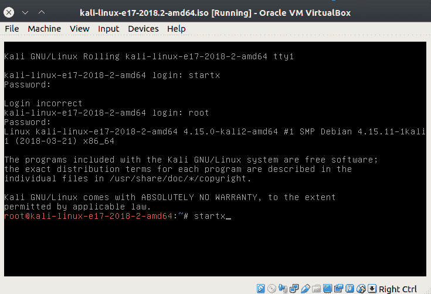
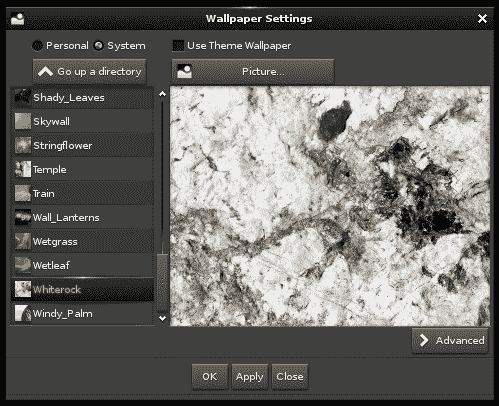
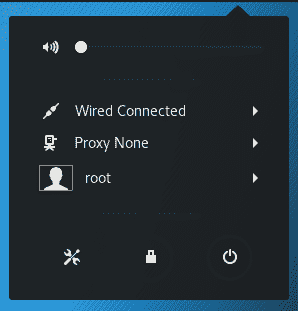
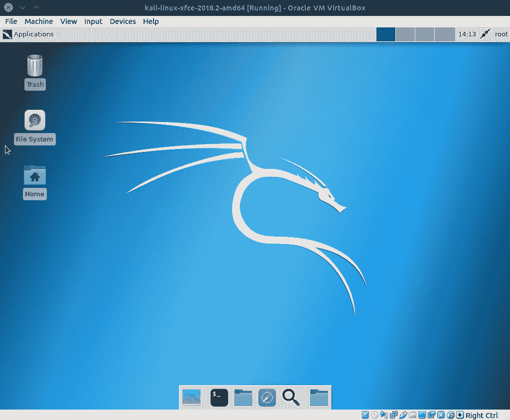
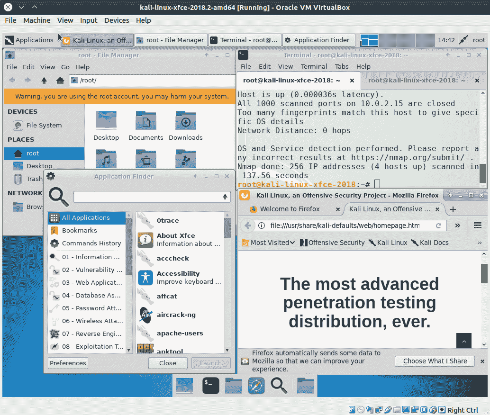
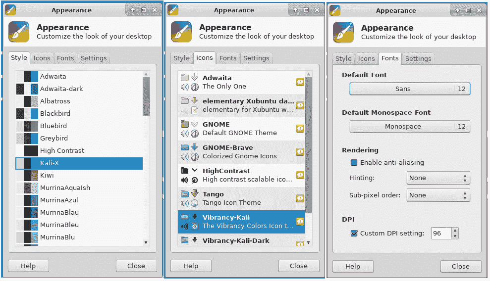
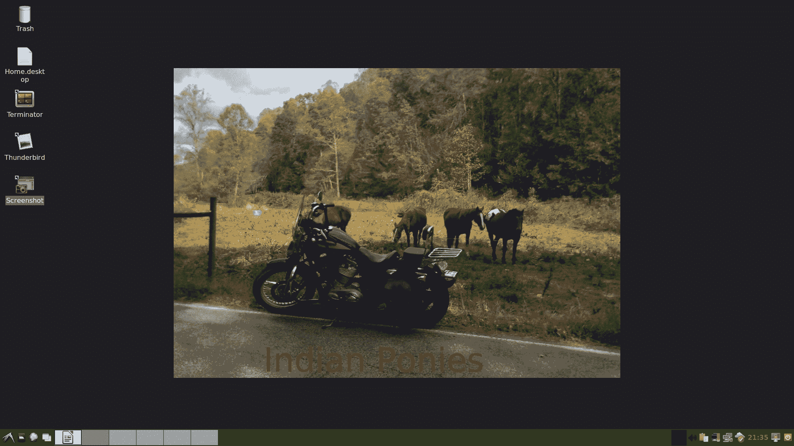
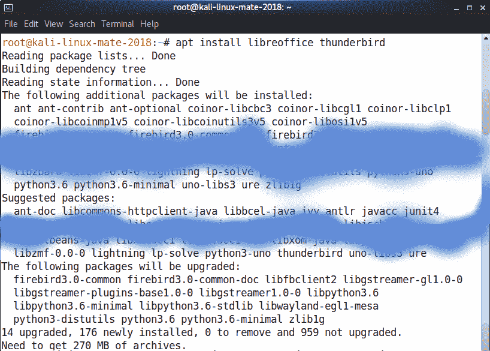

# 选择您的发行版

自我们的书的第一版以来，Kali Linux 发生了很多变化。除了 Kali 现在是一个滚动发行版之外，它现在还配备了几个桌面环境和几种不同的内核架构。这意味着你可以在小型树莓派上运行 Kali，也可以在专为速度和功率而建的完整工作站上运行 Kali。通过添加一个普通用户帐户和一些额外的配置和软件包，你可以将 Kali 作为你的日常驱动程序操作系统。在本章中，我们将讨论几种桌面环境以及各自的优缺点。这将帮助你决定在使用 Kali 进行黑客活动时应该下载哪个发行版。如果你对 Linux 不熟悉，本章将帮助你了解 Linux 及其设计的一些内部知识。

+   桌面环境

+   选择您的外观和感觉

+   为您的日常驱动程序进行配置

# 桌面环境

Unix/Linux 系统和 Windows 之间的一个重大区别是它们在设计上真正是模块化的。当然，我知道微软说“Windows 在设计上是模块化的”，但实际情况并非如此。在 Windows 中，桌面*无缝集成到操作系统中*。因此，在 Server 2012 之前，你必须运行带有运行 GUI 的 Windows 服务器。在 Server 2012 中，你可以选择无头运行机器，但在这种模式下服务器的使用非常有限。试图卸载 Internet Explorer；嗯，你不能。是的，Internet Explorer 是一个具有最大安全漏洞的常见应用程序之一。是的，Internet Explorer 具有系统级访问权限。是的，托托，这是一个问题，我们将在本书的后面利用它，但在本章中让我们专注于桌面环境。

Linux 的设计真的是模块化的。Linux 的父亲是 Unix，Unix 的整个设计理念是小型交互式程序，可以链接在一起执行更大的任务。Linux 也是这样设计的。实际上，Linux 只是由一个人，Linus Torvalds 发明的操作系统的内核。几乎所有其他东西都是一系列小应用程序组合在一起*让系统运行*。一个大而持续的组件集，帮助内核与硬件交互，被称为 GNU 工具集。这些工具大多是从 Unix 移植过来的，或者重新编写以避免版权问题，但仍然使用相同的输入和输出。

因此，根据这种设计结构，GUI 只是操作系统的另一个模块，可以在不影响底层工作部分的情况下进行更改或完全删除。这使得 Linux 能够做任何事情，从智能手表到运行强子对撞机，或者...成为一个黑客机器。

# 桌面环境与窗口管理器

一个重要的区别可能会帮助你理解桌面环境在 Kali 和其他 Linux 系统上是如何工作的，那就是窗口管理器。桌面环境，也称为图形用户界面（GUI），通常包括文件夹、壁纸、桌面小部件、图标、窗口、工具栏和应用程序界面。微软 Windows 桌面环境可能是你发现的第一个类似的构造。你的智能手机也有一个桌面环境，而 Windows 8 桌面环境的失败是试图将 Windows CE（手机 GUI）和 Windows 7/Server 2003 GUI 的开发合并在一起。微软犯的错误是假设有更多具有触摸屏功能的工作站。技术显然存在，但显示器昂贵且使用范围有限。Bo 和 Wolf 认为 Ubuntu Unity 桌面环境也是基于相同设计假设的失败。鼠标驱动的工作站界面还将继续存在一段时间。

在 Kali 中，桌面环境通常与 X Windows 系统或 Wayland 等窗口系统交互，后者直接在硬件之上运行，并且与用户看到和与之交互的窗口管理器应用程序交互。窗口管理器提供了 Kali Linux 体验的外观和感觉。在 Kali Linux 中几乎可以与任何桌面环境一起使用几种窗口管理器。其中之一是 Enlightenment 窗口管理器，它作为 E17 包含在 Kali ISO 下载中。E17 和完整的桌面环境（如 KDE 或 Gnome）之间的主要区别在于，E17 几乎没有专门为 E17 构建的应用程序，而 KDE 和 Gnome 有专门的应用程序，需要满足大量依赖关系才能在其他桌面环境中运行。Kate 和 gedit 分别是 KDE 和 Gnome 的专门文本编辑器。

# 启蒙（E17）

安装 E17 ISO 与安装任何其他桌面环境几乎相似，只要你使用默认安装选项。标准引导屏幕是运行级别 3，只有一个命令行界面，所以你必须使用`startx`命令来查看桌面界面。如下截图所示：



E17 启动屏幕

在第一次登录到 E17 环境时，你将被问及一系列你在安装过程中已经回答过的问题：

+   语言：默认高亮显示的是美式英语。

+   键盘布局：默认高亮显示的是英语（美国）。

+   配置文件：这是硬件配置文件，选择是移动和计算机。默认高亮显示的是计算机。

+   大小：这是标题大小。选择从 0.8 到 2.0。默认高亮显示的是 1.0。

+   窗口焦点：选择是单击和鼠标悬停。默认高亮显示（以及一般的 Linux 默认）是鼠标悬停。

+   检查 Connman 是否存在：Connman 是 Enlightenment 网络连接管理器。点击安装/启用 Connman。

+   合成：这是 E17 中大部分视觉效果的来源。默认情况下启用合成，但如果你正在进行裸机安装，你可能想使用硬件加速（Open-GL）合成。如果 RAM 不足或者你使用的是较旧的处理器，你可能根本不想使用合成：


首次启动合成选择

+   更新：你可以启用对 Enlightenment 更新的检查。默认情况下是勾选此更新的框。如果你在目标网络中运行，请清除此复选框。如果网络应该是仅限 Windows 的，那么随机出现的网络检查就不是特别隐秘了。

+   任务栏：启用任务栏可以让你在 Kali Linux E17 桌面上看到打开的应用程序和窗口。这是默认启用的。

一旦你完成了配置，E17 会显示桌面。下面的截图显示了默认桌面。你可能注意到的第一件事是背景是一个平坦的白色板。顶部的菜单行来自 Virtual Box。底部的菜单栏让人联想到苹果 Mac 的工具栏。中间的浮动菜单栏是通过右键单击桌面实现的：


E17 默认桌面

基本默认文件管理窗口如下截图所示。它是可读的，但几乎没有令人兴奋的地方。如果你点击桌面菜单，你可以添加小工具。我已经在任务栏中添加了一个系统小工具，但你也可以把它放在桌面的任何地方。下面的截图显示了来自背光小工具的右键菜单。如果你点击“开始移动小工具”，你可以移动所有的小工具，直到你点击“停止移动小工具”：


移动小工具

# E17 窗口管理器问题

1.  几乎所有的安全工具都被归类在“其他菜单”下的“应用程序菜单”下，这可能会有点拥挤。

1.  如果您在靠近右屏幕边框的地方打开单击菜单，子菜单将超出屏幕。其他菜单过度拥挤的效果如下屏幕截图所示：


其他菜单过度拥挤的效果

1.  这个版本的 Enlightenment 已经有好几年了。当前的主要版本是 22。也许创建 Kali 的 Offensive Security 的人决定将 Enlightenment 冻结在主要版本 17，因为 Enlightenment 开发人员正在转向使用 Wayland 窗口系统，默认情况下 Kali-E17 正在使用**xorg**窗口系统。

要检查您的 Kali 版本是否正在运行 xorg 还是 Wayland，请在命令行上键入`xdpyinfo`。如果它正在运行纯 Wayland 环境，该命令将失败。如果它正在使用 xorg，它将产生有关您的视频配置的几行信息。以下屏幕截图显示了默认安装的结果的截断屏幕：


截断的 xpdyinfo 输出

1.  获取所有安全工具的最简单方法似乎是打开“应用程序”|“运行所有”对话框，如前面所示。我发现当我尝试打开 E17 中的默认终端仿真器**xterm**来安装我最喜欢的软件安装程序**Synaptic**时，会返回错误代码。我必须转到“应用程序”|“系统菜单”并从那里打开 xterm。似乎没有一个简单的解决方法来修复失败的“运行所有”小部件。也许升级到当前稳定版本的 Enlightenment（E22.x）会解决这个问题，但解决方案可能需要重新设计窗口系统，这是一个非常重要的工作。

要安装`synaptic`：

```
#> apt install synaptic
```

要在 E17 中更改壁纸，请单击“应用程序”|“设置”|“壁纸设置”。这将打开以下屏幕截图中显示的对话框。您可以选择自己的桌面图像或工厂图像之一：



更改桌面壁纸

# Gnome 桌面

在 Backtrack 时代，Backtrack 是 Kali Linux 的前身安全平台，默认桌面环境是一个非常简化的 KDE 版本。当 Backtrack 被废弃并且 Offensive Security 发布了 Kali 时，默认桌面被更改为 Gnome。Backtrack 只是一个活动光盘 CD，并且不打算安装在任何计算机上。Backtrack 版本的 KDE 被简化以便能够从标准 CD 加载。这种简化去除了许多桌面功能。当 Kali 发布时，它被设计为从活动 DVD 加载，并安装在 x386 和 amd_64 架构上。Gnome 略微让人联想到 Windows 3.11 的外观和感觉，并且使用更少的内存来绘制桌面比 KDE。

Gnome 桌面自 Linux 早期以来就存在。Kali Linux 默认桌面环境是 Gnome 3。进行标准安装时，桌面看起来像这样：


Gnome 3 默认桌面

左边框上的工具栏是收藏夹组。当您打开任何应用程序时，它的图标会出现在左侧的收藏夹组中，如下面的屏幕截图所示，我已经打开了 OWASP ZAP：


将应用程序添加到收藏夹组

安全工具菜单位于桌面左上角的“应用程序”选项卡下。这是一个非常好的分类列表，使得更容易找到您想要使用的任何工具。列表如下屏幕截图所示：


Kali 的 Gnome 应用菜单

在 Gnome 3 中更改桌面图像很容易，但设置菜单有点难找。它隐藏在右上角的图标下面。以下截图显示了系统菜单，其中包括声音音量控制、网络连接对话框和设置编辑器：



Gnome 系统菜单

大多数 Gnome 中的设置都可以在设置对话框中找到，如下一个截图所示。有关 Wi-Fi、背景、通知、搜索、区域和语言、通用访问、在线帐户、隐私、共享、声音、电源和网络的设置表。下一个截图显示了桌面编辑器，其中包含默认的桌面图像：


Gnome 设置对话框

要更改图像，只需单击要更改的图像。这将打开一个对话框，您可以从图片目录中选择几个包含的图像，或者选择自己的图像：

# Gnome 3 桌面问题

+   似乎没有任何简单的方法将应用程序添加到收藏夹组

+   下拉菜单栏使用滑块将您带到通常的应用程序菜单，而不是完整长度的子菜单

# KDE 桌面

KDE 自 Linux 早期以来就存在，是 Bo Weaver 最喜欢的。随着年龄的增长，稳定性也增加了，KDE 是一个非常稳定的桌面。外观和感觉非常类似于 Windows，因此对于 Windows 用户来说很容易使用。 KDE 的一个优势是桌面高度可配置。如果你不喜欢它的外观，就改变它。这可能是一个很大的优势。 KDE 带有所有最新的 Jumping Monkeys 和功能。你可能喜欢你自己的桌面环境，就像我们一样。只要你能把桌面配置成多年来一直的样子，最新的东西就无所谓了。这有助于*肌肉记忆*。肌肉记忆起作用是因为一切都在预期的位置上，这降低了工作的开销，因为没有时间去寻找你每天使用的常见工具。不必考虑工具在机器上的隐藏位置或如何保存文件，因为开发人员决定该应用程序不再需要菜单栏。使用 KDE，你可以将你的桌面改回老式的简约桌面，一切都和多年前一样。如果你感到无聊，你可以定制桌面，超出默认的 Kali 外观。下一张截图显示了默认桌面，开始菜单打开在应用程序上。菜单组织与你已经看到的 Gnome 3 菜单类似：


默认 KDE Kali 桌面

KDE 的一个缺点是，由于它是如此高度可配置并且带有许多内置功能，它对机器的内存和显卡需求很高。KDE 确实需要在具有良好内存的现代机器上运行。此外，由于它是如此高度可配置，有时很容易搞乱你的设置。

KDE 的一个优势是桌面小部件。桌面小部件是在桌面上运行的小应用程序，可以做很多事情。在黑客时，你需要密切关注你的本地系统资源。有一些小部件可以让你一目了然地监视系统内存、CPU 和网络使用情况。在工作中突然启动一个工具，然后因为内存不足而导致系统崩溃是一件令人沮丧的事情。使用小部件，你可以监视内存使用、网络和 CPU 使用情况。

KDE 在使用多个监视器时也非常好用，并且可以完全配置分配哪个监视器是主监视器以及工具栏的位置。它还可以在不重新启动或调整配置的情况下恢复到单个监视器。当你的机器是一台经常移动的笔记本电脑时，这一点非常棒。

KDE 开发人员似乎明白，平板电脑的桌面界面在使用鼠标的工作站上不起作用。自从平板电脑出现以来，KDE 现在确实有两个界面，Plasma 和 Neon，它们在硬件更改时互换。它们都使用相同的后端工具集；只有在从平板模式切换到工作站模式时，外观和功能才会发生变化。这是 Windows 8 桌面的失败，也是 Gnome 桌面的失败。你不能设计一个既适用于手指又适用于鼠标的界面。你最终得到的将是一个既不适合手指也不适合鼠标的界面。

# KDE 问题

KDE 图形繁忙，使用了大量资源。这使得它不适合非常老旧的机器，或者图形内存较低的机器。

+   **SHOW STOPPER!**: 这是一个安装程序问题，你可能不会遇到这种情况。创建 Kali Linux 的人随着时间的推移向 ISO 磁盘文件添加更新，当 Wolf 进行此安装时，出现了这个问题。这很容易解决，重要的是不要惊慌。如果你的安装出现这种情况，你没有做错任何事。安装后，KDE 实例加载到 tty1 全屏 CLI，`startx`不会启动 GUI。`startx`是`xinit`软件包的一部分，所以你可以以 root（刚刚登录的帐户）的身份输入以下内容来安装`xinit`：

```
#> xinit 
```


安装 xinit 后的 KDE startx

# LXDE 桌面

LXDE，全称轻量级 X11 桌面环境，是由台湾程序员洪任中在 2006 年设计的，他写了 LXDE 的第一个模块。那是一个文件管理器。这让人想起 Linux 内核本身的创建，Linus Torvalds 从一个文件管理器模块开始。安装出现了问题，但是 Live 光盘似乎运行良好。我注意到 Kali-Linux 图形安装要求输入机器域，但常规安装不需要。下面的屏幕截图显示了默认的 LXDE 桌面。

这个桌面环境也让人想起 Windows XP，因为菜单启动按钮在左下角：


LXDE 默认桌面视图

要更改桌面背景，请转到左下角的菜单，选择首选项|桌面首选项。菜单显示在下一个屏幕截图中。如果你想要更多的背景图片选择，可以查看[`pixabay.com/`](https://pixabay.com/)：


LXDE 桌面图像首选项对话框

# LXDE 问题

+   **SHOW STOPPER**: 图形安装失败，因为**没有计划分区表，也没有计划创建文件系统**

+   **SHOW STOPPER**: 常规安装失败，因为**未安装操作系统**

# MATE 桌面

MATE 桌面是现在已经不再使用的 Gnome 2 桌面环境的一个分支。MATE 代表 MATE 高级传统环境。这类似于 GNU 首字母缩略词，*GNU 不是 Unix*。将分支重命名为 MATE 避免了与仍在使用的 Gnome 3 环境的命名约定问题。

MATE 包括许多 Gnome 应用程序的分支，并且开发人员编写了新的应用程序。这些名称都是西班牙语，以反映 MATE 的阿根廷起源。

MATE 应用程序包括以下内容：

+   **Caja**: 文件管理器（来自 Nautilus）

+   **Atril**: 文档查看器（来自 Evince）

+   **Engrampa**: 存档管理器（来自存档管理器）

+   **MATE 终端**: 终端模拟器（来自 GNOME 终端）

+   **Marco**: 窗口管理器（来自 Metacity）

+   **Mozo**: 菜单项编辑器（来自 Alacarte）

+   **Pluma**: 文本编辑器（来自 Gedit）

MATE 的第一次启动，以及所有后续的启动，都将我们带入运行级别 3，如下面的屏幕截图所示：


MATE 首次启动

MATE 的默认 GUI 对大多数 Linux 用户来说是熟悉的，因为它几乎是 Gnome 2 的镜像。下一张截图显示了带有默认 Kali 标志的桌面。应用程序、位置和系统菜单结构一直是 Linux 桌面的标志，许多长期使用 Linux 的用户欢迎 MATE 团队维护这一传统的努力：


MATE GUI

以下截图显示了 MATE 桌面的所有三个系统菜单，代表性的子菜单已打开。Places 菜单打开 Caja（文件管理）窗口：


MATE 系统菜单

外观和感觉菜单为您提供了 12 种预设的外观偏好，然后可以进一步定制。以下截图显示了其中一些预设的选择：


MATE 外观预设

# MATE 问题

进入运行级别 3 的行为是困难的，但并非不可克服，因为我们知道在面对这个屏幕时要尝试`startx`。根据您下载 MATE 的日期，您可能会遇到这个问题，也可能不会。这是服务器的标准运行级别，但您可能希望在 Kali Linux 中同时使用 GUI 和 CLI 工具。

# Xfce 桌面

Xfce 桌面是一个轻量级的桌面环境，是 Wolf Halton 的个人最爱。他在写本书第一版时使用 Xfce 来节省资源。他今天正在使用它作为高度定制和古怪的 Ubuntu Studio 操作系统的一部分，以便在本书的当前版本上工作。

这个桌面环境的缩写发音为**ex-eff-cee-ee**。它曾经是 X-Forms Common Environment 的首字母缩略词，但现在它使用的是 GTK 工具包而不是 X-Forms。Xfce 最初设计为 CDE 的替代品，CDE 是 1996 年的 Unix Common Desktop Environment，当时后者仍然是专有的。一些人可能认为 Xfce 在外观和感觉上有点过时。默认的 Xfce 桌面显示在以下截图中：



Xfce 默认桌面

底部的工具栏是最小化但完全功能：

+   第一个按钮最小化所有窗口，显示桌面

+   第二个按钮打开命令行终端仿真器

+   第三个按钮打开 Thunar 文件管理器

+   第四个按钮打开 Firefox 网络浏览器

+   第五个按钮是应用程序查找器

+   第六个按钮是活动用户的家目录

以下截图显示了打开`root`家目录、终端仿真器、浏览器窗口和应用程序查找器的结果。`application`文件夹中有一个应用程序菜单，与左上角的应用程序按钮相同：



Xfce 下部工具栏示例

改变个性化最明显的方法是将桌面更改为您选择的图像。有四个选项卡可以对桌面环境进行更深入、更微妙的更改，并使 Xfce 成为您自己的。以下截图显示了这四个选项卡中的三个：



Xfce 外观选项

# Xfce 问题

Xfce 桌面没有真正的显示停止器。也许这是因为 Xfce 是一个非常稳定的桌面环境；它从未带来任何问题。

# 选择外观和感觉

外观和感觉是主观的。没有人有完全平均的气质。用例将在您选择硬件和使您满意的自定义程度方面发挥重要作用：

+   如果您总是从 USB 存储设备或光盘运行，最好使用 Gnome 3 桌面，因为它经过开发人员最多的测试，或者使用 Xfce 桌面，因为它使用的资源最少

+   如果您要安装到虚拟机，您可能希望使用 Xfce 或 LXDE 桌面环境，因为虚拟机往往具有较低的资源级别

+   如果您要加载到专用服务器或笔记本电脑，您可能具有最高的资源级别，并且不太可能经常破坏操作系统，因此选择 E17 或 KDE 桌面，因为它们是最可定制的

+   如果您已经对任何桌面环境有深入的了解，您可能应该选择那个，因为它为您提供了舒适的使用体验

# 配置 Kali 成为您的日常驱动程序

Kali 自从首次开发以来已经走了很长的路。它最初是 Linux 的精简版本，旨在作为 VM 或从 USB 或 CD 运行。您的常规计算工具只是在那里。您会注意到 Kali 旨在在 root 帐户下运行。在安装过程中，与大多数其他发行版不同，安装中没有正常的设置用户帐户部分。当然，这通常是一个很大的安全禁忌。普通用户不应该具有系统的根级访问权限。今天，在大多数 Linux 发行版上，root 帐户基本上已禁用了交互式登录，并且系统管理的指令告诉您使用`sudo`来访问系统级文件。基于 GUI 的管理应用程序要求用户`sudo`并使用其凭据打开和保存对系统的配置更改。这对于正常使用的系统设置是一个很好的主意，但是在渗透测试中，您需要直接访问硬件和系统级别。在每个命令前使用`sudo`并不是一个有用的选项。

下一个截图是 Bo 编写本章时所用计算机的桌面。由于他正在撰写文档，查找互联网上的信息并检查电子邮件，因此他使用了基本的非特权用户帐户。请注意他的个人照片在桌面上。在系统上使用多个帐户（特别是其中一个帐户是 root 时），您可能希望为每个帐户设置不同的壁纸。这有助于提醒您登录方式，并防止您在 root 帐户中做一些愚蠢的事情。这也有助于保护您免受互联网上的恶意攻击：



Bo Weaver 的桌面

以下截图是此计算机的根桌面。当您使用此壁纸时，您会毫无疑问地知道自己在哪里：


Bo Weaver 的根桌面

# 用户帐户设置

在设置和运行 Kali 之后，您需要将普通用户帐户添加到系统中，使其成为您的日常驱动程序。大多数 Kali 发行版未加载用户管理器应用程序。它们可以安装，但最简单的方法，也适用于所有发行版的方法是使用终端中的老式`useradd`命令，如下一个截图所示。

此用户和所有其他用户进程的用户是 root：


添加管理员用户

为了解释命令选项的含义，以下是一个示例，添加用户`fred`并设置密码为`Password`。请确保将用户名和密码更改为您的唯一帐户；我们不再允许`fred`进入我们的网络。

```
useradd -m -U -G sudo -p LamePassword fred  
```

我们在这个命令中使用的标志如下：

+   `-m`：在`/home`目录中为用户设置一个主目录。

+   `-U`：此标志为新用户设置了一个唯一的用户组，组名与用户名相同。

+   `-G sudo`：这将新用户添加到不止他自己的组。您希望您的普通用户帐户具有 sudo 访问权限，因此我们将用户添加到 sudo 组。

+   `-p LamePassword`：此标志为帐户设置了密码。请不要在这里使用愚蠢的东西。

+   `fred`：我们用新用户名结束命令。

+   接下来，只需按下*Enter*键，新用户帐户就设置好了。

有几个应用程序你需要加载才能使用桌面：要么是 LibreOffice 或 Apache OpenOffice，还有一个邮件客户端。Kali 的存储库中没有 OpenOffice，所以在这个演示中我们将使用 LibreOffice。Mozilla Thunderbird 是一个有用的邮件/日程安排工具。我们将在演示中使用它。Kali 默认没有安装邮件客户端，因为它是设计为在 root 下运行的。警告：永远不要在 root 账户下打开邮件。坏事可能会发生！

首先，确保你的软件包列表是最新的，所以运行这个命令：

```
apt-get update  
```

接下来，安装 OpenOffice 和 Thunderbird：

```
apt-get -y install libreoffice thunderbird  
```

或者，使用这个：

```
apt install libreoffice thunderbird  
```

`-y`标志将回答是安装软件包。在这一点上，喝杯咖啡或者出去走一小段路，因为这将需要一些时间来安装。第二个命令做同样的事情，但它让我们查看要安装和升级的软件包。第二个命令的结果的摘要显示在下一个截图中。这个截图显示了安装的主要部分之间的波浪线，以适应所有这些实际存在的三个屏幕详细信息的图像窗口。有数十个建议的软件包，你可以忽略这些，只需按下*Y*键。你也可以稍后返回，从终端窗口中复制所有建议的软件包名称，并运行这个命令：

```
apt install [all those names you just copied]  
```

将它们添加到你的安装中：



安装邮件客户端和办公应用程序

所以，现在你准备好了。将你的 root 桌面更改为某种提醒你已经以 root 身份登录的东西。退出 root，在登录界面输入新用户的凭据。一旦你登录，你现在拥有一个具有正常用户账户完整安全性的运行账户。使用这个账户，你可以安全地浏览互联网，阅读邮件，以及进行其他你通常在系统上做的事情。当你需要进行一些小的渗透测试时，只需以 root 身份登录。

# 总结

在本章中，我们为你简要介绍了当前桌面环境的选项，并对使用它们进行了一些理由。大多数定制发生在笔记本电脑和台式机上的裸金属安装上。最少的定制将发生在活动光盘和 USB 存储器使用情况下，因为资源有限，更改不会被保留。
