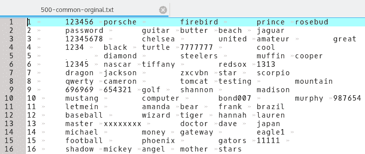
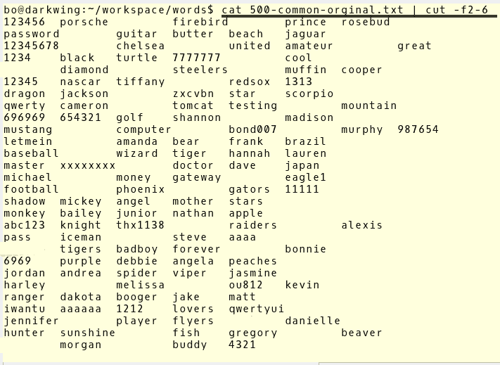
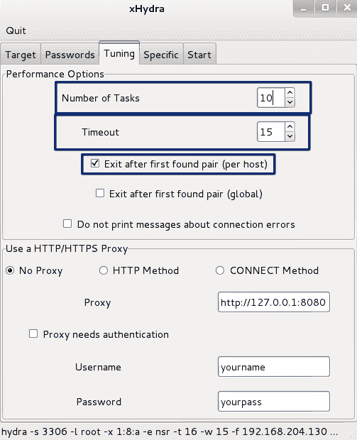
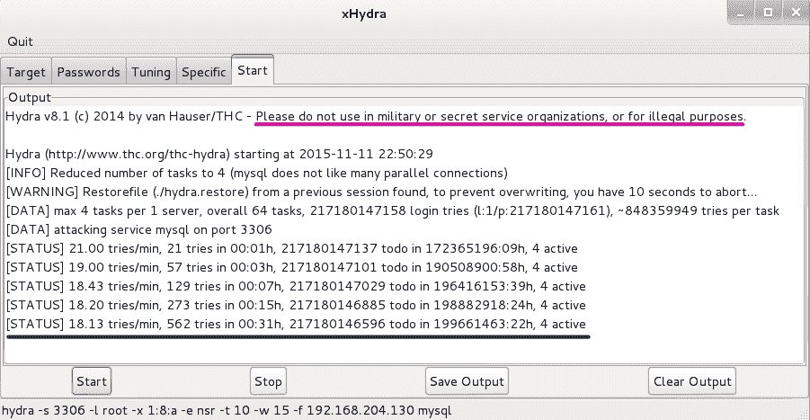
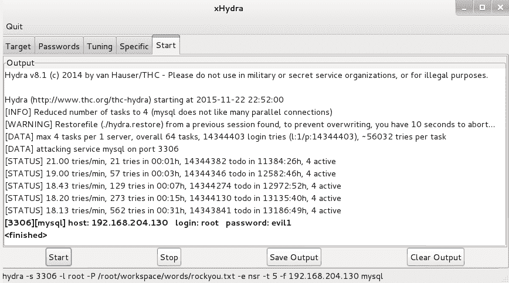

# 密码攻击

您遇到的任何人都会告诉您，弱密码是导致许多成功入侵的原因，无论是本地还是远程。作为受过训练的网络管理员或安全工程师，您已经多次建议用户使其密码更加安全。您可能没有意识到的是，许多技术专业人员使用弱密码或密码模式，不仅危及自己的帐户，而且危及他们维护的整个网络。本章将向您展示几种测试网络密码的工具，以便您可以帮助指导用户养成更好密码的习惯。

我们将在本章学习以下主题：

+   密码攻击计划

+   见我的朋友，约翰尼

+   见约翰尼的父亲，约翰·里帕

+   见前任—xHydra

哈希算法的性质是所有哈希应该大致相同的长度，似乎并不更可能有人能够破解以下内容：

```
$6$NB7JpssH$oDSf1tDxTVfYrpmldppb/vNtK3J.kT2QUjguR58mQAm0gmDHzsbVRSdsN08.lndGJ0cb1UUQgaPB6JV2Mw.Eq. 
```

任何比他们更快破解的：

```
$6$fwiXgv3r$5Clzz0QKr42k23h0PYk/wm10spa2wGZhpVt0ZMN5mEUxJug93w1SAtOgWFkIF.pdOiU.CywnZwaVZDAw8JWFO0
```

遗憾的是，即使在一台慢速计算机上，密码`Password`的第一个哈希值也将在不到 20 秒内被破解，而`GoodLuckTryingToCrackMyPassword!`的第二个密码哈希值可能需要数月才能破解。以下列表说明了您可以在互联网上找到的数十个单词列表中找到的一些密码，这些密码使得破解密码变得更加容易。一些常见的哈希可以通过[`www.google.com`](https://www.google.com)破解，只需将哈希粘贴到搜索栏中即可。大多数网络应用程序和操作系统会向用户选择的密码添加一些字符，称为“盐”，以使简单的加密哈希变得更加复杂和不易猜测。

以下屏幕截图显示了一些明文密码示例及其哈希值：

！[](img/a177e90f-92d6-4fbc-8bfb-dc7486f52ed6.png)

# 密码攻击计划

密码通常是任何系统或网络的关键。自计算机诞生以来，密码一直被用来阻止未经授权的人查看系统数据。因此，密码破解是黑客行业中非常需要的技能。捕获或破解正确的密码，您就拥有了通往王国的钥匙，可以随时随地访问任何地方。随着我们的讨论，我们还将谈一下如何创建强密码。如果您是一位阅读本书的系统管理员，那么您就是我们所说的人。攻击者正在寻找的是您的密码。当然，每次登录时输入 12 或 14 个字符的密码都很痛苦，但您的网络有多重要呢？

就个人而言，我们希望从一开始就不要使用*密码*这个词来表示这个功能。它应该被称为密钥。系统的普通用户会因为受密码保护的数据而哭泣和抱怨。大多数人将*密码*这个词与进入俱乐部或其他东西联系起来。用户会在所有财产上安装锁和防盗警报，但在计算机上使用一个四个字母的密码。人们将*密钥*这个词与锁定重要物品联系起来。实际上，如果您的密码只是一个*单词*，您将在几分钟内被攻破。最好使用密码短语。像*玛丽有一只小羊*之类的东西比单个单词好得多。随着我们在本章中思考您使用的密码的重要性，我们将看到这一点有多重要。

# 破解 NTLM 代码（重温）

密码攻击的一种方法在第四章中已经涵盖，*嗅探和欺骗*。在运行 NetBIOS 的 Windows 网络上，捕获 NTLM 哈希就像小孩玩耍一样简单。它们就漂浮在 ARP 云中等待被摘取。正如我们在前几章中所展示的，当您使用 Metasploit 时，您甚至不需要将此哈希破解为密码，而只需将哈希传递给另一个 Windows 系统。

有时，你需要实际的密码。系统管理员有时会变懒，会在几类设备上使用相同的密码。假设你有一些 Windows 哈希值，你需要进入一个路由器或一个你不确定密码的 Linux 机器。很有可能其他系统的密码是相同的，所以你可以破解 NTLM 协议泄漏的哈希值。我们中的许多人都有在基础设施设备上重复使用密码的行为，尽管我们知道更好的做法。对于路由器和其他基础设施设备，使用不同的用户名和密码可能更安全，除非绝对必要，不要使用域管理员帐户登录任何机器。

黑客提示：

关闭 NetBIOS，并使用 Kerberos 和 LDAP 的 Active Directory 进行 Windows 登录和网络功能。

在本章中，我们将研究破解密码，而不仅仅是传递哈希值。

# 密码列表

对于任何一个好的密码破解器，有时破解密码的最快方法是使用密码列表。有时甚至最好运行一个包含最差的 500 个密码的列表，以查找那些使用糟糕密码的懒惰者。大多数情况下，一个糟糕的密码可以在几秒钟内被破解，而使用强密码短语可能需要几个小时、几天或几周。

Kali 包含许多密码，你可以在以下目录`/usr/share/wordlists`中找到它们。以下也是一些好的密码文件的链接和列表。谷歌搜索也会带你找到常见密码的列表，以及从网站上窃取的密码列表。当使用被窃取的密码列表时，只使用已经清理过用户名的列表。使用完整的被盗凭证（用户名和密码）可能会让你陷入麻烦。只有密码列表，你只有一个没有与原始用户关联的单词列表。这是安全和合法的使用：[`wiki.skullsecurity.org/Passwords`](https://wiki.skullsecurity.org/Passwords)。


# 清理密码列表

有时，当你得到一个密码列表时，列表可能是文本文件中的制表列，或者可能有奇怪的空格或制表符与文件中的单词混合。你需要清理这些空格和制表符，并且每行只有一个单词，以便单词列表可以与密码破解器一起使用。

Unix 的最早概念之一是系统中的小程序可以被管道连接在一起执行复杂的任务。Linux 是 Unix 的红头发表亲，这些工具都包含在每个 Linux 发行版中，包括 Kali。这是老派的方法，但一旦你理解了如何做，它就非常有效。我们将逐个介绍使用的每个程序，然后展示如何将它们串联在一起以执行这个任务，所有命令都在一行中。

以下是 500 个常见密码的列表。这些单词被列在一个 HTML 表中，并且行号已经编号，所以当复制到文本文件时，原始形式如下所示。你可以找到的大多数单词列表都包含大约相同的极其常见的糟糕密码，尽管我们使用的是英语，但其他语言也有单词列表。弱密码并不严格属于英语世界。

也就是说，下一个截图是非常常见但非常薄弱的英语密码的一个很好的例子。展示所有 500 个单词会浪费空间，所以我们在出版商的网站上提供了`500-common-original.txt`文件：



请注意，我们左侧有行号需要丢弃，每行有五个单词，用制表符和空格分隔。我们需要将每个单词移到新的一行。

`cat`命令读取文本文件并将其打印到屏幕或另一个文件中。与`cut`命令一起使用，我们将首先剥离行号。`cut`命令将制表符视为字段之间的间隔，因此数字是行中的第一个字段。我们想要剪切数字并保留单词，所以我们剪切第一个字段并保留其他字段。为此，请运行以下命令：

```
cat 500-common-orginal.txt | cut -f2  
```

我们得到了如下返回的输出。如果你看一下，你会发现这是每行中仅有的第一个单词的列表，而不是整个列表。使用`-f2`标志，我们已经剪切了除每行中的第二个字段之外的所有内容。以下截图已经删除了一些单词，以保持本书的 G 级评级，但有些人天生粗鲁。列表中的一些单词可能不适合打印，但它们是前 500 个常见密码。在黑客行为中，你正在处理一个人的本性，这并不一定是社会上正确的。人们经常会选择粗鲁的词语，当他们认为没有人会看到他们写的东西，或者他们认为自己是匿名的时候。 


由于我们想要每行的所有单词，我们必须在命令中包括其他五列。一行中有五个单词，加上数字，共有六个字段，我们想要剪切第一个字段（数字）并保留其余部分，所以我们将`-f`标志更改为`-f2-6`；这将剪切字段 1 并打印出字段 2 到 6。我们看到返回已经去掉了数字行，但我们仍然每行有五个单词。这在密码破解器中不会正确运行；我们仍然需要将所有单词移到自己的一行上：

```
cat 500-common-orginal.txt | cut -f2-6 
```

这个命令字符串去掉了行号，尽管保留行号不会超过几秒钟。但这样做不够整洁，有时整洁是很重要的。以下截图是该命令的输出：



为了让所有单词都在新的一行上，我们使用`--output-delimiter`标志，并使用`$'\n'`的值，这告诉输出每个分隔符（即制表符空格）在该行上将下一个字段移到新的一行：

```
cat 500-common-orginal.txt | cut -f2-6 -output-delimiter=$'\n'   
```


现在我们每个单词都在新的一行上，但我们还需要将其打印到文件中以供使用。为此，我们将使用重定向命令`>`将输出发送到新的文本文件。请注意，`>`命令将正在运行的命令的输出发送到文件，但如果文件名存在，它将覆盖文件的内容。如果要增加已有文件的大小，请使用`>>`命令将输出附加到已有文件中。

以下截图显示了将单词发送到弱密码的工作文件，并测试输出文件的内容和格式：


运行`ls`命令来双重检查你是否在正确的目录中，并且你选择的输出文件不存在，然后运行以下输出到一个文件：

```
cat 500-common-orginal.txt | cut -f2-6 --output-delimiter=$'\n' > 500-common.txt

```

黑客笔记：

如果你意外地运行了`cat 500-common-orginal.txt | cut -f2-6 --output-delimiter=$'\n' > 500-common-original.txt`命令，你将覆盖原始文件，并且最终得不到你想要的新文件内容。

请注意，这次屏幕上没有输出，但当再次运行`ls`命令时，我们会看到工作目录中的新文件。通过查看新文件，我们可以看到我们准备好供使用的新密码文件。

# 我的朋友约翰尼

首先，我们将谈谈我的朋友约翰尼。约翰尼是我另一个朋友约翰的 GUI 前端。对于大多数密码破解任务，这是使用约翰的简单方法。它使用大多数密码破解会话的正常默认值。一旦你捕获了一些哈希值，将它们保存到一个文本文件中并打开约翰尼。

以下是 LXDE 桌面的屏幕截图，显示了 Johnny 的位置。您还可以在所有其他桌面上找到它，位置相同，应用程序| 05 - 密码攻击| johnny：


我们正在使用书中早期的先前利用中的密码哈希，当时我们正在传递哈希。我们已经将列表缩短，只包括我们认为对网络系统具有关键访问权限的两个帐户的哈希：


一旦 Johnny 打开，点击“打开密码文件”按钮，选择您保存用户哈希值的文本文件。这将把文件加载到 Johnny 中。

黑客笔记：

最好删除访客和任何其他您不想破解的用户帐户。这将减少破解密码所需的时间。如您所见，我们只破解了两个帐户。

以下截图是您对 Johnny 界面的第一印象。非常简单，但功能强大：


因为这是一个测试网络，对话框窗口中只有两个用户名。在生产网络中，将有与组织中被允许登录系统的人数一样多的用户名。很可能这两个用户中至少有一个具有管理员特权。

黑客的笔记：

请记住，管理员帐户始终是 UID 500。有时，管理员会更改管理员帐户的名称。这在某些情况下会隐藏帐户，但一旦您获得了帐户的 UID，找到管理员就像 500 一样容易。


我们知道这些哈希来自 Windows 7 系统。在 Windows 7 中，默认不再使用 LM 哈希，因此我们必须更改默认的 LM 哈希破解。如果不更改，您将在“输出”选项卡中收到以下错误：


点击“选项”选项卡，并将自动检测更改为 nt2，如下截图所示：


现在点击“密码”选项卡，然后点击“开始攻击”按钮。这将开始破解过程。您可以在屏幕底部选项卡中看到该过程：


请注意，它现在显示格式为 nt2 并正在运行。喝杯咖啡吧。这可能需要一段时间。

还要注意我们有一个“暂停攻击”按钮。如果需要，您可以暂停攻击。

有时，开源应用程序会有怪癖。Johnny 也不例外。有时，在进行破解运行时，该过程将运行并破解密码，但密码不会显示在 GUI 窗口中。如果“暂停攻击”按钮变灰，只能点击“开始”按钮，则运行已完成，并且密码已被破解。您可以通过单击“选项”按钮找到破解信息。此页面还将显示运行所需的时间以及破解的密码。这是获取运行所有结果的最佳页面。

您可以在下一个截图中看到，使用大写和小写字母、数字和特殊字符的复杂性，破解两个密码分别花费了 7 小时 18 分钟，一个有六个字符，一个有七个字符：


# John the Ripper（命令行）

John the Ripper 是 Johnny 的基础应用程序。您可能和我们一样，在使用密码破解工具（如 John the Ripper）时，更喜欢命令行而不是 GUI。您可能选择 CLI，因为它比 GUI 使用更少的资源，或者因为您正在通过 SSH 连接到没有 GUI 界面的服务器进行工作。使用 John the Ripper 很容易，而且通过使用命令行，可以使用更多选项和方法来使用 John，这些选项和方法尚未添加到 Johnny 中。

您可以看到 John 支持的各种哈希算法，并通过运行以下命令测试系统的破解速度：

```
john -test
```

这将运行 John 支持的所有各种哈希算法，并为各种哈希所需的速度提供信息。以下截图显示了`test`标志的输出：


我们将对从先前对系统的利用中获得的一组哈希运行 John。请注意我们使用的标志来执行此操作。我们使用`--format=nt2`，然后选择文件：

```
john -format=nt2 hashdump.txt  
```


通过这次破解运行，我们正在破解超过六个字符的密码。请注意运行此过程所花费的时间。这表明，当涉及密码时，长度比复杂性更重要。

在下面的截图中，您可以看到破解一个相当简单的七位字符密码花了 1 天 23 小时。第二个八位字符的密码在 4 天 14 小时 56 分钟后仍未破解。是的，每增加一个字符，破解所需的时间就会呈指数增长：


通过在运行后运行`-show`标志，您可以看到已破解的单词，以及我们还有一个未破解的单词：


这次破解是在一个运行处理器的虚拟机上完成的。增加处理器将增加破解过程中运行的线程数量，从而缩短任务所需的时间。有些人构建了装满处理器和 GPU 卡的机器，可以在几小时内破解我们正在使用的密码。有些人使用亚马逊 AWS 并设置具有大量处理能力的实例，但这需要大量资金。众所周知，一些聪明的大学生启动了用于建模太阳系的大学超级计算机，并使用这些系统快速破解密码。即使您的邻里邪恶黑客拥有这些系统，更长的密码仍然更好。这些系统是使用长度超过 14 个字符的密码或密码短语的原因。即使使用超过 14 个字符的密码短语，这表明如果您拥有哈希值，那么只是时间、金钱和处理能力的问题，您就可以得到密码。

# xHydra

xHydra 是一个名为 Hydra 的密码破解器的图形用户界面前端。Hydra 可用于离线和在线密码破解。Hydra 可用于许多类型的在线攻击，包括针对 MySQL、SMB、MSSQL 和许多类型的 HTTP/HTTPS 登录的攻击，仅举几例。

我们将使用 xHydra 攻击运行 WordPress 站点的机器上运行的 MySQL 服务。由于该机器正在运行 WordPress 站点和 MySQL 服务，因此可以猜测数据库登录的用户名是`wordpress`，即默认的管理员帐户。默认情况下，MySQL 不会阻止暴力破解攻击，因此我们知道这次攻击有很大的机会成功。

要在 Kali 版本 1.x 中启动 xHydra，您需要转到 05 - 密码攻击|在线攻击|hydra-gtk。hydra-gtk 将启动 xHydra。是的，我知道这很令人困惑，但它们是相同的。以下截图显示了来自 LXDE 的菜单。（是的，那是我后面的摩托车，是哈雷）


需要记住的一点是，在 Kali 中，就像在任何其他 Linux 发行版中一样，您可以打开终端并在提示符处输入命令，也可以通过按下*Alt* + *F2*打开命令对话框。这将为您提供所谓的**运行框**。所有桌面都有这个功能。在接下来的两个截图中，我们展示了如何找到 xHydra，`# locate xhydra`以及如何在终端中通过名称`xhydra`启动它；以及当您通过*Alt* + *F2*键盘快捷键调用命令时的外观。以下是 Gnome 3 的运行框：


黑客提示：

正如我们所讨论的，Gnome 3 会以*它们的方式*做事情！即使它是错误的和令人困惑的。您输入要运行的命令，然后按*Enter*来运行它。关闭按钮将取消您的操作，并将您带回桌面。在所有其他桌面上，运行框会给您一个运行或确定按钮，它将运行命令。此外，在这些运行框中键入命令并按*Enter*将运行命令。

您还可以通过命令行打开 xHydra，方法是输入以下内容：

```
xhydra &  
```

&命令告诉 Bash 终端将应用程序后台化，并将命令提示符还给您。如果不添加&，您将锁定终端窗口，直到完成使用 xHydra。它会运行，但如果关闭此终端窗口，xHydra 也将关闭。

使用&会将从命令行运行的任何命令后台化：


打开 xHydra 后，我们会得到以下窗口。第一个选项卡“目标”用于设置攻击的目标和协议。您可以攻击单个 IP 地址，或从文本文件中选择目标主机列表。协议字段是选择协议类型。请注意，窗口底部显示了从命令行运行攻击时将使用的命令行字符串。

这是一个有用的学习工具，可以学习命令行选项及其工作原理：


我们正在攻击一个单一的主机，所以我们添加 IP 地址，将端口设置为`3306`，默认的 MySQL 服务端口，并选择 mysql 作为协议。

请注意，此窗口的选项部分有几个不错的选项。如果 MySQL 服务器启用了 SSL，您将在 SSL 框中打勾。对于任何其他使用 SSL 的服务，如 SSMTP、SIMAP 或 SLDAP，也会打勾。详细输出复选框将在运行时给您更详细的输出。显示尝试复选框在运行时将显示实际针对系统运行的密码。这很有趣，但会产生大量输出：


单击密码选项卡设置攻击的密码部分。在这里，我们添加用户`root`，选择生成单选按钮，并将字段更改为`1:8:a`。在底部字段中，您可能需要勾选尝试登录作为密码和尝试空密码字段。

在生成字段中，我们添加了`1:8:a`。这告诉 Hydra 运行密码从一到八个字符。小写字母`a`告诉 Hydra 只运行小写字母。如果我们添加字符串`1:8:aA1% .`，这将生成包括大写和小写字母、数字、百分号、空格（是的，在百分号和逗号之间有一个空格）和点的密码。从这里混合和匹配。

在这里，您将找到尝试登录密码的复选框字段，它将尝试使用登录名作为密码，如`admin:admin`，以及空密码的复选框。您还将在这里找到一个用于反转登录名的复选框，例如`nimda`，用于`admin`登录的密码：


接下来设置调整选项卡：

+   由于我们正在攻击一个主机，将任务数量减少到八个

+   由于主机在同一网络上，将超时值降低到 10

+   由于这是一个主机，攻击使用一个用户名，所以勾选框选项以在找到第一对后退出

您将会发现，设置的任务可能低于实际运行的任务。我们设置为 8，但后来我们会看到实际运行的任务是 4。服务器只能处理四个运行线程，所以我们只能得到这些。运行线程可以根据 Kali 攻击工作站上发生的其他事情而改变，因此最好设置为比运行负载更多。请注意，将其设置得比实际运行任务高（例如，将其设置为 16）会导致应用程序挂起。这个数字也可能会根据被利用的服务类型而有所增加或减少：



MySQL 攻击的具体选项卡将保持默认设置。实际上，MySQL 攻击不使用任何这些设置：


现在我们准备点击“开始”选项卡，我们看到我们正在对那台服务器运行四个线程。这可能需要一段时间：



黑客提示：

请注意，软件的作者，就像本书的作者一样，要求您不要将这些工具或信息用于军事、特工或非法目的。请记住，只能将您的绝地力量用于善良。

嗯。我们还有 217,180,146,596 个密码组合要尝试，估计时间为 199,661,463 天 22 小时。也许是时候换一个更强大的 Kali 工作站了。这可能需要一段时间。也许 546,659 年的假期是邪恶黑客的最佳选择。

幸运的是，估计值很高。接下来，我们看到我们的测试现在已经运行了 70 小时 39 分钟，没有破解长度为五个字符的密码。在此期间，运行已尝试了 75,754 个密码，还剩下 12,280,876 个，估计运行时间为 11,454 天 13 小时。因此，为了书籍的利益，我们在这里停止测试，估计还剩下 32 年：


这次测试的速度主要由受害服务器的资源和设置决定。我们的受害服务器是一个低租金的 VM，这也是测试如此缓慢的原因之一。另一个限制因素是目标服务器可能太弱，持续的暴力攻击可能会将机器从网络中踢出。即使是具有大量资源的强大服务器也可能会出现**拒绝服务**（DoS）的情况。在进行暴力攻击时，您可能希望以较低和较慢的攻击速度为目标。作为攻击者，您不希望提醒管理员发动攻击。

这个测试还表明，捕获哈希并离线破解通常比在线攻击更快。还有一件事要记住：如果系统上运行任何入侵服务，您的攻击将在数年内被注意到。

因此，让我们在同一系统上尝试密码列表攻击。请注意，我们已将设置从生成更改为密码列表，并从 Kali 中包含的许多密码列表中选择了`rockyou.txt`密码列表。以下屏幕截图列出了目录并显示了压缩的`rockyou.txt`文件。您需要解压缩才能使用：


在下面的屏幕截图中，我们已选择了未压缩的文件，准备好开始：


通过好莱坞现代奇迹，我们看到我们已经破解了密码`evil1`。经过 562 次尝试和 31 小时，我们成功了。这对于尝试的次数来说是很长的时间。再次强调，服务接受密码的速度是决定性因素，并且需要一段时间。目标服务器上的软件防火墙和密码尝试限制可能会使其花费更长的时间，甚至使其变得不可能。

如果正确的密码在密码列表中更靠后，那么破解所需的时间会更长：



# 总结

在这一章中，你学会了使用三种新的密码破解工具，并且学会了如何将新项目添加到主菜单中。Johnny 和他的前辈 John the Ripper 是你可以在 Kali 上找到的最受欢迎的工具，用于在本地机器上破解哈希值，所以当你测试用户的密码决策时，你可能会选择这两种工具中的一种。

Hydra 比基于 John 的基本工具有更多的选项，但随着增强的功能，复杂性也增加了。Hydra 旨在通过网络攻击特定设备，但正如你发现的那样，攻击面很小，而且工具非常吵闹。

你还学会了 Hydra 可以使用 GPU 而不是 CPU，从而使你的破解速度更快。

在下一章中，我们将学习古老和破损的协议 NetBIOS 和 LLMR，以及如何利用它们的漏洞来获取对 Windows 系统的访问权限。

# 进一步阅读

+   有关 John The Ripper 的更多信息：[`www.openwall.com/john/`](https://www.openwall.com/john/)

+   有关 Hashcat 的更多信息：[`hashcat.net/hashcat/`](https://hashcat.net/hashcat/)

+   有关 Hydra 的更多信息：[`github.com/vanhauser-thc/thc-hydra/`](https://github.com/vanhauser-thc/thc-hydra/)
