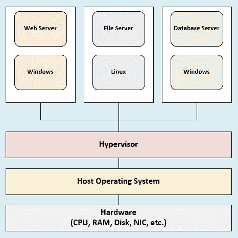
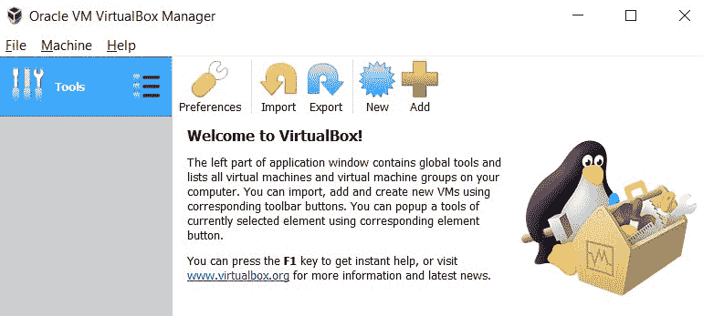
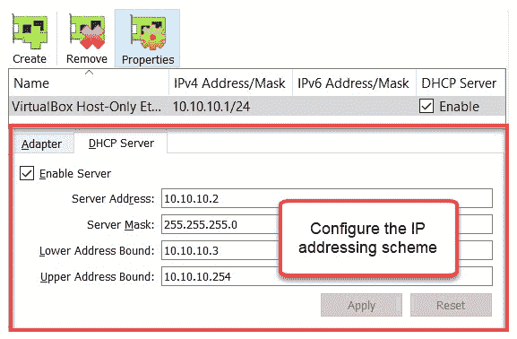
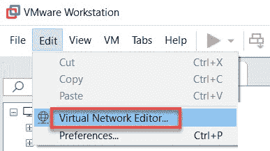
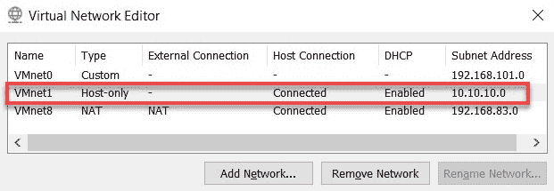
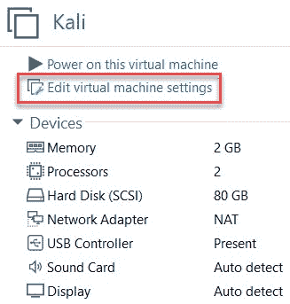
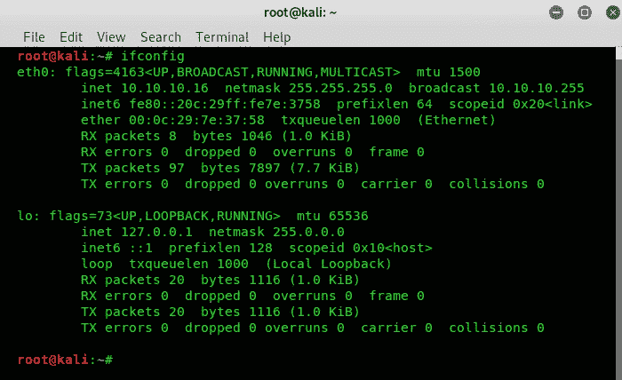
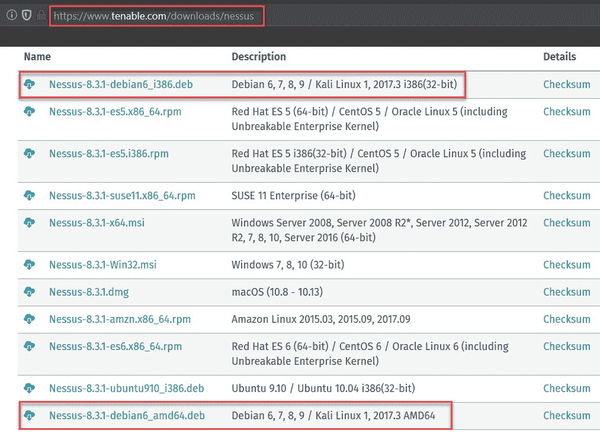
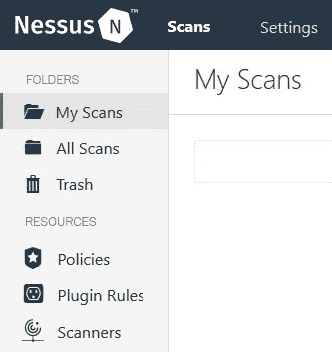
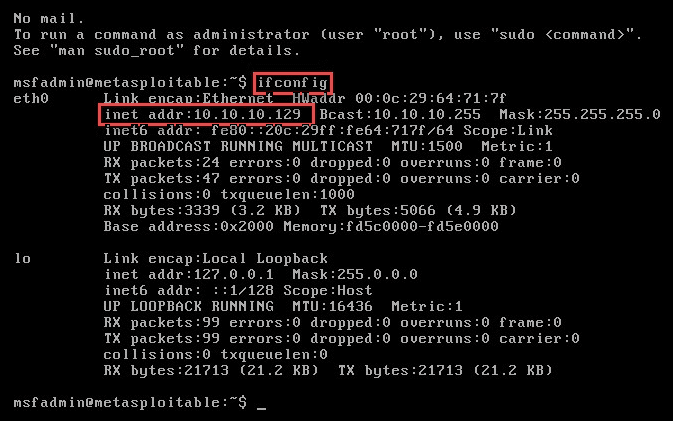

# 设置 Kali - 第 1 部分

作为未来的道德黑客和/或渗透测试人员，在测试有效载荷或练习黑客技能时，非常重要的一点是不要干扰或对其他人的计算机或网络基础设施造成任何伤害或损害，比如您所在组织的计算机或网络。为了进一步阐述，我们将使用一个简单的类比。想象一下，您在一个名为 ACME（一个虚构的组织）的公司工作，您是网络/系统管理员。您的 IT 主管注意到您对网络安全表现出兴趣，并且认为您有成为渗透测试人员或道德黑客的潜力。因此，他们批准您接受官方的渗透测试认证培训。一旦培训结束，通过**授权培训中心**（**ATC**）访问虚拟实验室的权限通常会被终止，这对您来说是一个真正的挑战：在培训课程和实验室访问结束后，您将如何练习您的黑客技能？另一个挑战是，在组织的网络上练习黑客技术是具有侵入性和非法的。

这使我们意识到建立自己的个人实验室环境对于练习和提高技能非常重要。此外，拥有自己的渗透测试实验室将使我们能够尝试新的攻击、工具和技术，而不必担心对公司网络造成侵入性或安全漏洞。最重要的是，在本章中，您将了解建立和设计适合在 Windows 和 Linux 操作系统上练习各种黑客技术的渗透测试实验室的重要性。

在本章中，我们将涵盖以下主题：

+   实验室概述

+   建立我们的实验室

+   设置 Kali Linux

+   安装 Nessus

+   设置 Android 模拟器

+   安装 Metasploitable 2

# 技术要求

为了跟上本章的练习，请确保您已满足以下硬件和软件要求：

+   Oracle VM VirtualBox

+   VMware Workstation Pro

+   Kali Linux 2019.2

+   Nessus 漏洞扫描程序

+   Android 操作系统（x86 版本 4.4-r4）

+   Metasploitable 2

# 实验室概述

在本节中，我们将讨论设计和设置我们自己的渗透测试实验室所需的方法和组件。为了建立我们的实验室，我们将建立一个虚拟实验室基础设施，以确保我们能够节省金钱，而不是不得不购买物理计算机和网络设备。

在接下来的章节中，我们将开始讨论在建立我们的渗透测试实验室环境中使用虚拟化的重要性，因为虚拟化在本章和本书的其余部分中起着重要作用。之后，我们将深入安装 Kali Linux 并创建一个虚拟网络。

# 虚拟化

根据我作为学生、教师和专业人士的经验，当一个人在 IT 领域开始学习时，通常认为需要一个物理实验室基础设施。在某种程度上，这是正确的，但建立物理实验室也有许多不利因素。

这些不利因素包括但不限于以下内容：

+   存储所需的物理空间，用于存放许多所需的服务器和网络设备。

+   每个设备的功耗将导致整体高额的财政支出。

+   每个物理设备的建造/购买成本，无论是网络设备还是服务器。

这些只是学生或初学者的一些主要关注点。在大多数情况下，一个人只有一台计算机，无论是台式机还是笔记本电脑。**虚拟化**的概念作为对这些不利因素的回应，为 IT 开启了许多大门，并使许多人和组织能够有效地优化和管理他们的硬件资源。

*什么是虚拟化，它有什么帮助？* IT 行业中的虚拟化概念允许组织减少对多个物理设备（如服务器和网络安全设备）的需求。在 IT 的早期阶段，例如 Microsoft Windows Server 这样的操作系统需要安装在单个物理设备上。通常，类似服务器的设备会包括用于 CPU 的高端处理器、大量的 RAM 和大量的存储空间。然而，很多时候硬件资源（CPU 和 RAM）会被主机操作系统（Microsoft Windows Server）低效利用。这种资源浪费通常被称为**服务器扩展**。

以下图表显示了三台物理服务器，每台都有自己的主机操作系统和可用的硬件资源：


要快速查看 Microsoft Windows 操作系统上资源的利用情况，只需打开任务管理器并选择性能选项卡。以下截图是我当前设备的截图。

我们可以看到 CPU、内存和其他资源目前都没有充分利用；仔细观察**CPU**和**内存**图表，我们可以看到它们没有超过 80%-90%，使用的容量不到 50%：


如果我们能够在单个物理设备上运行多个操作系统（如 Windows 和 Linux），我们肯定可以利用虚拟化。这将使我们能够更好地管理和有效地最大化可用资源，使用一种称为**虚拟化管理程序**的组件。

# 虚拟化管理程序

虚拟化管理程序是虚拟化中最重要的组件。它负责创建一个模拟环境，供客户操作系统用于运行。无论操作系统是为桌面、服务器、网络还是移动设备设计的，都需要特定的硬件组件来确保最佳和无缝的运行。这就是虚拟化管理程序发挥作用的地方，它让不可能的事情变为可能，允许您在一台计算机上运行多个不同的操作系统。

虚拟化管理程序可以以两种方式之一安装在硬件设备上，这将在本章的后面更详细地探讨：

+   它可以安装在主机操作系统上，如 Windows、Linux 或 macOS。

+   它可以直接安装在硬件顶部以作为本机操作系统运行。

**主机操作系统**是指直接安装在设备上的操作系统，比如运行 Windows 10 的台式机或笔记本电脑。**客户操作系统**是安装在虚拟化管理程序中的操作系统（被视为虚拟化）。

以下是可用的虚拟化管理程序类型：

+   类型 1

+   类型 2

在接下来的两节中，我们将看看两种类型的虚拟化管理程序，并了解它们的相似之处和不同之处。

# 类型 1 虚拟化管理程序

类型 1 虚拟化管理程序有时被称为**裸金属虚拟化管理程序**，因为它通常直接部署到物理服务器的硬件上。在这种模型中，安装在虚拟化管理程序上的任何操作系统都可以直接访问硬件资源，如 CPU、RAM 和**网络接口卡**（**NIC**）。这种模型允许每个客户操作系统直接与物理设备上的任何硬件组件交互；因此，使部署模型比类型 2 模型更有效。

以下图表说明了每个客户操作系统（虚拟机）如何通过虚拟化管理程序与单个物理服务器机箱的物理硬件组件进行交互。例如，虚拟机通过虚拟化管理程序直接访问物理硬件：


以下是免费和商业类型 1 虚拟化管理程序的列表：

+   VMware ESXi（免费）

+   VMware ESX（商业）

+   Microsoft Hyper-V Server（免费）

+   XCP-ng（免费/商业）

现在你对类型 1 的虚拟化管理程序有了更好的理解，让我们来了解一下类型 2 的虚拟化管理程序。

# 类型 2 虚拟化管理程序

在类型 2 的虚拟化管理程序部署模型中，虚拟化管理程序应用程序安装在主机操作系统之上，而不是直接安装在硬件组件上。主机操作系统的示例包括 Microsoft Windows、Apple macOS 和各种 Linux 版本。在类型 2 部署模型中，虚拟化管理程序无法直接访问本地系统上的硬件资源，就像在类型 1 部署模型中那样。相反，在类型 2 部署中，虚拟化管理程序与主机操作系统接口，以访问可用的任何资源。主机操作系统通常需要一定数量的资源，如 CPU 和内存利用率，以便能够以最佳方式运行，剩下的资源则提供给类型 2 虚拟机。

以下是一个图表，说明了每个组件在单个系统上（如台式机或笔记本电脑）如何与其他组件接口。仔细观察，每个虚拟机都间接访问资源（CPU、内存等）。操作系统在硬件资源方面具有优先权，剩下的资源则提供给正在运行的虚拟机：



以下是类型 2 虚拟化管理程序的简要列表。请注意，有些是免费的，而有些是商业的：

+   Microsoft Virtual PC（免费）

+   Oracle VM VirtualBox（免费）

+   VMware Player（免费）

+   VMware Workstation Pro（商业）

+   VMware Fusion（商业）

+   Parallels Desktop for Mac（商业）

你可能想知道哪种虚拟化管理程序更好——类型 1 还是类型 2？老实说，这真的取决于你的情况。就我个人而言，我在我的笔记本电脑上安装了一个类型 2 的虚拟化管理程序，里面有几台虚拟机，我用它们进行培训和在远程位置的其他情况。而在家里，我在我的家庭实验室的 Intel NUC 上安装了一个类型 1 的虚拟化管理程序，里面有多台虚拟机，每台都有不同的用途。

现在你对虚拟化管理程序的概念有了更好的了解，让我们来了解一下虚拟化管理程序的特性，因为这将帮助我们构建一个用于创建渗透测试实验室的虚拟网络。

# 其他组件

在这一部分，我们将概述完成我们的实验室所需的其他组件，包括查看虚拟交换机是什么以及我们将在实验室中使用的不同类型的操作系统。

# 虚拟交换机

你可能会想，既然我们要创建一个虚拟化实验室环境，我们要如何创建一个网络，以确保各种虚拟机之间具有连接性。我们需要一些网络电缆、网络交换机，甚至其他网络设备吗？最重要的是，我们需要确保我们的虚拟环境与我们现有网络和互联网隔离开来，因为我们不希望对公共服务器发动无意的攻击，这将是非法的并涉及法律问题。

幸运的是，每个虚拟化管理程序都包含一个虚拟交换机，为我们提供基本的第二层交换功能。一些虚拟化管理程序在它们的虚拟交换机上提供虚拟局域网（VLAN）分配，而其他一些则没有。由于我们将继续构建一个隔离的虚拟实验室，我们将需要一个单独的虚拟交换机来将我们的攻击者机器与其他易受攻击的机器连接起来。

# 操作系统

作为未来的道德黑客、渗透测试员或网络安全专业人员，建议您测试各种技术，模拟对不同类型操作系统的真实攻击。有时，在对组织的网络和服务器进行渗透测试或进行漏洞评估时，您会遇到许多不同的操作系统。我们将在实验室环境中使用以下操作系统，并为每个操作系统提供下载链接：

+   **Windows 10**：[`www.microsoft.com/en-us/evalcenter/evaluate-windows-10-enterprise`](https://www.microsoft.com/en-us/evalcenter/evaluate-windows-10-enterprise)

+   **Windows Server 2016**：[`www.microsoft.com/en-us/evalcenter/evaluate-windows-server-2016`](https://www.microsoft.com/en-us/evalcenter/evaluate-windows-server-2016)

+   **Ubuntu Server**：[`www.ubuntu.com/download/server`](https://www.ubuntu.com/download/server)

+   **Kali Linux**：[`www.kali.org/downloads/`](https://www.kali.org/downloads/)

+   **Metasploitable**：[`sourceforge.net/projects/metasploitable/files/Metasploitable2/`](https://sourceforge.net/projects/metasploitable/files/Metasploitable2/)

+   **OWASPBWA**：[`sourceforge.net/projects/owaspbwa/`](https://sourceforge.net/projects/owaspbwa/)

此处列出的每个操作系统在我们的实验室中都有独特的用途。在本章的其余部分，我们将对每个操作系统执行各种类型的攻击。

Microsoft 评估中心（[`www.microsoft.com/en-us/evalcenter/`](https://www.microsoft.com/en-us/evalcenter/)）允许用户下载和测试其平台上提供的任何应用程序和操作系统，为期 180 天，并为您选择的应用程序提供完整的功能支持。

**开放式 Web 应用安全项目**（**OWASP**）（[`www.owasp.org`](https://www.owasp.org)）创建了一个虚拟机，允许网络安全专业人员执行具有已知漏洞的各种应用程序；这就是**OWASP 破损 Web 应用程序**（**OWASPBWA**）虚拟机。Metasploitable 是由 Rapid7 创建的一个易受攻击的基于 Linux 的虚拟机（[`www.rapid7.com`](https://www.rapid7.com)）。它的目标是帮助人们在安全的环境中学习和实践渗透测试。

在本节中，我们介绍了虚拟化的基本知识，包括核心组件 hypervisor，现在我们已经准备好构建虚拟实验室环境，支持许多操作系统和用例。在下一节中，我们将研究如何将所有组件放在一起，构建我们的实验室。

# 建立我们的实验室

现在是时候组装所有组件并配置我们自己的渗透测试实验室了。在选择 hypervisor 类型之前，我们需要决定当前可用的资源。如果您目前只有一台笔记本电脑或台式电脑，我们将使用第 2 类型 hypervisor，如 Oracle VM VirtualBox 或 VMware Workstation Pro。如前所述，第 2 类型 hypervisor 部署将允许我们使用现有资源，如一台笔记本电脑或台式电脑，构建我们的虚拟实验室环境，而无需担心购买额外的硬件组件，如服务器。

要开始安装我们的 hypervisor，让我们下载并安装 Oracle VM VirtualBox：

1.  转到[www.virtualbox.org](http://www.virtualbox.org)，然后转到网站的下载部分，并根据当前操作系统选择您的平台类型：


1.  应用程序下载完成后，是时候安装它了。确保在安装向导期间使用默认配置。安装完成后，打开 VirtualBox 以确保安装成功。您应该看到类似以下截图的内容：



1.  如果您更喜欢使用 VMware Workstation 进行实验，您可以在[`www.vmware.com/products/workstation-pro.html`](https://www.vmware.com/products/workstation-pro.html)上找到它。下载后，按照安装过程中的默认配置安装应用程序。完成后，您将看到用户界面，如下截图所示：


如果您使用的是较旧版本的 Oracle VM VirtualBox 或 VMware Workstation，则无需升级，因为先前的版本已经包含了继续配置我们实验室所需的功能。

设计适当的渗透测试实验室最重要的一点是确保我们有最佳的网络设计来互连我们的虚拟机。在接下来的部分中，我们将详细介绍如何使用 Oracle VM VirtualBox 和 VMware Workstation Pro 创建虚拟网络。

# 创建虚拟网络

以下图表显示了我们将在虚拟实验室环境中使用的一般网络拓扑结构：


在接下来的部分中，我们将为实验室中的每台虚拟机分配适当的 IP 地址。每台虚拟机使用虚拟机监控程序内的虚拟交换机进行互连。路由器不是必需的，因为这只是一个简单的实验室设计。

Windows Server 2008 机器是可选的，不是必需的。

让我们看看如何构建虚拟网络：

1.  如果您使用的是 VirtualBox，请单击右侧的菜单图标，然后单击“工具”|“网络”：


将打开一个新窗口，让您选择创建、删除或修改虚拟网络适配器的属性。在本练习中，我们将创建一个新的虚拟适配器，用于连接我们的每台虚拟机在虚拟机监控程序中。这实现了虚拟交换机的效果。

1.  单击“创建”以添加新的虚拟适配器：


您的主机操作系统将花费几分钟的时间在计算机上创建新的虚拟网络适配器。

1.  创建虚拟网络适配器后，VirtualBox 中的网络管理器组件将自动为接口分配 IP 地址。但是，我们将根据自己的偏好配置 IP 地址方案。首先，只需选择虚拟网络适配器，然后单击“属性”以修改配置。

1.  确保选择手动配置适配器的选项，使用以下截图中显示的 IP 地址和子网掩码。单击“应用”以在网络适配器上注册配置：


1.  可选地，我们可以在虚拟网络适配器上配置动态主机配置协议（DHCP）服务器，以为连接到此虚拟网络的每台虚拟机提供一系列 IP 地址。如果您想启用 DHCP 服务，请使用以下配置：



1.  对于那些更喜欢 VMware Workstation 的人，我们也为您提供了支持。在 VMware Workstation 中配置虚拟网络非常简单。打开 VMware Workstation 应用程序，然后选择“编辑”|“虚拟网络编辑器...”，如下截图所示：



1.  Windows 上的用户访问控制（UAC）将提示您获取管理员权限。在提供授权后，虚拟网络编辑器窗口将打开。如您所见，有三个虚拟网络适配器：



我们将修改 VMnet1 虚拟适配器。主机专用适配器为所有连接的虚拟机和主机计算机创建了一个虚拟网络。这种类型的配置允许所有虚拟机在没有互联网连接的情况下无缝通信。

1.  要修改 VMnet1 适配器，请选择适配器并调整配置，如下面的屏幕截图所示：


这些配置复制了先前在 Oracle VM VirtualBox 中执行的配置。

现在我们已经掌握了使用 Oracle VM VirtualBox 和 VMware Workstation Pro 构建虚拟网络所需的知识，让我们开始在实验室中安装虚拟机并设置 Kali Linux。

# 设置 Kali Linux

让我们设置我们的第一个虚拟机，我们的攻击者机器，Kali Linux。Kali Linux 操作系统是基于 Debian 的 Linux 平台，包含 300 多种用于渗透测试和取证的工具。它是渗透测试人员使用最广泛的平台之一，因为它包含许多功能和相当的功能，例如以下内容：

+   全盘加密

+   支持具有紧急自毁（Nuke）功能的**Linux 统一密钥设置**（**LUKS**）加密

+   辅助功能

+   取证模式

+   带有多个持久性的 Live USB

要开始使用 Kali Linux，可以在官方网站([www.kali.org](http://www.kali.org))和 Offensive Security 域([`www.offensive-security.com/kali-linux-vm-vmware-virtualbox-image-download/`](https://www.offensive-security.com/kali-linux-vm-vmware-virtualbox-image-download/))上找到。在设置 Kali Linux 时有许多方法，例如从 ISO 文件安装和导入预配置的虚拟映像到虚拟化程序。对于我们的设置过程，我们将使用后一种方法。导入虚拟设备是无缝的，需要很少的时间；它还避免了使用 ISO 文件安装时出现的错误配置的可能性。

根据我的个人经验，使用预配置的虚拟映像设置 Kali Linux 在大多数情况下也更有效。要开始，我们可以采取以下步骤：

1.  转到[`www.offensive-security.com/kali-linux-vm-vmware-virtualbox-image-download/`](https://www.offensive-security.com/kali-linux-vm-vmware-virtualbox-image-download/)，根据您的操作系统架构下载 32 位或 64 位的 Kali Linux VMware 映像。根据您的虚拟化程序软件的供应商选择 VMware 或 VirtualBox 映像：


1.  无论您下载了 VirtualBox 还是 VMware 映像，请确保解压内容。如果您下载了 VirtualBox 映像，在文件夹中将会有一个类似命名约定的文件，如下面的屏幕截图所示：


1.  您可以右键单击文件，然后选择“打开方式”| VirtualBox Manager：


1.  接下来，**导入虚拟设备**向导将出现。只需单击导入。导入过程将需要几分钟才能完成：


导入过程完成后，您将在 VirtualBox 仪表板上看到新的虚拟机可用：


1.  将 Kali Linux 导入 VMware Workstation。确保您已经下载并解压了虚拟映像文件夹。以下是提取文件夹的内容。右键单击下面屏幕截图中显示的突出显示的文件，然后选择“打开方式”| VMware Workstation：


1.  VMware Workstation 将打开，提供导入虚拟机窗口。单击导入：


这个过程应该需要几分钟的时间来完成。完成后，新的虚拟机将在 VMware Workstation 的库中可用：


导入虚拟镜像的好处是自动完成所有配置，而不是手动使用 ISO 镜像安装操作系统。配置将包括为存储创建虚拟硬盘以及分配资源，如处理器、RAM 和 NIC。导入虚拟镜像消除了在安装阶段发生任何错误配置的可能性。导入阶段完成后，用户随后可以对各个虚拟机进行调整，例如增加或减少每个虚拟机的资源。

# 将虚拟网络连接到虚拟机

此时，我们已经创建了我们的虚拟网络适配器，并将 Kali Linux 导入到我们的 hypervisor 中。现在是时候将我们的攻击者机器 Kali Linux 连接到我们的虚拟网络（虚拟交换机）。

首先，我将指导您通过 Oracle VM VirtualBox 配置硬件资源的步骤：

1.  选择 Kali Linux 虚拟机，然后点击设置：


1.  一旦设置窗口打开，选择网络选项。在这里，您可以启用/禁用当前虚拟机上的网络适配器。选择仅主机适配器选项，虚拟网络适配器将自动选择在下面：


1.  接下来，我们将在 VMware Workstation 上进行相同的调整。首先，在 Kali Linux 虚拟机上点击编辑虚拟机设置：



虚拟机设置窗口将打开。在这里，您可以自定义 hypervisor 菜单中的任何硬件组件的设置。

1.  选择网络适配器，然后选择自定义：特定虚拟网络| VMnet1（仅主机）：


请记住，VMnet1 适配器具有我们的自定义 IP 方案。

1.  我们可以启动 Kali Linux 虚拟机，以确保它正常工作。Kali Linux 的默认用户名/密码是`root`/`toor`。

1.  一旦您成功登录，您将可以访问桌面：



现在我们清楚地了解了如何在 Oracle VM VirtualBox 和 VMware Workstation 中设置虚拟机，以及如何在每个 hypervisor 应用程序中配置虚拟网络。让我们继续设置实验室中的其他类型的应用程序和虚拟机。

# 安装 Nessus

当您进入渗透测试和漏洞评估领域时，您必须熟悉使用的一个工具是 Nessus。Nessus 是市场上最流行的漏洞评估工具之一。Nessus 应用程序使用 Web 界面进行控制，允许用户创建自定义扫描。此外，Nessus 包含各种行业的预构建扫描模板，例如**支付卡行业**（PCI）合规性扫描仪。

Nessus 的创建者 Tenable 表示，Nessus 能够检测超过 47,000 个常见漏洞和暴露（CVE）。作为未来的道德黑客/渗透测试人员，在安全审计阶段使用 Nessus 将帮助您快速发现安全漏洞。

Nessus 受到许多平台的支持，如 Windows 和 Kali Linux。**Nessus Home** 版本可供个人免费使用，并且能够在每次扫描中扫描多达 16 个 IP 地址。要获取 Nessus Home 版本，只需转到 [`www.tenable.com/products/nessus-home`](https://www.tenable.com/products/nessus-home) 并填写注册表格以获取激活许可证。注册后，您将被重定向到下载中心，在那里您可以为您的平台选择合适的版本：


如果您正在 Windows 操作系统上安装 Nessus，则该过程非常简单。下载 Windows 可执行文件并运行它。

但是，要在 Kali Linux 上安装 Nessus，请按照以下步骤进行：

1.  打开终端并运行以下命令，以升级平台上当前安装的所有应用程序：

```
apt-get update && apt-get upgrade
```

1.  通过在 [`www.tenable.com/products/nessus/nessus-essentials`](https://www.tenable.com/products/nessus/nessus-essentials) 完成注册表格，从 Tenable 获取激活代码。

1.  转到 [`www.tenable.com/downloads/nessus`](https://www.tenable.com/downloads/nessus) 的 Nessus 下载页面，并根据您的操作系统架构下载 32 位或 64 位版本：



1.  一旦 Nessus 在 Kali Linux 上被下载，打开终端，将目录更改为 `Downloads` 文件夹，并使用以下命令开始安装：

```
 dpkg -i Nessus-8.3.1-debian6_amd64.deb
```

运行上述命令的输出如下：


1.  安装完成后，使用以下命令在 Kali Linux 上启动 Nessus 服务：

```
 /etc/init.d/nessusd start 
```

如果您希望 Nessus 服务在 Kali Linux 启动过程中自动启动，可以使用以下命令启用此功能：

```
update-rc.d nessusd enable 
```

1.  一旦在 Kali Linux 上完成安装，输入 `https://localhost:8834/` 到您的网络浏览器。此时，您将被提示创建用户帐户：


1.  接下来，您将被提示输入您的 Nessus 许可证以激活产品。您需要来自 *步骤 2* 的激活代码来完成此阶段：


1.  完成激活阶段后，Nessus 将尝试连接到互联网以下载其他资源。此过程应该需要几分钟来完成：


1.  一旦您登录，您的用户仪表板将可用。在这里，您可以根据自己的喜好创建新的扫描和模板，并修改现有资源：



在本书的过程中，我们将在渗透测试阶段探索 Nessus 的功能。

完成本节后，您现在可以在 Kali Linux 上安装和设置 Nessus 漏洞扫描器。在下一节中，您将学习如何在实验室环境中安装 Android 作为虚拟机。

# 设置 Android 模拟器

作为渗透测试人员和/或道德黑客，您将在现场遇到许多不同类型的目标和操作系统。已经进入网络安全领域的一种操作系统是移动平台 Android。在本节中，我们将发现如何将 Android 操作系统版本 4.4 设置为虚拟机，以成为您渗透测试实验室环境的一部分。

请注意，[www.osboxes.org](http://www.osboxes.org) 拥有几乎每种类型操作系统的虚拟镜像仓库，包括桌面、服务器甚至移动操作系统。该网站允许您下载您选择的虚拟镜像，并将其无缝加载到诸如 Oracle VM VirtualBox 或 VMware Workstation 等虚拟化软件中。

让我们学习如何在您的渗透测试实验室中创建一个虚拟的 Android 机器：

1.  首先，转到[`www.osboxes.org/android-x86/`](https://www.osboxes.org/android-x86/)下载实验室的 Android 移动操作系统。

1.  搜索 Android-x86 4.4-r4 版本，并下载适用于您的虚拟机管理程序的 VirtualBox 或 VMware 虚拟镜像：


1.  文件下载到您的台式电脑后，解压缩文件夹以查看内容。

1.  接下来，右键单击`.ovf`文件，选择打开方式，然后选择 VMware 或 VirtualBox 选项，如下截图所示：


1.  导入向导将出现。选择导入开始过程：


导入过程需要几分钟时间完成，新的 Android 虚拟机将出现在您的虚拟机库中。

1.  我选择在我的 Android 虚拟机上使用以下配置。但是，您可以根据需要增加或减少虚拟机上的资源。确保虚拟网络适配器分配给 Custom（VMnet1），如下截图所示：


1.  启动您的 Android 虚拟机后，一旦完全加载完成，您将看到一个界面。 Android 4.4 的全部功能在您的虚拟机中都可以使用。

一旦 Android 虚拟机启动，它将在您的实验室网络中充当真实的物理 Android 设备。这模拟了一个环境，不仅具有典型的操作系统，如 Windows 和 Linux，还有移动平台，如 Android。现在您在实验室中有了一个虚拟的 Android 机器，让我们在下一节中看看如何设置一个易受攻击的基于 Linux 的虚拟机。

# 安装 Metasploitable 2

如前所述，Metasploitable 虚拟机是由 Rapid7 团队（[www.rapid7.com](http://www.rapid7.com)）创建的，目的是进行网络安全意识和培训。在本节中，我将带您了解在实验室中设置 Metasploitable 虚拟机所涉及的步骤：

1.  首先，您需要从[`sourceforge.net/projects/metasploitable/files/Metasploitable2/`](https://sourceforge.net/projects/metasploitable/files/Metasploitable2/)下载虚拟镜像文件。下载到计算机后，解压缩 ZIP 文件以查看内容。

1.  接下来，右键单击以下突出显示的文件，然后选择导入或使用您选择的虚拟机管理程序打开：


1.  导入过程完成后，新的虚拟机将出现在您的虚拟机库中（VirtualBox 或 VMware）。确保网络适配器设置为 Custom（VMnet1），就像我们实验室的虚拟网络一样：


1.  要测试虚拟机，将其启动并让其引导。引导过程完成后，您将看到登录凭据（用户名/密码）是系统横幅的一部分，`msfadmin/msfadmin`：


1.  使用凭据登录虚拟机，并使用`ifconfig`命令验证其是否具有有效的 IP 地址：



对于每台虚拟机，请确保您已记录下 IP 地址。我在本书的剩余章节中将使用的 IP 地址可能与您的有些不同，但操作系统和虚拟机配置将是相同的。

您现在在实验室中有一个易受攻击的基于 Linux 的操作系统。在练习渗透测试技术和磨练技能时，建议在实验室中拥有各种不同目标操作系统的混合。这种方法可以让您学习如何对各种不同的目标进行攻击，这很重要，因为企业网络通常有许多不同的设备和操作系统。您不希望参与的渗透测试中，目标组织主要使用 Linux 设备，而您的技能只针对基于 Windows 的系统；这对您作为渗透测试人员来说是一个不好的迹象！因此，在实验室尽可能地模拟企业网络将有助于您提高技能。

# 总结

在本章中，我们首先讨论了拥有自己隔离的实验室环境进行攻击性安全培训的重要性。我们深入探讨了虚拟化的概念，以及它如何在现在和将来帮助我们。在本章后期，我们介绍了如何在 Oracle VM VirtualBox 和 VMware Workstation 上配置虚拟网络，因为这些网络将用于连接所有虚拟机（攻击者和受害者机器）。然后，我们演示了如何将 Kali Linux 和 Android 部署到我们的渗透测试实验室中。

现在我们对设计和构建实验室环境有了基本的了解，让我们在下一章继续部署基于 Windows 和 Linux 的操作系统。

# 问题

1.  哪种类型的 hypervisor 安装在主机操作系统之上？

1.  虚拟化有哪些好处？

1.  一些免费的 hypervisor 的例子是什么？

1.  如何在 Kali Linux 中安装离线软件/应用程序？

1.  在 hypervisor 中的操作系统通常被称为什么？

# 进一步阅读

以下链接建议进行额外阅读：

+   Kali Linux 文档：[`docs.kali.org/`](https://docs.kali.org/)

+   Nessus 用户指南：[`docs.tenable.com/Nessus.htm`](https://docs.tenable.com/Nessus.htm)

+   虚拟化：[`www.networkworld.com/article/3234795/what-is-virtualization-definition-virtual-machine-hypervisor.html`](https://www.networkworld.com/article/3234795/what-is-virtualization-definition-virtual-machine-hypervisor.html)
