# 第十章：使用漏洞扫描器

在渗透测试期间，发现和分析安全漏洞起着重要作用。在渗透测试人员或道德黑客成功启动攻击之前，他们必须能够识别攻击表面上的安全弱点。攻击表面是攻击者可以尝试进入或从系统中获取数据的区域。快速识别漏洞并获得严重性评级的战略方法是使用已知和知名的漏洞扫描器。

有许多知名的漏洞扫描器，如 Acunetix、OpenVAS、Qualys、Nexpose、Nikto、Retina Network Security Scanner 和 Nessus 等。了解所有这些工具是一个好主意，但您不希望运行每个工具，因为其中一些是商业和订阅服务。

选择漏洞扫描器作为首选选择非常重要，因为有很多时候产品供应商可能无法及时提供更新以检测系统中的威胁和弱点，这对于您作为渗透测试人员可能至关重要。想象一下运行扫描以确定系统是否容易受到特定攻击的影响，而您使用的工具不包含签名更新以检测此类漏洞；结果可能不会有成果。

在本章的过程中，我们将探讨使用 Nessus 作为我们首选的漏洞扫描器。

在本章中，我们将探讨以下漏洞评估工具和主题：

+   Nessus 及其策略

+   使用 Nessus 进行扫描

+   导出 Nessus 结果

+   分析 Nessus 结果

+   使用 Web 应用程序扫描器

# 技术要求

以下是本章的技术要求：

+   Kali Linux：[`www.kali.org/`](https://www.kali.org/)

+   Nessus（基本版）：[`www.tenable.com/products/nessus/nessus-essentials`](https://www.tenable.com/products/nessus/nessus-essentials)

+   WordPress 服务器：[`www.turnkeylinux.org/wordpress`](https://www.turnkeylinux.org/wordpress)

# Nessus 及其策略

Nessus 是业内最知名和知名的漏洞扫描器之一，被许多网络安全专业人士使用。它已成为网络安全专业人员进行漏洞评估的事实行业标准。使用 Nessus 的一些好处包括以下内容：

+   发现超过 45,000 个**通用漏洞和公开漏洞**（**CVE**）

+   包含超过 100,000 个插件（用于发现漏洞）

+   频繁更新新插件以发现新披露的漏洞

+   能够识别过去三年中超过 100 个零日漏洞

让我们登录到我们的 Kali Linux 机器上的 Nessus；首先，您需要在终端窗口中使用以下命令启用 Nessus 服务：

```
service nessusd start
```

一旦成功启用服务，在 Kali Linux 中打开 Web 浏览器，输入`https://localhost:8834`到地址栏中，然后点击*Enter*。您应该看到以下登录门户网站：


使用您在设置过程中创建的用户帐户登录。登录后，主要仪表板可用。在这里，您可以配置和访问策略和插件规则，创建新扫描并查看结果。Nessus 用户界面是一个非常简单易用的界面，您很快就会非常熟悉它。

# Nessus 策略

在 Nessus 应用程序中，有许多现有的策略用于各种目的，并且新策略经常添加到数据库中。Nessus 策略是控制对目标系统进行扫描的技术方面的参数。更进一步地说，扫描的技术方面可能包括要扫描的主机设备数量、端口号和服务、协议类型（TCP、UDP 和 ICMP）、端口扫描器的类型等。

Nessus 策略还允许在基于 Windows 的操作系统、Oracle 平台等数据库应用程序以及 FTP、POP 和 HTTP 等应用层协议上使用凭据（用户名和密码）进行本地扫描。

有预安装的策略，可帮助安全从业者对系统执行合规性审计。一个例子是检查处理付款卡交易的网络是否容易受攻击，使用**内部 PCI 网络扫描**。该策略将根据**PCI 数据安全标准**（**PCI DSS**）检查任何漏洞。

Nessus 策略允许通过将哈希校验和与目标系统上的良性和恶意文件进行比较，来扫描 Windows 操作系统上的恶意软件感染。当确定网络上感染某种恶意软件的主机数量时，该策略非常方便。

要开始使用 Nessus 上的策略，请确保您当前已登录 Nessus。在左侧窗格中，单击**策略**。以下屏幕截图显示了 Nessus 家庭版中当前可用的策略。但是，如果您想解锁其他插件和策略，您需要获取专业版：

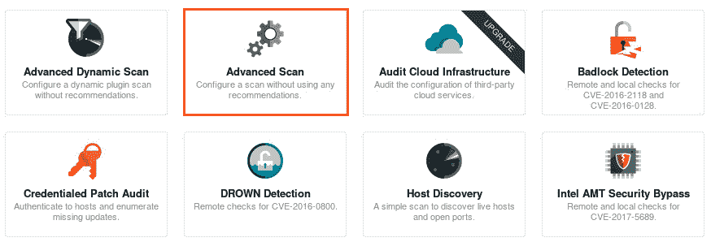

如前所述，策略包含了预定义的配置，用于扫描目标以寻找特定的漏洞，并确保系统符合合规标准。但是，作为安全专业人员，您需要自定义自己的扫描策略，以对各种类型的系统进行漏洞评估。

# 使用 Nessus 进行扫描

使用 Nessus 进行漏洞扫描非常简单。在本节中，我将指导您完成创建自定义扫描的过程。

要创建新的扫描，请使用以下过程：

1.  在右上角，单击新扫描按钮，如下图所示：


1.  您可以选择使用其中一个可用的预定义策略。如果要为目标创建自定义扫描，请选择高级扫描策略，如下图所示：

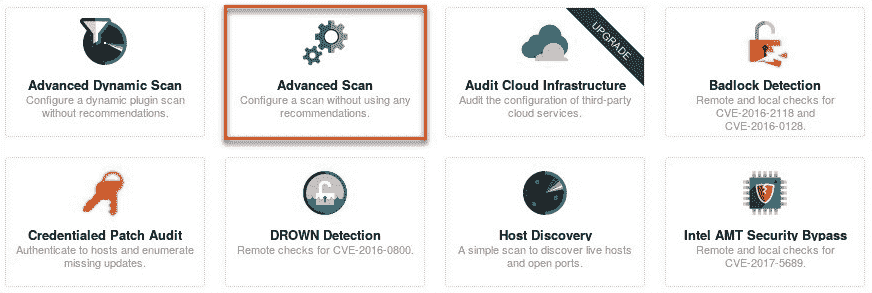

1.  策略/扫描向导将打开，为您提供许多选项来自定义新的扫描。在常规选项卡上，确保您输入名称和描述，因为它们将有助于识别此新扫描/策略的目的；一定要包括您的目标：

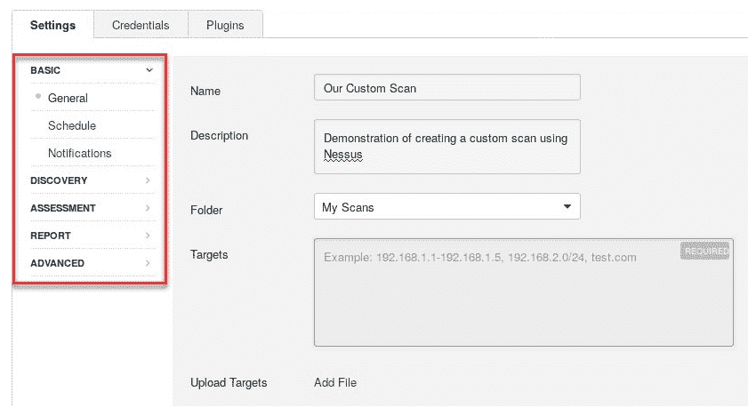

1.  您将有选项来安排扫描/策略应该运行的频率：一次、每天、每周、每月或每年。此功能允许自动运行定期漏洞扫描目标系统。如果决定为扫描创建时间表，可以使用选项设置日期和时间、时区以及重复频率：

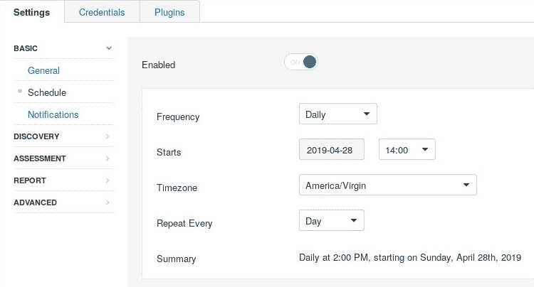

1.  如果您想接收有关扫描状态的电子邮件通知，只需单击通知选项卡并输入收件人的电子邮件地址。但是，请确保您已配置了 SMTP 服务器设置，该设置将处理电子邮件通知的传递。

1.  要访问 SMTP 服务器设置，请转到`https://localhost:8834/#/settings/smtp-server`。

发现选项卡包含以下选项：

+   +   主机发现：提供了使用 ping 方法（ARP、TCP、UDP 和 ICMP）发现网络上的主机设备的可用选项，发现网络打印机、Novell NetWare 主机和运营技术设备。

+   端口扫描：提供了可自定义的选项，用于扫描一系列端口或单个端口，使用**netstat**工具和**简单网络管理协议**（**SNMP**）对**安全外壳**（**SSH**）、**Windows 管理工具**（**WMI**）进行枚举。对 TCP 和 UDP 端口进行网络扫描和隐蔽扫描。

+   服务发现：允许将每个发现的服务映射到端口号。

评估选项卡包含以下选项：

+   +   **暴力破解**：对 Oracle 数据库进行暴力破解测试，并尝试使用 Hydra 登录网站。

+   **Web 应用程序**：Web 应用程序漏洞测试。

+   **Windows**：尝试枚举域和本地用户帐户。

+   **恶意软件**：扫描恶意软件。

以下截图显示了前一节中概述的选项：

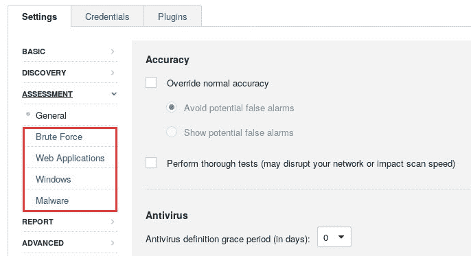

1.  完成自定义策略后，点击保存。新策略/扫描将在“我的扫描”文件夹（左侧面板）中可用。要启动新创建的策略/扫描，点击扫描，然后选择启动。

现在您已经了解了如何使用 Nessus 进行扫描，让我们深入了解 Nessus 在下一节中产生的结果。

# 导出 Nessus 结果

每当扫描完成后，我们可以简单地点击它以访问一个非常好的带有统计数据的仪表板。以 PDF、HTML、CSV 等各种格式导出结果非常简单。导出结果将允许您离线保存报告。这对于渗透测试人员来说非常有益，无论是在以后重新查看漏洞评估细节，还是向相关人员（客户或团队成员）提供报告。

要导出 Nessus 扫描的结果，请按照以下步骤进行：

1.  打开扫描，然后点击导出：


1.  您可以选择输出格式。然后，导出向导将提供另一个选项，生成最终输出作为执行摘要或根据个人偏好定制报告：


1.  如果您选择创建自定义报告，以下选项可用：

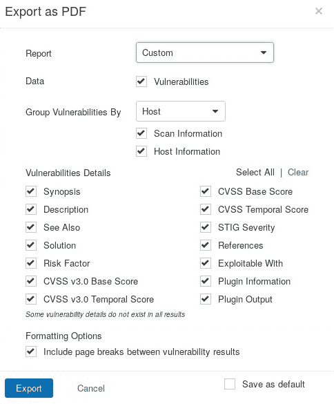

执行报告更适合不关心漏洞评估的所有技术细节而更关心报告主要概述的高级管理人员。根据所需和读者的兴趣，可以使用自定义报告来包含或删除特定细节。

以下是在我们实验室的 Metasploitable VM 上进行漏洞扫描生成的执行报告的样本：


如您所见，对于在目标上发现的每个漏洞，都会分配一个严重性评级和分数。**通用漏洞评分系统**（**CVSS**）是一个定量的漏洞评分系统，可帮助安全专业人员确定威胁、利用甚至安全弱点的严重性。

有关 CVSS 的更多信息可以在 FIRST 网站上找到[`www.first.org/cvss/`](https://www.first.org/cvss/)。

在本节中，您已经了解了导出 Nessus 结果的各种格式，离线导出报告的好处以及报告类型。在接下来的部分，我们将深入分析 Nessus 提供的输出/结果。

# 分析 Nessus 结果

使用 Nessus 创建和执行漏洞扫描非常容易；然而，在分析阶段最需要的是网络安全专业人员的思维方式。Nessus 使结果的分析变得容易。扫描完成后，您可以通过选择漏洞选项卡查看发现的漏洞列表，如下截图所示：


现在，我们能够看到在目标上发现的漏洞列表。Nessus 为我们提供了严重性评级、漏洞名称和发现数量：

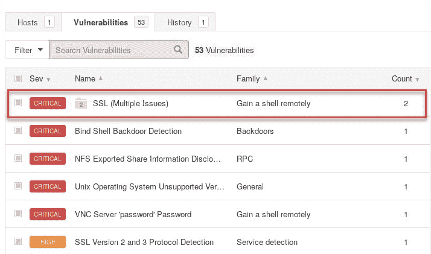

要获取有关漏洞的更多详细信息，请单击特定漏洞，例如在前面的截图中突出显示的漏洞。Nessus 将为您提供所选漏洞的详细描述、风险信息、插件详细信息、补救措施和外部参考，如下截图所示：

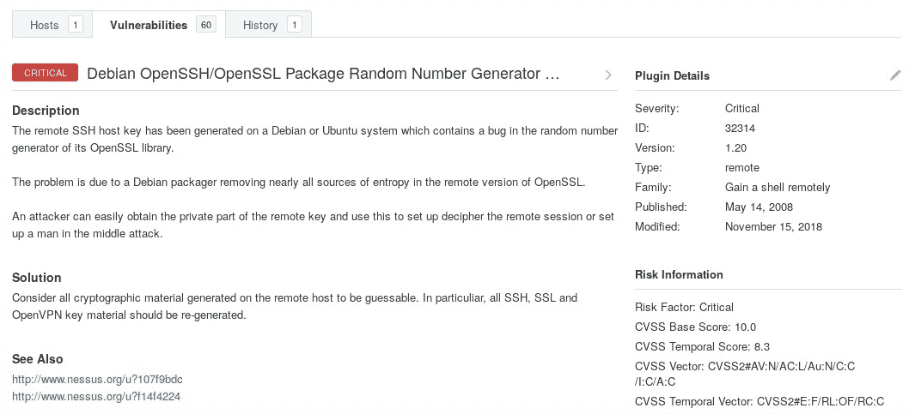

使用这些信息，渗透测试人员可以快速识别目标上的最薄弱点，并在选择有效载荷以利用目标时缩小范围。

现在您对 Nessus 及其功能有了牢固的理解。在下一节中，我们将使用各种 Web 应用程序扫描器来帮助我们检测目标服务器上的 Web 漏洞。

# 使用 Web 应用程序扫描器

Web 应用程序扫描器主要专注于检测和识别 Web 服务器、网站和 Web 应用程序上的漏洞。在您的网络安全职业生涯中，无论是作为渗透测试人员还是安全从业者，您可能会被要求对目标网站或 Web 服务器执行某种安全审计。

然而，作为一名渗透测试人员，我们需要能够发现目标网站和 Web 服务器上的安全配置错误和弱点。一个组织可能会与您签订合同，要求您对他们的网站进行渗透测试，而不是对他们的网络，甚至两者都要。请记住，对网站等对象进行渗透测试的目标是尽快识别漏洞并进行补救，以防止实际黑客能够 compromise 系统并窃取数据。

市场上有许多 Web 应用程序扫描器，从商业到免费和开源；以下是其中一些：

+   Acunetix 漏洞扫描器（商业）

+   w3af（免费）

+   Nikto（免费）

+   Burp Suite（商业和免费）

+   IBM AppScan（商业）

在本章的其余部分，我们将使用 Nikto、WPScan 和 Burp Suite 进行各种练习，以便在目标 Web 服务器上检测和识别安全漏洞。

让我们在下一节深入了解 Nikto。

# Nikto

Nikto 是一个流行的开源 Web 漏洞扫描器，并且预装在 Kali Linux 中。这个命令行工具能够识别目标网站上的安全漏洞，并为每个发现的问题提供详细的参考。Nikto 不是一个隐秘导向的工具，在执行扫描时可能会有些嘈杂。

它的一些特点如下：

+   检查 Web 服务器上是否有任何过时的组件

+   能够通过目标上的标头和文件识别已安装的应用程序

+   SSL 支持

+   执行子域猜测

+   Apache 用户名枚举

要开始使用 Nikto，在我们的 Metasploitable VM 上执行 Web 漏洞扫描。如果您还记得，在上一章中，我们对 Metasploitable 执行了端口扫描，并看到端口 `80` 是开放的。默认情况下，Web 服务器打开端口 `80`，以允许客户端和 Web 服务器之间的入站和出站通信。

使用 `nikto -h <target>` 语法在新的终端窗口中打开一个新的终端窗口，其中 `-h` 指定主机（主机名或 IP 地址）。我们使用 `nikto -h 10.10.10.100` 命令：


如果您提供主机名，Nikto 将能够通过**域名系统**（**DNS**）执行 IP 查找。在初始阶段，Nikto 试图执行操作系统和服务版本指纹识别；我们的目标使用 Ubuntu 作为其操作系统，Apache 2.2.8 作为 Web 服务器应用程序。

**Nikto** 可以在 Kali Linux 的应用程序 | 02 – 漏洞分析选项卡下找到。

输出中的每个点都是 Nikto 检测到的问题的指示，无论是缺少配置，找到对敏感目录或文件的访问，还是应用程序版本过时。对于找到的每个安全问题，都会关联一个**开放源漏洞数据库**（**OSVDB**）参考 ID。OSVBD 是一个独立的开源数据库，包含有关 Web 应用程序安全漏洞的信息。一旦 Nikto 能够在目标上识别出安全漏洞，它就会提供一个相关的 OSVDB 参考 ID。一旦获得了 OSVDB ID，您可以转到[`cve.mitre.org/data/refs/refmap/source-OSVDB.html`](http://cve.mitre.org/data/refs/refmap/source-OSVDB.html)来参考 OSVDB ID 与 CVE 条目。

有关 Nikto 的更多信息，请访问[`cirt.net/Nikto2`](https://cirt.net/Nikto2)和[`github.com/sullo/nikto`](https://github.com/sullo/nikto)。

现在您已经掌握了使用 Nikto 的基本技能，让我们在下一节中看看如何使用 WPScan。

# WPScan

为公司创建网站涉及大量的编程和工作。有许多**内容管理系统**（**CMSes**）可以让您轻松创建、管理和发布网站。想象一下，必须为网站的多个页面或多个网站静态编码 Web 语言；这将是一项艰巨的任务，需要对 Web 语言有很好的了解。CMS 允许 Web 管理员轻松地管理和更新网站的内容，同时能够集成额外的第三方 Web 插件，为用户提供更多功能。

有许多 CMS 可用；以下是其中一些：

+   WordPress

+   Joomla

+   Drupal

+   Plone

在互联网上，目前最流行的 CMS 之一是 WordPress。无论您是博主、自由职业者、初创公司还是大型组织，许多人都将 WordPress 作为首选 CMS。WordPress 是一个基于 MySQL 和 PHP 的开源 CMS。由于 WordPress 在互联网上非常流行，我们将使用 Kali Linux 中的**WPScan**工具来扫描 WordPress Web 服务器的 Web 漏洞。

首先，您需要在虚拟实验室环境中安装 WordPress 服务器。要做到这一点，请按照以下步骤：

1.  转到[`www.turnkeylinux.org/wordpress`](https://www.turnkeylinux.org/wordpress)并下载 ISO 映像或 VM 文件（使用虚拟机文件更容易设置 VM）。

1.  安装在 hypervisor 中后，确保网络配置已启用，与您的 Kali Linux 机器处于相同的网络中。

1.  打开 WordPress VM。它将从 hypervisor 中的**动态主机配置协议**（**DHCP**）服务自动接收 IP 地址。

1.  使用您的 Kali Linux 机器，执行网络和端口扫描以识别 WordPress 服务器 IP 地址。

1.  在 Kali Linux 网络浏览器中输入 IP 地址，您应该会看到 WordPress 默认网页。

1.  使用`http://<ip address>/wp-login.php` URL 将显示管理员登录页面，如下截图所示：


这是 WordPress 服务器的默认登录页面。

可选地，WPScan 工具可以在 Kali Linux 菜单的应用程序| 03 - Web 应用程序分析| CMS 和框架识别选项卡下找到。

在您的 Kali Linux 机器上，我们将使用`wpscan --url <target IP or hostname>`命令对 WordPress Web 服务器执行漏洞扫描：

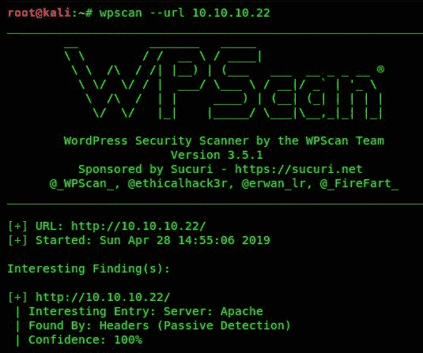

WPScan 将提供服务器平台；在我们的案例中，它是 Apache。

接下来，它将尝试发现并列出所有已知的漏洞，并为每个漏洞提供修复和参考，如下截图所示：

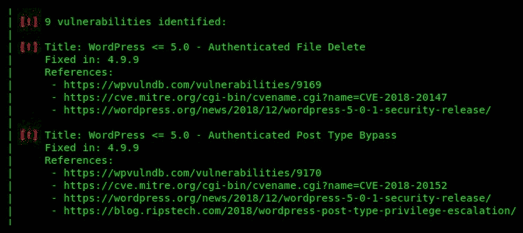

WPScan 不仅是 WordPress 的漏洞扫描器，还具有执行用户账户枚举的能力。让我们尝试在我们的 WordPress 服务器上提取用户账户；使用`wpscan --url 10.10.10.100 -e u vp`命令执行用户枚举：


在我们的结果中，发现了`admin`用户。接下来，我们可以尝试使用暴力破解技术对`admin`账户进行密码破解。

要创建用于密码破解的自定义单词列表，您可以使用 Kali Linux 中的**crunch**工具。此外，您还可以从互联网上下载单词列表。一个很好的来源是[`github.com/danielmiessler/SecLists`](https://github.com/danielmiessler/SecLists)。

使用 WPScan 和离线单词列表（我们的称为`custom_list.txt`）执行密码破解，我们使用`wpscan --url 10.10.10.100 -e u --passwords custom_list.txt`命令。

在下面的片段中，我们能够破解用户账户的密码：

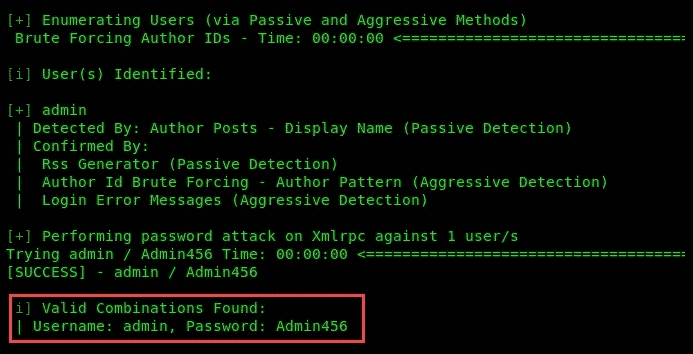

作为渗透测试人员已经获得了用户名和密码，该账户已被破解。现在我们可以登录到 WordPress 服务器的控制面板，执行各种恶意操作。

密码破解可能是一个非常耗时的过程，可能需要几分钟或几个小时才能完成。

完成了这一部分后，您已经掌握了使用 WPScan 对 WordPress 服务器进行漏洞评估的技能。在下一部分中，我们将学习另一个 Web 漏洞评估工具 Burp Suite。

# Burp Suite

Burp Suite（[`portswigger.net/burp`](https://portswigger.net/burp)）是一个**图形用户界面**（**GUI**）Web 应用程序漏洞扫描器，具有识别 100 多种通用漏洞的能力，例如 OWASP 十大关键 Web 应用程序安全风险中发现的所有漏洞。

OWASP 十大漏洞列表可以在[`www.owasp.org/index.php/Category:OWASP_Top_Ten_2017_Project`](https://www.owasp.org/index.php/Category:OWASP_Top_Ten_2017_Project)找到。

Burp Suite 应用程序允许渗透测试人员拦截 Web 服务器（Web 应用程序）和浏览器之间的所有 HTTP 和 HTTPS 请求和响应，通过其 HTTP 代理组件。通过拦截 Web 流量，Burp Suite 可以测试各种类型的漏洞和攻击，如模糊测试、暴力破解密码攻击、解码、通过蜘蛛获取隐藏的 URL 等。

在开始使用 Burp Suite 之前，请确保您的 OWASP **Broken Web Applications** (**BWA**)虚拟机（受害者机器）在线并已获得 IP 地址。

一旦 OWASP BWA VM 在线，您应该看到以下屏幕；但是，您的 IP 地址详细信息可能与所示的不同：

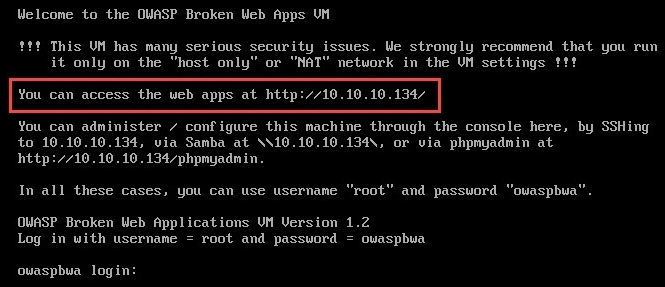

在您的 Kali Linux 机器上，通过对 OWASP BWA 虚拟机进行 ping 测试，确保端到端的连接。一旦您验证了连接，就可以打开 Burp Suite 应用程序了。

要完成此任务，请使用以下说明：

1.  转到应用程序 | 03 – Web Application Analysis | Web Application Proxies | Burp Suite。

1.  现在应用程序已经打开，向导将询问您是否要创建临时项目、在磁盘上创建新项目或打开现有项目。

1.  选择临时项目并单击“下一步”：

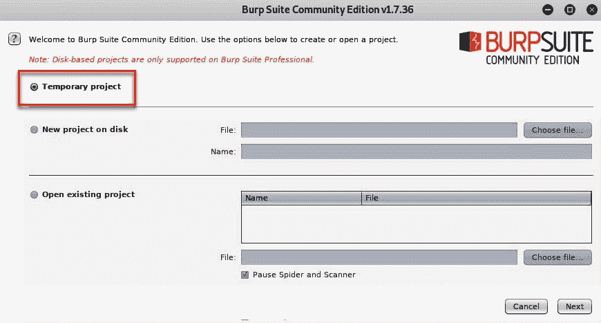

1.  下一个窗口将询问 Burp Suite 是否应该使用默认设置或从文件加载配置。选择使用 Burp 默认选项，并单击“启动 Burp”以启动用户仪表板：


Web 浏览器和目标 Web 服务器之间发送的流量不会被 Burp Suite 监视或拦截。Burp Suite 包含一个 HTTP 代理，允许应用程序在 Web 浏览器和目标 Web 服务器之间拦截 HTTP 流量。Web 浏览器不直接与 Web 服务器交互；流量从 Web 浏览器发送到 Burp Suite HTTP 代理，然后 HTTP 代理将流量转发到目标 Web 服务器，反之亦然。以下是显示 Web 浏览器和 Web 服务器之间流量流动的图表：


Burp Suite 作为一个拦截代理应用程序。默认情况下，Burp Suite 无法拦截我们的 Kali Linux 机器和 OWASP BWA 虚拟机之间的任何流量。要配置我们的网络浏览器与 Burp Suite 一起工作，请使用以下说明：

1.  打开 Firefox，点击菜单图标|首选项（选项）。

1.  在默认选项卡上，向下滚动直到看到网络代理设置（网络设置），然后点击“设置”。

1.  选择手动代理配置，并使用下一个截图中显示的配置：

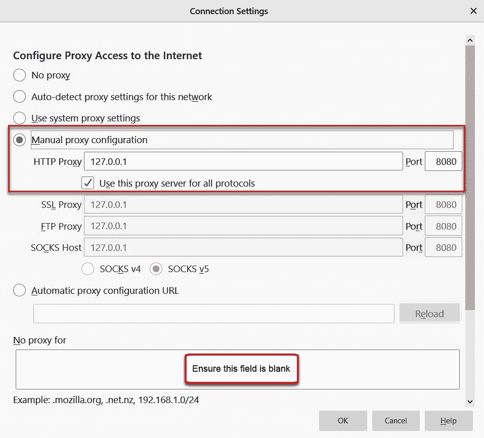

确保“不使用代理”字段为空。

1.  点击“确定”以保存 Firefox 中的设置。

现在我们已经配置了我们的网络浏览器与 Burp Suite HTTP 代理服务一起工作，让我们回到 Burp Suite 应用程序，以允许拦截流量。为此，请按照以下步骤操作：

1.  点击代理|拦截，并点击拦截打开图标以切换启用/禁用：


确保您的配置设置正确，否则练习将无法按预期进行。

如果拦截图标显示为打开状态，则 Burp Suite 能够拦截 Web 浏览器和 Web 服务器之间的流量。此外，请确保转发请求；否则，它们将留在拦截器中不会被转发，最终请求将超时。

1.  接下来，在您的 Kali Linux 机器上的 Firefox 地址栏中输入 OWASP BWA 虚拟机的 IP 地址。默认网页应该完美加载。在 Burp Suite 中，点击目标|站点地图以查看 HTTP 请求和响应：

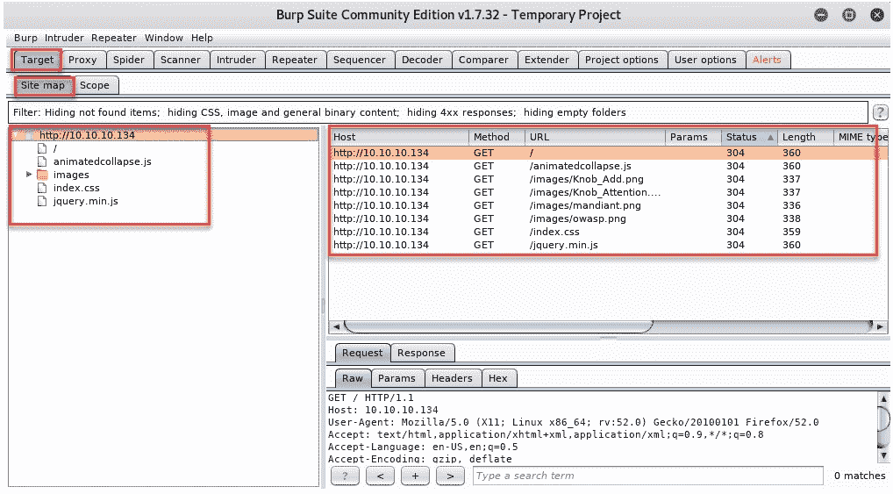

1.  在网络浏览器中，输入 OWASP BWA 虚拟机的 URL（或 IP 地址）。 HTTP 请求和响应将显示在 Burp Suite 的目标|站点地图选项卡上。

现在我们已经概述了如何使用 Burp Suite 拦截 Web 流量，让我们进一步进行攻击我们的 Metasploitable 机器。在下一节中，我们将使用 Burp Suite 执行暴力破解攻击。

# 使用入侵者进行暴力破解

Burp Suite 中的入侵者组件/模块允许渗透测试人员使用暴力破解方法执行在线密码攻击。让我们尝试获取登录到`http://<target ip addr>/mutillidae` URL 的密码：

1.  使用 Firefox 网络浏览器点击 Mutillidae II。在 Burp Suite 中，您应该在站点地图选项卡的左窗格下看到`mutillidae`文件夹出现。

1.  接下来，右键单击`mutillidae`文件夹，并选择如下截图所示的添加到范围。

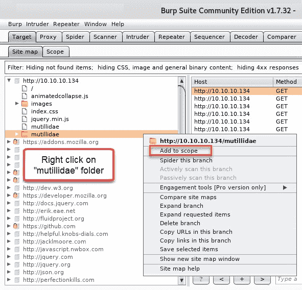

1.  以下代理历史记录窗口将出现；只需点击“是”：

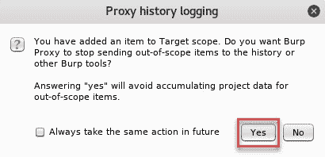

1.  要验证我们的范围是否已成功添加，请转到目标|范围选项卡：

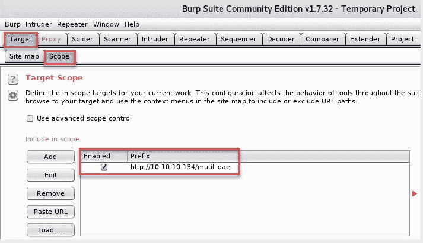

1.  现在您的范围已添加，请返回到您的网络浏览器。在 Mutillidae 网页的顶部，您将看到一个链接，允许用户进行登录尝试。使用`admin`作为用户名，`password`作为密码。登录尝试应该失败；但是，我们需要 Burp Suite 捕获有关网页上登录字段的特定细节。

让我们回到 Burp Suite 继续我们的练习。

1.  在 Burp Suite 上，单击代理|HTTP 历史选项卡，然后选择 HTTP **POST**消息，其中包含来自我们浏览器的登录尝试（您的`#`消息可能与以下片段中显示的内容不同）。选择后，右键单击并选择发送到入侵者：


1.  接下来，点击入侵者|目标选项卡，查看已设置的目标 IP 地址：

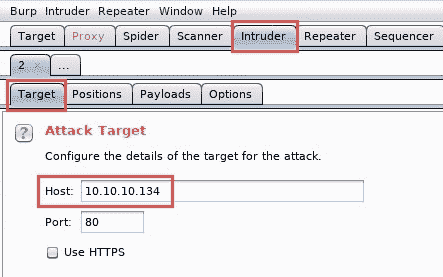

在入侵者选项卡中，有一些子选项卡，包括以下内容：

+   +   目标：允许您设置特定的目标和端口号。

+   位置：允许您选择负载将被插入到 HTTP 请求的位置。

+   有效负载：提供配置有效负载类型的能力。

+   选项：可以在此选项卡上设置其他选项。

1.  选择位置选项卡，然后单击清除按钮以清除所有选择。默认情况下，Burp Suite 已选择 HTTP 请求消息的某些区域以插入其有效负载。但是，对于我们的练习，有效负载应插入到密码字段中。

1.  突出显示单词“密码”，然后单击添加。这将允许 Burp Suite 在所选字段上插入其有效负载：


红色文本是从浏览器发送到 Web 服务器的数据。正如您所看到的，单词“密码”是我们在登录尝试中使用的值。

1.  单击有效负载选项卡。在文本字段中输入`admin`，然后单击添加；这将是我们的自定义有效负载：

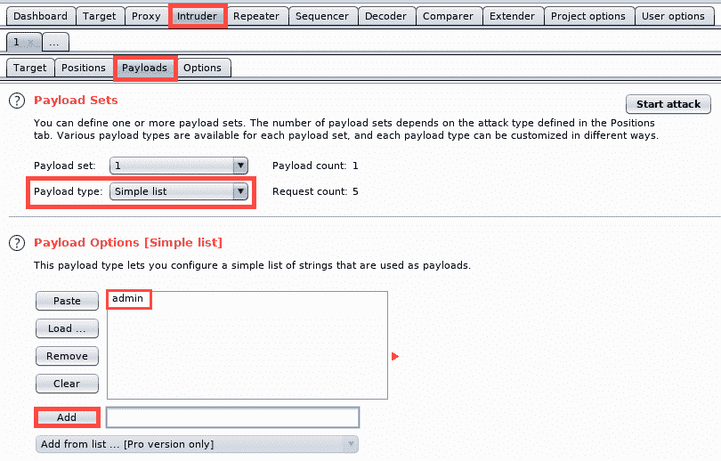

确保在有效负载和选项选项卡的其余部分中保持默认设置。

1.  当您准备好启动有效负载时，请单击开始攻击：


攻击完成后，入侵者将打开一个新窗口以提供摘要。在结果选项卡上，注意我们有一个带有 302 状态代码的 HTTP 请求消息；这意味着发生了 HTTP 重定向。换句话说，入侵者成功登录到了 Mutillidae。详细信息可以在以下截图中看到，其中包括`用户名`和`密码`：


选择具有**302**状态代码的 HTTP 请求消息，您可以在请求选项卡上看到从 Web 浏览器发送的“用户名”和“密码”。

1.  要查看来自 Web 服务器的响应，请单击响应|渲染选项卡。在这里，您将能够看到 Web 应用程序对有效负载的响应：

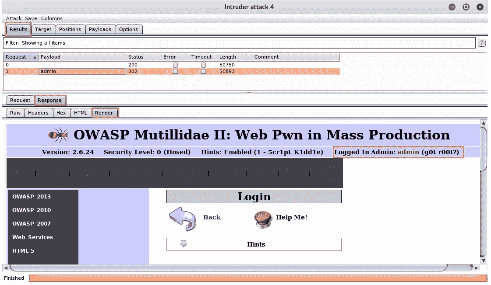

仔细观察，您会看到`admin`用户帐户已成功登录。请注意，前面截图中显示的用户帐户是有意易受攻击的 Metasploitable 虚拟机的默认管理帐户。此外，请不要在未获得合法许可的设备或网络上尝试任何形式的攻击。此练习是在实验室环境中进行的。

*Sunny Wear*的*Burp Suite Cookbook*包含了执行基于 Web 的评估的许多配方。此标题可在[`www.packtpub.com/networking-and-servers/burp-suite-cookbook`](https://www.packtpub.com/networking-and-servers/burp-suite-cookbook)找到。

正如您所看到的，Burp Suite 是进行 Web 渗透测试和漏洞评估的非常强大的应用程序。每当您被要求对 Web 服务器和网站进行安全审计时，这个工具肯定应该是您的工具清单的一部分。

# 摘要

在本章中，我们讨论了发现系统甚至 Web 服务器上的安全漏洞的必要性。我们研究了使用 Nessus 执行漏洞扫描、自定义策略和报告。此外，我们了解了 Nikto，一个开源的 Web 漏洞扫描程序，以及使用 WPScan 来检测 WordPress 中的安全配置错误和缺陷。最后，我们通过介绍了使用 Burp Suite 应用程序的基础知识，并尝试使用暴力破解来进入网站，结束了本章。

完成本章后，您现在可以成功地对目标网络和系统使用 Nessus 执行漏洞评估，并使用 Burp Suite、Nikto 和 WPScan 执行网站渗透测试。

我希望本章内容对您有所帮助，并在您的网络安全领域之旅中有所帮助。在下一章中，我们将探讨无线渗透测试的基本概念。

# 问题

以下是一些基于本章内容的问题：

1.  在 Kali Linux 中安装 Nessus 后，使用什么命令来启用 Nessus 服务？

1.  许多金融机构为其客户提供卡支付功能。为了确保机构符合行业标准，应该使用什么框架？

1.  Nessus 可以导出哪些类型的报告？

1.  您能否说出 Kali Linux 中预安装的两三个 Web 漏洞扫描程序？

1.  可以用什么工具来扫描 WordPress 网站的安全漏洞？

# 进一步阅读

+   有关 Nessus 的更多信息，请访问[`www.tenable.com/products/nessus/nessus-professional.`](https://www.tenable.com/products/nessus/nessus-professional)

+   PCI DSS 的更多信息可以在安全标准理事会网站上找到[`www.pcisecuritystandards.org/`](https://www.pcisecuritystandards.org/)。
