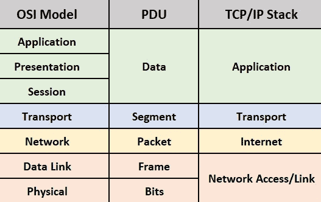
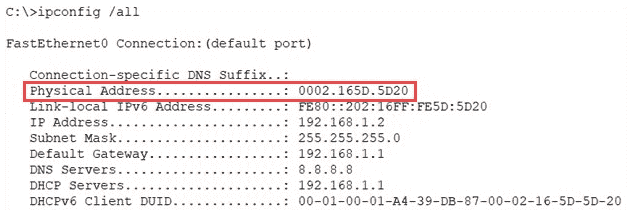
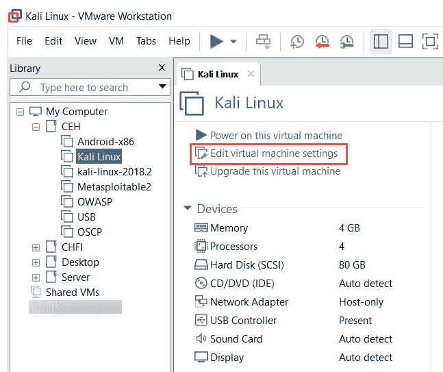
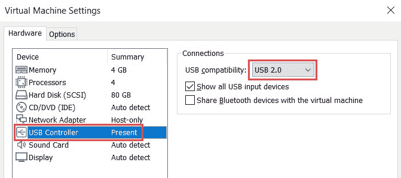
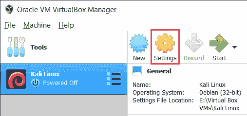
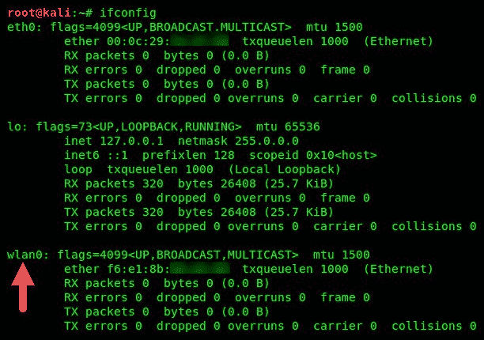

# 了解网络渗透测试

在网络渗透测试的准备阶段，了解对目标系统和/或网络基础设施进行安全测试的目标至关重要。在发起任何攻击模拟之前，通过欺骗您设备的 MAC 地址并配置无线网络适配器来监视和捕获 IEEE 802.11 无线网络上的无线流量，成为网络上的匿名用户（或假装成合法用户）非常重要。

网络渗透测试侧重于进入网络并对目标组织的内部网络中的网络安全设备、设备和系统进行安全审计（渗透测试）。在本章中，您将了解 Kali Linux 上可以配置的各种模式，如何欺骗 MAC 地址以及如何在无线网络上捕获数据包。

在本章中，我们将涵盖以下主题：

+   网络渗透测试简介

+   了解 MAC 地址

+   将无线适配器连接到 Kali Linux

+   管理和监控无线模式

# 技术要求

以下是本章的技术要求：

+   Kali Linux ([`www.kali.org/`](https://www.kali.org/))

+   VMware Workstation 或 Oracle VM VirtualBox

+   支持数据包注入的无线网络接口卡（NIC）

并非所有无线网卡都支持监视模式和数据包注入。但是，芯片组的微小修订可能导致卡无法在监视模式下工作，有些卡可能需要编译驱动程序，可能无法直接使用。

以下是 Kali Linux 支持的外部无线 NIC 的列表：

+   Atheros：ATH9KHTC（AR9271，AR7010）

+   雷凌：RT3070

+   Realtek：RTL8192CU

+   TP-Link TL-WN722N

+   TP-Link TL-WN822N v1 - v3

+   Alfa Networks AWUS036NEH

+   Alfa Networks AWUS036NHA

+   Alfa Networks AWUSO36NH

我个人建议使用 Alfa Networks AWUS036NHA 卡。

# 网络渗透测试简介

网络渗透测试的目标是发现目标网络基础设施上的任何安全漏洞。这种类型的渗透测试可以从组织外部（外部测试）或从内部（内部测试）进行。作为一名渗透测试人员，我绝对建议在目标网络上进行内部和外部安全测试。

以下是网络渗透测试的一些目标：

+   绕过外围防火墙

+   规避入侵检测系统/预防系统（IDS/IPS）

+   测试路由和交换错误配置

+   检测不必要的开放网络端口和服务

+   查找敏感目录和信息

进行网络渗透测试有助于 IT 专业人员关闭不必要的网络端口，禁用服务，解决问题，并更好地配置安全设备以减轻威胁。

在外部网络渗透测试期间，渗透测试人员试图通过攻破防火墙和任何 IDS/IPS 来访问目标组织的网络。然而，内部网络渗透测试涉及从组织内部网络进行安全测试，该网络已经位于外围防火墙设备之后。

以下是网络渗透测试过程中需要遵循的六个步骤：

1.  信息收集

1.  端口扫描

1.  操作系统和服务指纹识别

1.  漏洞研究

1.  利用验证

1.  报告

在接下来的部分，我们将简要介绍渗透测试的不同方法。

# 渗透测试类型

以下是渗透测试人员通常进行的三种安全测试类型：

+   **白盒测试**：白盒测试涉及在进行网络渗透测试之前对网络和系统拥有完整的知识，包括网络图、IP 地址方案和其他信息。这种类型的测试比灰盒和黑盒测试要容易得多，因为渗透测试人员不需要对目标网络和系统进行任何信息收集。

+   **灰盒测试**：在灰盒测试中，渗透测试人员在进行网络渗透测试之前对组织的网络基础设施和系统有限的了解。

+   **黑盒测试**：在黑盒测试中，渗透测试人员对目标组织或其网络和系统信息没有任何先验知识。关于目标提供的信息通常只是组织的名称。

现在我们已经完成了这个网络渗透测试入门部分，让我们深入了解 MAC 地址的基本知识。

# 了解 MAC 地址

在网络领域中，网络专业人员在故障排除过程中经常提到两种模型。这些模型被称为**开放系统互连**（**OSI**）参考模型和**传输控制协议/互联网协议**（**TCP/IP**）堆栈。

以下表格概述了每个模型的层次，并显示了 OSI 模型、**协议数据单元**（**PDU**）和 TCP/IP 协议套件：



通常，术语**数据包**和**帧**会被交替使用，但它们之间是有区别的。让我们更加关注帧的特性和构成。

在本节中，我们将重点关注 OSI 模型的数据链路层（第 2 层）。数据链路层负责在设备上的软件应用程序和网络的物理层之间传输数据。这是由网卡完成的。此外，在数据放置在物理层之前，数据层将网卡的物理地址，即**媒体访问控制**（**MAC**）地址，插入到帧中。这个地址有时被称为**固定地址**（**BIA**）。

设备的 MAC 地址长度为 48 位，以十六进制格式编写；因此，每个字符的范围在 0-9 和 A-F 之间。前 24 位被称为**组织唯一标识符**（**OUI**），由**电气和电子工程师协会**（**IEEE**）分配给供应商和制造商。通过了解任何有效 MAC 地址的前 24 位，您可以确定网卡和/或设备的供应商/制造商。最后的 24 位是唯一的，并由供应商分配，从而为每个设备创建一个唯一的 MAC 地址。

以下是 MAC 地址的分解：


要在 Windows 上查看 MAC 地址，请使用`ipconfig /all`命令：



然而，在基于 Linux 的操作系统上，您需要使用`ifconfig`命令：


现在我们对设备和网络上 MAC 地址的目的有了更好的了解。现在，让我们深入学习如何在 Kali Linux 中更改（欺骗）我们的 MAC 地址。

# 如何欺骗 MAC 地址

**欺骗**是网络上的一种冒充形式；它隐藏了您作为渗透测试人员的身份。离开您的 Kali Linux 机器的所有流量将包含源的新配置的 MAC 地址。

在这个练习中，我们将改变 Kali Linux 机器上 LAN 接口的 MAC 地址。按照以下简单的步骤来做：

1.  使用以下命令关闭网络接口：

```
ifconfig eth0 down
```

1.  一旦接口关闭，我们可以使用`macchanger`工具在接口上修改我们的 MAC 地址。`macchanger`工具允许您自定义您的新（伪造的）地址。要查看所有可用选项，请使用`macchanger --help`命令。

1.  要更改我们以太网（网络）接口的 MAC 地址，我们将使用`macchanger --random eth0`命令，如下面的屏幕截图所示：


1.  一旦成功更改了 MAC 地址，就可以使用以下命令打开以太网接口：

```
ifconfig eth0 up
```

1.  最后，我们现在可以使用`ifconfig`命令来验证新的 MAC 地址是否在接口上注册，如下面的屏幕截图所示：


完成了这个练习后，您现在可以在 Kali Linux 的每个网络接口上伪造 MAC 地址。在下一节中，我们将学习如何将无线适配器连接到 Kali Linux 机器。

# 将无线适配器连接到 Kali Linux

在无线网络渗透测试期间，您将需要将外部无线网卡连接到 Kali Linux 机器上。如果您直接在磁盘驱动器上安装了 Kali Linux，则只需通过 USB 连接即可连接无线网卡。适配器将自动出现在网络设置中。

然而，在使用虚拟机时可能会有些棘手。在本节中，我将演示如何将无线网络适配器连接到**VMware Workstation**和**Oracle VM VirtualBox**。

如果您使用的是 VMware Workstation，请按照以下步骤操作：

1.  首先，选择 Kali Linux 虚拟机，然后点击编辑虚拟机设置：



1.  然后，虚拟机设置将打开，为您提供一些选项来添加、删除和修改模拟的硬件资源。选择**USB 控制器**；选项将出现在窗口的右侧。根据计算机上的物理 USB 控制器选择适当的 USB 版本，并确保**显示所有 USB 输入设备**的复选框中有一个勾选：



1.  完成后，点击**确定**保存设置。启动 Kali Linux 虚拟机，并将无线适配器插入计算机上的可用 USB 端口。

在 VMware Workstation 的右下角，您会看到一些图标。这些图标代表物理硬件组件或设备。变暗的图标表示硬件或设备未连接到虚拟机，而明亮的图标表示组件或设备已连接。

1.  点击下面屏幕截图中突出显示的 USB 图标。将会出现一个菜单，提供从主机机器连接到虚拟机的 USB 设备的选项。选择无线适配器：


1.  一旦 USB 无线适配器成功连接，图标应该会亮起。现在，是时候验证 Kali Linux 是否能够看到无线适配器了。打开终端并执行`ifconfig`命令：


所有无线适配器都表示为`wlan`，后面跟着一个数字。我们的无线适配器是`wlan0`。

对于那些使用**Oracle VM VirtualBox**的人来说，这个过程与之前提到的 VMware 有些相似。使用以下步骤来完成通过 hypervisor 将无线适配器连接到 Kali Linux 的练习：

1.  要开始，请在仪表板中选择 Kali Linux 虚拟机，然后点击**设置**：



1.  一旦打开了设置菜单，请在左侧列中选择**USB**类别。确保无线适配器插入计算机的 USB 端口，并且与我们在 VMware Workstation 中所做的类似，选择**USB 2.0（EHCI）控制器**版本。

1.  接下来，点击旁边带有+符号的**USB**图标，将 USB 设备连接到虚拟机。选择 USB 无线适配器：


无线适配器将被插入**USB 设备过滤器**字段中，如下截屏所示：


1.  点击**OK**保存虚拟机的设置。启动 Kali Linux 虚拟机，并使用`ifconfig`命令验证无线适配器的状态。

完成本节后，您将具备成功连接无线适配器到 Kali Linux 虚拟机所需的技能。在下一节中，我们将看看如何在 Kali Linux 中管理和监控无线模式。

# 管理和监控无线模式

Linux 操作系统允许用户手动配置无线适配器的操作模式。

以下是不同模式和它们的解释：

+   **Ad hoc**模式用于连接多个终端设备，如笔记本电脑，而无需使用无线路由器或接入点。

+   默认的操作模式是**managed**。这种模式允许设备（即主机）连接到无线路由器和接入点。但是，有时您可能需要对组织的 Wi-Fi 网络进行无线渗透测试。在 managed 模式下的无线适配器不适合这样的任务。

+   **Master**模式允许 Linux 设备作为访问点运行，以允许其他设备同步数据。

+   **Repeater**模式允许节点设备将数据包转发到网络上的其他节点；中继通常用于扩展无线信号的范围。

+   **Secondary**模式允许设备作为主设备或中继的备份。

+   **Monitor**模式允许设备在 IEEE 802.11 的频率上传递监控数据包和帧。这种模式不仅允许渗透测试人员监视流量，还可以使用兼容的无线适配器进行**数据包注入**来捕获数据。

操作模式取决于网络拓扑和 Linux 操作系统在网络中的角色。

有两种方法可以用来配置无线适配器为监控模式：手动和使用`airmon-ng`工具。

在接下来的部分，我们将看看如何做以下事情：

+   手动启用监控模式

+   使用 airmon-ng 启用监控模式

让我们更详细地看看这些方法。

# 手动启用监控模式

在本节中，我将指导您逐步手动启用 Kali Linux 机器上无线网卡的监控模式所需的步骤。

以下说明将指导您在 Kali Linux 机器上手动启用监控模式的过程。

要开始，请打开一个新的终端窗口并执行以下命令：

1.  执行`ifconfig`命令以确定无线适配器是否连接并被 Kali Linux 操作系统识别。此外，注意接口 ID。在下面的截图中，接口是`wlan0`：



1.  现在我们有了接口 ID，使用`ifconfig wlan0 down`通过操作系统逻辑地关闭接口。在更改任何接口的模式之前，这是必要的。

1.  现在接口已关闭，是时候为我们的`wlan0`接口配置监控模式了。`iwconfig wlan0 mode monitor`命令将启用监控模式。完成后，我们需要验证接口上的模式是否已成功更改。执行`iwconfig`命令。您应该看到模式已更改为`Monitor`，如下截屏所示：


1.  最后，我们需要使用`ifconfig wlan0 up`命令将我们的`wlan0`接口启动起来。

通过完成此练习，您已经掌握了在 Kali Linux 中启用监控模式所需的技能。在下一节中，我们将看看如何使用 airmon-ng 来配置无线适配器。

# 使用 airmon-ng 启用监控模式

airmon-ng 是 aircrack-ng 套件中用于无线安全审计的工具之一。airmon-ng 是一个用于配置无线适配器为（和退出）监控模式的工具。

让我们看看如何启用和禁用监控模式：

1.  要开始，请打开一个新的终端窗口，并执行`ifconfig`或`iwconfig`命令来验证无线适配器的状态和 ID：


1.  在启用监控模式之前，我们需要终止可能阻止适配器转换为监控模式的任何后台进程。通过使用`airmon-ng check kill`命令，工具将检查可能阻止适配器转换为监控模式的任何进程并将其终止：


1.  接下来，执行`airmon-ng start wlan0`以启用监控模式。此外，将创建一个新的逻辑接口，如下面的屏幕截图所示：


1.  `wlan0mon`接口将用于监视 IEEE 802.11 网络。要禁用监控模式，只需使用`airmon-ng stop wlan0mon`命令。

通过完成此练习，您现在可以使用手动方法和 airmon-ng 工具在无线适配器上启用监控。

# 总结

在本章中，我们讨论了网络渗透测试的基本概念及其重要性。我们提供了关于将无线适配器连接到我们的 Kali Linux 机器的实用信息，讨论了 MAC 地址及其构成的目的，并讨论了如何通过修改来伪装我们的身份。此外，我们还看了如何通过手动配置和使用 airmon-ng 工具将无线适配器的默认模式更改为监控模式。

现在您已经完成了本章，您知道如何使用`airmon-ng`工具和通过 Kali Linux 操作系统手动启用监控模式。此外，您现在可以对无线网络进行监控。

希望本章内容能够为您提供信息，并在网络安全领域的旅程中为您提供帮助和指导。在下一章第九章中，“网络渗透测试-连接前攻击”，我们将深入研究网络渗透测试，并进行一些实际操作。

# 问题

以下是基于本章内容的一些问题：

1.  在 Kali Linux 中可以使用什么工具来更改 MAC 地址？

1.  您能否列举无线适配器可以配置为操作的不同模式？

1.  如何查看网络接口的 MAC 地址？

1.  如何终止可能阻止适配器转换为监控模式的任何后台进程？

# 进一步阅读

+   有关 OSI 模型和 TCP/IP 堆栈的更多详细信息，请参阅*CompTIA Network+ Certification Guide* [`www.packtpub.com/networking-and-servers/comptia-network-certification-guide`](https://www.packtpub.com/networking-and-servers/comptia-network-certification-guide)。

+   有关 aircrack-ng 和 airmon-ng 的更多信息，请参阅[`www.aircrack-ng.org/documentation.html`](https://www.aircrack-ng.org/documentation.html)。
