# 第十二章：网络渗透测试 - 连接前攻击

许多组织都有无线网络。想象一下获得对企业无线网络的访问权限，然后利用无线作为进入有线网络并破坏其他系统和设备的媒介或通道。了解无线渗透测试是至关重要的，以便能够识别可能导致此类安全漏洞的漏洞。这些技能将帮助您作为渗透测试人员，因为您将需要在目标网络上执行无线安全测试。

在本章中，我们将深入研究诸如 aircrack-ng 之类的无线黑客工具。此外，我们将介绍了解各种无线攻击工作的基本知识。这些攻击包括取消与无线访问点关联的用户、创建虚假访问点和执行密码破解。

在本章中，我们将涵盖以下主题：

+   使用 airodump-ng 开始数据包嗅探

+   使用 airodump-ng 进行有针对性的数据包嗅探

+   在无线网络上取消客户端的认证

+   创建一个伪装 AP/恶意双胞胎

+   执行密码喷洒攻击

+   设置诱饵攻击

+   利用弱加密进行凭证窃取

# 技术要求

以下是本章的技术要求：

+   **Kali Linux**：[`www.kali.org/`](https://www.kali.org/)

+   **Airgeddon**：[`github.com/v1s1t0r1sh3r3/airgeddon`](https://github.com/v1s1t0r1sh3r3/airgeddon)

+   **WordPress 服务器**：[`www.turnkeylinux.org/wordpress`](https://www.turnkeylinux.org/wordpress)

+   **Bee-Box**：[`sourceforge.net/projects/bwapp/files/bee-box/`](https://sourceforge.net/projects/bwapp/files/bee-box/)

# 使用 airodump-ng 开始数据包嗅探

要开始数据包嗅探，我们将使用`airodump-ng`工具。 `airodump-ng`具有许多功能，包括执行 IEEE 802.11 帧的原始捕获。此外，使用此工具，我们将能够查看无线 AP、关联和未关联的客户端设备（站点）、加密类型、SSID、AP 的制造商等。

在第八章中，*了解网络渗透测试*，我们概述了将无线网络适配器连接到 Kali Linux 机器并启用监视模式所涉及的程序。对于这个练习，您需要再次重复这个过程。

要启用监视模式，请执行以下步骤：

1.  将无线适配器连接到 Kali Linux。使用`ifconfig`命令验证适配器的状态。

1.  通过使用`airmon-ng check kill`命令终止可能妨碍启用监视模式的任何进程。

1.  使用`airmon-ng start wlan0`命令在无线适配器上启用监视模式。

现在您的无线适配器处于监视模式，让我们使用`airodump-ng`工具查看所有附近 AP 和站点的列表。要执行此操作，请使用以下命令：

```
airodump-ng wlan0mon
```

您的终端窗口现在将开始显示所有附近的 AP，显示以下信息：

+   `BSSID`：这是 AP 或无线路由器的 MAC 地址。

+   `PWR`：这是功率评级。功率评级越低，AP 距离无线适配器越远。

+   `Beacons`：信标是从 AP 发送的广告。信标通常包含有关 AP 的信息，例如网络名称和操作。

+   `#Data`：这是每个网络捕获的数据包数量。

+   `#/s`：此字段表示在 10 秒内每秒的数据包数量。

+   `CH`：这是 AP 的操作频道。

+   `MB`：此字段概述了 AP 支持的最大速度。

+   `ENC`：这确定了无线网络上使用的加密密码。

+   `AUTH`：这确定了无线网络上的认证协议类型。

+   `ESSID`：**扩展服务集标识符**（**ESSID**）和网络 SSID 的名称相同。

+   `STATION`：显示关联和未关联设备的 MAC 地址。

执行命令后，您的无线适配器将执行所有附近无线网络和设备的实时扫描和监视。您应该会收到类似以下的屏幕截图：

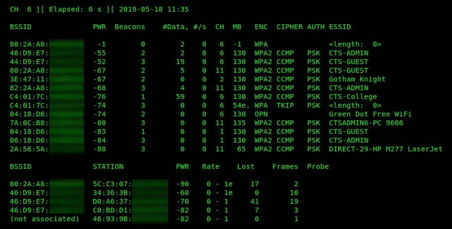

根据您的地理位置，列出的设备和网络将会有所不同。

实时查看网络流量可能会让人不知所措，特别是在我们可以看到所有附近设备的情况下。`airodump-ng`工具允许我们使用`--bssid`参数来过滤特定 AP 的输出。此外，使用`-c`参数允许我们指定 AP 所在的信道。使用以下语法：

```
airodump-ng --bissid <bssid value> -c <channel number> wlan0mon
```

您将得到类似以下的输出，其中将显示有关目标无线网络的具体细节：

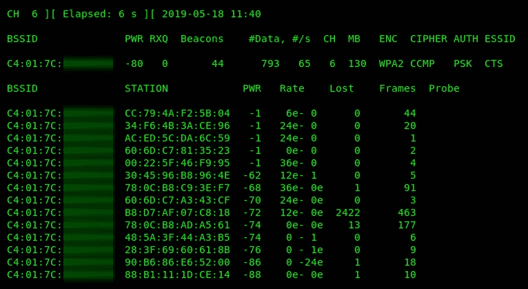

现在您已经能够进行数据包嗅探，让我们在下一节尝试将我们的攻击定向到特定目标。

# 使用 airodump-ng 进行目标数据包嗅探

在这一部分，我们将学习 airodump-ng 中的附加功能。最重要的是，我们将使用 airodump-ng 来针对特定网络；这将允许我们将攻击重点放在**特定** **目标**上，而不会对其他附近的无线网络造成任何伤害。

即使您正在过滤您的视图，流量（数据包）并没有被离线保存以供后续分析。使用`-w`参数将允许您指定文件位置以保存内容。因此，以下命令将帮助您完成此任务：

```
airodump-ng --bissid <bssid value> -c <channel number> wlan0mon -w /root/capture
```

在您的终端上使用`ls -l`命令，您会看到数据已经离线写入`root`目录：


airodump-ng 通常将捕获的数据写入五种文件类型中；这些是`.cap`、`.csv`、`.kistmet.csv`、`.kismet.netxml`和`.log.csv`格式。

您让`airodump-ng`工具运行的时间越长，离线文件中将写入越多的数据包，并最终捕获到客户端和目标 AP 之间的 WPA/WPA2 握手。在使用 Airodump-ng 进行数据包嗅探时，您将看到右上角出现**WPA 握手**消息；这表明 WPA/WPA2 握手已被 airodump-ng 捕获。捕获 WPA/WPA2 握手将帮助我们破解目标无线网络的密码。

在下一节中，我们将尝试从无线网络中去认证用户。

# 在无线网络上去认证客户端

每当客户端设备，如笔记本电脑或智能手机，试图与受密码保护的无线网络建立关联时，用户将需要提供正确的密码。如果用户提供了正确的密码，设备将在网络上得到认证，并能够访问任何可用的资源。

在去认证攻击中，攻击者或渗透测试人员试图将每个关联设备从无线 AP 中踢出。这种攻击是在攻击者机器与目标无线 AP 或网络没有任何连接（关联）的情况下执行的。

对于攻击者机器来说，要向无线 AP 发送去认证帧，需要在帧的主体中插入一个原因代码。这些代码用于通知接入点或无线路由器网络上的变化。原因代码将指示以下之一：

+   **代码 2**：以前的认证不再有效

+   **代码 3**：去认证离开

这将导致每个客户端从目标 AP 中被去认证。以下是对网络攻击的示例：

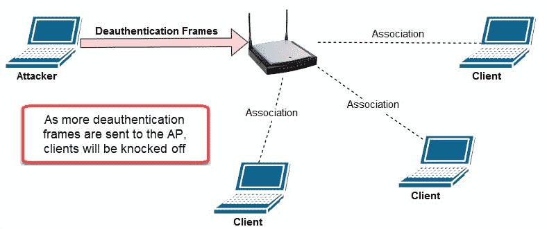

要发起去认证攻击，请执行以下步骤：

1.  在您的无线适配器上启用监视模式。

1.  使用`airodump-ng wlan0mon`命令来发现您目标的 BSSID 地址。BSSID 将被用来专门针对特定 AP 发动我们的攻击。

1.  一旦发现目标 AP，记下它的 BSSID 和操作频道，然后通过使用*Ctrl* + *C* 终止对附近 AP 的扫描。

1.  通过使用以下语法将无线监视范围缩小到特定目标 AP：`airodump-ng --bssid <bssid value> -c <channel #> wlan0mon`。这个当前的终端窗口将用于监视我们攻击的进展。

1.  打开一个新的终端窗口。这个窗口将用于使用`aireplay-ng`工具发动攻击。`aireplay-ng -0 0 -a <BSSID> wlan0mon`命令将向目标 AP 发送持续的去认证帧。

您的结果应该类似于以下截图：

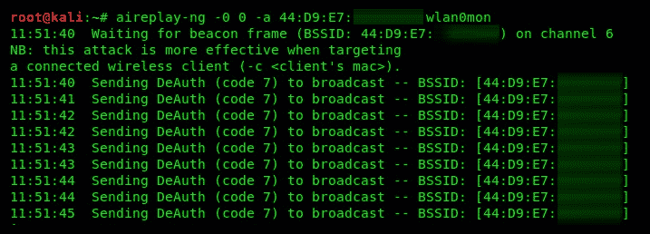

在截图中，我们可以看到`aireplay-ng`正在向我们的目标接入点发送持续的去认证帧。

在攻击过程中，切换回到您监视目标网络的第一个终端窗口。很快，您会看到客户端（站点）被断开连接，最终，WPA/WPA2 握手将被捕获。您将在您的终端上注意到，使用 airodump-ng，WPA 握手值将出现在窗口的右上角。这表明 WPA/WPA2 握手已经被捕获。在下一章中，我们将对无线网络进行密码破解。

您可以使用诸如**Hashcat** ([`hashcat.net/hashcat/`](https://hashcat.net/hashcat/)) 和**John the Ripper** ([`www.openwall.com/john/`](https://www.openwall.com/john/)) 进行密码破解。

此外，如果您想要从 AP 中去认证特定的客户端（站点），以下命令将允许这个操作：

```
aireplay-ng -0 0 -a <target's bssid> -c <client's mac addr> wlan0mon
```

以下是我们使用的每个参数的描述：

+   `-0`：这表示这是一个去认证攻击。

+   `0`：这指定要注入的帧的数量。使用`0`将创建一个持续的攻击；如果您指定`2`，则只会注入两个去认证帧。

+   `-c`：这允许您指定客户端的 MAC 地址。

在下一节中，我们将使用 Kali Linux 和各种无线工具创建一个蜜罐。

# 创建一个伪装 AP/恶意双胞胎

作为未来的渗透测试人员或道德黑客，您可能被要求为您的公司或客户组织进行广泛的无线安全测试。创建一个具有吸引力的 SSID（无线网络名称）的伪装 AP，例如`VIP_WiFi`或`Company-name_VIP`，将诱使员工建立连接。

在创建一个伪装 AP 时，目标是捕获用户凭据和敏感信息，并检测组织中的任何易受攻击的无线客户端。在部署伪装 AP 时，请考虑以下一些提示：

+   选择一个合适的位置，以确保潜在受害者有最大的覆盖范围。

+   从真实 AP 中去认证客户端，导致他们与伪装 AP 建立关联。

+   创建一个捕获用户凭据的强制门户。

要开始，我们将使用**Airgeddon**。这个工具包含了很多功能和功能，将帮助我们，从收集关于目标无线网络及其客户端的信息到发动各种类型的攻击和诱使用户与我们的伪装 AP 关联。

要开始创建一个虚假的接入点，请按照以下步骤进行：

1.  从其 GitHub 存储库下载 Airgeddon，并在您的用户帐户上给予`airgeddon.sh`脚本可执行权限。使用以下命令：

```
git clone https://github.com/v1s1t0r1sh3r3/airgeddon.git 
cd airgeddon chmod +x airgeddon.sh
```

1.  在您的终端窗口中，使用`./airgeddon.sh`命令启动 Airgeddon 界面。一旦脚本被启动，Airgeddon 将开始检查您的 Kali Linux 机器上的基本硬件和软件要求。

1.  按*Enter*几次，直到您到达接口选择提示；请务必选择您的无线适配器，如下面的屏幕截图所示：


选择选项`2`，它具有 wlan0 接口，并按*Enter*。

如果 Airgeddon 指出您缺少任何工具，请务必在继续之前安装它们。

1.  现在，您将看到 Airgeddon 的主要仪表板。在这里，您可以选择在无线适配器上在监视模式或托管模式之间切换。您将能够发动各种类型的攻击，如**拒绝服务**（**DoS**）攻击，尝试破解无线密码，捕获和解密无线握手，执行恶意双子攻击，或创建一个恶意 AP：


对于我们的攻击，我们将创建一个蜜罐，诱使受害者连接到我们的假 AP，以拦截、重定向和捕获敏感信息。

1.  接下来，将您的无线适配器设置为监视模式。您可以在 Airgeddon 菜单中使用**将接口置于监视模式**选项来完成这个操作。完成后，您应该看到您的无线适配器的状态现在已更改为**监视**模式，如下面的屏幕截图所示：


1.  选择恶意双子攻击菜单选项并按*Enter*。您将看到以下选项：


Airgeddon 不仅允许我们轻松设置一个恶意 AP 或恶意双子，而且还为我们提供了其他功能，如嗅探受害者的流量，执行任何 SSL/TLS 连接的 SSL 剥离，执行浏览器利用，甚至创建一个用于收集用户凭据的囚犯门户。

1.  让我们首先寻找一个目标。选择选项`4`并按*Enter*。一个弹出的终端窗口将打开，显示所有附近的 AP。当您准备好选择一个目标时，请选择扫描窗口：

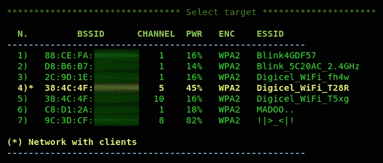

1.  选择您的目标 AP 并按*Enter*继续。此时，我们已经将无线适配器设置为监视模式并选择了我们的目标：


1.  让我们进行一个带嗅探的恶意双子攻击。选择选项`6`并按*Enter*。接下来的菜单将变为可用：

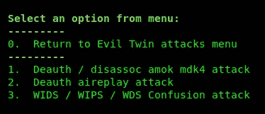

1.  选择选项`2`来对目标无线网络执行去认证攻击；这将迫使真实网络的客户端断开连接（去认证），他们将尝试连接到我们的恶意双子/恶意双子。Airgeddon 将要求您选择连接到互联网/物理网络的物理接口。目的是为受害者提供常规网络连接的假象。当他们连接并访问本地资源时，受害者会认为这是合法的网络：


1.  选择适当的接口并按*Enter*继续；再次按*Enter*以验证所选的接口。

选择欺骗你的 MAC 地址来改变你的身份。

1.  当你准备好时，发动攻击。Airgeddon 将打开几个较小的终端窗口，显示它正在执行的每次攻击的状态，如下面的屏幕截图所示：


一旦客户端连接，适当的终端窗口将为您提供更新。只需几个步骤，你现在拥有了自己的恶意双子/恶意双子。

在下一部分，我们将讨论并演示对目标系统的密码喷洒。

# 执行密码喷洒攻击

密码喷洒（有时被称为反向暴力破解）是一种通过使用有效的用户名和包含密码各种可能性的单词列表进行多次登录尝试的技术。进行密码喷洒攻击的目标是获得一组有效的用户凭据。

要执行密码喷洒攻击，我们将使用我们现有的 WordPress 服务器作为我们的目标**Burp Suite**，以在网页上获取用户名和密码输入字段，并使用`hydra`执行我们的密码喷洒攻击以找到有效的用户凭据。

要开始，请使用以下说明：

1.  配置您的网络浏览器以使用 Burp Suite 代理设置。完成后，打开 Burp Suite 并打开其拦截模式。

1.  接下来，在您的网络浏览器上，转到 WordPress 登录门户。URL 应为`http://<服务器地址>/wp-login.php`。请注意，您不应该在未经适当权限的设备或网络上尝试任何攻击。本节中执行的任务仅在实验环境中进行，仅用于教育目的。

1.  在用户名和密码字段中输入以下用户凭据，然后按*Enter*发送登录请求：

+   `uname`

+   `pass`

1.  请返回到 Burp Suite。在代理|拦截选项卡上，点击几次前进按钮，直到在**原始**子选项卡中看到一个 HTTP `POST`消息，如下面的屏幕截图所示：

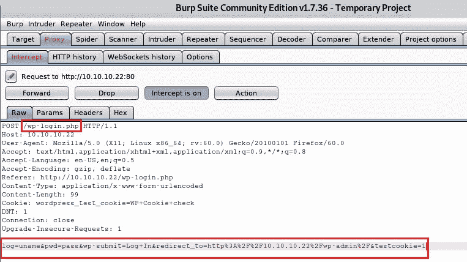

1.  在`POST`消息中，注意第一行中的目录(`/wp-login.php`)和用户名/密码字段。

1.  确保记录网页上的登录错误消息，因为它在后续步骤中是必需的：


在我们的练习中，已创建了两个自定义字词表：第一个字词表包含可能的用户名列表，第二个包含可能的密码列表。使用 Kali Linux 上的`hydra`工具，您将能够对目标 WordPress 服务器执行**密码喷洒**攻击。

1.  使用`hydra`，我们可以得到以下语法：

```
hydra -L <username list> -p <password list> <IP Address> <form parameters><failed login message>
```

1.  替换语法中的每个值，我们得到以下命令：

```
hydra -L usernames.txt -P custom_list.txt 10.10.10.22 http-form-post "/wp-login. php: log=^USER^&pwd=^PASS^&wp-submit=Log+In&redirect_to=http%3A%2F%2F10.10.10.22%2Fwp-admin% 2F&testcookie=l: Invalid username" -V
```

1.  将`uname`替换为`^USER^`，将`pass`替换为`^PASS^`，我们可以告诉`hydra`这些是用户名和密码字段。另外，指定`-V`以在终端窗口上产生详细输出。

1.  执行命令后，以下是预期输出的示例。以`[80] [http-post-form]`开头的行提供了目标的可能有效的用户名和密码，如下面的屏幕截图所示：


确保检查每个用户名和密码以验证其在目标系统上的真实性。快速向目标系统发送用户名和密码可能会导致锁定并停止我们的攻击。为了在尝试之间创建 10 秒的等待时间，使用`-w 10`参数。这是可选的；但是，它可能会减少被目标锁定或阻止的机会。

在下一节中，我们将介绍饮水源攻击的基本知识。

# 设置饮水源攻击

在 IT 安全领域，了解各种类型的攻击和威胁非常重要。其中一些攻击有一些非常不寻常的名称，在本节中，我们将介绍**饮水源攻击**的基础知识。

假设您是一家公司的 IT 安全管理员或工程师。您已经在行业内实施了最佳的安全设备，以主动检测和防止任何内部或外部的威胁。您还实施了行业最佳实践，遵守了标准，并确保您的用户（组织的员工）经常接受用户安全实践培训。您已经在组织内建立了一个安全堡垒，并确保网络边界也对新兴威胁保持警惕。

攻击者会注意到他们无法渗透您的网络，甚至社会工程技术，如钓鱼邮件，也无法成功针对您的组织。这将对妥协组织（目标）造成很大挑战，因为它受到了很好的保护。其中一种方法是进行饮水源攻击。

想象一下，在午餐时间，一些员工去附近的咖啡店喝一杯热饮或冷饮。黑客可能正在监视组织员工的活动——比如说，他们在休息时间经常去到有公共 Wi-Fi 的地方，甚至下班后也是如此。假设有一群员工经常光顾当地的咖啡店。攻击者可以妥协咖啡店的 Wi-Fi 网络，并植入一个下载到连接到网络的任何设备并在后台运行的 payload。

通过 compromise 咖啡店的 Wi-Fi 网络，攻击者正在对饮水源进行污染，包括目标组织的员工在享用饮料时使用的饮水源。假设 Alice 的智能手机在咖啡店被攻击；她将其带回组织并连接到内部（Wi-Fi）网络。此时，攻击是从内部生成的，并且可以危害网络的其余部分，甚至尝试在目标组织中创建后门。

有许多其他方法可以创建饮水源攻击；这只是一个例子。另一个例子是妥协经常有许多用户访问的合法网站，并在潜在受害者的系统上种植恶意软件。当系统感染恶意软件时，payload 可以针对其他网站或网络。

在下一节中，我们将讨论并演示如何从使用弱加密系统的系统中窃取凭据。

# 利用弱加密窃取凭据

加密在我们的日常生活中扮演着关键角色；无论是在外出时检查电子邮件，浏览喜爱的网站，还是简单地给朋友发送消息，数据加密为我们提供了一定程度的隐私保护，使得我们免受窥探。很多时候，IT 专业人员并不总是跟踪他们在维护加密技术方面的合规水平。这导致恶意用户或黑客通过攻击易受攻击的系统来获取机密数据，因为加密实践不当。

在这个练习中，我们将尝试发现目标上加密中最常见的漏洞。一旦找到，我们将利用弱加密漏洞。

要开始，请执行以下步骤：

1.  下载并设置**bee-box**虚拟机。bee-box 文件可以在[`sourceforge.net/projects/bwapp/files/bee-box/`](https://sourceforge.net/projects/bwapp/files/bee-box/)找到。

1.  安装完成后，在您的 Kali Linux（攻击者机器）上打开 Web 浏览器，输入 bee-box 的 IP 地址，然后点击*Enter*。

1.  将出现以下屏幕。点击**bWAPP**链接，如下截图所示：


1.  您将遇到一个登录门户。输入用户名`bee`和密码`bug`进行登录：

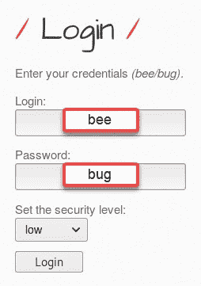

1.  在屏幕的左上角，使用下拉菜单并选择 Heartbleed Vulnerability。然后，点击 Hack 以加载目标虚拟机上的漏洞：


1.  接下来，您将看到以下屏幕：

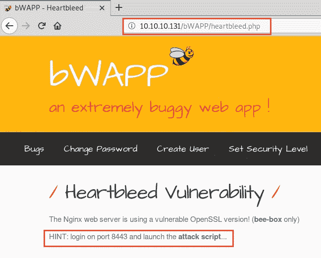

1.  在您的 Kali Linux 机器上，在地址栏中输入带有端口号`8443`的新 URL，然后点击*Enter*。新的 URL 应该是`https://10.10.10.131:8443`。确保再次使用*步骤 4*中提供的凭据登录 bWAPP 应用程序。

1.  使用 Nmap，我们可以执行漏洞扫描，以确定目标上是否存在心脏出血漏洞。要执行此任务，请使用以下命令：

```
nmap -p 8443 -script ssl-heartbleed <target IP address>
```

如果目标上存在漏洞，Nmap 将向我们呈现以下屏幕：


1.  现在我们确定了目标上存在心脏出血漏洞，是时候使用 Metasploit 进行一些利用了。在 Metasploit 中，让我们使用`search`命令来帮助我们找到一个合适的模块：

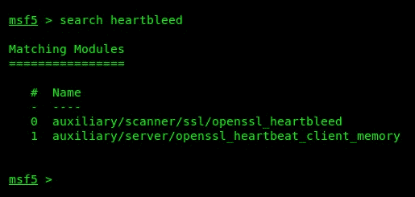

1.  搜索返回了两个可用的模块。我们将使用`auxiliary/scanner/ssl/openssl_heartbleed`模块。此外，我们将把`RHOSTS`设置为目标的 IP 地址，`RPORTS`设置为`8443`，如 bWAPP 界面的提示所指定的。以下片段显示了配置：


启动模块后，您会注意到数据正在以下屏幕中泄漏：


仔细检查输出，您会看到利用返回了`可打印信息泄漏`部分，随后是明文的 HTTP 会话信息；目标机器以数据泄漏做出了响应。如果没有发现泄漏，目标机器将不会向我们的 Metasploit 界面返回任何数据。默认情况下，数据的转储已被提取并存储在您的 Kali Linux 机器上的`/root/.msf4/loot/…`位置。

1.  使用`show info`命令，您将看到`openssl_heartbleed`模块下可执行的操作，如下图所示：

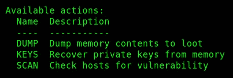

可以使用以下命令更改这些操作：

+   `set action DUMP`

+   `set action KEYS`

+   `set action SCAN`

以下是在使用`set action DUMP`命令后`.bin`文件的内容：


此外，越多的人当前访问易受攻击的应用程序，收集更多机密信息的可能性就越高，例如登录凭据。然而，在我们的练习中，我能够捕获 cookie 数据。

# 总结

在本章中，您学习了如何执行无线数据包嗅探，熟悉了数据包嗅探的基础知识，并使用`aircrack-ng`进行了有针对性的数据包嗅探。此外，您还学会了在*在无线网络上去认证客户端*部分对目标无线访问点执行去认证攻击所需的基本技能。

在*创建一个恶意 AP/恶意孪生*部分，您学习了如何使用 Airgeddon 将多个攻击链接在一起，并创建一个恶意孪生/恶意访问点。此外，密码喷洒部分提供了获取远程系统访问权限所需的技能，同时还提供了利用使用弱加密的系统的技能。

在下一章，第十章，*网络渗透测试-获取访问权限*，我们将更详细地介绍网络渗透。

# 问题

1.  什么工具可以为您的无线网络适配器启用监视模式？

1.  SSID 的另一个名称是什么？

1.  在去认证攻击期间，用于断开客户端的代码是什么？

1.  用于执行去认证的工具是什么？

# 进一步阅读

以下是一些额外的阅读资源：

+   **去认证攻击**：[`www.aircrack-ng.org/doku.php?id=deauthentication`](https://www.aircrack-ng.org/doku.php?id=deauthentication)

+   **常见 WLAN 保护机制及其缺陷**：[`hub.packtpub.com/common-wlan-protection-mechanisms-and-their-flaws/`](https://hub.packtpub.com/common-wlan-protection-mechanisms-and-their-flaws/)

+   **高级无线嗅探**：[`hub.packtpub.com/advanced-wireless-sniffing/`](https://hub.packtpub.com/advanced-wireless-sniffing/)
