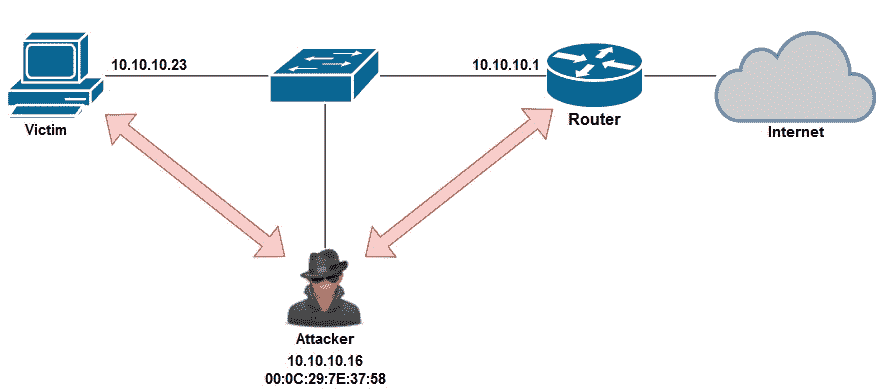
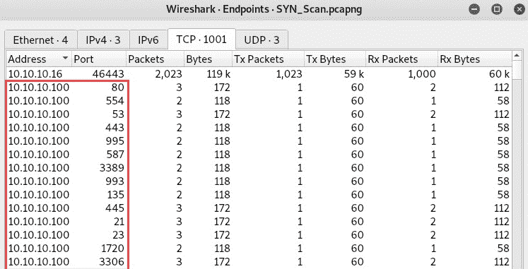
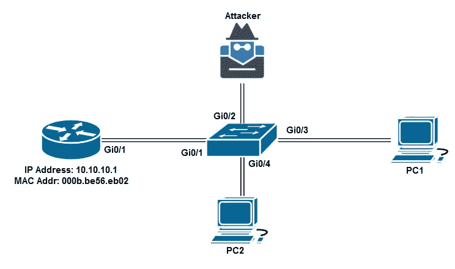

# 网络渗透测试-检测和安全

作为渗透测试人员，理解网络安全的概念本身就是一种资产。在本章中，我们将专注于网络安全运营方面的内容。了解如何检测威胁和可疑的网络流量模式是重要的，因为这将帮助 IT 安全团队检测和阻止网络上的攻击。您将学习各种**蓝队策略**，用于检测和防止组织网络基础设施内的网络攻击。在向客户提交渗透测试报告后，客户可能要求提供额外的服务，以帮助他们检测和防止组织内的网络威胁。本章将帮助您开始使用可疑流量监控和预防技术。

在本章中，我们将涵盖以下主题：

+   使用 Wireshark 理解 ARP

+   检测 ARP 欺骗攻击

+   检测可疑活动

+   **中间人攻击**（**MITM**）的补救技术

+   嗅探补救技术

# 技术要求

本章的技术要求如下：

+   Kali Linux: [`www.kali.org/`](https://www.kali.org/)

+   Wireshark Telnet 文件：[`wiki.wireshark.org/SampleCaptures#Telnet`](https://wiki.wireshark.org/SampleCaptures#Telnet)

# 使用 Wireshark 理解 ARP

**地址解析协议**（**ARP**）旨在将 IP 地址解析为 MAC 地址。ARP 的重要性有时被 IT 专业人员低估。在**局域网**（**LAN**）或同一子网内的设备之间的所有通信都使用**媒体访问控制**（**MAC**）地址。这意味着设备在通信时不使用 IP 地址，除非通信超出了它们的本地子网，比如到另一个网络（或子网）。

让我们用一个简单的类比来解释，一个 PC 想要将文件发送到网络打印机进行打印。如果这两个设备在同一个子网上，PC 将把它的消息（文件）封装在一个帧内，并发送到网络交换机。网络交换机将读取帧的目标 MAC 地址，并将其转发到网络打印机进行处理。

让我们看一下以下截图。这是 Wireshark 捕获的一帧。通过观察第 2 层协议，即 ARP，我们可以确定一些事情：


这帧是一个**地址解析协议（请求）**消息。这帧的发送者具有 MAC 地址`00:0c:29:7e:37:58`和 IP 地址`10.10.10.16`。`10.10.10.16`机器正在本地网络上进行广播。通过观察帧中的目标 MAC 地址是`ff:ff:ff:ff:ff:ff`，可以确定这一点；然而**目标 MAC 地址**为空，而**目标 IP 地址**是`10.10.10.23`。简单来说，`10.10.10.16`机器正在询问本地网络上的每个人，`10.10.10.23`是谁，设备的 MAC 地址是什么。

以下截图显示了来自`10.10.10.16`的**地址解析协议（回复）**（响应）帧。请花些时间观察帧内的所有字段：


具有 IP 地址`10.10.10.23`的设备回复了发送者（`10.10.10.16`），说它的 MAC 地址是`00:0c:29:24:be:4f`。对于`10.10.10.16`和`10.10.10.23`之间的所有未来通信，这两个设备都在它们的 ARP 缓存中拥有对方的 MAC 地址。这些 MAC 地址将用于在网络上转发帧。

在本节中，您已经学会了如何使用 Wireshark 查看和解释在网络上流动的 ARP 消息。在下一节中，我们将介绍如何检测网络上的 ARP 欺骗攻击。

# 检测 ARP 欺骗攻击

作为网络安全专业人员，您可能会被要求帮助组织识别其网络基础设施上的任何 ARP 欺骗攻击。

ARP 欺骗是指攻击者向受害者的机器发送虚假的 ARP 消息，以创建修改受害者 ARP 缓存条目的效果。这将导致受害者的机器将帧（流量）发送到网络中的一个恶意设备，而不是合法目的地。

为了解释 ARP 欺骗的检测过程，我们将使用以下拓扑：



使用 Wireshark，我们可以查找网络上端点设备之间特定流量模式。使用 Wireshark 上的`arp`过滤器，我们只能查看**ARP**消息，如下图所示：


在**信息**列中，一些数据包有不寻常的描述。通过扩展**帧 1**在**数据包详细信息**窗格中的信息，我们将能够看到发送者（攻击者）向`10.10.10.23`（一台 PC）发送了一个自发的 ARP 消息（ARP 回复）：


**帧 1**告诉`10.10.10.23`，`10.10.10.1`（网关）的 MAC 地址是`00:0c:29:7e:37:58`。这将导致受害者更新其 ARP 缓存，将`10.10.10.1`映射到`00:0c:29:7e:37:58`。然而，这个 MAC 地址属于 Kali Linux（攻击者）机器。

以下屏幕截图显示了从攻击者发送到网关（`10.10.10.1`）的帧的内容，说明 PC（`10.10.10.23`）的 MAC 地址现在是`00:0c:29:7e:37:58`：


此外，Wireshark 一直在检测 ARP 帧中的 MAC 地址重复，并发出黄色警告。请记住，Wireshark 是一个网络协议分析器，而不是威胁监控应用程序，因此需要人工干预来对网络流量进行进一步分析。安全设备和工具，如 Cisco Stealthwatch、AlienVault SIEM 和 OpenSOC，可以帮助网络安全专业人员快速识别威胁。

在本节中，您已经学会了如何使用 Wireshark 检测 ARP 欺骗攻击。在下一节中，我们将看看如何检测网络上的可疑活动。

# 检测可疑活动

在许多大型组织中，IT 部门通常会实施一个**网络运营中心**（**NOC**）来监视和解决所有与网络相关的问题。随着安全威胁的增加，组织有时会实施一个专门的团队来专注于网络安全；这个团队被称为**安全运营中心**（**SOC**）。

SOC 的责任范围从威胁监控和消除到安全设备配置、合规性、取证，甚至逆向恶意软件工程。

SOC 应该调查的一些可疑活动包括以下内容：

+   下班后异常的流量激增

+   异常的入站和出站流量

+   异常的 DNS 请求

以下屏幕截图显示了我实验室中的 Wireshark 捕获。通过仔细观察数据包的流动，我们可以看到正在进行端口扫描。


进行端口扫描的机器的 IP 地址为`10.10.10.16`，而目标的 IP 地址为`10.10.10.100`。**信息**列提供了每个数据包的简要摘要。在这里，我们可以看到对每个网络端口发送了**SYN**探测。我们可以清楚地看到网络上正在执行**SYN**（**隐形**）扫描。

要在 Wireshark 中查看所有 TCP 连接，请按照以下步骤进行：

1.  点击统计 | 端点。

1.  接下来，**端点**窗口将出现，显示所有连接到目标`10.10.10.100`的连接以及攻击者探测的端口：



作为网络安全领域的一员，您将开始培养识别网络流量中异常流量模式的技能。然而，诸如 Wireshark 之类的工具可以极大地帮助您过滤并查看网络中流动的特定类型的数据包。

在本节中，您已经学习了使用 Wireshark 检测网络上可疑活动的基础知识。在接下来的部分中，我们将介绍各种方法来预防和减轻 MITM 攻击。

# MITM 补救技术

在本节中，我们将重点讨论 IT 专业人员可以采用的一些技术，以阻止和预防针对 LAN 的 MITM 攻击。我们将讨论以下主题，以了解它们在 LAN 上阻止和预防 MITM 攻击中所扮演的角色：

+   加密

+   **动态 ARP 检查**（**DAI**）

# 加密

在 MITM 攻击期间，攻击者能够拦截受害者和通信目的地之间的所有流量。加密数据对攻击者来说是不可读的；然而，尽管加密，攻击者仍然能够查看以下细节：

+   源 IP 地址

+   目标 IP 地址

+   源端口

+   目标端口

+   第 3 层协议

在攻击者的机器上，他们只能查看以纯文本发送的流量。以下截图显示了网络上客户端和 Linux 服务器之间的 Wireshark 捕获：


服务器正在使用 Telnet 作为远程访问的方法。用户的输入以红色显示，而服务器的响应以蓝色显示。在这里，我们可以看到 Wireshark 已经重新组装了整个 Telnet 会话的所有数据包，并以美丽的对话框格式呈现出来。换句话说，我们可以看到在两台设备之间的 Telnet 会话期间发生的一切。在此捕获中，用户名和密码已被记录。

在企业网络上防止 MITM 攻击至关重要，因为每秒钟都会以多种格式在整个组织中发送敏感信息。

在接下来的部分中，我们将学习如何配置 Cisco IOS 交换机以使用 DAI。

# 动态 ARP 检查

DAI 是交换机上的一项安全功能，可防止无效的 ARP 数据包进入网络。这种技术用于防止 LAN 上的 MITM 攻击和 ARP 欺骗攻击。

在下图中，我们可以看到攻击者试图在 PC 和路由器之间的网络上执行 MITM 攻击：



为了防止此类攻击，您可以在 Cisco IOS 交换机上使用以下配置：

1.  在 VLAN 上启用**DHCP 监听**，并在所有干道端口和连接到网络上的 DHCP 服务器的接口上配置可信端口。以下配置正在进行中，以在 Cisco IOS 交换机上启用 DHCP 监听：

```
Switch(config)#ip dhcp snooping Switch(config)#ip dhcp snooping database DHCPsnoop Switch(config)#ip dhcp snooping vlan 2 Switch(config)#interface gigabitEthernet 0/1 Switch(config-if)#ip dhcp snooping trust
```

**DHCP 监听**用于防止恶意用户将**伪造的 DHCP 服务器**连接到企业网络。**信任**端口用于允许`DHCP Offer`和`DHCP ACK`数据包进入网络，而其他端口（不受信任的端口）只允许`DHCP Discover`和`DHCP Request`数据包。

干道端口能够同时传输多个 VLAN 的流量。干道端口是一个交换机和另一个交换机之间，或一个交换机和路由器之间的端口。

1.  在 VLAN 上启用 ARP 检查，并配置所有干道端口为可信端口：

```
Switch(config)#ip arp inspection vlan 2 Switch(config)#interface gigabitEthernet 0/1 Switch(config-if)#ip arp inspection trust Switch(config-if)#exit
```

1.  在交换机上创建一个第 2 层**访问控制列表**（**ACL**），将 IP 地址绑定到 MAC 地址：

```
Switch(config)#arp access-list ARP-Inspect Switch(config-arp-nacl)#permit ip host 10.10.10.1 mac 000b.be56.eb02 Switch(config-arp-nacl)#exit
```

1.  将第 2 层 ACL 映射到 VLAN。以下命令将在交换机上启用 ARP 检查：

```
Switch(config)#ip arp inspection filter ARP-Inspect vlan 2 
```

现在我们能够在 Cisco IOS 交换机上实施 DAI，让我们来看看一些额外的补救技术。

# 嗅探补救技术

检测和减轻网络嗅探器可能有些具有挑战性。网络嗅探器在网络上几乎是不可检测的，因为它被动地监听传入的网络流量。使用安全协议，如 HTTPS、**安全文件传输协议**（**SFTP**）和**安全外壳**（**SSH**）将防止嗅探器看到设备之间发送的原始消息。

此外，您可以使用 Nmap 来发现企业网络中的嗅探器。要做到这一点，请使用以下命令：

```
nmap -sV --script=sniffer-detect <target>
```

确保扫描整个子网和您组织拥有的任何其他网络。此外，IT 专业人员偶尔会对企业网络进行物理扫描，以发现是否有任何未经授权连接到企业局域网的设备。

# 总结

在本章的过程中，我们介绍了 ARP 的基本知识，以及攻击者如何利用 ARP 中的漏洞来执行 ARP 欺骗和 MITM 攻击。此外，我们还研究了使用 Wireshark 来帮助我们分析网络流量，以便快速检测 MITM 和 ARP 攻击。

现在，您已经掌握了使用 Wireshark 检测 ARP 和 MITM 攻击的知识和技能，以及如何在网络交换机上实施安全控制。我希望本章对您的学习和职业有所帮助和启发。

在第十三章中，*客户端攻击-社会工程*，您将了解各种社会工程技术。

# 问题

以下是一些基于本章内容的问题：

1.  如何防止攻击者读取您的数据？

1.  攻击者可以执行什么技术来拦截受害者的网络流量？

1.  思科 IOS 交换机支持哪种安全控制以防止 MITM 攻击？

1.  为什么 IT 专业人员不应该使用 Telnet？

1.  如何在网络上检测嗅探器？

# 进一步阅读

+   **Wireshark 文档**：[`www.wireshark.org/docs/`](https://www.wireshark.org/docs/)
