# 第二章。Metasploit 框架组织

在本章中，我们将调查 Metasploit 框架的组织结构。Metasploit 框架是由*HD Moore*于 2003 年创建的开源项目，后来于 2009 年 10 月 21 日被 Rapid7 LLC 收购。Metasploit 2.0 于 2004 年 4 月发布，这个版本包括 19 个漏洞利用和 27 个有效载荷。从那时起一直在不断开发，现在我们有 Metasploit 4.5.2，其中包括数百个漏洞利用和有效载荷。Moore 创建了这个框架用于开发利用代码和攻击易受攻击的远程系统。它被认为是支持使用 Nessus 和其他著名工具进行漏洞评估的最佳渗透测试工具之一。这个项目最初是用 Perl 开发的，后来用 Ruby 重写。自收购以来，Rapid7 还添加了两个专有版本，称为 Metasploit Express 和 Metasploit Pro。Metasploit 支持包括 Windows、Linux 和 Mac OS 在内的所有平台。

# Metasploit 接口和基础知识

首先我们将看看如何从终端和其他方式访问 Metasploit 框架。打开你的终端，输入`msfconsole`。在终端中会显示为`root@bt:~# msfconsole`。

现在我们已经从终端程序打开了`msfconsole`；然而我们还可以通过其他方式访问 Metasploit 框架，包括 MsfGUI、Msfconsole、Msfcli、Msfweb、Metasploit Pro 和 Armitage。在本书中，我们将大部分时间使用`msfconsole`。

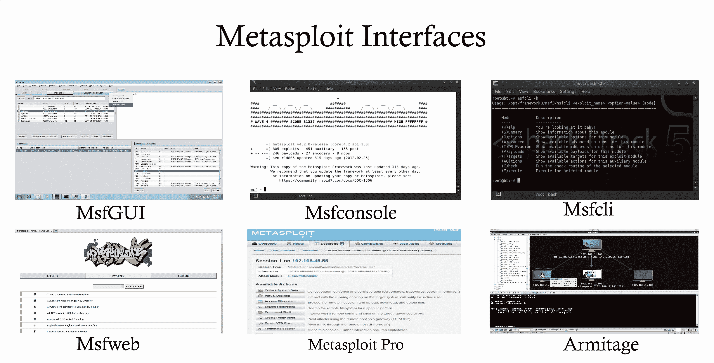

那么 Metasploit 的组织结构是怎样的呢？我们可以在这里看到许多接口。随着我们深入挖掘 Metasploit 的各个方面，我们将详细了解架构的细节。现在我们需要理解的重要事情是整体架构。这个架构是开源的，这允许你在 Metasploit 中创建自己的模块、脚本和许多其他有趣的东西。

Metasploit 的库架构如下：

+   **Rex**：这是 Metasploit 中用于各种协议、转换和套接字处理的基本库。它支持 SSL、SMB、HTTP、XOR、Base64 和随机文本。

+   **Msf::Core**：这个库定义了框架并为 Metasploit 提供了基本的应用程序接口。

+   **Msf::Base**：这个库为 Metasploit 框架提供了一个简化和友好的应用程序接口。

现在我们将更详细地探索 Metasploit 目录。只需按照以下步骤探索目录：

1.  打开你的 BackTrack5 R2 虚拟机和你的终端。输入`cd /opt/metasploit/msf3`，然后按*Enter*。现在我们已经进入了 Metasploit Framework 目录。要查看 Metasploit 目录中的文件和目录列表，输入`ls`。

1.  输入`ls`命令后，我们可以看到这里有许多目录和脚本。列出的重要目录包括`data`、`external`、`tools`、`plugins`和`scripts`。

我们将逐个探索所有这些重要的目录：

+   我们通过输入命令`cd data/`进入`data`目录。这个目录包含许多辅助模块，如`meterpreter`、`exploits`、`wordlists`、`templates`等。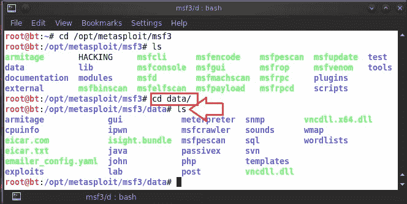

+   接下来我们将探索`meterpreter`目录。输入`cd meterpreter/`进入目录，我们会看到许多`.dll`文件。实际上，它包含`.dll`文件以及其他有趣的东西，通常需要启用 Meterpreter 功能的**后期利用**。例如，我们可以在这里看到不同类型的 DLL 文件，如 OLE、Java 版本、PHP 版本等。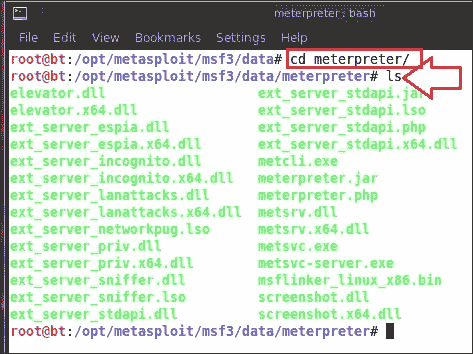

+   `data`目录中的另一个目录是`wordlist`目录。该目录包含不同服务的用户名和密码列表，如 HTTP、Oracle、Postgres、VNC、SNMP 等。让我们探索`wordlist`目录，输入`cd ..`并按*Enter*键从`meterpreter`目录返回到`data`目录。之后，输入`cd wordlists`并按*Enter*键。

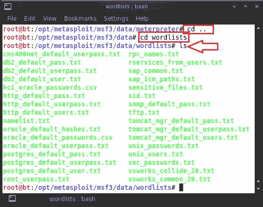

+   另一个有趣的目录是`msf3`中的`external`，其中包含 Metasploit 使用的外部库。让我们通过输入`cd external`来探索`external`目录。

+   然后看看`scripts`目录，该目录包含在`msf3`目录中。该目录包含许多被 Metasploit 使用的脚本。输入`cd scripts`然后输入`ls`命令来查看文件和文件夹列表。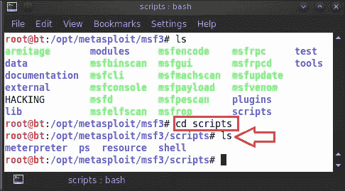

+   `msf3`中的另一个重要目录是`tools`目录。该目录包含用于利用的工具。我们将通过输入`cd tools`然后输入`ls`命令来探索`tools`目录，以查看诸如`pattern_create.rb`和`pattern_offset.rb`之类的工具列表，这些工具对于利用研究非常有用。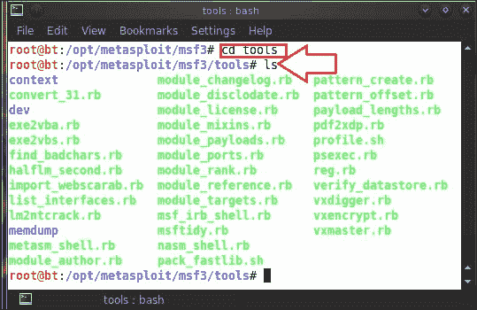

+   最后一个有用的目录是`msf3`目录中的`plugins`。`plugins`目录包含用于将第三方工具（如 nessus 插件、nexpose 插件、wmap 插件等）与 Metasploit 集成的插件。让我们通过输入`cd plugins`然后输入`ls`命令来查看插件列表。

通过前面的解释，我们现在对 Metasploit 的目录结构和功能有了简要的了解。一个重要的事情是更新 Metasploit 以获得最新版本的利用。打开你的终端，输入`msfupdate`。更新最新模块可能需要几个小时。

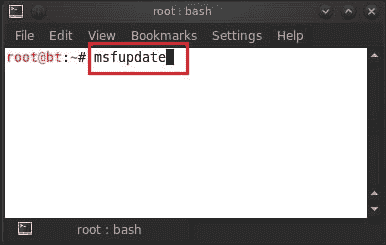

# 利用模块

在转向利用技术之前，首先我们应该了解利用的基本概念。利用是利用特定漏洞的计算机程序。

现在看看`msf3`的模块目录中的利用模块。打开你的终端，输入`cd /opt/metasploit/msf3/modules/exploits`，然后输入`ls`命令来查看利用列表。

在这里我们可以看到利用模块的列表。基本上，利用是根据操作系统进行分类的。因此，让我们通过输入`cd windows`来查看利用模块的`windows`目录。

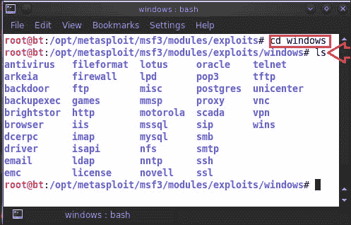

在`windows`目录中，我们可以看到许多根据 Windows 服务进行分类的利用模块，如`ftp`、`smb`、`telnet`、`browser`、`email`等。在这里，我们将通过探索一个目录来展示一种类型的服务利用。例如，我们选择`smb`。

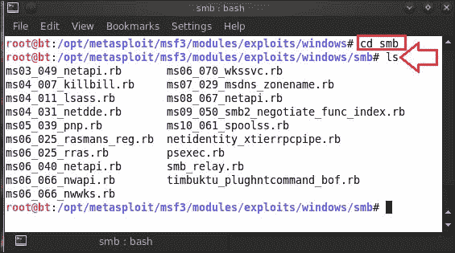

我们看到了基本上是 Ruby 脚本的`smb`服务利用的列表。因此，要查看任何利用的代码，我们输入`cat <exploitname>`。例如，这里我们选择了`ms08_067_netapi.rb`。所以我们输入`cat ms08_067_netapi.rb`。

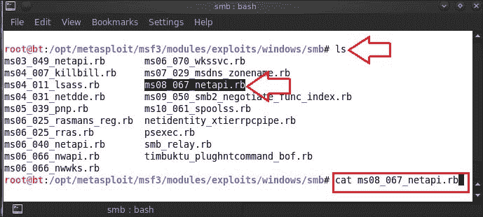

同样，我们可以根据操作系统和其服务来探索所有类型的利用。

## 辅助模块

辅助模块是没有有效载荷的利用。它们用于各种任务，如端口扫描、指纹识别、服务扫描等。辅助模块有不同类型，如协议扫描器、网络协议模糊器、端口扫描器模块、无线模块、拒绝服务模块、服务器模块、管理访问利用等。

现在让我们探索`msf`目录下的辅助模块目录。输入`cd /opt/metasploit/msf3/modules/auxiliary`，然后使用`ls`命令查看辅助模块列表。

在这里我们可以看到辅助模块的列表，比如`admin`、`client`、`fuzzers`、`scanner`、`vsploit`等。现在我们将作为辅助模块探索 scanner 目录。

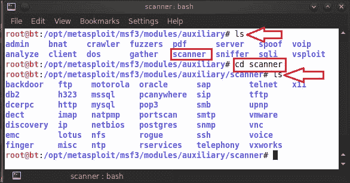

在`scanner`目录中，我们将看到根据服务扫描进行分类的模块。我们可以选择任何服务模块进行探索。在这里我们将选择`ftp`作为扫描器模块。

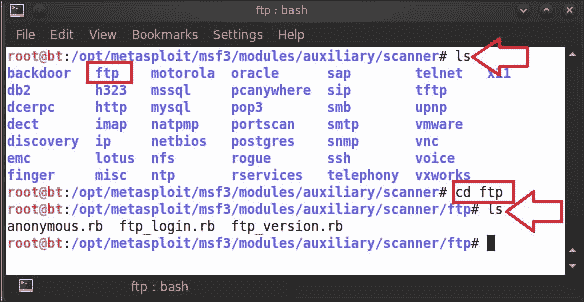

在`ftp`目录中，我们可以看到三个 Ruby 脚本。要查看 exploit Ruby 代码，只需输入`cat <module name>`；例如，在这里我们会输入`cat anonymous.rb`。

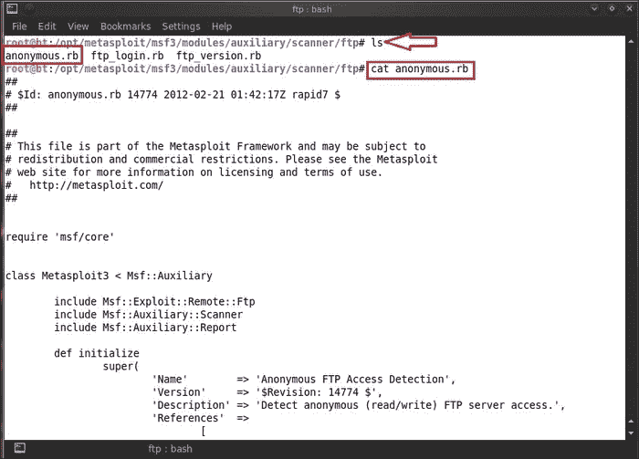

# 深入了解 Payloads

Payload 是在系统被入侵后运行的软件。Payload 通常附加到 exploit 并随其一起交付。在 Metasploit 中有三种不同类型的 payload，分别是`singles`、`stagers`和`stages`。Stages payload 的主要作用是它们使用小型 stagers 来适应小的利用空间。在利用过程中，exploit 开发者可以使用的内存非常有限。stagers 使用这个空间，它们的工作是拉取其余的 staged payload。另一方面，singles 是独立的和完全独立的。就像运行一个小的可执行文件一样简单。

让我们看一下以下截图中的`payload` `modules`目录：

Singles 是用于特定任务的独立 payload，比如创建用户、绑定 shell 等。举个例子，`windows`/`adduser` payload 用于创建用户账户。现在我们将探索`singles` payload 目录。在这里我们会看到 payload 被根据操作系统进行分类，比如 AIX、BSD、Windows、Linux 等。

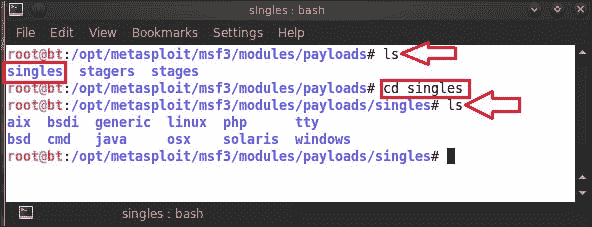

我们将使用`windows`目录来演示 payload 的工作原理。

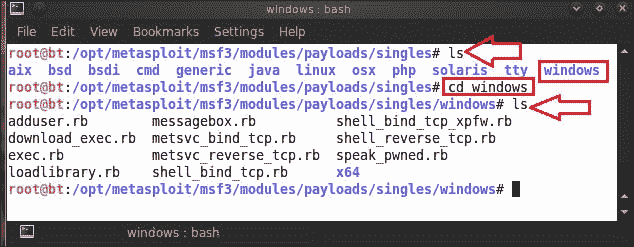

我们将使用已经解释过的`adduser` payload。我们可以通过输入`cat adduser.rb`来查看这个 payload 的代码。

Stagers 是使攻击者和受害者机器之间建立连接的 payload。举个例子，如果我们想要注入`meterpreter` payload，我们无法将整个 Meterpreter DLL 放入一个 payload 中，因此整个过程被分成两部分。第一部分是称为 stagers 的较小的 payload。在执行 stagers 后，它们会在攻击者和受害者之间建立网络连接。通过这个网络连接，一个更大的 payload 被传递到受害者机器上，这个更大的 payload 被称为 stages。

现在我们将探索`stagers` payload 目录。正如我们在下面的截图中所看到的，payload 被根据不同的操作系统进行分类：

举个例子，我们将探索`bsd`目录并检查 payload 列表。

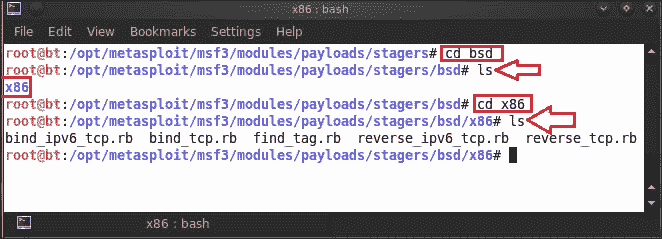

Stages 是被 stagers payload 下载并执行的 payload 类型，比如 Meterpreter、VNC 服务器等。

现在我们将探索`stages`目录以查看 payload 列表。

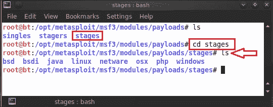

在这里我们看到了与`singles`和`stagers`目录中相同的结果；payload 被根据不同的操作系统进行分类。我们打开`netware`目录查看列表。

# 摘要

在本章中，我们介绍了 Metasploit Framework 的不同接口和架构。本章的流程包括了 Metasploit 的操作技术，然后是架构基础。我们进一步介绍了各种 Metasploit 库和应用接口，如 Rex、Msf core 和 Msf base。然后我们深入探讨了 Metasploit 目录以及重要目录的描述。

然后我们转向 exploit 目录，并简要解释了如何根据操作系统和其服务对 exploits 进行分类。然后我们转向辅助目录，并探讨了如何根据服务对辅助模块进行分类，如扫描和模糊测试。

我们还介绍了另一个重要的目录，即 payload 目录，它展示了 payloads 如何被分类为三种不同类型。我们还根据操作系统对 payloads 进行了进一步分类。

通过本章，我们能够介绍基本的 Metasploit Framework 和架构。在下一章中，我们将开始一些有关利用基础的实际操作。

# 参考资料

以下是一些有用的参考资料，进一步阐明了本章涉及的一些主题。

+   [`en.wikipedia.org/wiki/Metasploit_Project`](http://en.wikipedia.org/wiki/Metasploit_Project)

+   [`www.offensive-security.com/metasploit-unleashed/Metasploit_Architecture`](http://www.offensive-security.com/metasploit-unleashed/Metasploit_Architecture)

+   [`www.offensive-security.com/metasploit-unleashed/Metasploit_Fundamentals`](http://://www.offensive-security.com/metasploit-unleashed/Metasploit_Fundamentals)

+   [`www.offensive-security.com/metasploit-unleashed/Exploits`](http://://www.offensive-security.com/metasploit-unleashed/Exploits)

+   [`www.offensive-security.com/metasploit-unleashed/Payloads`](http://://www.offensive-security.com/metasploit-unleashed/Payloads)

+   [`www.securitytube.net/video/2635`](http://www.securitytube.net/video/2635)

+   [`metasploit.hackplanet.in/2012/07/architecture-of-metasploit.html`](http://metasploit.hackplanet.in/2012/07/architecture-of-metasploit.html)
