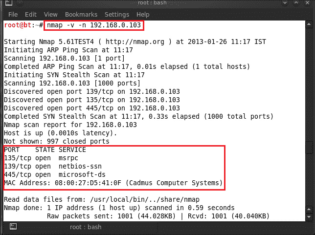
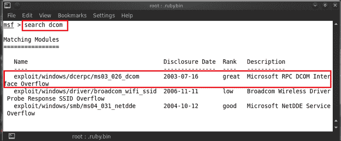
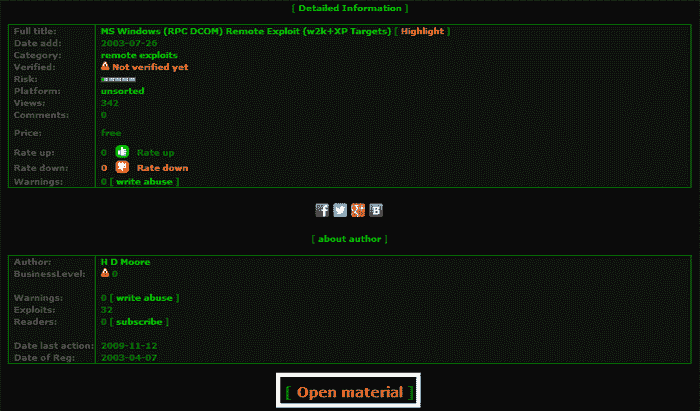
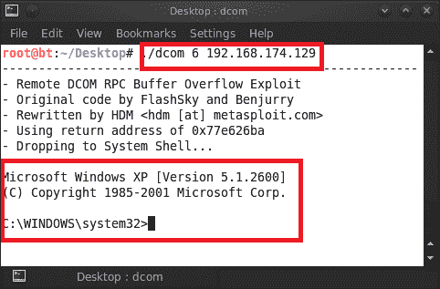
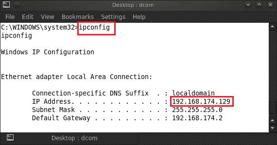
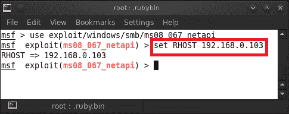

# 第三章。剥削基础

剥削指的是入侵计算机系统的艺术。计算机剥削的基础涉及对漏洞和有效载荷的深入理解。剥削是一段精心编写的代码，在目标系统上编译和执行，可能会危害该系统。剥削通常针对已知的漏洞、服务中的缺陷或编写不良的代码。在本章中，我们将讨论如何找到易受攻击的系统并对其进行剥削的基础知识。

# 剥削的基本术语

剥削的基本术语解释如下：

+   **漏洞：** 漏洞是软件或硬件中的安全漏洞，允许攻击者入侵系统。漏洞可以是一个简单的弱密码，也可以是一个复杂的拒绝服务攻击。

+   **剥削：** 剥削指的是一个众所周知的安全漏洞或错误，黑客通过它进入系统。剥削是攻击者利用特定漏洞的实际代码。

+   **有效载荷：** 一旦一个剥削在易受攻击的系统上执行并且系统已经被入侵，有效载荷使我们能够控制系统。有效载荷通常附加在剥削中并交付。

+   **Shellcode：** 这是一组指令，通常在剥削发生时用作有效载荷。

+   **监听器：** 监听器作为一个组件，等待着传入的连接。

## 剥削是如何工作的？

我们考虑一个计算机实验室的场景，其中有两名学生在他们的计算机上工作。过了一会儿，其中一名学生出去喝咖啡，他负责地锁定了他的计算机。该特定锁定计算机的密码是`Apple`，这是一个非常简单的词典单词，是系统的漏洞。另一名学生开始尝试对离开实验室的学生的系统进行密码猜测攻击。这是一个典型的剥削示例。帮助恶意用户在成功登录计算机后控制系统的控件被称为有效载荷。

现在我们来到更大的问题，即剥削实际上是如何工作的。攻击者基本上向易受攻击的系统发送一个带有附加有效载荷的剥削。剥削首先运行，如果成功，有效载荷的实际代码就会运行。有效载荷运行后，攻击者将完全特权访问易受攻击的系统，然后他可以下载数据，上传恶意软件、病毒、后门，或者任何他想要的东西。

## 入侵系统的典型过程

为了入侵任何系统，第一步是扫描 IP 地址以找到开放的端口及其操作系统和服务。然后我们继续识别易受攻击的服务，并在 Metasploit 中找到该特定服务的剥削。如果在 Metasploit 中找不到剥削，我们将通过互联网数据库如[www.securityfocus.com](http://www.securityfocus.com), [www.exploitdb.com](http://www.exploitdb.com), [www.1337day.com](http://www.1337day.com)等进行搜索。成功找到剥削后，我们启动剥削并入侵系统。

常用于端口扫描的工具有**Nmap**（网络映射器）、Autoscan、Unicorn Scan 等。例如，在这里我们使用 Nmap 进行扫描以显示开放的端口及其服务。

首先在您的 BackTrack 虚拟机中打开终端。输入`nmap –v –n 192.168.0.103`并按*Enter*进行扫描。我们使用`–v`参数获取详细输出，`–n`参数禁用反向 DNS 解析。

在这里，我们可以看到 Nmap 的结果，显示了三个开放端口及其上运行的服务。如果我们需要更详细的信息，比如服务版本或操作系统类型，我们必须使用 Nmap 进行强烈扫描。对于强烈扫描，我们使用命令`nmap –T4 –A –v 192.168.0.103`。这会显示服务版本和操作系统类型的完整结果。

下一步是根据服务或其版本查找漏洞。在这里，我们可以看到在端口号`135`上运行的第一个服务是`msrpc`，也就是 Microsoft Windows RPC。现在我们将学习如何在 Metasploit 中为这个特定服务找到漏洞。让我们打开终端并输入`msfconsole`来启动 Metasploit。在输入`search dcom`后，它会在其数据库中搜索所有与 Windows RPC 相关的漏洞。

在下面的截图中，我们可以看到漏洞及其描述，以及此漏洞的发布日期。我们根据其排名列出了一系列漏洞。从与此漏洞相关的三个漏洞中，我们选择第一个，因为它是最有效的漏洞，排名最高。现在我们已经学会了通过`search <service name>`命令在 Metasploit 中搜索漏洞的技巧。

### 从在线数据库中查找漏洞

如果 Metasploit 中没有该漏洞，则我们必须在互联网漏洞数据库中搜索该特定漏洞。现在我们将学习如何在这些在线服务（如[www.1337day.com](http://www.1337day.com)）上搜索漏洞。我们打开网站并点击**搜索**选项卡。例如，我们将搜索 Windows RPC 服务的漏洞。

现在我们需要下载并保存特定的漏洞。只需点击您需要的漏洞。

点击漏洞后，它会显示该漏洞的描述。点击**打开材料**以查看或保存漏洞。

在漏洞代码的文档中提供了该漏洞的使用方法，如下截图所示：

现在我们将利用我们已经下载的特定漏洞来攻击目标机器。我们已经扫描了 IP 地址并找到了三个开放端口。下一步将是利用其中一个端口。例如，我们将针对运行在目标机器上的端口号`135`服务进行攻击，即`msrpc`。让我们从编译已下载的漏洞代码开始。要编译代码，请启动终端并输入`gcc <exploit name with path> -o<exploitname>`。例如，在这里我们输入`gcc –dcom –o dcom`。

编译漏洞后，我们得到了该漏洞的二进制文件，我们可以通过在终端中输入`./<filename>`来运行该文件以利用目标。

从前面的截图中，我们可以看到利用目标的要求。它需要目标 IP 地址和 ID（Windows 版本）。让我们看看我们的目标 IP 地址。

我们有目标 IP 地址，所以让我们开始攻击。输入`./dcom 6 192.168.174.129`。

目标已被攻击，我们已经获得了命令 shell。现在检查受害者机器的 IP 地址。输入`ipconfig`。

目标已经受到威胁，我们实际上已经获得了对其的访问权限。

现在我们将看到如何使用 Metasploit 的内部漏洞利用。我们已经扫描了一个 IP 地址，并找到了三个开放的端口。这次我们针对运行 Microsoft-ds 服务的端口号 445。

让我们从选择一个漏洞利用开始。启动 msfconsole，输入`use exploit/windows/smb/ms08_067_netapi`，然后按*Enter*。

从在线数据库中查找漏洞利用

下一步将是检查漏洞利用的选项以及执行成功利用所需的条件。我们输入`show options`，它将显示我们的要求。我们需要设置**RHOST**（**远程主机**），即目标 IP 地址，并让其他选项保持默认值。

通过输入`set RHOST 192.168.0.103`来设置`RHOST`或目标地址。

设置完选项后，我们就可以利用我们的目标了。输入`exploit`将给我们提供 Meterpreter shell。

# 摘要

在本章中，我们介绍了漏洞性、有效载荷以及有关利用的一些建议。我们还介绍了如何搜索易受攻击的服务，并进一步查询 Metasploit 数据库以获取漏洞利用的技术。然后利用这些漏洞利用来破坏易受攻击的系统。我们还演示了在互联网数据库中搜索漏洞利用的技巧，这些数据库包含了关于软件和服务的零日漏洞利用。在下一章中，我们将介绍 Meterpreter 的基础知识和深入的利用策略。

# 参考

以下是一些有用的参考资料，进一步阐明了本章涉及的一些主题：

+   [`www.securitytube.net/video/1175`](http://www.securitytube.net/video/1175)

+   [`resources.infosecinstitute.com/system-exploitation-metasploit/`](http://resources.infosecinstitute.com/system-exploitation-metasploit/)
