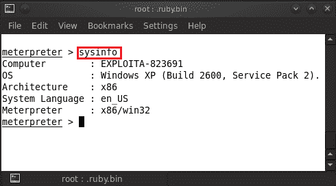
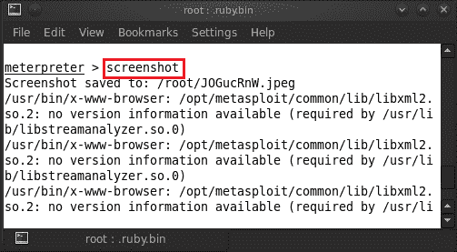
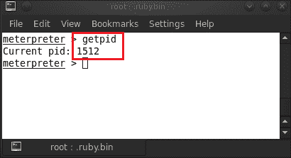
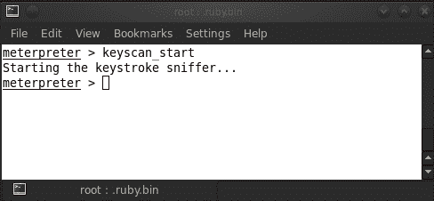
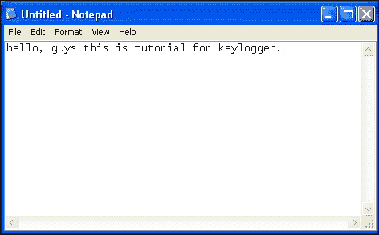
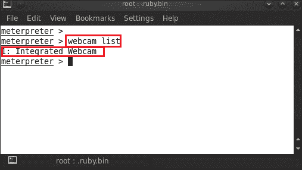
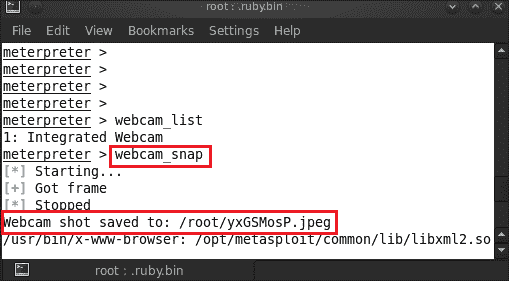
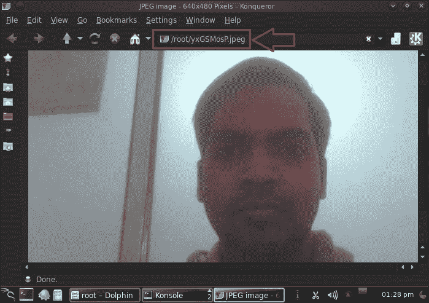
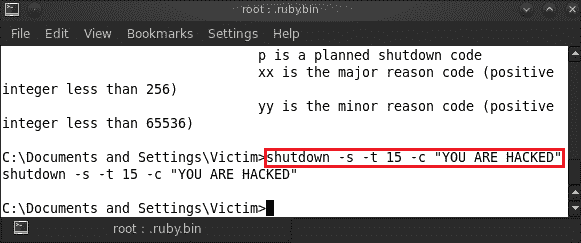

# 第四章。Meterpreter 基础知识

Meterpreter 是 Metasploit 框架中的先锋之一。它用作易受攻击系统后的有效载荷。它使用内存中的 DLL 注入分段器，并在运行时通过网络进行扩展。内存中的 DLL 注入是一种用于在当前运行的进程的地址空间中注入代码的技术，通过强制它加载**DLL**（动态链接库）文件。一旦触发了漏洞并且 Meterpreter 被用作有效载荷，我们就会为受损系统获得一个 Meterpreter shell。其攻击向量的独特之处在于其隐蔽特性。它不会在硬盘上创建任何文件，而只是附加到内存中的活动进程。客户端-服务器之间的通信使用类型长度值格式并且是加密的。在数据通信协议中，可选信息可以被编码为类型长度值或 TLV 元素，这是协议内的一部分。在这里，类型表示消息的一部分的字段类型，长度表示值字段的大小，值表示可变大小的字节序列，其中包含此消息部分的数据。这个单一的有效载荷非常有效，具有多种功能，有助于获取受害者机器的密码哈希，运行键盘记录器和权限提升。其隐蔽特性使其对许多防病毒软件和基于主机的入侵检测系统不可检测。Meterpreter 还具有在不同进程之间切换的能力，它通过 DLL 注入附加到运行的应用程序，并且停留在受损主机上，而不是在系统上创建文件。

在上一章中，我们妥协了一个系统，以获得 Meterpreter 的反向连接。现在我们将讨论我们可以在受损系统后利用的功能，比如 Meterpreter 的工作和实际操作。

# Meterpreter 的工作

一旦系统被攻破，我们（攻击者）向受影响的系统发送第一阶段的有效载荷。这个有效载荷连接到 Meterpreter。然后发送第二个 DLL 注入有效载荷，然后是 Meterpreter 服务器 DLL。这建立了一个套接字，通过 Meterpreter 会话可以进行客户端-服务器通信。这个会话的最好部分是它是加密的。这提供了机密性，因此会话可能不会被任何网络管理员嗅探到。

# Meterpreter 实际操作

在第三章中，*利用基础知识*，我们能够利用受害者机器并从中获得 Meterpreter 会话。现在我们将使用这个 Meterpreter 会话来利用 Metasploit 框架的各种功能。

现在我们将显示 Meterpreter 主机的所有攻击武器。为此，输入`help`。

在前面的屏幕截图中，我们看到了可以在受损系统上使用的所有 Meterpreter 命令。

根据使用情况，我们有一些分类的命令；它们列如下：

| 命令类型 | 命令名称 | 描述 |
| --- | --- | --- |
| 进程列表 | `getuid` | 它获取系统 ID 和计算机名称。 |
|   | `kill` | 它终止一个进程。 |
|   | `ps` | 它列出正在运行的进程。 |
|   | `getpid` | 它获取当前进程标识符。 |
| 按键记录使用 | `keyscan_start` | 它启动按键记录会话。 |
|   | `keyscan_stop` | 它停止按键记录会话。 |
|   | `keyscan_dump` | 它从受害者机器中转储捕获的按键。 |
| 会话 | `enumdesktops` | 它列出所有可访问的桌面和工作站。 |
|   | `getdesktop` | 它获取当前 Meterpreter 桌面。 |
|   | `setdesktop` | 它更改 Meterpreter 的当前桌面。 |
| 嗅探器功能 | `use sniffer` | 它加载嗅探器功能。 |
| | `sniffer_start` | 它启动接口的嗅探器。 |
| | `sniffer_dump` | 它在本地转储受害者机器的网络捕获。 |
| | `sniffer_stop` | 它停止接口的嗅探器。 |
| 摄像头命令 | `webcam_list` | 它列出系统中的所有网络摄像头。 |
| | `webcam_snap` | 它捕获受害者机器的快照。 |
| | `record_mic` | 它记录机器上默认麦克风的环境声音。 |

现在，我们将开始渗透测试程序，并执行第一步，开始收集有关受害者机器的信息。键入`sysinfo`以检查系统信息。

我们可以在上述截图中看到系统信息，受害者使用的计算机名称和操作系统。现在，我们将捕获受害者机器的屏幕截图。为此，键入`screenshot`。

我们可以看到受害者机器的屏幕截图如下：

让我们检查受害者机器上运行的所有进程列表。只需键入`ps`，它将显示正在运行的进程。

在上述截图中，我们可以看到进程列表，以及详细信息。第一列显示 PID，即进程 ID，第二列显示进程名称。下一列显示系统的架构，用户和进程运行的路径。 

在进程列表中，我们必须找到`explorer.exe`的进程 ID，然后使用该进程 ID 进行迁移。要使用任何进程 ID 进行迁移，我们必须键入`migrate <PID>`。在这里，我们正在使用`explorer.exe`进行迁移，因此我们键入`migrate 1512`。

迁移进程后，我们然后识别当前进程。为此，键入`getpid`。

我们可以从中看到当前进程 ID，我们已经迁移到受害者机器。

接下来，我们将通过在受害者机器上使用键盘记录服务来进行一些真正的黑客活动。我们键入`keyscan_start`，键盘记录将开始并等待几分钟来捕获受害者机器的按键。

受害者已开始在记事本中输入内容。让我们检查是否有捕获。

现在，让我们停止键盘记录服务并转储受害者机器的所有按键记录。为此，键入`keyscan_dump`，然后键入`keyscan_stop`以停止键盘记录服务。您可以在以下截图中看到我们的确切捕获。太棒了！

让我们在 Meterpreter 会话中尝试一些更有趣的活动。让我们检查受害者机器是否有可用的网络摄像头。为此，我们键入`webcam_list`，它会显示受害者机器的网络摄像头列表。在下面的截图中，我们可以看到有一个网络摄像头可用。

因此，我们知道受害者有一台集成的网络摄像头。因此，让我们从他/她的网络摄像头中捕获受害者的快照。只需键入`webcam_snap`。

在上一张截图中，我们可以看到网络摄像头拍摄的照片已保存到根目录，并且图像命名为`yxGSMosP.jpeg`。因此，让我们验证根目录中捕获的图像。

接下来，我们将检查系统 ID 和受害者机器的名称。键入`getuid`。

在玩弄受害者机器之后，现在是进行一些严肃工作的时候了。我们将访问受害者的命令 shell 来控制他/她的系统。只需输入`shell`，它将为您打开一个新的命令提示符。

现在让我们在受害者机器上创建一个目录。输入`mkdir <directory name>`。我们正在`C:\Documents and Settings\Victim`中创建一个名为`hacked`的目录。

让我们验证一下目录是否已经在`C:\Documents and Settings\Victim`下创建了。

现在我们将通过在屏幕上显示一条消息来关闭受害者计算机。为此，请输入`shutdown –s –t 15 -c "YOU ARE HACKED"`。在以下命令中，我们使用的语法是：`–s`表示关闭，`–t 15`表示超时，`–c`表示消息或注释。

让我们看看在受害者机器上发生了什么。

# 摘要

所以，通过这一章，我们已经介绍了用户如何通过 Meterpreter 妥协系统，以及他/她可能利用 Meterpreter 功能进行利用后提取的信息。一旦我们妥协了受害者的系统，我们就能够获取系统信息，包括操作系统名称、架构和计算机名称。之后，我们能够捕获受害者机器桌面的截图。通过 Meterpreter，我们直接访问了受害者机器的 shell，因此可以检查正在运行的进程。我们能够安装键盘记录器并捕获受害者机器的活动按键。使用 Meterpreter，我们甚至可以使用受害者的摄像头在不被注意的情况下捕获他的快照。

整个章节都涉及到了一些真正的黑客行为，以及利用受害者机器来执行自己命令的不同方式。因此，受害者机器只是一个简单的傀儡，随着攻击者的命令而舞动。由于我们可以访问受害者的 shell，我们可以格式化他的硬盘，创建新文件，甚至复制他的机密数据。下一章将涵盖信息收集和扫描阶段。

# 参考资料

以下是一些有用的参考资料，可以进一步了解本章涉及的一些主题：

+   [`www.offensive-security.com/metasploit-unleashed/About_Meterpreter`](http://www.offensive-security.com/metasploit-unleashed/%E2%80%A8About_Meterpreter)

+   [`cyruslab.wordpress.com/2012/03/07/metasploit-about-meterpreter/`](http://cyruslab.wordpress.com/2012/03/07/metasploit-about-meterpreter/)

+   [`github.com/rapid7/metasploit-framework/wiki/How-payloads-work`](https://github.com/rapid7/metasploit-framework/wiki/%E2%80%A8How-payloads-work)

+   [`www.isoc.my/profiles/blogs/working-with-meterpreter-on-metasploit`](http://www.isoc.my/profiles/blogs/working-with-meterpreter-on-metasploit)
