# 第五章。漏洞扫描和信息收集

在上一章中，我们介绍了 Meterpreter 的各种功能以及应对客户端利用应采取的方法。现在我们慢慢深入探讨利用原则，首先是信息收集阶段。我们解释了通过哪些技术可以收集我们受害者的信息，用于攻击前的分析。随着漏洞数量的增加，我们已经开始使用自动化漏洞扫描工具。本章旨在掌握漏洞扫描的艺术，这是利用的第一步。将涵盖的一些模块如下：

+   通过 Metasploit 进行信息收集

+   使用 Nmap

+   使用 Nessus

+   在 Metasploit 中导入报告

# 通过 Metasploit 进行信息收集

信息收集是通过各种技术收集有关受害者的信息的过程。基本上分为足迹和扫描两个步骤。关于组织的许多信息都可以在组织的网站、商业新闻、职位门户网站、不满的员工等公开获取。恶意用户可能能够通过这个阶段找到属于组织的域名、远程访问信息、网络架构、公共 IP 地址等更多信息。

Metasploit 是一个非常强大的工具，其中包含一些用于信息收集和分析的强大工具。其中一些包括：Nmap，Nessus 与 Postgres 支持用于传输报告，然后利用 Metasploit 收集的信息进行利用等。Metasploit 已经集成了 Postgres，这在测试阶段间接有助于存储渗透测试结果更长的时间。信息收集阶段被认为非常重要，因为攻击者使用这些工具来收集有关破坏受害者的重要信息。Metasploit 辅助模块有各种扫描，从 ARP 到 SYN，甚至基于服务的扫描，如 HTTP、SMB、SQL 和 SSH。这些实际上有助于对服务版本进行指纹识别，甚至一些关于可能使用服务的平台的信息。因此，通过这些规格，我们的攻击域受到了进一步限制，以便更有效地打击受害者。

图片来源：[`s3.amazonaws.com/readers/2010/12/20/spyware_1.jpg`](http://s3.amazonaws.com/readers/2010/12/20/spyware_1.jpg)

我们继续通过 Metasploit 进行一些实际的信息收集。假设我们是攻击者，我们有一个需要利用的域。第一步应该是为了恶意目的检索有关该域的所有信息。`Whois`是信息收集的最佳方法之一。它被广泛用于查询存储互联网资源的注册用户的数据库，如域名、IP 地址等。

打开`msfconsole`并输入`whois <domain name>`。例如，这里我们使用我的域名`whois <techaditya.in>`。

我们可以看到与我们的域相关的大量信息。在 Metasploit 中，有许多辅助扫描器，非常适用于通过电子邮件收集信息。电子邮件收集是一个非常有用的工具，可以获取与特定域相关的电子邮件 ID。

要使用电子邮件收集辅助模块，请输入`use auxiliary/gather/search_email_collector`。

让我们看看可用的选项。为此，输入`show options`。

我们可以看到域是空白的，我们需要设置域地址。只需输入`set domain <domain name>`；例如，我们在这里使用`set domain techaditya.in`。

现在让我们运行辅助模块；只需输入`run`，它就会显示结果。

通过这些步骤，我们已经收集了关于我们受害者的许多公开信息。

# 主动信息收集

现在让我们进行一些主动信息收集，以便利用我们的受害者。另一个有用的辅助扫描器是 telnet 版本扫描器。要使用它，输入`use auxiliary/scanner/telnet/telnet_version`。

之后输入`show options`以查看可用选项。

我们可以看到`RHOSTS`选项为空，我们已经设置了用于扫描 telnet 版本的目标 IP 地址，因此输入`set RHOSTS<target IP address>`。例如，在这里我们输入`set RHOSTS 192.168.0.103`，然后输入`run`进行扫描。

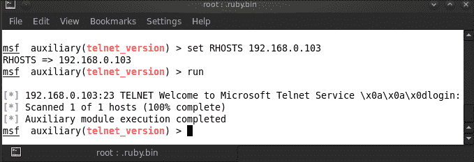

我们的受害者已经被扫描，我们可以看到他的机器的 telnet 版本。

我们将使用另一个扫描器来查找**远程桌面**连接（**RDP**）是否可用，即 RDP 扫描器。但是，为此，我们必须知道远程桌面连接的端口号，即 3389，也称为 RDP 端口。输入`use auxiliary/scanner/rdp/ms12_020_check`，然后输入`show options`以查看详细的使用选项。

我们可以看到预定义的选项和端口范围为 1-10000。我们不需要扫描所有端口，因此我们定义 RDP 默认运行的端口号。之后，我们将`RHOST`设置为我们的目标地址。输入`set PORTS 3389`并按*Enter*，然后输入`set RHOST 192.168.11.46`。

一旦我们设置好所有选项，输入`run`。

我们可以看到结果中 TCP 端口 3389 是开放的，用于远程桌面连接。

# 使用 Nmap

Nmap 是由*Gordon Lyon*开发的强大安全扫描仪，用于在计算机网络上检测主机、服务和开放端口。它具有许多功能，如隐身扫描、侵略性扫描、防火墙规避扫描，并且具有指纹识别操作系统的能力。它有自己的 Nmap 脚本引擎，可以与 Lua 编程语言一起使用来编写定制脚本。

我们从使用 Metasploit 进行 Nmap 扫描的基本技术开始。

扫描单个目标——在目标地址上运行 Nmap 而不使用命令选项将对目标地址执行基本扫描。目标可以是 IPV4 地址或其主机名。让我们看看它是如何工作的。打开终端或`msfconsole`，输入`nmap <target>`，例如，`nmap 192.168.11.29`。

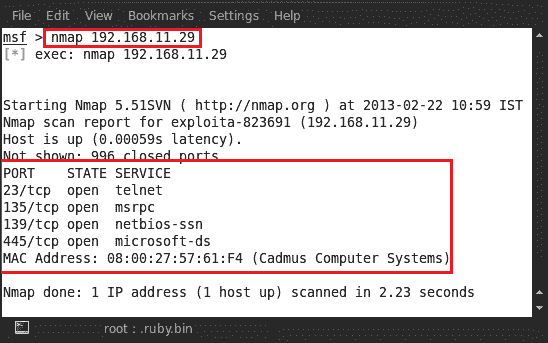

扫描结果显示了目标上检测到的端口的状态。结果分为三列，即`PORT`、`STATE`和`SERVICE`。`PORT`列显示端口号，`STATE`列显示端口的状态，即开放或关闭，`SERVICE`显示在该端口上运行的服务类型。

端口的响应被分类为六种不同的状态消息，分别是：开放、关闭、过滤、未过滤、开放过滤和关闭过滤。

以下是用于扫描多个主机的不同类型的 Nmap 扫描选项：

+   **扫描多个目标**：Nmap 可以同时扫描多个主机。最简单的方法是将所有目标放在一个由空格分隔的字符串中。输入`nmap <目标 目标>`，例如，`nmap 192.168.11.46 192.168.11.29`。

我们可以看到两个 IP 地址的结果。

+   **扫描目标列表**：假设我们有大量目标计算机要扫描。那么扫描所有目标的最简单方法是将所有目标放入一个文本文件中。我们只需要用新行或空格分隔所有目标。例如，这里我们创建了一个名为`list.txt`的列表。

现在要扫描整个列表，请键入`nmap –iL <list.txt>`。在这里，语法`–iL`用于指示 Nmap 从`list.txt`中提取目标列表，例如，`nmap –iL list.txt`。

我们现在转向各种 Nmap 发现选项。那么 Nmap 实际上是如何工作的呢？每当 Nmap 执行扫描时，它会向目的地发送 ICMP 回显请求，以检查主机是活着还是死了。当 Nmap 同时扫描多个主机时，这个过程可以为 Nmap 节省大量时间。有时防火墙会阻止 ICMP 请求，因此作为次要检查，Nmap 尝试连接默认开放的端口，例如 80 和 443，这些端口由 Web 服务器或 HTTP 使用。

## Nmap 发现选项

现在我们将转向各种 Nmap 命令选项，这些选项可以根据场景进行主机发现。

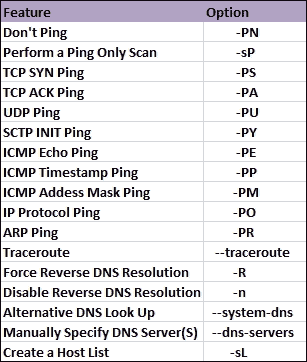

在上一个屏幕截图中，我们可以看到 Nmap 中提供的所有扫描选项。让我们测试一些，因为本书的完整命令覆盖范围超出了本书的范围。

+   **仅 Ping 扫描**：此扫描用于查找网络中的活动主机。要执行仅 Ping 扫描，我们使用命令`nmap –sP <Target>`；例如，这里我们设置`nmap –sP 192.168.11.2-60`。

在结果中，我们看到有四台主机是活动的。因此，这种扫描可以节省在大型网络中执行扫描的时间，并识别所有活动主机，留下不活动的主机。

+   **TCP ACK ping**：此扫描向目标发送 TCP ACK 数据包。此方法用于通过收集主机的 TCP 响应来发现主机（取决于 TCP 三次握手）。当防火墙阻止 ICMP 请求时，此方法对于收集信息很有用。要执行此扫描，我们使用命令`nmap –PA <target>`；例如，这里我们设置`nmap –PA 192.168.11.46`。

+   **ICMP 回显扫描**：此选项向目标发送 ICMP 请求，以检查主机是否回复。这种类型的扫描在本地网络上效果最佳，因为 ICMP 数据包可以轻松地在网络上传输。但出于安全原因，许多主机不会响应 ICMP 数据包请求。此选项的命令是`nmap –PE 192.168.11.46`。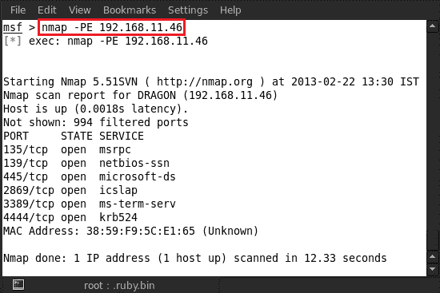

+   **强制反向 DNS 解析**：此扫描对于对目标执行侦察很有用。Nmap 将尝试解析目标地址的反向 DNS 信息。它会显示有关目标 IP 地址的有趣信息，如下面的屏幕截图所示。我们用于扫描的命令是`nmap –R <Target>`；例如，这里我们设置`nmap –R 66.147.244.90`。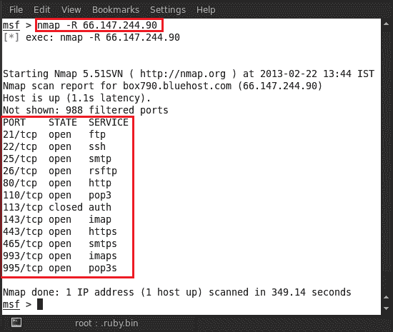

## Nmap 高级扫描选项

现在让我们看一些高级扫描选项。这些主要用于绕过防火墙并找到不常见的服务。选项列表显示在下面的屏幕截图中：

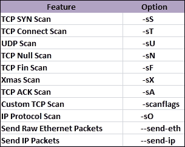

我们将以下一些选项解释如下：

+   **TCP SYN 扫描**：TCP SYN 扫描尝试通过向目标发送 SYN 数据包并等待响应来识别端口。SYN 数据包基本上是发送以指示要建立新连接。这种类型的扫描也被称为隐形扫描，因为它不尝试与远程主机建立完整的连接。要执行此扫描，我们使用命令`nmap –sS <target>`；例如，这里我们使用`nmap –sS 192.168.0.104`。

+   TCP 空扫描：这种类型的扫描发送没有启用 TCP 标志的数据包。这是通过将标头设置为零来实现的。这种类型的扫描用于愚弄受防火墙系统。空扫描的命令是`nmap -sN <target>`；例如，这里我们使用`nmap -sN 192.168.0.103`。

+   自定义 TCP 扫描：这种类型的扫描使用一个或多个 TCP 头标志执行自定义扫描。在此扫描中可以使用任意组合的标志。各种类型的 TCP 标志如下图所示：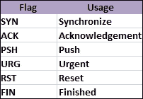

可以使用这种扫描的任意组合标志。使用的命令是`nmap -scanflags SYNURG <target>`；例如，这里我们设置`nmap -scanflags SYNURG 192.168.0.102`。

## 端口扫描选项

接下来，我们将介绍一些针对特定端口、一系列端口和基于协议、名称等进行端口扫描的更多技术。

+   快速扫描：在这种扫描中，Nmap 仅对 1000 个最常见的端口中的 100 个端口进行快速扫描。因此，通过在扫描过程中减少端口数量，Nmap 的扫描速度得到了极大的提高。快速扫描的命令是`nmap -F <Target>`；例如，这里我们使用`nmap -F 192.168.11.46`。

+   按名称扫描端口：按名称扫描端口非常简单，我们只需在扫描过程中指定端口名称。使用的命令是`nmap -p (portname) <target>`；例如，这里我们使用`nmap -p http 192.168.11.57`。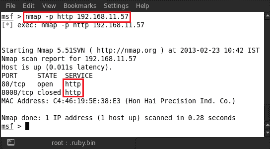

+   执行顺序端口扫描：借助顺序端口扫描程序，Nmap 按顺序端口顺序扫描其目标。这种技术对于规避防火墙和入侵防范系统非常有用。使用的命令是`nmap -r <target>`；例如，这里我们使用`nmap -r 192.168.11.46`。

有时在扫描时我们会遇到接收到经过过滤的端口结果的问题。当系统受到防火墙或入侵防范系统的保护时会出现这种情况。Nmap 还具有一些功能，可以帮助绕过这些保护机制。我们在下表中列出了一些选项：

我们将解释其中一些如下：

+   分段数据包：通过使用此选项，Nmap 发送非常小的 8 字节数据包。这个选项对规避配置不当的防火墙系统非常有用。使用的命令是`nmap -f <target>`；例如，这里我们使用`nmap -f 192.168.11.29`。

+   空闲僵尸扫描：这是一种非常独特的扫描技术，Nmap 在其中使用僵尸主机来扫描目标。这意味着，这里 Nmap 使用两个 IP 地址执行扫描。使用的命令是`nmap -sI <Zombie host> <Target>`；例如，这里我们使用`nmap -sI 192.168.11.29 192.168.11.46`。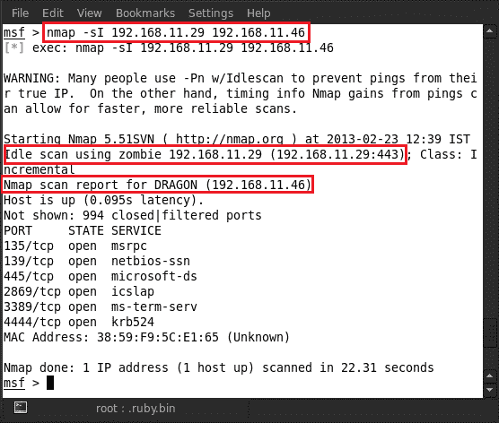

+   欺骗 MAC 地址：当受防火墙系统检测到通过系统的 MAC 地址进行扫描时，并将这些 MAC 地址列入黑名单时，这种技术非常有用。但是 Nmap 具有欺骗 MAC 地址的功能。MAC 地址可以通过三种不同的参数进行欺骗，这些参数在下图中列出：

用于此的命令是`nmap -spoof-mac <Argument> <Target>`；例如，这里我们使用`nmap -spoof-mac Apple 192.168.11.29`。

学习了不同类型的扫描技术之后，接下来我们将介绍如何以各种方式和格式保存 Nmap 输出结果。选项列在下图中：

让我们将 Nmap 输出结果保存在一个 XML 文件中。使用的命令是`nmap –oX <scan.xml> <Target>`；例如，这里我们使用的是`nmap –oN scan.txt 192.168.11.46`。

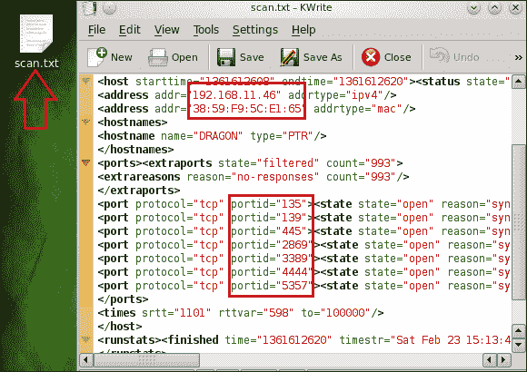

# 使用 Nessus

Nessus 是一款专有的漏洞扫描工具，可免费用于非商业用途。它可以检测目标系统上的漏洞、配置错误、默认凭据，并且还用于各种合规审计。

要在 Metasploit 中启动 Nessus，打开`msfconsole`并输入`load nessus`。

让我们通过输入`nessus_help`来使用 Nessus 的`help`命令。

我们有各种 Nessus 命令行选项的列表。接下来，我们从本地主机连接到 Nessus 以开始扫描。要连接到本地主机，使用的命令是`nessus_connect <Your Username>:<Your Password>@localhost:8834 <ok>`，这里我们使用的是`nessus_connect hacker:toor@localhost:8834 ok`。

成功连接到 Nessus 的默认端口后，我们现在将检查 Nessus 扫描策略。为此，我们输入`nessus_policy_list`。

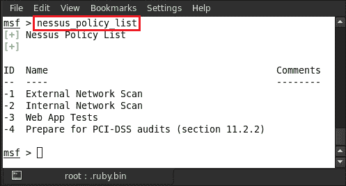

在这里，我们可以看到 Nessus 的四种策略；第一种是外部网络扫描，用于外部扫描网络漏洞。第二种是内部网络扫描，用于内部扫描网络漏洞。第三种是 Web 应用程序测试，用于扫描 Web 应用程序的漏洞。第四种是 PCI-DSS（支付卡行业数据安全标准）审计，用于支付卡行业的数据安全标准。

现在我们将扫描我们的受害者机器。要扫描一台机器，我们必须创建一个新的扫描，使用的命令是`nessus_new_scan <policy ID> <scan name> <Target IP>`；例如，这里我们使用的是`nessus_new_scan -2 WindowsXPscan 192.168.0.103`。

我们可以通过输入`nessus_scan_status`来检查扫描过程的状态；它将显示扫描过程的状态，无论是否已完成。

完成扫描过程后，现在是时候检查报告列表了，因此输入`nessus_report_list`。

我们可以看到带有**ID**的报告。其**状态**标记为**已完成**。要打开报告，我们使用命令`nessus_report_hosts <report ID>`；例如，这里我们使用的是`nessus_report_hosts dc4583b5-22b8-6b1a-729e-9c92ee3916cc301e45e2881c93dd`。

在上一张截图中，我们可以看到 IP 为`192.168.0.103`的机器的结果，其严重程度总共为`41`。这意味着漏洞总数为 41。

以下是不同漏洞的分类：

+   Sev 0 表示高级漏洞，共有 4 个

+   Sev 1 表示中级漏洞，共有 28 个

+   Sev 2 表示低级漏洞，共有 4 个

+   Sev 3 表示信息性漏洞，共有 9 个

我们可以使用命令`nessus_report_hosts_ports <Target IP> <Report ID>`来详细查看协议名称和服务的漏洞；例如，这里我们使用的是`nessus_report_host_ports 192.168.0.103 dc4583b5-22b8-6b1a-729e-9c92ee3916cc301e45e2881c93dd`。

# 在 Metasploit 中导入报告

将漏洞扫描仪的报告导入 Metasploit 数据库是 Metasploit 提供的一个非常有用的功能。在本章中，我们使用了两个扫描仪，即 Nmap 和 Nessus。我们已经看到了 Nmap 在不同情况下使用的各种扫描技术。现在我们将看到如何通过`msfconsole`将 Nmap 报告导入到 PostgreSQL 数据库中。

扫描任何主机并将 Nmap 报告保存为 XML 格式，因为`msfconsole`不支持 TXT 格式。所以这里我们已经有一个名为`scan.xml`的 XML 格式扫描报告。现在我们要做的第一件事是使用命令`db_status`检查与`msfconsole`的数据库连接状态。

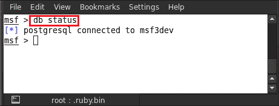

我们的数据库已连接到`msfconsole`，现在是时候导入 Nmap 报告了。我们使用命令`db_import <报告路径及名称>`；例如，在这里我们正在从桌面导入我们的报告，所以我们输入`db_import /root/Desktop/scan.xml`。

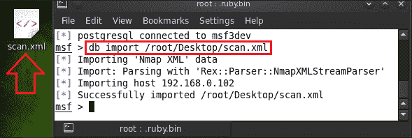

成功将报告导入数据库后，我们可以从`msfconsole`中访问它。我们可以通过输入`host <进行 nmap 扫描的主机名>`来查看主机的详细信息；例如，在这里我们使用`host 192.168.0.102`。

这里有一些关于主机的重要信息，比如 MAC 地址和操作系统版本。现在在选择主机之后，让我们检查一下开放端口的详细信息以及运行在这些端口上的服务。使用的命令是`services <hostname>`；例如，在这里我们使用`services 192.168.0.102`。

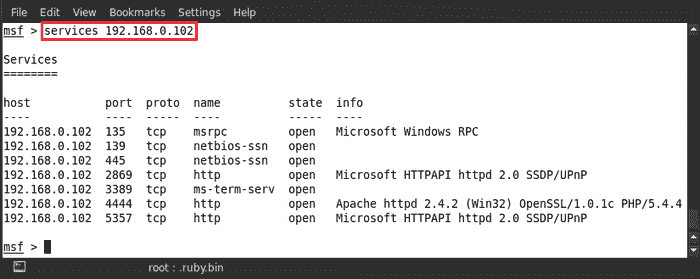

我们这里有受害机上开放端口和运行服务的所有信息。现在我们可以搜索用于进一步攻击的漏洞利用，这是我们在上一章中已经做过的。

接下来，我们将学习如何在`msfconsole`中导入 Nessus 的报告。与导入 Nmap 报告使用相同的命令一样简单，即`db_import <报告名称及文件位置>`；例如，在这里我们使用`db_import /root/Desktop/Nessus_scan.nessus`。

我们可以看到已成功导入了主机 192.168.0.103 的报告，现在我们可以通过输入`vulns <hostname>`来检查此主机的漏洞；例如，在这里我们使用`vulns 192.168.0.103`。

现在我们可以看到受害机的漏洞；根据这些漏洞，我们可以搜索用于执行进一步攻击的漏洞利用、有效载荷和辅助模块。

# 总结

在本章中，我们介绍了使用 Metasploit 模块对受害者进行信息收集的各种技术。我们介绍了一些免费的工具以及一些辅助扫描器。使用一些辅助扫描器，我们实际上能够对特定运行服务进行指纹识别。通过 Nmap，我们学会了对活动系统、受防火墙保护的系统以及其他各种不同场景中可以使用的各种扫描技术进行网络扫描。我们看到 Nessus 是一个非常强大的工具，可以用于对受害机进行漏洞评估。我们还学会了将 Nmap 和 Nessus 报告导入 Metasploit。通过本章，我们已经在利用我们的受害者方面迈出了一大步，并将在下一章中继续介绍客户端利用。

# 参考资料

以下是一些有用的参考资料，可以进一步了解本章涉及的一些主题：

+   [`pentestlab.wordpress.com/2013/02/17/metasploit-storing-pen-test-results/`](https://pentestlab.wordpress.com/2013/02/17/metasploit-storing-pen-test-results/)

+   [`www.offensive-security.com/metasploit-unleashed/Information_Gathering`](http://www.offensive-security.com/metasploit-unleashed/Information_Gathering)

+   [`www.firewalls.com/blog/metasploit_scanner_stay_secure/`](http://www.firewalls.com/blog/metasploit_scanner_stay_secure/)

+   [`www.mustbegeek.com/security/ethical-hacking/`](http://www.mustbegeek.com/security/ethical-hacking/)

+   [`backtrack-wifu.blogspot.in/2013/01/an-introduction-to-information-gathering.html`](http://backtrack-wifu.blogspot.in/2013/01/an-introduction-to-information-gathering.html)

+   [`www.offensive-security.com/metasploit-unleashed/Nessus_Via_Msfconsole`](http://www.offensive-security.com/metasploit-unleashed/%E2%80%A8Nessus_Via_Msfconsole)

+   [`en.wikipedia.org/wiki/Nmap`](http://en.wikipedia.org/wiki/Nmap)

+   [`en.wikipedia.org/wiki/Nessus_(software)`](http://en.wikipedia.org/wiki/Nessus_(software))
