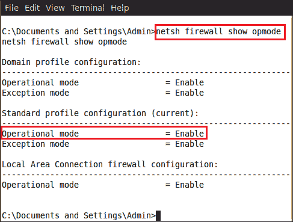
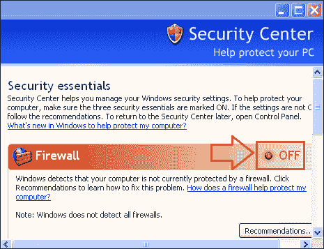
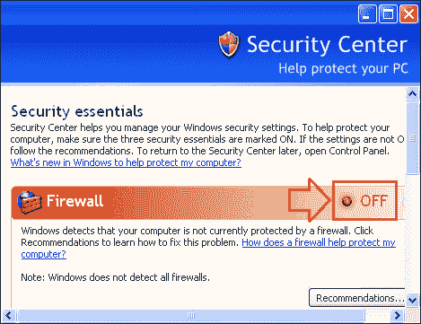
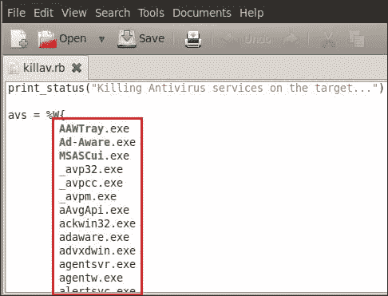
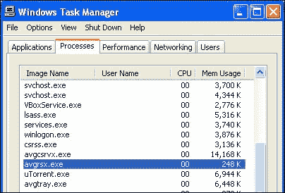
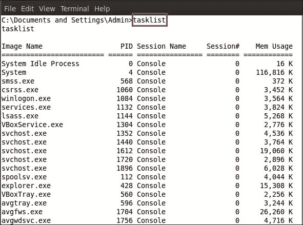
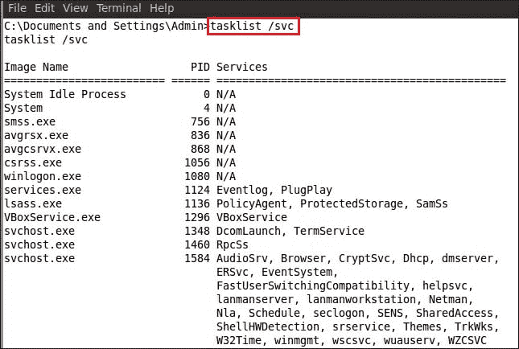
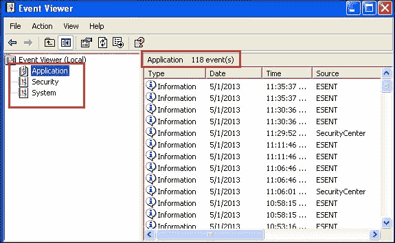

# 第九章 后渗透 - 清除痕迹

我们在上一章中介绍了使用 Metasploit 进行权限提升的技术。接下来，我们将进入后渗透的下一个阶段，即通过删除日志和禁用防火墙和防病毒系统来清除痕迹和追踪。在本章中，我们将学习在系统被入侵后如何规避防火墙和防病毒系统的警报。对于黑客来说，另一个重要的问题是他的工作有多隐蔽。这就是所谓的清除痕迹和追踪；在这里，一个恶意黑客清除日志和任何可能因他的入侵而创建的警报。

# 禁用防火墙和其他网络防御

为什么防火墙很重要？防火墙基本上是阻止未经授权进入系统或网络的软件或硬件。防火墙还会跟踪入侵和安全漏洞。如果防火墙配置良好，每次未经授权的进入都会被阻止并记录在安全日志中。它控制着进出的网络流量并分析数据包；基于此，它决定是否应该允许数据包通过防火墙。因此，如果恶意用户能够远程利用系统，第一步应该是禁用防火墙，以便防火墙不再记录任何进入的警报，这可能显示入侵的证据。


防火墙分为三种不同类型：

1.  **数据包过滤防火墙**：这些类型的防火墙与 OSI 模型的前三层有关，同时也在传输层上有一些帮助，用于源和目的端口号。当数据包朝向数据包过滤防火墙传输时，它会根据设定的规则进行分析匹配。如果数据包通过了防火墙的过滤器，就允许其进入网络，否则就会被阻止。

1.  **有状态防火墙**：这些也被称为第二代防火墙。顾名思义，这些防火墙根据网络连接的状态工作。在整个状态期间，它确定是否允许数据包进入网络。

1.  **应用防火墙**：这些被称为第三代防火墙。应用防火墙适用于诸如 HTTP、SMTP 和 SSH 之类的应用程序和协议。它们还有助于检测不受欢迎的协议是否试图绕过允许端口上的防火墙。

防火墙是恶意用户的最大敌人之一。它阻止恶意用户使用后渗透脚本并在受损系统上创建后门。因此，攻击者的第一个目标应该是在成功入侵系统后禁用防火墙。在本章中，我们将看到如何通过 Metasploit 实际禁用防火墙，然后处理未经授权的区域。

在本节中，我们将向您展示如何在受害者系统中禁用防火墙。在这之前，我们将检查受害者系统中防火墙的状态；也就是说，它是启用还是禁用的。为此，我们将使用一个后渗透脚本。因此输入`run getcountermeasure`。


我们可以在上述截图中看到受害者系统中的防火墙已启用。还有另一种方法可以检查受害者系统中的防火墙设置 - 通过访问他/她的命令提示符。为此，我们必须从 Meterpreter 中打开受害者的 shell。从 Meterpreter 中打开 shell 的技术已经在之前的章节中介绍过。我们访问命令提示符并输入`netsh firewall show opmode`。



现在我们可以检查系统防火墙的设置。让我们通过检查受害者系统来验证一下，看看防火墙是否已启用。


我们可以清楚地看到防火墙处于活动状态。现在我们需要将其禁用。输入`netsh firewall show opmode mode=disable`。


执行上一个命令后，该命令将永久禁用防火墙。现在让我们检查受害者系统中防火墙的状态。



## 通过 VBScript 禁用防火墙

还有另一种禁用防火墙的方法，即在受害者系统上执行一个小的 Visual Basic 脚本。首先，我们必须在文本文件中编写三行代码。

```
Set objFirewall = CreateObject("HNetCfg.FwMgr")
Set objPolicy = objFirewall.LocalPolicy.CurrentProfile

objPolicy.FirewallEnabled = FALSE
```

现在将此代码保存为`.vbs`扩展名。例如，在这里我们将其命名为`disable.vbs`。


我们的脚本已准备就绪；现在我们必须将此脚本上传到受害者的系统中。要上传，我们将使用 Meterpreter 上传命令。例如，在我们的案例中，我们输入`upload root/Desktop/disable.vbs C:\`。


因此，我们已将我们的`disable.vbs`脚本上传到受害者的`C:`驱动器中。让我们在受害者的`C:`驱动器中检查脚本是否已上传。


我们可以在受害者的`C:`驱动器中看到我们的`disable.vbs`文件。现在我们可以远程执行此脚本。要执行此脚本，我们必须输入`cd C:\`以进入此驱动器。


我们现在在受害者的`C:`驱动器中，可以执行脚本。因此输入`disable.vbs`，它将在受害者的系统中执行。


让我们检查受害者系统的防火墙是否已被我们的脚本禁用。



是的，我们的 VBScript 代码成功禁用了防火墙。

## 杀毒软件关闭和日志删除

让我们看看杀毒软件中的一些利用问题。攻击者在利用系统后需要注意各种事项。如果他想玩得安全并且不被发现，这一点非常重要。杀毒软件是合法用户的主要防御系统之一，如果攻击者能够禁用它，他就成功地完全控制了系统并且可以不被发现。因此，对于攻击者来说，禁用杀毒软件作为一种预防措施来隐藏自己的存在非常重要。在本章中，我们将学习如何通过 Meterpreter 后利用脚本禁用和终止不同的杀毒软件。


在本节中，我们将看到如何通过终止其进程来停止杀毒软件。为此，我们将使用一个名为 killav 的后利用 Meterpreter 脚本。我们将展示 killav 脚本的源代码，并看看该脚本如何能够终止杀毒软件的进程。

使用文本编辑器打开位于`opt/framework/msf3/scripts/killav.rb`的`killav.rb`脚本。



我们可以看到 killav 脚本中包含的知名杀毒软件的进程名称列表。当我们运行此脚本时，它会在受害者的系统中查找进程名称，该名称也应包含在此脚本中，然后终止该进程。

在我们的案例中，受害者使用的是 AVG 2012 杀毒软件。因此，我们首先将从受害者的任务管理器中检查 AVG 杀毒软件的进程名称。



我们可以看到 AVG 杀毒软件的进程名称`avgrsx.exe`正在运行。让我们检查进程名称是否包含在`killav.rb`脚本中。


我们可以看到进程名已经包含在内，所以脚本将成功运行。输入`run killav`。


我们可以从前面截图的结果中看到，该进程已被终止。现在我们将访问受害者的命令提示符，输入`tasklist`来检查受害者系统中正在运行的所有进程。



我们还可以看到受害者系统中运行了很多进程；我们现在要对这些进程进行分类，看它们属于哪个组。输入`tasklist /svc`。



我们只对 AVG 杀毒软件服务感兴趣，而不关心任务列表中显示的其他服务。因此，我们将通过输入`tasklist /svc | find /I "avg"`来精确搜索。


执行前面截图中显示的命令后，我们可以看到只有与 AVG 相关的进程被显示出来。我们必须终止所有进程，但两个进程`avgwdsvc.exe`和`AVGIDSAgent.exe`在终止时会引起麻烦。这个麻烦的原因是它们是无法停止的，如下一截图所示。在这里，我们通过输入`sc queryex avgwd`来查看`avgwd`的属性。


您可能会注意到前面截图中的状态部分显示，该服务无法停止，也无法暂停。但我们可以禁用此服务来摆脱问题。

让我们检查另一个进程`AVGIDSAgent`的属性。输入`sc queryex AVGIDSAgent`。


我们在这里看到相同的结果-该服务无法停止，也无法暂停。

现在我们要禁用`avgwd`进程。输入`sc config avgwd start= disabled`。


如前面的截图所示，`avgwd`服务已被禁用。现在让我们禁用另一个进程`AVGIDSAgent`。输入`sc config AVGIDSAgent start= disabled`。


现在我们退出受害者的命令提示符，并通过在 Meterpreter 会话中输入`reboot`命令来重启受害者的系统。


成功重启后，我们再次进入受害者系统的 Meterpreter 会话。现在我们要做的是搜索受害者的任务列表中的所有 AVG 进程，并验证我们禁用的这两个进程是否仍在运行。我们打开 shell，输入`tasklist /svc | find /I "avg"`。


我们可以看到，`avgwd`和`AVGIDSAgent`这两个进程在前面的截图中没有显示出来。这意味着这些进程已成功被禁用。我们可以轻松终止其他 AVG 进程。要终止一个进程，输入`taskkill /F /IM "avg*"`。


执行命令后，我们可以看到所有进程都已成功终止。

清除痕迹的下一个阶段将是清除系统日志。系统和应用程序日志是由操作系统和运行在其上的应用程序记录的事件。从取证的角度来看，这些事件非常重要，因为它们显示了系统中发生的变化或事件的状态。任何可疑活动也会被记录；因此，对于攻击者来说，清除这些日志以保持隐藏是非常重要的。


图片来源：[`paddle-static.s3.amazonaws.com/HR/CleanMyPC-BDJ/CleanMyPC-icon.png`](https://paddle-static.s3.amazonaws.com/HR/CleanMyPC-BDJ/CleanMyPC-icon.png)

成功禁用防火墙和杀毒软件后，我们要做的最后一件事就是清理计算机系统中的所有日志等证据。首先，我们将使用事件查看器在受害者系统中检查是否创建了任何日志。



我们可以在上一个截图中看到有三个日志，分为**应用程序**，**安全**和**系统**。在**应用程序**部分，我们可以看到有 118 个事件被创建。现在我们必须清除所有这些日志。为了清理日志，我们将使用 Meterpreter 命令`clearev`，它将从受害者系统中清除所有日志。因此输入`clearev`。


执行命令后，我们可以在上一个截图中看到结果-已删除了 118 个应用程序记录和 467 个系统记录。让我们在受害者系统中使用事件查看器确认一下。


我们可以看到所有日志已成功从受害者系统中删除。

# 总结

在本章中，我们学习了使用简单的 Meterpreter 脚本清除我们的痕迹并避免被管理员抓住的策略。由于防火墙和杀毒软件是对抗攻击者攻击向量的主要防御手段，攻击者非常重视这些事情。我们还学习了多种禁用系统防火墙和受害者防御的技术。我们按照攻击者的方式，并且成功地清除了我们的痕迹，安全地侵入了系统。因此，到目前为止，我们已经涵盖了渗透测试的第二阶段，这是渗透过程中最重要的阶段之一。在下一章中，我们将介绍与后门合作的技术，并在受害者系统上设置后门以保持永久访问。

# 参考资料

以下是一些有用的参考资料，进一步阐明了本章涉及的一些主题：

+   [`en.wikipedia.org/wiki/Firewall_(computing)`](http://en.wikipedia.org/wiki/Firewall_(computing))

+   [`pentestlab.wordpress.com/2012/04/06/post-exploitation-disable-firewall-and-kill-antivirus/`](http://pentestlab.wordpress.com/2012/04/06/post-exploitation-disable-firewall-and-kill-antivirus/)

+   [`www.securitytube.net/video/2666`](http://www.securitytube.net/video/2666)
