# 第十一章。后期利用-枢轴和网络嗅探

# 什么是枢轴？

简单来说，枢轴取决于一个元素来利用另一个元素。在本章中，我们将探讨枢轴和网络嗅探的艺术。这种情况更适用于终端系统防火墙，或者可能是 Web 服务器，它们是进入内部网络的唯一点。我们将利用 Web 服务器与内部网络的连接，通过前几章中介绍的我们的利用技术连接到内部系统。简而言之，第一个被攻陷的系统帮助我们攻陷其他无法从外部网络访问的系统。

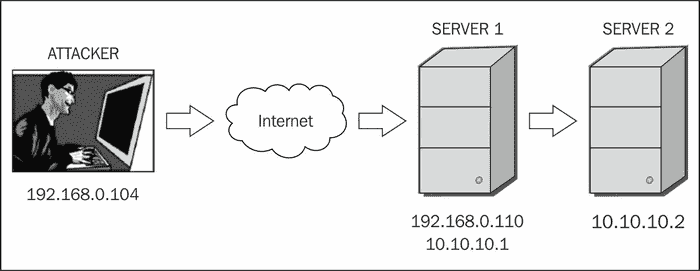

# 在网络中的枢轴

这是 Metasploit 非常有趣的部分，我们将通过攻陷系统来入侵局域网。在这里，我们已经有了一个被攻陷的系统，并且我们有该系统的`meterpreter` shell。

1.  首先让我们通过输入`ipconfig`来检查该系统的 IP 设置。我们可以在截图中看到受害者有两个网络适配器。`适配器＃2`的 IP 范围为`10.10.10.1`。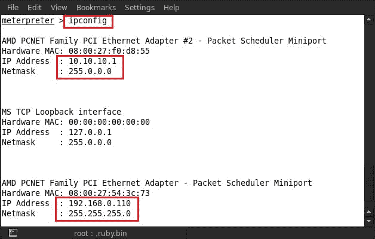

1.  现在我们将通过输入`route`命令来检查整个网络路由表。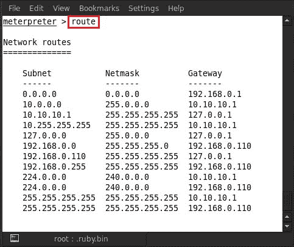

1.  现在我们的计划是攻击这个额外的网络。对于这次攻击，Metasploit 有一个后期利用脚本，称为`autoroute`。这个脚本允许我们使用第一个被攻陷的系统攻击第二个网络。使用这个脚本，我们可以从这个被攻陷的系统攻击第二个网络。输入`run autoroute -h`，它将显示脚本的所有用法命令。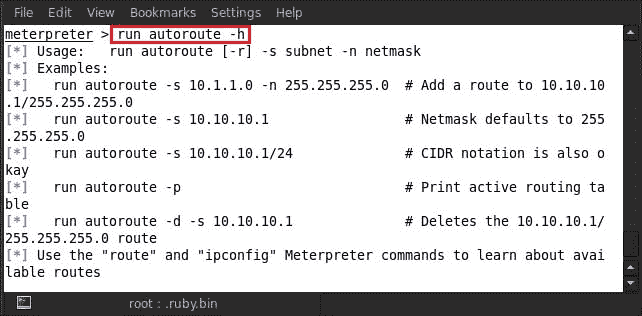

1.  在这里，我们使用`run autoroute -s 10.10.10.1/24`；运行此命令将从我们的被攻陷系统向目标机器添加一条路由。

1.  现在，我们可以在前面的截图中看到通过`192.168.0.110`添加了一条路由，这是我们的被攻陷系统。现在我们将验证我们的路由是否已添加，输入`run auroroute -p`。

1.  我们可以在截图中看到我们的路由已成功添加到路由表中。接下来我们要做的是提升被攻陷系统的权限。为此，我们输入`getsystem`。

1.  提升了被攻陷系统的权限后，我们现在可以转储所有用户的哈希并获取他们的密码。为此，我们输入`run hashdump`。

1.  成功转储凭证后，我们将通过按下*Ctrl* + *Z*然后按*Y*将我们的`meterpreter`进程放到后台。

1.  接下来要做的是扫描第二个网络地址，检查其他系统是否在线，还要检查开放的端口。因此，我们使用辅助模块进行 TCP 端口扫描。为此，我们输入`use auxiliary/scanner/portscan/tcp`。

1.  现在输入`show options`，它将显示该模块可用的所有选项。

1.  现在我们将在`RHOST`选项中设置我们的目标地址范围。因此，输入`set rhosts <target IP range>`；例如，在这里我们使用`set rhosts 10.10.10.1/24`。

1.  接下来，设置我们要查找的端口号。在这里，我们正在寻找计算机系统中发现的最常见的开放端口。因此，输入`set ports <port number>`；例如，在这里我们输入`set ports 139,445`。

1.  接下来，我们将设置用于扫描 TCP 端口的并发线程数。因此，我们通过输入`set threads 50`来设置 50 个线程。

1.  现在我们的辅助模块已经完全加载用于扫描。我们将要执行的最后一个命令是`run`命令。因此，输入`run`。

我们可以在前面的截图中看到，我们的辅助 TCP 模块扫描器已经启动，并发现两台在线系统的 IP 为 10.10.10.1 和 10.10.10.2，并且还发现该系统上有两个开放端口 139 和 445。这里 IP 10.10.10.1 已经受到影响，所以我们的目标是 IP 10.10.10.2。

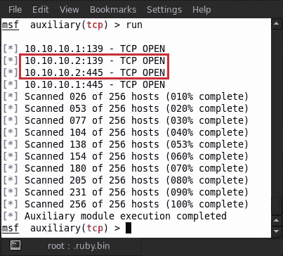

设置目标 IP 后，现在设置用于攻击目标系统的有效载荷。这次我们使用`windows/meterpreter/bind_tcp`有效载荷进行攻击。因此输入`set payload windows/meterpreter/bind_tcp`。

现在一切都准备就绪进行攻击，因此输入致命的`exploit`命令。

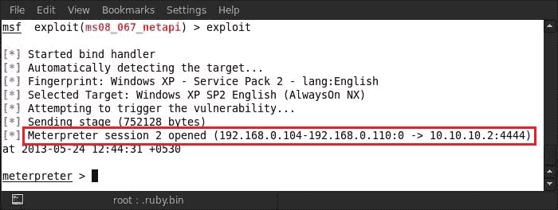

在触发`exploit`命令后，我们可以看到`meterpreter`会话 2 已在 IP 10.10.10.2 上打开。我们已经从受影响的系统获得了会话 1；通过受影响的系统，我们能够在网络中攻击另一个系统。

现在让我们检查系统，看看我们是否已经攻击了正确的系统，通过检查其属性。因此输入`sysinfo`。

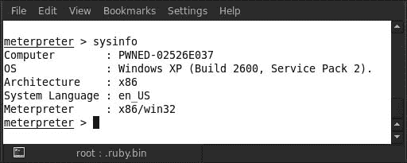

我们可以在截图中看到系统的名称是**PWNED**，所以现在我们将验证这个名称。

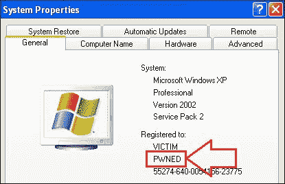

# 现在我们将使用一个利用来攻击另一个系统。我们将要使用的利用已经在第三章中使用过，*利用基础*；所以我们非常了解使用这个利用的过程。现在让我们开始；输入`use exploit/windows/smb/ms08_067_netapi`并按*Enter*。然后输入`set rhost <目标 IP>`；例如，这里我们使用`set rhost 10.10.10.2`。

在转向网络之后，我们现在转向另一个主题，学习如何使用`meterpreter`后渗透脚本在网络中进行嗅探。在使用嗅探器之前，我们必须在`meterpreter`会话中加载嗅探器扩展。因此，输入`use sniffer`。

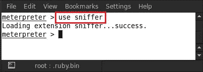

我们可以在截图中看到，我们的嗅探器扩展已经成功被`meterpreter`加载。在使用嗅探器之前，我们必须知道嗅探器的使用命令；为此，在`meterpreter`会话中输入`help`，它将显示所有`meterpreter`命令。在那里，您将找到所有嗅探器使用命令，如下图所示：

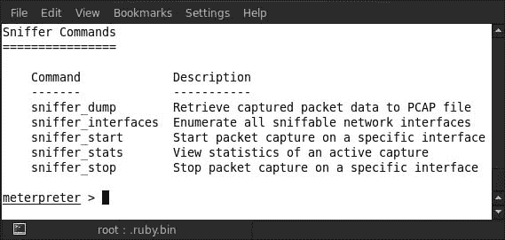

现在，我们可以看到嗅探器脚本的所有命令。首先，我们将枚举要在其上启动嗅探器的网络接口。因此输入`sniffer interfaces`。

在枚举网络接口之后，现在是选择一个接口并在该网络接口上运行嗅探器的时间。输入`sniffer_start <接口号>`；例如，这里我们选择接口号 1，所以输入`sniffer_start 1`。

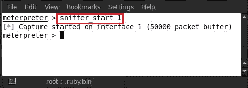

现在我们可以看到我们的嗅探器正在运行，并已开始在`接口 1`上捕获数据包。因此，让我们通过输入`sniffer_stats 1`来检查`接口 1`上捕获的数据包状态。

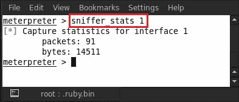

我们可以看到到目前为止我们已经捕获了`91`个大小为`14511`字节的数据包。现在我们想要转储或保存捕获的数据包以供进一步分析，因此我们输入`sniffer_dump <接口号> <保存为 pcap 扩展名的文件名>`；例如，这里我们使用`sniffer_dump 1 hacked.pcap`。

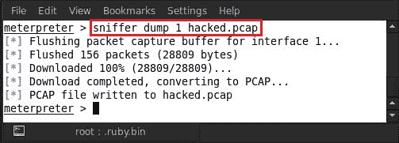

现在我们将使用著名的数据包分析器和捕获工具 Wireshark 来分析这个捕获的数据包文件。因此打开一个新的终端，输入`wireshark <捕获的数据包文件名>`；例如，在这里我们使用`wireshark hacked.pcap`。

执行`wireshark`命令后，我们可以看到 Wireshark 工具的图形用户界面。

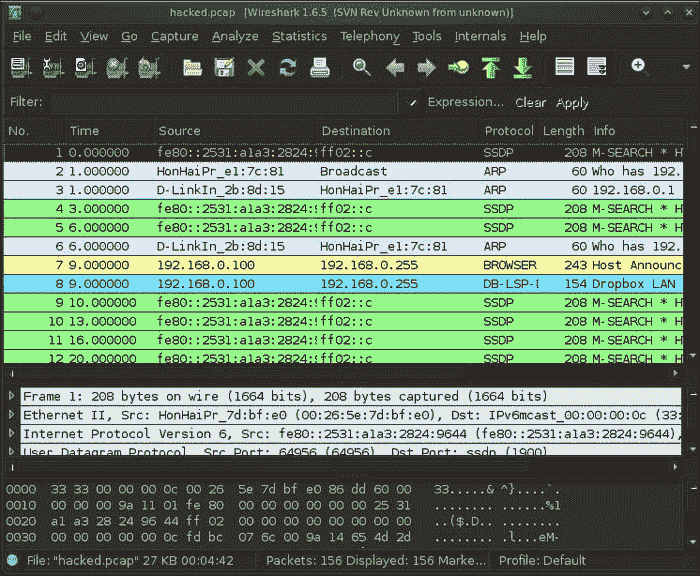

还有另一种在`meterpreter`中嗅探和捕获数据包的方法，这也是一个名为`packetrecorder`的`meterpreter`后渗透脚本。输入`run packetrecorder`，它将显示`packetrecorder`的所有使用命令。

我们可以看到`packetrecorder`的所有使用选项。因此，首先我们将枚举可用于嗅探的网络接口，输入`run packetrecorder -li`。

现在我们可以看到我们有两个可用的网络接口。选择一个接口来运行我们的嗅探器。因此输入`run packetrecorder -i 1 -l /root/Desktop`。

使用语法如下解释：

+   `i`代表接口号

+   `l`代表保存捕获数据包文件的位置

在运行`packetrecorder`脚本后，如前面的截图所示，数据包正在保存在位置`/root/Desktop/logs/packetrecorder`。让我们在系统中检查一下这个目录。

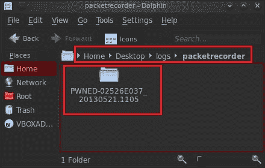

## Espia 扩展

Espia 扩展也是另一个有趣的扩展，在使用之前我们必须在`meterpreter`中加载它。因此输入`load espia`。

我们的 espia 扩展已经成功被`meterpreter`加载，正如我们在之前的截图中所看到的。现在在`meterpreter`中输入`help`命令，它将显示此扩展中可用的使用命令。

我们可以看到 espia 扩展中只有一个可用的命令，即`screengrab`。使用此命令，我们可以抓取受损系统的屏幕截图。输入`screengrab`。

在截图中，我们可以看到捕获的屏幕截图保存在根目录中。因此让我们检查一下屏幕截图是否保存在根目录中。

# 总结

在本章中，我们介绍了各种技术，通过这些技术，我们可以利用外部网络上的我们的接触点服务器/系统，并利用它来利用其他系统。由于接触点系统有另一个用于与内部网络连接的网络卡，我们利用这一点从外部系统到内部系统进行了转移。因此，一旦我们连接到内部网络，我们也能够通过前几章介绍的我们的利用技术来利用它。下一章将介绍使用 Metasploit 学习利用编写的艺术。

# 参考

以下是一些有用的参考资料，进一步阐明了本章涉及的一些主题：

+   [`www.offensive-security.com/metasploit-unleashed/Pivoting`](http://www.offensive-security.com/metasploit-unleashed/Pivoting)

+   [`www.securitytube.net/video/2688`](http://www.securitytube.net/video/2688)

+   [`www.offensive-security.com/metasploit-unleashed/Packet_Sniffing`](http://www.offensive-security.com/metasploit-unleashed/%E2%80%A8Packet_Sniffing)
