# 第一章.基础知识

如今，安全是任何组织最重要的主题，无论其规模或业务类型如何。这主要是因为组织不想因安全受到影响而失去声誉或业务；其次，他们必须满足法律和监管要求。在基础设施的技术安全方面，漏洞评估和渗透测试（PT 或 PenTest）起着至关重要的作用。本章介绍了 PT 或 PenTest 是什么，为什么需要以及如何为组织设置和管理 Nessus。

本章将向您介绍 Nessus，这是一个用于漏洞评估和渗透测试的工具。我们还将涵盖以下主题：

+   漏洞评估

+   渗透测试

+   Nessus 简介

+   在不同平台上安装 Nessus

+   更新 Nessus 插件

+   Nessus 用户管理

+   Nessus 系统配置

# 漏洞评估和渗透测试

漏洞评估（VA）和渗透测试（PT 或 PenTest）是使用不同工具进行的最常见的技术安全风险评估或技术审计类型。如果这些工具被最佳地使用，它们将提供最佳结果。不正确的配置可能导致多个错误的阳性结果，这些结果可能反映或可能不反映真正的漏洞。漏洞评估工具被广泛应用于所有组织，从小型组织到大型企业，以评估其安全状态。这有助于他们及时做出保护自己免受这些漏洞影响的决策。本书概述了使用 Nessus 进行漏洞评估和 PenTest 的步骤。Nessus 是一个广泛认可的用于此类目的的工具。本节向您介绍了与这两种评估类型相关的基本术语。

就 IT 系统而言，漏洞可以定义为系统/基础设施中的潜在弱点，如果被利用，可能导致对系统的攻击。

漏洞的一个例子是系统中的弱密码，可以通过暴力攻击（字典攻击）来利用。这可能导致密码被破解，未经授权的人获得对系统的访问权限。

### 注意

本书中的“系统”一词指的是信息技术或非信息技术环境中存在的任何资产。

漏洞评估是一种逐步识别基础设施中存在的漏洞的方法。这可以使用自动扫描工具（如 Nessus）来完成，该工具使用其对应于基础设施中不同类型已知安全漏洞的插件集，或者使用基于手册的清单方法，该方法使用最佳实践和已知漏洞跟踪站点上的已发布漏洞。手动方法不如基于工具的方法全面，并且需要更多时间。漏洞评估工具执行的检查也可以手动完成，但这将比自动工具需要更多的时间。

渗透测试在漏洞评估中有一个额外的步骤，即利用漏洞。渗透测试是一种侵入性测试，进行渗透测试的人员将首先进行漏洞评估以识别漏洞，然后尝试利用已识别的漏洞渗透系统。

## 漏洞评估的需求

你理解为什么需要漏洞评估或渗透测试非常重要。尽管进行漏洞评估或 PenTest 有多种直接或间接的好处，但以下是一些记录下来的，以便你理解。

### 风险预防

漏洞评估揭示了系统中的漏洞/空白/漏洞。通过定期运行这些扫描，组织可以及时识别 IT 基础设施中已知的漏洞。漏洞评估减少了不符合不同合规性和监管要求的可能性，因为您已经知道了您的漏洞。及时了解这些漏洞可以帮助组织在被利用之前提前修复它们并减轻涉及的风险。被利用漏洞的风险包括：

+   由于漏洞利用而导致的财务损失

+   组织声誉

+   数据盗窃

+   机密性妥协

+   完整性妥协

+   可用性妥协

### 合规要求

众所周知的信息安全标准（例如 ISO 27001、PCI DSS 和 PA DSS）规定了必须执行漏洞评估的控制要求。

一些国家对某些特定行业部门（如银行业和电信业）进行漏洞评估有特定的监管要求。

## 漏洞评估和渗透测试的生命周期

本节描述了 VA 和 PenTest 生命周期中的关键阶段。这些生命周期几乎相同；渗透测试涉及利用已识别的漏洞的额外步骤。

建议根据组织的测试要求和业务目标执行测试，无论是漏洞评估还是渗透测试。此生命周期涉及以下阶段：

1.  界定

1.  信息收集

1.  漏洞扫描

1.  假阳性分析

1.  漏洞利用（渗透测试）

1.  报告生成

以下图示了建议遵循的不同顺序阶段，用于进行漏洞评估或渗透测试：

漏洞评估和渗透测试的生命周期

### 阶段 1 - 界定

界定是任何安全评估活动的首要步骤。为了执行 VA 或 PenTest，第一步是确定评估范围，例如要对其进行评估的基础设施，例如服务器、网络设备、安全设备、数据库和应用程序。界定取决于漏洞评估的业务目标。在界定期间，还应达成扫描窗口的协议。还应达成允许的攻击类型。在确定评估范围之后，该阶段还包括测试的计划和准备工作，包括确定团队、测试的日期和时间。在开始参与之前，还应注意另一个重要因素，即在进行这些测试的基础设施方和安全测试人员之间签署正式的参与协议。界定还应包括确定要测试的基础设施元素的数量。

除了基础设施范围和其他程序管理模式外，还应确定评估的确切范围、组织对业务目标的方法以及评估的方法。为了确定业务目标，组织应确定希望模拟的攻击类型。

一家公司可能寻求的一个目标是：“通过只知道公开的 IP 地址，找出外部攻击者针对外部暴露的基础设施能够实现什么。”这种要求将通过对基础设施和应用程序进行外部黑盒渗透测试来满足，并且方法和方法应符合这一要求。

根据基础设施从互联网或内部网络的可访问性，测试可以从外部或内部网络进行。此外，根据详细信息的类型，基础设施测试可以是黑盒或灰盒。根据基础设施的类型，应启用漏洞扫描工具的插件或功能，并辅以适当的手动检查。

### 注意

在黑盒测试中，只会向测试人员提供 IP 地址等详细信息。关于基础设施的洞察力，例如类型和操作系统版本，不会与 Nessus 扫描器共享；这种类型的测试将涉及非凭证扫描。这使得测试人员可以模拟对基础设施了解有限的外部攻击者。

灰盒测试将包括一些基础设施的详细信息，例如允许获取更全面的管理员凭据的设备类型和软件版本，以便更全面地使用工具进行结果。此外，为了模拟对基础设施有了解的内部攻击者，对于 Nessus 扫描器，这种类型的测试将涉及凭证扫描，提供更全面的结果。

### 第二阶段 - 信息收集

信息收集是 VA-PT 评估的第二个和最重要的阶段。这个阶段包括使用技术（WhoIS）和非技术被动方法（如搜索引擎和互联网群体）来获取有关目标系统的信息。这一步是至关重要的，因为它有助于更好地了解目标基础设施及其资源。由于评估的时间表通常是有限的，因此在此阶段捕获的信息有助于通过使用适用于目标系统的正确工具和方法来使测试工作朝着正确的方向进行。对于黑盒评估来说，这一步变得更加重要，因为关于目标系统的信息非常有限。

信息收集后，会采用更加技术化的方法来使用 ping 和 Telnet 等工具来映射目标网络，并使用诸如 NMAP 之类的端口扫描器。使用这些工具可以使评估人员找到活动主机、开放服务、操作系统和其他信息。

通过网络映射收集的信息将进一步验证通过其他被动手段收集的有关目标基础设施的信息，这对配置漏洞扫描工具非常重要。这确保了扫描的更加适当。

### 第三阶段 - 漏洞扫描

这个阶段涉及对目标基础设施进行实际扫描，以识别系统的现有漏洞。这是使用诸如 Nessus 之类的漏洞扫描器完成的。在扫描之前，工具应根据初始阶段捕获的目标基础设施信息进行最佳配置。还应注意，工具能够通过允许访问诸如防火墙之类的相关中间系统来到达目标基础设施。这些扫描器执行协议 TCP、UDP 和 ICMP 扫描，以查找目标机器上运行的开放端口和服务，并将它们与工具的签名数据库中定期更新的已知发布的漏洞进行匹配。此阶段的输出提供了目标基础设施中存在的漏洞的整体视图，如果利用这些漏洞可能导致系统受损。

### 第四阶段 - 误报分析

在扫描阶段的输出中，人们会获得目标基础设施的漏洞列表。其中一个关键活动是进行误报分析，即删除工具错误报告的不存在的漏洞。所有扫描工具都容易出现误报，可以使用诸如将漏洞相互关联和以前收集的信息和扫描报告进行分析，以及实际检查系统访问是否可用等方法进行分析。

漏洞扫描器为已识别的漏洞提供其自己的风险评级；可以重新考虑基础设施元素（服务器或网络设备）的实际关键性和漏洞的影响。

### 第 5 阶段 - 漏洞利用（渗透测试）

如果系统所有者需要证明现有漏洞或利用以了解攻击者可以对易受攻击系统造成的影响程度，测试人员将需要在受控环境中演示利用漏洞，而不会使基础设施不可用，除非有这样的要求。渗透测试是漏洞评估的下一步，旨在基于已识别的漏洞进行渗透目标系统。对于利用，可以利用我们自己的知识或公开可用的对已知漏洞的利用。渗透测试或漏洞利用可以广泛分为预渗透、利用和后渗透等阶段。

预渗透阶段的活动在 1 到 4 阶段中进行解释，即枚举基础设施和识别漏洞。

一旦利用任何漏洞来访问系统，攻击者应该进一步详细了解网络，通过嗅探流量、映射内部网络，并尝试获取更高权限的帐户，以获得对系统的最大访问权限。这将使测试人员能够对网络发动进一步攻击，以进一步增加受损系统的范围。后渗透步骤还将涉及通过进行清除日志和禁用防病毒等活动来清除痕迹。

作为后渗透阶段的测试人员，您可以演示攻击者如何通过后门和 rootkit 保持对系统的访问。

### 第 6 阶段 - 报告生成

根据工作范围完成评估后，需要进行最终报告，涵盖以下关键领域：

+   关于评估的简要介绍

+   评估范围

+   管理/执行摘要

+   风险严重性的发现摘要

+   每个发现的详细信息及其影响以及您修复漏洞的建议

# Nessus 简介

Nessus 是最广泛使用的漏洞评估产品之一。这个工具由 Renaud Deraison 于 1998 年首次发布，过去 15 年来一直是行业中最受欢迎的漏洞扫描工具之一。

Nessus 的官方网站（http://www.tenable.com）对其进行了如下描述：

> “Nessus®是业界最广泛部署的漏洞和配置评估产品。Nessus 具有高速发现、配置审计、资产概况、敏感数据发现、补丁管理集成以及安全姿态的漏洞分析。Nessus ProfessionalFeed®提供了一个不断更新的库，其中包含超过 50,000 个个别漏洞和配置检查，并得到专家漏洞研究团队的支持，Nessus 为市场提供了准确性。Nessus 可扩展以服务最大的组织，并且部署快速简便。”

多年来，Nessus 已经从纯粹的漏洞扫描工具发展为包括配置审计、合规审计、补丁审计、控制系统审计和移动设备审计等附加评估和审计功能。它以其易用性和灵活性而闻名。

Nessus 漏洞扫描器涵盖的关键基础设施包括以下内容：

+   **网络设备**：包括 Juniper、Cisco、防火墙和打印机

+   **虚拟主机**：包括 VMware ESX、ESXi、vSphere 和 vCenter

+   **操作系统**：包括 Windows、Mac、Linux、Solaris、BSD、Cisco iOS 和 IBM iSeries

+   **数据库**：包括 Oracle、MS SQL Server、MySQL、DB2、Informix/DRDA 和 PostgreSQL

+   **Web 应用程序**：包括 Web 服务器、Web 服务和 OWASP 漏洞

Nessus 漏洞扫描器是一款易于使用的工具。对于这个工具的新手来说，可以很容易地学会它。

## 初始 Nessus 设置

有关如何安装 Nessus 的详细步骤将在本章后面给出。安装 Nessus 后，您可以为您的 Nessus 扫描仪进行一次性设置，例如设置用户帐户以访问扫描仪；一般设置，如配置 SMTP 或 Web 代理、饲料设置、移动设置和结果设置；以及配置高级配置设置。这些设置将在本章后面详细介绍。它们非常独特，适用于您的扫描环境，这取决于您组织的安全策略和偏好。在进行扫描之前，您可能还希望根据要求创建一些通用策略。

## 安排扫描

Nessus 提供了在未来对目标主机进行扫描的灵活性。这就像作业调度一样。您可以提前配置和安排预定义的时间和策略。Nessus 将在指定的时间自动启动扫描，并将结果发送到预定义的电子邮件地址。这不需要任何手动触发来调用扫描。您还可以安排重复扫描，比如“我的扫描目标 IP 应该在每周四的欧洲中部时间凌晨 3 点进行扫描”。大多数时候，大型企业组织面临着很多挑战，以确定扫描窗口。扫描窗口是扫描的时间范围，定义了扫描应该在何时进行以及扫描应该在何时完成。通常，扫描窗口是根据扫描机器上的生产负载来决定的。建议只在非高峰时段扫描生产机器。非高峰时段是指目标或扫描机器在一天/一周内最少使用的时间。

## Nessus 插件

为了实现全面的安全检查，Nessus 提供了大量插件，这些插件分组在一起提供类似的安全检查。分组允许一次性禁用或启用大量基于目标机器的插件。主要插件系列的示例包括 Windows、Linux、Solaris、Cisco 和数据库。有关插件和家庭饲料之间的区别的详细信息，请参阅 Nessus 官方网站[`plugins.nessus.org`](https://plugins.nessus.org)。

作为最广泛使用的工具之一，Nessus 在[`discussions.nessus.org`](https://discussions.nessus.org)上拥有一个活跃的在线支持社区。

Nessus 是一种成本效益最高的扫描工具之一，具有低总拥有成本（TCO）和可以扫描无限数量的 IP 等功能。Nessus 订阅包括软件更新、访问 Tenable 的合规性和审计文件以及支持。此外，它还包括每日漏洞和配置检查的自动安装更新。

### 注意

除了介绍 Nessus，本章还描述了漏洞评估和渗透测试的基础知识，这是使用 Nessus 进行的两种最常见的技术风险评估类型。除此之外，还描述了 Nessus 中的各种安装选项。

## 使用 Nessus 进行补丁管理

Nessus 在补丁管理方面非常成功；这是通过将 Nessus 与各种补丁管理解决方案集成实现的。这里的好处是，您无需向 Nessus 提供扫描目标机器的凭据；相反，您需要为补丁管理系统提供凭据。这是因为补丁管理系统将已经具有到达目标主机的凭据。

## 使用 Nessus 进行治理、风险和合规性检查

Nessus 提供不同格式的输出，如 HTML、CSV 和 PDF。这使得将输出提供给不同的工具进行集成变得更加灵活。这些工具可以是治理、风险和合规性工具，如 EMC RSA Archer SmartSuit 或任何其他类似的工具。

# 在不同平台上安装 Nessus

Nessus 支持几乎所有流行的操作系统。根据操作系统的可用性，可以按照本节中给出的安装步骤来安装 Nessus。最新的信息/步骤也可以从 Nessus 的官方网站获取。在撰写本书时，Nessus 支持以下操作系统平台：

+   Microsoft Windows – XP, 2003, 2008, Vista, 2012, 7 和 8

+   Linux – Debian, Red Hat, Fedora, SuSE, Ubuntu

+   Solaris

+   Mac

+   Free BSD

+   校验和 GCP 密钥

有关上述列表的最新详细信息可以从 Tenable Nessus 的官方网站[`www.tenable.com/`](http://www.tenable.com/)获取。

## 先决条件

扫描机应该有 4GB 的内存（最好）。但是，请参考 Nessus 的官方网站[`www.tenable.com/`](http://www.tenable.com/)获取最新的要求。

更好的处理器将支持快速扫描。扫描机应根据 Nessus 扫描的范围进行选择；如果您计划对大型企业进行漏洞评估，建议使用高端服务器机器。

### 注意

没有防火墙应该阻止 Nessus 生成的流量到达扫描目标系统。如果有防火墙，应配置防火墙规则以允许 Nessus 机器生成的所有流量到达扫描目标。请不要忘记在扫描活动完成后停用此防火墙规则。

如果使用 Web 代理访问扫描机器，应在 Nessus 中输入代理身份验证凭据。这取决于您的扫描环境是否需要此可选设置。

您应该具有在机器上安装 Nessus 的管理权限，并且需要激活 Nessus 插件订阅码以更新插件。

## 在 Windows 7 上安装 Nessus

要获取最新的 Nessus 软件包，无论是购买还是评估，都应该浏览 Tenable Nessus 的官方网站[`www.tenable.com/`](http://www.tenable.com/)：

1.  登录 Nessus 网站，从**产品**部分购买并下载最新的 Nessus 软件。

应根据要安装 Nessus 的操作系统下载 Nessus 软件包。应按照 Nessus 网站上给出的步骤下载 Nessus 软件包。

重要的是要注意，应根据您计划扫描其他系统的扫描机操作系统来下载 Nessus，而不是根据您打算扫描的操作系统来下载。例如，如果您需要从 Windows 2008 服务器机器扫描 10 台 Linux 机器、一台 Solaris 机器和五台 Windows 机器，应下载 Windows 2008 操作系统的 Nessus 软件包。根据操作系统的位数，可以选择 32 位/64 位软件包。

1.  一旦您下载了 Nessus 可执行文件（Nessus 安装程序包），双击它开始安装。如果您没有管理员权限，请按下*Shift*并右键单击可执行文件；点击“以管理员身份运行”以使用管理员帐户运行安装程序。

1.  您可能会收到一个安全警告“是否要运行此文件？”。点击“运行”按钮。

1.  点击“运行”后，安装程序将弹出一个窗口以继续安装。

1.  点击“下一步”，这将弹出 Nessus 许可协议的窗口。每个人都有必要阅读许可协议并遵守。

1.  要继续进行 Nessus 安装，您需要接受许可协议并点击“下一步”。

1.  您可以选择更改要安装 Nessus 的目录。点击“下一步”以继续。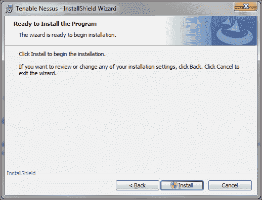

1.  点击“安装”以继续。

1.  在安装过程中，您可能会收到一个提示，询问“是否要安装此设备软件？”。如果您需要信任 Tenable 网络安全公司的所有软件，请选择复选框“始终信任 Tenable 网络安全公司的软件”。这不是必选项。点击“安装”以继续。

1.  以下截图表示安装成功。点击“完成”以继续：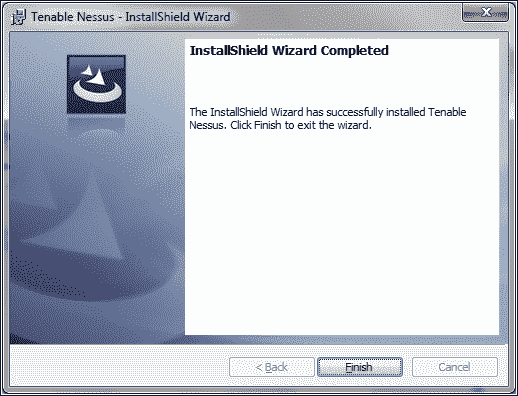

成功安装 Nessus 后，您需要进行基本配置，如默认设置、用户创建和激活码。

以下截图显示了 Nessus 的 Web 视图。Nessus 默认在端口 8834 上运行：


Nessus 警告有关 SSL 证书。它默认不带 SSL 证书。Nessus 管理员必须获取 SSL 证书以配置 SSL。

如果您想现在安装 SSL 证书，请安装它；否则，点击“无论如何进行”将带您进入介绍页面。

点击“开始”以继续。

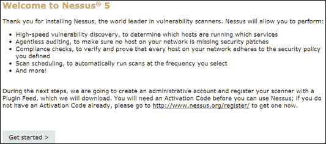

在此之后，您需要做的第一件事是设置管理帐户。此帐户在 Nessus 服务器上创建。此帐户应始终记住以进行 Nessus 管理。


在创建管理帐户之后，Nessus 将提示进行插件订阅和代理设置，这是可选的。

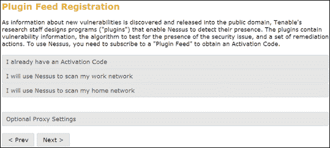

插件订阅必须根据您预期的使用情况进行。注册后，您将获得一个激活码，您需要将其用于插件订阅。

## 在 Linux 上安装 Nessus

要获取最新的 Nessus 软件包，无论是购买还是评估目的，您应该访问 Tenable Nessus 的官方网站[`www.tenable.com/`](http://www.tenable.com/)：

1.  登录到 Nessus 网站，从“产品”部分购买并下载最新的 Nessus 软件，根据您的操作系统和版本。这里概述的步骤适用于 Red Hat Linux 5.2。

1.  一旦您下载了 Nessus 可执行文件（Nessus 安装程序包），双击它开始安装过程。安装需要管理员/根权限。

您将看到以下截图中显示的“正在安装软件包”窗口：


1.  点击“应用”按钮。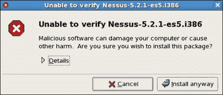

1.  点击“无论如何安装”以继续安装。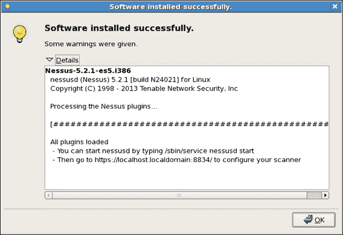

前面的屏幕截图显示 Nessus 已成功安装在 Red Hat Linux 环境中。要开始，应启动 Nessus 服务。

1.  应在 Linux 终端上执行以下命令以启动 Nessus 服务：

```
    # /sbin/service nessusd start

    ```

以下屏幕截图显示了 Nessus 服务启动状态为**OK**：


1.  配置 Nessus 扫描仪，将 URL `https://localhost.localdomain:8834/` 输入到 Linux 框的 Web 浏览器中。

此页面显示了安全连接错误，可以通过向 Web 浏览器添加例外来纠正。

1.  单击**或者您可以添加例外**链接。

1.  单击**添加例外**，然后单击**获取证书**。这将激活**确认安全例外**按钮。一旦您点击这个按钮，Web 浏览器将显示 Nessus 扫描仪主页。

要进一步配置，可以按照 Windows 安装中概述的相同步骤进行注册、激活、更新插件、用户管理等操作。

# 定义更新

更新 Nessus 定义（插件）很重要，因为这可以使 Nessus 保持更新，并能够识别所有最新的漏洞。在使用 Nessus 进行成功的漏洞扫描之前，重要的是在进行扫描之前检查并更新 Nessus 的最新插件。

要在 Windows 机器上更新 Nessus，应执行以下步骤：

1.  使用管理员帐户登录 Nessus 服务器。

1.  从顶部菜单栏单击**配置**选项卡。

1.  单击**配置**选项卡后，Nessus 将打开系统配置设置。这将有子选项卡，即**常规设置**、**订阅设置**、**移动设置**、**结果设置**和**高级设置**。

1.  在左侧选择面板上单击**订阅设置**选项卡。这将打开一个页面以更新 Nessus 插件订阅。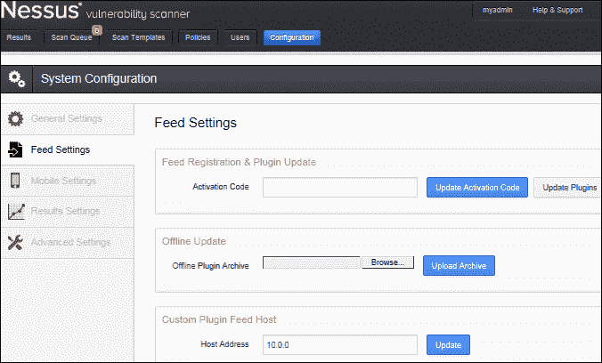

Nessus 提供以下多个订阅选项：

+   在线插件更新

+   离线插件更新

+   基于自定义插件源主机的更新

## 在线插件更新

在线插件更新是更新 Nessus 插件的最流行选项，并提供通过互联网更新插件的能力。这需要 Nessus 机器上相当良好速度的互联网连接。在 Nessus 注册和激活后，可以通过单击**更新插件**按钮来更新插件。

## 离线插件更新

当插件存档在本地目录中，Nessus 可以获取并更新时，使用离线插件更新。这不需要 Nessus 系统上的互联网连接。要设置离线更新，首先获取 Nessus 订阅激活代码，可以从 Nessus 支持或用于 Nessus 订阅注册的注册电子邮件 ID 中检索。

下一步是生成用于下载插件的挑战代码以及激活代码。

要在 Windows Nessus 机器上生成挑战代码，请在命令行工具中运行以下命令：

```
\Program Files\Tenable\Nessus> nessus-fetch.exe --challenge

```

对于 Linux Nessus 机器，命令略有不同；应在 Linux 终端上运行以下命令：

```
# /opt/nessus/bin/nessus-fetch --challenge

```

这将生成一个长字符串的字符，称为挑战代码。一个示例挑战代码是 `19c4ed603ac3e436a14239852c8fbf8f26f02d7b`。

为了继续离线下载插件，请转到 Nessus 插件离线下载页面[`plugins.nessus.org/offline.php`](https://plugins.nessus.org/offline.php)。加载后，页面提示输入挑战代码和激活代码。输入这些代码。


## 基于自定义插件源主机的更新

可以使用此选项设置自定义插件源主机。可以提供主机名或主机 IP 地址来设置这个。

# 用户管理

用户管理是 Nessus 提供的附加功能，对于 Nessus 在多个地点由多人使用的大型企业环境非常有用。在这种环境中，此功能使管理员能够为 Nessus 扫描仪上的多个用户启用不同级别的访问权限。

Nessus 为用户提供以下两种不同的角色：

+   管理员

+   非管理员

管理员角色可以访问 Nessus 的所有功能，而非管理员角色的访问权限有限。非管理员角色无法访问用户管理、常规设置、Feed 设置和高级设置。

在安装 Nessus 时，会为 Nessus 管理创建一个管理员用户。要进行 Nessus 用户管理，必须使用此帐户登录，因为它具有管理员权限。

在 Windows 机器上可以浏览 URL `https://localhost:8834/`。

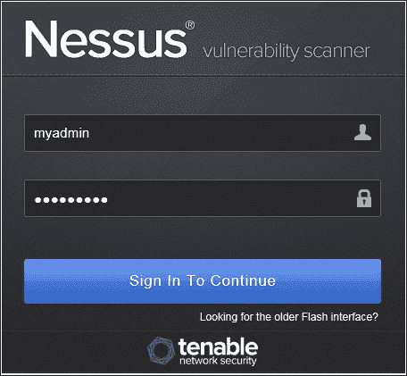

输入管理员用户名和密码进行登录。这将显示 Nessus 的主页，如前面的截图所示。

在管理员登录下将显示多个选项卡。单击**用户**选项卡以进行用户管理活动。

在 Nessus 中，用户管理提供以下选项：

+   添加新用户

+   删除现有用户

+   更改现有用户的密码

+   更改现有用户的角色

## 添加新用户

单击**新用户**按钮以添加新用户。


这将显示新用户提示，以设置新用户的用户名、密码和角色，如下截图所示：


## 删除现有用户

删除用户是在 Nessus 扫描仪上不再需要用户时使用的功能。在这种情况下，从**用户**标题中选择需要删除的用户，并单击右侧显示的选项中的**删除用户**按钮。

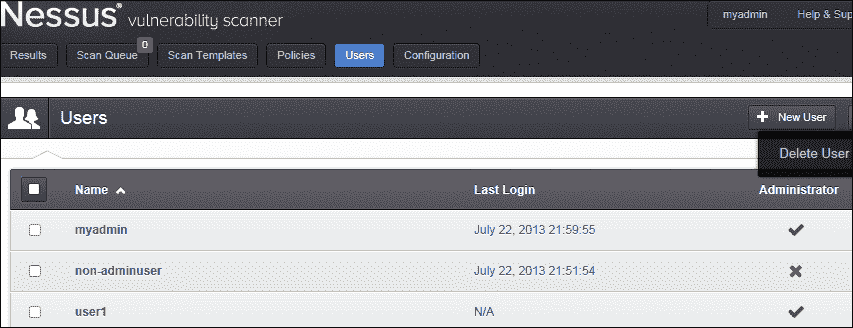

## 更改现有用户的密码或角色

有时，管理员会收到更改用户密码的请求。这可能是因为用户忘记了密码，或者因为需要更改用户的角色。在这种情况下，选择需要更改密码或角色的用户，并双击该用户。这将提示您使用以下窗口设置新密码或更改角色：


# Nessus 系统配置

Nessus 系统配置设置可以在**配置**选签下查看。这有五个不同的设置组，如下所示：

+   常规设置

+   Feed 设置

+   移动设置

+   结果设置

+   高级设置

## 常规设置

通过使用管理员权限登录到 Nessus，可以在**配置**下看到**常规设置**选项卡。在**设置类型**下拉菜单中存在两种不同的**常规设置**选项：

+   SMTP 服务器

+   Web 代理

SMTP 服务器设置允许您配置与 Nessus 服务器配合使用的 SMTP 服务器，以通过自动电子邮件发送完成扫描的结果。

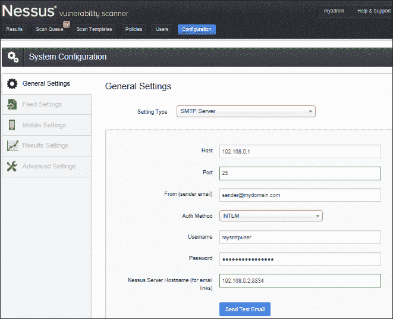

### SMTP 设置

可以根据您的 SMTP 配置配置不同的 SMTP 设置。SMTP 设置在以下表中进行了解释：

| SMTP 设置 | 描述 |
| --- | --- |
| 主机 | SMTP 服务器主机名或 IP。 |
| 端口 | 连接 SMTP 服务器的端口号。 |
| 发件人邮箱 | 报告电子邮件中应显示的发件人电子邮件 ID。 |
| 身份验证方法 | SMTP 身份验证方法。 |
| 用户名 | 用于对 SMTP 服务器进行身份验证的用户名。 |
| 密码 | 与此用户名对应的密码。 |
| Nessus 服务器主机名 | 仅用于电子邮件链接，需指定 Nessus 服务器主机名或 IP 地址。 |
| 发送测试邮件 | 允许您通过发送测试邮件进行测试。 |

### Web 代理设置

一些组织在外部和内部网络之间托管 Web 代理服务器以传递流量。在 Web 代理环境中更新 Nessus 的最新插件，需要根据组织设置配置 Web 代理设置。这使 Nessus 能够通过互联网访问 Nessus 插件服务器以下载最新的插件。

可以根据您的 Web 代理配置配置不同的 Web 代理设置。这些设置在以下表中有解释：

| Web 代理设置 | 描述 |
| --- | --- |
| 主机 | 代理主机名或 IP。 |
| 端口 | 代理连接的端口号。 |
| 用户名 | 连接代理的用户名。 |
| 密码 | 用于连接代理的用户名的密码。 |
| 用户代理 | 如果代理使用特定于过滤器的 HTTP 用户代理，则需要。需要指定自定义用户代理字符串。 |

## Feed Settings

**Feed Settings** 在本章的*定义更新*部分中有解释。

## Mobile Settings

最近，随着移动设备在企业领域的广泛使用，移动设备安全问题已成为优先考虑的问题，例如**自带设备**（**BYOD**）等概念被积极使用。这些设备连接到企业网络时，会带来其移动平台固有的漏洞。Nessus 提供了移动安全扫描选项，用于扫描最近连接到各自服务器的移动设备的信息和漏洞。

目前，插件与 iPhone 4、iPad、Windows Phone 和 Android 设备相关，并且 Nessus 具有扫描**Active Directory Service Interfaces**（**ADSI**）和苹果配置管理器以识别连接到这些服务器的移动设备和识别漏洞的能力。

**Mobile Settings** 选项卡提供了配置以下类型设置的选项：

+   **ActiveSync（Exchange）**

+   **苹果配置管理器**

+   **Good For Enterprise**

可以在以下截图中看到：


### ActiveSync（Exchange）

Nessus 可以配置为使用 ActiveSync 收集使用此协议获取电子邮件（通过 Exchange）的所有移动设备的信息。如果您有 Exchange 部署，可以配置域控制器设置，如以下表中所列：

| ActiveSync 移动设置 | 描述 |
| --- | --- |
| 域控制器 | 域控制器 IP。 |
| 域 | 域名。 |
| 域用户名 | 连接域的用户名。 |
| 域密码 | 用于连接的用户名的密码。 |

### 苹果配置管理器

Nessus 可以配置为使用苹果配置管理器收集有关所有 iOS 设备的信息。如果您部署了苹果配置管理器，可以配置以下表中列出的苹果配置管理器设置：

| Apple 配置管理器移动设置 | 描述 |
| --- | --- |
| 苹果配置管理器服务器 | 苹果配置管理器服务器 IP。 |
| Apple 配置管理器端口 | 连接的苹果配置管理器服务器端口。 |
| Apple 配置管理器用户名 | 登录的用户名。 |
| Apple 配置管理器密码 | 与用户名对应的密码。 |
| SSL | 根据环境选择/取消此选项。 |
| 验证 SSL 证书 | 如果要验证 SSL 证书，请选中此选项。 |
| 强制设备更新 | 如果要强制设备更新，请选中此选项。 |
| 设备更新超时（分钟） | 设备更新超时时间（分钟）。 |

### Good For Enterprise

Nessus 可以配置为使用 Good 移动设备管理收集使用此协议的所有移动设备的信息。如果您部署了 Good For Enterprise，可以配置以下表中列出的设置：

| 适用于企业移动设置 | 描述 |
| --- | --- |
| GMC 服务器 | 需要在此处提及 GMC 服务器 IP。 |
| 端口 | 用于与 GMC 服务器连接的端口号。 |
| 域 | 域名。 |
| 用户名 | 用于连接的用户名。 |
| 密码 | 与用户名对应的密码。 |
| SSL | 根据环境选择/取消选择此选项。 |
| 验证 SSL 证书 | 如果要验证设备，请选中此选项。 |

## 结果设置

**结果设置**可在**配置**下找到。这允许您添加规则以禁用插件或更改其严重性。

以下屏幕截图显示了如何添加新的插件规则：

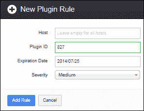

以下表详细说明了新的插件规则选项：

| 新插件规则选项 | 描述 |
| --- | --- |
| 主机 | 如果结果插件规则仅适用于特定 IP/主机，则可以在主机字段中提及主机。如果规则适用于整个扫描的主机，则可以将其留空。 |
| 插件 ID | 要提供的插件 ID，以指定规则所适用的插件。 |
| 过期日期 | 可在此处指定规则的过期日期，以防需要在特定日期过期。 |
| 严重性 | 可根据您想要设置的规则从下拉菜单中设置严重性。可以是隐藏、信息、低、中、高或严重。 |

### 高级设置

Nessus GUI 配置菜单包含多个可配置选项。

建议根据您的扫描环境审查和适当修改这些设置。可以使用**保存**按钮更改并保存选项，也可以使用选项旁边的**X**符号将其完全删除。

在修改即将出现的表中的`max_hosts`和`max_checks`值时需要特别注意。这些值代表一次扫描中要扫描的最大检查数和主机数，并直接影响要执行的扫描。如果`max_checks`的值大于**5**，可能会对目标服务器产生不利影响，因此应避免使用。同样，较高的`max_hosts`值可能会使主机扫描系统不堪重负，这取决于安装 Nessus 的主机的容量。建议将此值保持相对较低（可以从 10 开始）；可以根据环境和系统能力进行优化。

以下屏幕截图显示了其后的表中的一些选项；可以使用**添加设置**选项卡和**X**按钮分别添加或删除选项。

高级设置选项及其用途如 Nessus 文档中所述，均在以下表中提及：

| 新插件规则选项 | 描述 | 默认值 |
| --- | --- | --- |
| 允许后扫描编辑 | 如果启用，可以进行后扫描编辑。 | **是** |
| auto_enable_dependencies | 自动激活依赖于它的插件。如果禁用，尽管在扫描策略中选择了所有插件，但可能不会运行所有插件。 | **是** |
| 自动更新 | 控制自动插件更新。如果启用并且 Nessus 已注册，它将自动从 plugins.nessus.org 获取最新的插件。如果扫描仪位于无法连接到互联网的隔离网络上，则禁用。 | **是** |
| auto_update_delay | 两次更新之间等待的小时数。四小时（4）是允许的最小间隔。 | **24** |
| cgi_path | 在测试 Web 服务器时，使用冒号分隔的 CGI 路径列表。 | `/cgi-bin:/scripts` |
| checks_read_timeout | 允许您指定测试套接字的读取超时时间。 | **5** |
| disable_ntp | 禁用旧的 NTP 遗留协议。 | **是** |
| disable_xmlrpc | 禁用新的 XMLRPC（Web 服务器）接口。 | **否** |
| Dumpfile | 允许您指定调试输出的转储文件位置（如果生成）。 | `C:\ProgramData\Tenable\Nessus\nessus\logs\nessusd.dump` |
| global.max_hosts | 可以扫描的最大主机数。 | **130** |
| global.max_scans | 如果设置为非零，这允许您定义可以并行进行的最大扫描次数。 | **0** |
| global.max_simult_tcp_sessions | 最大同时 TCP 连接数。 | **50** |
| global.max_web_users | 如果设置为非零，这定义了可以并行连接的（Web）用户的最大数量。 | **1024** |
| listen_address | 用于侦听传入连接的 IPv4 地址。如果设置为 127.0.0.1，这将仅限制对本地连接的访问。 | **0.0.0.0** |
| listen_port | 用于侦听（旧的 NTP 协议）的端口。用于 4.2 版本之前的 NessusClient 连接。 | **1241** |
| log_whole_attack | 允许您记录攻击的每个细节，有助于调试扫描中的问题，但这可能会占用磁盘空间。 | **No** |
| Logfile | Nessus 日志文件的存储位置。 | `C:\ProgramData\Tenable\Nessus\nessus\logs\nessusd.messages` |
| max_checks | 对每个已测试主机的最大同时检查次数。 | **5** |
| max_hosts | 扫描期间一次检查的最大主机数。 | **5** |
| nasl_log_type | 指导`nessusd.dump`中 NASL 引擎输出的类型。 | **Normal** |
| nasl_no_signature_check | 允许您指定 Nessus 是否应将所有 NASL 脚本视为已签名。选择 Yes 是不安全的，不建议使用。 | **No** |
| non_simult_ports | 允许您指定不应同时运行两个插件的端口。 | **139, 445, 3389** |
| optimize_test | 允许您优化测试过程。将其更改为 No 会导致扫描时间更长，通常会产生更多的误报。 | **Yes** |
| plugin_upload | 允许您指定管理员用户是否可以上传插件。 | **Yes** |
| plugins_timeout | 插件活动的最长生命周期（以秒为单位）。 | **320** |
| `port_range` | 端口扫描器将扫描的端口范围。可以使用关键字**Default**或**All**，以及逗号分隔的端口或端口范围的列表。 | **Default** |
| `purge_plugin_db` | 允许您指定 Nessus 是否应在每次更新时清除插件数据库。这将指示 Nessus 在每次更新时删除、重新下载和重建插件数据库。选择**Yes**将导致每次更新都要慢得多。 | **No** |
| `qdb_mem_usage` | 指示 Nessus 在空闲时使用更多或更少的内存。如果 Nessus 在专用服务器上运行，将其设置为**High**将使用更多内存以提高性能。如果 Nessus 在共享机器上运行，将其设置为**Low**将使用更少的内存，但以适度的性能影响为代价。 | **Low** |
| `reduce_connections_on_congestion` | 允许您在拥塞情况下减少连接。 | **No** |
| `report_crashes` | 允许您指定是否匿名报告崩溃给 Tenable。 | **Yes** |
| `Rules` | Nessus 规则文件（`nessusd.rules`）的位置。 | `C:\ProgramData\Tenable\Nessus\conf\nessusd.rules` |
| `safe_checks` | 安全检查依赖于横幅抓取而不是主动测试漏洞。 | **Yes** |
| `silent_dependencies` | 如果启用此选项，则插件依赖项列表及其输出将不包括在报告中。插件可能被选择为依赖于其他插件运行的策略的一部分。默认情况下，Nessus 将运行这些插件依赖项，但不会在报告中包括它们的输出。将此选项设置为**No**将导致所选插件和任何插件依赖项都出现在报告中。 | **Yes** |
| `slice_network_addresses` | 如果设置了此选项，Nessus 将不会逐步扫描网络（10.0.0.1，然后 10.0.0.2，然后 10.0.0.3，依此类推），而是尝试在整个网络中切分工作负载（例如，它将扫描 10.0.0.1，然后 10.0.0.127，然后 10.0.0.2，然后 10.0.0.128，依此类推）。 | **No** |
| `ssl_cipher_list` | 确保在连接到端口 1241 时只使用“强大”的 SSL 密码。支持关键字 strong 或通用的 OpenSSL 指定，如 [`www.openssl.org/docs/apps/ciphers.html`](http://www.openssl.org/docs/apps/ciphers.html) 中列出的。 | **强大** |
| `stop_scan_on_disconnect` | 允许您停止扫描似乎在扫描期间已断开连接的主机。 | **不** |
| `stop_scan_on_hang` | 允许您停止似乎挂起的扫描。 | **不** |
| `throttle_scan` | 当 CPU 过载时，节流扫描会起作用。 | **是** |
| `www_logfile` | 允许您指定 Nessus web 服务器（用户界面）日志的存储位置。 | `C:\ProgramData\Tenable\Nessus\nessus\logs\www_server.log` |
| `xmlrpc_idle_session_timeout` | Nessus 的空闲会话超时时间。 | **30** |
| `xmlrpc_listen_port` | Nessus web 服务器监听的端口（新的 XMLRPC 协议）。 | **8834** |

所有这些高级设置在应用之前都需要进行适当的分析。推荐的设置可能因环境而异。

本章的一些部分，即特定配置设置，已经引用了 Nessus 网站上可用的学习材料：[`www.tenable.com`](http://www.tenable.com)。

# 总结

在本章中，我们学习了漏洞评估和渗透测试的基础知识，并对 Nessus 进行了介绍。

VA 和 PT 是关键的技术风险评估类型，其中 VA 专注于发现基础设施中的弱点或漏洞，而 PT 则进一步利用这些漏洞。

此类评估是作为预防控制进行的，以识别和减轻漏洞或满足各种合规性要求。此类测试的关键活动包括范围界定、信息收集、漏洞扫描、误报分析、漏洞利用（渗透测试）和报告生成。范围界定包括对黑盒（对基础设施没有信息）和灰盒（共享凭据和基础设施详细信息）测试的不同方法。

在本章中，我们还对 Nessus 进行了介绍，作为广泛使用的漏洞扫描器之一。它使用安全检查（称为插件），在扫描期间识别漏洞。关键的插件系列包括 Windows、Linux、Solaris、Cisco 和数据库。多年来，Nessus 还增加了配置和合规性检查等功能，除了漏洞扫描器的主要功能。

Nessus 可以安装在所有主要操作系统上，本章还提到了在 Windows 7 和 Linux 操作系统上安装 Nessus 的详细步骤以及先决条件。

在初始设置期间，创建了初始管理员帐户以便作为管理员登录 Nessus，并根据要求激活了家庭或专业订阅。

接下来是更新插件。还解释了离线更新插件的选项。Nessus 提供了一个用户管理部分，用于创建 Nessus 用户并为将来使用授予这些权限。最后，介绍了 Nessus 系统配置设置，如**Feed Settings**、**Mobile Settings**和**Advanced Settings**。

在下一章中，我们将学习如何使用 Nessus 扫描 IT 基础设施。
