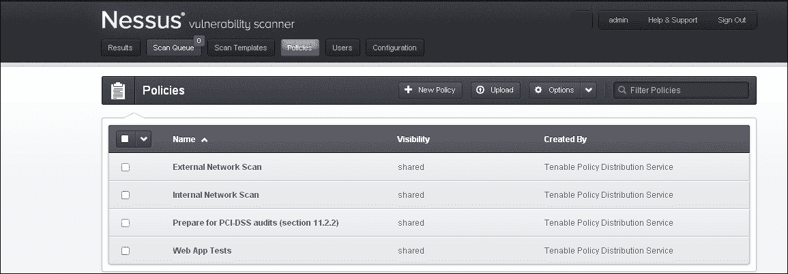
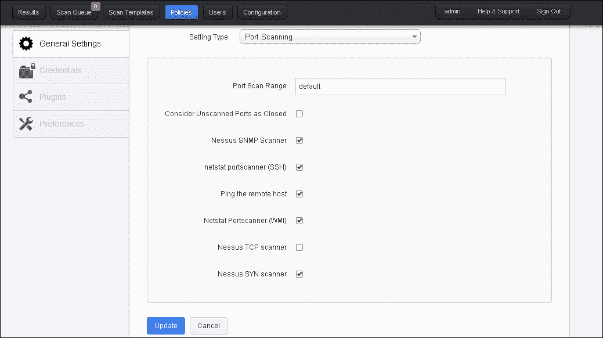
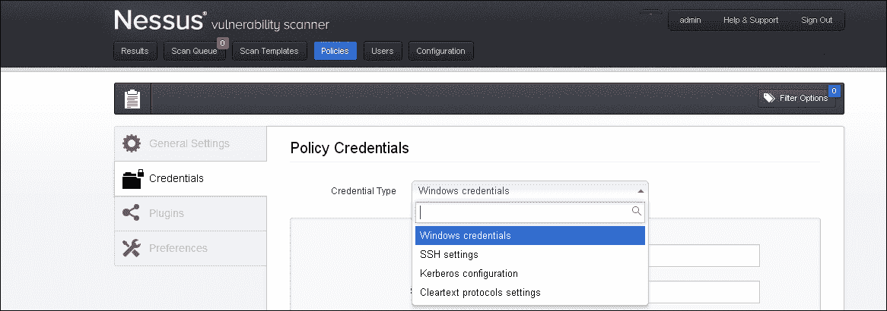
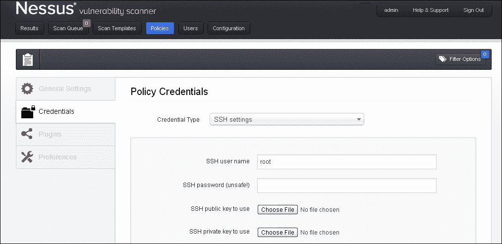
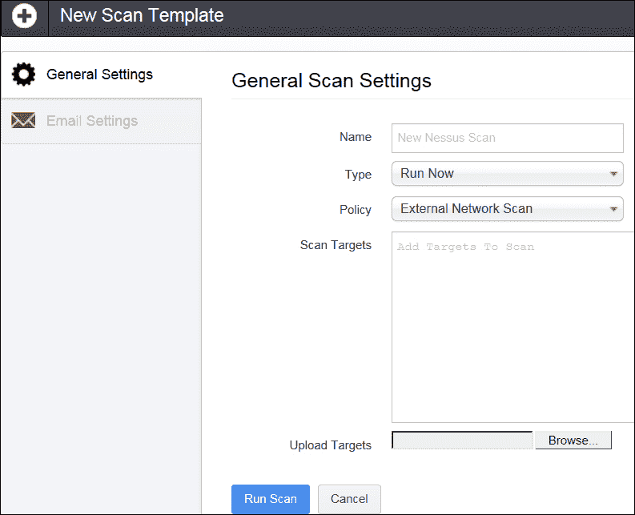
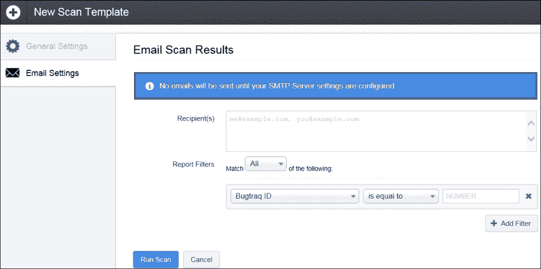

# 第二章。扫描

漏洞扫描，或者换句话说，识别目标基础设施中的漏洞，是任何漏洞扫描器（如 Nessus）执行的关键活动。在使用这些扫描器执行漏洞评估时，配置扫描参数非常重要，要以最有效的方式考虑目标基础设施。这将导致在优化的扫描时间内获得最有效的扫描结果。

本章将介绍如何设置 Nessus 进行漏洞扫描。 Nessus 中的扫描配置包括两个主要步骤，即配置扫描策略和使用配置的策略启动扫描。本章将涵盖的关键领域如下：

+   扫描先决条件

+   策略配置

+   凭证和非凭证扫描

+   扫描配置

+   扫描执行和结果

# 扫描先决条件

成功的漏洞扫描需要正确设置 Nessus 并满足一些先决条件。这将确保所有批准都有记录，所有备份都就位，并且在扫描之前已经达成了扫描窗口的协议。如果防火墙在 Nessus 和目标之间阻止流量/数据包，Nessus 将无法到达目标。

现在我们将看到最常见的先决条件，这些先决条件适用于大多数 Nessus 扫描；但是，我鼓励您根据您的扫描环境和组织的适用性进行分析。

## 基于扫描的目标系统管理员凭证

始终建议使用凭证扫描以获得更好的结果；这意味着在扫描目标系统之前，您应该获取目标系统的凭证，或者有人可以在开始扫描之前在 Nessus GUI 中输入目标系统的管理凭证，而不与您分享。这将帮助 Nessus 更多地探测目标系统，以发现最大的漏洞。如果您正在执行无凭证扫描，即您将无法访问凭证，这个特定的先决条件不适用。

## 无防火墙的直接连接

建议 Nessus 与目标系统直接连接以获得更好的结果；这意味着 Nessus 和目标系统之间不应该有防火墙或任何其他阻止流量的设备。如果 Nessus 和目标系统之间有防火墙，则应配置防火墙规则以允许 Nessus 和目标系统之间的所有流量。不要忘记在扫描完成后立即删除或停用此规则。这是因为 Nessus 会向目标系统生成大量恶意数据包/流量来探测漏洞。如果有防火墙存在，这将阻止所有这些恶意数据包到达目标系统。

## 同意的扫描窗口

目标系统的所有者可以告诉您漏洞扫描的最佳时间，具体取决于目标系统的高峰和低峰负载。这个合适的时间窗口称为**扫描窗口**。如果您在生产系统上运行扫描，与目标系统所有者达成扫描窗口协议非常重要。建议在目标系统负载最低的非高峰时段运行 Nessus 扫描。

## 扫描批准和相关文件工作

与目标系统所有者进行清晰的讨论非常重要，让他们了解由于恶意扫描可能发生的影响，这可能是侵入性扫描，也可能不是。每一方都应该了解进行漏洞扫描的风险并同意。这应该为法律目的记录下来。此外，每个进行漏洞评估或渗透测试的团队成员都应该签署一份保密协议。

## 包括数据和配置的所有系统备份

在进行扫描之前，重要的是对目标系统进行完整备份。这将确保如果由于漏洞扫描而导致目标机器出现问题，最新的备份可以立即恢复以使目标机器恢复正常。备份管理员应确保他们执行完整备份，其中包括所有数据、配置、集成信息、代码、发布说明等。

## 更新 Nessus 插件

在运行扫描之前，应更新 Nessus 插件的最新定义；这将确保您的 Nessus 加载了所有最新的检查项，以发现最新的漏洞。

## 根据目标系统的操作系统和信息创建扫描策略

在运行扫描之前，应根据目标系统的操作系统和环境配置扫描策略。策略应相应地在 Nessus 中进行配置。如何创建策略在本章的下一节中有详细说明。

## 配置扫描策略以检查组织的安全策略合规性

每个组织都有自己的安全策略。Nessus 提供了根据组织策略定制扫描策略的能力；例如，密码复杂性。在配置 Nessus 策略时，您应该小心地根据目标组织的密码策略定制密码策略。一个组织的密码策略可能会说，如果密码长度小于六个字符，则任何配置的密码都不符合规定，而其他组织可能会说，小于八个字符是不符合规定的。在运行扫描之前，Nessus 允许您根据您的要求定制策略。

## 收集目标系统的信息

在上一章中，我们看到了漏洞评估的不同阶段。扫描之前的一个阶段是信息收集，这又是扫描阶段的先决条件。您应该从公共网站、互联网和内部员工（在内部扫描或灰盒扫描的情况下）收集所有可能的信息。这些信息对于调整您的 Nessus 扫描策略以配置或选择所需的检查项是有用的，这些信息是基于您获取的有关目标系统的信息，也有助于映射网络以包括 IP 地址。

## 足够的网络带宽来运行扫描

使用良好的网络带宽运行扫描非常重要；如果在低带宽上运行扫描，可能会出现数据包在中途丢失的情况，扫描可能会中断。为了避免所有这些情况，建议在有良好网络带宽时运行扫描。这也将帮助您及时完成扫描。

## 目标系统支持人员

建议有目标系统管理员或专家支持人员来分析目标系统的健康和性能。如果他们在扫描窗口期间可用，他们可以持续监控目标系统并发出警报。如果系统表现不佳，停止扫描；或者如果出现问题，可以恢复系统。

# 策略配置

策略配置是在扫描之前执行的主要步骤。策略配置简单地意味着根据目标基础设施为 Nessus 设置最优化的扫描配置。

在设置策略时可以配置的关键参数如下：

+   策略的名称

+   所需的端口扫描类型

+   扫描性能，例如每次并行扫描的最大检查次数等，这将决定扫描时间

+   为被本地扫描的基础设施输入凭据的选项

+   选择最合适的插件的选项

+   提供不同下拉选项的高级首选项，以选择配置以进一步微调策略，具体取决于目标；例如，数据库合规性检查、Cisco IOS 合规性检查等

Nessus 提供了一个选项，如果您已经从其他地方获得了扫描策略，可以上传扫描策略。同样，还提供了导出和复制现有策略的选项。如果您有多个 Nessus 系统，可能希望使用导出和上传选项在所有 Nessus 系统上拥有相同的策略。如果您不再使用某个策略，也可以删除该策略。

## 默认策略设置

默认情况下，Nessus 扫描仪中预加载了四个默认策略模板；这些模板将使用户能够使用这些基本策略开始扫描，并了解典型策略配置的外观，或根据我们的要求进行自定义。

默认策略如下所示：

+   外部网络扫描

+   内部网络扫描

+   PCI DSS 审计策略

+   Web 应用程序测试策略

这些策略是不言自明的。如果要扫描外部网络，请使用外部网络扫描策略；如果要扫描内部网络，请使用内部网络扫描策略；如果要进行 PCI DSS 目的的扫描，请使用 PCI DSS 审计策略；最后，如果要扫描应用程序以查找与 Web 应用程序相关的漏洞，例如跨站请求伪造、跨站脚本和 SQL 注入，请使用 Web 应用程序测试策略。

建议使用这些默认策略作为基本模板来创建自己的定制策略。您可能希望复制现有的默认策略，并根据您的扫描要求将其保存为新名称。

## 新策略创建

下一节将使您熟悉在 Nessus 中设置扫描策略时可用的不同选项。要开始配置新的扫描策略，请在策略选项卡下单击**+新策略**选项。在此选项卡下，有四个策略设置选项可用，即**常规设置**、**凭据**、**插件**和**首选项**。

### 常规设置

**常规设置**选项卡使用户能够设置一般信息，例如扫描名称、扫描设置类型和描述。此设置下可用的设置包括基本、端口扫描、性能和高级。

**基本**设置包括以下选项：

+   **名称**：此选项允许为策略分配一个唯一名称

+   **可见性**：此选项允许与他人共享策略或保留私人使用；只有管理员用户可以共享策略

+   **描述**：此选项提供了一个选项，可以为将来参考向策略添加描述；例如，为数据库扫描配置的策略的描述可以更新为用户可以回忆和根据其设置目的使用策略的方式

+   **允许端口扫描报告编辑**：此选项允许您在端口扫描后删除报告中的项目；通常，在从合规性角度进行扫描时，应禁用此选项，以展示报告未被篡改，如下截图所示：

**端口扫描**设置包括以下选项：

+   **端口扫描范围**：指定要扫描的端口数量。**默认**表示 Nessus-services 文件中找到的 4,790 个常见端口，**ALL**表示所有 65,365 个端口。也可以使用`-`符号指定特定的端口范围。还可以使用`t:`和`u:`后跟端口范围在同一策略中扫描 TCP 和 UDP 的不同端口范围。可以使用逗号符号指定同一策略中 TCP/UDP 的不同端口范围；例如，`T 90;1000,U:350-400`。

+   **将未扫描的端口视为关闭**：如果在策略中选择了此选项，如果 Nessus 无法扫描端口，Nessus 将将端口视为关闭。

+   Nessus SNMP 扫描器：它允许 Nessus 在扫描时针对 SNMP 服务进行目标定位；这通过在策略的**首选项**部分添加 SNMP 设置来补充，以获得更好的扫描结果。

+   netstat 端口扫描器（SSH）：此选项使用 SSH 连接上可用的`netstat`命令来查找 UNIX 系统中的开放端口。此命令需要身份验证凭据。

+   对远程主机进行 ping：此选项通过对端口进行 ping 来帮助找到活动系统。根据 ping 的响应，Nessus 将确定端口是否开放。

+   Netstat 端口扫描器（WMI）：此选项使用 WMI 连接上可用的`netstat`命令来查找 Windows 系统中的开放端口。此命令需要身份验证凭据。

+   Nessus TCP 扫描器：此选项是 Nessus 内置的选项，用于查找开放的 TCP 端口。

+   Nessus SYN 扫描器：此选项使用 Nessus 内置的 SYN 扫描功能来识别开放端口。

**性能**设置包括以下选项：

+   每个主机的最大检查数：此选项使 Nessus 能够对单个目标机器同时启动的检查数量进行限制。

+   每次扫描的最大主机数：此选项使 Nessus 能够并行扫描最大数量的主机。

+   网络接收超时（秒）：此选项显示 Nessus 将等待主机响应的最长时间。默认情况下，此值设置为 5 秒，并且也可以被特定插件中提到的值所取代。在连接缓慢的情况下，可以将其设置为更高的值。

+   每个主机的最大同时 TCP 会话数：此选项限制了对单个目标机器的最大 TCP 会话数。

+   每次扫描的最大同时 TCP 会话数：此选项限制了整个扫描期间的最大 TCP 会话数，无论扫描了多少目标机器。

+   在拥塞时减少并行连接：此选项使 Nessus 能够减少在网络上发送的数据包数量，以避免网络带宽被占满。

+   使用内核拥塞检测（仅限 Linux）：此功能适用于部署在 Linux 上的 Nessus 扫描器。一旦启用此选项，Nessus 将监视 CPU 和其他内部参数，并相应地修改资源利用情况。

**高级**设置包括以下选项：

+   安全检查：此选项禁用可能对目标机器产生影响的插件。选择此选项对运行安全扫描非常重要。

+   静默依赖：如果选中此选项，将包括报告中未列出的依赖项。

+   将扫描详细信息记录到服务器：此选项将额外的信息记录到 Nessus 服务器日志中；这有助于从插件的角度评估扫描，也就是说，它有助于确定是否启动和使用了特定的插件。

+   断开连接时停止主机扫描：如果启用此选项，如果 Nessus 感觉到目标机器没有对发送的数据包做出响应，它将停止扫描目标机器。这可能是由于某种原因，例如目标机器被关闭或者对目标机器的流量被阻止。

+   避免顺序扫描：可以向 Nessus 提供一组在扫描范围内的主机列表；如果选择了此选项，Nessus 将以随机方式进行扫描，而不是按顺序进行。

+   按其 DNS 名称指定主机：此选项使得在扫描后准备的报告中使用主机名，而不是目标机器的 IP 地址。

### 凭证扫描

Nessus 提供了一个执行有凭证或认证扫描的功能。使用此选项，Nessus 能够登录到本地系统，查找本地系统级别的漏洞，如缺失的补丁和操作系统设置。通常，在网络上进行非凭证扫描时，Nessus 不会突出显示这些漏洞。简而言之，凭证扫描选项有助于在使用提供的凭证登录系统后找到系统的本地漏洞。凭证扫描执行与系统的本地用户相同的操作；这取决于 Nessus 使用的本地用户账户被授予的访问级别。

以下截图显示了为**Windows 凭据**、**SSH 设置**、**Kerberos 配置**和**明文协议设置**配置凭证扫描的选项：

#### Windows 凭据选项

在 Windows 凭据选项下，Nessus 捕获了**服务器消息块**（**SMB**）配置详细信息。SMB 是一种文件共享协议，将帮助 Nessus 发现 Windows 系统中的本地漏洞。建议始终使用具有管理员权限的帐户以获得凭证扫描的最佳可能结果。

#### Windows 用户名、密码和域

SMB 域字段是可选的，Nessus 将能够使用域凭据登录而无需此字段。用户名、密码和可选域指的是目标机器知道的一个账户。

即使不使用凭证，Nessus 也会尝试使用以下组合登录到 Windows 服务器：

+   没有密码的管理员

+   一个随机的用户名和密码，用于测试访客账户

+   没有用户名或密码来测试空会话

Nessus 支持多种不同类型的 Windows 系统认证方法。每种方法都需要用户名、密码和域名（有时对于认证是可选的）。设置选项使您能够指定使用 NTLM 或 Kerberos 选项。

#### SSH 设置选项

从下拉菜单中选择**SSH 设置**选项，允许您输入用于扫描 UNIX 系统的凭据。凭据用于从远程 UNIX 系统获取本地信息。用于输入帐户的 SSH 用户名的字段将执行对目标 UNIX 系统的检查，以及 SSH 密码或 SSH 公钥和私钥对。如果需要，还有一个用于输入 SSH 密钥的密码短语字段。

提供的凭证具有`root`权限时，最有效的凭证扫描是那些。由于许多站点不允许远程登录为`root`，Nessus 用户可以使用`su`、`sudo`、`su+sudo`或`dzdo`，并为已设置为具有`su`或`sudo`权限的帐户单独设置密码。

如果有一个 SSH `known_hosts`文件，并且作为扫描策略的一部分提供，Nessus 将只尝试登录到此文件中的主机。首选的 SSH 端口可以设置为指示 Nessus 连接到 SSH，如果它运行在除 22 端口之外的端口上。如果要使用特权升级的帐户（而不是 root），可以在**使用**特权升级下提到。

最佳实践建议使用 SSH 密钥进行身份验证，而不是 SSH 密码。这将确保用于审核 SSH 服务器的相同用户名和密码不会用于尝试登录到可能不受您控制的系统。

#### Kerberos 配置选项

**Kerberos 配置**选项允许您使用远程系统的 Kerberos 密钥指定凭据。

#### 明文协议设置选项

如果没有安全加密选项来进行凭据扫描，Nessus 提供了在`telnet`、`rsh`、`rexec`上进行明文协议扫描的功能。在这个选项中，密码在明文通道中不安全地传输。此选项还允许您检查修补级别。

### 插件

插件是 Nessus 用于漏洞检查的文件。这些插件会定期更新，以包含最新的漏洞检查。

插件被分成产品系列，以便准确有效地将相似的插件分组在一起。因此，通过选择适当的插件系列，可以有效地启用或禁用大量适用/不适用的插件，并且点击量最小。

此外，Nessus 会在发布新漏洞时发布新的插件。

以下屏幕截图显示了“策略插件配置”窗口的外观：

以下表格表示插件颜色及其含义。基本上，这表示从特定插件系列中启用的插件数量。

| 颜色 | 含义 |
| --- | --- |
| 绿色 | 表示该系列中的所有插件都已启用。 |
| 灰色 | 表示该系列中的所有插件都已禁用。 |
| 蓝色 | 表示混合选择，在插件系列中，一些插件被选中，一些被取消选中。 |

所选插件的详细信息也将在报告中表示，以反映由特定插件导致的漏洞。

#### 过滤

在“插件”页面的顶部，有一个过滤选项可用。此选项允许通过应用过滤器选择启用策略的插件。

可以通过使用“添加过滤器”和“清除过滤器”按钮来添加和删除过滤器。Nessus 还提供了“匹配”选项，包括“任何”和“全部”。 “任何”选项表示满足指定的任何一个过滤器选项。 “全部”选项表示应指定整个过滤器条件。

通过使用过滤选项，可以选择最优化的扫描插件。同时，建议首先显示所有过滤器，然后使用过滤选项应用策略。

可以在*Tenable 文档*中查看不同插件系列和过滤标准的详细信息：

> “拒绝服务”系列包含一些插件，如果未启用“安全检查”选项可能会导致网络中断，但也包含一些有用的检查不会造成任何伤害。可以将“拒绝服务”系列与“安全检查”一起使用，以确保不运行任何潜在危险的插件。但是，建议不要在生产网络上使用“拒绝服务”系列。

### 首选项

首选项是 Nessus 策略的更深层设置，具有动态性质。动态意味着下拉菜单中的选项可能会根据插件和许可证的变化而变化。

这些设置可以由创建扫描策略的人根据目标系统的要求选择。例如，如果您计划扫描数据库，那么在创建策略时，从“首选项”下拉菜单中选择“数据库设置”。这个特定的设置允许您输入数据库详细信息和数据库凭据，以进一步探测数据库。这将使您的 Nessus 扫描发现更多的漏洞。

我建议查看 Nessus 网站[`www.tenable.com`](http://www.tenable.com)，了解最新的设置及其解释。

# 扫描配置

读者在跳转到本节之前需要按顺序阅读本章。在前面的章节中，我们已经解释了在运行扫描之前应该注意的先决条件。还讨论了如何根据目标组织的安全策略配置和定制扫描策略，以及凭据扫描和非凭据扫描之间的区别。

## 配置新的扫描

如何启动和执行扫描在本节中有所说明。为了启动扫描，我们假设在本章中先前提到的扫描先决条件已经执行。要启动扫描，请使用您的 Nessus 凭据登录 Nessus，并从 Nessus 的最上方栏中单击**扫描队列**。

**扫描队列**栏有两个按钮，分别是**新扫描**和**选项**，后者是一个下拉菜单，提供了恢复扫描、暂停扫描或停止运行中扫描的选项。单击**新扫描**按钮启动新的扫描。

最左侧面板有两个选项，一个是常规设置，另一个是电子邮件设置。

### 常规设置

常规设置是新扫描的设置，例如扫描的名称是什么，您是否要立即运行它或将其保存为模板，以便以后运行哪个扫描或者您可能想要安排扫描在指定的时间进行，以及在哪个扫描中将自动进行。您还可以从策略的下拉菜单中选择要用于此新扫描的策略。此外，这是您提供要扫描的 IP 的地方。这还为您提供了上传文件的能力，该文件包含要在此新扫描期间扫描的 IP 列表。

以下表格描述了前面截图中给出的设置：

| 常规扫描设置 | 描述 |
| --- | --- |
| **名称** | 您想如何命名您的扫描 |

| **类型** | 这在下拉菜单中有以下三个选项：

+   **立即运行**: 如果您想立即运行扫描

+   **模板**: 如果您想将扫描保存为模板，以便以后运行

+   **定时**: 如果您想要在指定时间安排扫描，扫描将在此时间自动启动

|

| **策略** | 这又是一个下拉菜单，列出了您所有的 Nessus 扫描策略。我们在前一节中讨论了如何创建策略。应该从下拉菜单中选择此策略，该策略将用于扫描。 |
| --- | --- |
| **扫描目标** | 所有需要扫描的 IP 应在此列出。 |
| **上传目标** | 如果您有一个文本文件，其中包含要扫描的 IP 列表，可以在 Nessus 中导入相同的文件。 |

最后，您有一个**运行扫描**按钮，将启动扫描。

### 电子邮件设置

如果您的 Nessus 配置了 SMTP 服务器，则可以为扫描配置电子邮件设置。这用于在完成后自动通过电子邮件发送扫描结果。可以在**收件人**输入框中输入收件人的电子邮件 ID。还可以配置报告过滤器。在这种情况下，如果报告过滤器匹配，结果将通过电子邮件发送给收件人，如下图所示：

以下表格描述了前面截图中给出的设置：

| 电子邮件扫描结果设置 | 描述 |
| --- | --- |
| **收件人** | 您想要自动发送扫描结果的电子邮件收件人的电子邮件 ID 应在此处输入。 |
| **报告过滤器** | 可以在此处配置报告过滤器以匹配特定条件或过滤器。如果匹配，结果的自动电子邮件将触发给收件人。 |

最后，您有一个**运行扫描**按钮，将启动扫描。

## 扫描执行和结果

在前一节中，我们已经看到了如何启动扫描。一旦单击**运行扫描**，扫描就会进行。

已完成扫描的结果可以在**结果**选项卡下查看。双击扫描结果将打开特定扫描结果的详细视图。这有三个不同的选项卡，即**主机**，**漏洞**和**导出结果**。在**主机**选项卡下，可以查看主机摘要。这包括漏洞的严重性计数（关键，高，中，低和信息性）。

以下截图显示了一个被扫描的主机，该主机有 37 个关键漏洞，130 个高风险漏洞，140 个中风险漏洞，0 个低风险漏洞和 49 个信息性漏洞：

下一个选项卡是**漏洞**；这显示了每个漏洞的风险严重程度的漏洞摘要。双击任何漏洞将带您进入该漏洞的详细视图，其中包括概要，描述，解决方案，漏洞网页链接，插件信息，风险信息，漏洞信息，参考信息，插件输出等。详细视图中还提供了风险严重性修改选项。

最后一个选项卡是**导出结果**；这提供了在不同格式（如 HTML，PDF 和 CSV）中导出 Nessus 扫描结果报告的选项。还可以从以下选项中选择要包含在报告中的内容：

+   主机摘要和执行摘要

+   按主机分类的漏洞

+   按插件分类的漏洞

+   合规性检查执行

+   合规性检查

可以根据要求选择其中一个或多个选项。

本章的部分内容参考了 Nessus 网站上提供的学习材料：[`www.tenable.com`](http://www.tenable.com)。

# 摘要

在本章中，我们学习了如何设置 Nessus 进行漏洞扫描。Nessus 中的扫描配置包括两个主要步骤，即配置扫描策略和使用配置的策略启动扫描。

扫描前提条件包括决定扫描范围，获得批准，决定扫描窗口，更新插件，备份，确保正确的网络访问，确定联系点，并决定使用凭据或非凭据扫描。

在先决条件中，第一个关键步骤是设置扫描策略，其中将包括四个默认策略模板（外部，内部，PCI DSS 和 Web 应用程序）。Nessus 还提供了使用**新策略**选项创建自定义策略的选项。

在创建新策略时有四个设置选项，即**常规设置**和**高级设置**（包括策略名称，可见性，端口扫描选项，扫描性能和安全检查），凭证扫描（使用此选项，Nessus 能够登录到本地系统以查找本地系统级别的漏洞，如缺失的补丁和操作系统设置）。此部分解释了为不同基础架构添加凭据的选项，**插件**（包括根据扫描范围的基础架构类型选择正确的安全检查系列，如 Windows，Cisco 和数据库）。应避免使用拒绝服务插件，除非有特别要求，因为它可能导致停机。**首选项**菜单包括更高级别的设置，应根据扫描的基础架构进行配置。

策略设置后是实际扫描；关键活动包括选择新扫描，**常规设置**选项包括扫描的**名称**，**类型**和**策略**，可以是默认或自定义的，以及**扫描目标**，包括要扫描的基础架构的 IP（可以使用文本文件）。还解释了如何在扫描完成后通过邮件发送扫描结果。最后，简要解释了从**结果**选项卡检索扫描结果的选项。

在下一章中，我们将学习如何进行扫描结果分析，内容涵盖了假阳性分析、漏洞分析、利用漏洞等等。
