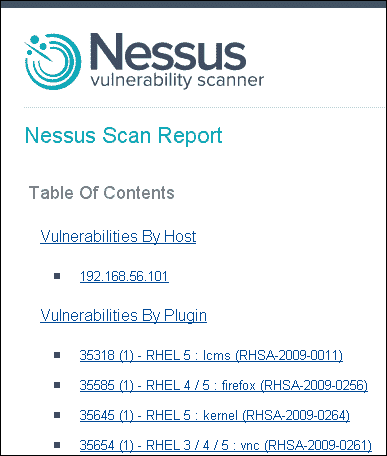
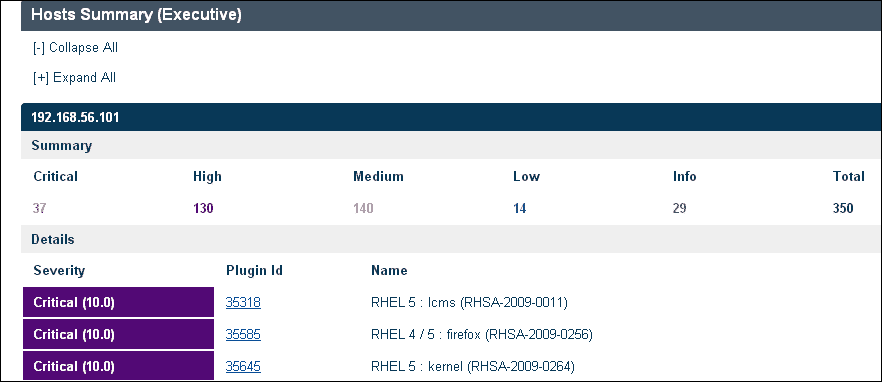
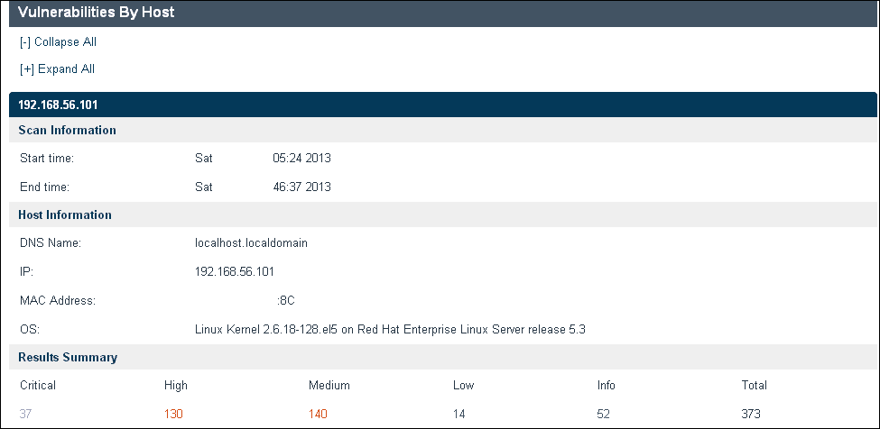
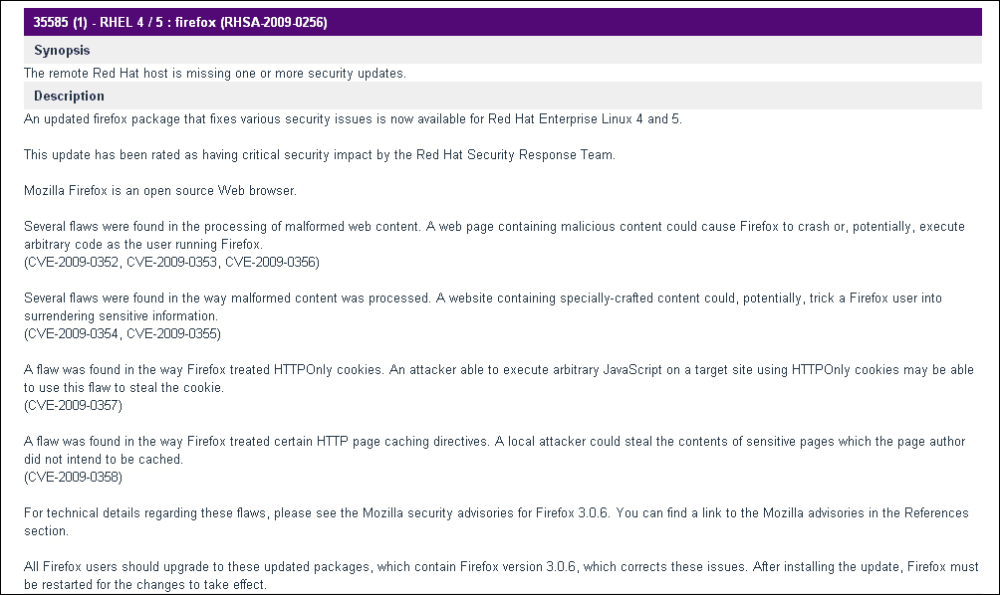
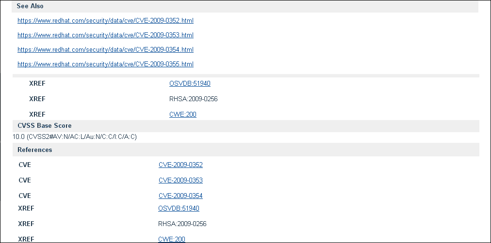

# 第三章。扫描分析

漏洞扫描分析是扫描的下一步。为了使漏洞扫描评估成功和有效，准确分析漏洞是绝对必要的。由于大多数扫描仪产生的扫描输出与其存储库中可用的漏洞插件一致，因此强烈建议进行人工分析，以避免误报和误报。一般来说，误报或误报代表漏洞在扫描输出中要么被错误报告，要么根本没有报告的情况。定义如下：

+   误报：更常见的是，这个术语意味着在系统中报告为活动的漏洞实际上并不存在；这意味着这可能是错误的漏洞报告的结果

+   误报：漏洞扫描中的输出基本上意味着实际基础设施中存在的漏洞在扫描输出中未报告

在本章中，我们将学习如何有效分析 Nessus 扫描结果的输出，内容涵盖以下主题：

+   结果分析

+   误报分析

+   漏洞分析

+   漏洞利用

# 结果分析

在本书的上一章中，我们学习了如何执行和保存扫描结果。本节介绍了如何阅读和解释 Nessus 扫描报告。为了举例说明，我们使用了一份 Linux 系统漏洞的样本报告。我们用于参考的报告以 HTML 格式保存，并包括了在保存报告时选择的“主机摘要”、“按主机分类的漏洞”和“按插件分类的漏洞”等详细信息。

## 报告解释

Nessus 提供不同的选项，如 HTML、PDF 和逗号分隔值（CSV）来保存报告。在保存报告时，为了获得漏洞或主机的摘要和详细信息，应选择这两个选项。

以下屏幕截图显示了 HTML 格式的典型 Nessus 扫描报告：



### 主机摘要（执行）

主机摘要（执行）部分将包括针对每个关键类别的漏洞的数量，以及每个漏洞的摘要详细信息；其中包括以下内容：

+   严重性（与 CVSS 分数一起的严重性评级）：这定义了观察到的漏洞有多严重

+   插件 ID：这是用于检查发现的漏洞的插件的唯一标识符

+   名称：显示漏洞的名称

以下屏幕截图显示了显示主机摘要的样本报告：



### 按主机分类的漏洞

报告的“按主机分类的漏洞”部分提供了每个主机漏洞发现的摘要。摘要提供了有关扫描运行时间、扫描主机的基本详细信息以及按关键级别分组的漏洞数量的详细信息。

以下屏幕截图是显示主机摘要的样本报告：



前面的屏幕截图显示了“按主机分类的漏洞”选项，包括以下部分：

+   扫描信息：此部分以日期/时间/年份格式显示了扫描的开始时间和结束时间。

+   主机信息：此部分显示 DNS 名称、IP、MAC 地址和操作系统。

+   结果摘要：此部分按 Nessus 分配的关键性评级对漏洞进行了分组，给出了漏洞的数量。这些类别包括关键、高、中、低和信息。它还显示了 Nessus 报告的漏洞总数。

### 提示

通用漏洞评分系统（CVSS）

根据评分系统，Nessus 使用**通用漏洞评分系统**（**CVSS**）对漏洞进行评分。这是一个基于漏洞特征和影响的开放源漏洞评级系统。它包括漏洞的固有特征、随时间变化的漏洞特征以及特定于环境的漏洞特征等参数。有关详细信息，请访问[`www.first.org/cvss/cvss-guide`](http://www.first.org/cvss/cvss-guide)。

以下表格列出了 Nessus 使用的基于漏洞评级的 CVSS 分数。如本章前面所述，Nessus 报告的评级可以进一步分析如下：

| CVSS 分数 | 严重性 |
| --- | --- |
| 0 | 信息 |
| <4 | 低 |
| <7 | 中 |
| <10 | 高 |
| 10 | 严重 |

### 注意

CVSS 分数是从互联网上的不同内容引用的，包括 Nessus 用户指南，可在[`www.tenable.com`](http://www.tenable.com)找到。

### 插件漏洞

**插件漏洞**部分包含有关漏洞的所有相关详细信息。以下部分显示了一张截图，其中包含了描述漏洞的详细信息以及对每个字段的简要解释。

以下截图仅用于说明目的；其他参考链接和**通用漏洞和暴露**（**CVE**）已被删除：



以下截图显示了报告中的**参考**和**CVSS 基础分数**：



以下截图显示了**插件信息**部分：


在前面的截图中捕获的漏洞详细信息如下：

| 漏洞参数 | 详细信息 |
| --- | --- |
| 概要 | 本部分显示了漏洞的关键特征。例如，在这里，概要部分描述了缺失的安全补丁。 |
| 描述 | 本部分提供了有关漏洞的详细信息，并包括由于已识别漏洞而存在的关键安全问题。例如，在截图中提到了由于缺失补丁而存在的关键安全问题以及 CVE 编号。此部分还涵盖了高级别的建议。 |
| 另请参阅 | 本部分包含供更好理解组件/基础设施供应商发布的问题的参考链接（如果有）。 |
| 解决方案 | 本部分提供了漏洞缓解的建议。 |
| 风险因素 | 本部分显示了已识别漏洞的风险评级。例如，**严重**，**高**和**中**。 |
| CVSS 基础分数 | 本部分显示了基于该分数计算风险评级的 CVSS 分数。 |
| 参考 | 本部分显示了观察到的问题的 CVE 和 CWE 信息。XREF 是与漏洞相关的其他信息源的交叉引用。 |
| 插件信息 | 本部分显示了使找到此漏洞的插件的详细信息。 |
| 主机 | 本部分显示了观察到此漏洞的主机的 IP 地址，以及有关观察到漏洞的基础设施的当前和建议详细信息。 |

### 提示

**通用漏洞和** **暴露**（**CVE**）是公开已知的安全漏洞和暴露的数据库。每个漏洞都被分配一个唯一的 CVE 编号，该编号在 Nessus 报告中进行交叉引用，以提供有关漏洞的进一步详细信息。有关更多信息，请参阅[`cve.mitre.org`](http://cve.mitre.org)。

**通用弱点枚举**（**CWE**）是一本常见弱点类型的词典，提供了各种常见漏洞的详细信息。Nessus 也参考了这一点，以更好地理解漏洞。有关更多信息，请参阅[`cwe.mite.org`](http://cwe.mite.org)。

## 错误阳性分析

错误阳性是指任何扫描工具突出显示的问题或漏洞，但实际上并不存在于目标系统中。错误阳性率因工具而异；以下是可以考虑进行错误阳性分析的一些常见指针。

### 了解组织的环境

以下是组织的基本理解，将有助于错误阳性分析：

+   基本的组织基础设施细节，如网络布局、基础设施、操作系统、应用程序和使用的技术，将有助于根据实际实施的技术和版本交叉检查漏洞评估（VA）结果，以消除错误阳性

+   在 VA 扫描周期中使用内部基础设施的情况下，这在这些细节是 readily available 时将更有益

+   在作为外部顾问进行限时扫描的情况下，很难获得所有这些细节。在这种情况下，作为预先参与的先决条件的一部分，可以寻求访问相关基础设施利益相关者，以了解技术细节

### 目标关键漏洞

在存在大量漏洞的情况下，至少应该交叉验证最关键的漏洞，以避免误报。

### 概念验证

如果可以访问进行 VA 扫描的服务器/设备，可以通过登录服务器或尝试针对漏洞提供概念验证来交叉检查漏洞。例如，如果漏洞说明服务器上正在运行明文**文件传输协议**（**FTP**）或 Telnet 服务，我们可以登录服务器以交叉检查这些服务是否实际在运行，或者尝试从测试机器连接 FTP 或 Telnet 协议来提供概念验证。

### 端口扫描工具

诸如**Nmap**之类的开源扫描工具也可以用于再次枚举基础设施，以交叉检查 VA 报告的发现的开放漏洞。

### 工作量估计

由于工作量估计是一项耗时的活动，应考虑额外的工作量和资源，以包括去除错误阳性。此外，基于参与规模和性质，应该做出实际的决定，定义将进行此活动的程度。

## 漏洞分析

在一般术语中，漏洞分析被认为与漏洞评估类似。然而，我觉得这两者之间有一点小小的区别。漏洞分析是漏洞评估周期的一部分，您在其中识别漏洞，量化风险，并确定风险的优先级。漏洞分析调查了漏洞评估工具检测到的漏洞。

应该注意，漏洞分析是一个可选步骤，取决于漏洞评估工具的能力、扫描环境、深入分析等。应考虑所有这些因素进行漏洞调查。如今，大多数漏洞评估工具提供无或最小的错误阳性的自动报告。Nessus 就是其中之一。

当由**安全运营中心**（**SOC**）或内部安全部门进行漏洞评估时，你可能不想花太多精力进行手动分析，而更倾向于将所有扫描结果交给不同的团队进行漏洞关闭。在这种情况下，你可能不太关心漏洞的严重性等。如果我们谈论另一种情况，你作为第三方审计师与一家公司合作，并进行漏洞评估，那么在这种情况下，你向公司报告的每个漏洞都将被严肃对待，并且必须对漏洞的存在、严重性、适用性等有适当的理由。

在这一部分，我们将探讨之前提到的第二个场景，即第三方顾问为客户进行审计或技术漏洞评估的情况，其中漏洞报告需要在适用性、风险严重性、环境依赖性和没有误报方面都是完美的。

一旦你从 Nessus 等漏洞扫描器获得扫描结果报告，你可以对每个漏洞进行详细审查，至少检查以下几个方面：

+   误报

+   风险严重性

+   适用性分析

+   修复建议

### 误报

本章的第二部分详细介绍了误报分析。

### 风险严重性

风险严重性是与每个漏洞相关的风险严重性，取决于环境和业务性质。风险严重性可以是定量的或定性的。一般来说，最好并且在行业上被认可的是使用定性的风险严重性。风险可以被分类为**关键**、**高**、**中**、**低**和**信息**。一些组织只将它们分类为**高**、**中等**和**低**。

大多数通过不同的安全认证（如 ISO 27001）的大型企业都有定义好的风险管理流程。这些风险管理流程定义了他们的风险严重性以及其定义、风险矩阵、风险接受标准等。在进行漏洞评估时，如果你遵循风险矩阵，可能需要重新分类风险严重性评级。

例如，一个组织的公共网站上运行没有 SSL 的漏洞。这个漏洞可能被漏洞扫描器宣布为**高**风险评级，然而，如果进行漏洞分析，可能会宣布不同的风险级别。

让我们来看一个场景，你正在为一个小型非政府组织进行漏洞评估；他们的网站上没有敏感信息，但发现了 SSL 的漏洞。网站上的所有信息都是公开的。在这种情况下，你可能会说漏洞风险评级为**低**或**信息**，而扫描工具可能会报告为**高**。

在另一个场景中，你正在为一家中型公司进行漏洞评估，他们在网站上进行调查和公开报告，发现了相同的 SSL 漏洞。这里记录的大部分信息都是机密的，不应该被泄露。在这种情况下，你可以说漏洞风险评级为**中**或**高**，并且将被扫描工具评为**高**。

另一个场景是，你正在为一家大型银行进行漏洞评估，他们的网站上有网银登录。银行客户登录使用网银服务进行财务交易；同样，发现了相同的 SSL 漏洞。在这种情况下，如果 SSL 没有被实施，这是一个关键的风险评级漏洞，工具将报告为**高**。

如果我们想根据风险评级来处理风险，那么重新审视漏洞扫描工具给出的风险评级就非常重要。

### 适用性分析

漏洞评估工具发现的每个漏洞可能并不适用于组织。漏洞适用性用于检查自动漏洞评估工具报告的漏洞是否适用于组织。

例如，一个应用程序中存在的弱密码漏洞。这个漏洞可能被漏洞扫描器评定为**高**风险等级，然而，如果进行漏洞适用性分析，可能会被判定为不适用。

让我们举个例子，假设你正在对一个小型组织进行漏洞评估。漏洞扫描器报告了一个应用程序的弱密码漏洞。工具发现该应用程序的一些密码只有七个字符长，这被报告为**高**风险严重漏洞。在进行适用性分析时，我们发现组织已经批准了一个安全密码策略，即使密码只有七个字符长也被认为是强密码；因此，这个漏洞对组织不适用。

重新审视风险，看看它们是否真的适用于组织或者不适用。

### 修复建议

Nessus 在工具生成的报告中为每个漏洞提供了修复建议。其中一些可以通过多种方式修复，例如使用补偿控制。漏洞可以通过多种方式进行修补或修复。

让我们通过一个样本漏洞来说明这一点。例如，在一个服务器上发现了明文协议 FTP 开放。通常推荐的修复方法是使用安全文件传输协议**SFTP**。另一个解决方案可能是分析是否需要开放 FTP。可能存在这样一种情况，即在测试期间 FTP 被保持开放；现在即使在生产环境中，FTP 也是开放的并且不再使用。在这种情况下，应该关闭该服务器上的 FTP 端口。在这种情况下，我们看到对于同一个漏洞有两种修复方法：一种是使用 SFTP 代替 FTP，另一种是关闭 FTP 端口。同样，建议明智地应用这些修复方法。

## 漏洞利用

在第一章*基础知识*中，我们介绍了漏洞评估和渗透测试练习之间的区别。基本上，这两者之间的区别与利用漏洞有关。在漏洞评估中，你只需要发现漏洞；但在渗透测试中，你还需要利用漏洞。

渗透测试不一定是侵入性的；它也可以局限于概念的证明。如今，大多数组织希望他们的渗透测试范围仅限于产生概念的证明，因为如果你进行侵入性测试，你的系统/服务可能会崩溃。

市场上有多种渗透测试工具，配备了脚本、程序、有效载荷和注入，用于进行渗透测试。

以下是一些示例，展示了漏洞如何被利用。以下漏洞是由 Nessus 扫描器在一个样本机器上报告的。

### 漏洞利用示例 1

第一个示例的漏洞标题是一个应用程序主页上发现的**跨站脚本**（**XSS**）。

假设漏洞扫描结果显示在目标主机上运行的一个应用程序中存在 XSS 漏洞。XSS 的详细信息在以下 Nessus 报告中给出，反映了页面漏洞存在的应用程序：

| Nessus 报告头 | Nessus 报告示例文本 |
| --- | --- |
| 摘要 | 远程网络服务器托管了一个易受跨站脚本攻击的 PHP 脚本。 |
| 描述 | phpMyAdmin 的版本未能验证`error.php`脚本的`error`参数中用户输入的 BBcode 标记，然后使用它生成动态 HTML。攻击者可能能够利用这个问题，通过向用户的浏览器注入任意 HTML 或脚本代码，以在受影响站点的安全上下文中执行。例如，这可以用于显示一个带有任意文本和指向外部站点的链接的页面。 |
| 解决方案 | 升级到 phpMyAdmin 3.4.0-beta1 或更高版本。 |
| 另请参阅 | [`www.phpmyadmin.net/home_page/security/PMASA-2010-9.php`](http://www.phpmyadmin.net/home_page/security/PMASA-2010-9.php) |
| 插件信息 | 发布日期：2011 年 1 月 6 日，修改日期：2011 年 10 月 24 日 |
| 风险信息 | 中等 4.3（CVSS2#AV:N/AC:M/Au:N/C:N/I:P/A:N）3.6（CVSS2#AV:N/AC:M/Au:N/C:N/I:P/A:N） |
| 漏洞信息 | 跨站脚本允许攻击者运行脚本，可能导致窃取 Web 浏览器会话信息或创建指向破坏 Web 应用程序的 Web 链接。 |
| 参考信息 | BID 45633CVE CVE-2010-4480XREF OSVDB:69684XREF EDB-ID:15699 |
| 插件输出 | Nessus 能够使用以下 URL 利用该问题：`http://192.168.56.3/phpMyAdmin/error.php?type=phpmyadmin_pmasa_2010_9.nasl&error=%5ba%40http%3a%2f%2fwww.phpmyadmin.net%2fhome_page%2fsecurity%2fPMASA-2010-9.php%40_self]Click%20here%5b%2fa]` |

一旦漏洞扫描器报告了跨站脚本，如果您被要求对该机器进行渗透测试，您需要进一步渗透该漏洞。这可以通过运行恶意脚本来完成概念验证和利用。

跨站脚本（也称为 XSS）可以存在于接受 URL 中的某些输入的输入参数中，也可以存在于 Web 应用程序的一个输入框中。要利用它，您需要篡改进入参数的最终用户输入，进一步显示相同的输入。您可能需要使用诸如 Burp Suits、Bayden Tamper IE 或任何其他 HTTP 流量拦截器的工具。通过使用拦截器，您可以操纵从客户机到服务器的 HTTP 请求。

测试 XSS 是否存在，可以使用以下示例有效负载作为输入到最终用户的输入参数：

```
<script>alert("XSS Exist")</Script>
"><script>alert("XSS Exist")</Script>
```

根据您正在利用的代码，需要调整前面的有效负载。

要进一步渗透，可以使用以下示例有效负载：

```
<script>alert(document.cookie)</script>
onmouseenter="alert(document.cookie);
onreadystatechange="alert(document.cookie);
```

这将在屏幕上弹出实时 cookie 详细信息，如下图所示：


在持久性 XSS 的情况下，最终用户输入存储在数据库中，并在浏览应用程序页面时再次显示给所有用户。您应该尝试以下有效负载，它在 Web 页面上创建一个超链接，将用户重定向到攻击者的网站：

```
http://TargetIP:8080/ShowingImage.asp?id=
<a href = "http://www.attackerURL.com">click</a>
```


XSS 可以通过对脚本和编码有深入的理解来进一步利用。

### 漏洞示例 2

第二个示例的漏洞标题是利用在路由器上发现的弱密码或易于猜测的密码。

Nessus 具有审查思科设备配置是否符合行业最佳实践的能力。当管理员没有仔细配置思科设备时，可以观察到一种常见的漏洞，即使用默认或弱密码。

**思科互联网操作系统**（**Cisco IOS**）是思科网络设备（如路由器和交换机）的操作系统。我们将以路由器为例进行说明。思科路由器配置文件包含路由器执行网络中路由功能所需的所有相关配置。

Cisco IOS 提供了设置不同类型密码的选项：类型 0 通常表示没有加密的密码，类型 7 表示使用 service password encryption 命令加密的密码，该命令使用专有算法，类型 5 表示密码受到 enabled-secret 命令的保护，该命令在配置中使用 MD5 哈希。当我们在 Cisco 路由器配置中看到类型 5 或类型 7 密码时，它们将显示为加密的。


Cisco 类型 7 密码不被认为是安全的，因为它使用弱算法加密，并且可以被破解。

通过提供适当权限的凭据扫描 Cisco 路由器配置时，Nessus 将突出显示使用弱密码。

一旦 Nessus 报告突出显示使用了弱类型 7 密码，并且可以进一步使用互联网上提供的许多免费工具之一来破解。为了演示目的，使用以下 URL：

[`www.ibeast.com/content/tools/CiscoPassword/index.asp`](http://www.ibeast.com/content/tools/CiscoPassword/index.asp)

如果 Nessus 突出显示在扫描 Cisco 路由器后使用了弱或类型 7 密码；我们在我们的示例中使用了一个类型 7 密码 **(** `0822455D0A16` **)**。

如果我们拿这个密码并使用前面的链接来破解它，几秒钟内我们就会知道默认密码，也就是 **cisco**，已经被使用。

在下面的截图中，我们在一个常见的密码破解工具中输入了一个类型 7 密码：


以下截图显示了工具给出的输出（破解密码）：


### 利用示例 3

第三个示例的漏洞标题是可能的 SQL 注入。

SQL 注入是一种应用程序漏洞，可以通过 Nessus 发现。 SQL 注入允许攻击者通过直接与应用程序后面运行的数据库通信并执行 SQL 查询来注入或运行恶意 SQL 命令。这可能与在数据库服务器上运行`fdisk`命令完全格式化服务器并在服务器上创建本地管理员一样具有破坏性。这还允许攻击者运行扩展存储过程，这些是非常强大的命令。通过运行恶意 SQL 查询，攻击者可以修改形成 SQL 查询的输入字符串，以便输出将从数据库中显示所需的模式和数据。

当漏洞扫描器报告 SQL 注入漏洞并且您正在进行渗透测试时，您需要进一步利用它。

利用的过程如下：

在应用程序登录页面上，需要输入用户名和密码时，使用以下表中提到的输入注入来检查该特定页面是否真的存在 SQL 注入：

| 序列号 | 注入字符串 |
| --- | --- |
| 1 | 用户名：`admin`（任何用户名）密码：`' OR 1=1--` |
| 2 | 用户名：`admin'; --`密码：`' OR 1=1--` |
| 3 | 用户名：`administrator'; --`密码：`' OR 1=1--` |

所有利用都是独特的，因此，我建议根据目标机器构建您的注入、脚本和有效载荷。

# 总结

扫描分析包括对扫描输出的分析，以确保漏洞的验证和准确报告。这包括删除虚假阳性和虚假阴性。

虚假阳性更常见；这个术语意味着系统中报告为活动的漏洞实际上并不存在，这意味着可能是错误的漏洞报告的结果。

通过了解组织的环境，概念验证和使用端口扫描工具进行验证，可以消除误报。由于这是一项耗时的活动，可以使用目标关键的漏洞来进行大范围的参与。对于这项活动的工作量估计也应提前考虑。

结果分析包括查看 Nessus 扫描输出，涵盖所有必要的细节，如概要，描述，风险因素，包括 CVE 分数，这是一个公开已知的安全漏洞和风险的数据库。每个漏洞都被分配一个唯一的 CVE 编号，该编号在 Nessus 报告中进行交叉引用，以提供有关漏洞的进一步详细信息。

除了消除误报外，分析还将根据系统的关键性进行严重性分析，以满足组织的业务需求，对于高度关键的服务器上的低或中等漏洞，需要相应地进行优先处理。还应交叉检查特定报告的漏洞是否适用于组织。

根据报告中给出的建议，并考虑其他可用的替代控制措施来减轻漏洞，应该着手关闭漏洞。

在识别漏洞后，漏洞利用（或渗透测试）是下一步。Nessus 提供了一个选项，可以检查已识别漏洞的利用是否在利用框架（如 Metasploit 或 Canvas）中可用。这还涉及进一步学习和研究，以选择适当的有效载荷，例如跨站脚本和 SQL 注入等少数漏洞的情况。
