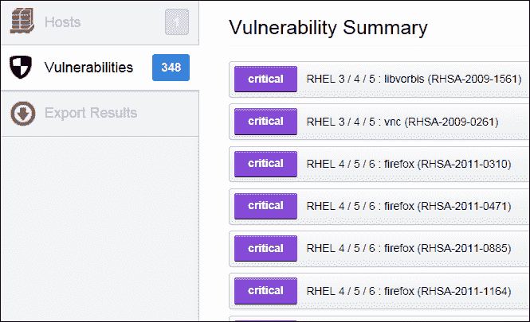
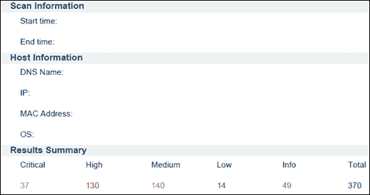
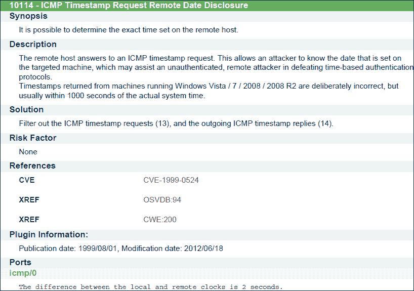

# 第四章。报告选项

易于理解和令人印象深刻的报告是成功的漏洞评估的关键。在撰写漏洞评估报告之前，了解目标受众非常重要。大多数情况下，漏洞评估报告将由不同的团队和不同水平的受众阅读。其中一些人可能对技术术语非常了解，而另一些人可能对技术一无所知；因此，报告中应包含适当的材料，以满足技术和非技术受众的需求。生成全面的漏洞评估报告对于让他人了解文本中发现的漏洞非常重要，以便目标读者能够轻松理解。

本章将向您展示如何编写成功的漏洞报告。本章将涵盖的关键领域如下：

+   报告生成

+   报告定制

+   报告自动化

# 漏洞评估报告

漏洞评估或渗透测试报告中包含和不包含什么一直是讨论的话题。重要的是要理解，没有一个好的报告，漏洞评估是无法达到其目标的。

撰写报告时应考虑受众。在大型企业中，漏洞评估报告通常分发给不同团队，这些团队对报告的理解程度不同。

管理专业人士对每个漏洞的详细信息不感兴趣。他们更愿意看到一份评估摘要，其中包括已识别漏洞的数量的快速截图，按其严重性分类；这可以更好地以图形方式呈现，并附有关键/高/中/低严重漏洞的部分文本。另一方面，技术人员希望看到有关漏洞报告的更多技术细节和逐步过程，以便在渗透测试报告中能够重现漏洞。技术人员还希望收到有关如何修复漏洞的建议。

Nessus 生成了一份成功扫描的报告，其中包含每个漏洞的详细信息。根据受众的不同，报告可以进行定制。如果您经常进行扫描并希望每次以相同格式生成报告，则建议选择并应用适当的过滤器来决定报告内容。安全顾问可能不希望这样做，因为他们会从不同的客户那里得到不同的报告要求。

## Nessus 报告生成

Nessus 为所有已完成的扫描生成报告，可以将其导出到本地系统，并且还允许您从以前的扫描中生成报告。在 Nessus 中有多种格式的报告可供选择。

完成扫描后，Nessus 会存储扫描结果。如下截图所示，Nessus 将扫描结果存储在**结果**标签页下：

双击扫描结果将显示该特定扫描结果的详细视图。此视图有三个不同的标签页：**主机**，**漏洞**和**导出结果**。在**主机**标签页下，可以看到主机摘要。这包括漏洞的严重程度（关键、高、中、低和信息性）计数。

以下截图显示了一个主机已经被扫描，其中有三十七个关键漏洞，一百三十个高危漏洞，一百四十个中危漏洞，零个低危漏洞和四十九个信息性漏洞：

下一个选项是**漏洞**选项卡；这显示了每个漏洞的风险严重性的漏洞摘要。双击任何漏洞将带您进入该漏洞的详细视图，其中详细说明了简介、描述、解决方案、漏洞网页链接、插件信息、风险信息、漏洞信息、参考信息、插件输出等。详细视图中还提供了风险严重性修改选项。以下截图显示了漏洞摘要视图：

最后一个选项是**导出结果**；这提供了以不同格式导出 Nessus 扫描结果报告的选项，例如 HTML、PDF 和 CSV。您还可以从以下选项中选择要包含在报告中的内容：

+   **主机摘要（高管）**：此选项将导出显示发现的漏洞的高级摘要的报告

+   **按主机分类的漏洞**：此选项将导出按主机显示漏洞的报告

+   **合规性检查（高管）**：此选项将导出与所选合规性检查相关的高管摘要报告

+   **按插件分类的漏洞**：此选项将导出按插件显示漏洞的报告

+   **合规性检查**：此选项将导出与所选合规性检查相关的详细报告

前述选项如下截图所示：

可以根据需要选择一个或多个选项。

Nessus 提供了一个选项，在导出报告之前删除或清除漏洞，这样如果您知道该漏洞对您不适用，可以从 Nessus 漏洞列表中删除或清除它。

### 报告过滤选项

在**结果**页面的顶部，有一个过滤选项。此选项允许您根据从下拉菜单中选择的少数可用标准来过滤 Nessus 报告。您可以一次添加多个过滤器。

例如，您可以通过选择过滤器下拉菜单中的选项添加多个过滤器，以获取具有高风险因素的漏洞报告，可以在 MetaSploit 中利用 Exploit Available 并且易于利用的漏洞。

以下截图显示了如何添加过滤器：

可以使用**添加过滤器**和**清除过滤器**按钮添加和删除过滤器。Nessus 还提供了**匹配**选项，包括**任意**和**全部**条件。**任意**条件表示是否满足任何一个指定的过滤器选项。**全部**条件表示应满足所有设置的过滤条件。

Nessus 报告工具中的其他选项用于比较两次扫描的结果和审计跟踪。Nessus 还允许您从不同的机器上传扫描结果，使用这些结果可以根据您的需要生成报告。

## Nessus 报告内容

Nessus 报告包含了关于扫描和漏洞的大量细节。关于扫描的信息以扫描的 IP 列表、扫描的开始时间和结束时间、DNS 名称、MAC 地址、操作系统以及结果摘要的形式呈现，结果摘要包括了整体漏洞数量以及按严重程度分类的漏洞数量。

Nessus 报告中包含了以下扫描信息：

+   目标 IP 地址

+   目标主机名称

+   目标 MAC 地址

+   DNS 名称

+   扫描开始时间

+   扫描结束时间

+   目标操作系统

以下截图显示了一些字段：

Nessus 报告详细说明了在扫描主机的 Nessus 扫描中发现的漏洞。这包括了每个漏洞的以下信息：

+   针对插件编号的漏洞

+   简介

+   描述

+   关于该漏洞的**另请参阅**链接

+   解决方案

+   风险因素

+   CVSS 基础分数

+   参考资料

+   插件信息

+   利用方式

+   端口

以下屏幕截图显示了一个漏洞样本，其中显示了 Nessus 生成的报告中漏洞的详细信息：

# 报告定制

在前一节中，我们了解到 Nessus 报告捕获了关于每个漏洞报告的许多细节。有时，当您作为漏洞评估报告的顾问时，您可能不希望使用 Nessus 生成的报告与客户分享，因为它包含了关于每个漏洞的许多细节；这对于安全顾问来说可以理解并且有用，但对于只需要了解漏洞是什么以及需要做什么来修复它的最终客户来说则不是。另一种情况可能是您希望以客户提供的不同格式展示报告；为此，您需要相应地定制报告。

您可以自行决定要包括在漏洞评估报告中的参数。Nessus 生成的默认报告非常好且全面。可能会发生您还需要在报告中看到易于利用性或者修复漏洞所需的工作量。漏洞报告中包含什么和不包含什么完全取决于创建报告的人和组织的要求。您需要相应地定制报告。

可以通过从默认 Nessus 报告中删除特定字段并添加额外字段来进行定制，这些额外字段是您需要的，除了默认字段。如果需要以 Microsoft Word 格式创建报告，可以从 Nessus 生成的默认报告中复制粘贴。

我建议采用以下格式生成令人印象深刻的报告：

+   报告首页：

+   客户名称

+   分配或项目名称

+   报告提交者

+   文档信息页面：

+   文档标题

+   版本

+   作者姓名

+   审阅者姓名

+   批准者姓名

+   带日期的文档更改历史

+   文档分发列表

+   文档数据分类

+   每页页眉和页脚包括数据分类、页码、文档名称、组织标志等

+   执行摘要：

+   关于漏洞评估项目及其范围的简要介绍

+   漏洞计数及其严重性分类

+   关键、高、中、低和信息性漏洞的图形表示及其计数

+   IP/漏洞计数图

+   漏洞名称、风险评级、业务影响和同一报告中详细信息的链接的表格

+   详细部分：

+   关键风险漏洞

+   漏洞名称

+   漏洞描述

+   业务影响

+   受影响的 IP 或应用程序名称

+   利用的工具（可选）

+   缓解/建议

+   缓解先决条件

+   如果适用，用于缓解的补丁名称

+   漏洞参考链接

+   CVE 参考

+   Nessus 插件信息

+   可利用的（Metasploit、core impact、CANVAS 等）

+   实施步骤

+   实施成本

+   实施复杂性

+   如果缓解不成功，则回滚步骤

+   高风险漏洞

+   与关键风险漏洞下提到的字段相同

+   中等风险漏洞

+   与关键风险漏洞下提到的字段相同

+   低风险漏洞

+   与关键风险漏洞下提到的字段相同

+   信息性漏洞

+   与关键风险漏洞下提到的字段相同

渗透测试报告与漏洞评估报告有些不同。渗透测试报告还应包括一个关于如何利用漏洞以及显示如何利用漏洞的证据的部分。

# 报告自动化

报告自动化部分不仅适用于 Nessus；一般来说，市场上提供的多个漏洞评估工具及其旧版本不支持生成 Microsoft Excel 或 PDF 格式的报告。为了充分利用这些自动生成的报告，并使其符合组织的首选报告格式，大多数是 Excel 或 Word，可以编写脚本将这些默认报告转换为我们自己需求的报告。

Nessus 报告自动化的另一个需求是，在集成 Nessus 报告时使用不同的工具，如 Archer 和 Agiliance，这些是治理风险和合规性工具；安全信息和事件管理工具；或者您组织中可用的任何其他工具，您希望 Nessus 生成漏洞评估结果。在这些情况下，为了集成，每个工具对报告都有特定的先决条件格式。大多数工具接受 CSV 格式。为了将报告转换为所需的格式，我建议编写脚本。

# 总结

本章涵盖了 Nessus 中的报告选项。漏洞评估报告的内容应根据报告的受众进行定制，从高级管理层到致力于漏洞关闭的技术团队。完成扫描后，输出可以在 Nessus 的**结果**选项卡下找到。在此选项卡下，我们有主机摘要、发现的漏洞以及导出结果的选项。

结果可以以不同的格式导出，如 PDF、CSV 和 HTML，Nessus 提供了五个选项来决定要包括的内容，即**主机摘要（执行）**、**按主机的漏洞**、**合规性检查**、**按插件的漏洞**和**合规性检查（执行）**。**结果**选项卡还有一个过滤选项，其中下拉菜单可以过滤所需的类别和类型的漏洞，并可以从整体输出中进行过滤。

报告捕获了扫描信息以及漏洞详细信息，包括概要、描述、解决方案、风险、插件、CVSS 评分和其他重要细节。

本章还涵盖了外部顾问视角的报告定制以及报告中应该捕获的详细信息类型。最后，介绍了报告自动化的概念；这可以通过脚本完成，也可以通过与 GRC 合规工具或 SIEM 解决方案的集成完成。
