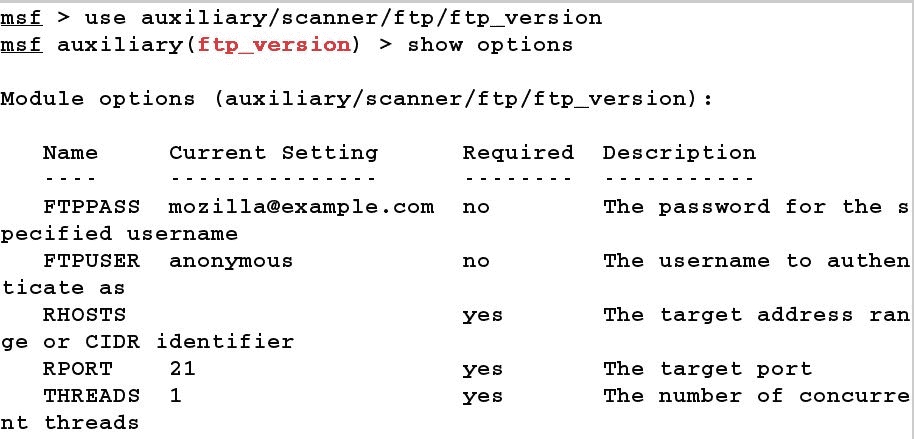
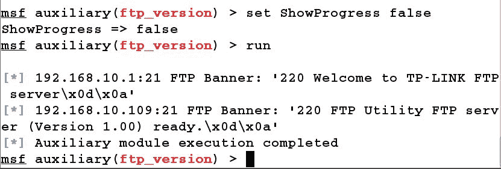
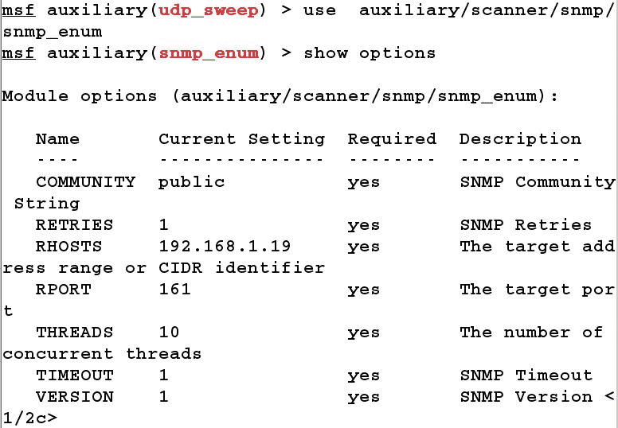
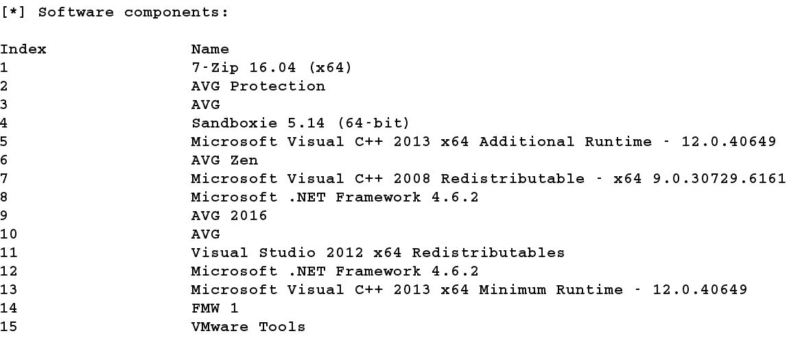
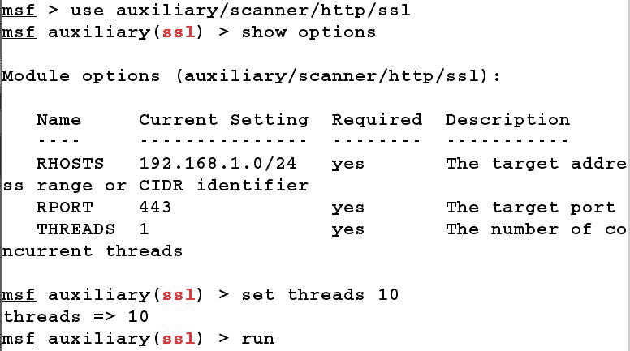
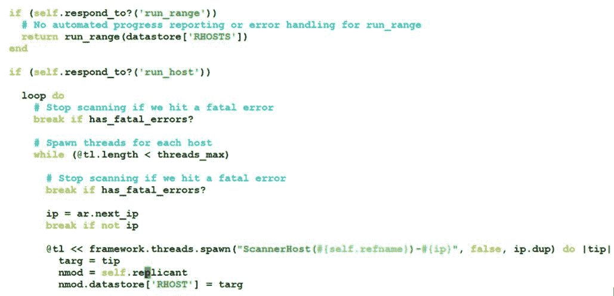
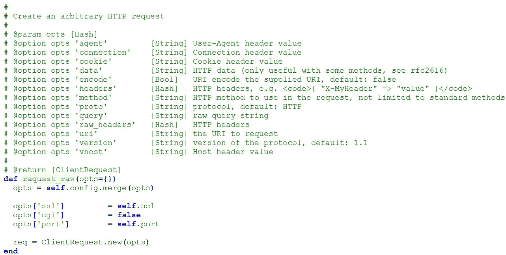

# 识别和扫描目标

我们在第一章中学习了 Metasploit 的基础知识，*开始使用 Metasploit*。现在让我们把焦点转移到每次渗透测试的一个重要方面，即扫描阶段。扫描阶段是渗透测试中最关键的部分之一，涉及识别目标上运行的各种软件和服务，因此，它是专业渗透测试中最耗时和最关键的部分。他们说，我引用一句话，"*知己知彼，百战不殆*”。如果你想通过利用易受攻击的软件来访问目标，你需要首先确定目标上是否运行了特定版本的软件。扫描和识别应该进行彻底，这样你就不会在错误的软件版本上执行 DOS 攻击。

在本章中，我们将尝试揭示 Metasploit 的扫描方面，并尝试获得各种扫描模块的实际知识。我们将涵盖以下扫描的关键方面：

+   使用针对 FTP、MSSQL 等服务的扫描模块

+   扫描 SNMP 服务并利用它们

+   使用 Metasploit 辅助工具查找 SSL 和 HTTP 信息

+   开发自定义扫描模块所需的基本要素

+   利用现有模块创建自定义扫描仪

让我们针对目标网络运行一个基本的 FTP 扫描模块，并详细分析其功能。

# 使用 Metasploit 处理 FTP 服务器

我们将在辅助部分的扫描仪中使用`ftp_version.rb`模块进行演示。

# 扫描 FTP 服务

让我们使用`use`命令选择模块，并检查模块需要哪些不同选项才能工作：


我们可以看到我们有许多模块可以使用。但是，现在让我们使用`ftp_version`模块，如下面的截图所示：



为了扫描整个网络，让我们将`RHOSTS`设置为`192.168.10.0/24`（0-255），并增加线程数以加快操作：


让我们运行该模块并分析输出：


我们可以看到我们已经扫描了整个网络，并发现有两台主机运行 FTP 服务，分别是 TP-LINK FTP 服务器和 FTP Utility FTP 服务器。现在我们知道了目标上运行的服务，如果这些 FTP 服务的版本易受攻击，我们就可以很容易地找到匹配的漏洞利用。

我们还可以看到一些行显示了扫描的进度并生成了混乱的输出。我们可以通过将`ShowProgress`选项的值设置为 false 来关闭显示进度功能，如下面的截图所示：



显然，我们有一个更好的输出，如前面的截图所示。但是，等等！我们之前没有`ShowProgress`选项，对吧？那么它从哪里神奇地出现的呢？如果你能停下来自己尝试弄清楚，那就太好了。如果你知道我们有一个高级选项命令，可以通过在 Metasploit 中传递`show advanced`来调用，我们可以继续进行。

在渗透测试期间，可能需要详细了解测试的细节并获得详细的输出。Metasploit 确实提供了一个详细的功能，可以通过在 Metasploit 控制台中传递`set verbose true`来设置。详细的输出将生成类似于以下截图中的输出：


该模块现在正在打印诸如连接状态等详细信息。

# 修改扫描模块以获取乐趣和利润

在大型测试环境中，分析数百种不同服务并找到易受攻击的服务会有些困难。我会在自定义的扫描模块中保留易受攻击的服务列表，因此一旦遇到特定服务，如果匹配特定横幅，就会标记为易受攻击。识别易受攻击的服务是一个好的做法。例如，如果你有一个拥有 10000 个系统的庞大网络，运行默认的 Metasploit 模块并期望得到格式良好的输出会很困难。在这种情况下，我们可以相应地自定义模块并针对目标运行它。Metasploit 是一个非常好的工具，它提供了内联编辑。因此，您可以使用`edit`命令即时修改模块。但是，您必须选择要编辑的模块。我们可以在以下截图中看到，Metasploit 已经在 VI 编辑器中打开了`ftp_version`模块，并且模块的逻辑也显示出来：


代码非常简单。如果`banner`变量被设置，状态消息将以`rhost`、`rport`和`banner`本身的详细信息打印在屏幕上。假设我们想要向模块添加另一个功能，即检查横幅是否与常见易受攻击的 FTP 服务的特定横幅匹配，我们可以添加以下代码行：


在前面的模块中，我们所做的只是添加了另一个 if-else 块，它将横幅与正则表达式`/FTP\sUtility\sFTP\sserver/`进行匹配。如果横幅与正则表达式匹配，它将表示成功匹配易受攻击的服务，否则将打印出 Not Vulnerable。相当简单，是吧？

然而，在提交更改并编写模块之后，您需要使用`reload`命令重新加载模块。现在让我们运行模块并分析输出：


是的！我们成功了。由于 TP-LINK FTP 服务器的横幅不匹配我们的正则表达式，因此在控制台上打印出 Not Vulnerable，而其他服务的横幅与我们的正则表达式匹配，因此在控制台上打印出 Vulnerable 消息。

有关编辑和构建新模块的更多信息，请参阅《精通 Metasploit 第二版》的*第二章*。

# 使用 Metasploit 扫描 MSSQL 服务器

现在让我们进入专门用于测试 MSSQL 服务器的 Metasploit 特定模块，并看看我们可以通过使用它们获得什么样的信息。

# 使用 mssql_ping 模块

我们将使用的第一个辅助模块是`mssql_ping`。此模块将收集与 MSSQL 服务器相关的服务信息。

那么，让我们加载模块并按照以下步骤开始扫描过程：


我们可以清楚地看到`mssql_ping`生成了一个关于 MSSQL 服务的优秀输出。

# 暴力破解 MSSQL 密码

Metasploit 还提供了暴力破解模块。成功的暴力破解会利用低熵漏洞；如果在合理的时间内产生结果，就被视为有效发现。因此，在渗透测试的这个阶段，我们将涵盖暴力破解。Metasploit 有一个内置模块名为`mssql_login`，我们可以将其用作 MSSQL 服务器数据库用户名和密码的认证测试器。

让我们加载模块并分析结果：


我们运行这个模块时，它立即在第一步测试了默认凭据，即使用用户名 sa 和空密码，并发现登录成功。因此，我们可以得出结论，仍然在使用默认凭据。此外，如果 sa 账户没有立即找到，我们必须尝试测试更多的凭据。为了实现这一点，我们将使用包含用于暴力破解 DBMS 用户名和密码的字典的文件名来设置 USER_FILE 和 PASS_FILE 参数：


让我们设置所需的参数；这些是`USER_FILE`列表，`PASS_FILE`列表，以及`RHOSTS`，以成功运行此模块：


运行此模块针对目标数据库服务器，我们将得到类似以下的输出：


正如我们从上面的结果中可以看到的，我们有两个条目对应于用户在数据库中的成功登录。我们找到了一个默认用户 sa，密码为空，另一个用户 nipun，密码为 12345。

请参考[`github.com/danielmiessler/SecLists/tree/master/Passwords`](https://github.com/danielmiessler/SecLists/tree/master/Passwords)获取一些可以用于密码暴力破解的优秀字典。

有关测试数据库的更多信息，请参阅*Mastering Metasploit First/Second Edition*的*第五章*。

在进行暴力破解时，将`USER_AS_PASS`和`BLANK_PASSWORDS`选项设置为`true`是一个好主意，因为许多管理员会为各种安装保留默认凭据。

# 使用 Metasploit 扫描 SNMP 服务。

让我们对不同网络进行 TCP 端口扫描，如下图所示：


我们将使用在`auxiliary/scanner/portscan`下列出的 tcp 扫描模块，如上图所示。让我们运行该模块并分析结果如下：


我们可以看到我们只找到了两个看起来不那么吸引人的服务。让我们也对网络进行 UDP 扫描，看看是否能找到一些有趣的东西：


为了进行 UDP 扫描，我们将使用`auxiliary/scanner/discovery/udp_sweep`模块，如上图所示。接下来，我们只需要设置`RHOSTS`选项来提供网络范围。此外，您也可以增加线程数。让我们运行该模块并分析结果：


太棒了！我们可以看到 UDP 扫描模块生成了大量结果。此外，还在`192.168.1.19`上发现了一个**简单网络管理协议**（SNMP）服务。

SNMP 是一种常用的服务，提供网络管理和监控功能。SNMP 提供了轮询网络设备和监视主机上各种系统的利用率和错误等数据的能力。SNMP 还能够更改主机上的配置，允许远程管理网络设备。SNMP 是易受攻击的，因为它经常自动安装在许多网络设备上，读字符串为`public`，写字符串为`private`。这意味着系统可能被安装到网络上，而没有任何知道 SNMP 正在运行并使用这些默认密钥的知识。

此默认安装的 SNMP 为攻击者提供了在系统上执行侦察的手段，以及可以用来创建拒绝服务的利用。SNMP MIBs 提供诸如系统名称、位置、联系人，有时甚至电话号码等信息。让我们对目标进行 SNMP 扫描，并分析我们遇到的有趣信息：



我们将使用`auxiliary/scanner/snmp`中的`snmp_enum`来执行 SNMP 扫描。我们将`RHOSTS`的值设置为`192.168.1.19`，还可以提供线程数。让我们看看会弹出什么样的信息：


哇！我们可以看到我们有大量的系统信息，如主机 IP、主机名、联系人、正常运行时间、系统描述，甚至用户账户。找到的用户名在尝试暴力破解攻击时可能会很有用，就像我们在前面的部分中所做的那样。让我们看看我们还得到了什么：


我们还有监听端口（TCP 和 UDP）的列表，连接信息，网络服务列表，进程列表，甚至安装应用程序列表，如下图所示：



因此，SNMP 扫描为我们提供了大量有关目标系统的侦察功能，这可能有助于我们执行诸如社会工程和了解目标上可能运行的各种应用程序的攻击，以便我们可以准备要利用的服务列表并专注于特定服务。

有关 SNMP 扫描的更多信息，请访问[`www.offensive-security.com/metasploit-unleashed/snmp-scan/`](https://www.offensive-security.com/metasploit-unleashed/snmp-scan/)。

# 使用 Metasploit 扫描 NetBIOS 服务

Netbios 服务还提供有关目标的重要信息，并帮助我们揭示目标架构、操作系统版本和许多其他信息。要扫描 NetBIOS 服务的网络，我们可以使用`auxiliary/scanner/netbios`中的`nbname`模块，如下图所示：


我们像以前一样，通过提供 CIDR 标识符将`RHOSTS`设置为整个网络。让我们运行模块并分析结果如下：


我们可以看到在前面的屏幕截图中列出了几乎每个系统在网络上运行的 NetBIOS 服务。这些信息为我们提供了有关系统的操作系统类型、名称、域和相关 IP 地址的有用证据。

# 使用 Metasploit 扫描 HTTP 服务

Metasploit 允许我们对各种 HTTP 服务进行指纹识别。此外，Metasploit 包含大量针对不同类型的 Web 服务器的利用模块。因此，扫描 HTTP 服务不仅允许对 Web 服务器进行指纹识别，还可以建立 Metasploit 可以稍后攻击的 Web 服务器漏洞的基础。让我们使用`http_version`模块并针对网络运行它如下：


在设置所有必要的选项（如`RHOSTS`和`Threads`）之后，让我们执行模块如下：


Metasploit 的`http_version`模块已成功对网络中的各种 Web 服务器软件和应用程序进行了指纹识别。我们将在第三章中利用其中一些服务，*利用和获取访问权限*。我们看到了如何对 HTTP 服务进行指纹识别，所以让我们尝试看看我们是否可以扫描它的大哥，使用 Metasploit 扫描 HTTPS。

# 使用 Metasploit 扫描 HTTPS/SSL

Metasploit 包含 SSL 扫描模块，可以揭示与目标上的 SSL 服务相关的各种信息。让我们快速设置并运行模块如下：



如前面的屏幕截图所示，我们有来自`auxiliary/scanner/http`的 SSL 模块。现在我们可以设置`RHOSTS`，运行的线程数，如果不是`443`，还可以设置`RPORT`，然后执行模块如下：


通过分析前面的输出，我们可以看到我们在 IP 地址`192.168.1.8`上放置了一个自签名证书，以及其他详细信息，如 CA 授权、电子邮件地址等。这些信息对执法机构和欺诈调查案件至关重要。曾经有很多情况下，CA 意外地为 SSL 服务签署了恶意软件传播站点。

我们了解了各种 Metasploit 模块。现在让我们深入研究并看看模块是如何构建的。

# 模块构建基础

开始学习模块开发的最佳方法是深入研究现有的 Metasploit 模块，看看它们是如何工作的。让我们看看一些模块，找出当我们运行这些模块时会发生什么。

# Metasploit 模块的格式

Metasploit 模块的骨架相对简单。我们可以在以下代码中看到通用的头部部分：

```
require 'msf/core' 
class MetasploitModule < Msf::Auxiliary 
  def initialize(info = {}) 
    super(update_info(info, 
      'Name'           => 'Module name', 
      'Description'    => %q{ 
       Say something that the user might want to know. 
      }, 
      'Author'         => [ 'Name' ], 
      'License'        => MSF_LICENSE 
    )) 
  end 
def run 
    # Main function 
  end 
end 

```

模块通过包含必要的库和所需的关键字开始，前面的代码后面跟着`msf/core`库。因此，它包括来自`msf`目录的`core`库。

下一个重要的事情是定义类类型，而不是`MetasploitModule`，而是根据 Metasploit 的预期版本，是`Metasploit3`还是`Metasploit4`。在我们定义类类型的同一行中，我们需要设置我们要创建的模块的类型。我们可以看到，我们已经为相同的目的定义了`MSF::Auxiliary`。

在初始化方法中，即 Ruby 中的默认构造函数，我们定义了`Name`、`Description`、`Author`、`Licensing`、`CVE details`等；这个方法涵盖了特定模块的所有相关信息。名称包含了被定位的软件名称；`Description`包含了对漏洞解释的摘录，`Author`是开发模块的人的名字，`License`是前面代码示例中所述的`MSF_LICENSE`。`Auxiliary`模块的主要方法是`run`方法。因此，除非你有很多其他方法，否则所有操作都应该在这个方法上执行。然而，执行仍然将从`run`方法开始。

有关开发模块的更多信息，请参阅*《精通 Metasploit 第一/第二版》*的*第 2、3、4 章*。

有关模块结构的更多信息，请参阅[`www.offensive-security.com/metasploit-unleashed/skeleton-creation/`](https://www.offensive-security.com/metasploit-unleashed/skeleton-creation/)。

# 分解现有的 HTTP 服务器扫描器模块

让我们使用之前使用过的一个简单模块，即 HTTP 版本扫描器，并看看它是如何工作的。这个 Metasploit 模块的路径是`/modules/auxiliary/scanner/http/http_version.rb`。

让我们系统地检查这个模块：

```
# This file is part of the Metasploit Framework and may be subject to 
# redistribution and commercial restrictions. Please see the Metasploit 
# website for more information on licensing and terms of use. 
# http://metasploit.com/ 
require 'rex/proto/http' 
require 'msf/core' 
class Metasploit3 < Msf::Auxiliary 

```

让我们讨论这里的安排方式。以`#`符号开头的版权行是注释，它们包含在所有 Metasploit 模块中。所需的`'rex/proto/http'`语句要求解释器包含来自`rex`库的所有 HTTP 协议方法的路径。因此，来自`/lib/rex/proto/http`目录的所有文件的路径现在对模块可用，如下面的屏幕截图所示：


所有这些文件都包含各种 HTTP 方法，包括建立连接的功能，`GET`和`POST`请求，响应处理等。

在下一步中，需要使用`'msf/core'`语句来包含所有必要的`core`库的路径，如前所述。`Metasploit3`类语句定义了适用于 Metasploit 版本 3 及以上的给定代码。然而，`Msf::Auxiliary`将代码描述为辅助类型模块。现在让我们继续进行如下代码：

```
# Exploit mixins should be called first
include Msf::Exploit::Remote::HttpClient
include Msf::Auxiliary::WmapScanServer
# Scanner mixin should be near last
include Msf::Auxiliary::Scanner

```

前面的部分包括了所有包含在模块中使用的方法的必要库文件。让我们按照以下方式列出这些包含的库的路径：

| 包含语句 | 路径 | 用法 |
| --- | --- | --- |
| `Msf::Exploit::Remote::HttpClient` | `/lib/msf/core/exploit/http/client.rb` | 这个库文件将提供各种方法，比如连接到目标、发送请求、断开客户端等。 |
| `Msf::Auxiliary::WmapScanServer` | `/lib/msf/core/auxiliary/wmapmodule.rb` | 你可能会想，WMAP 是什么？WMAP 是 Metasploit 框架的基于 Web 应用程序的漏洞扫描器附加组件，它通过 Metasploit 帮助进行 Web 测试。 |
| `Msf::Auxiliary::Scanner` | `/lib/msf/core/auxiliary/scanner.rb` | 这个文件包含了基于扫描器的模块的各种功能。这个文件支持不同的方法，比如运行模块、初始化和扫描进度等。 |

需要注意的重要信息是，我们之所以可以包含这些库，是因为我们在前面的部分中定义了所需的`'msf/core'`语句。

让我们来看下一段代码：

```
def initialize 
  super( 
    'Name'        => 'HTTP Version Detection', 
    'Description' => 'Display version information about each system', 
    'Author'      => 'hdm', 
    'License'     => MSF_LICENSE 
  ) 

  register_wmap_options({ 
    'OrderID' => 0, 
    'Require' => {}, 
  }) 
end 

```

这个模块的这部分定义了初始化方法，该方法初始化了基本参数，如`Name`、`Author`、`Description`和`License`，并初始化了 WMAP 参数。现在让我们来看代码的最后一部分：

```
  def run_host(ip) 
    begin 
      connect 
      res = send_request_raw({'uri' => '/', 'method' => 'GET' }) 
      return if not res 
      fp = http_fingerprint(:response => res) 
      print_status("#{ip}:#{rport} #{fp}") if fp 
      rescue ::Timeout::Error, ::Errno::EPIPE 
    end 
  end 
end 

```

前面的函数是扫描器的核心。

# 库和函数

让我们看一些在这个模块中使用的库中的重要函数：

| 函数 | 库文件 | 用法 |
| --- | --- | --- |
| `run_host` | `/lib/msf/core/auxiliary/scanner.rb` | 将为每个主机运行一次的主要方法。 |
| `connect` | `/lib/msf/core/auxiliary/scanner.rb` | 用于与目标主机建立连接。 |
| `send_raw_request` | `/core/exploit/http/client.rb` | 用于向目标发出原始 HTTP 请求的函数。 |
| `request_raw` | `/rex/proto/http/client.rb` | `send_raw_request`传递数据的库。 |
| `http_fingerprint` | `/lib/msf/core/exploit/http/client.rb` | 将 HTTP 响应解析为可用变量。 |

现在让我们了解一下这个模块。在这里，我们有一个名为`run_host`的方法，参数是 IP，用于与所需主机建立连接。`run_host`方法是从`/lib/msf/core/auxiliary/scanner.rb`库文件中引用的。这个方法将为每个主机运行一次，如下面的截图所示：



接下来，我们有`begin`关键字，表示代码块的开始。在下一条语句中，我们有`connect`方法，它建立了与服务器的 HTTP 连接，如前面的表中所讨论的。

接下来，我们定义一个名为`res`的变量，它将存储响应。我们将使用`/core/exploit/http/client.rb`文件中的`send_raw_request`方法，参数为 URI 和请求的方法为`GET`：


前面的方法将帮助您连接到服务器，创建请求，发送请求并读取响应。我们将响应保存在`res`变量中。

这个方法将所有参数传递给`/rex/proto/http/client.rb`文件中的`request_raw`方法，其中检查了所有这些参数。我们有很多可以在参数列表中设置的参数。让我们看看它们是什么：



接下来，`res`是一个存储结果的变量。下一条指令返回了如果不是`res`语句的结果。然而，当涉及到成功的请求时，执行下一条命令，将从`/lib/msf/core/exploit/http/client.rb`文件中运行`http_fingerprint`方法，并将结果存储在名为`fp`的变量中。这个方法将记录和过滤诸如 set-cookie、powered-by 和其他类似标头的信息。这个方法需要一个 HTTP 响应数据包来进行计算。因此，我们将提供`:response => res`作为参数，表示应该对之前使用`res`生成的请求接收到的数据进行指纹识别。然而，如果没有给出这个参数，它将重新做一切，并再次从源头获取数据。在下一行，我们简单地打印出响应。最后一行，`rescue:: Timeout::Error`，`:: Errno::EPIPE`，将处理模块超时的异常。

现在，让我们运行这个模块，看看输出是什么：


我们现在已经看到了模块的工作原理。对于所有其他模块，概念都是类似的，您可以轻松地导航到库函数并构建自己的模块。

# 摘要和练习

在本章中，我们广泛涵盖了对数据库、FTP、HTTP、SNMP、NetBIOS、SSL 等各种类型服务的扫描。我们研究了为开发自定义模块以及拆解一些库函数和模块的工作原理。本章将帮助您回答以下一系列问题：

+   如何使用 Metasploit 扫描 FTP、SNMP、SSL、MSSQL、NetBIOS 和其他各种服务？

+   为什么需要同时扫描 TCP 和 UDP 端口？

+   如何内联编辑 Metasploit 模块以获取乐趣和利润？

+   如何将各种库添加到 Metasploit 模块中？

+   您在哪里寻找用于构建新模块的 Metasploit 模块中的函数？

+   Metasploit 模块的格式是什么？

+   如何在 Metasploit 模块中打印状态、信息和错误消息？

您可以尝试以下自学习练习来了解更多关于扫描器的知识：

+   尝试使用在测试中找到的凭据通过 MSSQL 执行系统命令

+   尝试在您的网络上找到一个易受攻击的 Web 服务器，并找到一个匹配的漏洞利用程序；您可以使用 Metasploitable 2 和 Metasploitable 3 进行这个练习

+   尝试编写一个简单的自定义 HTTP 扫描模块，检查特别容易受攻击的 Web 服务器（就像我们为 FTP 所做的那样）

现在是切换到本书中最激动人心的章节-利用阶段的时候了。我们将利用我们从本章学到的知识来利用许多漏洞，并且我们将看到各种情景和瓶颈，以减轻利用。
