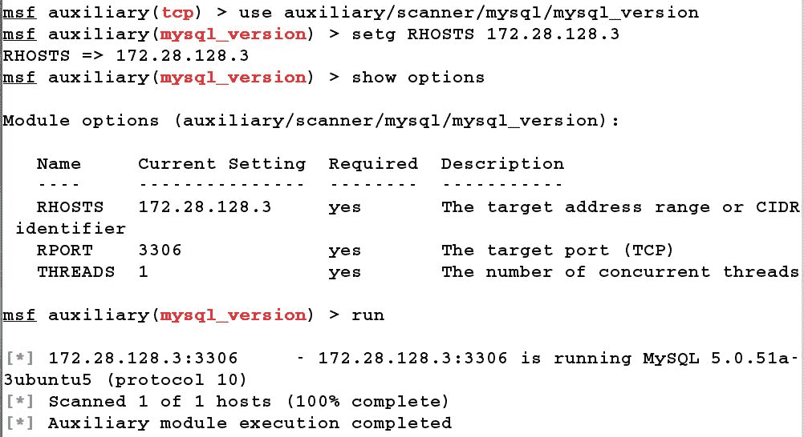
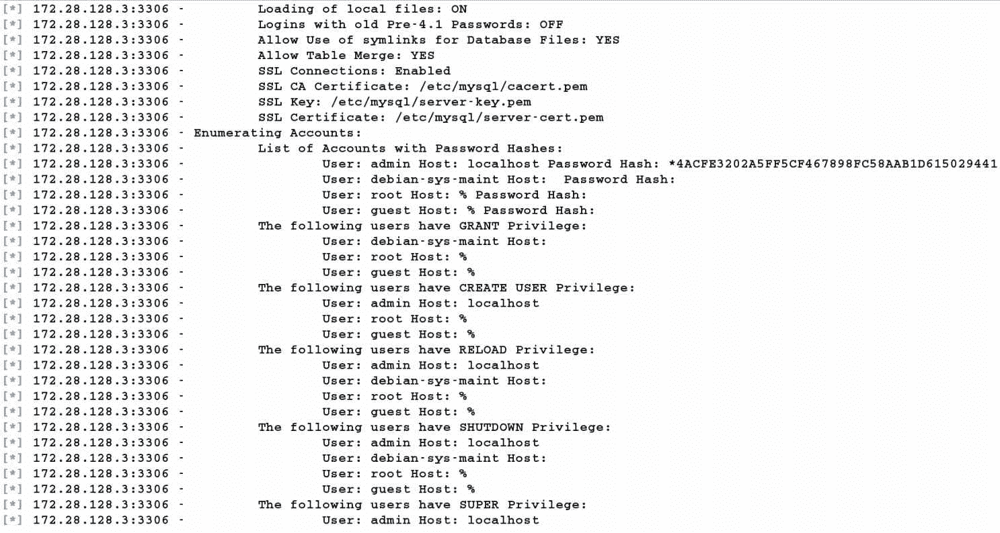
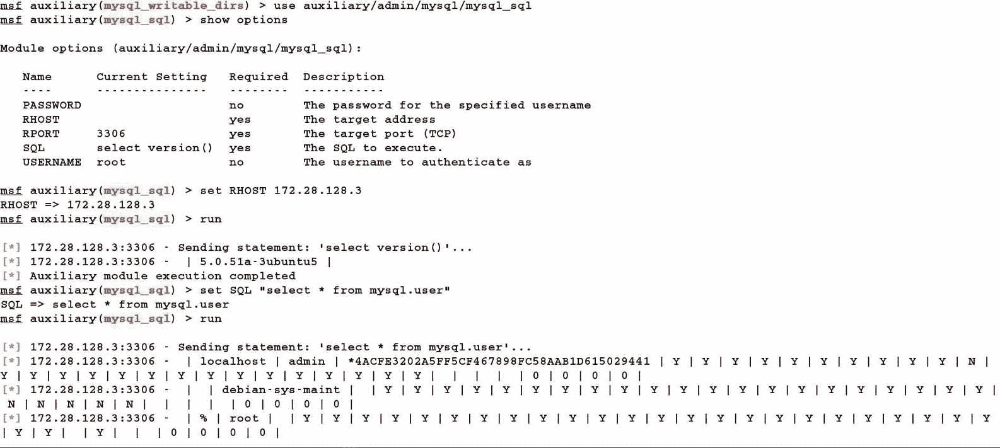
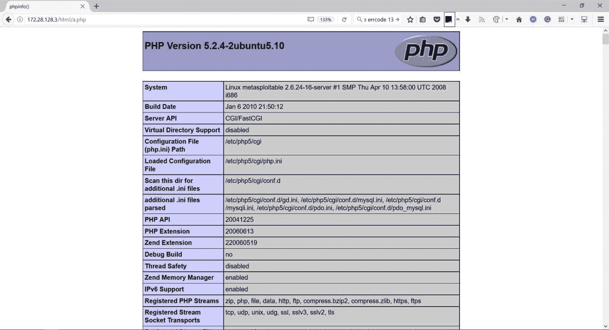
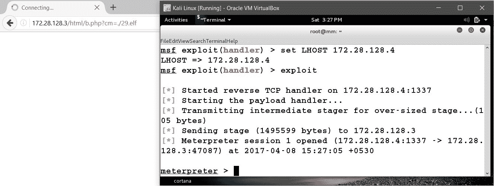
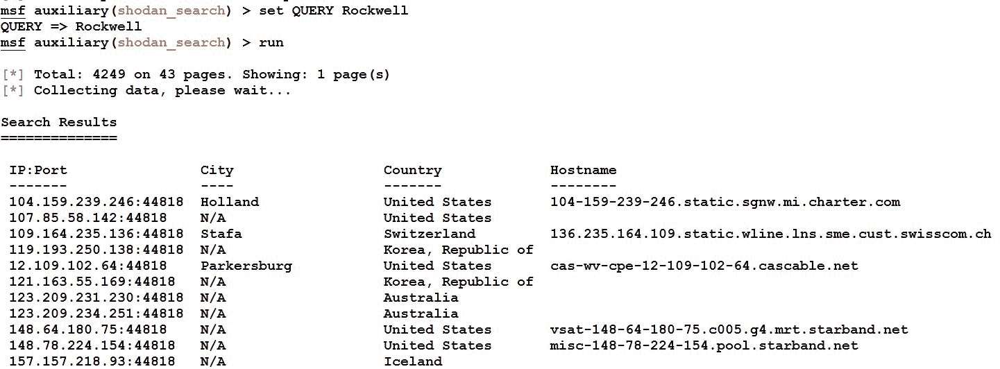
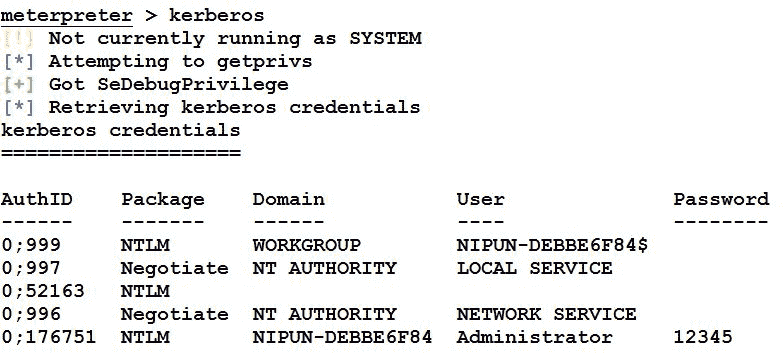
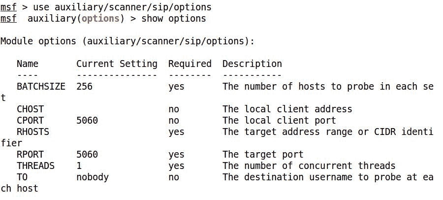
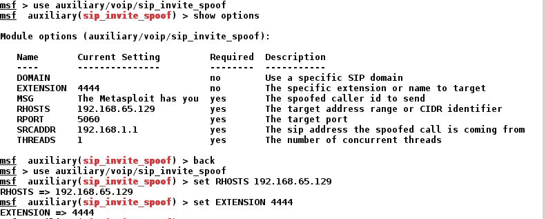

# 使用 Metasploit 测试服务

现在让我们谈谈测试各种专门的服务。很可能在我们作为渗透测试人员的职业生涯中，我们会遇到一个只需要在特定服务器上执行测试的公司或可测试环境，而这个服务器可能运行数据库、VoIP 或 SCADA 控制系统等服务。在本章中，我们将探讨在执行这些服务的渗透测试时使用的各种开发策略。在本节中，我们将涵盖以下几点：

+   进行数据库渗透测试

+   ICS 的基础知识及其关键性质

+   了解 SCADA 的利用

+   测试互联网协议语音服务

基于服务的渗透测试需要出色的技能和对我们可以成功利用的服务的深入了解。因此，在本章中，我们将探讨进行高效的基于服务的测试所面临的理论和实际挑战。

# 使用 Metasploit 测试 MySQL

众所周知，Metasploit 支持 Microsoft 的 SQL 服务器的广泛模块。但是，它也支持其他数据库的许多功能。我们在 Metasploit 中有许多其他数据库的模块，支持流行的数据库，如 MySQL、PostgreSQL 和 Oracle。在本章中，我们将介绍用于测试 MySQL 数据库的 Metasploit 模块。

如果你经常遇到 MSSQL，我在*精通 Metasploit*图书系列中已经介绍了使用 Metasploit 进行 MSSQL 测试。

请参考*精通 Metasploit*图书系列中的 MSSQL 测试：

[`www.packtpub.com/networking-and-servers/mastering-metasploit-second-edition`](https://www.packtpub.com/networking-and-servers/mastering-metasploit-second-edition)

因此，让我们进行端口扫描，看看数据库是否在 IP 地址`172.28.128.3`上运行，如下所示：

我们可以清楚地看到我们打开了端口 3306，这是 MySQL 数据库的标准端口。

# 使用 Metasploit 的 mysql_version 模块

让我们使用`auxiliary/scanner/mysql`中的`mysql_version`模块来指纹识别 MySQL 实例的版本，如下截图所示：

我们可以看到我们在目标上运行的是 MYSQL 5.0.51a-3ubuntu5。

# 使用 Metasploit 对 MySQL 进行暴力破解

Metasploit 为 MySQL 数据库提供了很好的暴力破解模块。让我们使用`mysql_login`模块开始测试凭据，如下面的截图所示：

我们可以设置所需的选项，即`RHOSTS`为目标的 IP 地址，然后将`BLANK_PASSWORDS`设置为 true，然后简单地`run`模块，如下所示：

我们可以看到数据库正在以 root 用户和空密码运行。在进行现场 VAPT 时，您经常会遇到许多使用默认凭据运行的数据库服务器。在接下来的几节中，我们将使用这些凭据来收集有关目标的更多详细信息。

# 使用 Metasploit 查找 MySQL 用户

Metasploit 提供了一个`mysql_hashdump`模块，用于收集 MySQL 数据库的其他用户的用户名和密码哈希等详细信息。让我们看看如何使用这个模块：

我们只需要设置`RHOSTS`；我们可以跳过设置密码，因为它是空的。让我们`run`模块：

我们可以看到有四个其他用户，只有用户 admin 受到密码保护。此外，我们可以复制哈希并将其运行到密码破解工具中，以获得明文密码。

# 使用 Metasploit 转储 MySQL 模式

我们还可以使用`mysql_schemadump`模块转储整个 MySQL 模式，如下屏幕所示：

我们将`USERNAME`和`RHOSTS`选项分别设置为`root`和`172.28.128.3`，然后运行模块，如下所示：

我们可以看到我们已成功将整个模式转储到`/root/msf/loot`目录中，如前面的屏幕截图所示。转储模式将为我们提供更好的表视图和目标上运行的数据库类型，并且还将有助于构建精心制作的 SQL 查询，我们将在短时间内看到。

# 使用 Metasploit 在 MySQL 中进行文件枚举

Metasploit 提供了`mysql_file_enum`模块来查找目标上存在的目录和文件。该模块帮助我们弄清目录结构和目标端运行的应用程序类型。让我们看看如何运行这个模块：

首先，我们需要设置 USERNAME、RHOSTS 和 FILE_LIST 参数，以使该模块在目标上运行。

`FILE_LIST` 选项将包含我们想要检查的目录列表的路径。我们在`/root/desktop/`创建了一个简单的文件，名为 file，并在其中放入了三个条目，即/var、/var/www 和/etc/passwd。让我们运行模块并分析结果如下：

我们可以看到我们检查的所有目录都存在于目标系统上，从而为我们提供了目录结构和目标端关键文件的更好视图。

# 检查可写目录

Metasploit 还提供了一个`mysql_writable_dirs`模块，用于查找目标上的可写目录。我们可以通过将 DIR_LIST 选项设置为包含目录列表的文件，以及设置 RHOSTS 和 USERNAME 选项的方式来运行此模块，就像我们之前使用其他模块一样，如下图所示：

设置所有选项，让我们在目标上运行模块并分析结果，如下所示：

我们可以看到，在`/var/www/html`中，`/tmp/`目录是可写的。我们将看看如何在短时间内利用可写目录。

# 使用 Metasploit 进行 MySQL 枚举

Metasploit 中还存在一个用于详细枚举 MySQL 数据库的特定模块。`auxiliary/admin/mysql/mysql_enum`模块单独为许多模块提供了大量信息。让我们使用这个模块来获取有关目标的信息，如下所示：

设置`RHOSTS`、`USERNAME`和`PASSWORD`（如果不为空）选项，我们可以像前面的屏幕截图所示的那样运行模块。我们可以看到模块已经收集了各种信息，例如服务器主机名、数据目录、日志状态、SSL 信息和权限，如下图所示：

已经收集了关于数据库的足够信息，让我们在下一节中还执行一些有趣的 SQL 查询。

# 通过 Metasploit 运行 MySQL 命令

现在我们已经获得了关于数据库模式的信息，我们可以使用`auxiliary/admin/mysql/mysql_sql`模块运行任何 SQL 命令，如下图所示：

通过设置 SQL 选项提供 SQL 命令，我们可以在目标上运行任何 MySQL 命令。但是，我们显然还需要设置`RHOST`、`USERNAME`和`PASSWORD`选项。

# 通过 MySQL 获得系统访问权限

我们刚刚看到了如何通过 MySQL 运行 SQL 查询。让我们运行一些有趣且危险的查询，以获取对机器的完全访问权限，如下面的屏幕截图所示：

在前面的屏幕截图中，我们将 SQL 选项设置为 select "<?php phpinfo() ?>" INTO OUTFILE "/var/www/html/a.php"命令，并针对目标运行了模块。此命令将文本<?php phpinfo() ?>写入名为 a.php 的文件，路径为/var/www/html/a.php。我们可以通过浏览器确认模块的成功执行，如下图所示：

太棒了！我们已成功在目标上写入文件。让我们通过将`<?php system($_GET['cm']);?>`字符串写入同一目录中的另一个名为`b.php`的文件来增强这个攻击向量。一旦写入，该文件将使用`cm`参数接收系统命令，并使用 PHP 中的系统函数执行它们。让我们按照以下方式发送这个命令：

为了避免双引号，我们将在 SQL 命令中使用反斜杠。

运行模块，我们现在可以通过浏览器验证`b.php`文件的存在，如下所示：

我们可以看到，将系统命令（例如`cat/etc/password`）作为`b.php`文件的参数输出`/etc/passwd`文件的内容到屏幕上，表示成功的远程代码执行。

为了获得系统访问权限，我们可以快速生成一个 Linux meterpreter 有效载荷，并像在前几章中那样将其托管在我们的机器上。让我们通过提供`wget`命令，后跟我们有效载荷的路径和`cm`参数，将我们的 meterpreter 有效载荷下载到目标，如下所示：

我们可以通过发出`ls`命令来验证文件是否成功下载到目标位置：

是的，我们的文件已成功下载。让我们按照以下方式提供必要的权限：

我们对`29.elf`文件执行了`chmod 777`，如前面的屏幕截图所示。我们需要为 Linux meterpreter 设置一个处理程序，就像我们之前的例子一样。但是，在执行命令来执行二进制文件之前，请确保处理程序正在运行。让我们通过浏览器执行二进制文件，如下所示：

是的！我们已经获得了对目标的 meterpreter 访问，并且现在可以执行我们选择的任何后期利用功能。

对于除 root 之外的特权用户，我们可以在使用`chmod`命令时使用`+x`而不是`777`。

有关测试 MSSQL 数据库的更多信息，请参阅书籍《精通 Metasploit》的*第五章*。

始终记录在整个渗透测试过程中在服务器上留下的所有后门，以便在参与结束时可以进行适当的清理。

# SCADA 的基础知识

**监控和数据采集**（**SCADA**）用于控制大坝、电网站、炼油厂、大型服务器控制服务等活动。

SCADA 系统是为非常具体的任务而构建的，例如控制分派水的水平、管理天然气管道、控制电力网格以监视特定城市的电力以及各种其他操作。

# 在 SCADA 系统中分析安全性

在本节中，我们将讨论如何突破 SCADA 系统的安全性。我们有很多框架可以测试 SCADA 系统，但讨论它们将使我们超出本书的范围。因此，简单起见，我们将限制我们的讨论仅限于使用 Metasploit 进行 SCADA 利用。

# 测试 SCADA 的基础知识

让我们了解如何利用 SCADA 系统的基础知识。SCADA 系统可以使用 Metasploit 中最近添加到框架中的各种漏洞进行攻击。此外，一些位于 SCADA 服务器上的默认用户名和密码可能是默认的；这在当今很少见，但仍然可能存在用户名和密码在目标服务器上未更改的可能性。

让我们尝试找到一些 SCADA 服务器。我们可以通过使用一个很好的资源[`www.shodanhq.com`](http://www.shodanhq.com)来实现这一点：

1.  首先，我们需要为 Shodan 网站创建一个帐户。

1.  注册后，我们可以在我们的帐户中轻松找到 Shodan 服务的 API 密钥。获取 API 密钥后，我们可以通过 Metasploit 搜索各种服务。

1.  让我们尝试使用`auxiliary/gather/shodan_search`模块找到配置了 Rockwell Automation 技术的 SCADA 系统。

1.  在`QUERY`选项中，我们将只输入`Rockwell`，如下截图所示：

1.  我们将`SHODAN_APIKEY`选项设置为我们 Shodan 账户中找到的 API 密钥。让我们将`QUERY`选项设置为`Rockwell`并分析结果如下：

正如我们清楚地看到的，我们使用 Metasploit 模块找到了许多在互联网上运行 Rockwell Automation 的 SCADA 服务的系统。

# 基于 SCADA 的利用

在过去几年中，SCADA 系统的被利用率比以往任何时候都要高。SCADA 系统可能受到各种漏洞的影响，如基于堆栈的溢出、整数溢出、跨站脚本和 SQL 注入。

此外，这些漏洞的影响可能对生命和财产造成危险，正如我们之前讨论的那样。黑客攻击 SCADA 设备可能的原因主要是因为 SCADA 开发人员和操作人员在编程系统时没有关注安全性，以及使用的操作程序不足。

让我们看一个 SCADA 服务的例子，并尝试使用 Metasploit 进行利用。但是，请不要随意选择 Shodan 上的主机并尝试利用它。SCADA 系统非常关键，可能导致严重的监禁时间。无论如何，在以下示例中，我们将使用 Metasploit 在基于 Windows XP 系统的 DATAC RealWin SCADA Server 2.0 系统上进行利用。

该服务在端口 912 上运行，该端口对 sprintf C 函数的缓冲区溢出存在漏洞。sprintf 函数在 DATAC RealWin SCADA 服务器的源代码中用于显示从用户输入构造的特定字符串。当攻击者滥用这个有漏洞的函数时，可能会导致目标系统被完全攻陷。

让我们尝试使用`exploit/windows/scada/realwin_scpc_initialize`利用来利用 DATAC RealWin SCADA Server 2.0 系统。

我们将`RHOST`设置为`192.168.10.108`，`payload`设置为`windows/meterpreter/bind_tcp`。DATAC RealWin SCADA 的默认端口是`912`。让我们利用目标并检查我们是否可以`exploit`这个漏洞：

哇！我们成功地利用了目标。让我们使用`load`命令加载`mimikatz`扩展，以找到系统的明文密码，如下所示：

我们可以看到，通过发出`kerberos`命令，我们可以找到明文密码。

我们在 Metasploit 中有很多专门针对 SCADA 系统漏洞的利用。要了解有关这些漏洞的更多信息，您可以参考网络上关于 SCADA 黑客和安全的最佳资源[`www.scadahacker.com`](http://www.scadahacker.com)。您应该能够在[`scadahacker.com/resources/msf-scada.html`](http://scadahacker.com/resources/msf-scada.html)的*msf-scada*部分下找到许多列出的利用。

网站[`www.scadahacker.com`](http://www.scadahacker.com)在过去几年中一直在维护着各种 SCADA 系统中发现的漏洞列表。这个列表的美妙之处在于它提供了关于 SCADA 产品、产品供应商、系统组件、Metasploit 参考模块、披露细节以及第一个 Metasploit 模块披露日期的精确信息。

# 实施安全的 SCADA

当实际应用时，保护 SCADA 是一项艰巨的工作；然而，当保护 SCADA 系统时，我们可以寻找以下一些关键点：

+   密切关注对 SCADA 网络的每一次连接，并查明是否有任何未经授权的尝试访问系统

+   确保在不需要时断开所有网络连接，并且如果 SCADA 系统是空气隔离的，那么最终连接到它的任何其他端点都必须以相同的方式进行安全和审查

+   实施系统供应商提供的所有安全功能

+   为内部和外部系统实施 IDPS 技术，并应用 24 小时的事件监控

+   记录所有网络基础设施，并为管理员和编辑分配个人角色

+   建立 IR 团队和蓝队来识别对一个

定期

# 限制网络

在未经授权访问、不需要的开放服务等攻击事件发生时，可以限制网络连接。通过删除或卸载服务来实施这一解决方案是对各种 SCADA 攻击的最佳防御。

SCADA 系统部署在 Windows XP 系统上，这显著增加了攻击面。如果您正在应用 SCADA 系统，请确保您的 Windows 系统是最新的，以防止更常见的攻击。

# 测试互联网协议语音服务

现在让我们专注于测试**互联网协议语音**（**VoIP**）启用的服务，并看看我们如何检查可能影响 VoIP 服务的各种缺陷。

# VoIP 基础知识

与传统电话服务相比，VoIP 是一种成本更低的技术。VoIP 在电信方面比传统电话更加灵活，并提供各种功能，如多个分机、来电显示服务、日志记录、每通电话的录音等。一些公司现在在 IP 电话上有他们的**私有分支交换**（**PBX**）。

传统的电话系统仍然容易通过物理访问进行窃听，如果攻击者改变电话线的连接并连接他们的发射器，他们将能够使用他们的设备拨打和接听电话，并享受互联网和传真服务。

然而，在 VoIP 服务的情况下，我们可以在不进入线路的情况下破坏安全。然而，如果您对其工作原理没有基本的了解，攻击 VoIP 服务是一项繁琐的任务。本节介绍了我们如何在网络中破坏 VoIP 而不拦截线路。

此外，在托管服务类型的 VoIP 技术中，客户端处没有 PBX。然而，客户端处的所有设备通过互联网连接到服务提供商的 PBX，即通过使用 IP/VPN 技术使用**会话初始协议**（**SIP**）线路。

让我们看看以下图表如何解释这项技术：

互联网上有许多 SIP 服务提供商为软电话提供连接，可以直接使用以享受 VoIP 服务。此外，我们可以使用任何客户端软电话来访问 VoIP 服务，如 Xlite，如下面的屏幕截图所示：

# 指纹识别 VoIP 服务

我们可以使用 Metasploit 内置的 SIP 扫描器模块对网络上的 VoIP 设备进行指纹识别。一个常见的 SIP 扫描器是内置在 Metasploit 中的**SIP 终端扫描器**。我们可以使用这个扫描器通过向各种 SIP 服务发出选项请求来识别网络上启用 SIP 的设备。

让我们继续使用辅助模块下的选项来扫描 VoIP 服务

`/auxiliary/scanner/sip`并分析结果。目标是运行 Asterisk PBX VoIP 客户端的 Windows XP 系统。我们首先加载用于扫描网络上的 SIP 服务的辅助模块，如下面的屏幕截图所示：

我们可以看到，我们有很多选项可以与`auxiliary/scanner/sip/options`辅助模块一起使用。我们只需要配置`RHOSTS`选项。然而，对于庞大的网络，我们可以使用**无类域间路由**（**CIDR**）标识符定义 IP 范围。运行后，该模块将开始扫描可能正在使用 SIP 服务的 IP。让我们按照以下方式运行此模块：

正如我们可以清楚地看到的那样，当此模块运行时，它返回了许多与使用 SIP 服务的 IP 相关的信息。这些信息包含了代理，表示 PBX 的名称和版本，以及动词，定义了 PBX 支持的请求类型。因此，我们可以使用此模块来收集关于网络上 SIP 服务的大量知识。

# 扫描 VoIP 服务

在找到目标支持的各种选项请求的信息后，让我们现在使用另一个 Metasploit 模块`auxiliary/scanner/sip/enumerator`来扫描和枚举 VoIP 服务的用户。这个模块将在目标范围内搜索 VoIP 服务，并尝试枚举其用户。让我们看看我们如何实现这一点：

现在我们已经列出了可以与此模块一起使用的选项。我们现在将设置一些以下选项以成功运行此模块：

正如我们所看到的，我们已经设置了`MAXEXT`，`MINEXT`，`PADLEN`和`RHOSTS`选项。

在前面截图中使用的 enumerator 模块中，我们将`MINEXT`和`MAXEXT`分别定义为`3000`和`3005`。`MINEXT`是开始搜索的分机号，`MAXEXT`是完成搜索的最后一个分机号。这些选项可以设置为巨大的范围，比如`MINEXT`设置为`0`，`MAXEXT`设置为`9999`，以找出在分机号`0`到`9999`上使用 VoIP 服务的各种用户。

让我们将此模块在目标范围上运行，将`RHOSTS`变量设置为 CIDR 值，如下所示：

将`RHOSTS`设置为`192.168.65.0/24`将扫描整个子网。现在，让我们运行此模块，看看它呈现了什么输出：

这次搜索返回了许多使用 SIP 服务的用户。此外，`MAXEXT`和`MINEXT`的影响是只扫描了从`3000`到`3005`的分机用户。分机可以被视为特定网络中用户的标准地址。

# 伪造 VoIP 呼叫

在获得关于使用 SIP 服务的各种用户的足够知识后，让我们尝试使用 Metasploit 向用户发起一个虚假呼叫。假设目标用户在 Windows XP 平台上运行 SipXphone 2.0.6.27，让我们使用`auxiliary/VoIP/sip_invite_spoof`模块发送一个虚假的邀请请求给用户，如下所示：

我们将使用目标的 IP 地址设置 RHOSTS 选项，并将 EXTENSION 设置为目标的 4444。让我们将 SRCADDR 保持为 192.168.1.1，这将伪装呼叫的源地址。

让我们现在按照以下方式`run`该模块：

让我们看看受害者那边发生了什么：

我们可以清楚地看到软电话正在响铃，并显示呼叫者为 192.168.1.1，并且还显示了来自 Metasploit 的预定义消息。

# 利用 VoIP

为了完全访问系统，我们也可以尝试利用软电话软件。我们已经从之前的情景中得到了目标的 IP 地址。让我们用 Metasploit 来扫描和利用它。然而，在 Kali 操作系统中有专门设计用于测试 VoIP 服务的专用 VoIP 扫描工具。以下是我们可以用来利用 VoIP 服务的应用程序列表：

+   Smap

+   Sipscan

+   Sipsak

+   VoiPong

+   Svmap

回到这个练习的利用部分，我们在 Metasploit 中有一些可以用于软电话的利用。让我们看一个例子。

我们要利用的应用程序是 SipXphone 版本 2.0.6.27。该应用程序的界面可能类似于以下截图：

# 关于漏洞

漏洞存在于应用程序对 Cseq 值的处理中。发送一个过长的字符串会导致应用程序崩溃，并且在大多数情况下，它将允许攻击者运行恶意代码并访问系统。

# 利用应用程序

现在让我们利用 Metasploit 来 exploit SipXphone 版本 2.0.6.27 应用程序。我们要使用的 exploit 是`exploit/windows/sip/sipxphone_cseq`。让我们将这个模块加载到 Metasploit 中，并设置所需的选项：

我们需要设置`RHOST`、`LHOST`和`payload`的值。现在一切都设置好了，让我们像下面这样`exploit`目标应用程序：

哇！我们很快就得到了 meterpreter。因此，利用 Metasploit 进行 VoIP 的 exploit 在软件漏洞的情况下可能很容易。然而，在测试 VoIP 设备和其他与服务相关的漏洞时，我们可以使用第三方工具进行充分的测试。

测试 VoIP 的一个很好的资源可以在[`www.viproy.com`](http://www.viproy.com)找到。

# 总结和练习

在本章中，我们看到了如何测试 MySQL 数据库、VoIP 服务和 SCADA 系统的多个漏洞。我们看到了攻击者只要获得数据库访问权限就可能最终获得系统级别的访问权限。我们还看到了 ICS 和 SCADA 中的漏洞如何导致攻击者 compromise 整个服务器，这可能导致巨大的损害，我们还看到了部署在各个公司的 PBX 不仅可以用于欺骗电话，还可以 compromise 整个客户端系统。为了练习你的技能，你可以按照自己的节奏进行以下进一步的练习：

+   尝试测试 MSSQL 和 PostgreSQL 数据库，并记下模块。

+   下载其他基于软件的 SCADA 系统，并尝试在本地 exploit 它们。

+   尝试为 MSSQL 运行系统命令。

+   解决 MySQL 写入服务器时的错误 13。

+   本章涵盖的数据库测试是在 Metasploitable 2 上执行的。尝试在本地设置相同的环境并重复练习。

在过去的五章中，我们涵盖了各种模块、exploits 和服务，这花费了大量的时间。让我们看看如何在第六章中使用 Metasploit 加速测试过程，*Fast-Paced Exploitation with Metasploit*。
