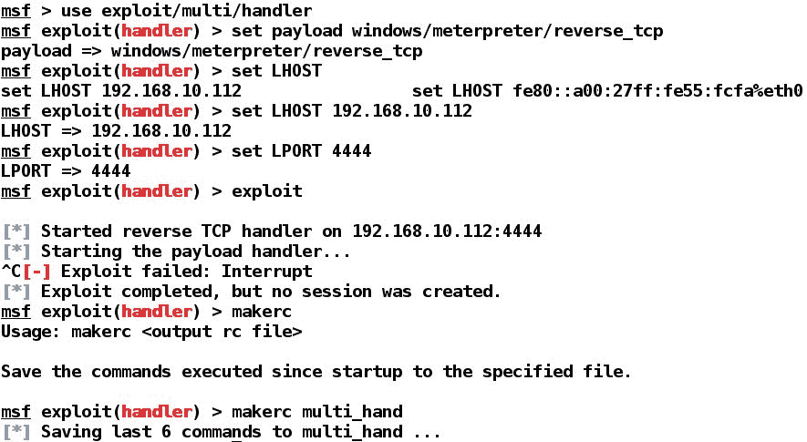
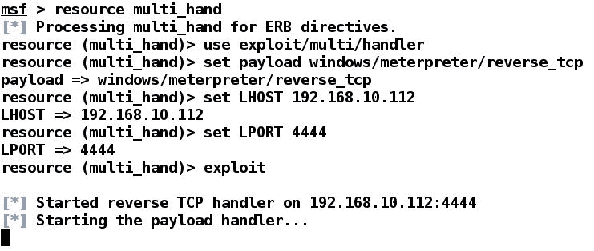
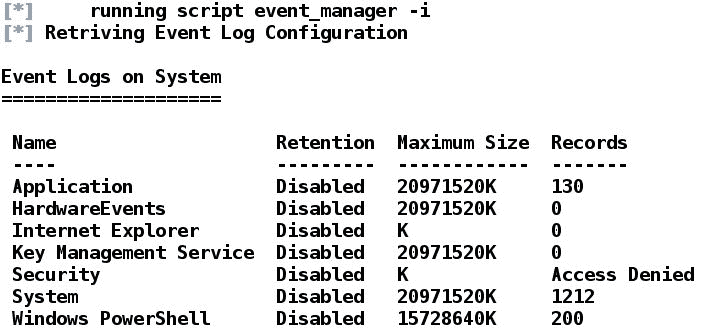

# 使用 Metasploit 进行快速利用

在进行渗透测试时，监控时间限制至关重要。比预期消耗更多时间的渗透测试可能导致信任丧失、超出预算的成本以及许多其他问题。漫长的渗透测试也可能导致组织未来失去来自客户的所有业务。

在本章中，我们将开发使用 Metasploit 中的自动化工具和方法进行快速渗透测试的方法。我们将学习以下内容：

+   在飞行中切换模块

+   自动化后渗透

+   自动化利用

这种自动化测试策略不仅可以减少测试时间，还可以降低每人每小时的成本。

# 使用 pushm 和 popm 命令

Metasploit 提供了两个很棒的命令——即`pushm`和`popm`。`pushm`命令将当前模块推送到模块堆栈上，而`popm`则从模块堆栈顶部弹出推送的模块。然而，这不是进程可用的标准堆栈。相反，这是 Metasploit 利用相同概念的利用；它与其他无关。使用这些命令可以使我们进行快速操作，节省大量时间和精力。

考虑这样一个情景，我们正在测试一个具有多个漏洞的内部服务器。在内部网络的每台系统上都运行着两个可利用的服务。为了利用每台机器上的两个服务，我们需要快速切换模块的机制来处理这两个漏洞。在这种情况下，我们可以使用`pushm`和`popm`命令。我们可以使用一个模块测试服务器的单个漏洞，然后将该模块推送到堆栈上并加载另一个模块。完成第二个模块的任务后，我们可以使用`popm`命令弹出堆栈上的第一个模块，并保持所有选项不变。

让我们通过以下截图了解更多关于这个概念：

从前面的截图中，我们可以看到，我们使用`pushm`命令将`psexec`模块推送到堆栈上，然后加载了`exploit/multi/handler`模块。一旦我们完成了`multi/handler`模块的操作，我们可以使用`popm`命令从堆栈中重新加载`psexec`模块，如下图所示：

我们可以清楚地看到`psexec`模块的所有选项都与模块一起保存在堆栈上。因此，我们不需要再次设置选项。

# 利用资源脚本

Metasploit 通过资源脚本提供自动化。资源脚本消除了手动设置选项的需要，自动设置一切，从而节省了设置负载和模块选项所需的大量时间。

有两种创建资源脚本的方法——手动创建脚本或使用`makerc`命令。我推荐使用`makerc`命令而不是手动脚本编写，因为它可以消除打字错误。`makerc`命令将之前发出的所有命令保存在一个文件中，可以与资源命令一起使用。让我们看一个例子：

我们可以看到在前面的截图中，我们通过设置相关负载和选项（如`LHOST`和`LPORT`）启动了一个利用处理程序模块。发出`makerc`命令将以系统化的方式保存所有这些命令到我们选择的文件中，本例中为`multi_hand`。我们可以看到`makerc`成功地将最后六个命令保存到`multi_hand`资源文件中。

让我们按照以下方式使用`resource`脚本：

我们可以清楚地看到，只需发出`resource`命令，然后跟随我们的脚本，它就会自动复制我们保存的所有命令，从而消除了重复设置选项的任务。

# 在 Metasploit 中使用 AutoRunScript

Metasploit 还提供了另一个很棒的功能，即使用 AutoRunScript。可以通过发出 show advanced 命令来填充 AutoRunScript 选项。AutoRunScript 自动化了后渗透，并且一旦访问目标被实现，就会执行。我们可以通过手动设置 AutoRunScript 选项来设置 AutoRunScript 选项，方法是发出`set AutoRunScript [script-name]`，或者使用`resource`脚本本身，它可以自动化利用和后渗透。AutoRunScript 也可以使用`multi_script`和`multi_console_command`模块运行多个后渗透脚本。让我们举个例子，我们有两个脚本，一个用于自动化利用，另一个用于自动化后渗透，如下截图所示：

这是一个小的后渗透脚本，自动化了`checkvm`（用于检查目标是否在虚拟环境中运行的模块）和`migrate`（帮助从被利用的进程迁移到更安全进程的模块）。让我们看一下下面的利用脚本：

前面的`resource`脚本通过设置所有必需的参数来自动化 HFS 文件服务器的利用。我们还使用`multi_console_command`选项设置了 AutoRunScript 选项，该选项允许执行多个后渗透脚本。我们使用`-rc`开关将我们的后渗透脚本定义为`multi_console_command`，如前面的截图所示。

让我们运行利用脚本并在下一个屏幕中分析其结果：

我们可以清楚地在前面的截图中看到，利用完成后不久，`checkvm`和 migrate 模块被执行，表明目标是 Sun VirtualBox 虚拟机，并且进程被迁移到 notepad.exe 进程。我们脚本的成功执行可以在输出的后续部分中看到：

我们成功迁移到了 notepad.exe 进程。但是，如果有多个`notepad.exe`实例，进程迁移也可能跳过其他进程。

# 使用 AutoRunScript 选项中的 multiscript 模块

我们还可以使用`multiscript`模块而不是`multi_console_command`模块。让我们创建一个新的后渗透脚本，如下所示：

正如我们在前面的截图中清楚地看到的，我们创建了一个名为`multi_scr.rc`的新的后渗透脚本。我们需要对我们的利用脚本进行以下更改以适应这一变化：

我们只是用`multiscript`替换了`multi_console_command`，并更新了我们的后渗透脚本的路径，如前面的截图所示。让我们看看运行`exploit`脚本时会发生什么：

我们可以清楚地看到，在访问目标后，`checkvm`模块被执行，随后是`migrate`、`get_env`和`event_manager`命令，如下截屏所示：

`event_manager`模块显示了来自目标系统的所有日志，因为我们在资源脚本中提供了`-i`开关以及命令。`event_manager`命令的结果如下：

# Metasploit 中的全局变量

在特定范围或特定主机上工作时，我们可以始终使用`setg`命令来指定`LHOST`和`RHOST`选项。使用`setg`命令设置选项将为加载的每个模块全局设置`RHOST`或`LHOST`选项。因此，`setg`命令消除了重复设置这些特定选项的使用。我们还可以利用`setg`命令覆盖其他选项，如`LPORT`、`RPORT`和`payload`。然而，不同的服务在不同的端口上运行，我们可能也需要修改负载。因此，设置从一个模块到另一个模块不会改变的选项是一个更好的方法。让我们看看以下示例：

在前面的截图中，我们使用`setg`命令分配了`RHOST`。我们可以看到，无论我们多少次更改模块，`RHOST`的值对于所有模块都保持不变，我们不需要在每个模块中手动输入它。get 命令从当前上下文中获取变量的值，而`getg`命令从全局变量中获取值，如前面的截图所示。

# 总结和生成手动报告

让我们现在讨论如何创建渗透测试报告，看看应该包括什么，应该在哪里包括，应该添加或删除什么，如何格式化报告，使用图表等。许多人，如经理、管理员和高级管理人员，都会阅读渗透测试报告。因此，有必要对发现进行良好的组织，以便向涉及方传达正确的信息，并被目标受众理解。

# 报告格式

一个良好的渗透测试报告可以分解为以下元素：

+   页面设计

+   文档控制

+   封面页

+   文档属性

+   报告内容列表

+   目录

+   插图列表

+   执行/高级摘要

+   渗透测试范围

+   严重程度信息

+   目标

+   假设

+   漏洞摘要

+   漏洞分布图

+   建议摘要

+   方法论/技术报告

+   测试细节

+   漏洞列表

+   可能性

+   建议

+   参考文献

+   术语表

+   附录

以下是一些相关部分的简要描述：

+   **页面设计**：这指的是报告中要使用的字体、页眉和页脚、颜色和其他设计元素的选择。

+   **文档控制**：这里涵盖了关于报告的一般属性。

+   **封面页**：包括报告的名称、版本、时间和日期、目标组织、序列号等。

+   **文档属性**：此部分包含报告的标题、测试人员的姓名以及审阅此报告的人的姓名。

+   **报告内容列表**：此部分包括报告的内容。使用清晰定义的页码显示它们在报告中的位置。

+   **目录**：此部分包括从报告开始到结束的所有内容的列表。

+   **插图列表**：报告中使用的所有图表都应在此部分列出，并附有适当的页码。

# 执行摘要

执行摘要包含了报告的完整总结，以标准和非技术性的文本为重点，旨在向公司的高级员工提供知识。它包括以下信息：

+   **渗透测试范围**：此部分包括执行的测试类型和测试的系统。在此部分还列出了测试的所有 IP 范围。此外，此部分还包含了有关测试的严重程度信息。

+   **目标**：此部分将定义测试如何能够帮助目标组织，测试的好处是什么等。

+   **假设**：如果测试的范围要求进行内部评估，则假设攻击者已经通过非范围方法（如网络钓鱼或社会工程）获得了内部访问权限。因此，任何此类假设都应列在本节中。

+   **漏洞摘要**：此部分以表格形式提供信息，并描述了根据其风险级别（高、中或低）找到的漏洞数量。漏洞按其对资产的影响大小排序，从对资产影响最大的漏洞到对资产影响最小的漏洞。此外，此阶段包含了多个系统的多个问题的漏洞分布图。可以在以下表中看到一个示例：

| **                    影响** | **漏洞数量** |
| --- | --- |
|                     高 | 19 |
|                     中等 | 15 |
|                     低 | 10 |

+   **建议摘要**：此部分的建议仅适用于影响因子最高的漏洞，并应相应列出。

# 方法论/网络管理员级别报告

报告的这一部分包括渗透测试期间要执行的步骤、漏洞的深入细节和建议。以下信息是管理员感兴趣的部分：

+   **测试细节**：报告的这部分包括有关以图形、图表和表格形式总结测试的漏洞、风险因素和受这些漏洞感染的系统的信息。

+   **漏洞清单**：报告的这一部分包括漏洞的详细信息、位置和主要原因。

+   **可能性**：此部分解释了攻击者针对这些漏洞的可能性。为了获得这种可能性的值，我们分析了触发特定漏洞的易访问性，并找出了针对可能被攻击的漏洞进行的最简单和最困难的测试。

+   **建议**：列出修补漏洞的建议。如果渗透测试不建议修补漏洞，则被视为只完成了一半。

# 其他部分

以下部分是可选的，并且可能因报告而异：

+   **参考资料**：制作报告时使用的所有参考资料都应在此列出。书籍、网站、文章等参考资料都应清晰定义，包括作者、出版名称、出版年份或文章发表日期等。

+   **术语表**：报告中使用的所有技术术语都应在此列出，以及它们的含义。

+   **附录**：这一部分是添加杂项脚本、代码和图片的绝佳位置。

# 总结和为真实场景做准备

这一章让我们能够通过自动化利用和后利用使用多种类型的资源脚本来加快渗透测试的过程。我们还看到了`pushm`、`popm`和变量全局化的使用和好处。最后，我们看到了如何设计专业报告以及报告的各个部分如何呈现。

在我们开始第七章，*使用 Metasploit 开发真实世界挑战*之前，建议您通过迄今为止书中涵盖的所有示例，并详细学习每种方法。然而，除非您在增强研究能力的同时练习每一件事情，否则没有一本书能帮助您磨练技能。

我们将利用前几章学到的每一种技术来解决下一章的挑战，同时学习一些新技术。在阅读第七章 *使用 Metasploit 利用真实世界的挑战* 之前，你可以练习以下练习：

+   为 Linux 和 Windows 操作系统的 meterpreter 处理程序创建后利用脚本

+   想象你是执法机构的一部分，并记录下最显著的利用和后利用模块

+   想象你是一名专业的渗透测试人员，并重复前面的练习

+   尝试通过代理运行 meterpreter，并分析不同模块中观察到的变化

+   尝试结合开源漏洞扫描工具（如 OpenVAS）与 Metasploit 的力量，同时节省测试时间。

+   尝试提升 Windows 2003、Windows 2008 和 Windows 2012 服务器的权限，并记录模块之间的差异

第七章 *使用 Metasploit 利用真实世界的挑战* 是复杂的，包含各种方法和利用场景。在继续之前做好准备。祝你好运！
