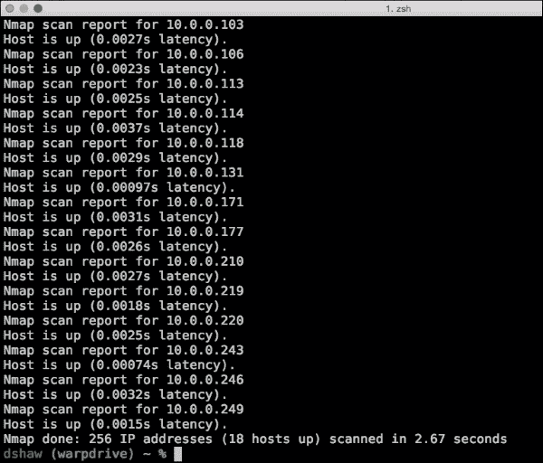
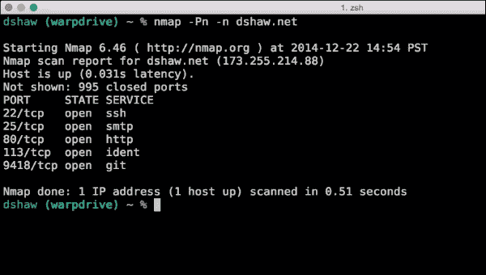
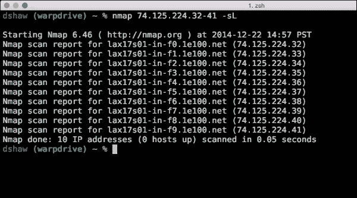
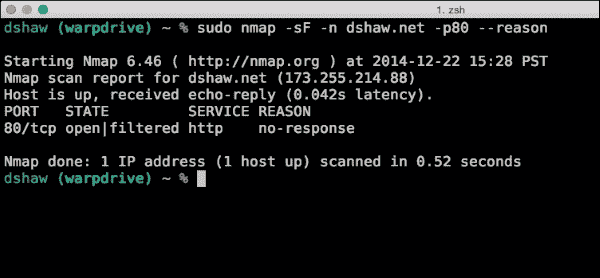
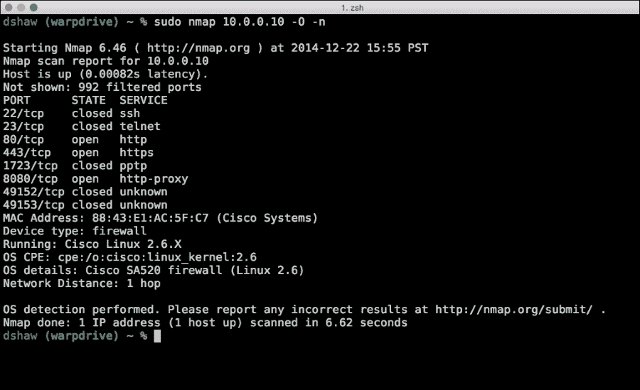
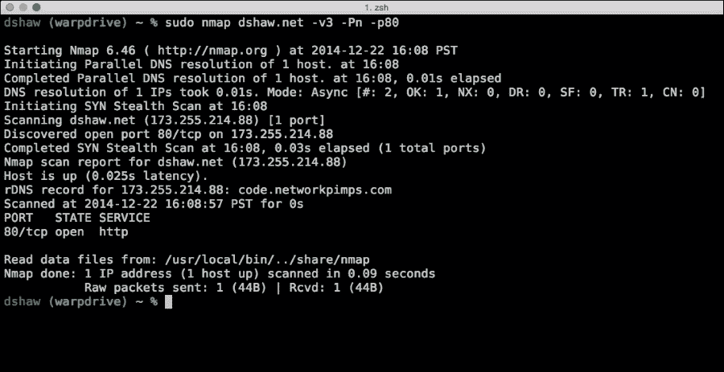
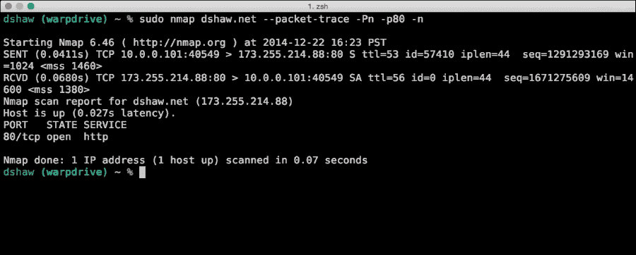

# 第四章。高级 Nmap 扫描

现在你完全能够对各种主机运行 Nmap 扫描了。太棒了！知道如何运行基本扫描将帮助你解决许多情况，但有一些值得注意的例外情况——以及不同的扫描类型——对于成为高级用户是至关重要的。

我们现在将具体介绍不同的主机检测方法（以便你知道要扫描什么），如何对试图隐藏自己的设备进行扫描，扫描 UDP，不同的详细程度选项等等。

在本章中，我们将涵盖：

+   运行 ping 扫描

+   运行 ping 不可知扫描

+   扫描 UDP 服务

+   在扫描中运行不同的 TCP 标志——比如圣诞树扫描

+   操作系统检测

+   增加 Nmap 输出的详细程度

+   显示扫描中的数据包跟踪

# 主机检测方法

为了有效地扫描主机，首先了解如何检测“活着”或在线的主机是很重要的。因为许多系统管理员试图将他们的系统隐藏在互联网上，某些主机在进一步探测之前会显得离线。幸运的是，Nmap 有几种方法来检测哪些主机是在线的。

检测主机的最直接方法是运行 ping 扫描。ping 或 ICMP 回显请求是机器设计用来响应的简单的“你在那里吗？”的问题和答案对话。

Ping 是以声纳命名的——潜艇发送的水下“ping”，用于探测该区域内的其他船只和潜艇——并且对计算机起着类似的作用。虽然你可以通过简单地输入`ping google.com`来轻松测试 ping 命令，但使用 Nmap 进行 ping 扫描可以在更大的目标网络范围内实现显著的效率提升。

使用`-sn`标志在 Nmap 中运行`ping only`扫描非常容易。这确保只运行 ping 扫描，而不是完整的端口扫描——这非常适合找出哪些主机在线。

在前面的屏幕截图中，作为`-sn`（ping 扫描）扫描运行，你可以清楚地看到在扫描的 256 个 IP 地址中，有 18 个是“up”，或者对 ping 做出响应的。

然而，有时你需要进一步地采用这种扫描方法。为了从扫描中“隐藏”，系统管理员经常会让他们的系统忽略 ping 请求。这通常是一个有效的方式来隐藏网络扫描！

# 运行 ping 不可知扫描

当系统从 ping 扫描中隐藏时，很难知道什么是在线的。幸运的是，Nmap 提供了一种 ping 不可知的扫描方法，可以非常有益地解决一些这些问题。

当 Nmap 运行“正常”扫描时，它将首先运行 ping 扫描，然后进行实际的端口扫描（扫描指定的端口范围）。如果主机不响应 ping，它们将不会被完全扫描——这意味着即使它们有在线服务，这些服务也不会被检测到。在运行端口扫描时，丢失服务或主机是一个非常严重的问题！

通过使用`-Pn`标志运行扫描，Nmap 将完全跳过运行初始的 ping 扫描，并扫描指定目标范围内的所有主机。虽然这通常需要更长的时间来运行——因为扫描真正离线的主机是一个很大的时间浪费——但它非常有用，可以找到可能被忽略的主机。

你可以在前面的屏幕截图中清楚地看到`dshaw.net`——我的个人网页，在这次扫描的目的是配置为不响应 ping——仍然在这次 ping 不可知扫描中被扫描到。在扫描大范围——比如一个 B 类网络——能够检测到试图隐藏的主机对于安全专业人员来说是非常宝贵的。

虽然它不是一种特定类型的扫描，但使用 Nmap 的`-sL`标志—或者进行简单的列表扫描的能力—来 ping 或扫描目标范围也是有用的。这对于获取反向 DNS 查找以及了解指定范围内有多少主机在线非常有用。

通过这种扫描—或者说不扫描—的方式，可以获得出色的结果。

在前面的屏幕截图中，您可以看到 Nmap“列出扫描”的范围指向由 Google 拥有的`1e100.net`域。这被称为**零数据包侦察**，因为实际上没有向任何相关域发送探测，但实现了完整的 DNS PTR 记录查找。

在主机检测和发现方面，最后一个伟大的 Nmap 功能是 TCP SYN ping 扫描。与发送 ICMP ping 请求（许多管理员禁用响应）不同，TCP SYN 扫描可以在给定端口对 SYN 请求做出响应的主机上处理在线主机。例如，如果您正在扫描通常运行 SSL Web 服务器的一组 IP 地址，调用`-PS 443`标志将在端口 443 上尝试连接时对在线主机进行处理。这非常有用，是 Nmap 主机检测工具中最有价值的功能之一。

# 扫描 UDP 服务

到目前为止，我们已经提到了 UDP 服务，但还没有讨论如何实际扫描它们。UDP 服务是无连接的，这使得扫描它们比传统端口扫描更加困难—有时需要基于协议的连接才能收到任何响应，即使大多数服务收到实际响应，也可能需要大量时间—换句话说，扫描 UDP 服务通常比它们的 TCP 对应物更慢且不太可靠。

尽管如此，重要的是能够扫描仅监听 UDP 的服务。例如，许多 VPN 的监听端口仅为 UDP。同样，NTP 和 DNS 通常仅监听 UDP 端口。因此，了解如何扫描它们非常重要。

这里的警告是，通常最好先进行 TCP 扫描，然后再进行 UDP 扫描。这很重要，因为让整个扫描等待 UDP 响应可能会使原本应该在五分钟内完成的扫描花费超过五个小时！

扫描 UDP 服务的标志只需调用`-sU`。确保在等待扫描时要有足够的时间。

### 注意

另外，UDP 扫描需要 root 权限才能运行。

对于`tick.ucla.edu`的扫描显示，端口`123`—**网络时间协议**（**NTP**）—可以从互联网的任何地方接受连接。

# 特殊的 TCP 扫描

我们已经介绍了 Nmap 建议的两种基本扫描类型—TCP 连接扫描（`-sT`）和 SYN 隐蔽扫描（`-sS`）。这些“全”和“半”连接扫描几乎可以应对任何情况，并且绝对是几乎每个安全专业人员、系统管理员、网络工程师和爱好者的“首选”扫描类型。

然而，尽管这些类型的扫描可以产生灵活性，但有时也有理由尝试在数据包上使用不同的标志。对于这些扫描，我们将介绍三种新的扫描类型：**FIN**、**Xmas Tree**和**Null**扫描。

运行这些扫描的驱动概念是，关闭的端口将尝试通过发出 RST（复位）数据包来重置连接，而打开的端口将完全放弃连接。这很有用，因为许多**入侵检测系统**（**IDS**）都在寻找 SYN 扫描—而隐秘的渗透测试人员绝对不想被发现！

这三个新选项中的第一个，FIN 扫描，是通过向每个端口发送 FIN 数据包开始的。

如前面的示例扫描所示，当对我的网页服务器运行 FIN 扫描（`-sF`）时，对 FIN 请求没有响应——这是有道理的，因为`dshaw.net`的 80 端口上有一个活动服务运行。

下一个扫描类型被称为 Xmas Tree 扫描，因为它就像一个数据包被点亮像圣诞树一样！ Xmas Tree 扫描（`-sX`）通过在数据包头上标记 FIN、URG 和 PUSH 标志来工作。

这三种扫描类型中的最后一种是空扫描，它在发送到目标端口的数据包头上不设置任何标志。可以使用`-sN`选项启动此扫描。确保如果要启动空扫描，您要大写`N`——否则，您将意外地运行一个 ping swing（我们在*主机检测方法*部分中介绍过）。

尽管这些扫描类型通常非常有用，但值得注意的是，FIN、Xmas 和 NULL 扫描已知在 Microsoft Windows 主机上不起作用。

# 操作系统检测

尽管扫描端口并使用不同的数据包头以产生最佳、最准确的结果非常有用，但简单的端口扫描并不总是能够可靠地实现一些事情。其中最重要的一个元素是操作系统检测。

在尝试识别和攻击目标时，最有用的信息之一是该机器正在运行的操作系统。因为许多软件可以在多个操作系统上运行，这在传统上是一个“难”解决的问题。然而，Nmap 的开发人员——在整个信息安全社区的帮助下——已经能够编制出一个数据库，其中包含最常见（甚至一些非常罕见）的操作系统指纹，这些指纹可以始终帮助识别目标正在运行的操作系统。这是一个容易记住的标志——您只需使用`-O`标志调用扫描即可。

正如您所看到的，这次对思科安全设备的扫描很容易识别出了关键信息的几个部分。首先，我们可以看到 MAC 地址——以及谁创建了该设备。请记住，正如我们在第二章中所学到的那样，*网络基础*，我们只能在局域网上扫描到 MAC 地址——而不能在互联网上扫描到。其次，我们可以看到 OS CPE——甚至是 OS 的详细信息：思科 SA520 防火墙，运行 Linux 2.6 内核。这绝对是我们可以从端口扫描中提取出的最有价值的信息之一。

尽管如果操作系统检测总是像本例中那样简单明了就好了，但事实并非如此。不过，好消息是，一旦开始操作系统扫描，Nmap 将尝试评估其对给出的结果的信心程度。在下面的示例中，您可以看到，尽管 Nmap 并不完全确定我的机器正在运行什么操作系统（考虑到补丁经常改变底层操作系统的工作方式，这是有道理的），但它仍然可以给我们一个相当好的想法！

# 增加扫描的详细程度

正如您可能在整本书中已经注意到的那样，运行扫描时几乎总是获得更多信息更好。幸运的是，Nmap 的开发人员允许我们通过增加详细程度来快速轻松地在扫描时检索信息。

详细程度允许在扫描运行时直接在控制台上显示时间、并行性和内部调试信息。这对于找出何时需要尝试通过几种方式优化扫描非常有用（我们将在下一章中了解）。在增加详细程度的扫描中，您还可以按*Enter*键查看扫描的进度和完成当前目标文件之前还有多远。有几种不同级别的详细程度，但我通常使用第三级。

冗长度的第一级提供了关于扫描进度的基本信息，并可以通过使用`-v`标志来调用。第二级冗长度提供了更多信息，包括一些网络和数据包信息，并可以通过使用`-vv`作为标志来调用。最后，三重冗长度提供了扫描的最多信息，可以通过使用`-vvv`标志来调用。如果您希望使 Nmap 比正常情况下更少冗长，您也可以使用`--reduce-verbosity`标志。

您可以在上述截图中看到，在这个单端口扫描中，显示了更多的时间和数据包信息。这可能非常有用，特别是在长时间扫描中，比如包括超过 1000 个主机的扫描，以更好地了解 Nmap 在进行时正在做什么。更重要的是，这些信息可以用来确定是否需要进行时间、并行性或其他性能调整。例如，如果扫描正常进行，但每次只完成了少数主机，我们就知道要增加并行性以使整体扫描更快。然而，如果我们收到网络超时错误，我们就知道我们扫描得太快了，这种情况下，我们会想要使用一个更慢的`timing`标志。

# 数据包跟踪

与增加扫描的冗长度类似，了解主机之间发生的网络跳数以及实际经过的网络流量是非常宝贵的。虽然可以使用系统工具如**traceroute**和**tcpdump**来找出目标服务器在网络上的位置，但对许多主机同时进行这样的操作可能是一个痛苦（且耗时）的过程。

Nmap 允许对每次扫描进行数据包跟踪，而不是使用外部工具，这显示了我们需要的确切信息。不要把这看作是一个安全功能（尽管它确实有与安全相关的用途），最好把它看作是系统管理员和网络工程师的工具。

这个数据包跟踪示例显示了 Nmap 到目标机器的 tcpdump 风格输出。虽然在这个简单的单端口扫描中它并没有提供过多的价值，但这些信息对于理解网络拥塞、数据包丢失、离线主机等在更大的扫描中是非常有用的。

# 摘要

在本章中，我们介绍了如何选择目标，运行默认扫描，检查服务版本，记录扫描（以及不同日志类型的含义），指定特殊扫描范围，并了解 Nmap 结果的原因。

在下一章中，我们将讨论如何确保您的扫描运行在最佳性能。Nmap 具有几个功能可以帮助扫描快速运行，并尽可能准确地提供结果。这些时间、并行性和性能改进将在下一章中进行分类和解释。
