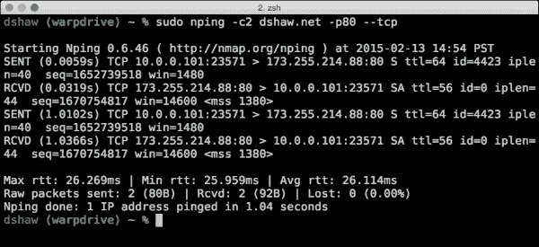
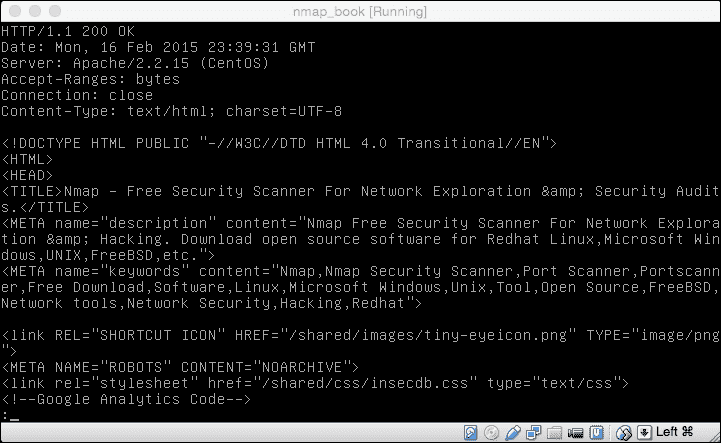
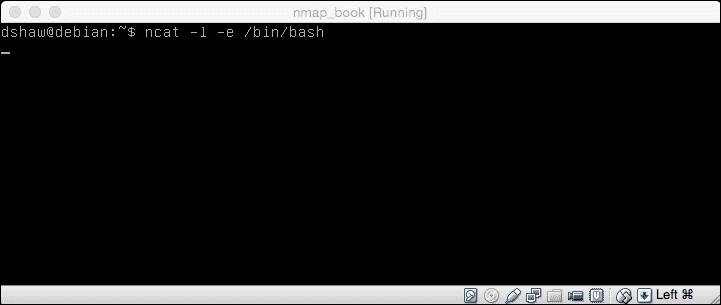
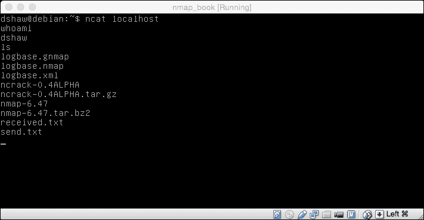

# 第八章。其他 Nmap 工具

我们现在已经成功编写了我们的第一个 Nmap 脚本，并对各种不同类型的目标（和防御）进行了各种扫描。然而，扫描主机只是 Nmap 套件的全部功能的一小部分。

除了创建强大的扫描工具和 NSE 之外，Nmap 开发人员还包括了几个其他工具——包括 Ncrack、Nping、Ncat 和 Ndiff——在 Nmap 的默认安装包中。这些工具可以帮助分析现有的扫描结果，转向其他主机，传输文件，或者随时间比较扫描结果。

在本章中，我们将涵盖以下主题：

+   使用 Ncrack 攻击服务

+   使用 Nping 进行主机检测

+   使用 Ncat 进行文件传输和后门

+   使用 Ndiff 比较 Nmap 结果

# 使用 Ncrack 攻击服务

Nmap 套件中包含的最具侵略性的工具之一是 Ncrack——一种用于积极暴力破解（或“破解”）网络服务的工具。虽然它的功能并不独特（因为有许多软件工具可以暴力破解网络帐户），但易于（和本地）与 Nmap 集成（和 Nmap 结果）使其成为扫描后的理想选择。

在使用 Ncrack 之前，我们需要确保它已安装。虽然大多数 Nmap 工具都随 Nmap 套件包安装，但由于 Ncrack 在技术上（在撰写本文时）是一个 alpha 版本，因此它并未包含在许多安装中。

### 注意

文档和最新的下载链接可在[`nmap.org/ncrack/`](http://nmap.org/ncrack/)找到。

像许多 Nmap 工具一样，安装非常简单；执行以下步骤：

1.  `wget http://nmap.org/ncrack/dist/ncrack-0.4ALPHA.tar.gz`

1.  `tar -xzf ncrack-0.4ALPHA.tar.gz`

1.  `cd ncrack-0.4ALPHA`

1.  `./configure`

1.  `make` ; `sudo make install`

您将能够看到前面步骤的输出，如下面的屏幕截图所示：

配置完成后，您可能会注意到一个蝎子的 ASCII 艺术（如前面的屏幕截图所示）。这个艺术是向您致敬 Nmap 龙，您可能还记得我们几章前第一次安装 Nmap 时的情景！

安装了 Ncrack 之后，我们可以以几种有用和有趣的方式来调用它来为我们服务。

运行 Ncrack 最直接的方法非常简单；如前面的屏幕截图所示，可以简单地运行`ncrack`，然后跟上目标服务的协议 URI 和主机名（或 IP 地址）。以这种方式使用，我们可以通过运行`ncrack ssh://TARGET`来攻击服务（如 SSH）。

当使用已知用户名时，Ncrack 最有效。例如，如果我们知道某个系统有一个允许密码认证的 root 登录，我们将运行`ncrack --user root ssh://TARGET`来对该用户名进行暴力破解。

尽管这个功能非常有用，但它并不是唯一的；许多工具，如**Hydra**和**Medusa**都可以进行暴力破解攻击。当 Ncrack 基于 Nmap 扫描的结果运行时，Ncrack 的真正优势就显现出来了。

假设我们正在对一个 C 类（/24）网络中的一系列主机进行渗透测试或安全评估。例如，如果有 200 台主机在线，每台主机有五到十个服务在监听，那么您需要在命令行上执行大量不同的暴力破解尝试。然而，Ncrack 可以为您完成这些工作。

就像 Nmap 可以导出不同的日志类型一样，Ncrack 可以将它们作为输入读取，并自动攻击相关服务。例如，如果我们从 Nmap 扫描中有一个`-oX`标志（XML 输出），Ncrack 可以使用`-iX`将相同的列表作为目标文件输入：

我们可以轻松地看到，通过扫描`nmap.scanme.org`并导出 XML 文件，我们可以轻松地将其导入到 Ncrack 中。虽然这只是一个主机，但您可以想象如果我们用于大型网络时会节省多少时间！值得注意的是，不支持登录的服务，或者 Ncrack 不知道如何使用的服务，默认情况下会从扫描中排除。在这种情况下，由于没有登录提示，`nping-echo`被排除在外。

除了指定目标文件之外，运行 Ncrack 所需的一些标志是绝对必要的。对于 Ncrack 来说，最重要的两个标志是`-U`和`-P`标志，它们分别指向包含用户名和密码的文本文件。

有大量其他标志、配置设置和 Ncrack 的用途，所有这些都可以在非常有用的主页上找到。

在使用 Ncrack 之前，需要注意：虽然使用 Nmap 进行端口扫描可能会让许多系统管理员感到恼火（实际上在某些地区是非法的），但使用 Ncrack 尝试破解服务是非法的，只能在系统所有者明确许可的情况下进行。如果您试图对自己的资产进行安全评估，或者您有签署的同意书（比如渗透测试的情况），那么您是可以的-但不要试图破解互联网上的任意主机！

# 使用 Nping 进行主机检测

与 Ncrack 一样，Nping 是最近才被添加到 Nmap 套件中的-它的第一个版本是在 2009 年 8 月创建的（与 Ncrack 一起），并且在 2010 年 3 月首次包含在实际的 Nmap 套件中。

尽管从其名称中您可能不会期望到，但 Nping 的功能远不止于 ICMP 回显请求（我们通常称之为 ping）-主要是它还可以执行 ARP 探测和对给定端口的 TCP 或 UDP 请求，以便根据响应来判断这些主机是否在线。例如，如果我们想要调试某些网络连接，我们可以轻松地使用 Nping 来确定在网络上发生了什么。以下屏幕截图显示了一个基本的 Nping 命令：

在前面的屏幕截图中，我们使用 Nping 对每个端口进行了两次检查（`-c 2`，其中"c"代表"count"），并扫描了`dshaw.net`上的端口-80。在这种情况下，80 是一个开放的端口（它正在运行我的 Web 服务器），我们可以清楚地看到我们期望的响应。正如我们在前面的章节中记得的那样，现在我们可以看到在尝试进行 TCP 握手时通过网络连接信息（发送和接收的数据包）发生了什么。如果我们正在调试网络连接，我们还会指定`-v`来查看更多的数据包信息。

Nping 最独特的功能之一是其内置的回显模式。回显模式允许 Nping 作为服务器和客户端工作，并来回发送数据包。通过显示整个网络连接（客户端发送的数据包，以其原始状态，以及服务器接收到的数据包），非常容易检测网络地址转换、干扰入侵防御系统、数据包整形等等。

### 注意

有关 Nping 回显命令的完整列表，以及各种预期用途，请查看 Nmap 文档门户网站（NSEDoc），其中有一个位于[`nmap.org/book/nping-man-echo-mode.html`](http://www.nmap.org/book/nping-man-echo-mode.html)的全面教程。

# 使用 Ncat 进行文件传输和后门

对于那些可能不熟悉的人来说，一个很棒的网络管理工具在 1995 年推出，它被称为 Netcat。它有各种用途，从文件传输到网络监视，到聊天服务器，甚至可以创建后门，通过将其输入镜像到用户选择的指定网络地址。Netcat 在很多方面都是一个非常轻量级的端口扫描程序-通过使用一个快速的 shell 脚本，非常容易检查给定主机上是否响应了某些端口。

Netcat 今天仍然被广泛使用，但 Nmap 开发团队看到了软件在稳定性和可用性方面的一些非常严重的改进。因此，2009 年，Ncat 作为 Nmap 套件的一部分发布了。

与 Netcat 不同，Ncat 具有 SSL 支持（本地支持）、良好的连接重定向可靠性，以及其他几个内置功能，使其成为安全管理员工具箱中的一款好工具。

Ncat 有两种模式：“监听”模式，它在提供的端口上监听传入的连接，“连接”模式，通过它发送命令并接收反馈。在连接模式下，我们可以使用 Ncat 连接到各种服务，包括基于 HTTP 的 Web 服务器。

通过在调用`ncat nmap.org 80`后发送`GET / HTTP/1.0`请求，得到以下输出：

尽管它显然不像 Chrome 或 Firefox 等网页浏览器那样渲染得好，但你可以很清楚地看到来自 Web 服务器的 HTTP/HTML 响应。Ncat 的这种功能也可以用于连接到许多不同类型的服务，包括 SMTP、FTP、POP3 等等。当尝试向不同的协议发送不同的输入时，Ncat 可以非常有价值！

在进行渗透测试或安全评估时，Ncat 也非常有用，因为它既可以用作数据外泄的方法，也可以用作对受损系统的持久后门。

通过 Ncat 发送文件的能力使用了工具的“监听”和“连接”功能。以下截图显示了一个非常基本的 Ncat 命令：

首先，我们使用`-l`或`listen`标志设置了一个 Ncat 监听器。由于我们期望接收一个文件，我们可以将输出导向`received.txt`。我们始终要确保输出的文件类型与我们期望的文件类型相匹配，这样我们就不必在以后处理更改文件类型的问题。在设置监听器时，我们还可以设置一个特定的端口（在渗透测试中很有用）；但在这种情况下，我们保留了默认端口 31337。

如前面的截图所示，在其他地方（不在监听器中）我们有一个名为`send.txt`的文件，其中包含`这是我们要发送的文件！`的内容。发送文件很容易！我们只需要调用 Ncat，将其指向本地主机（同样，我们使用默认端口 31337，因此不需要指定端口），并将输入从`send.txt`管道传输。以下截图演示了打开接收到的文本文件：

正如我们在前面的截图中看到的，一旦接收到文件，Ncat 将自动关闭。一旦我们实际接收到文件，只需简单地使用“cat”命令查看我们接收到的文件，就可以看到它实际上与我们发送的内容相同。

最后，Ncat 还可以用作后门，以创建对受损系统的持久访问。以下截图显示了这个基本功能：

如前面的截图所示，通过 Ncat 建立 shell 连接非常简单。我们使用`ncat -l -e /bin/bash`在默认端口上监听，并在客户端连接时执行`/bin/bash`（我们的 shell）。值得注意的是，在这种形式下，后门不是持久的，意味着在客户端断开连接后不会保持监听。以下截图演示了通过 Ncat 在远程系统上运行 Linux 命令的能力：

为了连接到 shell，如前面的屏幕截图所示，我们可以简单地调用`ncat localhost`（因为端口仍然是默认的），并让一个 bash shell 生成我们的提示符。在这种情况下，我们运行了`whoami`，收到了`dshaw`，然后执行了`ls`命令，并收到了远程目录的目录列表。虽然其他后门访问方法可能更可靠或更复杂，但很难想象有更简单的方法！

# 使用 Ndiff 比较 Nmap 结果

Nmap 套件中附带的最后一个工具是 Ndiff。对于那些不熟悉传统的* NIX 工具“diff”的人来说，它旨在直观地显示两个单独的文本文件之间的差异。换句话说，如果您（例如）想要查看在应用补丁时哪些代码行发生了变化，您可以“diff”新补丁和旧代码，并直观地看到差异。以下屏幕截图显示了一个基本的 Nmap 命令：

在前面的屏幕截图中，我们针对我的 Web 服务器`dshaw.net`的 80 和 81 端口启动了一次扫描。我们命名了我们的第一次扫描为`scan1.xml`，并对同一主机进行了另一次扫描——我们称之为`scan2.xml`。唯一的区别是我使用了 Ncat（我们在本章前面学到的）来将端口 81 打开到互联网。

为了比较结果，我们只需调用`ndiff scan1.xml scan2.xml`——非常简单。以下屏幕截图演示了这个命令：

正如您在前面的屏幕截图中清楚地看到的那样，Ndiff 输出使用与传统“diff”工具相同的格式，显示`+`和`-`表示哪些行是新的或旧的。由于它解析实际的 XML 文件，而不仅仅是文本输出，因此 Ndiff 可以成功确定何时完全添加了新的主机，而不仅仅是在输出中的不同位置。在这种情况下，很明显端口 81（只有一个默认的“service”标签，而不是实际的版本扫描）在第二次扫描中是打开的，而在第一次扫描中不是。这个工具对于想要随时间查看其网络状态的系统管理员非常有用。

# 总结

本章概述了 Nmap 套件附带的其他工具，以及我们可以使用这些工具完成的各种任务。虽然 Nmap 本身很棒，但为了充分发挥 Nmap 的用途，我们需要使用一些打包的工具。

在下一章中，我们将学习如何将 Nmap 与 Nmap 套件之外的其他工具结合使用，以进行完全功能的安全评估或渗透测试。
