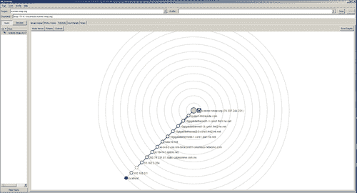
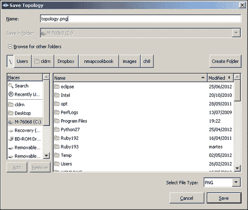

# 第八章。生成扫描报告

### 注意

本章向您展示了一些在许多情况下可能是非法、不道德、违反服务条款或只是不明智的事情。它在这里提供是为了向您提供可能有用的信息，以保护自己免受威胁，并使自己的系统更安全。在遵循这些说明之前，请确保您站在合法和道德的一边...善用您的力量！

在本章中，我们将涵盖：

+   以 normal 格式保存扫描结果

+   以 XML 格式保存扫描结果

+   将扫描结果保存到 SQLite 数据库

+   以 grepable 格式保存扫描结果

+   使用 Zenmap 生成网络拓扑图

+   生成 HTML 扫描报告

+   报告扫描期间执行的漏洞检查

# 介绍

扫描报告对于渗透测试人员和系统管理员都很有用。渗透测试人员需要报告他们的发现，并包括目标弱点的证据。另一方面，系统管理员需要保持网络清单并监视网络的完整性。

安全专业人员和网络管理员常犯的一个错误是不使用 Nmap 的报告功能来加快生成这些报告的速度。Nmap 可以以多种格式编写扫描结果，用户可以选择生成 HTML 报告，从脚本语言中读取报告，甚至将其导入到第三方安全工具中以继续测试目标的其他方面。在本章中，我们将涵盖与存储扫描报告相关的不同任务。我们首先介绍 Nmap 支持的不同文件格式。此外，我们还会给出一些建议，比如使用 Zenmap 生成网络拓扑图，报告漏洞检查，以及使用 PBNJ 将结果存储在 MySQL、SQLite 或 CSV 数据库中。

学习本章涵盖的任务后，您应该能够熟练选择适当的文件格式来存储扫描结果，具体取决于您计划对报告执行的操作。

# 以 normal 格式保存扫描结果

Nmap 支持不同格式来保存扫描结果。根据您的需求，您可以在 normal、XML 和 grepable 输出之间进行选择。normal 模式将输出保存为您在屏幕上看到的样子，减去运行时调试信息。这种模式以一种结构良好且易于理解的方式呈现发现结果。

此示例向您展示了如何以 normal 模式将 Nmap 扫描结果保存到文件中。

## 如何做...

要将扫描结果保存到 normal 输出格式的文件中，请添加选项`-oN <filename>`。此选项仅影响输出，并且可以与任何端口或主机扫描技术结合使用：

```
# nmap -F -oN scanme.txt scanme.nmap.org

```

扫描完成后，输出现在应该保存在文件`scanme.txt`中：

```
$cat scanme.txt
# Nmap 6.02 scan initiated Thu Jun 28 23:16:32 2012 as: nmap -F -oN scanme.txt scanme.nmap.org
Nmap scan report for scanme.nmap.org (74.207.244.221)
Host is up (0.47s latency).
Not shown: 95 closed ports
PORT    STATE    SERVICE
22/tcp  open     ssh
80/tcp  open     http
135/tcp filtered msrpc
139/tcp filtered netbios-ssn
445/tcp filtered microsoft-ds

# Nmap done at Thu Jun 28 23:16:37 2012 -- 1 IP address (1 host up) scanned in 5.01 seconds

```

## 工作原理...

Nmap 支持多种输出格式，如 normal、XML、grepable，甚至 script kiddie（这只是为了好玩而添加的）。normal 模式易于阅读，如果您不打算处理或解析结果，则建议使用该模式。

生成的文件将包含与屏幕上打印的相同信息，但不包括运行时警告。

## 还有更多...

normal 输出选项`-oN`可以与任何其他可用的输出选项结合使用。例如，我们可能希望以 XML 格式生成结果，以便将其导入到第三方工具中，并以 normal 模式与同事分享：

```
# nmap -A -oN normal-output.txt -oX xml-output.xml scanme.nmap.org

```

详细标志`-v`和调试标志`-d`也会改变包含的信息量。您可以使用整数或重复`v`或`d`字符的数量来设置详细或调试级别：

```
# nmap -F -sV -v2 -oN nmapscan.txt scanme.nmap.org
# nmap -F -sV -vv -oN nmapscan.txt scanme.nmap.org
# nmap -F -sV -d2 -oN nmapscan-debug.txt scanme.nmap.org
# nmap -F -sV -dd -oN nampscan-debug.txt scanme.nmap.org

```

### 以所有格式保存 Nmap 的输出

Nmap 支持别名选项`-oA <basename>`，它将扫描结果保存为所有可用格式——normal、XML 和 grepable。不同的文件将以扩展名`.nmap`、`.xml`和`.grep`生成：

```
$ nmap -oA scanme scanme.nmap.org

```

运行上一个命令等同于运行以下命令：

```
$ nmap -oX scanme.xml -oN scanme.nmap -oG scanme.grep scanme.nmap.org

```

### 在输出日志中包括调试信息

当以普通(`-oN`)和 grepable 模式(`-oG`)保存输出时，Nmap 不包括调试信息，如警告和错误。要使 Nmap 包括此信息，请使用指令`--log-errors`，如下命令所示：

```
$ nmap -A -T4 -oN output.txt --log-errors scanme.nmap.org

```

### 包括端口或主机状态的原因

要使 Nmap 包括端口标记为打开或关闭以及主机标记为活动的原因，请使用选项`--reason`，如下命令所示：

```
# nmap -F --reason scanme.nmap.org

```

选项`--reason`将使 Nmap 包括确定端口和主机状态的数据包类型。例如：

```
nmap -F --reason scanme.nmap.org
Nmap scan report for scanme.nmap.org (74.207.244.221)
Host is up, received echo-reply (0.12s latency).
Not shown: 96 closed ports
Reason: 96 resets
PORT    STATE    SERVICE REASON
22/tcp  open     ssh     syn-ack
25/tcp  filtered smtp    no-response
80/tcp  open     http    syn-ack
646/tcp filtered ldp     no-response

Nmap done: 1 IP address (1 host up) scanned in 3.60 seconds

```

### 追加 Nmap 输出日志

默认情况下，当使用任何输出选项（`-oN`，`-oX`，`-oG`，`-oS`）时，Nmap 会覆盖日志文件。要告诉 Nmap 追加结果而不是覆盖它们，请使用指令`--append-output`，如下命令所示：

```
# nmap --append-output -oN existing.log scanme.nmap.org

```

请注意，使用 XML 文件时，Nmap 不会重建树结构。如果您打算解析或处理结果，我建议您不要使用此选项，除非您愿意手动修复文件。

### 详细模式下的操作系统检测

使用详细模式下的操作系统检测来查看额外的主机信息，例如用于空闲扫描的 IP-ID 序列号，使用以下命令：

```
# nmap -O -v <target>

```

## 另请参阅

+   *以 XML 格式保存扫描结果*配方

+   *将扫描结果保存到 SQLite 数据库*配方

+   *以 grepable 格式保存扫描结果*配方

+   第一章中的*Nmap 基础知识*配方中的*使用 Ndiff 比较扫描结果*

+   第一章中的*Nmap 基础知识*配方中的*使用 Nmap 和 Ndiff 远程监视服务器*

# 以 XML 格式保存扫描结果

**可扩展标记语言（XML）**是 Nmap 支持的一种广为人知的树形文件格式。扫描结果可以导出或写入 XML 文件，并用于分析或其他附加任务。这是最受欢迎的文件格式之一，因为所有编程语言都有非常稳固的 XML 解析库。

以下配方教你如何以 XML 格式保存扫描结果。

## 操作方法...

要将扫描结果保存到 XML 格式的文件中，请添加选项`-oX <filename>`, 如下命令所示：

```
# nmap -A -O -oX scanme.xml scanme.nmap.org

```

扫描完成后，将写入包含结果的新文件：

```
$cat scanme.xml
<?xml version="1.0"?>
<?xml-stylesheet href="file:///usr/local/bin/../share/nmap/nmap.xsl" type="text/xsl"?>
<!-- Nmap 6.02 scan initiated Thu Jun  28 19:34:43 2012 as: nmap -p22,80,443 -oX scanme.xml scanme.nmap.org -->
<nmaprun scanner="nmap" args="nmap -p22,80,443 -oX scanme.xml scanme.nmap.org" start="1341362083" startstr="Thu Jun  28 19:34:43 2012" version="6.02" xmloutputversion="1.04">
<scaninfo type="syn" protocol="tcp" numservices="3" services="22,80,443"/>
<verbose level="0"/>
<debugging level="0"/>
<host starttime="1341362083" endtime="1341362083"><status state="up" reason="echo-reply"/>
<address addr="74.207.244.221" addrtype="ipv4"/>
<hostnames>
<hostname name="scanme.nmap.org" type="user"/>
<hostname name="scanme.nmap.org" type="PTR"/>
</hostnames>
<ports><port protocol="tcp" portid="22"><state state="open" reason="syn-ack" reason_ttl="63"/><service name="ssh" method="table" conf="3"/></port>
<port protocol="tcp" portid="80"><state state="open" reason="syn-ack" reason_ttl="63"/><service name="http" method="table" conf="3"/></port>
<port protocol="tcp" portid="443"><state state="closed" reason="reset" reason_ttl="63"/><service name="https" method="table" conf="3"/></port>
</ports>
<times srtt="672" rttvar="2219" to="100000"/>
</host>
<runstats><finished time="1341362083" timestr="Thu Jun  28 19:34:43 2012" elapsed="0.29" summary="Nmap done at Tue Jul  3 19:34:43 2012; 1 IP address (1 host up) scanned in 0.29 seconds" exit="success"/><hosts up="1" down="0" total="1"/>
</runstats>
</nmaprun>
```

## 工作原理...

XML 格式被广泛采用，所有编程语言都有强大的解析库。因此，许多 Nmap 用户在保存扫描结果以供后处理时更喜欢 XML 格式。Nmap 在以此格式保存扫描结果时还包括额外的调试信息。

生成的 XML 文件将包含以下信息：

+   主机和端口状态

+   服务

+   时间戳

+   执行的命令

+   Nmap 脚本引擎输出

+   运行统计和调试信息

## 还有更多...

如果希望打印 XML 结果而不是将其写入文件，请将选项`-oX`设置为"`-`"，如下命令所示：

```
$ nmap -oX - scanme.nmap.org

```

Nmap 生成的 XML 文件引用了一个 XSL 样式表。XSL 用于在 Web 浏览器中查看 XML 文件。默认情况下，它指向您的本地副本`nmap.xsl`，但您可以使用参数`--stylesheet`来设置替代样式表，如下命令所示：

```
$ nmap -A -oX results.xml --stylesheet http://0xdeadbeefcafe.com/style.xsl scanme.nmap.org

```

然而，现代 Web 浏览器不允许您使用远程 XSL 样式表，因为**同源策略**（**SOP**）限制。我建议您将样式表放在与您尝试查看的 XML 文件相同的文件夹中，以避免这些问题。

如果不打算在 Web 浏览器中查看 XML 文件，则通过使用选项`--no-stylesheet`来删除对 XSL 样式表的引用，如下命令所示：

```
$ nmap -oX results.xml --no-stylesheet scanme.nmap.org

```

### 以所有格式保存 Nmap 的输出

Nmap 支持别名选项`-oA <basename>`，它将扫描结果保存在所有可用格式（普通、XML 和 grepable）中。不同的文件将以`.nmap`、`.xml`和`.grep`为扩展名生成：

```
$ nmap -oA scanme scanme.nmap.org

```

运行前面的命令等同于运行以下命令：

```
$ nmap -oX scanme.xml -oN scanme.nmap -oG scanme.grep scanme.nmap.org

```

### 附加 Nmap 输出日志

默认情况下，当使用任何输出选项（`-oN`，`-oX`，`-oG`，`-oS`）时，Nmap 会覆盖日志文件。要告诉 Nmap 追加结果而不是覆盖它们，请使用指令`--append-output`：

```
# nmap --append-output -oN existing.log scanme.nmap.org

```

请注意，使用 XML 文件时，Nmap 不会重新构建树结构。如果您计划解析或处理结果，我建议您不要使用此选项，除非您愿意手动修复文件。

### NSE 的结构化脚本输出

Nmap 6 的一个新功能是 NSE 的 XML 结构化输出。此功能允许 NSE 脚本返回要反映在 XML 树中的值表：

```
<script id="test" output="
id: nse
uris: 
  index.php
  test.php">
  <elem key="id">nse</elem>
  <table key="uris">
    <elem>index.php</elem>
    <elem>test.php</elem>
  </table>
</script>
```

在撰写本书时，尚未更新所有 NSE 脚本以支持此功能。如果您正在编写自己的脚本，我强烈建议您返回一张具有有意义的键名的名称-值对表，以利用此功能。

## 另请参阅

+   *以普通格式保存扫描结果*配方

+   *将扫描结果保存到 SQLite 数据库*配方

+   *以 grepable 格式保存扫描结果*配方

+   在第一章的*使用 Ndiff 比较扫描结果*配方，*Nmap 基础知识*

+   使用 Nmap 和 Ndiff 远程监视服务器的*监视服务器远程使用 Nmap 和 Ndiff*配方在第一章，*Nmap 基础知识*

# 将扫描结果保存到 SQLite 数据库

开发人员将信息存储在 SQL 数据库中，因为使用灵活的 SQL 查询可以相对轻松地提取信息。但是，这是 Nmap 尚未正式包含的一个功能。PBNJ 是一组使用 Nmap 检测主机、端口和服务的网络监视工具。

以下配方将向您展示如何将扫描结果存储在 SQLite 和 MySQL 数据库中。

## 准备工作

PBNJ 是由 Joshua D. Abraham 编写的一组旨在监视网络完整性的工具。如果您正在运行基于 Debian 的系统，可以使用以下命令安装它：

```
#apt-get install pbnj

```

要了解 PBNJ 在其他支持 Perl 的系统上的要求和安装方法，请访问[`pbnj.sourceforge.net/docs.html`](http://pbnj.sourceforge.net/docs.html)。

## 如何做到...

运行`scanpbnj`并使用选项`-a`输入 Nmap 参数：

```
#scanpbnj -a "-p-" scanme.nmap.org

```

`Scanpbnj`将结果存储在文件`config.yaml`中配置的数据库中，或设置参数。默认情况下，`scanpbnj`将在当前工作目录中写入文件`data.dbl`。

## 它是如何工作的...

PBNJ 工具套件是为了帮助系统管理员监视其网络完整性而编写的。它执行 Nmap 扫描并将返回的信息存储在配置的数据库中。

PBNJ 使用的 SQLite 数据库架构是：

```
CREATE TABLE machines (
                   mid INTEGER PRIMARY KEY AUTOINCREMENT,
                   ip TEXT,
                   host TEXT,
                   localh INTEGER,
                   os TEXT,
                   machine_created TEXT,
                   created_on TEXT);
        CREATE TABLE services (
                   mid INTEGER,
                   service TEXT,
                   state TEXT,
                   port INTEGER,
                   protocol TEXT,
                   version TEXT,
                   banner TEXT,
                   machine_updated TEXT,
                   updated_on TEXT);
```

脚本`scanpbnj`负责扫描并将结果存储在用户配置的数据库中。默认情况下，它使用 SQLite，并且您无需更改配置文件即可使用。数据库写入文件`data.dbl`，配置文件可以在文件`$HOME/.pbnj-2.0/config.yaml`中找到。要使用 MySQL 数据库，只需更改配置文件中的驱动程序和数据库信息。

在上一个示例中，我们使用参数`-a`将参数传递给 Nmap。不幸的是，PBNJ 不支持 Nmap 的所有最新功能，因此我建议您通过阅读其主页来了解`scanpbnj`的所有执行选项。在撰写本书时，OS 检测未正确读取 Nmap 的 CPE 输出。

## 还有更多...

PBNJ 还有一个名为`outputpbnj`的脚本，用于提取和显示存储在数据库中的信息。要列出可用的查询，请运行以下命令：

```
#outputpbnj --list

```

例如，要运行查询以列出记录的机器，请使用以下命令：

```
#outputpbnj -q machines

```

我们得到以下输出：

```
Wed Jul  4 00:37:49 2012	74.207.244.221	scanme.nmap.org	0	unknown os

```

要检索服务清单，请使用以下命令：

```
#outputpbnj -q services

```

我们得到以下输出：

```
Wed Jul  4 20:38:27 2012	ssh	5.3p1 Debian 3ubuntu7	OpenSSH	up
Wed Jul  4 20:38:27 2012	http	2.2.14	Apache httpd	up
Wed Jul  4 20:38:27 2012	nping-echo	unknown version	Nping echo	up

```

### 以 CSV 格式转储数据库

`Outputpbnj`也支持几种不同的输出格式。要以**逗号分隔值** **(CSV)**格式输出查询结果，请使用以下命令：

```
#outputpbnj -t cvs -q <query name>

```

输出将从数据库中提取并以 CSV 格式进行格式化：

```
# outputpbnj -t csv -q machines
Wed Jul  4 20:38:27 2012,74.207.244.221,scanme.nmap.org,0,unknown os
Wed Jul  4 20:38:27 2012,192.168.0.1,,0,unknown os

```

### 修复 outputpbnj

在编写本书时，存在一个 bug，导致`outputpbnj`无法运行。经过一些研究，看起来补丁可能不会很快到来，因此我决定在这里包含相关的修复。

要确定您的`outputpbnj`是否损坏，请尝试使用以下命令显示版本号：

```
# outputpbnj -v

```

如果您使用的是损坏的版本，您将看到以下错误消息：

```
Error in option spec: "test|=s"
Error in option spec: "debug|=s"

```

在尝试修复之前，让我们使用以下命令创建脚本的备份副本：

```
# cp /usr/local/bin/outputpbnj outputpbnj-original

```

现在用您喜欢的编辑器打开脚本并找到以下行：

```
'test|=s', 'debug|=s'

```

用以下内容替换它：

```
'test=s', 'debug=s'

```

现在您应该能够运行`outputpbnj`了：

```
#outputpbnj -v
outputpbnj version 2.04 by Joshua D. Abraham

```

## 另请参阅

+   *以普通格式保存扫描结果*食谱

+   *以 XML 格式保存扫描结果*食谱

+   *以 grepable 格式保存扫描结果*食谱

+   第一章中的*使用 Ndiff 比较扫描结果*食谱，*Nmap 基础*

+   第一章中的*使用 Nmap 和 Ndiff 远程监视服务器*食谱，*Nmap 基础*

# 以 grepable 格式保存扫描结果

Nmap 在保存扫描结果时支持不同的文件格式。根据您的需求，您可以在普通、grepable 和 XML 格式之间进行选择。grepable 格式是为了帮助用户从日志中提取信息而包含的，而无需编写解析器，因为该格式旨在使用标准 Unix 工具进行读取/解析。尽管此功能已被弃用，但一些人仍然发现它在执行快速任务时很有用。

在以下食谱中，我们将向您展示如何以 grepable 模式输出 Nmap 扫描。

## 如何做到...

要将扫描结果保存到 grepable 格式的文件中，请添加选项`-oG <filename>`，如以下命令所示：

```
# nmap -F -oG scanme.grep scanme.nmap.org

```

扫描完成后，输出文件应该会出现：

```
# cat nmap.grep
# Nmap 6.01 scan initiated Thu Jun  28 01:53:03 2012 as: nmap -oG nmap.grep -F scanme.nmap.org
Host: 74.207.244.221 (scanme.nmap.org)	Status: Up
Host: 74.207.244.221 (scanme.nmap.org)	Ports: 22/open/tcp//ssh///, 25/filtered/tcp//smtp///, 80/open/tcp//http///, 646/filtered/tcp//ldp///	Ignored State: closed (96)
# Nmap done at Thu Jun  28 01:53:07 2012 -- 1 IP address (1 host up) scanned in 3.49 seconds

```

## 它是如何工作的...

在 grepable 模式下，每个主机都以`<field name>: <value>`的格式放在同一行上，每个字段由制表符（`\t`）分隔。字段的数量取决于扫描时使用的 Nmap 选项。

有八个可能的输出字段：

+   **Host**：此字段始终包括，由 IP 地址和反向 DNS 名称组成（如果可用）

+   **Status**：此字段有三个可能的值—Up、Down 或 Unknown

+   **Ports**：在此字段中，端口条目由逗号和空格字符分隔，并且每个条目由斜杠字符（`/`）分成七个字段

+   **Protocols**：在使用 IP 协议（`-sO`）扫描时显示此字段

+   **Ignored**：此字段显示被忽略的端口状态的数量

+   **OS**：仅在使用 OS 检测（`-O`）时才显示此字段

+   **Seq Index**：仅在使用 OS 检测（`-O`）时才显示此字段

+   **IP ID Seq**：仅在使用 OS 检测（`-O`）时才显示此字段

## 还有更多...

如前所述，grepable 模式已被弃用。Nmap 脚本引擎的任何输出都不包括在此格式中，因此如果您正在使用 NSE，不应使用此模式。或者，您可以指定其他输出选项，将此信息存储在另一个文件中：

```
# nmap -A -oX results-with-nse.xml -oG results.grep scanme.nmap.org

```

如果希望打印 grepable 结果而不是将其写入文件，请将选项`-oG`设置为"`-`"：

```
$ nmap -oG - scanme.nmap.org

```

### 以所有格式保存 Nmap 的输出

Nmap 支持别名选项`-oA <basename>`，它将扫描结果保存在所有可用格式中—普通、XML 和 grepable。不同的文件将以`.nmap`、`.xml`和`.grep`为扩展名生成：

```
$ nmap -oA scanme scanme.nmap.org

```

运行前一个命令相当于运行以下命令：

```
$ nmap -oX scanme.xml -oN scanme.nmap -oG scanme.grep scanme.nmap.org

```

### 附加 Nmap 输出日志

默认情况下，当使用任何输出选项（`-oN`、`-oX`、`-oG`、`-oS`）时，Nmap 会覆盖其日志文件。要告诉 Nmap 追加结果而不是覆盖它们，请使用`--append-output`指令，如下面的命令所示：

```
# nmap --append-output -oN existing.log scanme.nmap.org

```

请注意，对于 XML 文件，Nmap 不会重建树结构。如果您打算解析或处理结果，我建议您不要使用此选项，除非您愿意手动修复文件。

## 另请参阅

+   *以普通格式保存扫描结果*食谱

+   *以 XML 格式保存扫描结果*食谱

+   *将扫描结果保存到 SQLite 数据库*食谱

+   在第一章 *Nmap 基础知识*中的*使用 Ndiff 比较扫描结果*食谱

+   在第一章 *Nmap 基础知识*中的*使用 Nmap 和 Ndiff 远程监视服务器*食谱

# 使用 Zenmap 生成网络拓扑图

Zenmap 的拓扑选项卡允许用户获得扫描的网络的图形表示。网络图用于 IT 中的几项任务，我们可以通过从 Nmap 导出拓扑图来避免使用第三方工具绘制拓扑图。此选项卡还包括几个可视化选项，以调整图的视图。

此食谱将向您展示如何使用 Zenmap 生成网络拓扑图的图像。

## 如何做...

使用以下命令在 Zenmap 中扫描您希望映射的网络：

```
# nmap -O -A 192.168.1.0/24

```

转到名为**拓扑**的选项卡。您现在应该看到拓扑图，如下面的屏幕截图所示：



单击右上角的**保存图形**。

输入文件名，选择文件类型，然后单击**保存**，如下面的屏幕截图所示：



## 它是如何工作的...

**拓扑**选项卡是 RadialNet（[`www.dca.ufrn.br/~joaomedeiros/radialnet/`](http://www.dca.ufrn.br/~joaomedeiros/radialnet/)）的改编，由 João Paulo S. Medeiros 开发，是 Zenmap 的我最喜欢的功能。它为用户提供了网络拓扑图，IT 部门可以用于多种目的，从清单到检测流氓接入点。

在 Zenmap 拓扑图中，主机由节点表示，边表示它们之间的连接。显然，此功能最适合使用`--traceroute`指令，因为此选项允许 Nmap 收集有关网络路径的信息。节点还以不同的颜色和大小表示主机及其端口的状态。还有特殊图标用于表示不同类型的设备，如路由器、防火墙或接入点。

## 还有更多...

如果您需要将其他主机添加到当前图形中，您只需要扫描目标。Zenmap 会跟踪所有扫描，并自动将新网络添加到拓扑视图中。

Zenmap 的**拓扑**选项卡还提供了几个可视化控件，可以根据您的需要进行调整。这些控件包括分组、突出显示和动画。

要了解更多有关可视化控件的信息，请访问官方文档[`nmap.org/book/zenmap-topology.html`](http://nmap.org/book/zenmap-topology.html)。

## 另请参阅

+   *以 XML 格式保存扫描结果*食谱

+   在 grepable 格式中保存扫描结果

+   在第一章 *Nmap 基础知识*中的*使用 Zenmap 管理不同的扫描配置文件*食谱

# 生成 HTML 扫描报告

HTML 页面在其他文件格式上有特定的优势；它们可以在大多数设备附带的 Web 浏览器中查看。因此，用户可能会发现将扫描报告生成为 HTML 并将其上传到某个地方以便轻松访问是有用的。

以下配方将向您展示如何从 XML 结果文件中生成一个显示扫描结果的 HTML 页面。

## 准备就绪...

对于这个任务，我们将使用一个名为“XSLT 处理器”的工具。不同平台有几种可用的选项，但对于 Unix 系统来说，最受欢迎的是名为“xsltproc”的选项；如果您正在运行现代 Linux，您很有可能已经安装了它。"Xsltproc"也适用于 Windows，但需要您为其添加一些额外的库。

如果您正在寻找其他跨平台的 XSLT（和 XQuery）处理器，它更容易在 Windows 上安装，请访问[`saxon.sourceforge.net/`](http://saxon.sourceforge.net/)。他们提供了基于 Java 的免费版本的"saxon"。

## 如何做...

首先，使用以下命令将扫描结果保存为 XML 格式：

```
# nmap -A -oX results.xml scanme.nmap.org

```

运行`xsltproc`将 XML 文件转换为 HTML/CSS：

```
$xsltproc  results.xml -o results.html

```

HTML 文件应该写入您的工作目录。现在，只需用您喜欢的网络浏览器打开它。


## 工作原理...

XSL 样式表用于直接从网络浏览器查看 XML 文件。不幸的是，现代网络浏览器包括更严格的同源策略限制，因此最好生成 HTML 报告。

`xsltproc`实用程序接受以下参数：

```
$xsltproc <input file> -o <output file>

```

XML 文件中包含对 XSL 样式表的引用，并且样式是从那里获取的。

您需要确保引用的 XSL 样式表是可读的，否则`xsltproc`将失败。默认情况下，Nmap 将`nmap.xsl`发送到您的安装目录。如果您的系统中没有它，您可以从`<url>`下载它，将其放在您的工作目录中，并使用指令`--stylesheet`：

```
#cp /usr/local/share/nmap/nmap.xsl

```

最后，我们应该在同一个文件夹（我们的工作目录）中有`nmap.xsl`和我们的结果文件`results.xml`。

## 还有更多...

如果您的系统中没有 XSL 样式表，您可以使用指令`--webxml`来让 Nmap 使用以下命令引用在线副本：

```
# nmap -A -oX results.xml --webxml scanme.nmap.org

```

要自定义报告的外观，可以编辑 XSL 样式表。我建议您从文件`nmap.xsl`开始学习字段名称。

## 另请参阅

+   *以正常格式保存扫描结果*配方

+   *以 XML 格式保存扫描结果*配方

+   *以 grepable 格式保存扫描结果*配方

+   *以正常格式保存扫描结果*配方

+   *将扫描结果保存到 SQLite 数据库*配方

+   在第一章中的*使用 Nmap 基础*中的*使用 Ndiff 比较扫描结果*配方

+   在第一章中的*使用 Nmap 和 Ndiff 远程监视服务器*配方

# 报告扫描期间执行的漏洞检查

通过使用 NSE 脚本，Nmap 可以变成一个漏洞扫描器。`vuln`库管理和统一了 Nmap 脚本引擎执行的漏洞检查的输出。

这个配方将向您展示如何让 Nmap 报告执行的漏洞检查。

## 如何做...

通过使用以下命令对目标启动`vuln`类别下的 NSE 脚本：

```
nmap -sV --script vuln <target>

```

如果你幸运的话，你会看到一个漏洞报告：

```
PORT     STATE SERVICE REASON
306/tcp open  mysql   syn-ack
 mysql-vuln-cve2012-2122:
 VULNERABLE:
 Authentication bypass in MySQL servers.
 State: VULNERABLE
 IDs:  CVE:CVE-2012-2122
 Description:
 When a user connects to MariaDB/MySQL, a token (SHA
 over a password and a random scramble string) is calculated and compared
 with the expected value. Because of incorrect casting, it might've
 happened that the token and the expected value were considered equal,
 even if the memcmp() returned a non-zero value. In this case
 MySQL/MariaDB would think that the password is correct, even while it is
 not.  Because the protocol uses random strings, the probability of
 hitting this bug is about 1/256.
 Which means, if one knows a user name to connect (and "root" almost
 always exists), she can connect using *any* password by repeating
 connection attempts. ~300 attempts takes only a fraction of second, so
 basically account password protection is as good as nonexistent.

 Disclosure date: 2012-06-9
 Extra information:
 Server granted access at iteration #204
 root:*9CFBBC772F3F6C106020035386DA5BBBF1249A11
 debian-sys-maint:*BDA9386EE35F7F326239844C185B01E3912749BF
 phpmyadmin:*9CFBBC772F3F6C106020035386DA5BBBF1249A11
 References:
 https://community.rapid7.com/community/metasploit/blog/2012/06/11/cve-2012-2122-a-tragically-comedic-security-flaw-in-mysql
 http://seclists.org/oss-sec/2012/q2/493
 http://cve.mitre.org/cgi-bin/cvename.cgi?name=CVE-2012-2122

```

## 工作原理...

使用选项`--script vuln`告诉 Nmap 启动类别`vuln`下的所有 NSE 脚本。`vuln`库返回多个字段，如名称、描述、CVE、OSVDB、披露日期、风险因素、利用结果、CVSS 分数、参考链接和其他额外信息。

`vuln`库由 Djalal Harouni 和 Henri Doreau 创建，用于报告和存储 Nmap 发现的漏洞。库返回的信息帮助我们编写漏洞报告，提供了有关漏洞的详细信息。请记住，该库是最近引入的，并非所有 NSE 脚本都使用它。

## 还有更多...

如果您希望 Nmap 报告所有安全检查，甚至是不成功的，请设置库参数`vulns.showall`：

```
# nmap -sV --script vuln --script-args vulns.showall <target>

```

每个`vuln` NSE 脚本都会报告其状态：

```
http-phpself-xss:
 NOT VULNERABLE:
 Unsafe use of $_SERVER["PHP_SELF"] in PHP files
 State: NOT VULNERABLE
 References:
 http://php.net/manual/en/reserved.variables.server.php
 https://www.owasp.org/index.php/Cross-site_Scripting_(XSS)

```

## 另请参阅

+   *以正常格式保存扫描结果*配方

+   *以 XML 格式保存扫描结果*配方

+   第一章中的*对远程主机的服务进行指纹识别*配方，*Nmap 基础*

+   第三章“收集额外主机信息”中的*匹配已知安全漏洞的服务*配方
