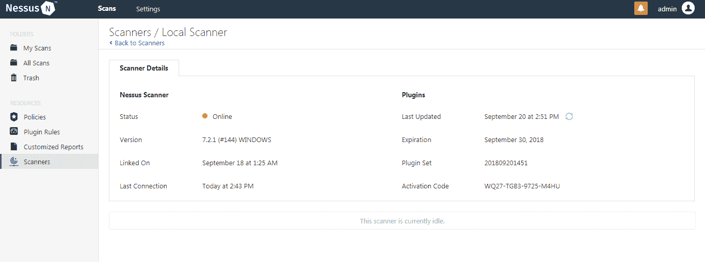
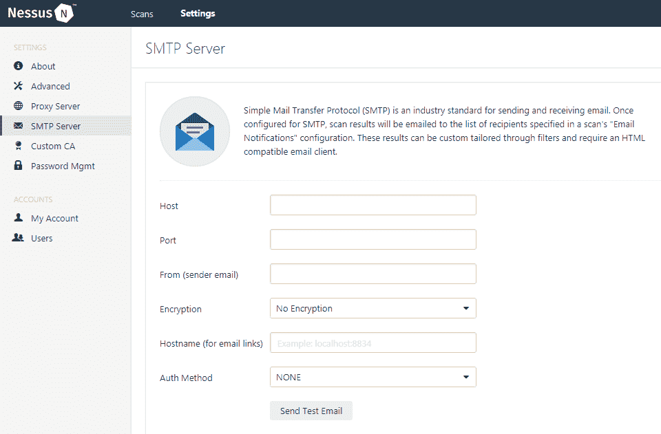
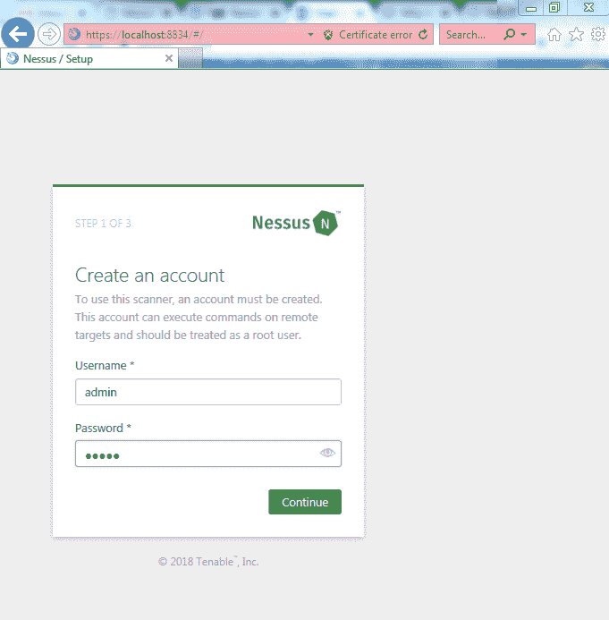
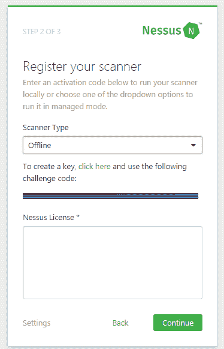
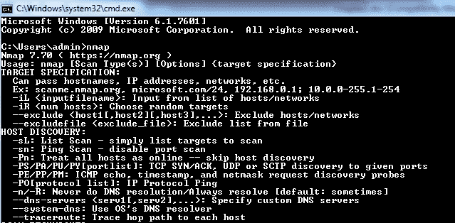
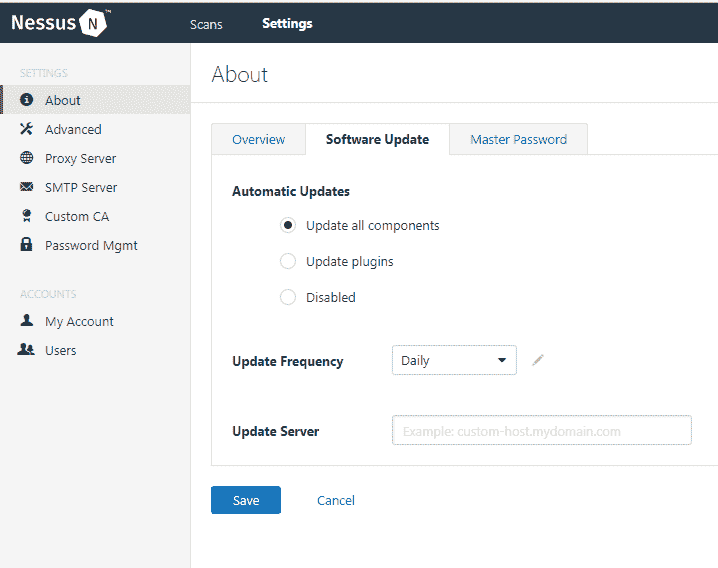

# 了解网络扫描工具

在本章中，我们将涵盖以下内容：

+   介绍 Nessus 和 Nmap

+   安装和激活 Nessus

+   下载和安装 Nmap

+   更新 Nessus

+   更新 Nmap

+   删除 Nessus

+   删除 Nmap

# 介绍 Nessus 和 Nmap

在本节中，我们将了解 Nmap 和 Nessus 中提供的各种功能。这有助于用户在使用它们之前充分了解工具及其功能。

# Nessus 的有用功能

Nessus 网页界面的默认屏幕“扫描”如下截图所示；这是您可以查看所有已安排/执行的扫描的地方。在右上方，您可以在“扫描”和“设置”页面之间切换。接下来，我们将进入扫描界面：


Nessus 默认屏幕的左窗格显示了多个选项卡，分类为文件夹和资源。文件夹基本上是服务器上扫描的不同视图。例如，选择“垃圾”会显示用户已删除的扫描。您可以通过选择“垃圾”文件夹右上方的“清除垃圾”选项来进一步清除垃圾。

资源是 Nessus 运行其扫描的基础。资源窗格中可见三个选项：

+   策略

+   插件规则

+   扫描器

# 策略

要执行 Nessus 扫描，您必须创建一个策略。策略是各种配置、方法和正在执行的扫描类型的集合。多个扫描可以使用一个策略，但每次扫描只适用一个策略。用户可以导入以前创建的策略，该策略以`.nessus`格式存储，或单击“创建新策略”。一旦用户选择创建策略，他们将看到 Nessus 中提供的各种策略模板，这些模板是基于要在主机上执行的测试用例而提供的。以下是 Nessus 提供的各种策略模板的列表：


这些模板包括执行从通用到特定攻击的扫描所需的一系列配置。在屏幕截图中显示的 21 个模板中，我们将查看一些模板，以了解策略的构成和工作方式。

我们将在第四章 *漏洞扫描*中查看策略模板的内容。

# 插件规则

插件规则允许用户隐藏或更改 Nessus 提供的风险评级；这将允许对大量主机执行扫描的分析人员配置插件，以降低已应用解决方法的风险评级。这将减少大量手动工作。


# 自定义报告

此选项允许用户通过上传和添加徽标到报告来定制或个性化特定组织或客户的报告：


# 扫描器

扫描器选项卡显示了可用于扫描的扫描器数量及其详细信息。在 Nessus Home 和专业版中无法添加扫描器，但可以在 Nessus 安全中心中添加：



单击“设置”以显示设置菜单。接下来，我们将讨论设置菜单中各种选项的详细信息。

在前面的部分中，概述选项卡提供了工具概述，例如许可信息、插件信息等；我们将在*更新 Nessus*配方中查看软件更新选项卡的使用：

+   **主密码**：Nessus 提供了一个选项，可以使用主密码对在策略中使用的所有扫描策略和凭据进行加密，以在文件级别提供额外的保护层。您可以在 Web 控制台的**设置**菜单中找到这一点：


+   **代理服务器**：代理服务器用于在不进行任何更改的情况下转发请求和响应来连接多个网络。如果您的网络需要代理服务器，您可以在 Nessus 中添加一个代理服务器，以便 Nessus 能够到达要扫描的主机。您可以在设置菜单中找到代理服务器选项，如下所示：


+   **SMTP 服务器**：发送电子邮件需要一个**简单邮件传输协议**（**SMTP**）服务器。Nessus 提供了在扫描完成后通过电子邮件通知的选项。您可以配置一个 SMTP 服务器，以便 Nessus 能够使用该邮件服务器发送通知电子邮件。SMTP 配置选项可以在设置菜单中找到，如下所示：



+   **自定义 CA**：Nessus 默认使用在其安装过程中签名的证书进行基于 Web 的访问，以便浏览器信任该证书并消除所有证书错误。Nessus 提供了保存自定义 CA 的选项。自定义 CA 选项可以在设置菜单中找到，如下所示：


+   **密码管理**：默认和弱密码是系统中最常见的漏洞之一，因此为了保护 Nessus 控制台免受未经授权的访问，我们需要配置强密码。为了确保管理员使用强密码，Nessus 提供了密码管理选项，管理员可以配置密码复杂性、会话超时、最大登录尝试次数和最小密码长度等参数。这些可以用来保护 Nessus 控制台免受密码和会话相关的攻击。密码管理选项可以在设置菜单中找到，如下所示：


# Nmap 的各种功能

使用 Nmap 执行网络扫描涉及多个阶段。这些步骤可以由 Nmap 实用程序提供的各种选项定义。用户可以根据自己的需求选择这些选项中的任何一个，以获得特定的网络扫描结果。以下是 Nmap 实用程序提供的选项：

+   主机发现

+   扫描技术

+   端口规范和扫描顺序

+   服务或版本检测

+   脚本扫描

+   OS 检测

+   时间和性能

+   规避和欺骗

+   输出

+   目标规范

# 主机发现

一个网络包括许多基于提供的子网的主机。例如，具有掩码值 27 的子网将有 32 个主机，而具有掩码值 24 的子网将有 256 个主机。在不知道哪些主机是活动的情况下对 256 个主机进行全端口扫描可能需要很长时间。为了减少 Nmap 生成和处理的流量，我们可以根据活动和非活动主机过滤网络主机。这将允许 Nmap 减少不必要的分析并更快地获得结果。

# 扫描技术

Nmap 根据要生成的数据包类型提供了各种扫描技术选项，这取决于网络中使用的各种保护机制。这些技术使用不同的标头值构造数据包，以获取 ACK 或 RST 数据包，根据这些数据包决定并显示端口的性质。如前所述，其中一些扫描类型用于规避检测并确保用户在网络中的匿名性。

# 端口规范和扫描顺序

默认情况下，如果未规定要扫描的端口范围，Nmap 将扫描最常用的前 1000 个端口，即在网络中最常开放的端口。这些扫描选项允许用户指定要扫描的端口和扫描顺序。

# 服务或版本检测

Nmap 拥有大约 2,200 个知名服务的数据库。一旦检测到端口打开，可以使用这些选项来识别正在运行的服务的确切类型和版本。Nmap 通过查询这些端口并分析收到的响应来实现这一点。

# 脚本扫描

Nmap 具有脚本引擎，这是该程序的一个特别强大的功能，它允许用户编写或使用已有的脚本来对开放端口执行特定任务。

# 操作系统检测

Nmap 的操作系统检测选项帮助用户识别远程主机使用的操作系统。这将帮助用户进一步创建针对特定目标的操作并解决未来的兼容性问题。Nmap 使用 TCP/UDP 堆栈指纹机制来识别操作系统。

# 时间和性能

Nmap 提供了多个选项，用户可以使用这些选项定义与时间相关的多个扫描参数，例如速率、超时和并行性。这将允许用户配置扫描以更快地获取结果，从而提高扫描多个主机和网络时的性能。

# 逃避和欺骗

今天有许多网络安全解决方案，如防火墙和 IDS/IPS，可以阻止 Nmap 生成的网络流量。Nmap 提供选项，如分段、诱饵扫描、欺骗和代理，以规避这些网络安全解决方案，并成功完成扫描并获取结果。

# 输出

Nmap 不仅是一个强大的扫描工具，还具有强大的报告机制。它提供多种格式的全面报告，以 XML 和文本格式显示输出。

# 目标规范

Nmap 提供了多个目标规范选项，用户可以在其中提及子网、单个 IP、IP 范围和 IP 列表进行扫描。这将允许用户扫描从主机发现中识别出的特定主机。

Nmap 的一个完整语法示例如下：

```
Nmap -sS -sV -PN -T4 -oA testsmtp -p T:25 -v -r 192.168.1.*
```

根据用户的要求，一旦提供了所需的选项和参数，用户就可以执行扫描并获取输出。我们将在下一章中介绍如何使用 Nmap 执行网络扫描的配方。

作为本章的一部分，我们将介绍如何选择 Nmap 和 Nessus 的正确软件版本，以及它们的安装和卸载。这些配方是为了帮助新的受众了解要求，以及它们在不同平台上的变化。

# 安装和激活 Nessus

Nessus 是由 Tenable Network Security 开发的漏洞扫描器。它扫描主机和子网以查找网络级和服务级漏洞。Nessus 可供非商业用户免费使用，但功能受限。它由两个主要组件组成：NessusD（Nessus 守护程序）和可以托管在同一台机器上的客户端应用程序。Nessus 守护程序负责执行扫描并将结果传递给客户端应用程序，以多种格式提供这些结果。Tenable 还开发了增量更新和检测机制，称为插件，可以定期下载和更新。它还提供已知漏洞的额外探测功能；例如，如果发现 FTP 端口打开，Nessus 将自动尝试使用`anonymous`用户登录。Nessus 具有命令行和 Web 界面，但我们将主要关注基于 GUI 的 Web 界面，因为它易于使用。

# 准备就绪

Nessus 的要求因其不同组件的存在以及可用的许可证类型和使用情况而有所不同。

以下表格描述了 Nessus 的硬件要求：

| **场景** | **最低推荐硬件** |
| --- | --- |
| Nessus 扫描最多 50,000 个主机 | **CPU**：4 x 2 GHz 核心**内存**：4 GB RAM（建议 8 GB RAM）**磁盘空间**：30 GB |
| Nessus 扫描超过 50,000 个主机 | **CPU**：8 x 2 GHz 核**内存**：8 GB RAM（建议 16 GB RAM）**磁盘空间**：30 GB（报告可能需要额外空间） |
| 具有最多 10,000 个代理的 Nessus Manager | **CPU**：4 x 2 GHz 核**内存**：16 GB RAM**磁盘空间**：30 GB（报告可能需要额外空间） |
| 具有最多 20,000 个代理的 Nessus Manager | **CPU**：8 x 2 GHz 核**内存**：64 GB RAM**磁盘空间**：30 GB（报告可能需要额外空间） |

+   Nessus 代理：这是为了消耗更少的内存而设计的，因为该进程是低优先级的，并且在需要时会让出 CPU。Nessus 代理可以安装在满足以下表中规定要求的虚拟机上：

| **硬件** | **最低要求** |
| --- | --- |
| 处理器 | 1 个双核 CPU |
| 处理器速度 | < 1 GHz |
| RAM | < 1 GB |
| 磁盘空间 | < 1 GB |
| 磁盘速度 | 15-50 IOPS |

+   虚拟机：Nessus 代理支持以下版本的 macOS、Linux 和 Windows 操作系统：

| **操作系统** | **支持的版本（Nessus 代理）** |
| --- | --- |
| Linux | Debian 7, 8 和 9 - i386Debian 7, 8 和 9 - AMD64Red Hat ES 6/CentOS 6/Oracle Linux 6（包括不可破解的企业内核） - i386Red Hat ES 6/CentOS 6/Oracle Linux 6（包括不可破解的企业内核） - x86_64Red Hat ES 7/CentOS 7/Oracle Linux 7 - x86_64Fedora 24 和 25 - x86_64Ubuntu 12.04, 12.10, 13.04, 13.10, 14.04 和 16.04 - i386Ubuntu 12.04, 12.10, 13.04, 13.10, 14.04 和 16.04 - AMD64 |
| Windows | Windows 7, 8 和 10 - i386Windows Server 2008, Server 2008 R2, Server 2012, Server 2012 R2, Server 2016, 7, 8 和 10 - x86-64 |
| macOS X | macOS X 10.8 - 10.13 |

Nessus Manager 支持以下版本的 macOS、Linux 和 Windows 操作系统：

| **操作系统** | **支持的版本（Nessus Manager）** |
| --- | --- |
| Linux | Debian 7, 8 和 9/Kali Linux 1, 2017.1 和 Rolling - i386Debian 7, 8 和 9/Kali Linux 1, 2017.1 和 Rolling - AMD64Red Hat ES 6/CentOS 6/Oracle Linux 6（包括不可破解的企业内核） - i386Red Hat ES 6/CentOS 6/Oracle Linux 6（包括不可破解的企业内核） - x86_64Red Hat ES 7/CentOS 7/Oracle Linux 7（包括不可破解的企业内核） - x86_64FreeBSD 10 和 11 - AMD64Fedora 24 和 25 - x86_64SUSE 11 和 12 Enterprise - i586SUSE 11 和 12 Enterprise - x86_64Ubuntu 12.04, 12.10, 13.04, 13.10, 14.04 和 16.04 - i386Ubuntu 12.04, 12.10, 13.04, 13.10, 14.04 和 16.04 - AMD64 |
| Windows | Windows 7, 8 和 10 - i386Windows Server 2008, Server 2008 R2, Server 2012, Server 2012 R2, Server 2016, 7, 8 和 10 - x86-64 |
| macOS X | macOS X 10.8 - 10.13 |

+   浏览器：Nessus 支持以下浏览器：

+   谷歌 Chrome（50 及以上）

+   苹果 Safari（10 及以上）

+   Mozilla Firefox（50 及以上）

+   Internet Explorer（11 及以上）

+   PDF 报告：Nessus 的`.pdf`报告生成功能需要安装最新版本的 Oracle Java 或 OpenJDK。在安装 Nessus 之前安装 Oracle Java 或 OpenJDK。

# 操作方法…

执行以下步骤：

1.  从[`www.tenable.com/downloads/nessus`](https://www.tenable.com/downloads/nessus)下载适用的 Nessus 安装文件，确保选择适用于正在使用的操作系统的正确文件。

对于 64 位 Windows 操作系统，请下载 Nessus-7.1.3-x64.msi。

1.  注册并从[`www.tenable.com/downloads/nessus`](https://www.tenable.com/downloads/nessus)获取激活代码。以下屏幕截图显示了带有 Nessus 激活代码的示例电子邮件：


1.  按照说明安装下载的`.msi`文件。

1.  Nessus 要求您在安装过程中创建管理员用户，如下所示：



1.  在此处插入从 Tenable 的电子邮件中收到的激活代码：


1.  确保系统连接到互联网，以便 Nessus 可以从其服务器自动下载插件。

# 工作原理…

一旦用户在 Windows 操作系统上下载并安装了可执行文件，就可以在本地主机的端口`8834`上通过 Web 界面访问 Nessus 软件。为了完成安装，Nessus 需要一个激活码，可以通过在 Tenable 网站上注册并提供一些详细信息来获取。一旦通过电子邮件获得密钥，您需要根据使用情况输入激活码，并单击“继续”以完成安装并下载插件。每当发现新的漏洞时，Tenable 都会创建程序和脚本来识别这些漏洞。这些脚本和程序称为插件，使用**Nessus 攻击脚本语言**（**NASL**）编写。为了确保 Nessus 扫描没有漏掉任何最近发现的漏洞，这些插件需要定期更新。典型的插件包括与漏洞相关的信息，如描述、影响、修复措施，以及一些漏洞指标，如 CVSS 和 CVE。

连接到互联网的计算机上，如果您正在使用 Nessus 浏览器界面进行安装，则插件的下载是一个自动过程。一旦您在 Nessus 上注册了许可证，您应该会看到一个插件下载屏幕。如果离线安装 Nessus，您将不得不在注册了 Nessus 许可证后从自定义生成的链接手动下载插件。根据您使用的操作系统，下载插件并将 ZIP 或 TAR 文件夹解压缩到以下目录：

+   在 Linux 中，安装到以下目录：

```
# /opt/nessus/sbin/
```

+   在 FreeBSD 中，安装到以下目录：

```
# /usr/local/nessus/sbin/
```

+   在 macOS X 中，安装到以下目录：

```
# /Library/Nessus/run/sbin/
```

+   在 Windows 中，安装到以下目录：`C:\Program Files\Tenable\Nessus`

提取软件包后，您可以使用以下命令根据所使用的操作系统安装这些插件：

+   在 Linux 中，使用以下命令：

```
# /opt/nessus/sbin/nessuscli update <tar.gz filename>
```

+   在 FreeBSD 中，使用以下命令：

```
# /usr/local/nessus/sbin/nessuscli update <tar.gz filename>
```

+   在 macOS X 中，使用以下命令：

```
# /Library/Nessus/run/sbin/nessuscli update <tar.gz filename>
```

+   在 Windows 中，使用以下命令：`C:\Program Files\Tenable\Nessus>nessuscli.exe update <tar.gz filename>`

# 还有更多…

如果连接到互联网时遇到任何问题，您可以选择在离线模式下激活，如下图所示：



为了使 Nessus 能够离线激活，您的本地浏览器上显示了一个挑战代码，Nessus 实例正在运行，或者可以使用以下命令手动显示： 

+   在 Linux 中，使用以下命令：

```
# /opt/nessus/sbin/nessuscli fetch --challenge
```

+   在 FreeBSD 中，使用以下命令：

```
# /usr/local/nessus/sbin/nessuscli fetch --challenge
```

+   在 macOS X 中，使用以下命令：

```
# /Library/Nessus/run/sbin/nessuscli fetch --challenge
```

+   在 Windows 中，使用以下命令：

```
C:\Program Files\Tenable\Nessus>nessuscli.exe fetch --challenge
```

上述命令已配置为默认安装目录。将目录更改为您计算机上安装 Nessus 的位置。

您可以将此挑战代码复制到可以访问互联网的计算机上，并在 Nessus 网站的离线模块上生成许可证，生成许可证字符串。此许可证字符串可以在计算机上使用，无论是浏览器模式还是离线模式，都可以使用以下命令：

+   在 Linux 中，使用以下命令：

```
# /opt/nessus/sbin/nessuscli fetch --register-offline /opt/nessus/etc/nessus/nessus.license
```

+   在 FreeBSD 中，使用以下命令：

```
# /usr/local/nessus/sbin/nessuscli fetch --register-offline /usr/local/nessus/etc/nessus/nessus.license
```

+   在 macOS X 中，使用以下命令：

```
# /Library/Nessus/run/sbin/nessuscli fetch --register-offline /Library/Nessus/run/etc/nessus/nessus.license
```

+   在 Windows 中，使用以下命令：

```
C:\Program Files\Tenable\Nessus>nessuscli.exe fetch --register-offline "C:\ProgramData\Tenable\Nessus\conf\nessus.license"
```

# 下载和安装 Nmap

Nmap 是一个免费的开源网络扫描和审计工具，可在[`Nmap.org/`](https://nmap.org/)上获得。该工具是网络级安全审计的最重要组成部分之一，因为它允许用户通过提供有关开放端口和运行在这些端口上的服务的数据来监视或观察主机的网络级姿态。Nmap 工具还允许使用 Nmap 脚本引擎（NSE）与这些服务进行交互并运行各种脚本。以下命令是在主机`127.0.0.1`上执行 TCP syn 全端口扫描的语法：

```
Nmap -sS -p1-65535 127.0.0.1
```

我们将在后续章节中研究 Nmap 工具的用法。

# 准备工作

Nmap 根据用户机器支持的架构和操作系统的版本和格式提供。Nmap 还有一个名为 Zenmap 的 GUI 版本，它提供更好的可见性以选择要运行的命令。它还作为操作系统的默认工具的一部分，用于利用和黑客技术，如 Kali Linux。用户可以根据其机器的配置选择 Nmap 的类型或版本；例如，我正在使用 Windows 7 64 位操作系统，因此我将选择支持 64 位 Windows 7 操作系统的最新稳定版本的可执行文件。如果您使用 64 位 Linux 或 Unix 发行版，可以在[`Nmap.org/`](https://nmap.org/)上下载 rpm 二进制包。

# 如何做…

执行以下步骤：

1.  从[`www.Nmap.org/download.html`](http://www.nmap.org/download.html)下载适用的 Nmap 版本。

1.  右键单击下载的文件，选择以管理员身份运行。这是为了确保工具在您的机器上正确安装所有权限。

1.  之后，您将看到一个开源许可协议。阅读协议并点击同意，如下图所示：


1.  选择要作为 Nmap 软件包的一部分安装的各种组件。这些实用程序提供更多功能，如数据包生成和比较。如果您觉得不需要这些额外的实用程序，可以取消选中该功能，如下图所示：


1.  选择要安装工具的位置。默认情况下，该工具建议使用`C:\Program Files (x86)\Nmap\`路径。点击下一步。

1.  安装需要 Npcap，Windows 的 Nmap 数据包嗅探库。按照说明安装 Npcap 以继续安装 Nmap 并等待安装完成。

# 工作原理…

安装完成后，打开命令提示符并输入`Nmap`。如果 Nmap 工具安装正确，它应该加载 Nmap 的使用说明，如下所示：



# 还有更多…

在 Linux 发行版上安装 Nmap 是一个不同的过程。大多数基于 Linux 的操作系统都可以使用`yum`和`apt`等软件包管理工具进行单步安装。

确保机器连接到互联网并执行以下命令：

+   在 CentOS 上，使用以下命令：

```
yum install Nmap
```

+   在 Debian 或 Ubuntu 上，使用以下命令：

```
apt-get install Nmap
```

# 更新 Nessus

Nessus 可以手动更新，也可以安排自动更新。软件更新选项可以在设置菜单中找到。这可以用于为 Nessus 软件或插件安排每日、每周或每月更新。默认情况下，Nessus 使用其云服务器下载和安装更新，但您也可以配置自定义服务器来下载这些更新。

# 准备工作

您可以在连接到互联网或离线时更新 Nessus。如果您想要一个无忧的更新或快速更新，您可以确保系统连接到互联网。

但是，要离线更新 Nessus，您必须从 Nessus 网站下载更新包。

# 如何做…

按照以下步骤：

1.  从主页导航到设置，然后选择软件更新：



1.  选择更新频率：每天、每周或每月。

1.  如果您有任何内部或外部服务器要求 Nessus 获取更新，请提供服务器详细信息。

1.  保存设置，它们将自动应用。

1.  为了手动安装更新，导航到设置，然后选择软件更新，然后选择手动软件更新，如下所示：


1.  选择更新所有组件或更新插件以立即触发更新。

1.  如果机器没有连接到互联网，您可以从 Tenable 网站下载更新包，并通过选择**上传您自己的插件存档**选项进行更新。

# 还有更多...

Nessus 有一个评估许可证，限制了您可以扫描的 IP 地址数量，还有一个完整的许可证，可以在一定时间内购买，并且没有对可以扫描的 IP 地址数量的任何限制。Nessus 的完全许可版本可在 Nessus 网站上以大约每台扫描仪 2500 美元的价格购买：

1.  选择激活码旁边的编辑选项。

1.  在显示的框中，选择正在使用的 Nessus 类型。

1.  在**激活码**框中，输入您的新激活码。

1.  选择**激活**。

完成后，Nessus 将下载所需的插件并自动安装它们。

# 更新 Nmap

更新 Nmap 最直接的方法是下载软件的最新可用版本，并手动安装软件包。

# 准备就绪

从[`nmap.org/download.html/`](https://nmap.org/download.html)下载最新的稳定版本，确保选择适用于当前操作系统的正确版本。

# 如何做…

执行以下步骤：

1.  右键单击下载的文件，然后选择以管理员身份运行。这是为了确保工具具有在您的机器上正确安装的所有权限。

1.  之后，您将看到一个开源许可协议。阅读协议并点击同意，如下面的屏幕截图所示：


1.  选择要作为 Nmap 软件包的一部分安装的各种组件。这些实用程序提供额外的功能，如数据包生成和比较。如果您不需要这些额外的实用程序，可以取消选中这些功能，如下面的屏幕截图所示：


1.  选择要安装工具的位置。工具建议的默认路径是`C:\Program Files (x86)\Nmap\`。然后点击下一步。

1.  安装需要 Npcap。这是 Nmap 的 Windows 数据包嗅探库。按照说明安装 Npcap 并继续安装 Nmap；等待安装完成。

# 移除 Nessus

删除 Nessus 软件类似于删除 Nmap。完成后，服务运行的端口将被释放，您将无法再访问 Web 界面。

# 准备就绪

删除 Nessus 的步骤因平台而异。在卸载 Nessus 之前，您可能希望通过以所需格式导出它们来备份所有策略和扫描数据；例如，NessusDB。

# 如何做…

按照以下步骤在 Windows 上卸载 Nessus：

1.  在 Windows 机器上导航到**控制面板**

1.  选择**卸载或更改程序**

1.  在安装的软件列表中找到并选择 Nessus 软件包

1.  点击**卸载**

这将从任何 Windows 机器中卸载 Nessus 软件及其数据。

# 还有更多...

在 Linux 上卸载 Nessus 的步骤如下：

为了确定要卸载的 Nessus 软件包的包名称，请使用以下命令来处理不同的平台：

+   在 Open Red Hat、CentOS、Oracle Linux、Fedora、SUSE 或 FreeBSD 中，使用以下命令：

```
# rpm -qa | grep Nessus
```

+   在 Open Debian/Kali 和 Ubuntu 中，使用以下命令：

```
# dpkg -l | grep Nessus
```

+   在 Open FreeBSD 中，使用以下命令：

```
# pkg_info | grep Nessus
```

使用从前述命令中获取的软件包信息作为相应平台的以下软件包移除命令的输入：

+   在 Open Red Hat、CentOS、Oracle Linux、Fedora 或 SUSE 中，如下所示：

```
# rpm -e <Package Name>
```

+   在 Open Debian/Kali 和 Ubuntu 中，如下所示：

```
# dpkg -r <package name>
```

+   在 Open FreeBSD 中，如下所示：

```
# pkg delete <package name>
```

使用此处提到的命令删除 Nessus 目录以删除任何其他文件：

+   在 Open Linux 中，使用以下命令：

```
# rm -rf /opt/nessus
```

+   在 Open FreeBSD 中，使用以下命令：

```
# rm -rf /usr/local/Nessus
```

如果在移除 Nessus 过程中遇到任何问题，请停止 Nessus 守护程序并尝试再次删除文件。

在 macOS 上卸载 Nessus，请执行以下步骤：

1.  导航至**系统偏好设置**并选择**Nessus**

1.  选择**锁定**选项

1.  输入用户名和密码

1.  选择**停止 Nessus**按钮

删除以下 Nessus 目录、子目录或文件：

+   `/Library/Nessus`

+   `/Library/LaunchDaemons/com.tenablesecurity.nessusd.plist`

+   `/Library/PreferencePanes/Nessus Preferences.prefPane`

+   `/Applications/Nessus`

删除这些文件将确保软件从机器上完全卸载。

# 移除 Nmap

在 Windows 和 Linux 上，卸载 Nmap 的过程非常简单。这将删除 Nmap 安装的所有依赖和库。

# 如何操作…

按照以下步骤在 Windows 上卸载 Nmap：

1.  导航至 Windows 机器的**控制面板**

1.  选择**卸载或更改程序**

1.  在已安装软件列表中找到并选择 Nmap 软件包

1.  点击**卸载**

这将从任何 Windows 机器中卸载 Nmap 软件及其数据。

# 还有更多…

在基于 Linux 的发行版中，您可以简单地删除与 Nmap 相关的所有文件夹以卸载 Nmap。如果您从下载的源安装了 Nmap，那么在相同文件夹中将存在一个卸载脚本，可以用它来卸载 Nmap。此外，如果它是安装在默认位置的，可以使用以下命令来删除它：

```
rm -f bin/Nmap bin/nmapfe bin/xnmap
rm -f man/man1/Nmap.1 man/man1/zenmap.1
rm -rf share/Nmap
./bin/uninstall_zenmap
```
