# 漏洞扫描

在本章中，我们将介绍以下方法：

+   如何管理 Nessus 策略

+   如何管理 Nessus 设置

+   如何管理 Nessus 用户帐户

+   如何选择 Nessus 策略

+   如何使用 Nessus 执行漏洞扫描

+   如何管理 Nessus 扫描

# 介绍

在本章中，我们将介绍有关如何管理 Nessus 作为工具及其各个组件的各种方法。这些方法将帮助我们详细了解安装后需要执行的步骤，以便能够配置 Nessus 以执行各种网络扫描。

# 如何管理 Nessus 策略

我们已经在第二章，*了解网络扫描工具*中详细了解了 Nessus 策略。简而言之，Nessus 扫描策略包括各种设置和内容，这些内容在执行网络漏洞扫描或合规性审计时使用。任何 Nessus 用户都可以创建此扫描，并且可以供其他用户使用。这些策略可以根据用户的需求进行复制、导入和导出。策略导出的唯一限制是无法导出特定于主机的数据，例如 Nessus 审计文件和凭据详细信息。这些策略可作为资源菜单的一部分，在用户登录 Nessus Web 控制台后的主屏幕上提供：

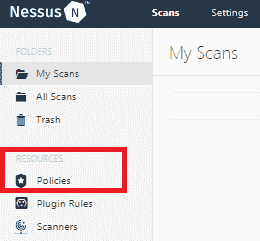

当用户尝试创建新策略时，Nessus 提供预先存在的扫描模板，可以使用这些模板通过自定义扫描模板的参数来创建新模板：

扫描模板

# 准备工作

为了执行此活动，您必须满足计算机上的以下先决条件：

+   您必须安装 Nessus

+   您必须能够访问要执行扫描的主机的网络

要安装 Nesus，可以按照第二章，*了解网络扫描工具*中提供的说明。这将允许您下载兼容版本的 Nessus 并安装所有必需的插件。要检查您的计算机是否已安装 Nessus，请打开搜索栏并搜索`Nessus Web 客户端`。一旦找到并单击，它将在默认浏览器窗口中打开：

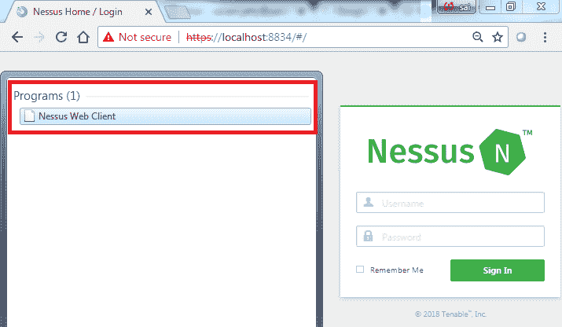

如果您确定 Nessus 已正确安装，可以直接从浏览器使用`https://localhost:8834` URL 打开 Nessus Web 客户端。如果找不到 Nessus Web 客户端，应删除并重新安装 Nessus。有关删除 Nessus 和安装说明，请参阅第二章，*了解网络扫描工具*。如果找到了 Nessus Web 客户端，但无法在浏览器窗口中打开它，则需要检查 Nessus 服务是否在 Windows 服务实用程序中运行：

此外，您可以根据需要使用服务实用程序启动和停止 Nessus。为了进一步确认安装是否成功，您可以转到安装目录，那里您将能够查看和访问 Nessus 命令行实用程序：

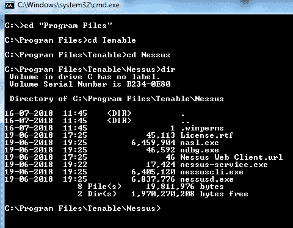

# 如何做…

执行以下步骤：

1.  打开 Nessus Web 客户端。

1.  使用在安装期间创建的用户登录 Nessus 客户端：

1.  在主屏幕左侧的资源下，单击策略选项，以查看策略屏幕：

1.  单击创建新策略，然后单击基本网络扫描：

1.  填写名称和描述的详细信息如下：

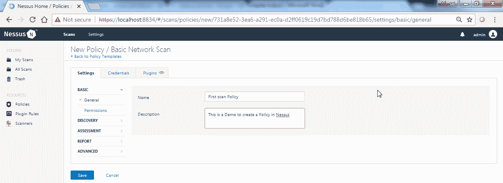

1.  将组权限设置为“可以使用”。

1.  导航到“发现”选项卡，并从下拉菜单中选择要执行的端口扫描类型：

1.  导航到“评估”选项卡，并从下拉菜单中选择要执行的评估类型：

1.  导航到“报告”选项卡，并根据您的要求选择 Nessus 的报告设置：

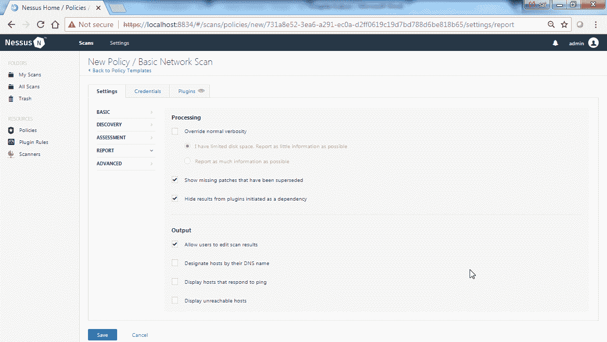

1.  导航到“高级”选项卡，并根据您的要求从下拉菜单中选择扫描设置：

1.  如果选择“自定义”，则“高级”选项卡下方将出现一个新的“常规”选项卡，以便您可以进一步自定义扫描设置：

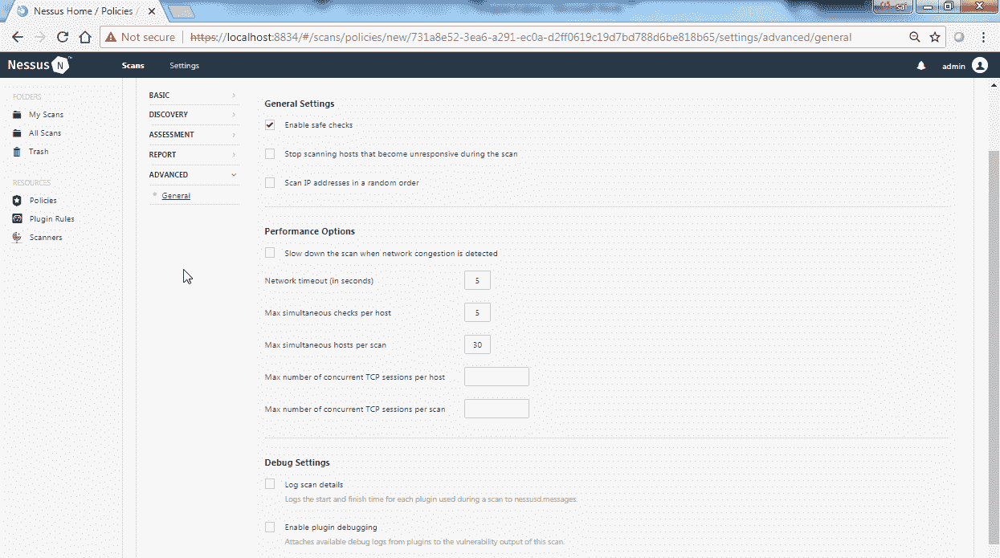

1.  保存扫描。这将带您到*步骤 2*中的策略屏幕，列出您创建的当前策略：

1.  您可以在策略名称旁边勾选复选框，并在右上角点击“更多”下拉菜单，选择“复制”、“导出”和“删除”策略：

1.  注意上一步，并单击“导出”将策略导出到您的系统上：

1.  点击“导出”。一个`.nessus`文件将被下载到您的系统上：

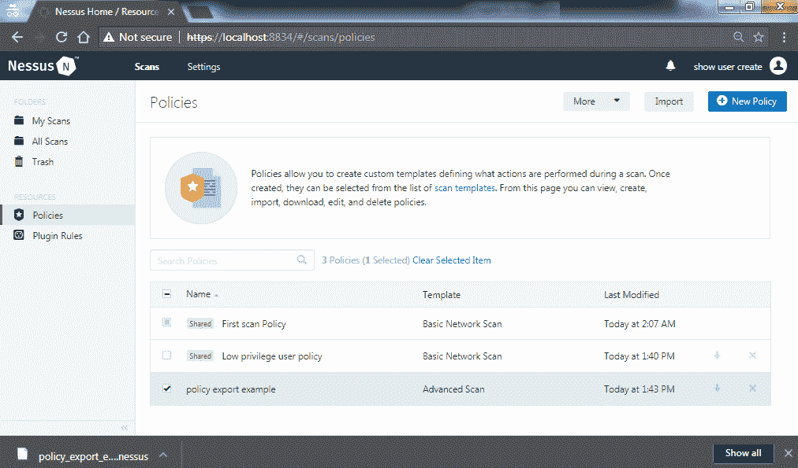

1.  要导入此内容，请单击“导入”并上传下载的`.nessus`文件：

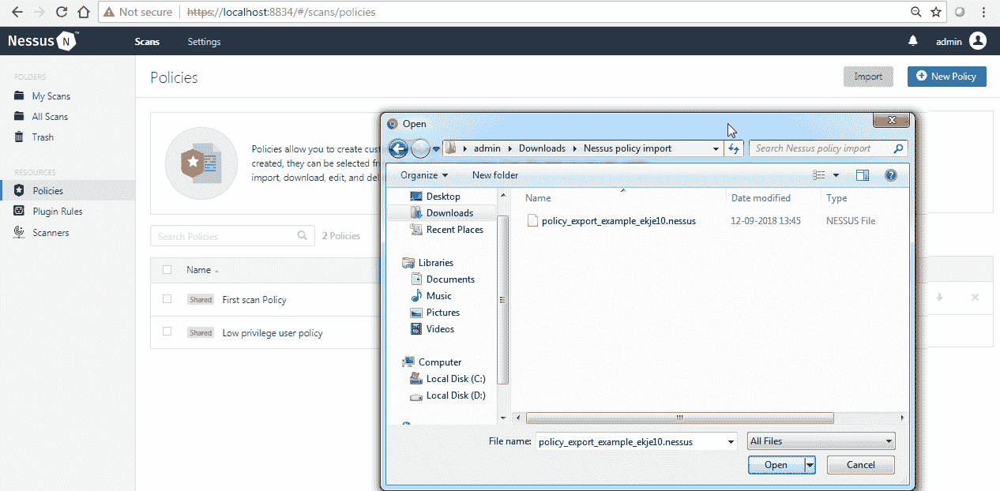

1.  已上传的策略现在在用户的策略屏幕上可见：

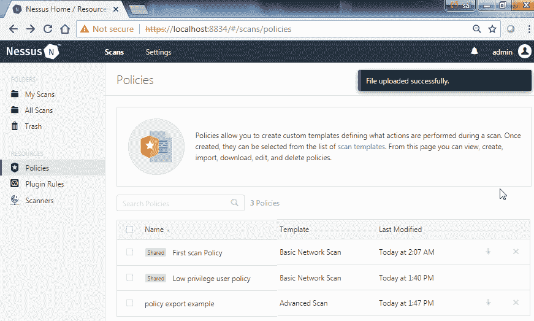

# 工作原理...

已创建的策略可用于由不同用户执行扫描。这些策略可以导入和导出到另一个 Nessus 环境中，从而避免创建新策略。

# 如何管理 Nessus 设置

我们已经在第二章中学到了关于 Nessus 设置的很多知识，*了解网络扫描工具*。简要回顾一下，在 Nessus 设置中，我们可以查看 Nessus 中提供的各种选项。Nessus 设置包括关于、高级、代理服务器、SMTP 服务器、自定义 CA 和密码管理。这些菜单还有进一步的子设置，具有特定的目的。我们将在*如何操作…*部分看看每个菜单可以配置哪些内容。

# 准备工作

这一部分与*准备工作*部分的*如何管理 Nessus 策略*食谱相同。

# 如何操作…

执行以下步骤：

1.  打开 Nessus Web 客户端。

1.  使用在安装过程中创建的用户登录 Nessus 客户端。

1.  通过在主屏幕上点击“设置”选项直接显示“关于”菜单下的选项，导航到设置屏幕：

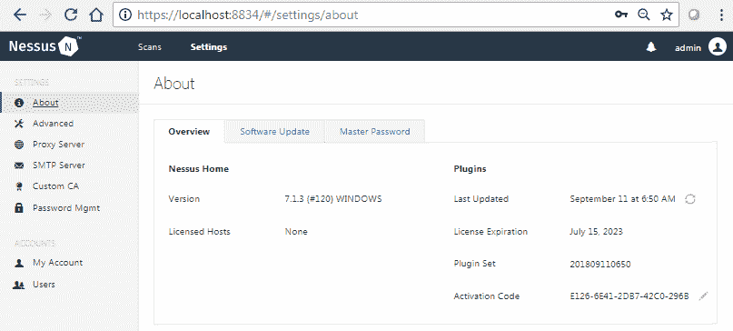

1.  通过导航到“软件更新”菜单并选择您喜欢的更新频率和类型来管理软件更新设置：

1.  通过导航到“主密码”部分设置主密码，以加密所有 Nessus 存储库、策略、结果和配置：

1.  在“设置”下的左侧窗格中导航到“高级”选项卡。这允许用户配置 45 个不同的全局设置，这些设置适用于所有配置的策略和用户，例如日志文件、插件和路径设置：

1.  在“设置”下的左侧窗格中导航到“代理服务器”选项卡。在这里，您可以为 Nessus 配置代理服务器以转发请求。当被扫描的主机和 Nessus 之间有代理服务器时使用：

1.  在左侧窗格中导航到 SETTINGS 下的 SMTP Server 选项卡。这允许用户为用户需要 Nessus 发送的任何电子邮件通知配置 SMTP 设置，例如扫描完成后：

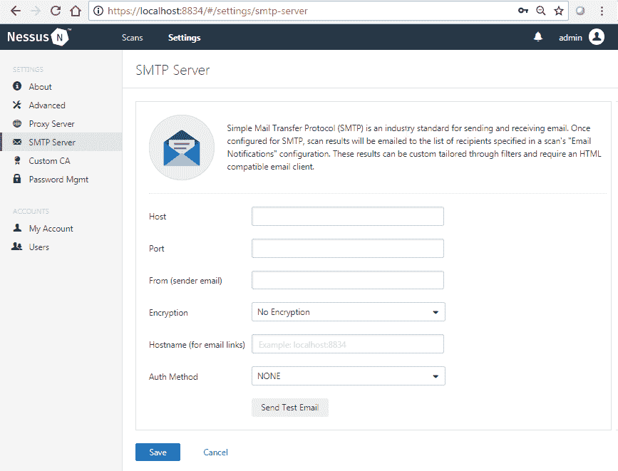

1.  在左侧窗格中导航到 SETTINGS 下的 Custom CA 选项卡。在这里，用户可以上传自定义 CA 签名，该签名将用于避免 SSL 相关发现中的误报：

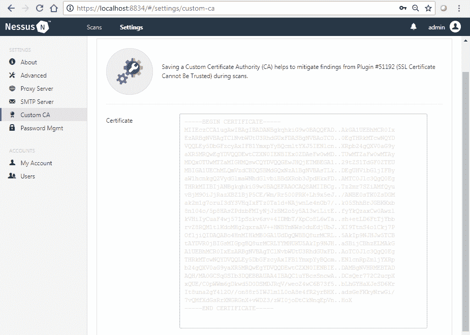

1.  在左侧窗格中导航到 SETTINGS 下的 Password Mgmt 选项卡。在这里，管理员可以配置所有用户和组应遵循的密码策略：

# 它是如何工作的...

这些是为所有用户配置的全局设置，并允许管理员管理所有用户的 Nessus 控制台。这些设置对于一些功能的功能也至关重要，例如电子邮件通知和代理服务器配置。

# 如何管理 Nessus 用户帐户

Nessus 是一个多用户环境，其中一个管理员用户可以创建多个用户帐户并配置全局设置，并允许他们配置本地策略设置。为了能够使用用户管理，Nessus 提供了两个菜单选项：My Account 和 Users。 My Account 用于管理您自己的帐户，而 Users 选项卡用于管理员管理/创建/删除用户。在本食谱中，我们将看到这些设置的各个组件以及如何使用这些组件来管理 Nessus 用户。

# 准备工作

此部分与*如何管理 Nessus 策略*食谱中的*准备工作*部分相同。

# 如何做…

执行以下步骤：

1.  打开 Nessus Web 客户端。

1.  使用在安装期间创建的用户登录 Nessus 客户端。

1.  通过单击主屏幕下的 ACCOUNTS 部分导航到我的帐户屏幕，该部分有两个子选项，帐户设置和 API 密钥：

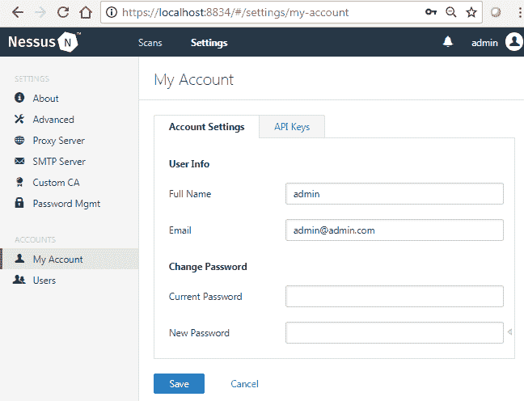

此页面上的设置可用于更改管理员用户的密码，并设置可由电子邮件通知功能使用的电子邮件 ID，并保存设置。

1.  通过单击 Account Settings 旁边的 API Keys 选项卡导航到 API Keys 选项卡。在这里，您可以配置 API 密钥以与 Nessus rest API 进行身份验证。您可以通过单击 Generate 按钮创建新的 API 密钥，如下所示：

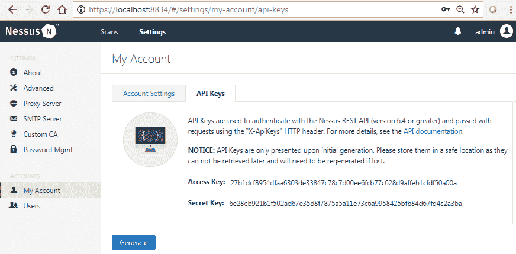

确保将这些密钥存储在私人文件夹中，并应用所有与密钥管理相关的安全最佳实践。

1.  通过单击主屏幕下的 ACCOUNTS 部分导航到用户屏幕。这将显示当前在 Nessus 中存在的用户：

1.  单击右上角的 New User 创建新用户并填写详细信息：

在上面的屏幕截图中，您可以观察到管理员可以将用户角色分配为标准或系统管理员。让我们分配标准角色并检查用户权限之间的差异：

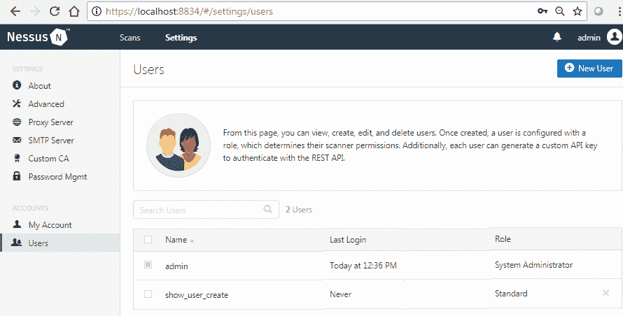

已创建了一个名为`show_user_create`的新用户，具有标准权限。您可以清楚地看到用户权限之间的差异，如下图所示。在这里，标准用户没有用户创建和帐户管理权限。

# 它是如何工作的...

用户管理允许管理员创建新用户并管理其自己的帐户。这允许执行各种扫描的分离，而不是必须使用一个单一帐户执行所有扫描。这是因为 Nessus 还允许同时登录。具有不同用户扫描的一个帐户使用户难以在给定时间点识别其扫描，尽管它们可以移动到不同的文件夹中。

# 如何选择 Nessus 扫描模板和策略

Nessus 允许用户将其扫描定制到最低程度，甚至允许他们过滤要使用的插件，并禁用不使用的插件。每次扫描都有其独特之处。例如，如果用户想要执行凭证扫描，他/她不能使用主机发现扫描模板来创建新策略。为了执行凭证扫描，用户必须选择基本网络扫描或具有用户输入凭据以对要扫描的机器进行身份验证的高级扫描。因此，在创建策略之前选择适当的扫描模板非常重要，并且在创建不同策略后选择适当的策略也很重要。第二个选项是选择先前创建的模板或导入现有模板，该模板可用于执行扫描。

用户还可以通过点击新扫描并选择现有模板来即时创建策略。这种方法的唯一缺点是您无法保存使用自定义设置的策略或扫描模板。您将不得不创建一个类似的新策略或使用相同的主机重新扫描，这将创建扫描历史。这会在重新访问扫描结果时产生复杂性。在本教程中，我们将研究免费版本中可用的扫描模板和用户可以创建的策略。

# 准备工作

此部分与“准备工作”部分相同，即“如何管理 Nessus 策略”教程。

# 如何做…

执行以下步骤：

1.  打开 Nessus Web 客户端。

1.  使用在安装期间创建的用户登录 Nessus 客户端。

1.  在主屏幕的资源部分下导航到策略选项卡。这将列出所有用户创建的预设策略（只配置为与所有人共享）：

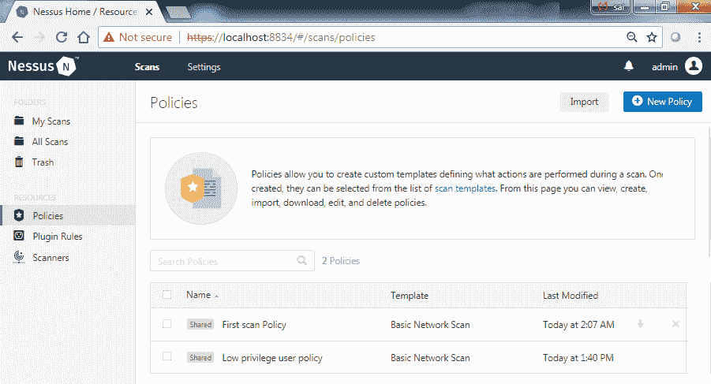

1.  您可以从现有策略中选择，也可以导入策略。

1.  如果没有现有的策略满足您的要求，您可以创建一个新策略：

+   +   如果用户选择高级扫描，他们可以配置策略中的每个参数，从而定义策略的性质以及是否应该是网络/网络应用程序/恶意软件扫描。评估菜单使其与其他扫描模板不同：

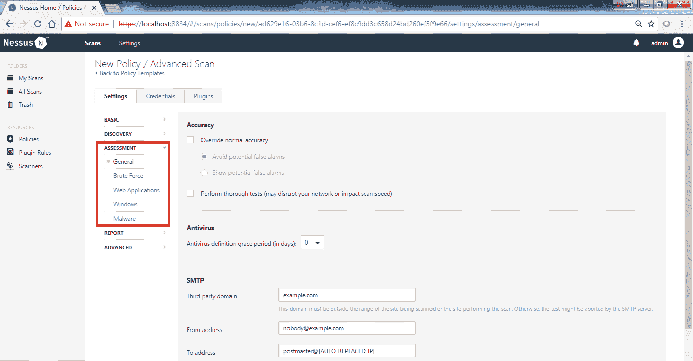

除了高级扫描之外，没有其他扫描模板可以配置插件。

+   +   Badlock 发现模板允许用户检查远程 Windows 主机是否容易受到 Samba Badlock 漏洞的影响：

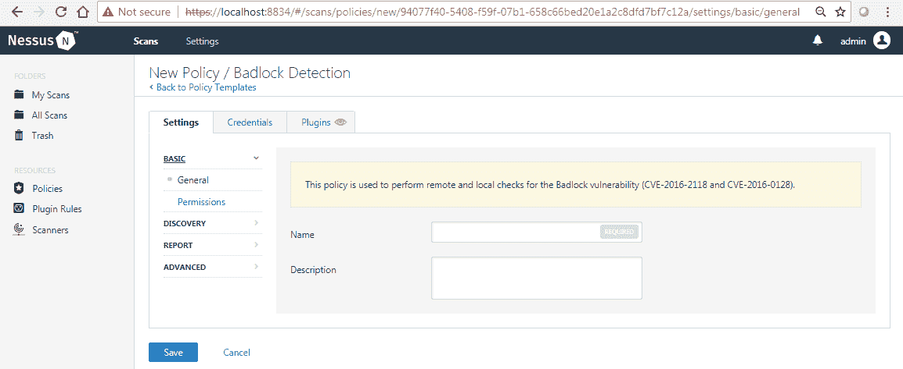

+   +   基本网络扫描模板用于执行网络级端口扫描，并识别远程主机的服务级漏洞，无论是否具有凭据。

+   凭证补丁审核扫描可用于检查远程主机的补丁级别。

+   Drown 检测模板可用于检测远程主机是否容易受到 Drown 攻击的影响：

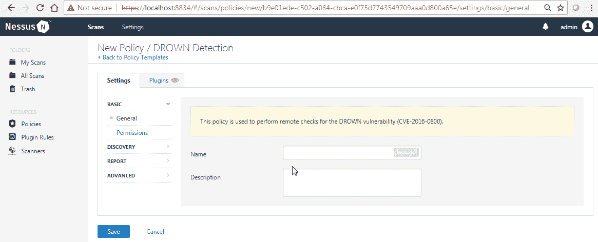

+   +   主机发现模板用于从用户提供的大范围或 IP 地址列表中识别活动主机。

+   Intel AMT 安全绕过扫描模板用于识别远程主机是否容易受到 Intel AMT 安全绕过的影响：

+   +   内部 PCI 网络扫描模板用于对远程主机执行 ASV 扫描，以查明主机配置是否符合 PCI 标准。

+   恶意软件扫描模板用于在 Windows 和 Unix 系统上执行恶意软件检测扫描。在提供凭据时效果更好。

+   策略合规性审核模板可用于对上传或现有的 Nessus 审核文件执行基线配置审核。我们将在未来的章节中看到这个教程。

+   Shadow Brokers 扫描模板用于检查远程主机是否容易受到 Shadow Broker 泄露中描述的攻击：

+   +   Spectre、Meltdown 和 WannaCry 勒索软件模板用于验证远程主机是否容易受到相应攻击。

+   Web 应用程序模板用于通过提供远程 HTTP 身份验证详细信息，执行托管在远程主机上的 Web 应用程序扫描。

1.  选择特定模板后，创建并保存策略，如“如何管理 Nessus 策略”中所示。

1.  创建策略后，您可以在“新扫描”任务的策略屏幕下的用户创建的策略部分中选择进行扫描。

1.  在创建新的扫描时，您也可以在创建新的扫描时选择模板并填写详细信息。

# 工作原理…

为了正确执行扫描，选择适当的策略同样重要。这将帮助用户获得正确的结果，并在确认和报告漏洞时节省大量时间。例如，如果用户想要了解开放端口，而他/她进行高级扫描，他/她将获得配置审核、补丁审核和许多不必要的插件的结果。相反，如果用户选择了基本网络扫描，他/她将只会找到开放端口和影响这些主机上运行的服务的漏洞列表。

# 如何使用 Nessus 执行漏洞扫描

通过遵循前面的步骤，用户应该能够理解策略的创建和选择。一旦确定了策略，用户所需做的就是确定要扫描的主机，选择策略，然后单击“扫描”。对于单个主机的非凭证扫描，Nessus 的一般扫描时间将需要几分钟。随着主机和端口数量的增加，扫描所需的时间也会增加。

在执行 Nessus 扫描之前，通常建议通知利益相关者，因为这样可以在发生攻击时进行调查，也可以通知网络管理员网络带宽利用率是否比平时高。

# 准备工作

这一部分与“准备工作”部分相同，该部分也需要用户学习本章中的先前内容。

# 如何操作…

执行以下步骤：

1.  打开 Nessus Web 客户端。

1.  使用在安装过程中创建的用户登录 Nessus 客户端。

1.  单击“创建新的扫描”。

1.  选择“基本网络扫描”模板，并填写扫描所需的详细信息，如名称、描述、用于扫描的远程主机，并且对于非凭证扫描，将凭证留空：

您可以逐行输入要扫描的主机，也可以用逗号分隔。您还可以上传要扫描的主机列表：

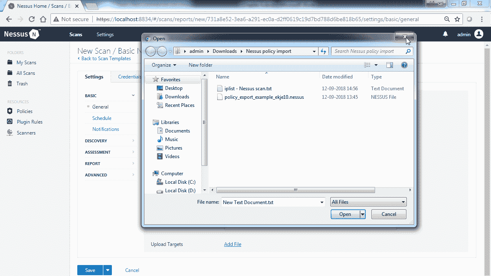

您还可以通过在“计划”菜单中启用配置选项来安排将来的时间和日期进行扫描：

1.  启动扫描：

1.  完成扫描后，打开扫描以查看结果：

此外，要查看漏洞的名称，可以单击条或“漏洞”选项卡：

1.  选择“基本网络扫描”模板，并填写扫描所需的详细信息，如名称、描述、用于扫描的远程主机，以及用于凭证扫描的凭证：

我们将输入基于密码的 SSH 认证的凭据，因为主机是 Linux 平台。Nessus 还支持基于 Windows 的认证：

1.  启动扫描：

1.  扫描完成后，打开扫描以查看结果：

此外，要查看漏洞的名称，您可以单击条形图或“漏洞”选项卡：

Nessus 还为 Nessus 应提到的特定补救措施提供单独的选项卡。您还可以查看扫描历史记录：

1.  如果扫描未按照您的要求执行，您不需要重新执行整个扫描。相反，您可以使用扫描结果页面右上角的“配置”选项来重新配置扫描设置并启动新的扫描：

1.  这将创建使用相同模板执行的扫描的历史记录。您可以单击历史记录中要查看结果的相应扫描，从而获取扫描结果：

同样，您可以通过在新扫描屏幕上选择“用户定义”模板来使用用户定义的策略执行扫描：

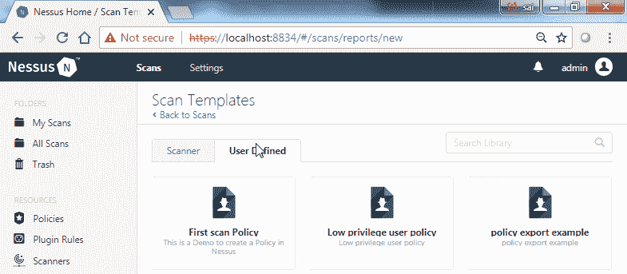

您可以通过从下拉菜单中选择相应的格式，将执行的扫描报告导出为 Nessus 中可用的不同格式。我们将在接下来的章节中进一步了解报告。

# 它是如何工作的…

Nessus 扫描有各种选项，如有凭证、无凭证、合规审计和 ASV 扫描。通过执行这些自动化扫描，简单的网络工程师将能够确定组织的 IT 基础设施的安全状况。

# 如何管理 Nessus 扫描

执行完毕后，Nessus 扫描可以进一步分隔到文件夹中，以避免不同的扫描被聚集在一起。这也使审计人员可以轻松访问结果。用户可以在 Nessus 上创建/删除/移动/复制扫描。在本食谱中，我们将看看用户可以在已完成的 Nessus 扫描上执行的各种操作。

# 准备就绪

这一部分与“如何管理 Nessus 策略”食谱中的“准备就绪”部分相同。本食谱还要求用户已经学习并完成了本章中的先前食谱。

# 如何做…

执行以下步骤：

1.  打开 Nessus Web 客户端。

1.  使用在安装过程中创建的用户登录 Nessus 客户端。

1.  您可以通过在主屏幕右上角使用“新建文件夹”选项来创建新文件夹：

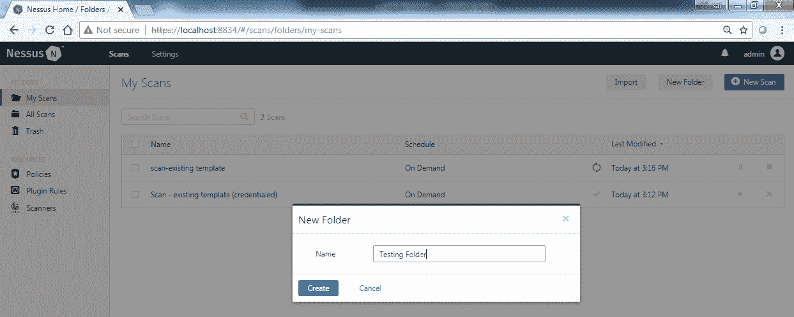

1.  新文件夹创建后，用户可以进入文件夹并创建新的扫描，以便结果显示在该文件夹中，不会出现在主屏幕上：

1.  您还可以通过选择扫描并单击 Nessus 主屏幕右上角的“移至文件夹”选项，将现有的已完成扫描复制或移动到创建的文件夹中：

这将在文件夹中创建扫描的副本，并将主扫描报告保留在主屏幕上：

1.  扫描在“测试文件夹”中创建的副本：

将扫描移至“测试文件夹”将从主屏幕中删除扫描，并将原始扫描移至文件夹中：

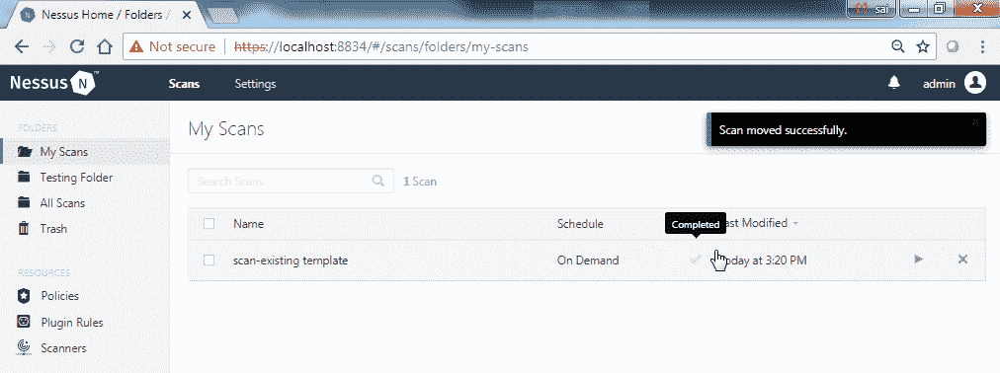

现在，您可以删除移至“测试文件夹”的扫描：

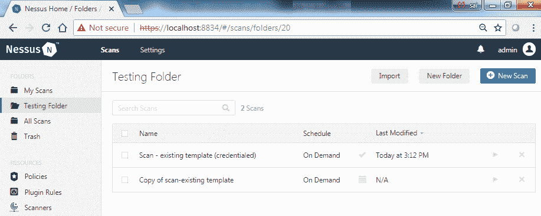

1.  您还可以通过选择特定的扫描并将其移至垃圾箱来删除扫描：

# 它是如何工作的…

当默认的 Nessus 文件夹中有大量扫描结果时，对扫描结果进行排序可能会变得乏味。相反，前面的选项将帮助用户对 Nessus 扫描进行分类，并维护文件夹，以便他们可以随时访问结果。
