# 配置审计

在本章中，我们将涵盖以下内容：

+   介绍合规性扫描

+   选择合规性扫描策略

+   介绍配置审计

+   执行操作系统审计

+   执行数据库审计

+   执行 Web 应用程序扫描

# 介绍合规性扫描

在本章中，我们将介绍有关 Nessus 的各种用途的重要性，例如进行认证扫描和执行策略合规性审计，如操作系统审计、数据库审计和应用程序审计。这是网络安全白盒评估的重要部分，因为这使内部管理员或审计员能够了解组织中系统的安全状况。

# 选择合规性扫描策略

整个合规性扫描或审计与典型的脆弱性扫描不同；它完全依赖于插件和 Nessus 审计文件。我们已经介绍了如何在第二章中下载和更新插件的基础知识，*了解网络扫描工具*。现在我们将进一步揭示有关插件和 Nessus 审计文件的详细信息。在这个示例中，我们将看看如何从 Nessus 预装的一组策略中选择正确的基线策略，以执行 Linux 主机的配置审计。

# 插件

每个插件都包含用于检查软件、服务和操作系统的特定版本或多个版本的特定脆弱性的语法。一组用于类似操作系统/服务/软件的插件被分组为插件系列，如下所示：

这些插件系列扩展为不同的插件，每个插件执行特定的检查。用户无法手动添加插件；他们只能在 Tenable 提供时下载或更新新的或缺失的插件。每个插件都有一组参数，以帮助用户了解插件。这些参数将在下一节中更详细地讨论。

# 简介

该部分包括有关脆弱性的简要信息，并充当脆弱性的标题。

# 描述

本节提供了有关确切组件和版本（如果可用）的脆弱性的更深入了解，以及有关脆弱性的详细信息。这使用户能够了解服务或软件的哪个部分是脆弱的，以及整体的脆弱性。

# 解决方案

该部分为用户提供了有关补救措施的详细信息，例如需要执行的配置更改或代码更改，或者提供了一个由 Tenable 或其他可信来源的文章的链接，介绍如何减轻脆弱性。

# 插件信息

该部分包括区分该插件与其他插件的参数。参数包括 ID、版本、类型、发布日期和修改日期。这些参数充当插件的元数据。

# 风险信息

该部分提供了有关脆弱性严重程度的信息，以及**通用漏洞评分系统**（**CVSS**）数据，这是全球公认的评分脆弱性的标准之一。严重性评级从关键到信息；CVSS 评分在 1-10 的范围内。

# 脆弱性信息

本节提供了有关插件适用的平台的详细信息，使用**通用平台枚举**（**CPE**）索引，该索引目前由**国家漏洞数据库**（**NVD**）维护。此外，它还提供了有关脆弱性的可利用性的信息，使用可利用性参数，如可用的利用和利用的便利性。它还包括插件的发布日期。

# 参考信息

本节包括有关由各种已知机构发送给插件的漏洞的参考 ID 的信息，例如 NVD 和 Secunia。这些参考包括 EDB-ID、BID、Secunia 和 CVE-ID。

每个插件、插件系列甚至所有插件都可以根据用户的要求启用和禁用，从而允许用户减少扫描时间并仅使用必要的插件执行扫描。以下截图显示了一个单个插件被禁用：

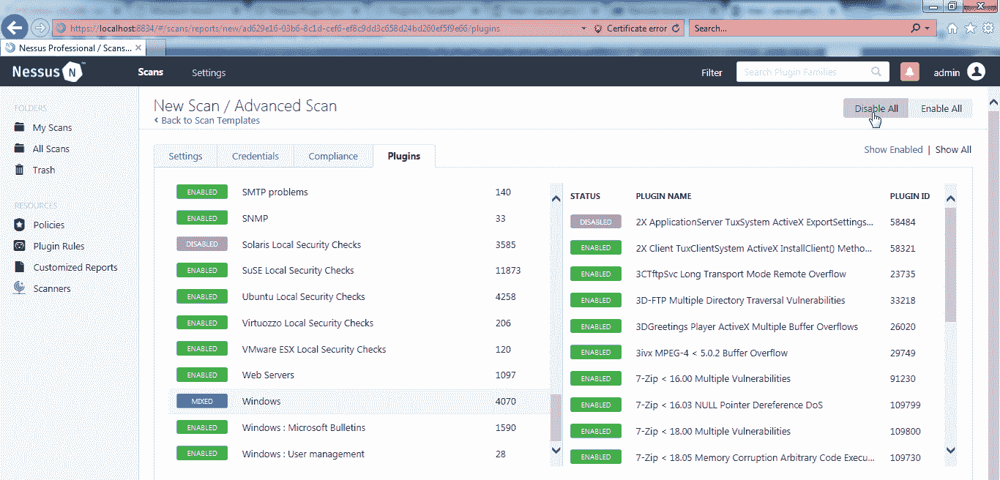

以下截图显示了一个完整的插件系列被禁用：

以下截图显示了使用屏幕右上角的“禁用所有”按钮禁用了所有插件：

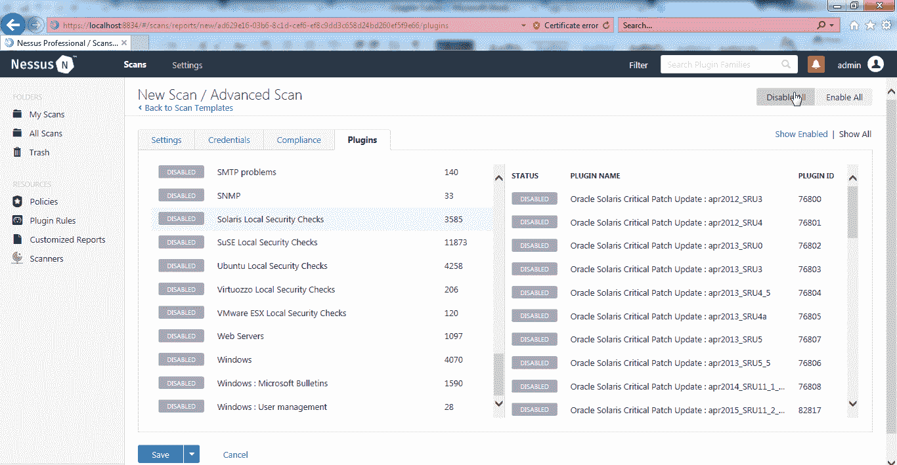

执行合规性扫描所需的插件的非常重要的组件是策略合规性插件。这些插件将与提供的审计文件一起使用，以识别操作系统级、服务级和配置级的漏洞。例如，如果您想对 Windows 执行合规性扫描，可以禁用所有其余插件，仅启用 Windows 合规性检查，如下所示：

# 合规标准

不同领域有许多必须遵循的标准，组织必须符合这些标准，以执行某些业务操作或确保其信息的安全。例如，大多数支付网关或任何与支付相关的功能都必须根据 PCI 标准进行测试，才能被认为是安全的。

以下是市场上一些标准，相关组织应该符合这些标准：

+   ETSI **网络安全技术委员会**（**TC CYBER**）

+   ISO/IEC 27001 和 27002

+   CISQ

+   DoCRA

+   NERC

+   NIST

+   ISO 15408

+   RFC 2196

+   ANSI/ISA 62443（前身为 ISA-99）

+   **ISA 安全合规性研究所**（**ISCI**）符合评估计划

+   ISCI 认证产品

+   ISO 17065 和全球认证

+   化学、石油和天然气行业

+   IEC 62443

+   IEC 62443 认证计划

+   IASME

+   银行监管机构

审计员创建一个清单，以识别与行业标准基线的差距，从而使组织能够填补差距以达到合规并获得认证。Nessus 中的合规模块以类似的方式工作。它用于识别配置差距、数据泄漏和对各种基准的合规性。

Nessus 合规模块提供默认的审计文件，以检查操作系统、网络设备、软件和服务的合规性。Nessus 预装了用于**互联网安全中心**（**CIS**）、**健康保险可移植性和责任法案**（**HIPAA**）和**Tenable 网络安全**（**TNS**）的审计文件。它还允许用户使用**Nessus 攻击脚本语言**（**NASL**）编写自定义审计文件。我们将在第七章中看到这方面的定制和优化，*了解 Nessus 和 Nmap 的定制和优化*。

# 准备就绪

为了执行这项活动，您必须满足计算机上的以下先决条件：

+   安装 Nessus

+   获取对要执行扫描的主机的网络访问

为了安装 Nesus，您可以按照第二章中提供的说明，*了解网络扫描工具*。这将允许您下载兼容版本的 Nessus 并安装所有必需的插件。为了检查您的计算机是否已经安装了 Nessus，请打开搜索栏并搜索 Nessus Web 客户端。一旦找到并点击，它将在默认浏览器窗口中打开：

如果您确定 Nessus 已正确安装，可以直接在浏览器中使用`https://localhost:8834` URL 打开 Nessus Web 客户端。如果找不到 Nessus Web 客户端，您应该删除并重新安装 Nessus。有关删除 Nessus 和安装说明，请参阅第二章，*了解网络扫描工具*。如果找到了 Nessus Web 客户端，但无法在浏览器窗口中打开它，您需要检查 Windows 服务实用程序中是否正在运行 Nessus 服务，如下所示：

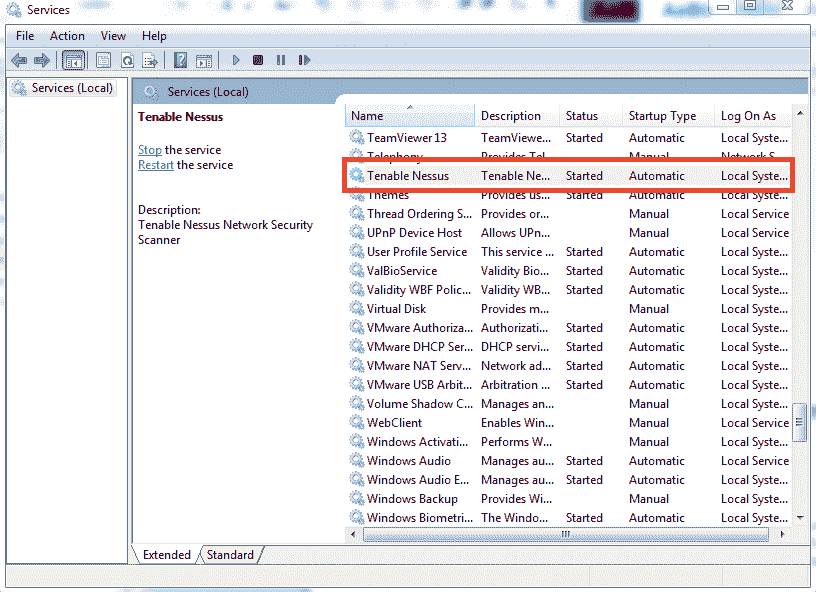

您还可以使用服务实用程序根据需要启动和停止 Nessus。为了进一步确认安装，您可以导航到安装目录以查看和访问 Nessus 命令行实用程序：

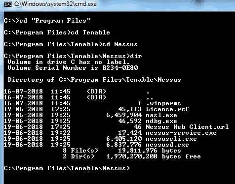

建议始终具有管理员或根级凭据，以便为扫描仪提供对所有系统文件的访问权限。这将允许扫描仪执行更深入的扫描，并生成比非凭证扫描更好的结果。策略合规模块仅在 Nessus 的付费版本（如 Nessus 专业版或 Nessus 管理器）中可用。对于这些版本，您将需要从 Tenable 购买激活密钥，并在设置页面中更新，如下所示：

单击编辑按钮打开窗口并输入从 Tenable 购买的新激活码：

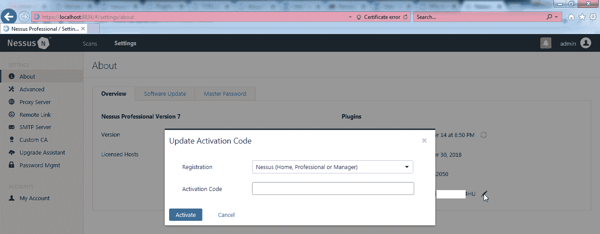

为了测试扫描，我们需要安装一个虚拟机。为了运行虚拟机，我建议使用可以从[`www.vmware.com/products/workstation-pro/workstation-pro-evaluation.html`](https://www.vmware.com/products/workstation-pro/workstation-pro-evaluation.html)下载并安装的 VMware。

对于测试系统，读者可以从[`information.rapid7.com/download-metasploitable-2017.html`](https://information.rapid7.com/download-metasploitable-2017.html)下载 Metasploitable（Rapid 7 提供的一个易受攻击的虚拟机）。按照以下步骤打开 Metasploitable。这提供了各种组件，包括操作系统、数据库和易受攻击的应用程序，这将帮助我们测试当前章节中的方法：

1.  解压下载的 Metasploitable 软件包：

1.  使用安装的 VMware Workstation 或 VMware Player 打开`.vmx`文件：

1.  使用`msfadmin`/`msfadmin`作为用户名和密码登录：

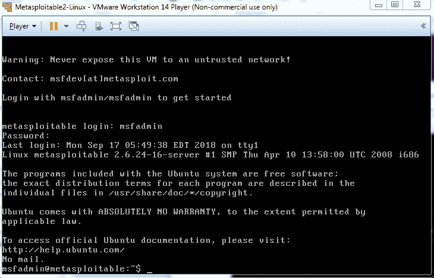

# 如何操作…

执行以下步骤：

1.  打开 Nessus Web 客户端。

1.  使用安装期间创建的用户信息登录 Nessus Web 客户端。

1.  单击策略选项卡并选择创建新策略。

1.  选择高级扫描并填写所需的详细信息：

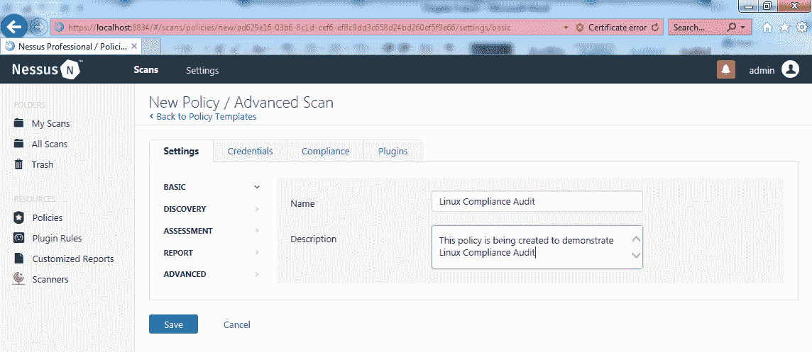

1.  导航到合规选项卡并搜索 Nessus 中可用的 Linux 基准：

这显示了不同版本 Ubuntu 的各种基准。但是为了选择适当的配置文件，我们首先必须确定测试机上运行的 Ubuntu 版本。

1.  在测试机上使用`lsb_release -a`命令显示正在运行的 Ubuntu 版本：

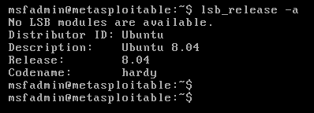

很明显，远程测试机正在运行 Ubuntu 8.04，因此我们必须选择可用审核文件中的最低版本以获得近似结果。

1.  选择 Ubuntu 12.04 的 CIS 基准文件，因为这是可用的最低版本：

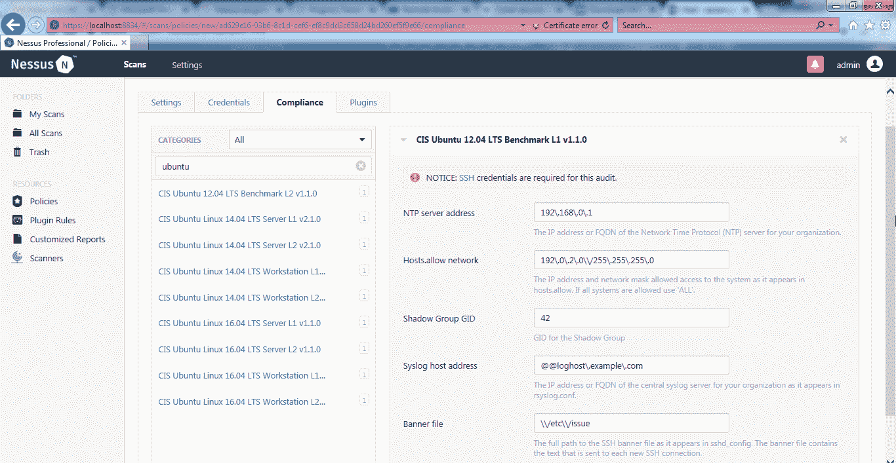

如果有特定的服务器/位置需要配置，可以选择更改可用的参数，例如 NTP 服务器地址、Hosts.allow 网络、Shadow Group ID、Syslog 主机地址和 Banner 文件位置。此外，如前面的屏幕截图所示，还必须输入远程 Ubuntu 主机的 SSH 凭据。

# 它是如何工作的...

选择适当的 Nessus 文件对于执行任何合规性扫描非常重要，因为 NASL 中的底层语法是根据所选择的操作系统定制的每个审计文件。Windows 审计文件在 Linux 上不起作用，反之亦然。为了确保选择了正确的策略，建议始终检查操作系统版本到最后一个小数点，并选择最接近的可用小数点的策略。

# 引入配置审计

配置审计是一种信息安全程序，您在其中准备一个基线配置，然后将其与当前配置进行比较，以执行差距分析，然后努力关闭这些差距，尽可能接近基线配置。关闭这些差距并实现最大加固状态的过程称为风险或漏洞缓解。

大多数公司和组织依赖强大的配置来确保系统的安全性。一个经过良好加固和修补的系统对于黑客来说是一场噩梦。随着许多公司选择将他们的业务迁移到云上，配置在安全方面的作用比以往任何时候都更加重要。网络设备的简单疏忽，允许默认用户登录，将帮助黑客在几分钟内获得对整个网络的访问权限。

常规应用程序有两个主要组件：前端和后端。前端是最终用户访问应用程序的可见资源。任何对最终用户不可见或不可访问的内容可以被视为后端。这包括 Web 服务器、应用服务器、数据库服务器、路由器、防火墙和入侵预防和检测系统。所有这些设备可能在物理上是不同的，或者由单个服务器集群处理。所有这些都是可以安装在任何物理服务器上的软件；也就是说，Apache Web 服务器可以安装在带有 Windows 操作系统的普通计算机上。一个简单的 XAMPP 软件包安装了一个 Web/应用服务器、一个数据库和一个应用框架。所有这些不同的组件都带有不同的配置——在应用程序架构的任何层级上的简单配置错误都可能危及整个系统的安全性：

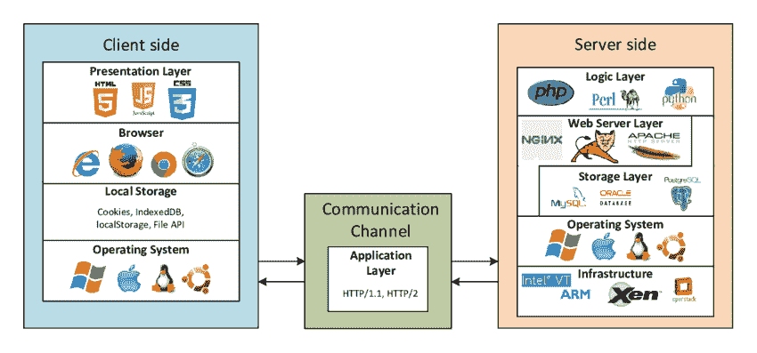

配置审计将确保任何组织的网络安全结构得到加强。对基础设施中网络设备和服务的配置更改进行持续监控也有助于确保设备和服务器的安全配置。以下是一些可以采取的步骤，以确保服务器的严格加固：

1.  检测配置中的任何动态更改

1.  应对新的或更改的配置进行配置审计

1.  严格审查设备和服务器日志

1.  应对网络的端到端进行审计，从 Web 应用程序到数据库

在配置审计期间可以执行四种主要类型的审计，如下节所述。

# 数据库审计

作为数据库审计的一部分，建议对数据库配置、模式、用户、权限和结构进行审计。可以使用各自制造商制定的安全配置指南创建基线，并分析配置中存在的差距。以下是一些示例数据库配置检查：

+   认证方法

+   撤销公共角色的不必要权限和角色

+   限制运行时设施的权限

+   确保在`tnsnames.ora`文件的`ADDRESS`参数中指定 TCP 作为`PROTOCOL`

# 网络设备审计

作为网络配置审计的一部分，建议对防火墙配置、防火墙规则库、路由器配置、Web 应用程序防火墙签名和电子邮件客户端配置进行审计。这些是任何网络中的基本组件，因为防火墙中的一个故障规则可能会将整个网络暴露给互联网。以下是要在网络设备上执行的一些检查：

+   认证方法

+   访问控制列表审查

+   通信安全

# 操作系统审计

作为操作系统审计的一部分，始终建议审计访问控制、安全设置、错误报告、密码策略和文件夹权限。这些检查将在同一类别中，或多或少，除了实际获取和审计操作系统的方法。以下是要执行的一些操作系统检查：

+   认证方法

+   密码策略

+   分区和数据隔离

+   公共股份

# 应用程序审计

应用程序审计是配置和合规审计中要执行的主要组件之一。与仅检查配置使用不同，始终建议搜索应用程序中由于构建不良的模块和服务而导致的安全漏洞；例如，允许用户直接将用户输入到 SQL 查询中而没有任何消毒的应用程序模块。这可能允许具有 SQL 基本知识的攻击者构建查询并在没有直接访问数据库的情况下转储整个数据库。每个人都理解端到端安全的重要性非常重要。

以下是 OWASP 列出的前 10 个最严重的 Web 应用程序安全风险：

+   注入

+   破损的认证

+   敏感数据暴露

+   **XML 外部实体**（**XXE**）

+   破损的访问控制

+   安全配置错误

+   **跨站脚本**（**XSS**）

+   不安全的反序列化

+   使用已知漏洞的组件

+   日志记录和监控不足

# 执行操作系统审计

在先前的食谱中，我们已经对配置审计的需求以及它们对更安全网络的贡献有了很多了解。在这个食谱中，我们将看看如何使用 Nessus 的合规扫描功能来执行操作系统的配置审计。

# 准备就绪

这个食谱的*准备就绪*部分与*选择合规扫描策略*部分的*准备就绪*部分相同。这个食谱还要求您已经学习并练习了本章中的先前食谱。

# 如何做…

执行以下步骤：

1.  打开 Nessus Web 客户端。

1.  使用在安装期间创建的用户详细信息登录 Nessus Web 客户端。

1.  按照*选择合规扫描策略*食谱中的步骤。

1.  导航到凭据选项卡，并选择要输入的 SSH 凭据，因为这是一个 Ubuntu 测试系统。选择基于密码的身份验证，并填写用户名和密码（不安全！）字段，如下所示：

！

如果在任何 Linux 系统中禁用了远程根登录，您可以以低特权用户登录并提升为根特权，因为 Nessus 提供了一个提升特权的选项。您只需从下拉菜单中选择 Root 并输入 root 密码。Nessus 将以低特权用户身份登录，并在后台运行`su`命令以使用`root`登录：

！

1.  现在导航到插件选项卡，并仅启用此扫描所需的插件-如本书中早期提到的，这将减少扫描时间并提供更快的结果：

！

1.  然后保存策略，如下所示：

！

1.  导航到扫描，选择新扫描，然后在扫描模板屏幕上选择用户定义，找到您创建的 Linux 合规扫描策略：

选择策略并输入所需的详细信息，如名称、描述和目标列表。要识别测试系统的 IP 地址，请运行`ifconfig`命令：

1.  输入`192.168.75.137` IP 地址并从下拉菜单中选择启动：

1.  扫描完成后，点击打开扫描，如下所示：

打开结果后应该会出现四个选项卡：

+   主机

+   漏洞

+   合规

+   历史

这些选项卡显示在以下截图中：

导航到漏洞列。这将显示远程 Ubuntu 主机中缺失的补丁：

每个由 Nessus 列出的漏洞都包括以下部分，以及额外的插件详细信息，以帮助用户更好地理解漏洞并通过应用推荐的解决方案来减轻风险：

+   描述

+   解决方案

+   另请参阅

+   输出

+   端口

+   主机

导航到合规选项卡，检查使用 CIS 基准审计文件的配置中的差距：

每个合规性包括以下部分和参考信息，以帮助用户了解基线和当前配置之间的差距：

+   描述

+   解决方案

+   另请参阅

+   输出

+   审计文件

+   策略值

+   端口

+   主机

漏洞扫描和合规扫描之间的主要区别是评级。漏洞扫描的结果以严重程度报告：高、中、低和信息风险，基于包括 CVSS 分数和利用难度在内的多个因素。相比之下，在合规扫描中，观察结果报告为失败、警告和通过，通过表示配置是安全的，失败指向配置中的差距。

# 它是如何工作的...

操作系统的配置审计允许用户了解操作系统配置中存在的差距。如今，简单的 USB 开放访问就可能导致网络被攻陷，鉴于市场上提供的复杂病毒、恶意软件和广告软件。Windows 中的 WannaCry 恶意软件就是一个例子，其中过时的 SMB 版本允许攻击者针对全球数百万台机器。因此，作为例行程序，将操作系统的配置包括在审计中是非常必要的，以便完全安全和合规。

# 执行数据库审计

在之前的示例中，我们已经看到了对配置审计的需求以及它对更安全网络的贡献。在这个示例中，我们将使用 Nessus 的合规扫描功能来执行 MariaDB 数据库的配置审计。

# 准备工作

本示例的*准备工作*部分与*选择合规扫描策略*部分的*准备工作*部分相同。此外，我们将使用 Kali Linux 操作系统而不是 Metasploitable 虚拟机作为测试设置。您可以从[`www.offensive-security.com/kali-linux-vm-vmware-virtualbox-image-download/`](https://www.offensive-security.com/kali-linux-vm-vmware-virtualbox-image-download/)下载 Kali Linux ISO。下载并解压缩软件包以找到`.vmx`文件，就像*选择合规扫描策略*部分的*准备工作*部分一样。

使用以下语法启动 MySQL 服务并为默认用户 root 设置密码，以便我们可以使用相同凭据远程登录到服务执行审计：

+   - 服务 myql start：启动 MySQL 服务

+   `- mysql –u root`：使用 root 用户登录

+   `- use mysql`：选择 MySQL 表

+   `- update user set password=PASSWORD("NEW-ROOT-PASSWORD") where User='root';`：更新 MySQL 表中 root 用户的密码

这应该看起来像下面这样：

# 如何做…

执行以下步骤：

1.  打开 Nessus Web 客户端。

1.  使用在安装期间创建的用户详细信息登录 Nessus Web 客户端。

1.  单击策略选项卡，选择创建新策略。

1.  选择高级扫描并填写以下必要的细节：

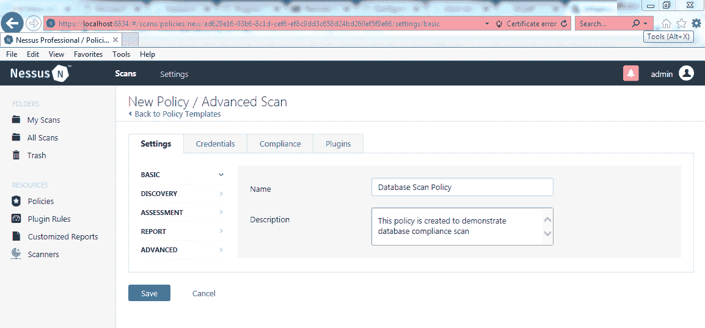

1.  转到合规标签并搜索 Nessus 中可用的 MySQL 基准：

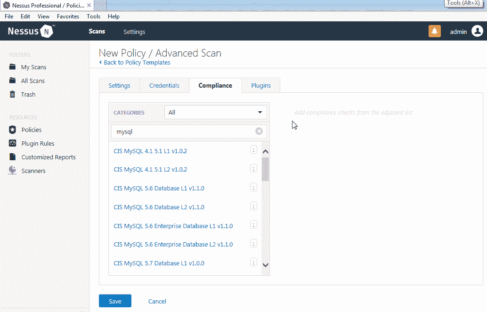

1.  *准备就绪*部分的屏幕截图显示远程主机运行 MariaDB 10.1.26；因此，我们可以得出兼容版本为 MySQL 5.6，如[`mariadb.com/kb/en/library/mariadb-vs-mysql-compatibility/`](https://mariadb.com/kb/en/library/mariadb-vs-mysql-compatibility/)所示。

1.  选择 CIS MySQL 5.6 作为 Linux OS 的策略执行合规扫描：

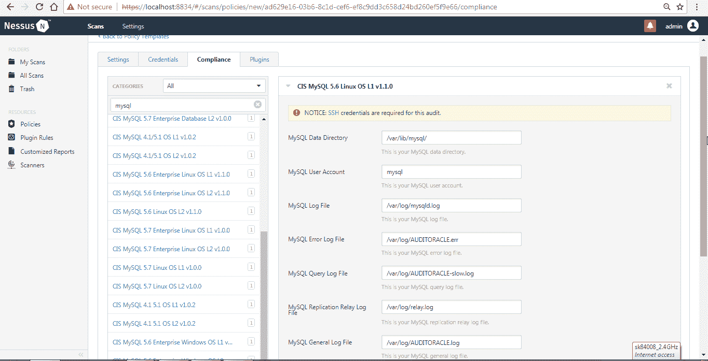

如果需要，可以更改策略的默认路径。

1.  转到凭据选项卡，从下拉菜单中选择数据库，并输入必要的细节：

1.  转到插件选项卡，禁用所有不需要的插件进行扫描：

1.  保存策略并转到扫描页面创建新扫描。

1.  转到用户定义策略部分，查找为数据库合规性扫描创建的策略：

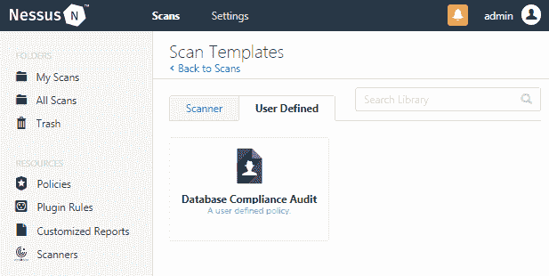

1.  选择策略并填写必要的细节，如扫描名称、描述和要扫描的目标：

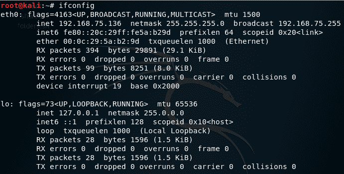

可以使用`ifconfig`命令获取远程主机的 IP 地址。在目标字段中输入`192.168.75.136` IP 地址，然后选择启动开始扫描：

# 工作原理…

数据库配置审计涵盖了从登录到用户授予的模式级访问的广泛检查范围。先前的扫描技术有助于突出 MySQL 服务器中缺少的补丁和未通过的合规性检查。

# 执行 Web 应用程序扫描

Nessus 还支持 Web 应用程序扫描。这可以用来审计和识别 Web 应用程序中的漏洞。

Nessus 插件足够有效，可以从 OWASP 十大漏洞中识别关键漏洞。Nessus 提供选项供用户提供认证细节，以执行详细扫描并报告各种漏洞。作为 Web 应用程序测试的一部分，Nessus 还扫描应用程序服务器、Web 服务器和数据库中的漏洞；即端到端的漏洞扫描。

# 准备就绪

本食谱的*准备就绪*部分与*选择合规性扫描策略*部分的*准备就绪*部分相同。本食谱还要求您已经学习并练习了本章中的先前食谱。Metasploitable 包含多个易受攻击的应用程序。在本食谱中，我们将使用 DVWA 来演示 Nessus 执行 Web 应用程序测试的能力：

DVWA 应用程序的默认登录凭据为用户名字段中的`admin`，密码字段中的`password`，如下所示：

# 如何做…

执行以下步骤：

1.  打开 Nessus Web 客户端。

1.  使用安装期间创建的用户详细信息登录 Nessus Web 客户端。

1.  导航到策略页面，并通过选择 Web 应用程序测试扫描模板创建新策略。

1.  填写策略的名称并导航到凭据：

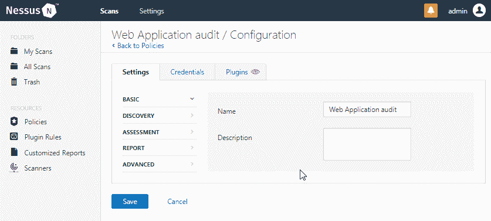

1.  选择 HTTP 身份验证并根据要审计的应用程序填写剩余的参数：

对于此身份验证表单，有多个参数需要填写，例如用户名、密码、登录页面路径、登录提交页面路径、登录参数、检查身份验证页面路径以及用于验证成功身份验证的正则表达式。大多数这些参数可以通过花几分钟观察应用程序的工作方式以及浏览器控制台发送到服务器的请求来获得：

1.  保存策略并导航到扫描页面创建新扫描。

1.  导航到用户定义的策略，找到 Web 应用程序审计策略文件：

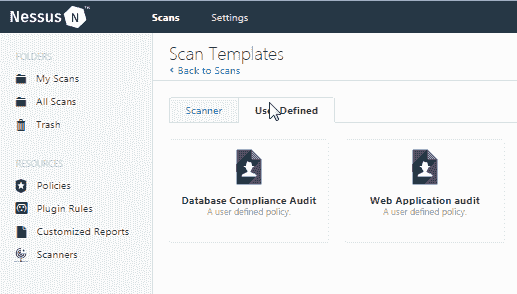

1.  选择适当的策略并填写详细信息，如名称、描述和目标。您可以简单地输入主机的 IP 地址或域名，不带任何前缀或后缀路径：

1.  启动扫描并等待其完成。

1.  扫描完成后，打开它以查看以下信息：

1.  导航到漏洞选项卡以检查报告的观察结果：

每个漏洞包括以下部分，以及其他插件详细信息，以帮助您了解漏洞，如下所示：

+   描述

+   解决方案

+   另请参阅

+   输出

+   端口

+   主机

# 它是如何工作的...

Nessus 插件测试 Web 应用程序与配置的测试用例，并报告失败的漏洞以及相应的输出。报告还揭示了扫描器执行的漏洞利用的大量信息，以帮助用户重新创建问题并创建更好的缓解方法。Nessus Web 应用程序扫描器无法执行任何业务逻辑检查，因为它缺乏这方面的决策算法。因此，最好只使用 Nessus Web 应用程序扫描器模块进行快速测试，然后对应用程序执行全面的渗透测试以获得更好的结果。
