# 物联网、SCADA/ICS 的网络扫描

在本章中，我们将介绍以下内容：

+   SCADA/ICS 简介

+   使用 Nmap 扫描 SCADA/ICS

+   使用 Nessus 扫描 SCADA/ICS 系统

# SCADA/ICS 简介

用于管理和执行各种工业操作的自动化技术，如线路管理控制和操作控制，属于运营技术的一部分：

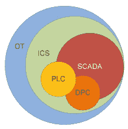

工业控制系统（ICS）涵盖了运营技术领域的一个很大部分，用于监控和控制各种操作，如自动化生产，硬件系统的控制和监控，通过控制水位和核设施的流量来调节温度。大多数 ICS 的使用都是在非常关键的系统中，这些系统需要始终可用。

用于 ICS 的硬件有两种类型，即可编程逻辑控制器（PLC）或离散过程控制系统（DPC），这些系统又由监控和数据采集（SCADA）系统管理。SCADA 通过提供基于界面的控制，而不是用户手动输入每个命令，使得管理 ICS 系统变得容易。这使得这些系统的管理变得强大且简单，从而实现了非常高的可用性：

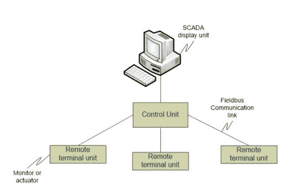

主要组件如下：

+   SCADA 显示单元基本上是一个为管理员提供交互界面的组件，用于查看、验证和修改要传递给 ICS 系统的各种命令。这使用户可以远程控制 ICS 系统，而无需实际在现场。例如，远程管理员可以使用 Web 门户管理建筑物中所有恒温器的配置。

+   控制单元充当 SCADA 显示单元和远程终端单元之间的桥梁。控制单元始终需要将来自远程终端单元的数据实时发送到 SCADA 显示单元。这是为了通知管理员任何故障，以便查看和修复以确保系统的高可用性。

+   远程终端单元（RTU）可以是可编程逻辑控制器（PLC）（一种制造业标准计算机，用于处理和执行指令），它连接多个设备到 SCADA 网络，使它们能够从远距离监控和管理。RT、控制单元和 SCADA 显示单元之间的连接不需要是有线网络，也可以是无线网络。

保护这些 SCADA 系统非常重要，因为简单的配置错误可能导致实际工业制造环境中的灾难。有许多开源工具可用于此目的。Nmap 就是这样一种工具，它允许用户为 SCADA/ICS 系统端口扫描编写自定义脚本。此外，分析人员可以使用 Metasploit 模块来利用 SCADA/ICS 环境中的这些漏洞。

以下是一些可以用于识别和利用 SCADA/ICS 系统问题的 Metasploit 模块：

| 供应商 | 系统/组件 | Metasploit 模块 |
| --- | --- | --- |
| 7-Technologies | IGSS | `exploit/windows/scada/igss9_igssdataserver_listall.rb` |
|  |  | `exploit/windows/scada/igss9_igssdataserver_rename.rb` |
|  |  | `exploit/windows/scada/igss9_misc.rb` |
|  |  | `auxiliary/admin/scada/igss_exec_17.rb` |
| AzeoTech | DAQ Factory | `exploit/windows/scada/daq_factory_bof.rb` |
| 3S | CoDeSys | `exploit/windows/scada/codesys_web_server.rb` |
| BACnet | OPC Client | `exploit/windows/fileformat/bacnet_csv.rb` |
|  | 操作工作站 | `exploit/windows/browser/teechart_pro.rb` |
| Beckhoff | TwinCat | `auxiliary/dos/scada/beckhoff_twincat.rb` |
| 通用电气 | D20 PLC | `辅助/收集/d20pass.rb` |
|  |  | `不稳定模块/辅助/d20tftpbd.rb` |
| Iconics | Genesis32 | `利用/Windows/SCADA/iconics_genbroker.rb` |
|  |  | `利用/Windows/SCADA/iconics_webhmi_setactivexguid.rb` |
| Measuresoft | ScadaPro | `利用/Windows/SCADA/scadapro_cmdexe.rb` |
| Moxa | 设备管理器 | `利用/Windows/SCADA/moxa_mdmtool.rb` |
| RealFlex | RealWin SCADA | `利用/Windows/SCADA/realwin.rb` |
|  |  | `利用/Windows/SCADA/realwin_scpc_initialize.rb` |
|  |  | `利用/Windows/SCADA/realwin_scpc_initialize_rf.rb` |
|  |  | `利用/Windows/SCADA/realwin_scpc_txtevent.rb` |
|  |  | `利用/Windows/SCADA/realwin_on_fc_binfile_a.rb` |
|  |  | `利用/Windows/SCADA/realwin_on_fcs_login.rb` |
| Scadatec | Procyon | `利用/Windows/SCADA/procyon_core_server.rb` |
| 施耐德电气 | CitectSCADA | `利用/Windows/SCADA/citect_scada_odbc.rb` |
| SielcoSistemi | Winlog | `利用/Windows/SCADA/winlog_runtime.rb` |
| 西门子 Technomatix | FactoryLink | `利用/Windows/SCADA/factorylink_cssservice.rb` |
|  |  | `利用/Windows/SCADA/factorylink_vrn_09.rb` |
| Unitronics | OPC 服务器 | `利用/利用/Windows/浏览器/teechart_pro.rb` |

还有许多开源工具可以执行这些操作。其中一个工具是 PLCScan。

PLCScan 是一个用于识别 PLC 设备的实用程序，使用端口扫描方法。它识别先前记录的各种 SCADA/PLC 设备的特定端口接收到的数据包。它使用一组后端脚本来执行这些操作。

使用自动化脚本扫描控制系统可能是一项繁琐的任务，因为它们很容易崩溃。大多数 SCADA/ICS 系统都是传统系统，使用传统软件，不太适合更换，并且没有足够的硬件来进行自动化。这导致了许多漏洞。

# 使用 Nmap 扫描 SCADA/ICS

Nmap 提供多个脚本，其功能还允许用户创建多个自定义脚本来识别网络中存在的 SCADA 系统。这使分析人员能够创建特定的测试用例来测试 SCADA 系统。最新的 Nmap 脚本库中默认提供的一些脚本如下：

+   `s7-info.nse`：用于枚举西门子 S7 PLC 设备并收集系统名称、版本、模块和类型等信息。此脚本的工作方式类似于 PLCScan 实用程序。

+   `modbus-discover.nse`：枚举 SCADA Modbus **从机 ID**（**sids**）并收集从机 ID 号和从机 ID 数据等信息。Modbus 是各种 PLC 和 SCADA 系统使用的协议。

我们将在接下来的示例中看到这些脚本的语法和用法。

# 准备就绪

为了完成这项活动，您必须满足计算机上的以下先决条件：

1.  您必须安装 Nmap。

1.  您必须能够访问要执行扫描的主机的网络。

为了安装 Nmap，您可以按照第二章中提供的说明进行操作，*了解网络扫描工具*。这将允许您下载兼容版本的 Nmap 并安装所有必需的插件。为了检查您的计算机是否安装了 Nmap，请打开命令提示符并输入`Nmap`。如果 Nmap 已安装，您将看到类似以下的屏幕：

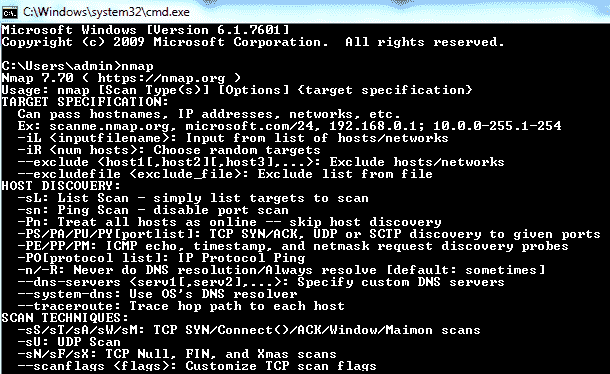

如果您没有看到上述屏幕，请尝试将命令提示符控制移动到 Nmap 安装的文件夹中（`C:\Program Files\Nmap`）重试相同步骤。如果这样做后仍然没有看到屏幕，请删除并重新安装 Nmap。

为了对要扫描的主机上的开放端口进行填充，您需要对该特定主机具有网络级别的访问权限。通过向主机发送 ping 数据包来检查您是否可以访问特定主机是一种简单的方法。但是，如果在该网络中禁用了 ICMP 和 ping，则此方法将无效。在禁用 ICMP 的情况下，活动主机检测技术也会有所不同。我们将在本书的后续部分详细讨论这一点。

此外，为了创建一个测试环境，在 Kali 操作系统上安装 Conpot，这是一个著名的蜜罐，按照提供的说明进行：[`github.com/mushorg/conpot`](https://github.com/mushorg/conpot)。

安装 Conpot 后，使用以下命令在系统上运行 Conpot：

```
sudoconpot --template default
```

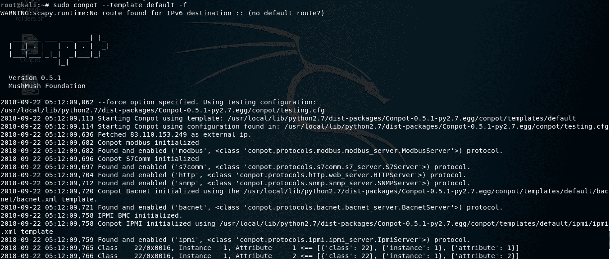

# 如何做…

执行以下步骤：

1.  在命令提示符中打开 Nmap。

1.  在命令提示符中输入以下语法以获取`scripts7-info.nse`脚本的扫描结果：

```
Nmap --script s7-info.nse -p 102 192.168.75.133
```


您可以观察到扫描器已经检测到系统是`西门子，SIMATIC，S7-200`设备。

1.  在命令提示符中输入以下语法以获取`modbu-discover.nse`脚本的扫描结果：

```
Nmap --script modbus-discover.nse --script-args='modbus-discover.aggressive=true' -p 502 192.168.75.133
```


此模块还发现设备是`西门子，SIMATIC，S7-200`。

# 工作原理...

这些 Nmap 脚本允许用户识别 SCADA 系统正在使用的特定端口。例如，如前面的示例所示，端口`102`和`502`是可以用来确定网络中是否有任何 SIMATIC 设备的特定端口。分析人员可以扫描整个网络以查找端口`102`和`502`，一旦找到，他们可以执行服务扫描以检查其中是否有任何相关的 SCADA 软件在运行。

# 还有更多...

在任何给定的情况下，如果 Nmap 中的默认脚本没有完成工作，那么用户可以从 GitHub 或其他资源下载其他开发人员开发的自定义 Nmap 脚本，并将它们粘贴到 Nmap 安装文件夹的脚本文件夹中以使用它们。例如，从链接[`github.com/jpalanco/Nmap-scada`](https://github.com/jpalanco/nmap-scada)克隆文件夹，以便在脚本文件夹中粘贴多个其他 SCADA 系统，以便您可以使用 Nmap 运行它们：


# 使用 Nessus 扫描 SCADA/ICS 系统

Nessus 有一个插件系列-大约有 308 页-可以用来对 SCADA/ICS 设备进行扫描。您可以在这里浏览插件系列：[`www.tenable.com/plugins/nessus/families/SCADA`](https://www.tenable.com/plugins/nessus/families/SCADA)。这些插件会根据插件中的签名检查给定设备，以识别任何已经确定的漏洞。

# 准备工作

为了完成这个活动，您必须满足机器上的以下先决条件：

1.  您必须安装 Nessus。

1.  您必须能够访问要执行扫描的主机。

要安装 Nessus，您可以按照第二章中提供的说明进行操作，*了解网络扫描工具*。这将允许您下载兼容版本的 Nessus 并安装所有必需的插件。为了检查您的机器是否安装了 Nessus，打开搜索栏并搜索`Nessus Web Client`。一旦找到并点击，它将在默认浏览器窗口中打开：

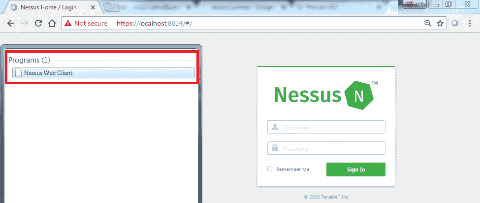

如果您确定 Nessus 已正确安装，可以直接从浏览器使用`https://localhost:8834` URL 打开 Nessus Web 客户端。如果找不到**Nessus Web 客户端**，应删除并重新安装 Nessus。有关删除 Nessus 和安装说明，请参阅第二章，*了解网络扫描工具*。如果找到了 Nessus Web 客户端，但无法在浏览器窗口中打开它，则需要检查 Nessus 服务是否在 Windows 服务实用程序中运行：

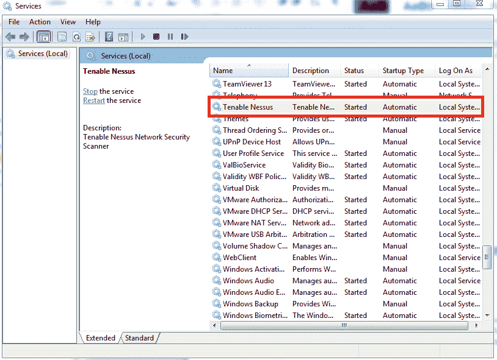

此外，您可以根据需要使用服务实用程序启动和停止 Nessus。为了进一步确认此安装是否使用命令行界面，您可以导航到安装目录以查看和访问 Nessus 的命令行实用程序：


建议始终具有管理员级别或根级别凭据，以便为扫描仪提供对所有系统文件的访问权限。这将使扫描仪能够执行更深入的扫描，并生成比非凭证扫描更好的结果。策略合规模块仅在 Nessus 的付费版本（如 Nessus 专业版或 Nessus 管理器）中可用。为此，您将需要从 tenable 购买激活密钥，并在设置页面中更新它，如下图所示：

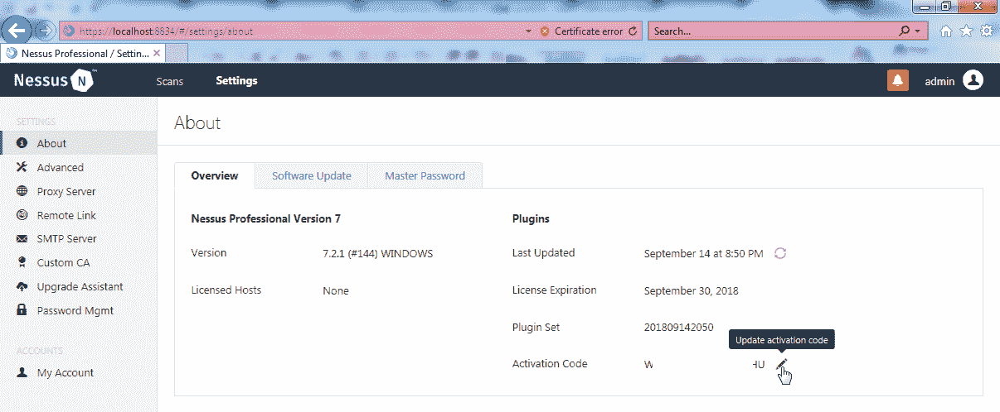

单击编辑按钮打开窗口，并输入您从 tenable 购买的新激活码：

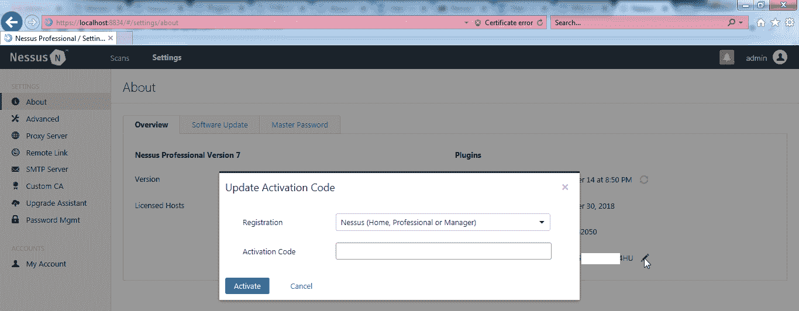

此外，您可以安装 Conpot，如前面的食谱中所述。此食谱还需要安装 Kali Linux 操作系统。您可以从[`www.vmware.com/products/workstation-pro/workstation-pro-evaluation.html`](https://www.vmware.com/products/workstation-pro/workstation-pro-evaluation.html)下载虚拟机，从[`www.offensive-security.com/kali-linux-vm-vmware-virtualbox-image-download/`](https://www.offensive-security.com/kali-linux-vm-vmware-virtualbox-image-download/)下载 Kali Linux。

# 如何做..

执行以下步骤：

1.  打开 Nessus Web 客户端。

1.  使用您在安装期间创建的用户登录到 Nessus 客户端。

1.  点击**策略**选项卡，然后选择**创建新策略**。然后，选择**基本网络扫描**模板：

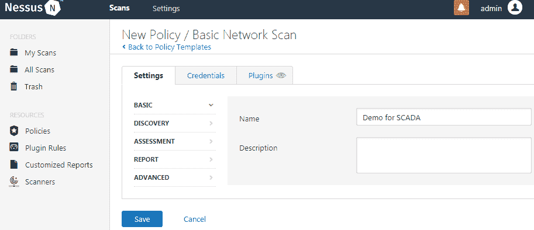

通过在**发现**选项卡中更改端口扫描的设置，指定范围为`1-1000`。这将允许扫描仪快速完成扫描：

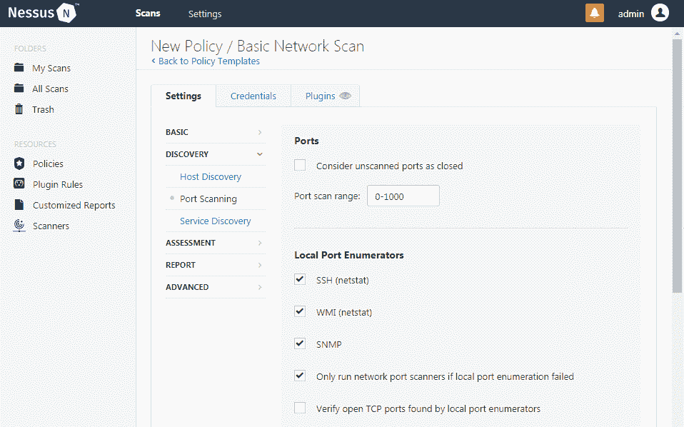

1.  确保在**评估**的**常规**设置类别的准确性选项卡中未选择执行彻底测试：

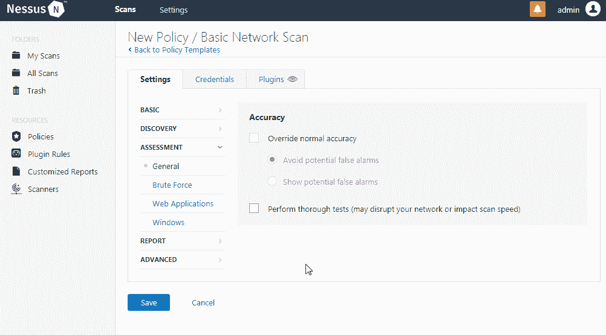

这将确保 PLC 或您正在执行扫描的任何其他设备不会受到由于产生的流量而产生的任何影响。您还可以设置高级设置，以确保生成的流量最小：

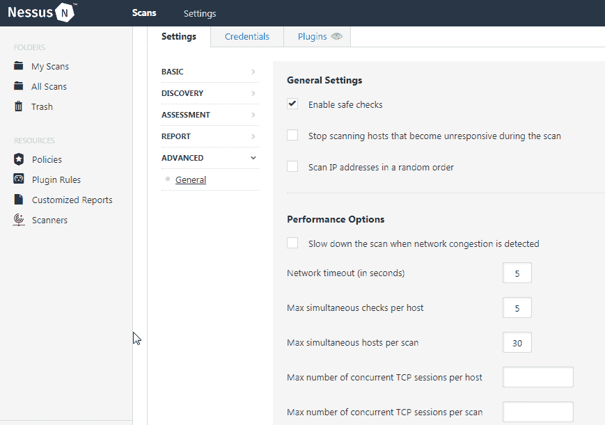

1.  确保**插件**选项卡中存在 SCADA 插件，否则获得的结果将仅适用于非 SCADA 端口：

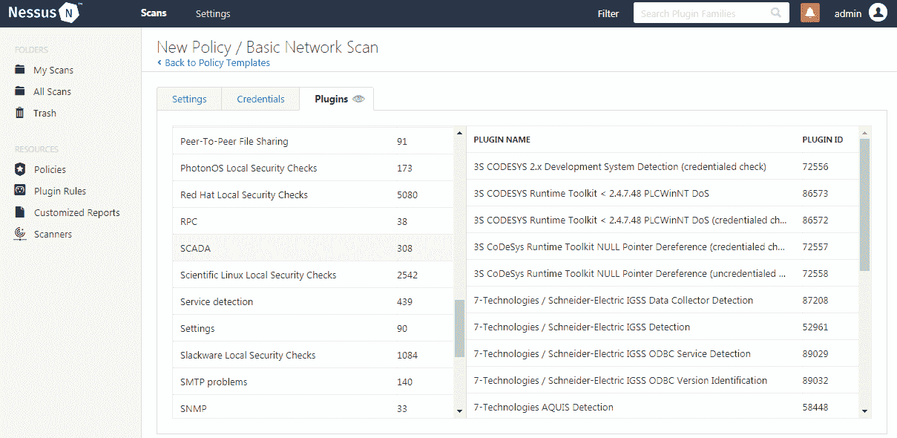

1.  保存策略，并从`我的扫描`文件夹中选择**新扫描**。转到**用户定义**策略部分，并选择策略：


1.  选择策略并填写所需的详细信息。然后，启动扫描：

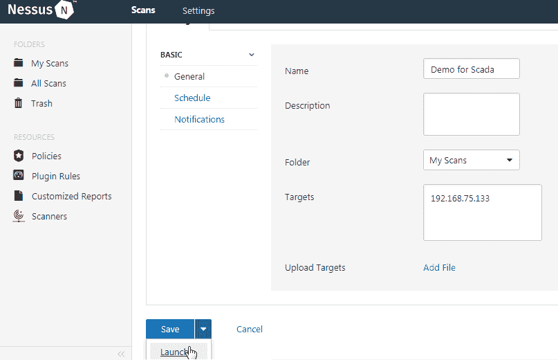

1.  等待扫描完成并打开结果：


上述结果表明扫描成功，并且 Nessus 发现了两个与 SCADA 相关的漏洞：

+   ICCP/COTP（ISO 8073）协议检测：

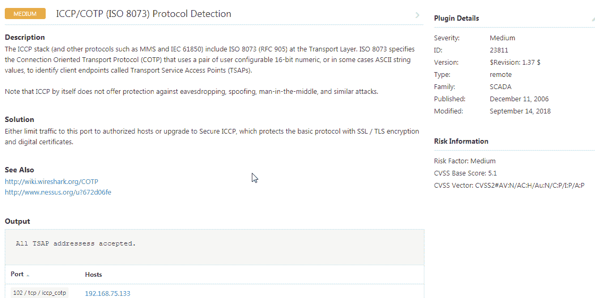

+   Modbus/TCP 线圈访问：

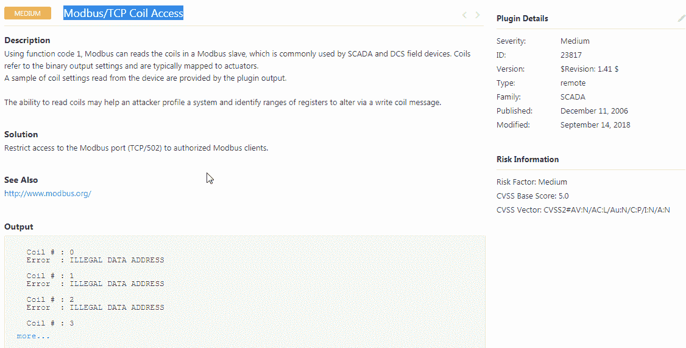

# 工作原理...

这些扫描结果将允许用户进行进一步分析，以检查系统中已知的漏洞。从中，用户可以向管理员建议所需的补丁。必须始终确保所有 SCADA 连接都是加密的端到端，否则仅限于执行点对点连接。

# 还有更多...

可以使用 Metasploit 模块执行类似的检查。打开我们在虚拟机中安装的 Kali Linux，并在终端中输入以下命令：

```
msfconsole
```

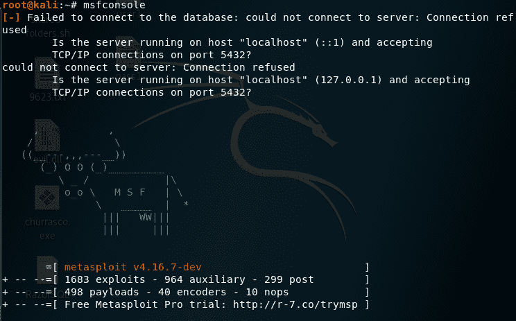

这用于打开 Metasploit 控制台。还有一个名为 Armitage 的 Metasploit 的 GUI 版本可用。要查找适用于 SCADA 的各种 Metasploit 模块，请输入以下命令：

```
searchscada
```


如前面的屏幕截图所示，Metasploit 支持的 SCADA 的各种模块已加载。让我们尝试对 Modbus 进行特定搜索，看看支持哪些模块：

```
searchmodbus
```


从前面的屏幕截图中，您可以使用`modbusdetect`来识别端口`502`上是否运行 Modbus，使用以下语法：

```
use auxiliary/scanner/scada/modbusdetect
```

通过使用`show options`填写所需的详细信息来识别相同的内容：


使用以下命令将 RHOSTS 设置为`192.168.75.133`并运行 exploit：

```
set RHOSTS 192.168.75.133
```


前面的屏幕截图显示模块已经检测到端口`502`上存在 Modbus。
