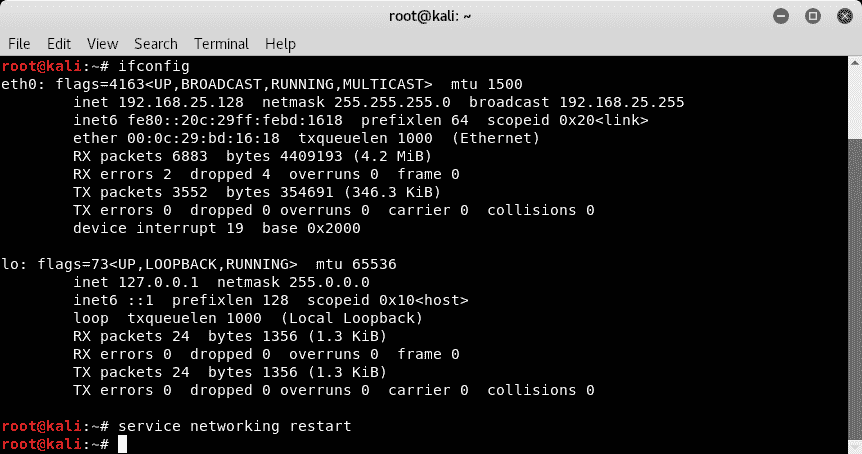
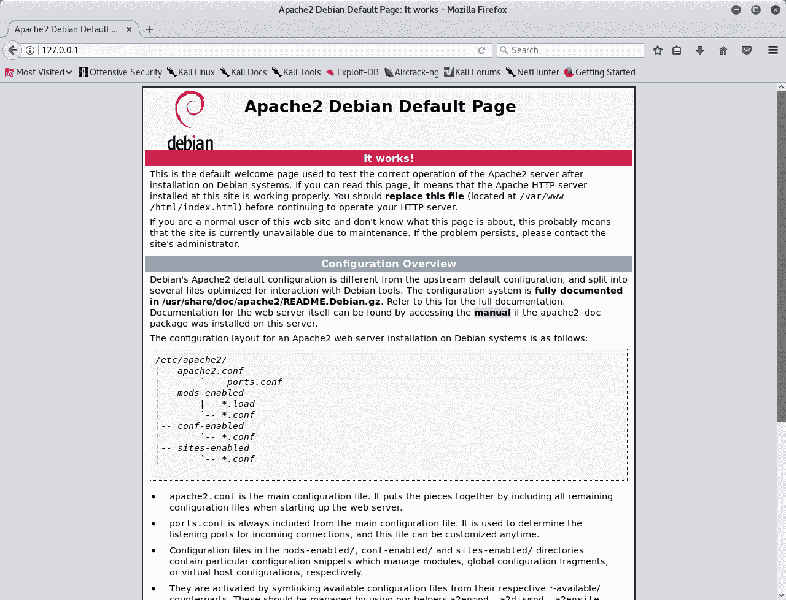
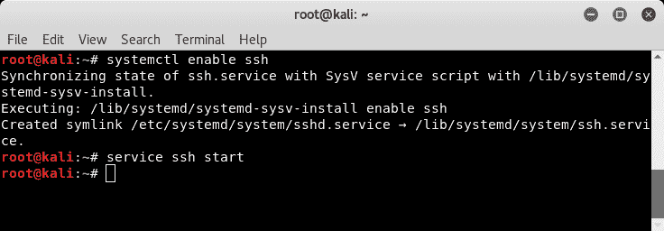
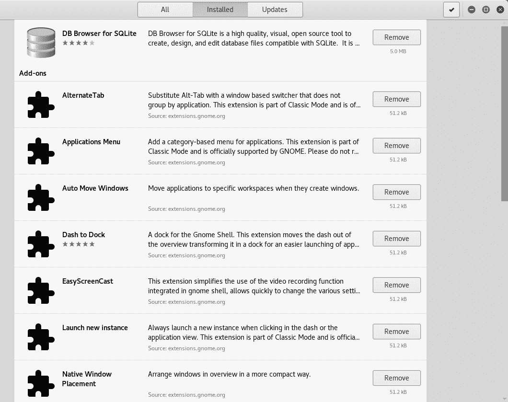

# 设置评估环境

在上一章中，我们了解了从治理角度理解漏洞管理程序的基本知识。本章将介绍建立全面的漏洞评估和渗透测试环境的各种方法和技术。我们将学习如何建立自己的环境，以便在本书后面讨论的各种漏洞评估技术中有效使用。

本章将涵盖以下主题：

+   设置 Kali 虚拟机

+   Kali Linux 的基础知识

+   环境配置和设置

+   评估过程中要使用的工具列表

# 设置 Kali 虚拟机

进行漏洞评估或渗透测试涉及一系列任务，需要借助多个工具和实用程序来执行。对于流程中涉及的每个任务，都有可用的工具，包括商业工具、免费软件和开源软件。这完全取决于我们根据上下文选择的最适合的工具。

为了进行端到端的评估，我们可以根据需要下载单独的工具，也可以使用 Kali Linux 这样的发行版，它预装了所有必需的工具。Kali Linux 是一个稳定、灵活、强大且经过验证的渗透测试平台。它具有执行各个渗透测试阶段各种任务所需的基本工具。它还允许您轻松添加默认安装中没有的工具和实用程序。

因此，Kali Linux 真的是一个很好的选择，用于漏洞评估和渗透测试的平台。

Kali Linux 可以在[`www.kali.org/downloads/`](https://www.kali.org/downloads/)下载。

下载后，您可以直接在系统上安装，也可以在虚拟机中安装。在虚拟机中安装的优势是可以保持现有操作系统设置不受干扰。此外，使用快照可以轻松进行配置备份，并在需要时进行恢复。

虽然 Kali Linux 可以以 ISO 文件的形式下载，但也可以作为完整的虚拟机下载。您可以根据您使用的虚拟化软件（VMware/VirtualBox/Hyper-V）下载正确的设置。Kali 虚拟机设置文件可在[`www.offensive-security.com/kali-linux-vm-vmware-virtualbox-hyperv-image-download/`](https://www.offensive-security.com/kali-linux-vm-vmware-virtualbox-hyperv-image-download/)下载。 

以下屏幕截图显示了 Kali Linux 在 VMware 中的情况。您可以通过选择“编辑虚拟机设置”选项来配置机器设置，分配内存并选择网络适配器类型。完成后，您可以简单地启动机器：

# Kali Linux 的基础知识

访问 Kali Linux 的默认凭据是`username:root`和`password:toor`。但是，在第一次登录后，重要的是更改默认凭据并设置新密码。可以使用`passwd`命令来设置新密码，如下图所示：

Kali Linux 广泛用于网络和应用程序渗透测试。因此，重要的是 Kali Linux 连接到网络，因为独立的 Kali 安装没有太多用处。确保网络连接的第一步是检查 Kali 是否有有效的 IP 地址。我们可以使用`ifconfig`命令，如下图所示，并确认 IP 地址分配：

现在我们已经更改了默认凭据，并确认了网络连接，现在是时候检查我们的 Kali 安装的确切版本了。这包括确切的构建详细信息，包括内核和平台详细信息。`uname -a` 命令会给我们所需的详细信息，如下截图所示：

Kali Linux 是一个完整的渗透测试发行版，其中的工具可以协助渗透测试生命周期的各个阶段。单击应用程序菜单后，我们可以看到分布在各个类别中的所有可用工具，如下截图所示：

Kali Linux 配备了大量有用的工具和实用程序。有时，我们需要对这些工具和实用程序的配置文件进行更改。所有工具和实用程序都位于 `/usr/bin` 文件夹中，如下截图所示：

Kali Linux 使用多个在线仓库来提供软件安装和更新。然而，这些仓库源必须定期更新。可以使用 `apt-get update` 命令来实现，如下截图所示：

Kali Linux 也会定期获得重大的构建更新。为了升级到最新可用的构建，可以使用 `apt-get upgrade` 命令，如下截图所示：

Kali Linux 生成并存储各种类型的日志，如应用程序、系统、安全和硬件。这些日志对于调试和跟踪事件非常有用。可以通过打开位于应用程序 | 常用应用程序 | 实用程序 | 日志的日志应用程序来查看日志，结果如下截图所示：

# 环境配置和设置

虽然我们的基本 Kali 设置已经运行起来了，但我们还需要安装和配置一些我们在评估过程中可能需要的其他服务。在接下来的部分中，我们将讨论 Kali Linux 中一些有用的服务。

# Web 服务器

在渗透阶段，Web 服务器将对我们有所帮助，我们可能需要托管后门可执行文件。Apache Web 服务器默认安装在 Kali Linux 中。我们可以使用 `service apache2 start` 命令启动 Apache Web 服务器，如下截图所示。

我们可以使用 `netstat -an | grep ::80` 命令来验证服务是否成功启动：

现在 Apache 服务器已经运行起来了，我们也可以通过浏览器进行验证。通过访问本地主机 (`127.0.0.1`)，我们可以看到默认的 Apache 网页，如下截图所示：

如果我们想要更改默认页面，或者希望托管任何文件，可以通过将所需文件放置在 `/var/www/html` 目录中来实现，如下截图所示：

# 安全外壳 (SSH)

SSH 确实是远程安全通信需要时的默认协议选择。

在 Kali Linux 中，我们可以通过首先安装 SSH 包来开始使用 SSH。可以使用 `apt-get install ssh` 命令，如下截图所示：

为了确保 SSH 在重新启动后自动启动，我们可以使用 `systemctl` 命令，如下截图所示，可以使用 `service ssh start` 命令启动 SSH 服务：

# 文件传输协议 (FTP)

使用 Web 服务器可以快速托管和提供小文件，但 FTP 服务器提供了更好和可靠的解决方案来托管和提供大文件。我们可以在 Kali Linux 上使用`apt-get install vsftpd`命令来安装 FTP 服务器，如下面的屏幕截图所示：

安装后，我们可以通过修改`/etc/vsftpd.conf`文件来根据需要编辑配置。完成必要的配置后，我们可以使用`service vsftpd start`命令来启动 FTP 服务器，如下面的屏幕截图所示：

# 软件管理

命令行实用程序`apt-get`可用于安装大多数所需的应用程序和实用程序。但是，Kali Linux 还有一个用于管理软件的图形界面工具。可以使用以下路径访问该工具：应用程序 | 常用应用程序 | 系统工具 | 软件。

软件管理器可用于删除现有软件或添加新软件，如下面的屏幕截图所示：

# 要在评估期间使用的工具列表

在渗透测试生命周期中有大量可用工具来执行各种任务。然而，以下是在渗透测试期间最常用的工具列表：

| **序号** | **渗透测试阶段** | **工具** |
| --- | --- | --- |
| 1 | 信息收集 | SPARTA, NMAP, Dmitry, Shodan, Maltego, theHarvester, Recon-ng |
| 2 | 枚举 | NMAP, Unicornscan |
| 3 | 漏洞评估 | OpenVAS, NExpose, Nessus |
| 4 | 获取访问权限 | Metasploit, Backdoor-factory, John The Ripper, Hydra |
| 5 | 特权升级 | Metasploit |
| 6 | 覆盖痕迹 | Metasploit |
| 7 | Web 应用程序安全测试 | Nikto, w3af, Burp Suite, ZAP Proxy, SQLmap |
| 8 | 报告 | KeepNote, Dradis |

# 摘要

在本章中，我们了解到在虚拟环境中使用 Kali Linux 可以有效地进行漏洞评估和渗透测试。我们还学习了一些关于 Kali Linux 的绝对基础知识，并配置了其环境。
