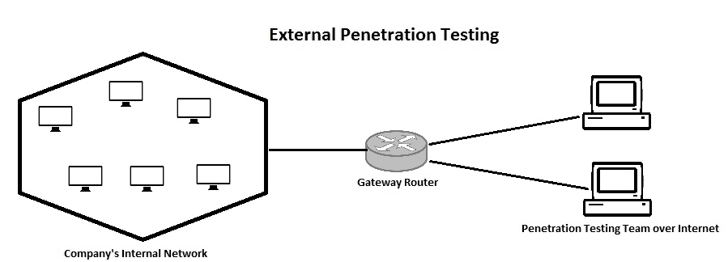
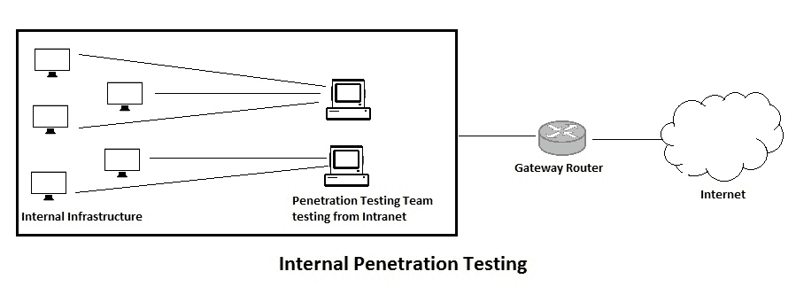

# 安全评估先决条件

在我们可以开始实际进行安全评估之前，实际上需要做很多基础工作，包括规划、范围确定、选择正确的测试、资源分配、测试计划以及获得文件签署和批准。所有这些先决条件将有助于确保安全评估的顺利进行。本章将讨论以下主题：

+   目标范围和规划

+   收集需求

+   决定漏洞评估的类型

+   资源和可交付成果的估算

+   准备测试计划和测试边界

+   获得批准并签署保密协议

# 目标范围和规划

定义和决定正式范围是漏洞评估中最重要的因素之一。虽然可能有很多关于使用各种漏洞评估工具和技术的信息和指南，但漏洞评估的准备阶段往往被忽视。忽视充分完成前期活动可能会导致潜在问题，例如以下问题：

+   范围蔓延

+   客户不满意

+   法律问题

项目的范围旨在准确定义需要进行测试的内容。

从理论上讲，测试网络中的每个资产似乎是最好的选择；然而，这可能并不实际可行。与所有业务部门进行详细讨论可以帮助您收集关键资产清单。然后，这些资产可以包括在漏洞评估范围内。漏洞评估范围中包括的一些常见资产如下：

+   通信线路

+   电子商务平台

+   任何面向互联网的网站

+   特殊用途设备（调制解调器、无线电等）

+   应用程序和应用程序 API

+   电子邮件网关

+   远程访问平台

+   邮件服务器

+   DNS

+   防火墙

+   FTP 服务器

+   数据库服务器

+   Web 服务器

在关于应该包括在漏洞评估范围内的候选资产的上述清单中，可能有一些其他经常被忽视但可能为攻击者打开入口的资产。这些资产包括以下内容：

+   打印机

+   无线接入点

+   共享驱动器

+   IP 摄像头

+   智能电视

+   生物识别门禁系统

范围的详细概述将帮助漏洞评估团队规划资源和时间表。

# 收集需求

在我们甚至考虑开始漏洞评估之前，非常重要的是非常清楚地了解客户的需求。客户可能是组织内部或外部的。对于 VA 测试人员来说，了解客户对测试的期望是很重要的。为了识别和记录客户需求，需要完成以下工作。

# 准备详细的测试要求清单

测试人员需要与客户安排多次会议，以了解他们的需求。结果应包括但不限于以下内容：

+   客户希望遵守的安全合规性清单

+   在各自的安全合规性中规定的要求和行为准则（如果有）

+   受范围限制的网络段清单

+   受范围限制的网络段中的网络安全设备清单

+   要扫描的资产清单（以及 IP 范围）

+   暴露在公共网络中的资产清单（以及 IP 范围）

+   具有网络范围访问权限的资产清单（以及 IP 范围）

+   业务关键资产清单（以及 IP 范围）

+   客户环境中可接受的漏洞评估工具清单

+   客户或合作伙伴建议的工具的许可证可用性

+   在客户环境中严格禁止使用的工具清单

+   最近的漏洞评估报告（如果有）

# 合适的时间框架和测试时间

一些安全合规要求要求定期对范围内的基础设施进行漏洞评估。例如，PCI/DSS 要求对业务关键资产进行半年漏洞评估，对 PCI/DSS 认证范围内的非关键资产进行年度漏洞评估。

测试人员和客户在准备评估计划时需要牢记这些合规性要求。同时，考虑到评估范围内环境中正在进行的关键变化总是有益的。如果安全合规要求规定的时间允许的话，最好在完成关键变化后进行评估，这将有助于提供当前安全状况的持久视图。

漏洞评估中调度和计划的另一个有趣部分是测试时间。通常，使用自动化扫描配置文件来执行漏洞评估，并消耗大量网络流量（每个端口/主机/资产的请求/响应）并且可能也会消耗被扫描的资产/主机的大量资源。在罕见的情况下，可能会发生某个资产/主机停止响应，进入**拒绝服务**（DoS）模式和/或完全关闭模式。这种情况也可能发生在业务关键系统上。现在想象一下，在高峰业务时间内，业务关键系统/服务不响应任何请求。这也可能影响其他服务，涵盖更广泛的用户空间。这可能导致数据、声誉和收入的损失。此外，在这种混乱的情况下恢复和恢复业务功能也会带来挑战。因此，建议在工作时间之外进行漏洞评估。这样做的好处包括：

+   由于没有通常的业务/合法流量，网络上没有额外的开销

+   自动扫描在网络带宽更大的情况下完成得更快

+   漏洞评估的影响（如果有的话）可以很快被观察到，因为网络流量已经减少

+   影响和副作用可以轻松处理（恢复/恢复），因为业务/收入和声誉损失的风险被降到可接受的限度

但在这种方法中可能会有一些例外情况，测试人员需要在工作时间进行评估。其中一种情况可能是需要评估用户工作站的漏洞。由于用户工作站只在工作高峰时间可用，因此只有在工作时间才应扫描该网络段。

总之，这个阶段的结果是：

+   进行漏洞评估的业务和合规需求

+   进行漏洞评估的时间框架（可能会受到某些安全合规要求的约束）

+   工作时间和非工作时间

+   关键资产和非关键资产的测试时间

+   对具有相应 IP 的最终用户工作站列表进行测试

# 识别利益相关者

漏洞管理采用自上而下的方法。以下是可能参与和/或受漏洞评估影响的利益相关者：

+   **高管/高层管理人员**：为了实现漏洞评估计划的成功，高层管理人员应支持该活动，通过分配所有必要的资源来支持该活动。

+   **IT 安全负责人**：这可能是专门的或额外的责任，分配给胜任的人员。通常，这个职位直接向高管/高层管理人员汇报，向高层管理人员提供安全状况的鸟瞰图。为了保持安全合规性，这个职位领导组织中运行的多个 IT 安全项目。

+   **VA 主管测试人员**：这个职位指的是通常向 IT 安全负责人汇报的专业人员。VA 主管负责：

+   签署工作声明（SoW）

+   保持保密协议

+   检查在特定环境中进行此类测试的法律方面

+   收集要求并定义范围

+   规划漏洞评估

+   管理所需的工具、设备和漏洞评估所需的许可证

+   管理漏洞评估的团队和团队活动

+   在漏洞评估程序中，维护**单点联系人**（**SPOC**）与所有利益相关者之间的联系

+   让所有利益相关者了解漏洞评估的活动

+   生成并签署漏洞评估的执行摘要

+   **VA 测试人员**：VA 测试人员进行以下必要的活动来进行 VA 程序：

+   配置和更新自动化扫描工具/设备

+   监控自动化扫描，以检测任何干扰或未经请求的影响

+   进行手动测试

+   进行**概念验证**（**PoCs**）

+   生成详细报告

+   向 VA 主测试人员及时提供更新

+   **资产所有者**：作为漏洞评估的一部分，每个服务/系统/应用程序/网络/设备都参与其中。所有者负责对可能发生的任何干扰做出响应。所有者应了解其所有权下资产的详细评估计划，并应准备好恢复和恢复计划以减少影响。

+   **第三方服务提供商**：**商业现成**（**COTS**）应用的所有权属于各自的服务提供商。如果范围要求对此类 COTS 资产进行评估，则需要涉及相应的第三方。最近，组织越来越多地选择云服务。因此，需要将相应云服务提供商的 SPOC 纳入程序，以确保 VA 的顺利执行。

+   **最终用户**：很少情况下，最终用户可能也会受到 VA 程序的影响。

# 确定漏洞评估的类型

在了解客户的需求后，测试人员需要根据漏洞管理程序的期望、环境、过去的经验和每种类型提供的曝光来创建自己的测试模型。

以下是测试人员需要了解的基本漏洞评估类型。

# 漏洞评估的类型

以下图表概述了不同类型的漏洞评估：

# 基于位置的漏洞评估类型

根据测试所在位置，漏洞评估可以分为两种主要类型：

+   外部漏洞评估

+   内部漏洞评估

# 外部漏洞评估

外部漏洞评估最适合托管公共服务的公共网络上暴露的资产。它是从目标网络外部进行的，因此有助于模拟真实攻击者攻击目标的实际情况。进行外部漏洞评估的主要目的是发现目标系统安全的潜在弱点，如下图所示：

外部漏洞评估主要集中在与目标相关的服务器、基础设施和底层软件组件上。这种类型的测试将涉及对有关目标的公开信息的深入分析，网络枚举阶段，其中识别和分析所有活动目标主机，以及中间安全筛选设备（如防火墙）的行为。然后识别漏洞，验证并评估影响。这是漏洞评估最传统的方法。

# 内部漏洞评估

内部漏洞评估是针对暴露在私人网络（公司内部）中托管内部服务的资产进行的。内部漏洞评估主要是为了确保网络内部人员不能通过滥用自己的权限未经授权访问任何系统，如下所示：

内部漏洞评估用于识别组织网络内特定系统的弱点。当漏洞评估团队从目标网络内执行测试时，所有外部网关、过滤器和防火墙都被绕过，测试直接针对范围内的系统。内部漏洞评估可能涉及从各种网络段进行测试，以检查虚拟隔离。

# 基于对环境/基础设施的了解

以下是模拟攻击者视角下的暴露的漏洞评估类型，基于对环境/基础设施的了解。

# 黑盒测试

在黑盒漏洞评估方法中，漏洞评估测试人员在没有任何关于目标系统的事先知识的情况下进行所有测试。这种测试最接近真实世界的攻击。在理想的黑盒测试场景中，漏洞评估测试人员可能只知道目标组织的名称。他将不得不从零开始收集有关目标的信息，然后逐渐构建和执行各种攻击场景。这种测试通常需要更长的时间来完成，而且需要更多的资源。

# 白盒测试

白盒漏洞评估是在完全了解目标基础设施、防御机制和通信渠道的情况下进行的测试。这种测试专门旨在模拟通常以完全权限和对目标系统的完全访问权限执行的内部人员攻击。为了启动白盒漏洞评估，目标组织与漏洞评估测试人员分享所有细节，如资产清单、网络拓扑图等。

# 灰盒测试

灰盒测试是黑盒测试和白盒测试的结合。在这种测试中，漏洞评估测试人员对目标基础设施、防御机制和通信渠道有部分了解。它试图模拟那些由内部人员或有限访问权限的外部人员执行的攻击。与黑盒测试相比，这种测试所需的时间和资源相对较少。

# 公布和未公布的测试

在公布的漏洞评估中，尝试破坏目标系统是在完全合作并事先知道目标 IT 人员的情况下进行的。漏洞评估测试人员可能会与 IT 人员讨论优先考虑特定系统进行破坏。在未经通知的漏洞评估中，漏洞评估团队不会事先通知目标人员。这是一种意外测试，旨在检查目标组织的安全准备和响应能力。只有高级管理人员会被告知测试情况。

# 自动化测试

一些组织和安全测试团队不使用个人专业知识，而是更喜欢自动化安全测试。这通常是通过工具来完成的，该工具针对目标系统的主机运行，以评估安全姿态。该工具尝试模拟入侵者可能使用的真实世界攻击。根据攻击是否成功，工具会生成详细的报告。自动化测试可能易于快速执行，但可能会产生大量的假阳性。自动化测试也无法评估架构级别的安全缺陷（设计缺陷）、业务逻辑缺陷和任何其他程序上的缺陷。

# 经过身份验证和未经身份验证的扫描

为了执行经过身份验证的扫描，扫描工具可以配置为使用由集中目录（域控制器/AD/LDAP）控制的凭据。在执行扫描时，扫描器尝试使用配置的凭据与资产建立**远程过程调用**（**RPC**），成功登录后，以提供的凭据的特权级别执行相同特权级别的测试。

经过身份验证的扫描报告了向系统的经过身份验证用户暴露的弱点，因为所有托管服务都可以使用正确的凭据访问。未经身份验证的扫描从系统的公共视角报告了弱点（这是系统对未经身份验证用户的外观）。

经过身份验证的扫描相对于未经身份验证的优势如下：

+   模拟用户视角下的安全姿态

+   提供全面的扫描，覆盖更多暴露的攻击面

+   报告提供了资产上暴露的详细漏洞，这些漏洞可以被恶意用户利用

+   假阳性较少

+   报告的准确性提高了

经过身份验证的扫描相对于未经身份验证的劣势如下：

+   完成扫描需要更多时间，因为它涵盖了更多的扫描签名

+   增加了用于扫描的凭据管理的开销

+   强烈测试签名的参与可能会干扰资产托管的服务

# 无代理和基于代理的扫描

最新的自动化扫描工具提供了安装在相应资产上的扫描服务的代理。该服务通常以最高可能的特权运行。一旦扫描器接收到来自主机上运行的服务的触发器，该服务就会从扫描器本身在资产上本地运行的扫描中获取该特定资产的相应扫描配置文件。

基于代理的扫描相对于无代理扫描的优势如下：

+   对网络没有额外开销，因为扫描在系统上本地运行

+   无需等待非营业时间来启动对非关键资产的测试

+   扫描间隔可以缩短，有助于保持安全姿态的最新状态

+   无需维护专门用于扫描的凭据

+   提供全面的扫描，覆盖更多暴露的攻击面

+   报告提供了资产上暴露的详细漏洞

+   假阳性较少

+   报告的准确性提高了

基于代理的扫描相对于无代理扫描的劣势如下：

+   代理可能不支持特殊设备（调制解调器、无线电等）和所有操作系统和固件。

+   在每个兼容资产上安装代理——尽管这在大型环境中只需一次活动，但这将是一个挑战

+   管理和保护代理本身——因为代理正在以更高的特权运行服务，这些代理需要非常谨慎地管理和保护

# 手动测试

手动漏洞评估是最佳选择之一。它受益于经过良好训练的安全专业人员的专业知识。手动测试方法涉及详细的范围界定、规划、信息收集、漏洞扫描、评估和利用。因此，它肯定比自动测试更耗时和资源，但是产生误报的可能性较小。

通常，组织和漏洞评估团队倾向于结合自动化和手动测试，以便充分发挥两者的优势。

# 估计资源和可交付成果

与任何项目一样，漏洞评估的成功取决于接近实际的估计。来自范围界定和规划阶段的输出有助于估计漏洞评估最重要的因素——完成评估所需的时间。

如果测试人员在受限环境或类似环境中有很好的经验，那么估计是基于以前的经验进行的。如果测试人员对环境不熟悉，则会参考以前的测试报告和沟通来进行估计。此外，测试人员还会考虑范围的增加和变化，第三方服务/服务提供商的参与（如果有的话），并相应地更新估计。

一旦粗略估计完成，就会考虑时间填充，并在预期所需时间上增加时间。这种时间填充通常设置为 20%。这有助于测试人员应对执行过程中可能遇到的任何意外挑战。

以下是在执行漏洞评估过程中可能面临的一些意外挑战/问题：

+   **网络安全设备阻止扫描**：网络安全设备，如防火墙、入侵防御系统（IPS）和统一威胁管理（UTM），将扫描流量检测为恶意流量，并阻止漏洞扫描器发送的所有请求。一旦在相应的网络安全设备上生成警报，测试人员需要要求网络管理员将自动化扫描器 IP 和手动测试机 IP 列入白名单。

+   **资产对某些测试的副作用不响应**：某些扫描签名会使资产处于 DoS 模式。在这种情况下，测试人员需要识别这些资产，并调整扫描配置文件，以便对这些系统进行全面扫描。通常，这种对扫描敏感的系统是闭源和开箱即用的解决方案。

+   **扫描影响业务关键服务，因此需要突然停止扫描**：某些漏洞扫描签名可能会破坏系统上的某些服务。由于业务始终是首要任务，扫描必须停止，并且业务关键服务需要恢复。测试人员需要在非工作时间对这些资产进行单独的扫描，使用较少密集和/或经过调整的扫描配置文件。

+   **阻止用于扫描的用户 ID**：由于对集中式身份访问管理系统（IDAM）的大量流量，执行经过身份验证的扫描时，登录尝试可能被归类为恶意，并且扫描帐户可能会被阻止。

+   **由于扫描流量而导致网络减速，因此在报告生成过程中引入延迟**：在执行自动化扫描时，激进和密集的扫描配置会给网络流量带来额外负担。这可能会减慢网络速度，或者使一些网络设备处于故障关闭状态，阻止扫描请求到达资产。

通常，这种填充通常没有完全利用。在这种情况下，为了公平对待客户，测试人员可以利用这些额外的时间为漏洞报告增加更多的价值。例如：

+   深入探讨已识别的关键漏洞，以找出漏洞对整体基础设施安全性的影响

+   运行一些手动 POC，以减少对关键、高度严重的漏洞的误报

+   为利益相关者进行漏洞报告的详细讲解

+   提供有关漏洞关闭的额外指导

时间估算是以测试所需的人时形式进行的，但测试人员还应考虑，为项目部署更多人员并不总是会缩短时间。

例如，当自动漏洞评估套件/扫描器在网络段或资产组上启动测试时，进行测试所需的时间取决于所涉及的基础设施、要扫描的资产数量、资产的性能、网络流量、测试配置文件的强度以及许多其他外部因素。由于自动扫描几乎不需要测试人员的交互，因此在这个阶段部署更多的测试人员并不会减少时间。但手动测试不是这样的情况。手动测试用例可以由多个测试人员同时并行执行，大大缩短时间。

考虑的另一个因素是对资产进行测试的范围或强度。对于关键资产，需要进行深入测试，使用更强烈的扫描配置文件，而对于非关键资产，通常仅需概述即可。运行自动化和手动测试的强烈扫描配置文件所需的时间比正常扫描配置文件的时间要多得多。

时间估算的结果是明确的最后期限。漏洞评估应该始终在预定的日期开始，并在预计的结束日期完成。由于漏洞评估涵盖了庞大的基础设施，许多系统所有者和第三方都积极参与其中。支持漏洞评估的额外责任通常是参与方的负担。因此，为了保持他们在漏洞评估过程中的组织、同步、积极性和支持，明确的最后期限非常重要。

# 准备测试计划

漏洞评估通常是一个持续进行的练习，定期重复。然而，在给定的时间段内，漏洞评估确实有一个特定的起点和终点，无论进行何种类型的测试。因此，为了确保成功的漏洞评估，需要一个详细的计划。计划可以包括以下几个元素：

+   **概述**：本节为测试计划提供了高层次的定位。

+   **目的**：本节说明了进行测试的整体目的和意图。可能存在一些法规要求或客户的明确要求。

+   **适用的法律和法规**：本节列出了与计划中的测试相关的所有适用的法律和法规。这些可能包括本地和国际法律。

+   **适用的标准和指南**：本节列出了与计划中的测试相关的所有适用的标准和指南，如果有的话。例如，在 Web 应用程序漏洞评估的情况下，可能会遵循 OWASP 等标准。

+   **范围**：范围是计划的重要部分，因为它基本上列出了将进行测试的系统。不正确的范围可能严重影响未来的测试交付物。范围必须详细列出，包括目标系统的主机和 IP 地址、Web 应用程序和数据库（如果有的话）以及用于测试的权限。

+   **假设**：本节主要概述了测试的先决条件必须及时提供给漏洞评估测试人员。这将确保由于操作问题不会出现任何延迟。这也可能包括这样一个事实，即在测试期间，受范围约束的系统不会进行重大升级或更改。

+   **方法论**：本节涉及将采用的测试方法论类型。根据组织的要求，它可以是黑盒、灰盒或白盒。

+   **测试计划**：本节详细介绍了谁将执行测试、每日时间表、详细任务和联系信息。

+   **参与规则**：本节列出了测试期间需要遵循的专有条款和条件。例如，组织可能希望排除某些系统不受自动扫描的影响。这样的明确条件和要求可以在参与规则中提出。

+   **利益相关者沟通**：本节列出了在整个测试过程中将参与其中的所有利益相关者。及时向所有利益相关者更新测试进展非常重要。必须经高级管理层批准才能包括在内的利益相关者。

+   **责任**：本节突出了测试期间可能发生的任何行为或事件的责任，这可能对业务运营产生不利影响。责任在双方，即组织和 VA 测试人员。

+   **授权批准和签名**：一旦所有前述部分都经过仔细起草并达成一致意见，有必要由相关权威签署计划。

全面的测试计划也被称为**工作声明**（**SoW**）。

# 获得批准并签署保密和保密协议

根据具体要求，组织可能选择进行早期讨论中讨论的任何类型的漏洞评估。然而，重要的是漏洞评估得到高级管理层的批准和授权。尽管大多数专业漏洞评估都是以相当受控的方式进行的，但仍然存在某些可能会变得破坏性的可能性。在这种情况下，来自高级管理层的预先批准支持至关重要。

保密协议是测试开始之前 VA 测试人员必须签署的最重要文件之一。该协议确保测试结果得到高度保密处理，并且发现结果只向授权的利益相关者披露。组织内部的漏洞评估团队可能不需要为每次测试签署保密协议，但对于外部团队进行的任何测试，这是绝对必要的。

# 保密和保密协议

进行漏洞评估的任何外部个人在测试开始之前需要签署保密和保密协议。漏洞评估的整个过程涉及包含关键信息的多个文件。如果这些文件泄露给任何第三方，可能会造成潜在的损害。因此，漏洞评估测试人员和组织必须相互同意并在保密和保密协议中签署条款和条件。以下是签署保密和保密协议的一些好处：

+   确保组织的信息得到高度保密对待

+   为其他许多领域提供保障，例如在发生任何意外事件时的疏忽和责任

保密和保密协议都是强大的工具。一旦协议得到签署，如果信息被故意或无意地泄露给未经授权的第三方，组织甚至有权对测试人员提起诉讼。

# 总结

进行基础设施漏洞评估之前，有许多先决条件。在本章中，我们试图简要介绍所有这些先决条件。从下一章开始，我们将处理实际的漏洞评估方法论。
