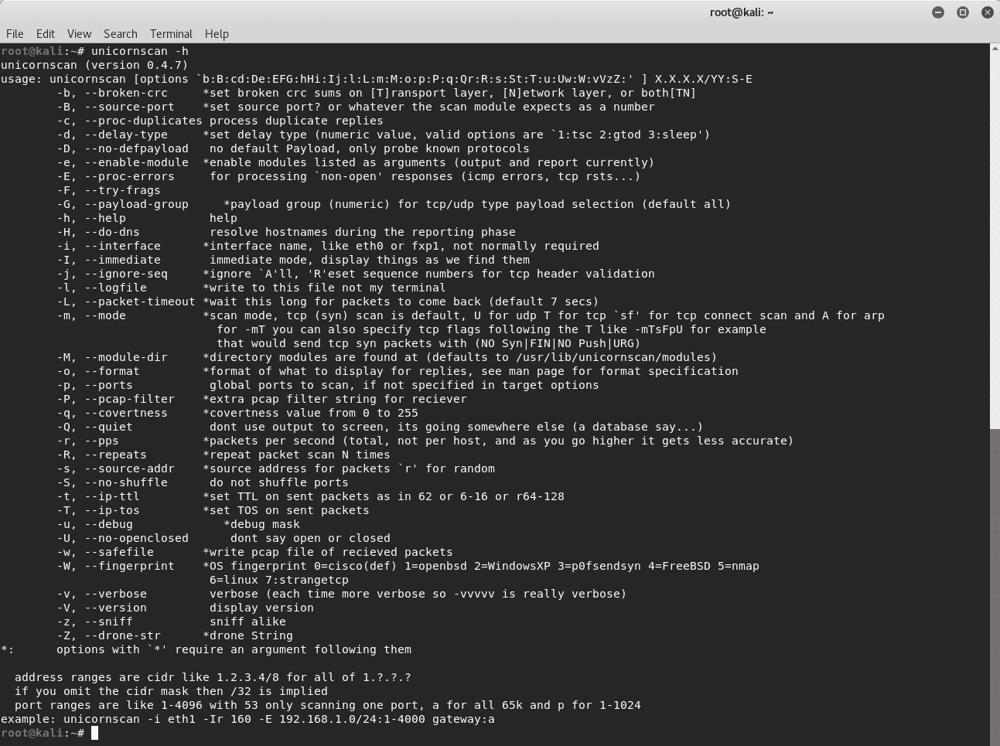
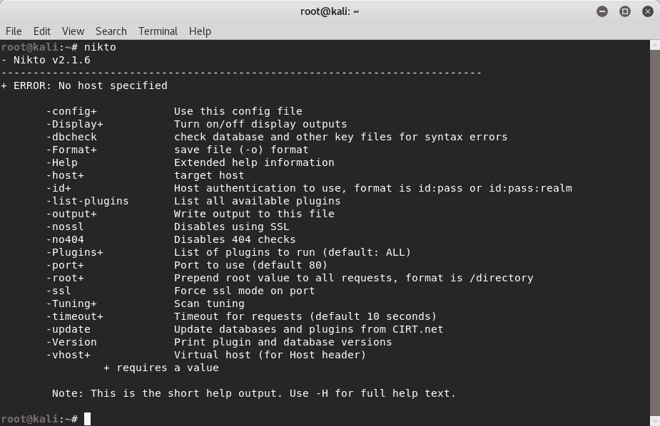
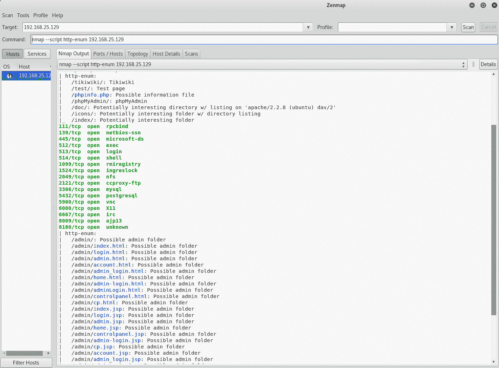
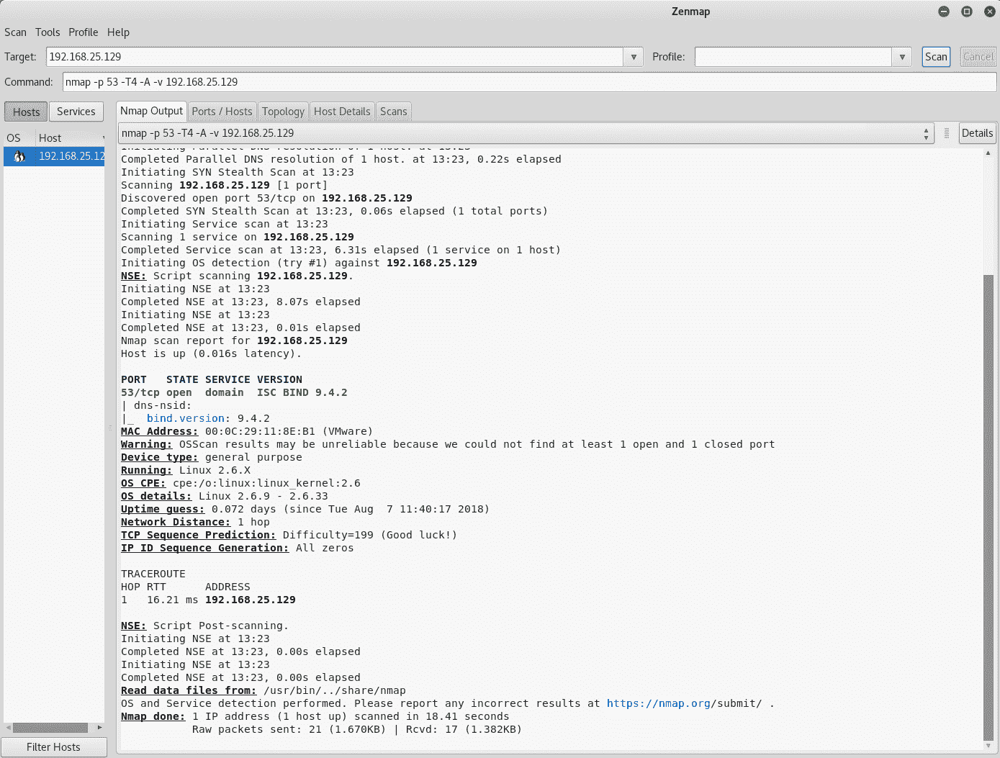
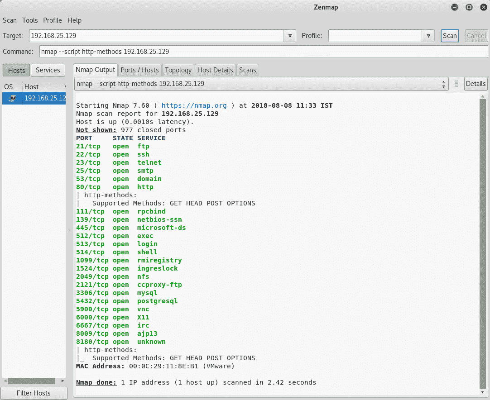
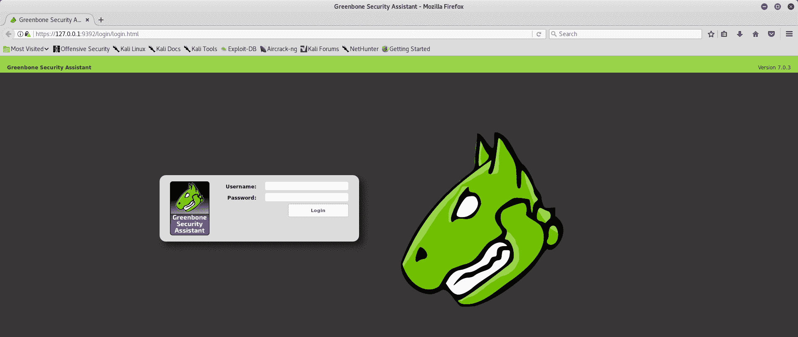
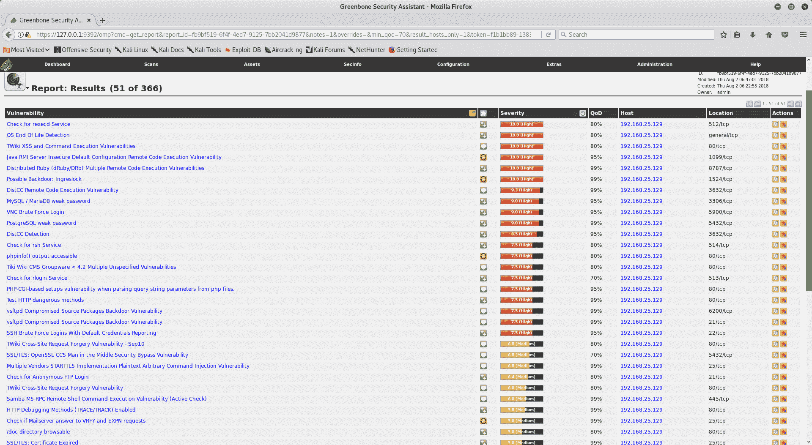

# 枚举和漏洞评估

本章是关于探索枚举范围内目标的各种工具和技术，并对其进行漏洞评估。

读者将学习如何使用本章讨论的各种工具和技术枚举目标系统，并将学习如何使用专门的工具（如 OpenVAS）来评估漏洞。

本章将涵盖以下主题：

+   什么是枚举

+   枚举服务

+   使用 Nmap 脚本

+   使用 OpenVAS 进行漏洞评估

# 什么是枚举？

我们已经在上一章中看到了信息收集的重要性。一旦我们对目标有了一些基本信息，枚举就是下一个逻辑步骤。例如，假设国家 A 需要对国家 B 发动攻击。现在，国家 A 进行了一些侦察工作，并得知国家 B 有 25 枚能够进行还击的导弹。现在，国家 A 需要确切地了解国家 B 的导弹是什么类型、制造商和型号。这种枚举将帮助国家 A 更精确地制定攻击计划。

同样，在我们的情况下，假设我们已经知道我们的目标系统在端口`80`上运行某种 Web 应用程序。现在我们需要进一步枚举它是什么类型的 Web 服务器，应用程序使用的是什么技术，以及其他相关细节。这将帮助我们选择准确的漏洞利用并攻击目标。

# 枚举服务

在开始枚举目标上的服务之前，我们将在目标系统上进行快速端口扫描。这次，我们将使用一个名为**Unicornscan**的工具，如下截图所示：



端口扫描返回了我们目标系统上开放端口的列表，如下截图所示：


现在我们已经获得了目标系统上开放端口的列表，下一个任务是将这些开放端口对应的服务进行关联，并进一步枚举它们的版本。枚举服务非常关键，因为它为进一步的攻击奠定了坚实的基础。在本节中，我们将讨论使用 Nmap 枚举各种服务的技术。 

# HTTP

**超文本传输协议**（**HTTP**）是用于提供网络内容的最常见的协议。默认情况下，它在端口`80`上运行。枚举 HTTP 可以揭示许多有趣的信息，包括它正在提供的应用程序。

Nikto 是一个专门用于枚举 HTTP 服务的工具，它是默认 Kali Linux 安装的一部分。以下截图显示了 Nikto 工具中各种可用选项：



我们可以使用`nikto -host <目标 IP 地址>`命令来枚举 HTTP 目标，如下截图所示：


Nmap 也可以有效地用于枚举 HTTP。以下截图显示了使用 Nmap 脚本执行的 HTTP 枚举。语法如下：

```
nmap --script http-enum <Target IP address>
```



`http-enum` Nmap 脚本的输出显示了服务器信息以及各种有趣的目录，可以进一步探索。

# FTP

**文件传输协议**（**FTP**）是用于在系统之间传输文件的常用协议。FTP 服务默认在端口`21`上运行。枚举 FTP 可以揭示有趣的信息，如服务器版本以及是否允许匿名登录。我们可以使用 Nmap 来枚举 FTP 服务，语法如下：

```
nmap -p 21 -T4 -A -v <Target IP address>
```

以下截图显示了使用 Nmap 枚举 FTP 的输出。它显示 FTP 服务器是 vsftpd 2.3.4，并且允许匿名登录：


# SMTP

**简单邮件传输协议**（**SMTP**）是负责传输电子邮件的服务。该服务默认运行在端口`25`上。枚举 SMTP 服务以了解服务器版本以及其接受的命令是有用的。我们可以使用以下 Nmap 语法来枚举 SMTP 服务：

```
nmap -p 25 -T4 -A -v <Target IP address>
```

以下截图显示了我们发出的枚举命令的输出。它告诉我们 SMTP 服务器是 Postfix 类型，并给出了它接受的命令列表：


# SMB

**服务器消息块**（**SMB**）是一个非常常用的用于共享文件、打印机、串口等服务。从历史上看，它一直容易受到各种攻击。因此，枚举 SMB 可以为进一步精确的攻击计划提供有用的信息。为了枚举 SMB，我们将使用以下语法并扫描端口`139`和`445`：

```
nmap -p 139,445 -T4 -A -v <Target IP address>
```

以下截图显示了我们的 SMB 枚举扫描的输出。它告诉我们正在使用的 SMB 版本和工作组详细信息：


# DNS

**域名系统**（**DNS**）是最广泛使用的用于将域名转换为 IP 地址和反之的服务。DNS 服务默认运行在端口`53`上。我们可以使用以下 Nmap 语法来枚举 DNS 服务：

```
nmap -p 53 -T4 -A -v <Target IP address>
```

以下截图显示了目标系统上 DNS 服务器的类型是 ISC bind 版本 9.4.2：



# SSH

**安全外壳**（**SSH**）是用于在两个系统之间安全传输数据的协议。这是 Telnet 的有效和安全替代方案。SSH 服务默认运行在端口`22`上。我们可以使用以下 Nmap 语法来枚举 SSH 服务：

```
nmap -p 22 -T4- A -v <Target IP address>
```

以下截图显示了我们执行的 SSH 枚举命令的输出。它告诉我们目标正在运行 OpenSSH 4.7p1：


# VNC

**虚拟网络计算**（**VNC**）主要用于远程访问和管理的协议。VNC 服务默认运行在端口`5900`上。我们可以使用以下 Nmap 语法来枚举 VNC 服务：

```
nmap -p 5900 -T4 -A -v <Target IP address>
```

以下截图显示了我们执行的 VNC 枚举命令的输出。它告诉我们目标正在运行协议版本为 3.3 的 VNC：


# 使用 Nmap 脚本

Nmap 不仅仅是一个普通的端口扫描程序。它在提供的功能方面非常多样化。Nmap 脚本就像附加组件，可以用于执行额外的任务。实际上有数百个这样的脚本可用。在本节中，我们将看一些 Nmap 脚本。

# http-methods

`http-methods`脚本将帮助我们枚举目标 Web 服务器上允许的各种方法。使用此脚本的语法如下：

```
nmap --script http-methods <Target IP address>
```

以下截图显示了我们执行的 Nmap 脚本的输出。它告诉我们目标 Web 服务器允许 GET、HEAD、POST 和 OPTIONS 方法：



# smb-os-discovery

`smb-os-discovery`脚本将帮助我们根据 SMB 协议枚举操作系统版本。使用此脚本的语法如下：

```
nmap --script smb-os-discovery <Target IP address>
```

以下截图显示了枚举输出，告诉我们目标系统正在运行基于 Debian 的操作系统：


# http-sitemap-generator

`http-sitemap-generator`脚本将帮助我们创建目标 Web 服务器上托管的应用程序的分层站点地图。使用此脚本的语法如下：

```
nmap --script http-sitemap-generator <Target IP address>
```

以下截图显示了在目标 Web 服务器上托管的应用程序生成的站点地图：


# mysql-info

`mysql-info`脚本将帮助我们枚举 MySQL 服务器，并可能收集服务器版本、协议和盐等信息。使用此脚本的语法如下：

```
nmap --script mysql-info <Target IP address>
```

下面的屏幕截图显示了我们执行的 Nmap 脚本的输出。它告诉我们目标 MySQL 服务器版本是`5.0.51a-3ubuntu5`，还告诉了盐的值：


# 使用 OpenVAS 进行漏洞评估

现在我们已经熟悉了枚举，下一个逻辑步骤是执行漏洞评估。这包括探测每个服务可能存在的开放漏洞。有许多商业和开源工具可用于执行漏洞评估。一些最受欢迎的工具包括 Nessus、Nexpose 和 OpenVAS。

OpenVAS 是一个由多个工具和服务组成的框架，提供了一种有效和强大的漏洞管理解决方案。有关 OpenVAS 框架的更详细信息，请访问[`www.openvas.org/`](http://www.openvas.org/)。

最新的 Kali Linux 发行版默认不包含 OpenVAS。因此，您需要手动安装和设置 OpenVAS 框架。以下是您可以在 Kali Linux 或任何基于 Debian 的 Linux 发行版上使用的一组命令：

```
root@kali:~#apt-get update
root@kali:~#apt-get install openvas
root@kali:~#openvas-setup
```

在终端中运行上述命令后，OpenVAS 框架应该已经安装并准备就绪。您可以通过浏览器访问`https://localhost:9392/login/login.html`URL，如下面的屏幕截图所示：



输入凭据后，您可以看到初始仪表板，如下面的屏幕截图所示：


现在是时候开始第一次漏洞扫描了。为了启动漏洞扫描，打开任务向导，如下面的屏幕截图所示，并输入要扫描的目标的 IP 地址：


一旦在任务向导中输入了目标 IP 地址，扫描就会触发，并且可以跟踪进度，如下面的屏幕截图所示：


在扫描进行中，您可以查看仪表板，以获取扫描期间发现的漏洞的摘要，如下面的屏幕截图所示：


扫描完成后，您可以检查结果，查看所有详细的发现以及严重级别。您可以单击每个漏洞以获取更多详细信息，如下面的屏幕截图所示：



# 摘要

在本章中，我们学习了枚举的重要性，以及在目标系统上执行有效枚举的各种工具和技术。我们还概述了 OpenVAS 漏洞管理框架，该框架可用于执行有针对性的漏洞评估。
