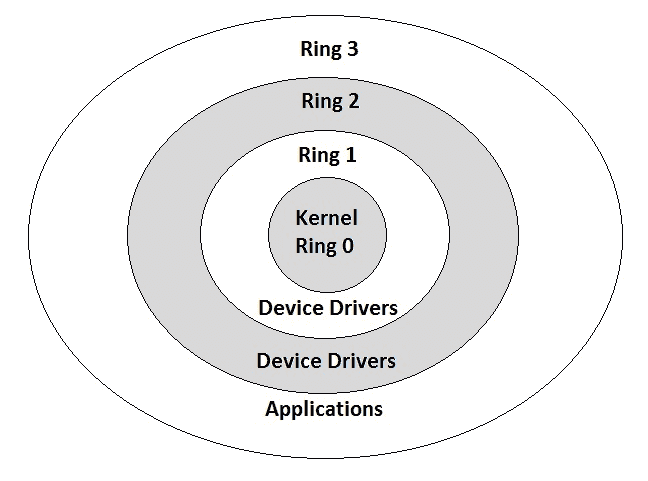
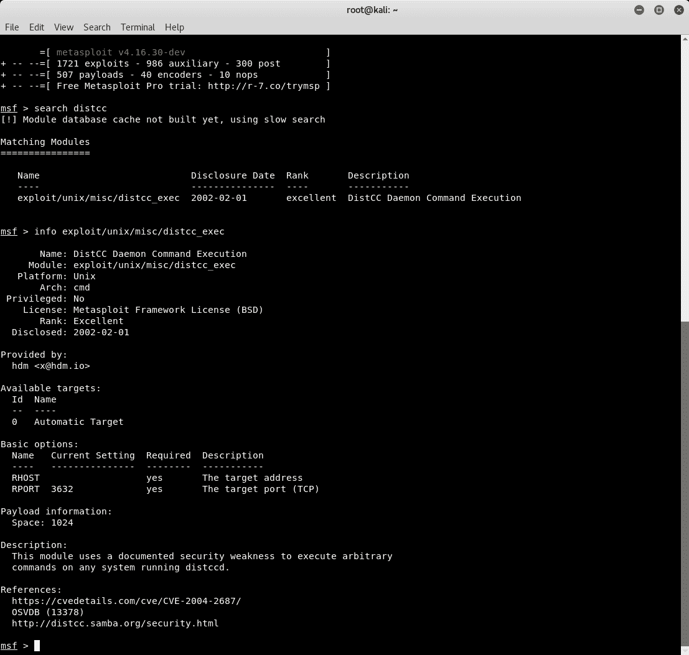

# 权限升级

在上一章中，我们学习了有关 Web 应用程序安全的各个方面。在本章中，我们将讨论与权限升级相关的各种概念。我们将熟悉各种权限升级概念，以及在受损的 Windows 和 Linux 系统上提升权限的实际技术。

我们将在本章中涵盖以下主题：

+   定义权限升级

+   水平与垂直权限升级

+   Windows 上的权限升级

+   Linux 上的权限升级

# 什么是权限升级？

在我们深入讨论权限升级的任何技术细节之前，让我们首先对权限有一些基本的了解。单词*privilege*的字面字典意思是特权、优势或豁免，只授予或仅对特定人或团体可用。在计算世界中，权限是由操作系统管理的。在单个系统上可能有十个用户，但并非所有用户都具有相同级别的权限。根据安全最佳实践，通常遵循最小权限原则。这意味着每个用户只被分配绝对必要的最低权限来执行其任务。这个原则有助于消除滥用不必要的过多权限的可能性。

在安全评估的背景下，权限升级变得非常重要。假设您成功地利用了远程系统中的漏洞并获得了 SSH 访问权限。但是，由于您已经妥协的用户权限有限，您的操作受到了限制。现在，您肯定希望拥有最高级别的权限，以便您可以探索受损系统的各个方面。权限升级将普通用户的权限提升到具有最高权限的用户。完成后，您将完全控制受损的系统。

要了解权限如何工作的一些基础知识，以下图表显示了各种保护环：



这张图表显示了四个环：

+   **环 0**：属于操作系统的内核，具有最高的权限。

+   **环 1 和环 2**：主要由设备驱动程序使用，它们在操作系统和各种硬件设备之间进行接口。这些环具有很好的权限，但低于**环 0**。

+   **环 3**：大多数我们的最终应用程序运行的地方。它们拥有最低的权限。

因此，在权限升级的情况下，如果您想利用应用程序漏洞并访问**环 3**，那么您需要找到一种方法将权限提升到更高的环。在 Windows 环境中，具有最高权限的用户通常被称为**管理员**，而在 Linux 环境中，具有最高权限的用户被称为**root**。

# 水平与垂直权限升级

正如我们在前一节中看到的，权限升级意味着获得未经授权的权限。权限升级可以是水平或垂直的两种类型之一。


# 水平权限升级

参考前面的图表；总共有四个用户：三个普通用户和一个管理员。用户按照其层次显示。现在，如果**普通用户 1**能够访问**普通用户 2**的数据，这将被称为水平权限升级，因为两个用户在层次结构中处于相同的级别。

# 垂直权限升级

关于前面的图表，如果**普通用户 1**能够访问数据并获得**管理员**的权限，这将被称为垂直权限升级。**普通用户 1**和**管理员**在层次结构中处于不同的级别。

# Windows 上的权限升级

正如我们在前一节中看到的，在 Windows 系统上，拥有最高特权的用户被称为**管理员**。一旦我们使用任何可用的利用程序来入侵系统，我们的目标应该是将用户特权提升到管理员级别。

下面的截图显示了对 Windows XP 目标利用`ms08_067_netapi`漏洞的过程。Metasploit 成功利用了漏洞，并提供了一个 meterpreter 会话，如下面的截图所示：


Meterpreter 为我们提供了提升特权的能力。`getsystem`命令专门用于提升已受损的 Windows 系统的特权。下面的截图显示了使用`getsystem`命令以获取目标系统上管理员级别特权的过程：


# 在 Linux 上的特权升级

在本节中，我们将看到如何利用 Linux 系统中的漏洞，然后提升我们的特权。我们将使用 Metasploitable 2 作为我们的目标。

在我们甚至考虑提升特权之前，我们必须至少具有对目标系统的普通级别访问权限。在这种情况下，我们的目标系统的 IP 地址是`192.168.25.129`。我们首先启动 SPARTA，以快速收集有关我们目标的一些信息。我们将目标 IP 添加到 SPARTA 扫描的范围内，如下面的截图所示：


一旦 SPARTA 扫描完成，我们就可以知道目标系统上运行着哪些服务。现在我们发现目标系统正在运行一个名为`distccd`的服务（如下面的截图所示），这是一个用于源代码编译的分布式计算应用程序：


现在我们知道要利用的服务，我们将打开 Metasploit 控制台，查找与`distcc`相关的任何利用程序。



我们得到一个名为`distcc_exec`的利用程序，在 Metasploit 中已经准备好。现在我们使用`show options`命令查找需要配置的参数。然后我们设置`RHOST`（目标）参数的值，并执行`exploit`命令：


利用成功，并为我们提供了一个远程命令 shell。但是，该 shell 的特权有限，现在我们需要提升特权到 root。使用`uname`命令，我们得知目标基于 Linux 内核 2.6.X。因此，我们需要找出适合该内核版本的特权提升利用程序。我们可以使用`searchsploit`实用程序搜索特定的利用程序。以下命令将列出我们需要的利用程序：

```
searchsploit privilege | grep -i linux | grep -i kernel | grep 2.6 | grep 8572
```

现在我们可以在目标系统上使用`wget`命令下载利用程序，如下面的截图所示。下载后，我们使用以下命令在本地编译利用程序：

```
gcc -o exploit 8572.c 
```


在我们的 Kali Linux 系统上，我们使用以下命令在端口`12345`上启动 Netcat 监听器：

```
nc -lvp 12345
```

一旦在目标系统上执行了利用程序，我们就会在 Kali 系统上获得一个具有 root 权限的反向 shell，如下面的截图所示。因此，我们已成功将权限从普通用户提升为 root：


# 总结

在本章中，我们了解了特权在各种平台（如 Windows 和 Linux）上的重要性，以及在渗透测试期间提升特权的相关性。
