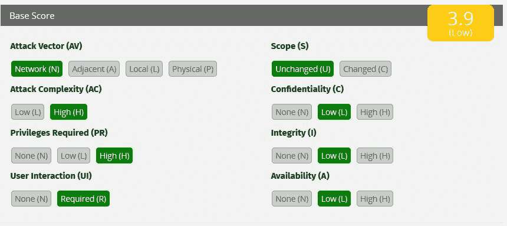
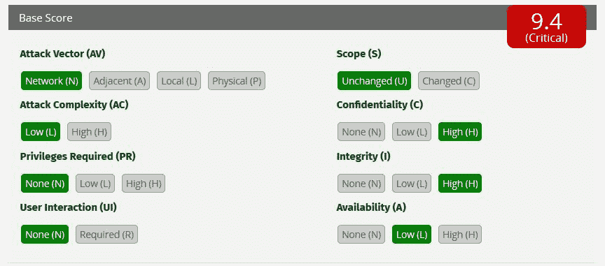

# 漏洞评分

本章是关于理解正确漏洞评分的重要性。我们将了解标准漏洞评分的需求，并获得使用**通用漏洞评分系统**（CVSS）对漏洞进行评分的实际知识。

本章将涵盖以下主题：

+   漏洞评分的要求

+   使用 CVSS 进行漏洞评分

+   CVSS 计算器

# 漏洞评分的要求

拿任何现代网络进行漏洞扫描。你会感到不知所措，并发现大量的漏洞。现在，如果你继续对网络进行扫描，比如每月一次，那么你的漏洞清单将迅速增长。如果将所有这些漏洞如实呈现给高级管理人员，那将毫无帮助。高级管理人员更感兴趣的是一些具体的、可操作的信息。

典型的漏洞扫描器可能会在特定系统中发现 100 个漏洞。在 100 个漏洞中，可能有 30 个是误报，25 个是信息性的，25 个是低严重性的，15 个是中等严重性的，5 个是高严重性的漏洞。自然而然地，在 100 个报告的漏洞中，5 个高严重性的漏洞应该作为优先处理。其余的可以根据资源的可用性稍后处理。

因此，除非漏洞得分，否则无法为其分配严重性评级，因此也无法为其进行优先修复。高级管理人员也会对组织内的最高严重性漏洞感兴趣。因此，对漏洞进行评分将有助于获得高级管理人员在项目可见性和资源管理方面的正确关注和支持。如果不进行评分，将无法对漏洞进行优先处理和关闭。

# 使用 CVSS 进行漏洞评分

漏洞评分确实是一个非常主观的问题。它取决于上下文和评分漏洞的人的专业知识。因此，在没有任何标准系统的情况下，对同一个漏洞进行评分可能会因人而异。

CVSS 是一个用于评分漏洞的标准系统。在得出最终评分之前，它考虑了几个不同的参数。使用 CVSS 具有以下好处：

+   它提供了标准化和一致的漏洞评分

+   它提供了一个开放的漏洞评分框架，使得评分的个体特征透明化

+   CVSS 有助于风险优先级排序

为了简化目的，CVSS 指标被分类为各种组，如下图所示：

我们将在接下来的章节中简要介绍每个指标类别。

# 基本指标组

基本指标组定义了给定漏洞的一些固定特征，这些特征随时间和用户环境保持不变。基本指标组被分类为两个子组，如下一节所讨论的。

# 可利用性指标

正如前面提到的，可利用性指标反映了易受攻击的*事物*的特性，我们正式称之为**易受攻击组件**。因此，这里列出的每个可利用性指标都应该相对于易受攻击组件进行评分，并反映导致成功攻击的漏洞的属性。

# 攻击向量

攻击向量只是攻击者成功利用漏洞所采取的路径。攻击向量指标表示漏洞可能被利用的方式。在互联网上远程利用的漏洞的潜在攻击者数量比需要物理访问设备的漏洞的攻击者数量要多，因此指标值会随着攻击者远程利用漏洞的程度而增加。

| **参数** | **描述** | **示例** |
| --- | --- | --- |
| 网络 | 漏洞可能通过网络远程利用。易受攻击的组件连接到网络，攻击者可以通过第 3 层（OSI）访问它。 | 发送特制的 TCP 数据包导致的拒绝服务 |
| 相邻 | 漏洞可以在相同的物理或逻辑网络内被利用。它不能在网络边界之外被利用。 | 蓝牙攻击，ARP 洪泛 |
| 本地 | 易受攻击的组件无论如何都未连接到网络，攻击者必须在本地登录才能利用漏洞。 | 特权升级 |
| 物理 | 只有在攻击者可以物理访问易受攻击的系统/组件时，漏洞才能被利用。 | 冷启动攻击 |

# 攻击复杂度

攻击复杂度度量列出了攻击者无法控制但是利用漏洞所需的所有条件和先决条件。例如，可能存在某个特定漏洞只有在特定版本的应用程序部署在某个特定的操作系统平台上并具有一些自定义设置时才能被利用。只有满足所有这些条件，漏洞利用才可能发生。对于其他一些漏洞，可能无论应用程序版本和基本操作系统的类型如何，都可以利用。因此，条件和先决条件增加了攻击的复杂性，并且因漏洞而异：

| **参数** | **描述** | **示例** |
| --- | --- | --- |
| 低 | 不存在任何可能阻碍攻击者重复成功利用易受攻击的组件的特定条件或先决条件。 | 发送特制的 TCP 数据包导致的拒绝服务 |
| 高 | 攻击的成功依赖于攻击者无法控制的特定条件。因此，攻击者不能随心所欲地发动成功的攻击，需要在准备攻击方面付出相当大的努力。 | 涉及随机令牌、序列号等攻击 |

# 所需特权

所需特权度量定义了攻击者必须具有的特权级别，以成功利用漏洞。可能存在一些漏洞可以在正常特权级别下被利用，而其他可能严格要求 root 或管理员级别的特权才能成功利用：

| **参数** | **描述** |
| --- | --- |
| 无 | 攻击者不需要任何先前特权或访问权限来执行攻击。 |
| 低 | 攻击者需要有限或最低特权才能成功执行攻击。 |
| 高 | 攻击者需要显著的特权，如管理员或根权限，才能利用易受攻击的组件。 |

# 用户交互

用户交互度指示目标用户除了攻击者的行动之外需要执行的操作，以成功利用漏洞。一些漏洞可能仅由攻击者利用，而其他可能需要额外的用户交互/参与：

| **参数** | **描述** | **示例** |
| --- | --- | --- |
| 无 | 攻击者可以在不需要受害者/用户任何交互的情况下利用易受攻击的系统/组件。 | 发送特制的 TCP 数据包导致的拒绝服务 |
| 必需 | 攻击者需要受害者（用户）执行某种操作才能利用漏洞。 | 无线点击攻击，点击劫持 |

# 范围

CVSS 3.0 允许我们捕获组件漏洞的指标，这也会影响其范围之外的资源。范围指的是受漏洞影响的脆弱组件的哪些部分或者利用漏洞会影响哪些关联。范围由授权机构分隔。漏洞可能会影响相同授权机构内或不同授权机构内的组件。例如，允许攻击者修改基础（主机）系统文件的虚拟机中的漏洞将包括两个系统在范围内，而允许攻击者修改系统主机文件的 Microsoft Word 中的漏洞将属于单一授权机构：

| **参数** | **描述** |
| --- | --- |
| 未更改 | 利用漏洞只会影响受影响组件管理的资源 |
| 更改 | 利用漏洞可能会影响脆弱组件边界之外的资源 |

# 影响度指标

影响度指标表示受影响组件的机密性、完整性和可用性等各种属性。

# 机密性影响

机密性影响表示成功利用漏洞后信息机密性的影响：

| **参数** | **描述** |
| --- | --- |
| 高 | 完全丧失机密性，导致攻击者完全访问资源。例如，对密码的攻击和窃取私人加密密钥可能导致机密性完全丧失。 |
| 低 | 机密性有限损失。虽然获取了机密信息，但攻击者无法完全控制获取的信息。 |
| 无 | 受影响组件内机密性没有影响。 |

# 完整性影响

完整性影响指标表示成功利用漏洞后信息完整性的影响：

| **参数** | **描述** |
| --- | --- |
| 高 | 完全丧失完整性。例如，攻击者能够修改受影响组件保护的所有文件。如果攻击者能够部分修改信息，这将导致严重后果。 |
| 低 | 虽然数据可能被修改，但攻击者无法完全控制修改的数量或后果。受影响组件没有严重影响。 |
| 无 | 受影响组件内完整性没有影响。 |

# 可用性影响

可用性影响指标表示成功利用漏洞后受影响组件的可用性影响。可用性的丧失可能是由于网络服务停止，如 Web、数据库或电子邮件。所有倾向于消耗网络带宽、处理器周期或磁盘空间资源的攻击都可以由此指标表示：

| **参数** | **描述** |
| --- | --- |
| 高 | 完全丧失可用性，导致无法访问受影响组件的资源 |
| 低 | 资源可用性受到有限影响 |
| 无 | 受影响组件内可用性没有影响 |

# 时间度量组

时间度量指标表示各种利用技术、补丁或解决方法的现有状态，或者对漏洞存在的程度的信心。

# 利用代码成熟度

利用代码成熟度指标表示漏洞被利用的可能性，取决于现有的利用技术状态和代码可用性。

一些利用代码可能是公开可用的，使它们易于许多攻击者访问。这增加了漏洞被利用的可能性。注意以下参数：

| **参数** | **描述** |
| --- | --- |
| 未定义 | 将此值分配给指标不会影响分数。它只是指示评分方程跳过此指标。 |
| 高 | 存在功能自主代码，或者不需要利用（手动触发）并且详细信息广泛可用。 |
| 功能 | 功能性利用代码可用，并且在大多数情况下有效。 |
| 概念验证 | 概念验证明显可用。代码可能在所有情况下都不起作用，并且可能需要熟练攻击者进行大量编辑。 |
| 未经证实 | 利用代码不可用或利用只是假设的。 |

# 修复级别

修复级别度量标准表示可用于减轻漏洞的修复、补丁或解决方法的级别。它可以帮助优先处理漏洞修复：

| **参数** | **描述** |
| --- | --- |
| 未定义 | 将此值分配给度量标准不会影响分数。它只是指示评分方程跳过此度量标准。 |
| 不可用 | 不存在解决方案或者无法应用解决方案。 |
| 绕过 | 存在非官方的、非供应商的修复；这可能是一种内部补丁。 |
| 临时修复 | 官方的临时修复存在；可能以快速修复/热修复的形式存在。 |
| 官方修复 | 存在完整且经过测试的修复，并且供应商已正式发布。 |

环境度量标准仅在分析人员需要在受影响组织的特定领域定制 CVSS 分数时使用。您可以在[`www.first.org/cvss/cvss-v30-specification-v1.8.pdf`](https://www.first.org/cvss/cvss-v30-specification-v1.8.pdf)上阅读更多关于环境度量标准的信息。

# 报告信心

报告信心度量标准表示对漏洞存在和资源以及技术细节的真实性的信心水平。可能某个特定漏洞发布时没有额外的技术细节。在这种情况下，根本原因和影响可能是未知的：

| **参数** | **描述** |
| --- | --- |
| 未定义 | 将此值分配给度量标准不会影响分数。它只是指示评分方程跳过此度量标准。 |
| 确认 | 存在全面的报告或漏洞/问题可以在功能上重现。可能有源代码可用于手动验证研究结果，或者受影响代码的作者/供应商已确认漏洞的存在。 |
| 合理 | 已发布了相当多的细节，但研究人员对根本原因并不完全有信心。研究人员可能无法访问源代码以确认研究结果。 |
| 未知 | 有关漏洞存在的报告；然而，其原因是未知的。对漏洞的真实性存在不确定性。 |

# CVSS 计算器

在前面的部分中，我们看了计算最终 CVSS 分数所考虑的各种度量标准类别。在计算分数时考虑这么多值可能看起来令人不知所措。然而，通过使用在线 CVSS 计算器，这项任务变得很容易。它可以在[`www.first.org/cvss/calculator/3.0`](https://www.first.org/cvss/calculator/3.0)上访问。

在线 CVSS 计算器具有所有必需的参数，您需要根据您的环境和漏洞上下文选择合适的参数。完成后，最终分数将自动填充。

以下屏幕截图显示了在为任何参数选择值之前的 CVSS 计算器：

考虑一个可能在网络上远程利用的漏洞，执行起来非常复杂，需要高权限账户，并且需要目标用户的某种互动，同时对机密性、完整性和可用性的影响很小。在这种情况下，CVSS 分数将是 3.9，并被评为低，如下图所示：

让我们考虑另一个可能在网络上远程利用的漏洞；然而，它非常容易执行。它需要低或正常的账户权限，并需要目标用户的某种交互，而对机密性、完整性和可用性的影响很小。在这种情况下，CVSS 评分将为 5.5，并被评为中等，如下面的屏幕截图所示：

让我们考虑另一个可能在网络上远程利用的漏洞。然而，它非常容易执行，不需要任何特定的账户权限，也不需要目标用户的任何交互。如果漏洞成功被利用，对机密性和完整性的影响将很大，而可用性的影响将很小。在这种情况下，CVSS 评分将为 9.4，并被评为关键，如下面的屏幕截图所示：

# 摘要

在本章中，我们了解了漏洞评分的重要性以及评分任何给定漏洞需要考虑的各种参数。
