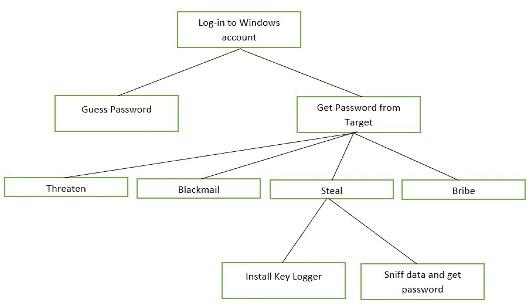
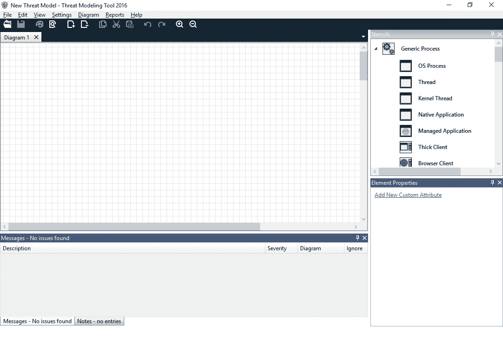
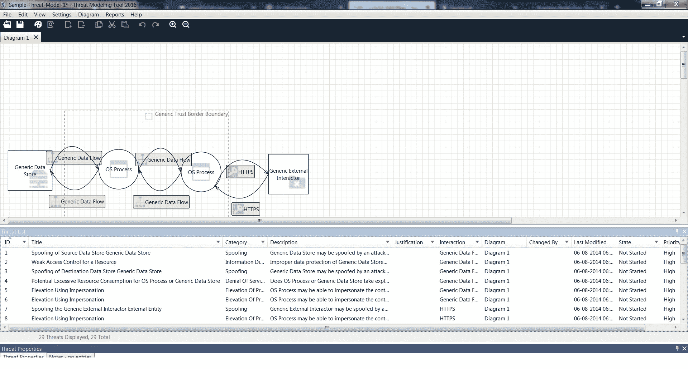
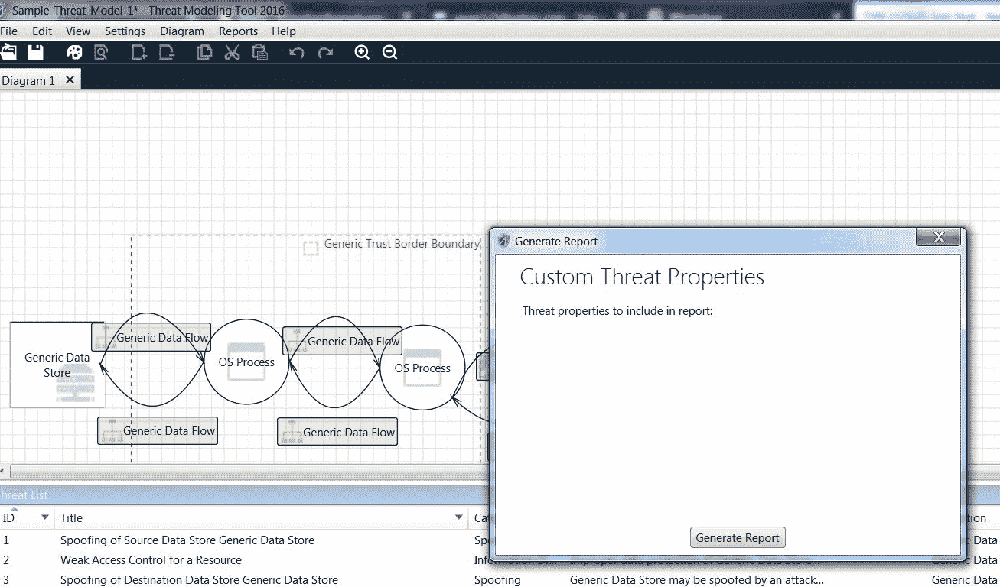
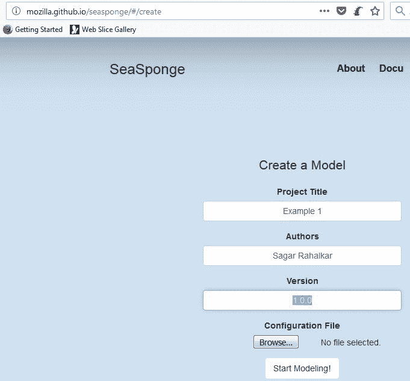
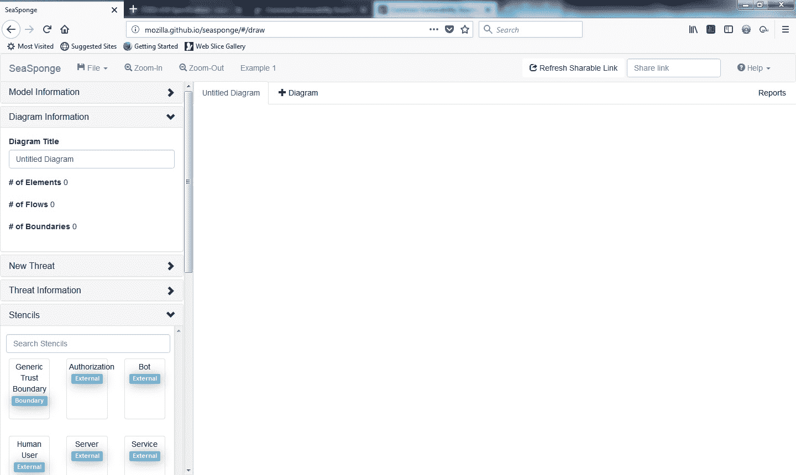

# 威胁建模

本章是关于理解和准备威胁模型。您将了解威胁建模的基本概念，并获得使用各种威胁建模工具的实际知识。

我们将在本章中涵盖以下主题：

+   定义威胁建模

+   威胁建模的好处

+   威胁建模术语

+   执行威胁建模的逐步程序

+   威胁建模的技术-STRIDE、PASTA、DREAD

+   微软威胁建模工具和 SeaSponge

# 什么是威胁建模？

**威胁建模**这个术语，起初可能听起来非常复杂和繁琐。然而，一旦理解，它确实是一个简单的任务。我们将在本章中通过适当的插图来简化威胁建模的概念。

让我们试着分解这两个词，威胁和模型。以下是这两个词的词典含义：

+   **威胁**：可能造成损害或危险的人或事物

+   **模型**：作为跟随或模仿的示例使用的系统或事物

现在，再次结合这两个词，它们共同意味着什么？**威胁建模**只不过是一种正式的方式来识别潜在的安全问题。

让我们举一个非常简单的例子来理解这一点。

以下图表描述了一座堡垒：

这座堡垒是国王居住的地方，需要严格的安全措施来对抗他的敌人。因此，建筑师在设计堡垒的结构时，也需要考虑可能危及堡垒安全的各种威胁。

一旦建筑师确定了可能的威胁，他们就可以通过各种可能的手段来减轻威胁。堡垒的一些威胁可能是以下的：

+   敌人通过后方攻击，那里的堡垒防守较弱

+   敌人向堡垒的墙壁发射炮弹

+   由于极端天气导致堡垒墙壁的腐蚀和磨损

+   敌方大象强行打破堡垒的主入口门

我们刚刚为一座古老的堡垒准备了一个威胁模型。这很简单；我们试图想出所有可能的方式，通过这些方式堡垒的安全可能会被故意或无意地破坏。同样，在建造总统府或任何重要的行政办公室时，都必须准备威胁模型。

从前面的例子中，我们可以理解威胁建模是一个通用的概念，可以应用于任何需要安全的领域或领域。由于本书涉及信息安全，我们将讨论如何为给定的信息系统准备威胁模型。

如果在开发生命周期的设计阶段进行威胁建模，那么威胁建模可能会最有效和有益。在 SDLC 的后期阶段修复错误的成本显著上升。

威胁建模在软件开发生命周期中非常常用。它使软件开发过程中的参与者能够高效地创建和交付安全软件，并更有信心地了解和考虑所有可能的安全缺陷。

# 威胁建模的好处

对于任何给定的项目，了解可能妨碍整体进展的威胁总是有帮助的。威胁建模正是做同样的事情。威胁建模的一些好处包括：

+   威胁建模通过设计本身就能够产生安全的软件-如果在设计阶段正确进行威胁建模，那么最终产品将在很大程度上对抗大多数常见的潜在威胁。

+   威胁建模允许我们以更有结构的方式思考和讨论产品安全-威胁建模提供了一种更正式和有结构的方式来列举和记录安全威胁，而不是以临时方式讨论安全威胁。

+   威胁建模允许开发团队在 SDLC 过程的早期有效地识别和定义安全缺陷。

+   威胁建模允许我们记录和分享应用程序安全知识——随着技术的快速升级，威胁形势也在快速变化。持续的威胁建模练习将有助于确保最新的威胁被考虑并预期用于设计缓解控制措施。

+   威胁建模增加了客户对安全的信心——威胁建模过程的文档化证据肯定会增强客户对系统安全的信心。

+   持续的威胁建模练习将有助于减少整体攻击面积。

+   威胁建模有助于量化安全控制，使其更实际地与安全预算保持一致。

# 威胁建模术语

在我们深入讨论如何建模威胁之前，我们必须熟悉威胁建模过程中使用的一些常见术语。一些常见术语如下：

+   **资产**: 资产可以是有价值的任何资源。资产可以是有形的或无形的。例如，数据中心中的大型计算机可能是有形资产，而组织的声誉可能是无形资产。

+   **攻击**: 当参与者或威胁代理利用系统中的一个或多个漏洞采取行动时，就会发生攻击。例如，当有人利用跨站脚本漏洞窃取用户 cookie 和会话 ID 时，可能会发生应用程序会话劫持攻击。

+   **攻击向量**: 攻击向量是攻击者成功损害系统所采取的路径。例如，向受害者发送带有恶意附件的电子邮件可能是一种可能的攻击向量。

+   **攻击面**: 攻击面基本上标记了需要在列举威胁时考虑的范围内组件。攻击面可以是逻辑的或物理的。

+   **对策**: 简单来说，对策有助于解决或减轻漏洞，从而降低攻击的可能性，进而降低威胁的影响。例如，安装防病毒软件可以是应对病毒威胁的一种对策。

+   **使用案例**: 使用案例是符合业务需求的正常功能情况。例如，允许最终用户选择喜欢的颜色的下拉菜单可能是应用程序的使用案例之一。

+   **滥用案例**: 当用户（参与者）故意滥用功能使用案例以达到意外结果时，称为滥用案例。例如，攻击者可能向最大长度为 20 的输入字段发送 1000 个字符。

+   **参与者或威胁代理**: 参与者或威胁代理可能是使用或滥用案例的合法或不利用户。例如，使用有效凭据登录应用程序的普通最终用户是一个参与者，而使用 SQL 注入登录应用程序的攻击者也是一个参与者（威胁代理）。

+   **影响**: 简单来说，影响是成功攻击后的损害价值。它可以是有形的或无形的。如果系统中的财务数据被突破，可能会产生收入影响，而如果公司网站被篡改，可能会产生声誉影响。

+   **攻击树**: 攻击树以可视化方式展示了成功攻击或损害目标的各种路径。以下图表显示了获取对 Windows 系统访问的样本攻击树：

+   **数据流图**: 用于可视化系统各组件之间的交互的各种类型的图表。尽管有不同类型的威胁建模图表，但最常用的类型是**数据流图**（**DFD**）。DFD 用于显示应用程序的主要组件以及这些组件之间的信息流动。DFD 还显示了信任边界，显示了可信信息和在应用程序中使用时需要额外注意的信息之间的分离。

# 如何建模威胁？

威胁建模的过程可以根据多种因素而变化。然而，一般来说，威胁建模过程可以分解为以下步骤：

1.  **安全目标的识别**: 在实际开始威胁建模之前，了解进行威胁建模练习背后的目标是非常重要的。可能存在某些需要解决的合规性或监管要求。一旦了解了驱动因素，就更容易在过程中可视化可能的威胁。

1.  **资产和外部因素/依赖的识别**: 除非我们确切知道我们要保护什么，否则就不可能列举出威胁。识别资产有助于建立进一步建模过程的基础。资产需要受到攻击者的保护，并且可能需要优先考虑采取对策。还需要识别可能的外部实体或依赖关系，这些可能不是系统的直接部分，但仍可能对系统构成威胁。

1.  **信任区域的识别**: 一旦确定了资产和外部依赖关系，下一步就是识别所有入口点和出口点以及信任区域。这些信息可以有效用于开发带有信任边界的数据流图。

1.  **识别潜在威胁和漏洞**: 威胁建模技术，如 STRIDE（在接下来的部分中讨论），可以给出关于影响给定系统的常见威胁的简要概念。一些例子可能包括 XSS、CSRF、SQL 注入、不正确的授权、破损的身份验证和会话管理漏洞。然后需要识别和评估更容易受到风险的系统区域，例如不足的输入验证、不当的异常处理、缺乏审计日志记录等。

1.  **威胁模型的文档化**: 威胁建模不是一次性的活动；相反，它是一个迭代过程。在每次迭代后全面记录威胁是非常重要的。文档可以为架构师提供关于需要在设计系统时考虑的可能威胁的良好参考，并且还允许他们考虑可能的对策。开发人员也可以在开发阶段参考威胁建模文档，以明确处理某些威胁场景。

# 威胁建模技术

有各种威胁建模技术和方法。STRIDE 和 DREAD 就是其中两种。我们将在接下来的部分学习 STRIDE 和 DREAD 的方法论。

# STRIDE

STRIDE 是微软开发的一种易于使用的威胁建模方法。STRIDE 有助于识别威胁，是以下术语的缩写：

+   **S—欺骗**: 欺骗类的威胁包括对手创建和利用有关某人或某物身份的混淆。

例如，对手发送电子邮件给用户，假装是别人。

+   **T—篡改**: 篡改威胁涉及对手在存储或传输中对数据进行修改。

例如，对手拦截网络数据包，更改支付信息，然后转发给目标。

+   **R—否认**: 否认包括对手执行某种行动，然后事后否认执行了该行动。

例如，对手向受害者发送威胁性邮件，后来否认发送该邮件。

+   **I—信息泄露**：信息泄露威胁涉及对机密信息进行未经授权的访问。

例如，对手使用暴力攻击获取用户的密码。

对手获取了包含许多用户付款信息的数据库。

+   **D—服务拒绝**：服务拒绝威胁涉及拒绝合法用户访问系统或组件。

例如，对手通过发送一个特制的 TCP 数据包导致 Web 服务器崩溃，从而拒绝合法用户访问。

+   **E—权限提升**：权限提升威胁涉及用户或组件能够访问未经授权的数据或程序。

例如，一个甚至没有读取权限的对手也能够修改文件。

一个普通（非特权）账户的对手能够执行管理员级别的任务。

上述威胁清单可以应用于目标模型的组件。多个威胁可以被归类为威胁类别，如下表所示：

| **DREAD 类别** | **威胁示例** |
| --- | --- |
| 伪装 | 攻击者冒充管理员，向组织中的所有用户发送钓鱼邮件。 |
| 篡改 | 攻击者拦截并修改发送到应用程序的数据。 |
| 否认 | 攻击者发送威胁性邮件，后来否认发送该邮件。 |
| 信息泄露 | 攻击者获取包含用户凭据的数据库的明文信息。 |
| 服务拒绝 | 攻击者从多个来源向单个目标发送大量数据包，以使其崩溃。 |
| 权限提升 | 攻击者利用易受攻击的组件来提升权限。 |

# DREAD

虽然 STRIDE 方法可以用于识别威胁，但 DREAD 方法可以有效地对威胁进行评级。DREAD 是以下术语的缩写：

+   **D—损害潜力**：损害潜力因素定义了如果利用成功可能造成的潜在损害。

+   **R—可重现性**：可重现性因素定义了再现利用的容易或困难程度。某些利用可能非常容易再现，而另一个可能由于多个依赖关系而困难。

+   **E—可利用性**：可利用性因素定义了使利用成功所需的确切条件。这可能包括对特定领域的知识，或对某种工具的技能等。

+   **A—受影响的用户**：受影响的用户因素定义了如果利用成功将受到影响的用户数量。

+   **D—可发现性**：可发现性因素定义了考虑中的威胁可以被发现的容易程度。环境中的一些威胁可能很容易被注意到，而另一些可能需要使用额外的技术来揭示。

因此，STRIDE 和 DREAD 可以结合使用，以产生有效和可操作的威胁模型。

# 威胁建模工具

尽管威胁建模可以很容易地用简单的纸和笔完成，但也有一些专门的工具可用于简化整个过程。我们将看看两种可以有效用于建模威胁的工具。

# 微软威胁建模工具

用于威胁建模的最广泛使用的工具是微软威胁建模工具。它可以免费提供给所有人，并可以从[`www.microsoft.com/en-in/download/details.aspx?id=49168`](https://www.microsoft.com/en-in/download/details.aspx?id=49168)下载。

一旦下载并安装，初始屏幕如下所示：

单击“创建模型”开始设计新的威胁模型，如下屏幕截图所示。您将看到一个空白画布，可以继续设计：

右侧窗格如下屏幕截图所示，具有所有必要的元素。您可以简单地将所需的元素拖放到画布中，如下屏幕截图所示：

一旦所有组件都添加并连接，威胁模型应该看起来像下面的屏幕截图所示的样子：

为了为给定的威胁模型列举威胁，选择“查看|分析视图”。分析窗格提供了有关给定威胁模型对应的各种威胁的信息，如下屏幕截图所示：

为了生成威胁报告，选择“报告|创建完整报告”，然后选择

报告的文件名和路径，如下屏幕截图所示：

# SeaSponge

SeaSponge 是另一个项目（这次是由 Mozilla 开发）用于建模威胁。您可以从[`github.com/mozilla/seasponge`](https://github.com/mozilla/seasponge)下载它以供离线使用，或者它还有一个在线版本可用于建模威胁。在线版本位于[`mozilla.github.io/seasponge`](http://mozilla.github.io/seasponge)。

以下屏幕截图显示了 SeaSponge 在线工具的第一个屏幕。我们可以通过单击“创建模型”来开始创建一个新模型：

然后工具会要求一些元数据，如项目标题、作者、版本等，如下屏幕截图所示：

然后工具会为我们提供一个空白画布，左侧窗格会给我们添加组件的选项，如下屏幕截图所示：

我们现在可以根据需要向我们的威胁模型添加不同的元素，如下图所示。

然而，与微软威胁建模工具自动列举可能的威胁不同，SeaSponge 要求用户手动列举并将威胁添加到模型中。

# 摘要

在本章中，我们学习了威胁建模、威胁建模的好处及其术语。我们还学习了不同的威胁建模技术，如 STRIDE 和 DREAD，以及微软威胁建模工具和 SeaSponge 等工具。
